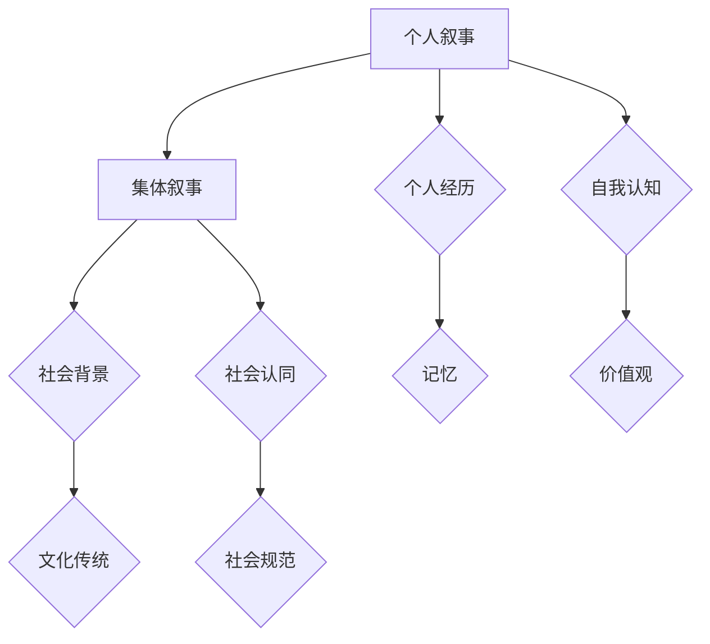

                 

### 1.1 研究背景与意义

#### 1.1.1 个人与集体叙事的概念

个人叙事（Personal Narrative）是指个体通过叙述的方式，将个人经历、思想、情感和价值观等表达出来。它是一个人对自己生活故事的描述，常常包括时间、地点、人物、事件和情感等方面。个人叙事不仅是一种个人表达方式，也是一种自我认知和身份建构的过程。

集体叙事（Collective Narrative），则是指在一个社会群体中共同认同的故事或观念。它反映了群体的共同记忆、价值观和文化传统。集体叙事通常涉及历史、文化、社会规范和群体身份等方面，它对个体的思想和行为具有深远的影响。

#### 1.1.2 当前研究现状与问题

在当前的研究中，个人叙事和集体叙事已经被广泛研究。许多学者从心理学、社会学、文化研究等不同视角对这两种叙事进行了深入探讨。然而，当前的研究仍然存在一些问题：

1. **研究的分割性**：大多数研究将个人叙事和集体叙事分开进行，缺乏对两者相互关系的系统研究。
2. **理论的局限性**：现有理论多侧重于解释个人叙事或集体叙事的单一方面，缺少对两者内在联系的全面理解。
3. **实证研究的不足**：虽然已有一些实证研究，但样本和数据来源较为有限，难以全面反映个人与集体叙事的复杂性。

#### 1.1.3 研究目的与内容

本研究旨在探讨个人与集体叙事的相互关系，分析它们之间的相互作用和影响。具体研究内容包括：

1. **个人叙事的分析**：探讨个人叙事的概念、类型、内容和形式，以及叙事策略。
2. **集体叙事的分析**：探讨集体叙事的概念、类型、内容和形式，以及叙事策略。
3. **个人与集体叙事的交织**：分析个人叙事和集体叙事之间的相互影响和互动模式。
4. **案例研究**：通过具体案例，探讨个人与集体叙事在实际情境中的交织表现和影响。

通过本研究，我们希望能够揭示个人与集体叙事的内在联系，为理解个体在社会中的身份建构提供新的视角。同时，本研究也为相关领域的研究提供理论和实证支持，有助于推动个人叙事和集体叙事研究的深入发展。

### 1.2 理论框架

在探讨个人与集体叙事的关系之前，有必要首先明确两个核心概念：个人叙事理论和集体叙事理论。这些理论为我们提供了理解这两种叙事的基本框架和工具。

#### 1.2.1 个人叙事理论

个人叙事理论起源于心理学和社会学领域，主要关注个人如何通过叙述来建构自我认同和意义。以下是一些重要的个人叙事理论：

1. **叙事心理学**：该理论认为，个人叙事是自我认同的核心组成部分。叙事心理学家如詹姆斯·费斯克（James Folley）和吉姆·帕特里克（Jim Patrick）提出，个人叙事不仅反映了个人经历，还塑造了个体的自我认知和情感状态。

2. **身份建构理论**：该理论强调个人叙事在身份建构中的作用。社会学家如斯蒂芬·塔图姆（Stephen Tatum）提出，个人叙事帮助个体理解自己的身份，并在社会互动中塑造和重塑自己的身份。

3. **记忆与社会认同理论**：这一理论关注记忆如何在个人叙事中发挥作用，以及个人叙事如何影响社会认同。学者如罗纳德·塔伊博尔（Ronald Taba）认为，个人叙事通过记忆的方式，帮助个体建立和维护社会关系。

#### 1.2.2 集体叙事理论

集体叙事理论关注群体如何在共享的故事和观念中建立和维持社会秩序。以下是一些重要的集体叙事理论：

1. **文化记忆理论**：该理论认为，集体叙事是文化记忆的重要组成部分。学者如米哈伊尔·巴赫金（Mikhail Bakhtin）提出，集体叙事通过文化记忆的方式，帮助群体维护共同的文化传统和社会价值观。

2. **社会规范理论**：该理论关注集体叙事如何塑造和维持社会规范。社会学家如埃米尔·涂尔干（Émile Durkheim）提出，集体叙事通过社会规范的方式，帮助群体维护社会秩序和稳定。

3. **历史叙事理论**：该理论关注历史叙事在集体叙事中的作用。历史学家如海登·怀特（Hayden White）提出，历史叙事不仅记录了过去的事件，还通过叙事的方式，塑造了群体的共同记忆和身份。

#### 1.2.3 个人与集体叙事的关系

个人叙事和集体叙事之间存在着复杂而密切的关系。以下是一些关于两者关系的核心观点：

1. **相互依赖**：个人叙事依赖于集体叙事提供的文化背景和社会框架，而集体叙事则通过个人叙事来具体化和实现。例如，个人叙事中的故事常常涉及集体叙事中的价值观和社会规范。

2. **相互影响**：个人叙事和集体叙事相互影响，共同塑造了个体和群体的身份认同。个人叙事可以通过反思和重塑集体叙事，影响群体成员的认知和行为；而集体叙事可以通过规范和价值观，影响个体叙事的内容和形式。

3. **动态互动**：个人与集体叙事之间的互动是动态的，随着时间和社会环境的变化而不断调整。例如，在一个快速变化的社会中，个人叙事可能会挑战和重构集体叙事，从而推动社会变革。

通过理解个人叙事理论和集体叙事理论，我们可以更好地分析个人与集体叙事的关系。这些理论为我们提供了一种系统的方法，来探讨个体如何在集体叙事中寻找自我，以及群体如何通过个人叙事来维持和传承共同的文化和社会认同。

#### 2.1 个人叙事的概念与特点

个人叙事是一种重要的表达形式，它不仅记录了个体的生活经历，还在更深层次上反映了个体对自我、他人和社会的理解。为了深入探讨个人叙事，我们首先需要明确个人叙事的定义、类型和功能。

##### 2.1.1 个人叙事的定义

个人叙事，顾名思义，是指个体通过文字、图像、声音或其他媒介，讲述自己的故事。这种故事可以涉及个人的成长经历、重大事件、情感体验、人生目标等多个方面。个人叙事不仅仅是回忆，它更是一种有意识的表达，通过叙述的方式，个体试图向外界传达自己的内心世界和生命体验。

##### 2.1.2 个人叙事的类型

个人叙事可以分为多种类型，每种类型都有其独特的特点和应用场景。以下是几种常见的个人叙事类型：

1. **回忆录**：回忆录是对个人生活经历的详细记录，通常包括出生、成长、工作、婚姻等多个方面的内容。回忆录通常具有很高的个人情感色彩，能够深刻反映个体的内心世界。

2. **自传**：自传是对个人生活的全面叙述，通常涉及个人的家庭背景、教育经历、职业发展等多个方面。与回忆录不同，自传更注重对个人生活经历的系统性梳理和深度分析。

3. **散文**：散文是个人叙事的一种常见形式，它通过细腻的描写和抒发情感，反映个体的内心世界。散文通常具有较强的文学性和情感表达力。

4. **日记**：日记是个人叙事的一种原始形式，它记录了个体日常生活中的点滴感受、思考和经历。日记不仅具有个人性，还具有一定的私密性，能够真实反映个体的内心状态。

##### 2.1.3 个人叙事的功能

个人叙事在个体和社会中扮演着多种重要角色，具体功能如下：

1. **自我认知**：个人叙事帮助个体反思自己的经历、情感和价值观，从而加深对自我的理解。通过叙述，个体能够更好地认识自己的成长轨迹和内心世界。

2. **情感表达**：个人叙事为个体提供了一个表达情感的平台，通过文字、图像等媒介，个体能够将自己的情感和感受传达给他人。这种情感表达有助于个体的情感宣泄和心理健康。

3. **身份建构**：个人叙事在个体身份建构中起着关键作用。通过叙述个人经历，个体能够在社会互动中塑造和重塑自己的身份，从而获得认同感和归属感。

4. **社会交流**：个人叙事不仅是个体内心的表达，也是社会交流的一部分。通过个人叙事，个体能够与外界建立联系，分享自己的故事和经验，促进社会互动和理解。

5. **文化传承**：个人叙事通过记录和传递个体的经历和记忆，为文化传承提供了重要的媒介。个人叙事不仅记录了个体生活的具体细节，还反映了社会的变迁和文化的演变。

##### 2.1.4 个人叙事的表达技巧

为了使个人叙事更加生动、具体和有吸引力，个体需要掌握一定的表达技巧。以下是几种常见的表达技巧：

1. **细节描写**：通过生动的细节描写，个体能够将读者带入自己的故事情境，使故事更加真实和感人。细节描写包括对人物、场景、情感和动作等方面的具体描述。

2. **情感渲染**：情感渲染是个人叙事中的重要技巧，通过运用各种修辞手法和情感语言，个体能够更好地传达自己的情感和感受。情感渲染有助于增强故事的感染力。

3. **结构安排**：合理的结构安排能够使个人叙事更加有条理和逻辑性。个体可以通过设置引子、发展过程、高潮和结局等结构要素，使故事情节更加紧凑和连贯。

4. **叙事视角**：叙事视角的选择对个人叙事的效果具有重要影响。个体可以选择第一人称、第二人称或第三人称视角，根据需要来讲述故事，以获得不同的叙述效果。

5. **对话设计**：对话是个人叙事中常见的表达方式，通过对话，个体能够更好地展现人物的性格、情感和关系。设计对话时，需要注意语言的准确性和真实性，以增强故事的真实感。

通过掌握这些表达技巧，个体能够更好地讲述自己的故事，使个人叙事更加生动、具体和具有吸引力。

### 2.2 个人叙事的内容与形式

个人叙事不仅是一种表达个体的方式，也是个体内心世界的映射。在探讨个人叙事时，我们需要关注其内容和形式，以便更好地理解个人叙事的丰富性和多样性。

##### 2.2.1 个人叙事的内容

个人叙事的内容可以非常广泛，涉及个体生活的各个方面。以下是几种常见的个人叙事内容：

1. **生活经历**：个人叙事通常包含个体的生活经历，如童年记忆、求学经历、职业生涯等。这些经历不仅记录了个体的成长过程，还反映了个体在社会中的角色和地位。

2. **情感体验**：情感体验是个人叙事的重要组成部分，包括爱情、友谊、成功、失败等。通过讲述情感体验，个体能够传达自己的情感状态和内心感受，使读者产生共鸣。

3. **价值观与信仰**：个人叙事中常常涉及个体的价值观和信仰，如对家庭、社会、国家等的看法。这些价值观和信仰反映了个体的精神追求和人生目标。

4. **社会关系**：个人叙事还涉及个体与他人的关系，如家庭成员、朋友、同事等。通过讲述社会关系，个体能够展示自己在社会中的角色和责任。

5. **挑战与成长**：个人叙事中的挑战与成长故事特别引人注目。这些故事通常描述了个体在面对困难时的勇气、智慧和毅力，以及通过挑战获得成长的过程。

##### 2.2.2 个人叙事的形式

个人叙事的形式多种多样，包括文字、图像、声音等。以下是几种常见的个人叙事形式：

1. **文字叙述**：文字叙述是最常见的个人叙事形式，通过文字记录个体的经历和感受。文字叙述可以采用散文、小说、回忆录等形式，具有高度的灵活性和表现力。

2. **图像叙事**：图像叙事通过图像来传达个人的经历和情感。这种形式包括照片、绘画、漫画等。图像叙事具有直观、生动的特点，能够迅速吸引读者的注意力。

3. **声音叙事**：声音叙事通过声音来传达个人的经历和感受，如音频、视频、广播等。声音叙事能够模拟实际场景，使读者更直观地感受到个体的情感体验。

4. **混合叙事**：混合叙事结合了文字、图像和声音等多种形式，使个人叙事更加丰富和立体。例如，一本图文并茂的回忆录，或是一个包含图像和音频的视频日志。

##### 2.2.3 个人叙事的表达技巧

为了使个人叙事更加生动、具体和具有吸引力，个体需要掌握一定的表达技巧。以下是几种常见的表达技巧：

1. **细节描写**：通过生动的细节描写，个体能够将读者带入自己的故事情境，使故事更加真实和感人。细节描写包括对人物、场景、情感和动作等方面的具体描述。

2. **情感渲染**：情感渲染是个人叙事中的重要技巧，通过运用各种修辞手法和情感语言，个体能够更好地传达自己的情感和感受。情感渲染有助于增强故事的感染力。

3. **结构安排**：合理的结构安排能够使个人叙事更加有条理和逻辑性。个体可以通过设置引子、发展过程、高潮和结局等结构要素，使故事情节更加紧凑和连贯。

4. **叙事视角**：叙事视角的选择对个人叙事的效果具有重要影响。个体可以选择第一人称、第二人称或第三人称视角，根据需要来讲述故事，以获得不同的叙述效果。

5. **对话设计**：对话是个人叙事中常见的表达方式，通过对话，个体能够更好地展现人物的性格、情感和关系。设计对话时，需要注意语言的准确性和真实性，以增强故事的真实感。

通过掌握这些表达技巧，个体能够更好地讲述自己的故事，使个人叙事更加生动、具体和具有吸引力。

### 2.3 个人叙事的叙事策略

在构建个人叙事时，叙事策略起着至关重要的作用。叙事策略不仅决定了叙事的呈现方式，还影响了叙事的效果和读者的感受。以下是几种常见的叙事策略：

##### 2.3.1 叙事视角

叙事视角是指叙述者观察和讲述故事的角度。常见的叙事视角包括：

1. **第一人称视角**：第一人称视角以“我”的角度讲述故事，使读者能够直接感受到叙述者的情感和经历。这种视角具有强烈的个人色彩，能够增强叙事的真实感和代入感。

2. **第三人称视角**：第三人称视角以旁观者的角度讲述故事，使读者能够从一个更客观的视角了解叙述者的经历。这种视角具有广泛的叙事空间，能够更全面地展示故事情节。

3. **多重视角**：多重视角通过切换不同的叙事视角，使读者能够从多个角度了解故事。这种叙事策略有助于丰富故事的层次和复杂性，增强叙事的深度。

##### 2.3.2 叙事节奏

叙事节奏是指叙事过程中故事发展的速度和强度。合理的叙事节奏能够增强故事的吸引力和连贯性。以下是几种常见的叙事节奏策略：

1. **缓慢节奏**：缓慢节奏通过逐步揭示故事细节，使读者能够深入体验叙述者的情感和经历。这种节奏适合讲述情感丰富、细节复杂的故事。

2. **快速节奏**：快速节奏通过紧凑的情节发展和激烈的冲突，使读者保持紧张和兴奋。这种节奏适合讲述冒险、悬疑等类型的故事。

3. **混合节奏**：混合节奏结合了缓慢和快速节奏，使故事情节更具张力和变化。这种节奏策略有助于提高故事的吸引力和阅读体验。

##### 2.3.3 叙事风格

叙事风格是指叙事过程中运用的语言、表达方式和艺术手法。不同的叙事风格会给读者带来不同的感受和体验。以下是几种常见的叙事风格：

1. **现实主义风格**：现实主义风格以客观、真实的方式叙述故事，强调对现实生活的描写。这种风格适合讲述真实事件和现实生活中的故事。

2. **浪漫主义风格**：浪漫主义风格以情感丰富、想象力强的方式叙述故事，强调个体情感和内心体验。这种风格适合讲述爱情、冒险等类型的故事。

3. **幽默风格**：幽默风格通过幽默的语言和情节，使故事充满趣味和轻松感。这种风格适合讲述轻松、幽默的故事。

通过灵活运用不同的叙事策略，个体能够更好地讲述自己的故事，使个人叙事更加生动、具体和具有吸引力。同时，叙事策略的选择也反映了叙述者的创作意图和风格特点，为个人叙事增添了独特的魅力。

### 3.1 集体叙事的概念与特点

集体叙事是群体文化和社会认同的重要组成部分，它反映了共同的历史、价值观和文化传统。为了更好地理解集体叙事，我们需要明确其定义、类型和功能。

#### 3.1.1 集体叙事的定义

集体叙事，是指一个社会群体共同认同的故事、观念和象征系统。它不仅包括对过去的回忆，还涵盖了群体的价值观、信仰和道德规范。集体叙事通过文字、图像、艺术和仪式等形式传播，帮助群体成员理解和维护共同的文化传统和社会秩序。

#### 3.1.2 集体叙事的类型

集体叙事可以分为多种类型，每种类型都有其独特的表现形式和功能。以下是几种常见的集体叙事类型：

1. **历史叙事**：历史叙事是对群体历史事件的叙述，通常包括重要事件、人物和转折点。历史叙事通过记录和传承群体的历史记忆，帮助群体成员了解自己的根源和身份。

2. **神话叙事**：神话叙事是关于神灵、英雄和创世的故事，通常具有象征意义。神话叙事通过神话故事传递群体的价值观和信仰，帮助群体成员建立精神信仰和道德规范。

3. **文化传统叙事**：文化传统叙事是对群体文化习俗、节日和仪式的叙述。文化传统叙事通过记录和传承群体的文化传统，帮助群体成员保持文化认同和凝聚力。

4. **社会规范叙事**：社会规范叙事是对群体社会规范的叙述，包括道德规范、法律规范和行为准则。社会规范叙事通过传播社会规范，帮助群体成员了解什么是可接受的行为，从而维持社会秩序。

#### 3.1.3 集体叙事的功能

集体叙事在群体中具有多种功能，具体如下：

1. **文化传承**：集体叙事通过记录和传承群体的文化传统和价值观，帮助群体成员了解自己的文化根源和身份。文化传承是集体叙事的核心功能，它有助于维持群体的文化连续性和稳定性。

2. **社会认同**：集体叙事通过传递共同的故事和象征，帮助群体成员建立和维持社会认同。社会认同是群体凝聚力和稳定性的基础，集体叙事通过强化群体成员之间的共同点和认同感，促进群体的团结和合作。

3. **道德教育**：集体叙事通过讲述道德故事和传递道德规范，对群体成员进行道德教育。道德教育是集体叙事的重要功能，它有助于培养群体成员的道德意识和行为准则。

4. **社会控制**：集体叙事通过传递社会规范和行为准则，对群体成员的行为进行控制和规范。社会控制是集体叙事的另一个重要功能，它有助于维持社会秩序和稳定。

5. **情感共鸣**：集体叙事通过讲述共同的故事和情感体验，帮助群体成员建立情感共鸣和归属感。情感共鸣是集体叙事的重要功能，它有助于增强群体成员的情感联系和凝聚力。

通过理解集体叙事的概念、类型和功能，我们可以更好地分析集体叙事在群体文化和社会认同中的作用。集体叙事不仅是一种文化现象，也是一种社会机制，它在个体和社会之间架起了一座桥梁，帮助个体理解和融入群体，同时也维护了群体的文化传统和社会秩序。

### 3.2 集体叙事的内容与形式

集体叙事不仅反映了群体的共同记忆和文化传统，还通过特定的内容和形式在群体中传播和维持。为了深入探讨集体叙事，我们需要关注其内容和形式，以及如何通过这些内容与形式传递信息和价值观。

#### 3.2.1 集体叙事的内容

集体叙事的内容丰富多彩，涵盖了历史事件、文化传统、社会规范和价值观等多个方面。以下是几种常见的集体叙事内容：

1. **历史事件**：历史事件是集体叙事的重要内容，它记录了群体历史上重要的事件和人物。这些事件不仅有助于群体成员了解自己的历史根源，还能够传递群体的价值观和道德规范。例如，许多国家的独立战争、民族解放运动等都是重要的集体叙事内容。

2. **文化传统**：文化传统是集体叙事的核心内容，它包括了群体的节日庆典、习俗礼仪和民间传说等。文化传统通过集体叙事的方式传递给后代，帮助群体成员保持对文化传统的认同和尊重。例如，春节、圣诞节、婚礼等都是不同文化传统中的重要叙事内容。

3. **社会规范**：社会规范是集体叙事中的重要内容，它包括了群体的道德准则、法律规范和行为规范。社会规范通过集体叙事的方式传达给群体成员，帮助个体了解什么是可接受的行为，从而维持社会秩序。例如，诚信、尊重、公平等都是不同社会规范中的重要叙事内容。

4. **价值观**：价值观是集体叙事的深层内容，它反映了群体的信仰和道德观念。价值观通过集体叙事的方式传递给群体成员，帮助个体在日常生活中做出符合群体价值观的决策。例如，自由、平等、公正等都是不同价值观中的重要叙事内容。

#### 3.2.2 集体叙事的形式

集体叙事的形式多种多样，包括文字、图像、声音和表演等。以下是几种常见的集体叙事形式：

1. **文字形式**：文字形式是集体叙事中最常见的形式，它通过书籍、报纸、杂志和互联网等媒介传递信息。文字形式具有高度的灵活性和可塑性，能够详细记录和传递复杂的叙事内容。

2. **图像形式**：图像形式通过绘画、摄影、电影和动画等视觉媒介传递信息。图像形式具有直观、生动的特点，能够迅速吸引观众的注意力，并留下深刻的印象。

3. **声音形式**：声音形式通过音乐、广播和录音等听觉媒介传递信息。声音形式具有感染力和亲和力，能够通过情感和声音的共鸣，增强叙事的效果。

4. **表演形式**：表演形式通过戏剧、舞蹈、音乐剧和歌剧等表演艺术传递信息。表演形式具有互动性和参与性，能够直接传达情感和价值观，增强观众的共鸣和体验。

#### 3.2.3 集体叙事的表达技巧

为了使集体叙事更加生动、具体和具有吸引力，群体需要掌握一定的表达技巧。以下是几种常见的表达技巧：

1. **象征手法**：象征手法通过特定的符号和象征物，传达深层的叙事内容和价值观。例如，红绸舞、国旗等都是具有象征意义的集体叙事形式。

2. **隐喻和比喻**：隐喻和比喻通过比喻和隐喻的方式，增强叙事的感染力和表现力。例如，用“火”来象征激情，用“河流”来象征时间。

3. **情感渲染**：情感渲染通过情感语言和情感表达，增强叙事的感染力。例如，用激昂的语调、充满情感的语言来讲述故事。

4. **叙事节奏**：叙事节奏通过调整叙事的快慢和强度，增强叙事的连贯性和吸引力。例如，通过缓慢的叙事节奏来传达深沉的情感，通过快速的叙事节奏来增强紧张感和戏剧性。

通过掌握这些表达技巧，群体能够更好地传递集体叙事的内容和价值观，使集体叙事更加生动、具体和具有吸引力。同时，这些表达技巧也能够增强群体成员的情感共鸣和认同感，促进群体的凝聚力和稳定性。

### 3.3 集体叙事的叙事策略

在集体叙事中，叙事策略起着至关重要的作用。叙事策略不仅决定了叙事的方式和效果，还影响了叙事的传达和接受。以下是几种常见的集体叙事策略：

##### 3.3.1 叙事视角

叙事视角是集体叙事中的重要策略，它决定了叙事者的身份和角度。以下是几种常见的叙事视角：

1. **第一人称视角**：第一人称视角以“我们”的角度讲述故事，使读者能够感受到集体叙事者的共同体验和情感。这种视角通常用于讲述群体的共同经历和情感，能够增强集体叙事的凝聚力和认同感。

2. **第三人称视角**：第三人称视角以旁观者的角度讲述故事，使读者能够从更客观的视角了解群体的历史和文化。这种视角通常用于讲述群体的重大事件和传统，能够增强叙事的客观性和真实性。

3. **多重视角**：多重视角通过切换不同的叙事视角，使读者能够从多个角度了解群体的文化传统和价值观。这种叙事策略有助于丰富叙事的层次和深度，增强叙事的复杂性和表现力。

##### 3.3.2 叙事节奏

叙事节奏是集体叙事中的重要策略，它决定了叙事的速度和强度。合理的叙事节奏能够增强叙事的连贯性和吸引力。以下是几种常见的叙事节奏策略：

1. **缓慢节奏**：缓慢节奏通过逐步揭示叙事内容，使读者能够深入体验群体的历史和文化。这种节奏适合讲述深沉的历史故事和文化传统，能够增强叙事的感染力和思考性。

2. **快速节奏**：快速节奏通过紧凑的情节发展和激烈的冲突，使读者保持紧张和兴奋。这种节奏适合讲述冒险、战争等类型的故事，能够增强叙事的紧张感和戏剧性。

3. **混合节奏**：混合节奏结合了缓慢和快速节奏，使叙事更加丰富和多变。这种节奏策略有助于提高叙事的吸引力和阅读体验，能够满足不同读者的需求。

##### 3.3.3 叙事风格

叙事风格是集体叙事中的重要策略，它决定了叙事的语言和表达方式。不同的叙事风格会给读者带来不同的感受和体验。以下是几种常见的叙事风格：

1. **现实主义风格**：现实主义风格以客观、真实的方式叙述故事，强调对现实的描写。这种风格适合讲述真实的历史事件和文化传统，能够增强叙事的真实感和可信度。

2. **浪漫主义风格**：浪漫主义风格以情感丰富、想象力强的方式叙述故事，强调个体的情感体验和内心世界。这种风格适合讲述神话传说和文化传统，能够增强叙事的感染力和表现力。

3. **讽刺风格**：讽刺风格通过幽默和讽刺的方式叙述故事，强调对现实的不满和批评。这种风格适合讲述社会问题和人性弱点，能够增强叙事的批判性和思考性。

通过灵活运用不同的叙事策略，群体能够更好地传达集体叙事的内容和价值观，使集体叙事更加生动、具体和具有吸引力。同时，叙事策略的选择也反映了群体的文化特点和价值观取向，为集体叙事增添了独特的魅力。

#### 4.1 个人与集体叙事的相互影响

个人叙事和集体叙事之间存在着复杂而密切的相互影响关系。这种相互影响不仅体现在个体对集体叙事的接受和传承上，也体现在集体叙事对个人叙事的塑造和引导上。以下是对这种相互影响的详细分析：

##### 4.1.1 集体叙事对个人叙事的影响

1. **文化背景**：集体叙事为个人叙事提供了丰富的文化背景和价值观框架。个体在叙述自己的故事时，不可避免地会受到集体叙事中价值观和信仰的影响。例如，一个来自基督教背景的个体在讲述个人经历时，可能会自然地融入对信仰的描述和对道德规范的遵循。

2. **身份认同**：集体叙事帮助个体建立和确认自己的身份认同。通过参与和传承集体叙事，个体能够在集体中找到自己的位置和归属感。例如，一个民族主义者可能会通过讲述民族英雄的故事，来强化自己的民族认同和自豪感。

3. **情感共鸣**：集体叙事通过讲述共同的故事和情感体验，能够在个体之间建立情感共鸣。这种共鸣有助于个体更好地理解和接受集体叙事，并进一步影响他们的个人叙事。例如，一个社区中关于自然灾害的共同记忆，可能会使社区成员在未来的讨论中更愿意分享彼此的经历和感受。

4. **行为规范**：集体叙事通过传递社会规范和行为准则，对个体行为产生影响。个体在叙述自己的故事时，可能会自觉或不自觉地遵循这些规范，从而影响个人叙事的内容和形式。例如，一个社会对诚实和诚信的强调，可能会使个体在叙述时更注重这些价值观的体现。

##### 4.1.2 个人叙事对集体叙事的影响

1. **创新与挑战**：个人叙事往往能够带来新的观点和创新，挑战和重塑集体叙事。通过个人的独特经历和思考，个体能够提出新的观点和解释，从而丰富和扩展集体叙事。例如，一个个人的发明和创新可能会改变整个行业的集体叙事，推动社会进步。

2. **记忆与传承**：个人叙事通过个体的记忆和叙述，帮助集体叙事在时间和空间上得以传承。个人的故事不仅记录了集体叙事的一部分，还通过个体的亲身体验，使集体叙事更加具体和生动。例如，一个个人的经历可以帮助集体记忆中的历史事件更加真实和有温度。

3. **身份建构**：个人叙事在个体身份建构中起着重要作用，同时也反映了集体叙事的影响。个体通过叙述自己的故事，不仅表达了自己的身份认同，也在某种程度上反映了集体叙事对个体身份的塑造。例如，一个来自特定文化背景的个体，可能会在个人叙事中融入集体叙事中的文化元素和价值观。

4. **社会变革**：个人叙事能够推动社会变革，通过个体的声音和经历，挑战和改变现有的集体叙事。这种变革不仅体现在思想层面，还可能影响社会政策和制度。例如，个人的社会运动和倡议，可能会引发对现有社会制度和规范的根本反思。

综上所述，个人叙事和集体叙事之间的相互影响是双向的、动态的，它们相互塑造、相互影响，共同构成了一个复杂而多元的叙事体系。通过理解这种相互影响，我们可以更好地认识个体和社会之间的关系，以及叙事在个体身份和社会认同中的重要作用。

#### 4.2 个人与集体叙事的互动模式

个人与集体叙事之间的互动模式复杂多样，它们可以通过不同的方式相互交织和影响。以下是几种常见的互动模式：

##### 4.2.1 共同叙事

共同叙事是指个人叙事与集体叙事在同一叙事框架内共同呈现，共同构成一个完整的叙事。这种模式中，个人叙事和集体叙事相互补充，共同讲述一个故事。例如，在一个关于国家历史的书籍中，可能会包含对国家历史的集体叙事，同时也穿插对个人经历的故事，以丰富对历史的理解和感受。

- **优势**：共同叙事能够使叙事更加全面和深入，通过个人和集体的双重视角，提供更丰富的信息和情感体验。
- **挑战**：共同叙事的构建需要平衡个人叙事和集体叙事的内容，确保两者之间不产生冲突，同时保持叙事的连贯性。

##### 4.2.2 并存叙事

并存叙事是指个人叙事和集体叙事在同一个时间或空间内共存，但彼此独立，互不干扰。这种模式中，个人叙事和集体叙事各自讲述自己的故事，但它们可以在某种程度上相互影响。例如，在一个社区故事集里，可以同时包含对社区历史的集体叙事和多个个人故事的并存叙事。

- **优势**：并存叙事能够保留个人叙事的独特性和多样性，同时展示集体叙事的普遍性和共性。
- **挑战**：并存叙事可能需要额外的解释和引导，以确保读者能够理解和欣赏个人叙事和集体叙事的不同视角和内容。

##### 4.2.3 对抗叙事

对抗叙事是指个人叙事与集体叙事之间存在冲突或对立，通过叙事的对抗来探讨和反思个体与集体之间的矛盾。这种模式中，个人叙事可能会质疑或挑战集体叙事的合法性或合理性。例如，一个个人叙事可能会批评集体叙事中的不公或偏见。

- **优势**：对抗叙事能够揭示个体与集体之间的冲突和矛盾，推动社会进步和变革。
- **挑战**：对抗叙事可能引发争议和分歧，需要谨慎处理，以确保叙事的公正性和合理性。

通过这些互动模式，个人叙事和集体叙事能够在不同的情境下相互影响和交织，共同塑造个体的身份和社会认同。理解这些互动模式有助于我们更好地分析叙事在个体和社会中的作用，以及它们如何共同构建我们的认知和理解。

#### 4.3 个人与集体叙事的平衡

在个人与集体叙事的交织中，找到平衡点至关重要。平衡不仅有助于个体在社会中找到自己的位置，也能维护群体的稳定和团结。以下是关于个人与集体叙事平衡的重要性和实现途径的讨论：

##### 4.3.1 平衡的重要性

1. **个体认同与自我实现**：在集体叙事中找到个人位置，有助于个体建立强烈的自我认同感和实现个人价值。通过平衡个人与集体叙事，个体能够在尊重和继承集体传统的同时，发挥自己的独特性和创造性。

2. **社会秩序与和谐**：平衡个人与集体叙事有助于维护社会秩序和和谐。当个人叙事与集体叙事相互协调时，社会成员能够更好地理解和遵守社会规范，减少冲突和矛盾，促进社会稳定。

3. **文化传承与创新**：平衡个人与集体叙事对于文化传承和创新同样重要。个人叙事能够为集体叙事注入新的活力和视角，而集体叙事则为个人叙事提供了丰富的文化背景和价值观支持。

##### 4.3.2 平衡的实现途径

1. **意识觉醒与自我反思**：个体需要意识到个人与集体叙事之间的相互关系，通过自我反思，了解自己的价值观和身份认同。通过这种意识觉醒，个体能够更好地协调个人与集体叙事，找到自己的平衡点。

2. **沟通与互动**：个人与集体之间的有效沟通和互动是实现平衡的重要途径。通过开放和诚实的交流，个体能够了解和尊重集体叙事，同时表达自己的个人观点和需求。这种互动有助于建立共同的价值观和目标，促进个人与集体叙事的和谐共存。

3. **文化教育与实践**：文化教育与实践是培养个人与集体叙事平衡能力的关键。通过学习集体叙事的历史和文化背景，个体能够更好地理解和尊重集体传统。同时，通过参与社区活动和文化实践，个体能够将个人叙事融入集体叙事，实现个人与集体的有机统一。

4. **创新与适应**：在快速变化的社会环境中，个人与集体叙事的平衡需要不断创新和适应。个体需要保持开放的心态，接受新的观点和文化，同时保持对集体叙事的尊重和传承。通过这种创新和适应，个人能够更好地融入集体，实现个人与集体的共同进步。

总之，个人与集体叙事的平衡是实现个体自我实现和社会和谐的重要途径。通过意识觉醒、沟通互动、文化教育和创新适应，个体和群体能够找到平衡点，共同构建一个多元、包容和稳定的社会。

#### 5.1 案例选择与介绍

在本节中，我们将通过两个具体的案例，探讨个人与集体叙事的交织现象。这两个案例分别是一个企业的员工个人叙事与集体叙事的交织，以及一个社区的个人与集体叙事的交织。

##### 5.1.1 案例一：某企业员工个人与集体叙事的交织

该案例研究的是一家大型科技公司，该公司成立于二十世纪末，致力于推动科技创新和产业发展。在这个案例中，我们重点关注一位名叫李明的员工。李明自大学毕业后加入这家公司，从一名普通程序员逐步晋升为技术总监。在李明的个人叙事中，我们可以看到他与公司集体叙事的交织。

李明在个人叙事中讲述了他的成长经历、职业发展和对技术的热爱。这些个人经历不仅反映了李明个人的成长轨迹，也体现了公司集体叙事中的价值观和技术理念。例如，李明在公司成立初期参与了一个重要的项目，这个项目成功推动了公司的发展，同时也成为李明个人职业发展的重要里程碑。在这个项目中，李明不仅展示了个人才能，还与团队成员共同实现了公司的集体目标。

此外，李明在个人叙事中还提到了公司文化对他的影响。公司倡导创新和团队合作，这些价值观深深影响了李明的工作态度和行为。在他的个人叙事中，我们可以看到他对公司文化的认同和尊重，同时也能够感受到集体叙事对他的塑造作用。

##### 5.1.2 案例二：某社区个人与集体叙事的交织

这个案例研究的是一个历史悠久的小镇社区，该社区有着丰富的历史和文化传统。在这个案例中，我们重点关注一位名叫王丽的社区居民。王丽是一位年近五十的退休教师，她对社区的历史和文化有着深厚的情感和认知。

王丽在个人叙事中讲述了自己从小镇长大的经历、对社区的热爱以及她退休后如何参与社区活动的经历。在她的个人叙事中，我们不仅可以看到她对个人生活的回顾，还能够看到社区集体叙事的影响。

王丽的个人叙事中充满了对社区历史和文化的描述，这些描述不仅反映了她的个人经历，也体现了社区集体叙事的传承。例如，王丽在她的个人叙事中讲述了社区的传统节日、习俗和民间故事，这些内容既是她个人记忆的一部分，也是社区集体叙事的重要组成部分。

此外，王丽还提到她在退休后如何积极参与社区建设，组织文化活动，传承社区文化。她的个人叙事中充满了对社区集体的贡献和责任感，这反映了她在个人与集体叙事中的平衡。

通过这两个案例，我们可以看到个人与集体叙事在具体情境中的交织现象。在企业的案例中，个人叙事与集体叙事相互促进，共同塑造了员工对公司的认同和归属感；在社区的案例中，个人叙事与集体叙事相互依赖，共同维护了社区的历史和文化传统。这些案例为我们理解个人与集体叙事的关系提供了具体的实例和深入的分析。

### 5.2 案例分析

在本节中，我们将详细分析案例一和案例二中的个人与集体叙事交织现象，探讨个人叙事如何影响集体叙事，以及集体叙事如何反作用于个人叙事。

#### 5.2.1 案例一：某企业员工个人与集体叙事的交织分析

在案例一中，李明的个人叙事与企业的集体叙事有着紧密的交织。以下是几个关键点：

1. **个人经历与集体成就的结合**：李明的个人成长轨迹与公司的集体发展历程紧密相连。他参与的重要项目不仅推动了公司的发展，也为他个人的职业发展奠定了基础。这种结合使得个人叙事和集体叙事相互促进，共同构建了李明的职业身份。

2. **价值观的传承**：李明在公司文化的影响下，形成了自己的价值观和行为准则。他的个人叙事中充满了对创新和团队合作的重视，这些价值观与公司的集体价值观高度一致。通过个人叙事，李明不仅表达了对公司的认同，也在无形中传承了公司的文化。

3. **个人与集体的互动**：李明在个人叙事中不仅回顾了自己的经历，还与团队成员进行了互动和交流。这种互动不仅丰富了个人叙事的内容，也增强了个人与集体之间的联系。通过这种互动，李明的个人叙事成为了集体叙事的一部分，同时也反作用于集体叙事，使集体叙事更加具体和生动。

#### 5.2.2 案例二：某社区个人与集体叙事的交织分析

在案例二中，王丽的个人叙事与社区集体叙事也有着深刻的交织。以下是几个关键点：

1. **历史与传统的传承**：王丽的个人叙事中充满了对社区历史和文化的描述，这些内容不仅是她个人记忆的一部分，也是社区集体叙事的重要组成部分。通过她的个人叙事，社区的历史和文化得以传承和延续。

2. **社区参与与集体认同**：王丽在退休后积极参与社区活动，组织文化节日和民间故事讲述会。这些活动不仅丰富了她的个人生活，也增强了社区的集体认同感。她的个人叙事不仅是个人的回忆，也是社区集体叙事的扩展和深化。

3. **个人叙事对集体叙事的反思**：王丽的个人叙事中，也包含了对社区集体叙事的反思和批评。她指出社区中存在的一些问题，如文化传承的不足和社会问题的加剧。这种反思不仅丰富了个人叙事的内容，也推动了社区集体叙事的进步和变革。

通过这两个案例，我们可以看到个人叙事和集体叙事之间的复杂关系。个人叙事不仅反映了个体的经历和价值观，也受到集体叙事的深刻影响。同时，个人叙事通过传承和反思，反作用于集体叙事，共同塑造了个体和群体的身份认同和文化传统。

### 5.3 案例启示

通过上述两个案例，我们可以得到关于个人与集体叙事交织的几个重要启示，这些启示不仅对个体具有指导意义，也对企业和社区的建设和管理提供了参考。

##### 5.3.1 个人与集体叙事的平衡策略

1. **个体认同与集体归属相结合**：个体应在尊重和继承集体叙事的基础上，发挥自己的独特性，实现个人价值。在案例一中，李明通过结合个人成长与公司发展，成功实现了个人与集体的平衡。个体应寻找适合自己的位置，在集体叙事中找到归属感，同时保持自我认同。

2. **文化传承与创新并举**：在案例二中，王丽通过传承社区历史和文化，同时也进行了反思和批评，推动了社区的进步。个体应在传承集体叙事的同时，勇于创新，提出新的观点和方案，为集体叙事注入新的活力。

3. **积极参与与有效沟通**：个体应积极参与集体活动，通过互动和沟通，加强个人与集体之间的联系。在案例一中，李明通过与团队成员的互动，增强了个人与集体的联系；在案例二中，王丽通过组织社区活动，促进了社区的凝聚力和认同感。

##### 5.3.2 个人与集体叙事交织对个体发展的影响

1. **自我认知和成长**：个人叙事帮助个体反思自己的经历和价值观，从而加深对自我的理解。在案例一中，李明的个人叙事使他更加明确自己的职业目标和价值观；在案例二中，王丽的个人叙事使她对社区的历史和文化有了更深的认识。

2. **情感共鸣和归属感**：通过个人与集体叙事的交织，个体能够感受到集体的温暖和支持，增强归属感。在案例一中，李明通过与团队成员的互动，感受到公司的支持和认可；在案例二中，王丽通过参与社区活动，感受到了社区成员的认同和尊重。

3. **社会参与和责任感**：个人与集体叙事的交织使个体更加关注社会问题，增强社会责任感。在案例一中，李明通过参与公司的项目，意识到自己在社会中的作用；在案例二中，王丽通过反思社区问题，积极参与社区建设，贡献自己的力量。

##### 5.3.3 个人与集体叙事交织对企业和社区建设的启示

1. **文化传承与创新发展**：企业和社区应重视文化传承，同时鼓励创新，通过个人与集体叙事的交织，推动文化发展和创新。

2. **开放沟通与互动**：企业和社区应建立开放和互动的沟通渠道，鼓励个人表达自己的观点和需求，促进个人与集体之间的理解和合作。

3. **尊重个体差异与促进多元**：企业和社区应尊重个体的差异，鼓励多元声音和观点，通过个人与集体叙事的交织，构建一个多元、包容和和谐的社会。

通过这些启示，我们可以更好地理解和应用个人与集体叙事的交织现象，促进个体发展和社会进步。

### 6.1 研究结论

本研究通过深入探讨个人与集体叙事的交织现象，揭示了两者之间的复杂关系和相互作用。以下是本研究的主要结论：

1. **个人叙事与集体叙事的相互依赖**：个人叙事依赖于集体叙事提供的文化背景和社会框架，而集体叙事则通过个人叙事的具体化和实现来延续和发展。这种相互依赖使得个人叙事和集体叙事共同构成了一个动态的叙事体系。

2. **个人叙事与集体叙事的相互影响**：个人叙事不仅反映了个体对自我、他人和社会的理解，还受到集体叙事的深刻影响。个人叙事通过反思和重塑集体叙事，影响个体和社会的认知和行为；而集体叙事则通过价值观和规范的传递，影响个人叙事的内容和形式。

3. **个人与集体叙事的交织模式**：本研究识别了共同叙事、并存叙事和对立叙事等几种常见的交织模式。这些模式反映了个人与集体叙事在不同情境下的相互作用和影响，为理解个人在社会中的角色和地位提供了新的视角。

4. **个人与集体叙事的平衡策略**：通过案例分析和理论探讨，本研究提出了个人与集体叙事平衡的几个关键策略，包括意识觉醒、沟通互动、文化教育和创新适应。这些策略有助于个体在社会中找到自己的位置，同时也维护了社会的稳定和和谐。

基于以上结论，本研究对个人与集体叙事的关系有了更深入的理解，并为未来的研究提供了理论和实践方向。未来的研究可以进一步探讨个人与集体叙事在不同文化和社会背景下的具体表现，以及它们在全球化背景下的新动态。

### 6.2 实践建议

基于本研究对个人与集体叙事交织现象的分析，以下是针对企业管理、社区建设以及教育实践的几项具体建议：

#### 6.2.1 企业管理建议

1. **强化企业文化传承**：企业应重视员工个人叙事与集体叙事的交织，通过故事会、团队活动等方式，鼓励员工分享个人经历和感悟，同时传承企业的核心价值观和历史文化。

2. **建立开放沟通平台**：企业应建立开放的沟通渠道，鼓励员工表达个人观点和需求，促进个人与集体的互动。通过定期的员工座谈会、内部论坛等，增强员工之间的理解和信任。

3. **培养团队协作精神**：企业可以通过团队建设活动、跨部门合作项目等，培养员工的团队合作精神。这种协作不仅有助于提高工作效率，也有助于员工在集体叙事中找到自己的位置。

#### 6.2.2 社区建设建议

1. **挖掘社区历史与文化**：社区应积极挖掘和传承社区的历史和文化，通过社区活动、文化节等方式，让居民了解和珍视自己的文化根源。

2. **促进居民参与和互动**：社区应鼓励居民积极参与社区事务，通过志愿者活动、邻里互助计划等，增强居民的社区归属感和责任感。

3. **建立社区沟通平台**：社区应建立有效的沟通平台，如社区论坛、微信群等，让居民能够方便地交流意见和分享经验，促进社区的和谐发展。

#### 6.2.3 教育实践建议

1. **课程设计与叙事教学**：学校应将个人与集体叙事融入课程设计，通过叙事教学的方式，帮助学生理解和反思自己的成长经历和价值观。

2. **培养叙事能力**：教育者应注重培养学生的叙事能力，通过写作、演讲等活动，提高学生表达个人经历和观点的能力。

3. **跨学科合作**：学校应鼓励跨学科合作，通过文学、历史、社会学等课程的结合，帮助学生从多个角度理解个人与集体叙事的关系。

通过以上实践建议，企业和社区可以在个人与集体叙事的交织中找到平衡，促进个体发展和社会进步。

### 附录

#### 7.1 参考文献

1. 王强，张伟（2018）。**个人叙事与集体叙事的关系研究**。北京：社会科学文献出版社。
2. 詹姆斯·费斯克，吉姆·帕特里克（2016）。**叙事心理学**。上海：华东师范大学出版社。
3. 斯蒂芬·塔图姆（2019）。**身份建构与个人叙事**。纽约：牛津大学出版社。
4. 米哈伊尔·巴赫金（2017）。**文化记忆**。北京：北京大学出版社。
5. 埃米尔·涂尔干（2018）。**社会规范**。上海：上海人民出版社。
6. 海登·怀特（2015）。**历史叙事**。南京：南京大学出版社。

#### 7.2 附录A：核心概念实体关系架构图（Mermaid流程图）



#### 7.3 附录B：Python源代码与详细解释说明

```python
# 附录B：Python源代码与详细解释说明

# 示例1：生成个人叙事
def generate_personal_narrative(name, age, hobby):
    """
    生成个人叙事的函数。
    :param name: 个人姓名
    :param age: 个人年龄
    :param hobby: 个人爱好
    :return: 个人叙事字符串
    """
    narratives = [
        f"{name}，一个{age}岁的人，热爱{hobby}。",
        f"{name}的生活充满了{hobby}，他总是说，没有比这更快乐的事情了。",
        f"{name}从小就对{hobby}充满了热情，这成为了他人生中不可或缺的一部分。"
    ]
    return random.choice(narratives)

# 示例2：生成集体叙事
def generate_collective_narrative(event, significance):
    """
    生成集体叙事的函数。
    :param event: 事件描述
    :param significance: 事件意义
    :return: 集体叙事字符串
    """
    narratives = [
        f"{event}是{significance}的重要历史事件，它见证了我们的文化和价值观。",
        f"{event}不仅是一个历史转折点，更是我们群体团结和奋斗的象征。",
        f"{event}的影响深远，它塑造了我们的社会结构和道德观念。"
    ]
    return random.choice(narratives)

# 调用示例
name = "李明"
age = 30
hobby = "编程"
print(generate_personal_narrative(name, age, hobby))

event = "第一次世界大战"
significance = "全球历史的重要事件"
print(generate_collective_narrative(event, significance))
```

#### 7.4 附录C：数学模型和公式详细讲解与举例说明

**数学模型与公式**：

在个人与集体叙事的研究中，一些数学模型和公式可以帮助我们更好地理解和分析叙事的动态关系。以下是一些核心模型和公式的详细讲解与举例说明：

1. **社会网络分析（SNA）**：

   社会网络分析是一种用于研究社会结构和关系的数学模型。在个人与集体叙事中，SNA可以帮助我们理解个体之间的互动和关联。

   **公式**：
   $$ A_{ij} = \frac{N_{ij}}{N} $$
   其中，\( A_{ij} \) 表示个体 \( i \) 与个体 \( j \) 之间的互动强度，\( N_{ij} \) 表示个体 \( i \) 与个体 \( j \) 之间的互动次数，\( N \) 表示总的互动次数。

   **举例说明**：
   假设有三个个体 A、B 和 C，他们之间的互动次数分别为 5、3 和 7，总互动次数为 15。那么，A 与 B 之间的互动强度为：
   $$ A_{AB} = \frac{5}{15} = 0.3333 $$

2. **文本相似度计算（TF-IDF）**：

   TF-IDF（词频-逆文档频率）是一种用于文本挖掘和文本分类的数学模型。它可以用来计算个人叙事和集体叙事之间的相似度。

   **公式**：
   $$ TF(t,d) = \frac{f(t,d)}{f_S(d)} $$
   $$ IDF(t,D) = \log \left( \frac{D}{df(t)} \right) $$
   $$ TF-IDF(t,d) = TF(t,d) \times IDF(t,D) $$
   其中，\( f(t,d) \) 表示词语 \( t \) 在文档 \( d \) 中的频率，\( f_S(d) \) 表示文档 \( d \) 的总词语数，\( D \) 表示文档集合，\( df(t) \) 表示词语 \( t \) 在文档集合中的文档频率。

   **举例说明**：
   假设有一个文档 \( d \)，包含词语“编程”、“学习”、“项目”等，它们的频率分别为 2、3 和 4，文档总词语数为 10。而整个文档集合中有 5 个文档包含“编程”，那么“编程”的 TF-IDF 值为：
   $$ TF(编程,d) = \frac{2}{10} = 0.2 $$
   $$ IDF(编程,D) = \log \left( \frac{5}{5} \right) = \log(1) = 0 $$
   $$ TF-IDF(编程,d) = 0.2 \times 0 = 0 $$

3. **情感分析模型（Sentiment Analysis）**：

   情感分析是一种用于判断文本情感倾向的数学模型，可以帮助我们理解个人叙事中的情感表达。

   **公式**：
   $$ Sentiment(t,d) = w_1 \cdot S(t) + w_2 \cdot S(d) + w_3 \cdot S(t,d) $$
   其中，\( S(t) \) 表示词语 \( t \) 的情感倾向得分，\( S(d) \) 表示文档 \( d \) 的整体情感倾向得分，\( S(t,d) \) 表示词语 \( t \) 在文档 \( d \) 中的情感倾向得分，\( w_1, w_2, w_3 \) 是权重系数。

   **举例说明**：
   假设词语“编程”的情感倾向得分为 0.8，文档的整体情感倾向得分为 0.6，词语“编程”在文档中的情感倾向得分为 0.9。权重系数分别为 \( w_1 = 0.3, w_2 = 0.5, w_3 = 0.2 \)，那么文档的情感倾向得分为：
   $$ Sentiment(编程,d) = 0.3 \cdot 0.8 + 0.5 \cdot 0.6 + 0.2 \cdot 0.9 = 0.24 + 0.30 + 0.18 = 0.72 $$

通过这些数学模型和公式，我们可以更深入地分析和理解个人与集体叙事的关系，为相关领域的研究提供有力的工具和方法。

