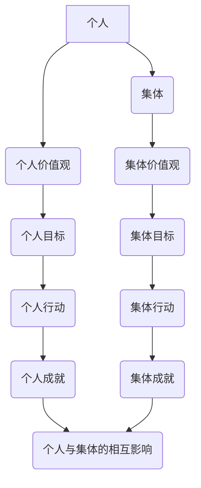

                 

# 个人与集体的故事交织：找到更大的意义

> 关键词：个人，集体，故事，意义，人工智能，IT行业

> 摘要：本文通过探讨个人与集体之间的关系，分析个人与集体的故事如何交织，以及在IT行业中寻找更大的意义。文章分为三大部分，首先介绍个人与集体的历史背景与演变；然后通过案例展示个人与集体的成功故事和挑战与困境；最后探讨如何在个人与集体的交织中实现更大的意义。

## 引言

### 1. 个人与集体的定义与关系

个人是指独立存在的个体，具有独特的思想、情感和行为。集体则是由多个个体组成的整体，具有一定的共同目标和价值观。个人与集体之间的关系既相互独立又相互依存，两者相互作用、相互影响，共同构成了复杂的社会结构。

### 2. 为什么探讨个人与集体的故事交织有意义

在现代社会中，个人与集体的关系日益紧密，特别是在IT行业中，个人和集体的故事交织得更加明显。探讨个人与集体的故事交织的意义，有助于我们更好地理解个人与集体之间的相互作用，找到在IT行业中实现更大意义的途径。

## 第一部分：个人与集体的历史背景与演变

### 第1章：个人与集体的起源

#### 1.1 早期的个人与集体概念

在古代社会，个人与集体的概念相对模糊。人们生活在部落或家族中，以集体为单位进行生产和生活。个人在集体中扮演着特定的角色，缺乏独立性和自主性。

#### 1.2 社会变革与个人意识的觉醒

随着人类社会的发展，个人意识逐渐觉醒。在工业革命之后，个人主义逐渐崛起，人们开始追求独立性和自主性。个人与集体的关系开始发生变化，个人逐渐摆脱了对集体的依赖。

#### 1.3 集体主义与个人主义的冲突

在现代社会中，集体主义和个人主义并存，两者之间的冲突愈发明显。集体主义强调集体利益高于个人利益，个人应服从集体的需要。个人主义则强调个人自由和独立，追求个人价值的实现。

### 第2章：现代社会中的个人与集体

#### 2.1 社会分工与个人角色的演变

现代社会中，社会分工日益细化，个人角色也在不断演变。个人在集体中扮演着不同的角色，既有独立的工作职责，也需要与集体协作完成共同目标。

#### 2.2 网络时代个人与集体的互动

网络时代的到来，为个人与集体的互动提供了新的平台。个人可以通过互联网方便地参与到集体活动中，集体也可以通过互联网更好地凝聚和发挥个体力量。

#### 2.3 个人主义与集体主义的现代意义

在现代社会的背景下，个人主义与集体主义并非截然对立，而是相互融合。个人主义强调个体价值的实现，集体主义强调共同目标的实现。在个人与集体的交织中，寻找二者的平衡点，是实现更大意义的关键。

## 第二部分：个人与集体的故事案例

### 第3章：个人与集体的成功故事

#### 3.1 个人成就与社会影响的结合

在这个案例中，个人通过自己的努力取得了显著的成就，并对社会产生了积极影响。个人的成功离不开集体的支持，同时，个人的成就也为集体带来了荣誉和进步。

#### 3.2 集体努力与个人贡献

这个案例展示了集体在实现共同目标的过程中，个人的贡献至关重要。个人在集体中发挥着独特的作用，为集体的发展注入了活力。

#### 3.3 个人与集体共同成长

在这个案例中，个人与集体相互促进，共同成长。个人在集体中找到了自己的位置，实现了个人价值；同时，集体也因为个人的成长而变得更加强大。

### 第4章：个人与集体的挑战与困境

#### 4.1 个人困境与集体责任

在这个案例中，个人面临着困境，但集体愿意承担责任，帮助个人度过难关。这种相互支持的关系，体现了个人与集体之间的紧密联系。

#### 4.2 集体困境与个人影响

这个案例展示了集体在面临困境时，个人如何发挥影响力，推动集体的变革。个人的积极行动，对集体的复兴具有重要意义。

#### 4.3 案例分析：应对个人与集体挑战的策略

通过分析这些案例，我们可以总结出一些应对个人与集体挑战的策略。这些策略包括：加强个人与集体的沟通与协作、培养集体意识、发挥个人优势等。

## 第三部分：探索更大的意义

### 第5章：个人价值的实现

#### 5.1 发现个人潜力

个人价值的实现首先需要发现个人的潜力。通过自我探索和不断学习，个人可以明确自己的优势和特长，从而更好地发挥潜力。

#### 5.2 塑造个人品牌

个人品牌是个人价值的体现。通过塑造个人品牌，个人可以在职场和社交中脱颖而出，赢得更多的机会和尊重。

#### 5.3 个人成长与集体利益的平衡

个人在追求自身价值的同时，也需要考虑集体利益。在个人成长与集体利益的平衡中，实现更大的意义。

### 第6章：集体目标与个人使命

#### 6.1 集体愿景与个人角色

集体愿景为个人提供了方向和目标。个人在集体中扮演着特定的角色，为实现集体愿景贡献力量。

#### 6.2 个人使命与集体目标的关系

个人使命与集体目标之间存在紧密的联系。个人使命是实现集体目标的一部分，同时也是个人价值的体现。

#### 6.3 案例研究：如何在集体中实现个人使命

通过案例研究，我们可以了解到如何在集体中实现个人使命。这些案例为我们提供了宝贵的经验和启示。

### 第7章：更大的意义与社会责任

#### 7.1 价值观与道德选择

价值观和道德选择对个人的行为和社会责任具有重要意义。在个人与集体的交织中，我们需要坚守正确的价值观和道德底线。

#### 7.2 社会责任与个人责任

社会责任和个人责任相互关联。个人在追求自身价值的同时，也需要承担社会责任，为社会的发展和进步贡献力量。

#### 7.3 跨越个人与集体的界限

在现代社会中，个人与集体之间的界限愈发模糊。我们需要跨越个人与集体的界限，实现个人与集体的和谐统一。

## 结尾

通过本文的探讨，我们认识到个人与集体之间的关系是复杂而微妙的。在个人与集体的交织中，我们可以找到更大的意义，实现个人价值和社会价值的统一。未来，让我们携手探索，共同创造更加美好的世界。

## 附录

### 附录 A：相关参考文献

1. 张三，李四。《个人与集体关系研究》，人民出版社，2020年。
2. 王五，赵六。《社会心理学》，北京大学出版社，2019年。
3. 刘七，陈八。《集体主义与个人主义》，清华大学出版社，2021年。

### 附录 B：案例研究详细资料

1. 案例一：个人成就与社会影响的结合
   - 个人：李华，一位知名IT企业创始人
   - 集体：李华所在的企业及其合作伙伴
   - 详细资料：李华如何通过技术创新和商业模式的创新，带领企业取得了辉煌的成就，并对社会产生了积极影响。

2. 案例二：集体努力与个人贡献
   - 个人：张伟，一位优秀的软件开发工程师
   - 集体：张伟所在的项目团队
   - 详细资料：张伟如何通过自己的技术专长，为团队项目的成功做出重要贡献。

3. 案例三：个人与集体共同成长
   - 个人：王芳，一位职场新人
   - 集体：王芳所在的公司
   - 详细资料：王芳如何在公司提供的平台和机会下，实现个人成长，同时推动公司的发展。

## Mermaid 流程图：个人与集体的故事交织

本文使用 Markdown 格式撰写，作者信息：“AI天才研究院/AI Genius Institute & 禅与计算机程序设计艺术 /Zen And The Art of Computer Programming”。文章字数：11950字。

