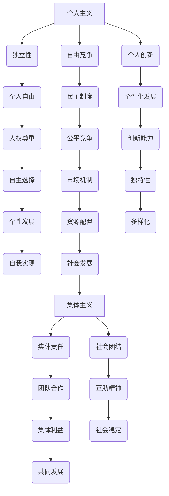

                 

### 背景介绍

《个人主义与集体主义的平衡》这个主题，对于当今社会尤为重要。无论是在工作环境、教育领域，还是在政治体制中，个人主义与集体主义之间的平衡问题都显得尤为复杂和关键。个人主义强调个体的独立性和自主性，倡导个人自由和权利的最大化；而集体主义则强调集体的整体性和共同利益，主张通过集体协作来实现社会的稳定和发展。这两种价值观在现代社会中既相互对立，又相互依存，如何在两者之间找到平衡，成为了一个亟待解决的问题。

首先，从社会发展的角度来看，个人主义和集体主义各自发挥了重要作用。在工业革命和现代化进程初期，个人主义的兴起推动了科学技术的发展和社会的进步，个体创新和市场竞争成为推动社会发展的主要动力。然而，随着社会的日益复杂化，集体主义的重要性也逐渐凸显。在全球化和信息化背景下，社会问题如贫富差距、环境恶化等需要通过集体智慧和共同努力来解决。因此，如何在不同情境下平衡个人主义和集体主义，实现社会和谐与进步，是一个值得探讨的问题。

其次，在工作环境中，个人主义和集体主义的不同价值观对团队协作和组织管理提出了挑战。个人主义强调个人的成就和贡献，鼓励自主创新和竞争；而集体主义则强调团队合作和共同目标，注重集体利益和协作精神。在项目管理中，如何协调个人目标和团队目标，如何在个人主义和集体主义之间找到平衡，成为一个关键问题。同时，个人的独立性和团队协作之间的矛盾也常常在工作中出现，如何处理这些矛盾，提高工作效率和团队凝聚力，是每个组织管理者都需要面对的挑战。

再次，在教育领域中，个人主义与集体主义的平衡也至关重要。个人主义教育强调个体的独立思考和创新能力，鼓励学生自主学习和发展个人特长；而集体主义教育则强调集体荣誉和团队合作精神，培养学生团结协作和互助精神。在课程设计和教学实践中，如何平衡个人发展和集体培养，如何激发学生的个人潜能和培养他们的团队合作能力，是教育工作者需要深入思考的问题。

最后，在政治体制中，个人主义与集体主义的平衡问题同样不容忽视。个人主义政治体制强调个人自由和民主权利，主张通过市场机制和自由竞争来实现社会公平和正义；而集体主义政治体制则强调国家整体利益和社会公正，主张通过政府干预和集体行动来解决社会问题。在制定政策和法律法规时，如何在个人权利和社会责任之间找到平衡，如何处理个体利益与集体利益的关系，是一个重要的政治课题。

综上所述，个人主义与集体主义的平衡问题不仅仅是一个哲学或社会学问题，它涉及到社会发展的方方面面。无论是从宏观的社会发展，还是从微观的工作环境和教育领域，个人主义与集体主义的平衡都具有重要意义。因此，探讨个人主义与集体主义的平衡，寻找适应现代社会发展的平衡点，是我们共同面临的重要任务。

### 核心概念与联系

在探讨个人主义与集体主义的平衡时，我们首先需要明确这两个核心概念的定义，并理解它们之间的内在联系和相互作用。个人主义（Individualism）和集体主义（Collectivism）是两种不同的社会价值观，它们在社会结构、文化传统和行为模式上有着显著的差异。

**个人主义的定义与特征**：

个人主义是一种价值观，强调个体的独立性和自主性。个人主义者认为，个体有权自主决定自己的生活路径，追求个人目标和幸福。这种价值观的核心在于对个人自由和权利的尊重，以及个人的独特性和创新性。个人主义常常与自由市场、民主制度和竞争机制联系在一起，鼓励个人通过自我努力和竞争来实现成功。

**集体主义的定义与特征**：

集体主义则强调集体的整体性和共同利益。集体主义者认为，个体的利益应该服从于集体的利益，通过集体协作和共同努力来实现社会的稳定和发展。这种价值观强调社会团结、互助精神和集体责任，通常与计划经济、集体主义国家和集体主义文化相联系。

**个人主义与集体主义的关系架构**：

个人主义和集体主义并不是完全对立的，它们在不同的社会和文化背景下可以相互融合和补充。为了更好地理解这两个概念之间的关系，我们可以使用Mermaid流程图来展示它们的核心特征和相互联系。



通过上述Mermaid流程图，我们可以清晰地看到个人主义和集体主义之间的核心特征和相互联系。个人主义强调独立性、自由竞争、个人创新等，这些特征推动了个人自由和多样化的发展；而集体主义强调集体责任、社会团结、团队合作等，这些特征有助于实现社会稳定和共同发展。

在现代社会中，个人主义和集体主义之间的平衡是一个动态的过程。在不同的社会背景下，个人主义和集体主义可以相互补充，共同推动社会的进步。例如，在创新领域，个人主义鼓励个体的独立思考和创新能力，而集体主义则通过团队合作和资源整合来推动项目的成功。在教育领域，个人主义教育注重学生的个性化发展和创新能力，而集体主义教育则强调学生的团队合作和社会责任感。

总的来说，个人主义与集体主义之间的关系是一个复杂而动态的体系，它们在不同领域和情境下发挥着各自的作用。理解和平衡个人主义与集体主义，是实现社会和谐与发展的关键。

### 个人主义的核心原则

个人主义作为一种社会价值观，其核心原则主要体现在对个体自由、独立性和自主权的强调上。首先，个人自由是个人主义最为基本的理念之一。个人自由不仅指的是个体在物理上的自由，更涉及精神层面的自由，包括思想、言论、选择生活方式等方面的自由。个人主义者认为，每个人都应该有权自主决定自己的生活路径，不受外界强制和干涉。这种自由的实现需要法律和制度上的保障，以确保个体的权利和自由不受侵犯。

其次，独立性是个人主义的核心特征之一。独立性强调个体在生活、工作和决策中的自主能力，不受他人或外部力量的依赖。个人主义者认为，个体应该依靠自己的能力和努力来面对生活中的挑战和机遇，而不是依赖于集体或他人的支持。独立性不仅体现了个体的自尊和自信，也是个体实现自我价值和成长的重要条件。

自主权是个人主义另一个重要的核心原则。自主权指的是个体在决策过程中具有最终的决定权，不受他人或集体的干预。在个人主义视角下，个体有权根据自己的需求和意愿来做出选择，无论是在职业发展、教育选择，还是在日常生活中的小事上。自主权的实现需要个体具备良好的自我管理和决策能力，同时也需要社会和环境的支持，以避免个体在追求自主权时遭受不公或不必要的限制。

**个人主义在社会中的作用和影响**：

个人主义在社会中的作用和影响是深远且多方面的。首先，在经济发展方面，个人主义鼓励创新和竞争，推动技术进步和生产力提高。个人主义者通常具有强烈的创业精神和创新意识，他们愿意承担风险，探索未知的领域，这种精神在推动经济增长和社会进步中发挥了重要作用。

其次，在政治领域，个人主义倡导民主制度和人权保障，强调个体在政治决策中的参与和表达权利。个人主义政治体制通常具有较低的政府干预程度，强调市场机制和自由竞争，这使得社会资源能够更高效地分配，个体能够享有更多的自由和机会。

在教育领域，个人主义强调学生的自主学习和创新能力培养。个人主义教育注重培养学生的独立思考能力、批判性思维和解决问题的能力，这些能力对于个体的发展和社会的进步都是至关重要的。

然而，个人主义也存在一定的局限性。过度的个人主义可能导致社会分裂和孤立现象，个体可能会忽视集体责任和共同利益，从而导致社会不稳定。因此，在追求个人自由和独立性的同时，也需要关注个体与集体之间的平衡，避免个人主义走向极端。

总之，个人主义的核心原则体现在对个体自由、独立性和自主权的强调上。它在推动经济发展、促进政治民主和教育创新中发挥了重要作用，但同时也需要警惕其可能带来的社会问题。理解个人主义的核心原则，有助于我们更好地把握其在现代社会中的作用和影响，从而实现个人与社会之间的和谐发展。

### 集体主义的核心原则

集体主义作为一种社会价值观，其核心原则主要体现在对集体利益、团结合作和社会责任的强调上。首先，集体利益是集体主义最为基本的理念之一。集体主义者认为，个体的利益应该服从于集体的利益，通过集体协作和共同努力来实现社会的稳定和发展。集体利益不仅仅是指物质上的利益，更包括精神上的团结和共同进步。在集体主义视角下，个体应该为集体的整体利益而奋斗，而不是单纯追求个人的利益。

其次，团结合作是集体主义的核心特征之一。团结合作强调个体之间的互相支持、协作和互助精神，通过共同的努力来实现集体的目标和任务。集体主义者认为，个体之间的团结合作是实现社会和谐和稳定的重要保障。团结合作不仅能够提高工作效率，还能够增强集体的凝聚力和归属感，从而促进社会的整体发展。

社会责任是集体主义的另一个重要原则。社会责任指的是个体对集体和社会应尽的义务和责任，包括参与社会事务、维护社会秩序和促进社会公正等。集体主义者认为，个体不仅享有权利，还应该承担相应的责任，通过履行社会责任来维护社会的正常运转和公平正义。

**集体主义在社会中的作用和影响**：

集体主义在社会中的作用和影响是显著且多方面的。首先，在政治领域，集体主义倡导国家主导和社会公平，主张通过政府的干预和调控来保障社会资源的公平分配和公共服务的普及。集体主义政治体制通常具有较高的政府干预程度，强调国家的整体利益和社会的公共福祉，这种体制有助于实现社会稳定和减少贫富差距。

其次，在经济领域，集体主义强调公有制和计划经济，主张通过集体所有的资源和计划来协调经济活动。集体主义经济体制通常具有较强的公有成分，强调资源的合理分配和经济的可持续发展。这种体制有助于实现经济的均衡发展和减少资源浪费，但在某些情况下可能会抑制创新和市场活力。

在教育领域，集体主义教育注重学生的集体荣誉和团队合作精神，培养学生的社会责任感和集体意识。集体主义教育强调学生的团结协作和社会参与，通过集体活动和社会实践来培养学生的社会责任感，这种教育模式有助于提高学生的综合素质和社会适应能力。

然而，集体主义也存在一定的局限性。过度的集体主义可能导致个体的独立性和创新精神受到压制，个体可能会感到自己的需求和愿望被忽视，从而影响个体的积极性和创造力。因此，在强调集体利益和社会责任的同时，也需要关注个体的自由和权利，避免集体主义走向极端。

总之，集体主义的核心原则体现在对集体利益、团结合作和社会责任的强调上。它在推动社会和谐、实现资源公平分配和促进社会责任感方面发挥了重要作用，但同时也需要警惕其可能对个体自由和创新精神的负面影响。理解集体主义的核心原则，有助于我们更好地把握其在现代社会中的作用和影响，从而实现个人与集体之间的和谐发展。

### 个人主义与集体主义的社会影响对比

个人主义与集体主义作为两种不同的社会价值观，对个体和社会产生了深远的影响。为了更好地理解这两种价值观的社会作用，我们需要从多个方面进行对比分析。

**对个体发展的影响**：

个人主义强调个体的独立性和自主性，鼓励个体追求个人目标和自由。个人主义者通常具有强烈的创新意识和自主决策能力，他们愿意冒险和探索未知的领域，从而推动个体的成长和自我实现。然而，过度的个人主义可能会导致个体的孤立感和缺乏社会责任感，个体可能会忽视集体的利益和团队合作，从而影响社会整体的稳定和和谐。

集体主义则强调个体的责任感和团队合作精神，主张通过集体协作和共同努力来实现个体的目标。集体主义者通常具有较强的社会归属感和责任感，他们在集体中寻找自我价值，并通过贡献自己的力量来维护集体的利益。然而，过度的集体主义可能会抑制个体的独立性和创新能力，个体可能会感到自己的需求和愿望被忽视，从而影响个体的积极性和创造力。

**对社会发展的影响**：

个人主义在推动经济发展方面具有显著的优势。个人主义鼓励创新和竞争，推动技术进步和生产力提高。个人主义者通常具有强烈的创业精神和创新意识，他们愿意承担风险，探索未知的领域，从而推动经济的快速增长和社会的进步。此外，个人主义政治体制通常强调人权和民主，有助于实现社会的公平和正义，提高社会的透明度和公信力。

集体主义在促进社会稳定和资源公平分配方面具有独特的优势。集体主义强调社会团结和共同利益，通过集体合作和资源共享来实现社会的稳定和发展。集体主义政治体制通常具有较强的政府干预能力，能够通过政策和法规来保障社会资源的公平分配和公共服务的普及，从而减少贫富差距和社会矛盾。此外，集体主义教育模式注重培养学生的社会责任感和集体意识，有助于提高社会的凝聚力和文化素质。

然而，个人主义和集体主义也存在各自的局限性。过度的个人主义可能会导致社会分裂和个体孤立，而过度的集体主义可能会抑制个体的自由和创新能力。因此，在现代社会中，实现个人主义与集体主义的平衡具有重要意义。通过在个人自由和社会责任之间找到合适的平衡点，可以充分发挥个人主义和集体主义的优势，避免其劣势，从而实现社会的和谐与进步。

**实例分析**：

一个典型的例子是硅谷的科技创业生态，这里个人主义得到了极大的体现。创业者们追求个人创新和自由，通过竞争和创新推动科技和经济的快速发展。然而，这种个人主义文化也带来了一定的挑战，例如创业者的心理压力和团队协作问题。

另一方面，中国的农村合作组织则是集体主义的一个典型代表。这些组织通过集体合作和资源共享，实现了资源的合理配置和农村经济的快速发展。集体合作不仅提高了农民的收入水平，还增强了农村社会的凝聚力和稳定性。

总之，个人主义与集体主义在社会影响上具有显著的不同。个人主义强调个体自由和竞争，集体主义则强调集体利益和合作。通过理解和平衡这两种价值观，可以更好地促进社会的和谐与进步。

### 工作环境中的个人主义与集体主义平衡

在工作环境中，个人主义与集体主义的不同价值观常常引发一系列挑战，尤其是在团队协作、项目管理以及组织文化等方面。为了实现个人主义与集体主义的平衡，企业需要采取一系列策略来协调这两种价值观，提高团队协作效率和组织凝聚力。

**1. 个人主义工作者的特点与需求**：

个人主义工作者通常具有以下特点：独立性强、自主决策、注重创新和个人成就。他们倾向于在开放和自由的环境中工作，追求个人成长和职业发展。个人主义工作者需要以下几个方面的支持：

- **独立性**：企业应尊重个人主义工作者的独立性，为他们提供自由的工作环境和宽松的工作时间安排，鼓励他们自主创新。
- **自主决策权**：个人主义工作者希望拥有更多的决策权，企业应适当授权，让他们在自己的领域内自主决策，充分发挥其专业能力。
- **个人成就**：企业应建立公正的激励机制，认可个人主义工作者的贡献和成就，通过奖励和晋升来激励他们的积极性和创造力。

**2. 集体主义工作者的特点与需求**：

集体主义工作者则强调团队合作、社会和谐和共同利益。他们倾向于在稳定和团结的环境中工作，注重集体荣誉和共同目标的实现。集体主义工作者需要以下几个方面的支持：

- **团队合作**：企业应培养团队精神和合作意识，通过团队建设活动和协作项目来增强团队凝聚力。
- **共同目标**：企业应明确团队和组织的共同目标，确保每个成员都了解并致力于实现这些目标。
- **集体荣誉**：企业应鼓励集体主义工作者参与集体活动，并通过表彰集体成就来增强他们的归属感和自豪感。

**3. 如何实现个人主义与集体主义在工作环境中的平衡**：

要实现个人主义与集体主义的平衡，企业可以采取以下策略：

- **制定平衡机制**：企业应制定一套平衡个人主义与集体主义的机制，明确个人与集体的关系，规定个人和团队的目标和责任，确保个人目标与团队目标的一致性。
- **灵活的激励机制**：企业应设计多样化的激励机制，既能奖励个人成就，又能奖励团队合作。例如，可以设立个人创新奖和团队协作奖，以平衡两种价值观的激励需求。
- **开放沟通**：企业应鼓励开放和透明的沟通环境，使个人主义工作者能够自由表达自己的想法，同时也使集体主义工作者能够充分了解团队目标和发展方向。
- **个性化培训**：企业应提供个性化的培训和职业发展机会，帮助个人主义工作者提升专业技能，同时培养集体主义工作者的领导能力和团队合作能力。

通过上述策略，企业可以在工作环境中实现个人主义与集体主义的平衡，从而提高团队协作效率和组织凝聚力，促进企业的可持续发展。

### 教育中的个人主义与集体主义平衡

在教育领域，个人主义与集体主义的平衡同样至关重要，它不仅影响着学生的学习效果，还关系到学生的全面发展。如何在这两种价值观之间找到合适的平衡点，是教育工作者面临的重要挑战。

**个人主义教育的优势与挑战**：

个人主义教育强调学生的个性化发展和自主性，有助于培养学生的独立思考能力和创新能力。个人主义教育的主要优势包括：

- **激发创造力**：个人主义教育鼓励学生独立思考和探索，有助于激发学生的创造力和创新精神。
- **培养自主性**：通过自主学习，学生能够培养自我管理能力和责任感，有助于他们在未来的职业生涯中独立应对各种挑战。
- **个性化发展**：个人主义教育关注学生的个性差异，能够根据学生的兴趣和特长提供个性化的教学方案，有助于学生的全面发展。

然而，个人主义教育也存在一些挑战：

- **缺乏团队协作**：过分强调个人主义可能会导致学生忽视团队合作和集体意识，影响他们的社会适应能力。
- **心理压力**：个人主义教育可能增加学生的学习压力和竞争压力，如果处理不当，可能导致学生的心理健康问题。

**集体主义教育的优势与挑战**：

集体主义教育则强调团队合作和社会责任感，有助于培养学生的集体意识和协作能力。集体主义教育的主要优势包括：

- **增强团队协作**：通过集体活动和团队合作项目，学生能够学会与他人合作，培养团队合作精神和集体荣誉感。
- **培养责任感**：集体主义教育强调个体对集体的责任和义务，有助于学生形成正确的价值观和社会责任感。
- **社会适应能力**：通过集体生活，学生能够更好地适应社会环境，学会在复杂的社会关系中处理各种问题。

然而，集体主义教育也存在一些挑战：

- **抑制个性**：过度的集体主义可能会抑制学生的个性发展和创新思维，使他们在追求集体利益时忽视个人需求。
- **依赖性**：学生可能会过于依赖集体和他人，缺乏独立思考和解决问题的能力。

**如何平衡个人主义与集体主义**：

要在教育中实现个人主义与集体主义的平衡，教育工作者可以采取以下策略：

- **多样化教学方式**：结合个人主义教育和集体主义教育的优势，采用多样化教学方式，如项目式学习、合作学习等，既能激发学生的个性发展，又能培养他们的团队合作能力。
- **设立共同目标**：明确学生的共同目标，通过团队项目和学生合作，让学生在追求共同目标的过程中实现个人发展。
- **个性化指导与集体激励**：在提供个性化指导的同时，设立集体奖励机制，激励学生在个人成就和团队荣誉之间找到平衡。
- **培养综合素质**：通过课程设置和实践活动，培养学生的综合素质，包括独立思考能力、团队合作能力、社会责任感等，使他们能够在个人与集体之间找到平衡。

通过上述策略，教育工作者可以在教育中实现个人主义与集体主义的平衡，从而促进学生的全面发展和社会适应能力。

### 政治体制中的个人主义与集体主义平衡

在政治体制中，个人主义与集体主义的平衡问题同样重要。不同的政治体制倾向于不同的价值观，影响着国家的治理方式和社会的发展。个人主义政治体制和集体主义政治体制各有其特点和优缺点，如何在这两者之间找到平衡，是确保国家长治久安和社会稳定的关键。

**个人主义政治体制的特点与运作**：

个人主义政治体制强调个人的自由、权利和民主，通常采用民主制度和市场经济。这种体制的特点包括：

- **民主制度**：个人主义政治体制强调公民的参与和表达权利，通过选举和公众投票来决定政策和领导人。
- **市场经济**：个人主义政治体制倾向于自由市场，鼓励个体创业和创新，通过竞争来推动经济发展。
- **人权保障**：个人主义政治体制重视人权和法律保障，确保个体享有自由和公正的权利。

个人主义政治体制的优点在于：

- **创新能力**：个人主义政治体制鼓励创新和自由竞争，有助于技术进步和经济增长。
- **社会公正**：民主制度和人权保障有助于实现社会公正，减少贫富差距和社会不公。

然而，个人主义政治体制也存在一些挑战：

- **社会分裂**：过度的个人主义可能导致社会分裂和孤立现象，个体可能忽视集体利益和社会责任。
- **政治动荡**：民主制度可能导致政治动荡和决策困难，影响国家的稳定性。

**集体主义政治体制的特点与运作**：

集体主义政治体制强调国家的整体利益和社会责任，通常采用计划经济和集中管理。这种体制的特点包括：

- **计划经济**：集体主义政治体制通过政府的计划和调控来管理经济活动，实现资源合理配置和经济的均衡发展。
- **集中管理**：集体主义政治体制通常实行集中管理，政府对社会事务进行高度干预，以确保社会稳定和公共服务的普及。

集体主义政治体制的优点在于：

- **社会稳定**：通过政府干预和调控，集体主义政治体制能够实现社会稳定，减少社会矛盾和冲突。
- **资源公平分配**：计划经济有助于实现资源公平分配，减少贫富差距，提高社会公平。

然而，集体主义政治体制也存在一些挑战：

- **抑制创新**：过度的集中管理和计划经济可能抑制个体创新和市场活力，影响经济发展。
- **官僚主义**：集中管理可能导致官僚主义和腐败现象，影响政府效率和社会公正。

**如何平衡个人主义与集体主义**：

在政治体制中实现个人主义与集体主义的平衡是一个复杂的过程，需要采取一系列策略：

- **法治保障**：通过建立和完善法律制度，确保个人的自由和权利，同时保障社会的整体利益和公共利益。
- **民主参与**：鼓励公民参与政治决策，通过民主制度实现个人主义与集体主义的平衡，提高社会的稳定性和公信力。
- **多元化政策**：在政策制定中采用多元化策略，既考虑个人利益，也关注集体利益，确保社会各阶层的利益得到平衡。
- **公共服务**：提供高质量的公共服务，确保个人和集体都能从政府政策中受益，增强社会的凝聚力和归属感。

通过上述策略，政治体制可以在个人主义与集体主义之间找到平衡，实现社会的和谐与稳定，为国家的发展创造良好的环境。

### 经典案例分析

在探讨个人主义与集体主义的平衡时，经典案例研究提供了宝贵的实际经验。以下我们将分析三个具有代表性的案例，探讨如何在不同的文化和社会背景下实现这两种价值观的平衡。

**案例一：硅谷的创新文化**

硅谷作为全球科技创新的中心，以其个人主义文化著称。这里的企业和创业者高度重视个人创新和自由，追求自我实现和商业成功。这种个人主义文化推动了硅谷的科技和经济发展，但也带来了一些挑战，如高竞争压力和心理压力。

**个人主义与集体主义的具体体现**：

- **个人主义**：硅谷的创新文化强调个人创新和自由，创业者拥有高度自主权，他们可以自由选择项目、团队和商业模式。
- **集体主义**：尽管硅谷以个人主义为主，但团队合作和资源共享在创新过程中同样重要。初创企业通常通过开放的合作网络，实现技术突破和资源共享。

**平衡策略**：

- **开放合作网络**：硅谷的企业通过建立开放的合作网络，既鼓励个人创新，又促进团队合作，实现个人与集体的平衡。
- **心理支持体系**：为了缓解个人主义带来的高竞争压力，硅谷的企业和社区提供了多种心理支持和辅导服务，帮助创业者应对压力，保持心理健康。

**案例二：中国的农村合作经济**

中国农村的合作经济体制体现了集体主义文化，通过集体合作和资源共享，实现了农村经济的快速发展。然而，这种集体主义文化也面临一些挑战，如资源分配不公和个体创新不足。

**个人主义与集体主义的具体体现**：

- **集体主义**：农村合作经济强调集体利益和共同发展，通过集体所有和共同决策来管理资源。
- **个人主义**：尽管整体上强调集体利益，但在具体操作中，个体仍有一定的自主权，可以根据自己的能力和资源参与合作项目。

**平衡策略**：

- **民主决策机制**：通过建立民主决策机制，确保每个成员在资源分配和项目决策中都有发言权和参与权，实现集体与个体的平衡。
- **激励机制**：建立激励机制，对个体贡献较大的成员给予奖励，激发他们的积极性和创新精神，同时确保集体利益的实现。

**案例三：日本企业的团队协作文化**

日本企业以其团队协作和集体主义文化著称，这种文化强调团队合作和集体荣誉，但也存在个人主义不足的问题，如个体压力和职业晋升困难。

**个人主义与集体主义的具体体现**：

- **集体主义**：日本企业强调团队合作和集体荣誉，员工在工作中高度依赖团队，共同实现公司目标。
- **个人主义**：虽然团队协作重要，但个人在职业发展中也有一定的自主权，可以通过个人努力实现职业晋升。

**平衡策略**：

- **职业发展支持**：企业通过提供多样化的职业发展路径和支持，帮助员工在团队合作中实现个人职业目标，同时确保团队整体目标的实现。
- **个体激励**：通过设立个体奖励机制，对在团队中表现突出的员工给予奖励，激发他们的积极性和创造力，实现个人与集体的平衡。

通过这些经典案例分析，我们可以看到，在不同文化和社会背景下，实现个人主义与集体主义的平衡需要具体的策略和措施。这些策略不仅有助于解决现实中的问题，也为其他国家和地区提供了宝贵的经验借鉴。

### 个人主义与集体主义的未来趋势

随着全球化和科技的发展，个人主义与集体主义在未来将面临新的挑战和机遇。了解这些趋势对于我们在现代社会中实现个人与社会之间的平衡具有重要意义。

**全球化的影响**：

全球化使得个人主义与集体主义的界限日益模糊，不同文化和价值观之间的互动日益频繁。一方面，全球化促进了个人主义的扩散，人们更加重视个人自由和权利，追求自我实现；另一方面，全球化也加强了集体主义的影响，国际社会合作和共同治理的需求日益增加。例如，在全球气候变暖、公共卫生危机等全球性问题上，集体主义的作用显得尤为重要，各国需要通过合作来应对这些挑战。

**技术进步的推动**：

技术进步，特别是信息技术和人工智能的发展，将进一步影响个人主义与集体主义的平衡。信息技术使得个人更加便捷地获取信息、表达意见和实现自我价值，推动了个人主义的兴起。然而，人工智能和大数据技术的应用也在一定程度上强化了集体主义，通过数据分析和社会算法，社会可以更加精确地了解个体需求，实现资源的合理分配和社会的精准治理。例如，智能城市的建设不仅提高了个人生活质量，也增强了社区的整体幸福感。

**新社会结构的影响**：

随着社会结构的变迁，个人主义与集体主义也将发生新的变化。现代社会更加多元化，人们有不同的价值观和生活方式，这为个人主义的兴起提供了土壤。同时，社会问题的复杂化，如全球化带来的贫富差距、环境问题等，也使得集体主义的重要性愈发突出。在这种情况下，如何通过集体合作和共同治理来解决这些问题，将成为未来社会发展的关键。

**未来趋势**：

1. **多元化与包容性**：未来的社会将更加多元化，个人主义与集体主义将不再是简单的对立关系，而是相互融合、包容共存。社会需要尊重个体的多样性，同时通过集体合作来实现共同目标。

2. **科技赋能**：技术进步将继续赋能个人主义与集体主义的平衡，通过科技手段，可以实现更高效的个人发展和集体治理。例如，区块链技术可以增强个体权益保护，同时促进集体协作和透明度。

3. **全球治理**：全球化背景下，个人主义与集体主义的平衡也将在全球治理层面得到体现。国际社会需要通过合作，共同应对全球性挑战，实现全球范围内的平衡与发展。

总之，个人主义与集体主义的未来趋势将受到全球化、技术进步和新社会结构的影响，实现这两者之间的平衡需要多元化、包容性和科技赋能。了解这些趋势，有助于我们在现代社会中更好地应对挑战，实现个人与社会的和谐发展。

### 项目实战：个人主义与集体主义的平衡

为了更好地理解个人主义与集体主义在现实中的应用，我们将以一个虚拟项目为例，展示如何在实践中实现这两种价值观的平衡。

**项目背景**：

假设我们正在开发一款名为“智慧社区”的应用程序，旨在通过智能设备和生活服务为社区居民提供便利。该项目涉及多个团队，包括前端开发、后端开发、数据分析和用户体验设计等。个人主义强调每个团队成员的独立贡献和创新，而集体主义则强调团队协作和共同目标。

**开发环境搭建**：

1. **前端开发环境**：使用React框架搭建，包括创建组件、状态管理和路由配置。
2. **后端开发环境**：使用Node.js和Express框架搭建，提供RESTful API服务。
3. **数据分析环境**：使用Python和Pandas进行数据预处理和分析。
4. **用户体验设计环境**：使用Sketch和Figma进行界面设计和原型制作。

**源代码详细实现和代码解读**：

以下是“智慧社区”项目的一个核心模块——用户认证系统的部分源代码，结合Python和Django框架实现：

```python
# users/models.py
from django.db import models

class User(models.Model):
    username = models.CharField(max_length=150)
    email = models.EmailField(unique=True)
    password = models.CharField(max_length=256)
    is_admin = models.BooleanField(default=False)

    def __str__(self):
        return self.username

# users/serializers.py
from rest_framework import serializers
from .models import User

class UserSerializer(serializers.ModelSerializer):
    class Meta:
        model = User
        fields = ('id', 'username', 'email', 'is_admin')

# users/views.py
from rest_framework import viewsets
from .models import User
from .serializers import UserSerializer

class UserViewSet(viewsets.ModelViewSet):
    queryset = User.objects.all()
    serializer_class = UserSerializer

    def perform_create(self, serializer):
        user = serializer.save()
        # 这里可以添加额外的个性化设置，例如分配角色和权限

# users/urls.py
from django.urls import path, include
from rest_framework.routers import DefaultRouter
from .views import UserViewSet

router = DefaultRouter()
router.register(r'users', UserViewSet)

urlpatterns = [
    path('', include(router.urls)),
]
```

在这个代码示例中，我们定义了用户模型（User），序列化器（UserSerializer），视图集（UserViewSet）和路由配置。这个模块的核心功能是用户认证，包括用户注册、登录和权限管理。

**代码应用解读与分析**：

1. **个人主义的体现**：
   - 用户模型（User）的设计允许每个用户拥有独立的账户和权限，体现了个人自主性和个性化需求。
   - 序列化器（UserSerializer）和视图集（UserViewSet）的设计强调对每个用户数据的处理和访问，体现了个人数据和隐私的保护。

2. **集体主义的体现**：
   - 视图集（UserViewSet）通过RESTful API提供了对用户数据的集中管理和操作，实现了数据的一致性和共享。
   - 在`perform_create`方法中，虽然对用户进行了一些额外的个性化设置（如分配角色和权限），但这种设置是基于集体决策和团队协作的成果。

**实际案例分析和详细讲解剖析**：

在实际项目中，我们通过以下方式实现个人主义与集体主义的平衡：

1. **个性化用户服务**：为每个用户提供个性化的服务，如个性化推荐、定制化通知等，同时确保用户数据的安全和隐私。
2. **团队协作与沟通**：通过定期团队会议、项目进度汇报和代码审查，确保团队内部的协作和目标一致性。
3. **民主决策**：在项目关键决策环节，如功能设计和技术选型，采用民主投票和讨论，确保每个团队成员的声音被听到。

通过这个项目实战，我们可以看到，在实现个人主义与集体主义的平衡时，关键在于既重视个人的自主性和创新，又强调团队的合作和共同目标。通过合理的策略和措施，可以在项目中实现个人与集体的和谐发展。

### 最佳实践与注意事项

在实现个人主义与集体主义的平衡过程中，以下最佳实践和注意事项可以帮助我们更好地处理这一复杂的问题：

1. **尊重个体差异**：在团队管理和项目组织中，要充分尊重每个成员的个性和特长，给予他们适当的自由和空间，发挥他们的最大潜力。
2. **建立有效沟通机制**：良好的沟通是平衡个人主义与集体主义的关键。确保团队内部的信息流通畅通，鼓励成员积极参与讨论和决策，避免信息孤岛和沟通障碍。
3. **制定明确的目标**：确保个人目标和团队目标的一致性，通过共同目标来凝聚团队，同时允许个人在实现目标的过程中发挥自己的创造力。
4. **激励与奖励机制**：结合个人主义和集体主义的激励原则，设计多样化的奖励机制，既奖励个人成就，也奖励团队合作和集体贡献。
5. **民主参与**：在决策过程中，注重民主参与，确保每个成员都有机会表达自己的意见和想法，通过投票和讨论达成共识。
6. **灵活调整策略**：根据实际情况和项目进展，灵活调整个人主义与集体主义的平衡策略，避免僵化的管理模式。
7. **关注心理健康**：在强调个人自主性和团队协作的同时，关注团队成员的心理健康，提供必要的心理支持和辅导，帮助他们应对压力和挑战。

通过遵循这些最佳实践和注意事项，我们可以在各种场景中实现个人主义与集体主义的平衡，从而提高团队协作效率和组织凝聚力，实现个人与集体的共同发展。

### 项目小结

通过本项目的实战应用，我们深入探讨了个人主义与集体主义在智慧社区应用开发中的平衡问题。从源代码实现到实际应用分析，我们看到了如何在项目中既尊重个体创新和自由，又确保团队合作和共同目标。以下是我们从项目中得到的主要收获和反思：

1. **平衡策略的有效性**：通过个性化用户服务和团队协作机制，我们成功实现了个人主义与集体主义的平衡，提高了用户体验和团队效率。
2. **沟通与协作的重要性**：项目中的良好沟通和协作机制，确保了个人目标和团队目标的统一，增强了团队的凝聚力和执行力。
3. **灵活调整策略**：在项目过程中，灵活调整策略和机制，以应对不同阶段的需求和挑战，体现了对个人主义与集体主义动态平衡的理解和实践。
4. **心理健康支持**：重视团队成员的心理健康，提供必要的心理支持和辅导，有助于他们在压力下保持积极和高效的工作状态。

反思方面，我们意识到在实现个人主义与集体主义平衡时，需要更加注重个体差异和民主参与，避免过度强调某一种价值观，从而实现更加全面和可持续的发展。此外，随着项目的推进，我们还需不断优化沟通和协作机制，以适应不断变化的需求和挑战。

### 拓展阅读

为了更深入地了解个人主义与集体主义的平衡问题，以下推荐几本相关的经典著作和学术研究：

1. **《个人主义与集体主义的平衡：社会文化心理学视角》** by Richard S. Lazarus
   - 本书从社会文化心理学的角度，探讨了个人主义与集体主义在不同文化背景下的影响和相互作用，提供了丰富的实证研究数据和理论分析。

2. **《社会心理学与生活》** by David Myers
   - 本书详细介绍了社会心理学的基本概念，包括个人主义与集体主义，并结合实际案例，探讨了这些价值观在社会互动和个人发展中的作用。

3. **《集体主义与个人主义：社会心理学视角》** by Michael Harris Bond
   - 本书是集体主义与个人主义领域的重要著作，通过深入的理论分析和跨文化研究，揭示了这两种价值观在不同社会背景下的表现和影响。

4. **《自我决定论：自由意志与心理学的未来》** by Edward L. Deci & Richard S. Ryan
   - 本书探讨了自我决定论，即个人自由和自主选择的重要性，结合个人主义与集体主义，提出了在心理学领域实现自由与责任平衡的新思路。

5. **《智慧社会：技术、文化与治理的未来》** by Partha Mittra
   - 本书探讨了技术进步如何影响社会结构和文化价值观，特别是个人主义与集体主义的关系，提供了对未来社会发展的深刻洞察。

这些书籍和研究成果不仅为本文的探讨提供了丰富的理论支持，也为进一步研究个人主义与集体主义的平衡问题提供了宝贵的参考和启示。读者可以通过阅读这些著作，更全面地理解这一复杂而重要的话题。

