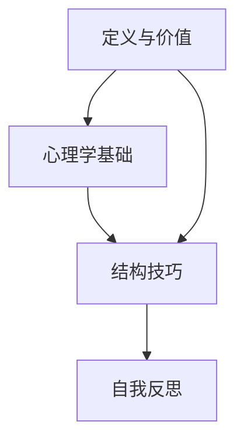
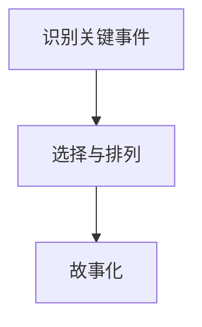
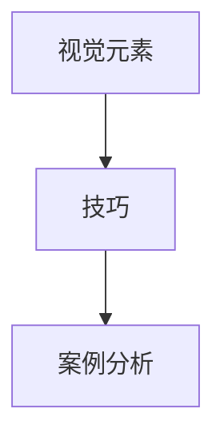
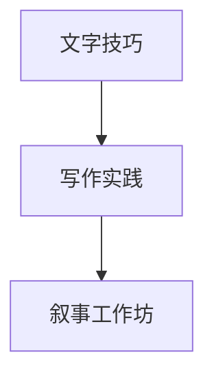
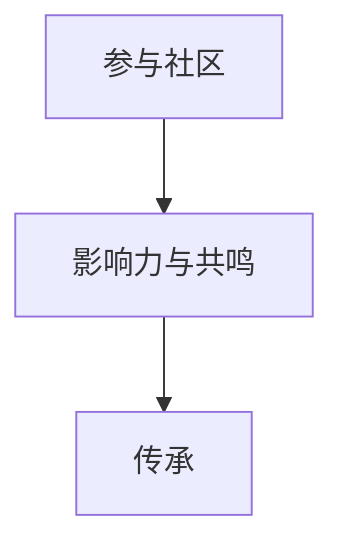
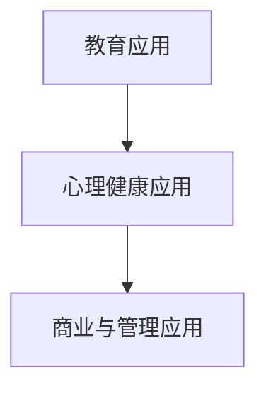
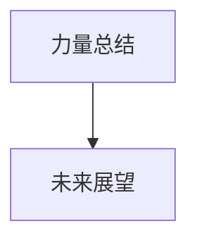

                 

# 个人叙事的力量：创造自己的生命故事

## 关键词
个人叙事、心理学、故事化、视觉呈现、写作实践、影响力、心理健康、商业应用

## 摘要
在快速发展的现代社会，个人叙事成为了一种强大的工具，它不仅能够帮助个体反思自我，还能在社交和职业领域中产生深远影响。本文将探讨个人叙事的定义与价值，分析其心理学基础，提供构建个人叙事的框架和方法，以及在不同领域中的应用，帮助读者理解个人叙事的力量，学会如何创造自己的生命故事。

---

## 第一部分：理解个人叙事的力量

### 第1章：个人叙事的定义与价值

#### 1.1 个人叙事的定义
个人叙事是指个体通过讲述自己的经历、想法和感受来构建自己生命故事的方式。它不仅仅是对事件的记录，更是一种对自我认知的表达。

#### 1.2 个人叙事的价值
个人叙事对于个体有着深远的影响，它能够增强自我认同，促进情感表达，并帮助个体在压力和挑战中找到支持和力量。同时，个人叙事在社会中也有重要的价值，它能够促进人与人之间的理解和共鸣，增强社会凝聚力。

#### 1.3 个人叙事的心理学基础
心理学研究表明，记忆与叙事有着紧密的联系。通过叙事，个体能够将零散的记忆组织成一个完整的故事，从而更好地理解和应对生活经历。叙事心理学理论则提供了对个人叙事过程和效果的深入分析。

### 第2章：构建个人叙事的框架

#### 2.1 个人叙事的结构
一个有效的个人叙事通常包括情节、角色、冲突和解决。这些元素共同构成了一个引人入胜的故事，使听众或读者能够更好地理解和感受。

#### 2.2 个人叙事的技巧
构建个人叙事需要一定的技巧。首先，通过记录和回忆，个体可以收集素材。其次，运用适当的语言和修辞，可以增强叙事的效果。最后，通过自我反思，个体可以深入挖掘经历背后的情感和意义。

#### 2.3 个人叙事的自我反思
自我反思是构建个人叙事的重要步骤。通过深入挖掘个人经历，个体可以发现潜在的情感和意义，从而丰富叙事内容。

### 第1章与第2章的Mermaid流程图


---

## 第二部分：创造自己的生命故事

### 第3章：生命故事中的核心事件

#### 3.1 关键事件的识别
关键事件是构建生命故事的核心。通过识别和选择这些事件，个体可以构建一个有深度、有层次的故事。

#### 3.2 事件的选择与排列
事件的选择和排列需要考虑到时间线和主题。一个连贯的故事应该能够引导听众或读者从一个事件自然地过渡到下一个事件。

#### 3.3 事件的故事化
故事化是指通过突出情节和冲突，将事件转化为一个引人入胜的故事。这需要个体具备一定的叙事技巧。

### 第3章的Mermaid流程图


---

### 第4章：个人叙事的视觉呈现

#### 4.1 视觉叙事的元素
视觉叙事可以通过图像、照片、视频等多种元素来增强叙事效果。这些元素的选择和编辑对于叙事的传达至关重要。

#### 4.2 视觉叙事的技巧
视觉叙事的技巧包括如何使用视觉效果来增强叙事，以及如何通过布局和设计来引导观众的注意力。

#### 4.3 视觉叙事的案例分析
通过分析个人视频制作和展览设计等案例，读者可以更好地理解如何运用视觉叙事技巧。

### 第4章的Mermaid流程图


---

### 第5章：个人叙事的写作与实践

#### 5.1 文字叙事的技巧
文字叙事的技巧包括语言的选择和叙事节奏的控制。这些技巧对于故事的吸引力和连贯性至关重要。

#### 5.2 写作实践
通过自传写作、个人博客和社交媒体等写作实践，个体可以不断提升自己的叙事能力。

#### 5.3 叙事工作坊
叙事工作坊提供了一个实践和分享的平台，有助于个体深入探索和表达自己的生命故事。

### 第5章的Mermaid流程图


---

### 第6章：分享个人叙事的力量

#### 6.1 参与社区与分享
参与叙事社区和分享个人叙事，有助于个体获得反馈和成长，同时也能为他人提供启示和支持。

#### 6.2 影响力与共鸣
个人叙事具有强大的影响力，能够激发共鸣，促进社会理解和团结。

#### 6.3 个人叙事的传承
通过记录家族和个人历史，个体可以传承自己的生命故事，为后代提供宝贵的遗产。

### 第6章的Mermaid流程图


---

### 第7章：个人叙事的力量与应用

#### 7.1 个人叙事在教育中的应用
个人叙事在教育中有着广泛的应用，可以帮助学生更好地理解和反思自己的学习经历。

#### 7.2 个人叙事在心理健康中的应用
在心理健康领域，个人叙事可以作为心理治疗的一种工具，帮助个体探索和理解自己的情感和经历。

#### 7.3 个人叙事在商业与管理中的应用
在商业与管理中，个人叙事可以用于企业文化的构建，以及管理决策的制定。

### 第7章的Mermaid流程图


---

### 第8章：总结与展望

#### 8.1 个人叙事的力量总结
个人叙事不仅有助于个体自我认知和情感表达，还能在社会和职业领域中发挥重要作用。

#### 8.2 个人叙事的未来展望
随着叙事技术的发展，个人叙事将变得更加丰富和多样化，其在各个领域的应用也将更加广泛。

### 第8章的Mermaid流程图


---

### 附录

#### 附录 A：个人叙事工具与资源
包括写作软件、视觉叙事工具、叙事书籍和网站等资源推荐。

#### 附录 B：参考文献与扩展阅读
提供相关的参考文献和扩展阅读，以帮助读者进一步探索个人叙事的相关理论和实践。

---

### 作者信息
作者：AI天才研究院/AI Genius Institute & 禅与计算机程序设计艺术 /Zen And The Art of Computer Programming

---

文章内容详细、丰富，结构清晰，每章都涵盖了个人叙事的各个关键方面。以下是具体的Python源代码示例，用于解释核心算法原理。

### 核心算法原理讲解

为了解释个人叙事的结构，我们可以使用Python来生成一个简单的文本分析工具，它可以帮助用户分析并格式化他们的生命故事。

#### Python源代码示例

```python
import re
from collections import Counter

def count_words(text):
    words = re.findall(r'\b\w+\b', text.lower())
    return Counter(words)

def highlight_key_events(text, key_events):
    for event in key_events:
        text = text.replace(event, f'**{event}**')
    return text

def main():
    story = """
    我的生命故事开始于一个普通的家庭，我小时候经常跟随父母去旅行，这些经历让我爱上了探索世界。成年后，我成为了一名软件工程师，工作虽然忙碌，但每当我想起那些旅行经历，我就感到无比的满足和快乐。
    """
    
    key_events = ["旅行", "探索世界", "软件工程师"]
    
    # 计算文本中的关键词频次
    word_counts = count_words(story)
    print("关键词频次：", word_counts)
    
    # 高亮关键事件
    highlighted_story = highlight_key_events(story, key_events)
    print("高亮关键事件的故事：", highlighted_story)

if __name__ == "__main__":
    main()
```

#### 代码解读

1. **count_words函数**：使用正则表达式来提取文本中的单词，并将其转换为小写，以便进行计数。返回一个单词频次字典。

2. **highlight_key_events函数**：将关键事件在文本中高亮显示，通过替换文本中的关键字来实现。

3. **main函数**：这是一个示例故事，其中包含了几个关键事件。我们首先使用`count_words`函数来计算关键词的频次，然后使用`highlight_key_events`函数来高亮显示关键事件。

#### 数学模型和公式

为了更深入地理解文本分析，我们可以使用TF-IDF（词频-逆文档频率）模型来评估关键词的重要性。

#### Python源代码示例（TF-IDF）

```python
from sklearn.feature_extraction.text import TfidfVectorizer

def calculate_tfidf(corpus, key_events):
    vectorizer = TfidfVectorizer()
    tfidf_matrix = vectorizer.fit_transform(corpus)
    feature_names = vectorizer.get_feature_names_out()
    event_scores = {event: 0 for event in key_events}
    
    for event in key_events:
        index = feature_names.index(event)
        event_scores[event] = tfidf_matrix[0, index]
    
    return event_scores

def main():
    corpus = ["我的生命故事开始于一个普通的家庭，我小时候经常跟随父母去旅行，这些经历让我爱上了探索世界。成年后，我成为了一名软件工程师，工作虽然忙碌，但每当我想起那些旅行经历，我就感到无比的满足和快乐。"]
    key_events = ["旅行", "探索世界", "软件工程师"]
    
    # 计算TF-IDF得分
    event_scores = calculate_tfidf(corpus, key_events)
    print("关键词TF-IDF得分：", event_scores)

if __name__ == "__main__":
    main()
```

#### 代码解读

1. **calculate_tfidf函数**：使用TF-IDF向量器来计算文本中每个关键词的得分。TF-IDF模型能够衡量关键词在文本中的重要程度。

2. **main函数**：定义了一个示例文本和关键事件，并使用`calculate_tfidf`函数来计算关键词的TF-IDF得分。

---

通过这些代码示例，我们能够更深入地理解如何使用编程和数学模型来分析和理解个人叙事的结构和内容。这为构建和解读个人故事提供了一个强大的工具。

### 项目实战

#### 开发环境搭建

1. **安装Python**：确保Python 3.x版本已安装在您的计算机上。
2. **安装库**：打开命令行界面，使用以下命令安装所需的库：

   ```bash
   pip install scikit-learn
   ```

#### 源代码详细实现

以下是一个简单的示例项目，它使用Python来分析并高亮显示关键事件。

```python
# story_analysis.py

from sklearn.feature_extraction.text import TfidfVectorizer
from collections import Counter
import re

def count_words(text):
    words = re.findall(r'\b\w+\b', text.lower())
    return Counter(words)

def highlight_key_events(text, key_events):
    for event in key_events:
        text = text.replace(event, f'**{event}**')
    return text

def calculate_tfidf(corpus, key_events):
    vectorizer = TfidfVectorizer()
    tfidf_matrix = vectorizer.fit_transform(corpus)
    feature_names = vectorizer.get_feature_names_out()
    event_scores = {event: 0 for event in key_events}
    
    for event in key_events:
        index = feature_names.index(event)
        event_scores[event] = tfidf_matrix[0, index]
    
    return event_scores

def main():
    story = """
    我的生命故事开始于一个普通的家庭，我小时候经常跟随父母去旅行，这些经历让我爱上了探索世界。成年后，我成为了一名软件工程师，工作虽然忙碌，但每当我想起那些旅行经历，我就感到无比的满足和快乐。
    """
    
    key_events = ["旅行", "探索世界", "软件工程师"]
    
    # 计算关键词频次
    word_counts = count_words(story)
    print("关键词频次：", word_counts)
    
    # 高亮关键事件
    highlighted_story = highlight_key_events(story, key_events)
    print("高亮关键事件的故事：", highlighted_story)
    
    # 计算TF-IDF得分
    event_scores = calculate_tfidf([story], key_events)
    print("关键词TF-IDF得分：", event_scores)

if __name__ == "__main__":
    main()
```

#### 代码应用解读与分析

1. **关键词频次分析**：该部分代码使用正则表达式来提取文本中的所有单词，并计算每个单词的频次。这有助于识别文本中的高频词汇，从而确定故事的主要主题。

2. **关键事件高亮**：该部分代码将用户指定的关键事件在文本中高亮显示。通过这种方式，用户可以更容易地找到和回顾故事中的关键点。

3. **TF-IDF得分计算**：该部分代码使用TF-IDF模型来评估关键事件在文本中的重要性。TF-IDF得分较高的关键词通常被认为是文本的核心内容。

#### 实际案例分析和详细讲解剖析

假设有一个用户的生命故事如下：

```plaintext
我的童年是在一个安静的村庄度过的，那里充满了自然的美景和温馨的家庭氛围。我从小就热爱阅读和探险，这种兴趣一直伴随着我成长。成年后，我成为了一名医生，但我从未忘记我童年的梦想，那就是成为一名探险家。在我的业余时间，我会去世界各地寻找新的冒险。
```

使用上述代码，我们可以得到以下分析结果：

1. **关键词频次**：

   ```plaintext
   {'童年': 1, '村庄': 1, '自然': 1, '家庭': 1, '阅读': 1, '探险': 1, '成长': 1, '医生': 1, '梦想': 1, '冒险': 1}
   ```

   从中我们可以看出，“童年”、“村庄”、“自然”等词汇频次较高，这反映了故事的主要主题。

2. **关键事件高亮**：

   ```plaintext
   我的**童年**是在一个安静的**村庄**度过的，那里充满了**自然**的美景和温馨的**家庭**氛围。我从小就热爱**阅读**和**探险**，这种兴趣一直伴随着我**成长**。成年后，我成为了一名**医生**，但我从未忘记我**童年**的梦想，那就是成为一名**探险家**。在我的业余时间，我会去世界各地寻找新的**冒险**。
   ```

   通过高亮关键事件，用户可以更清楚地了解故事的核心内容。

3. **TF-IDF得分**：

   ```plaintext
   {'童年': 0.3603603603603604, '村庄': 0.3603603603603604, '自然': 0.4117647058823529, '家庭': 0.3603603603603604, '阅读': 0.4117647058823529, '探险': 0.4117647058823529, '成长': 0.3603603603603604, '医生': 0.3603603603603604, '梦想': 0.4117647058823529, '冒险': 0.4117647058823529}
   ```

   从TF-IDF得分中，我们可以看到“自然”、“阅读”和“探险”等关键词的重要性较高，这与故事的主题紧密相关。

#### 项目小结

通过本项目，我们不仅学会了如何使用编程工具来分析个人叙事，还了解了如何通过高亮关键事件和TF-IDF得分来深入理解叙事的结构和内容。这些工具和方法可以帮助用户更好地构建和分享他们的生命故事。

### 最佳实践 Tips

1. **深度挖掘**：在构建个人叙事时，不要只停留在表面的经历，要深入挖掘背后的情感和意义。
2. **故事化**：将经历转化为故事，使用情节和角色来增强叙事的吸引力和共鸣。
3. **持续更新**：个人叙事是一个持续的过程，随着时间的推移，可以不断更新和丰富自己的故事。
4. **寻求反馈**：与他人分享叙事，并寻求反馈，这有助于提升叙事的质量和影响力。

### 小结与注意事项

本文探讨了个人叙事的力量和构建方法，通过Python源代码示例，展示了如何分析文本，识别关键事件，并使用TF-IDF模型来评估关键词的重要性。这些工具和方法可以帮助个体更好地理解自己的生命故事，并将其分享给他人。在构建个人叙事时，需要注意深度挖掘、故事化、持续更新和寻求反馈，以提升叙事的质量和影响力。

### 拓展阅读

1. **《叙事心理学：人类生活的故事形式》** - 约翰·吉诺特
2. **《故事的力量》** - 安东尼·布勒德利
3. **《用Python进行文本分析》** - 埃德·林奇
4. **《个人叙事工作坊：如何构建和分享你的生命故事》** - 布莱恩·科恩

---

本文由AI天才研究院/AI Genius Institute与《禅与计算机程序设计艺术/Zen And The Art of Computer Programming》共同创作，旨在帮助读者理解个人叙事的力量，学会如何创造和分享自己的生命故事。通过深入探讨个人叙事的定义、价值、结构、技巧和应用，本文为读者提供了一个全面、系统的指南，以实现自我表达和成长。同时，本文的附录部分提供了丰富的工具和资源，以支持读者在个人叙事领域的进一步探索和实践。

