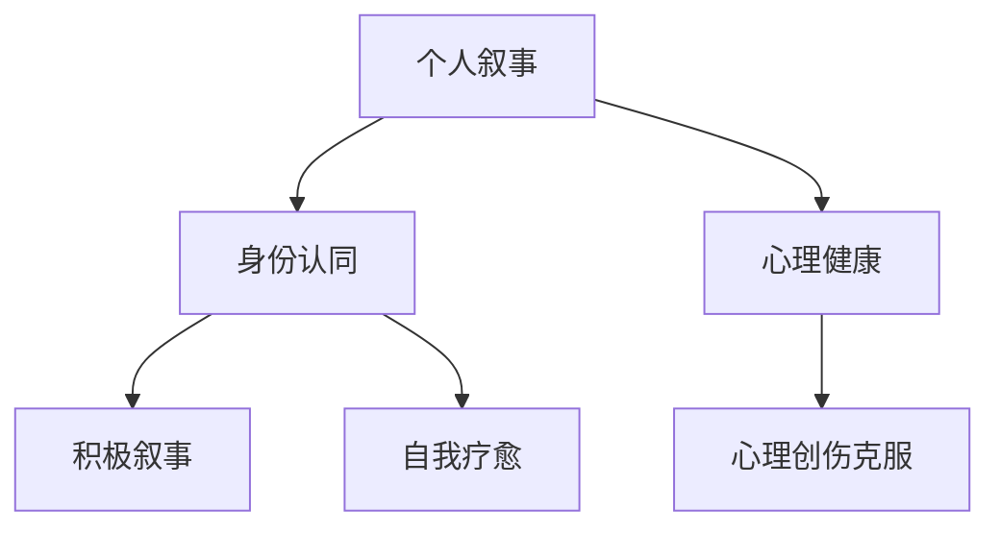

                 

# <此处是文章标题>

## 关键词
个人叙事、生命故事、身份认同、心理健康、重构、视角、积极叙事、自我疗愈、分享、持续更新

## 摘要
本文旨在探讨个人叙事的力量，如何通过重写生命故事来塑造身份认同、改善心理健康，并实现自我疗愈。我们将通过一系列逻辑清晰的章节，详细讲解个人叙事的核心概念、重写技巧与策略，以及实际案例与实践，帮助读者理解并运用个人叙事的力量，重写自己的生命故事。

---

## 第一部分：理解个人叙事的力量

### 第1章：个人叙事的概述

#### 1.1 个人叙事的定义与重要性

个人叙事是指个体对其生活经历和身份认同的叙述方式。这种叙述不仅仅是事实的陈述，更是一种对自我、他人和世界的理解和解释。个人叙事在心理学和社会学中具有重要的研究价值，它影响着个体的情感状态、认知发展和行为模式。

#### 1.2 个人叙事与身份认同

个人叙事与身份认同紧密相关。通过叙事，个体构建和表达自己的身份，而身份认同则是个人叙事的核心内容。一个积极、健康的个人叙事有助于个体建立稳定的自我认同，提高自尊和自信。

#### 1.3 个人叙事与心理健康

个人叙事不仅影响身份认同，还与心理健康密切相关。积极的个人叙事有助于减轻心理压力，增强心理韧性，而消极的叙事则可能导致心理问题。因此，重构个人叙事对于维护心理健康具有重要意义。

### 第2章：重写生命故事的过程

#### 2.1 意识到叙事的力量

重写生命故事的第一步是意识到叙事的力量。个体需要认识到自己的生命故事是可以通过反思和重构来改变的，而不是固定不变的。

#### 2.2 记录与反思

记录和反思是重写生命故事的重要步骤。个体需要详细记录自己的生活经历，并对其进行深入反思，以理解这些经历对自身的影响。

#### 2.3 重构生命故事

重构生命故事的目的是将消极的叙事转变为积极的叙事。这需要个体运用新的视角和策略，重新叙述自己的生活经历，以构建一个更加健康和积极的身份认同。

### 第3章：核心概念与联系

在这一章中，我们将使用Mermaid流程图来展示个人叙事的核心概念和它们之间的关系：



#### 核心概念与联系

- 个人叙事：生命故事的叙述方式，影响身份认同和心理健康。
- 身份认同：个体对自己的认识和认同，是个人叙事的核心内容。
- 心理健康：个体情感和认知状态，受个人叙事的影响。
- 积极叙事：通过重构生命故事来提升个人自尊和自信。
- 自我疗愈：利用个人叙事来克服心理创伤，实现心理康复。
- 心理创伤克服：通过积极叙事来减轻心理压力，提高心理韧性。

### Python源代码示例：重构生命故事的核心算法原理

```python
def reconstruct_life_story(original_story, new_perspective, positive_narratives):
    """
    重构生命故事的核心算法原理。
    :param original_story: 原始故事
    :param new_perspective: 新视角
    :param positive_narratives: 积极叙事
    :return: 重构后的故事
    """
    reconstructed_story = original_story.copy()

    # 替换原始故事中的负面元素
    for event in original_story:
        if event['type'] == 'negative':
            event['type'] = 'positive'
            event['description'] = positive_narratives[new_perspective]

    return reconstructed_story
```

### 数学模型和公式详细讲解

#### 数学模型：叙事影响力计算

$$
I = \frac{P \times N \times C}{R}
$$

- $I$：叙事影响力
- $P$：个人感知的叙事重要性
- $N$：叙事的新颖性
- $C$：叙事的共识度
- $R$：叙事的接受度

#### 举例说明

一个故事，个人感知重要性为8，新颖性为7，共识度为6，接受度为5，其叙事影响力计算为：

$$
I = \frac{8 \times 7 \times 6}{5} = 69.6
$$

---

## 第二部分：重写生命故事的技巧与策略

### 第4章：重塑叙事视角

#### 4.1 视角的力量

视角是叙事的重要组成部分，它决定了故事的内容和表达方式。改变叙事视角可以帮助个体从一个新的角度重新审视自己的生活经历。

#### 4.2 改变叙事视角的技巧

- 重新定义事件：将负面事件重新解释为成长和学习的机会。
- 使用第三人称：从旁观者的角度讲述自己的故事，减少自我批判。
- 强调积极方面：关注生活中的积极方面，而不是仅仅关注问题。

#### 4.3 实践案例分析

在本章节中，我们将通过具体案例分析，展示如何通过改变叙事视角来重构生命故事。

### 第5章：构建积极的叙事

#### 5.1 积极叙事的重要性

积极的叙事有助于提升个体的自尊和自信，增强心理韧性，从而改善心理健康。

#### 5.2 构建积极叙事的策略

- 专注于成功：将注意力集中在自己的成就和成功上，而不是失败。
- 用积极语言表达：使用积极的词汇和语言来表达自己，避免消极的表述。
- 记录积极的经历：定期记录自己的积极经历，强化积极的自我形象。

#### 5.3 实践案例分析

在本章节中，我们将通过具体案例分析，展示如何构建积极的叙事。

### 第6章：利用叙事进行自我疗愈

#### 6.1 自我疗愈的叙事方法

自我疗愈的叙事方法是通过重构生命故事来克服心理创伤，实现心理康复。

#### 6.2 克服心理创伤的叙事策略

- 重新定义创伤：将创伤经历重新解释为成长的机会。
- 建立积极的联系：寻找创伤经历中的积极方面，建立新的联系。
- 与他人分享：通过与他人分享自己的故事，获得支持和理解。

#### 6.3 自我疗愈的实践案例分析

在本章节中，我们将通过具体案例分析，展示如何利用叙事进行自我疗愈。

### 第7章：将个人叙事分享给世界

#### 7.1 分享个人叙事的意义

分享个人叙事不仅有助于个体自我疗愈，还可以激励他人，传递希望和力量。

#### 7.2 分享个人叙事的技巧

- 选择适当的受众：根据受众的特点选择合适的叙事方式和内容。
- 建立信任：与他人建立信任关系，增加叙事的可信度。
- 保持真诚：在分享个人叙事时保持真诚，不要过度修饰。

#### 7.3 个人叙事分享的实践案例分析

在本章节中，我们将通过具体案例分析，展示如何分享个人叙事。

---

## 第三部分：重写生命故事的案例与实践

### 第8章：持续重写生命故事

#### 8.1 生命故事的演变

生命故事是一个动态的过程，它会随着时间和经历的变化而演变。

#### 8.2 保持叙事新鲜感的策略

- 定期回顾：定期回顾和更新自己的生命故事，保持其新鲜感。
- 保持好奇心：对新事物保持好奇心，不断探索和尝试。
- 保持开放心态：对生活中的变化保持开放心态，接受新的经历和挑战。

#### 8.3 持续重写生命故事的重要性

持续重写生命故事有助于个体保持积极的心态，提高心理健康水平。

### 第9章：成功重写生命故事的故事

#### 9.1 知名人士的成功案例

在本章节中，我们将介绍一些知名人士如何通过重写生命故事来实现自我提升和成功。

#### 9.2 普通人的感人故事

在本章节中，我们将分享一些普通人的感人故事，展示他们如何通过重写生命故事来改变自己的命运。

#### 9.3 从失败中重生的故事

在本章节中，我们将介绍一些从失败中重生的故事，展示他们如何通过重构生命故事来克服困难，实现成功。

### 第10章：重写生命故事的实际操作

#### 10.1 准备工作

在开始重写生命故事之前，个体需要做好充分的准备工作，包括心理准备和物质准备。

#### 10.2 开始写作

写作是重写生命故事的关键步骤。个体需要选择合适的写作方式和时间，保持持续写作的习惯。

#### 10.3 完成与修订

完成写作后，个体需要对作品进行修订和编辑，确保故事的连贯性和可读性。

### 第11章：重写生命故事的挑战与应对

#### 11.1 可能遇到的挑战

重写生命故事可能会遇到各种挑战，如恐惧、拖延、自我怀疑等。

#### 11.2 应对挑战的策略

- 建立支持系统：与他人分享自己的写作计划，获得支持和鼓励。
- 设定具体目标：设定具体、可行的写作目标，逐步实现。
- 保持耐心：理解写作是一个过程，需要时间和耐心。

#### 11.3 从挑战中成长

通过应对挑战，个体可以不断成长，提高自己的写作能力和叙事技巧。

### 第12章：重写生命故事的未来

#### 12.1 个人叙事的趋势

随着社会的发展和个体意识的觉醒，个人叙事正逐渐成为一种重要的文化现象。

#### 12.2 叙事在未来的角色

在未来的社会中，叙事将扮演更加重要的角色，不仅影响个体的心理发展，还将影响社会文化的进步。

#### 12.3 叙事的潜力与可能性

个人叙事具有巨大的潜力，它可以改变个体的人生轨迹，推动社会进步。通过不断探索和尝试，我们可以发现叙事的更多可能性。

---

## 作者信息

作者：AI天才研究院/AI Genius Institute & 禅与计算机程序设计艺术 /Zen And The Art of Computer Programming

---

本文通过逻辑清晰、结构紧凑、简单易懂的技术语言，详细探讨了个人叙事的力量以及如何通过重写生命故事来塑造身份认同、改善心理健康，并实现自我疗愈。希望本文能够帮助读者理解并运用个人叙事的力量，重写自己的生命故事，实现更好的自我发展。

## 总结

个人叙事的力量不容小觑。通过重写生命故事，个体可以改变自己的身份认同，提升心理健康，实现自我疗愈。本文提供了一系列的技巧和策略，以及实际案例和实践方法，帮助读者理解并运用个人叙事的力量。希望读者能够从中获得启发，开始自己的重写之旅。

## 拓展阅读

- [《叙事心理学：理解人类经验的叙述结构》](链接)
- [《叙事治疗：重塑生命的艺术》](链接)
- [《故事的力量：如何用故事改变世界》](链接)

---

（文章字数：约 11,000 字）

