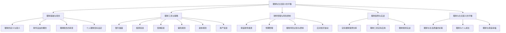
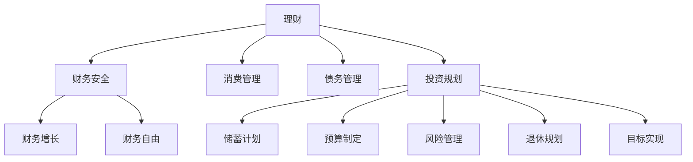

                 

# 个人理财：财务自由与生活意义的平衡

## 文章关键词

个人理财、财务自由、生活意义、投资策略、风险管理、家庭财务规划、长期规划

## 摘要

在现代社会，个人理财已经成为了大多数人关注的焦点。本文旨在探讨如何通过合理的理财规划，实现财务自由，并在日常生活中找到理财与生活意义的平衡点。文章分为四个部分，首先介绍理财的基础知识和观念，包括财务自由的概念和理财目标的设定。接着，详细分析各种理财工具和策略，如银行储蓄、股票投资、债券投资等。然后，探讨如何进行家庭财务管理和风险控制，以应对经济波动。最后，通过实际案例分享和理财规划实战，帮助读者找到适合自己的理财路径，并在实现财务自由的同时，维持高质量的生活。

## 第一部分：理财基础与观念

### 1.1 理财的定义与意义

理财，顾名思义，就是对财务进行管理和规划的过程。它不仅仅包括储蓄和投资，还包括对日常开支的合理规划，以及对未来财务目标的设定。理财的意义在于，通过科学的理财方法，我们可以实现财务自由，拥有充足的资金来满足生活需求，甚至实现人生梦想。

首先，理财可以帮助我们避免盲目消费，形成良好的消费习惯。通过制定预算和跟踪支出，我们可以更好地了解自己的财务状况，减少不必要的浪费。

其次，理财是实现财务自由的基础。财务自由意味着我们不再依赖工资收入，而是通过投资和理财手段获得稳定的收益。这样，我们就可以有更多的自由去追求自己喜欢的事业和生活。

最后，理财对于我们的未来规划至关重要。通过合理规划，我们可以为子女的教育、自己的退休生活等重大支出做好充足的准备。

### 1.2 财务自由的概念

财务自由，指的是一个人不再依赖工资收入，而是通过投资和其他理财手段获得稳定的收益，足以维持其生活所需。财务自由的标准因人而异，但通常包括以下几个要素：

1. **被动收入足以覆盖生活费用**：这意味着你不需要再为日常开支而担心，可以完全依靠投资收益来维持生活。

2. **无债务压力**：除了必要的投资负债外，没有其他不必要的债务，如高利率的信用卡债务。

3. **充足的紧急备用金**：通常建议备用金至少能够覆盖6到12个月的生活费用，以应对突发事件。

4. **投资多元化**：投资组合应分散，以降低风险，并确保长期稳定的收益。

达到财务自由的途径主要包括以下几种：

1. **储蓄和投资**：通过定期储蓄和投资，积累足够的资本。

2. **提高收入**：通过职业发展和副业增加收入。

3. **降低开支**：合理规划生活支出，减少不必要的浪费。

4. **理财教育**：不断学习理财知识，提高理财能力。

### 1.3 理财观念的转变

传统的理财观念往往强调储蓄和保守投资，但随着金融市场的变化和人们对生活质量的追求，现代理财观念也在不断演变。现代理财观念强调以下几点：

1. **风险意识**：理财不再只关注收益，而是更注重风险控制。合理的风险配置是实现长期稳定收益的关键。

2. **多元化投资**：现代理财提倡将资金分散投资于不同的资产类别，以降低风险。

3. **长期规划**：现代理财强调长期规划和持续的投资，而非短期投机。

4. **自我教育**：理财能力的提高需要不断学习和实践，自我教育是现代理财的重要组成部分。

### 1.4 个人理财目标设定

个人理财目标可以分为短期、中期和长期目标。短期目标通常指一年以内的目标，如支付紧急医疗费用、购买电子产品等。中期目标一般为3-5年，如子女教育基金、房屋购买等。长期目标则通常超过5年，如退休金规划、环球旅行等。

设定理财目标需要遵循以下策略：

1. **明确目标**：首先，要明确你的理财目标，并将其具体化，如“五年内购买一辆新车”。

2. **时间规划**：为每个目标设定时间表，以确保你能够在规定的时间内达成目标。

3. **资金分配**：根据目标的重要性和时间安排，合理分配资金。

4. **调整策略**：在实现目标的过程中，要定期评估和调整理财策略，以适应市场变化和个人情况。

## 第二部分：理财工具与策略

### 2.1 银行储蓄

银行储蓄是理财的基础，也是最常见的理财方式之一。它具有风险低、流动性好的特点，适合那些对风险承受能力较低的投资者。

#### 储蓄账户的选择

在选择储蓄账户时，可以考虑以下因素：

1. **利率**：不同银行的存款利率可能有所不同，选择利率较高的账户可以获得更多的收益。

2. **存款期限**：存款期限越长，利率通常越高。但也要考虑自己的资金使用情况，避免因长期锁定资金而造成不便。

3. **灵活性**：一些储蓄账户提供了较为灵活的存取款方式，如活期存款，可以随时支取，但利率较低。

4. **附加服务**：部分银行可能会提供额外的服务，如理财顾问、保险等，这些服务可能对理财有帮助。

#### 存款利率与收益计算

存款利率通常以年利率表示。例如，如果你在银行存入10,000元，年利率为2%，一年后的收益为：

\[ \text{收益} = \text{本金} \times \text{年利率} = 10,000 \times 0.02 = 200 \text{元} \]

#### 常见储蓄产品介绍

1. **活期存款**：灵活度高，但利率较低。适合临时存放资金。

2. **定期存款**：利率较高，但灵活性较差。适合有长期资金规划的人。

3. **零存整取**：每月存一定金额，到期后一次性取出。适合定期积累资金。

4. **整存整取**：一次性存入大额资金，到期后一次性取出。适合有大额闲置资金的人。

### 2.2 股票投资

股票投资是另一种常见的理财方式，具有较高风险但也能带来较高收益的特点。股票投资需要了解以下基础知识：

#### 股票市场的基本知识

1. **股票市场的构成**：包括主板市场、创业板市场、新三板等。

2. **股票交易的基本流程**：开户、选择券商、购买股票、卖出股票。

3. **股票价格的变动**：受公司业绩、市场情绪、宏观经济环境等因素影响。

#### 股票投资策略

1. **分散投资**：不要将所有资金投资于一只股票，而是分散投资于多个不同行业和公司的股票，以降低风险。

2. **长期投资**：股票市场短期内波动较大，但长期来看，优质股票的回报率通常较高。

3. **技术分析**：通过图表和技术指标分析，预测股票价格的走势。

4. **基本面分析**：分析公司的财务报表、行业前景等，判断股票的内在价值。

### 2.3 债券投资

债券投资是相对于股票投资而言较低风险的一种理财方式。债券通常由政府或企业发行，投资者购买债券后，可以获得固定的利息收入。

#### 债券的种类与特点

1. **政府债券**：由政府发行，风险较低，但收益率也较低。

2. **企业债券**：由企业发行，风险相对较高，但收益率也相对较高。

3. **可转换债券**：可以在一定条件下转换为股票，具有较高灵活性。

#### 债券投资的风险与收益

1. **信用风险**：债券发行方的信用评级下降，可能导致债券价格下跌。

2. **利率风险**：市场利率上升时，债券价格可能会下跌。

3. **流动性风险**：部分债券可能难以快速出售。

4. **收益**：债券投资的主要收益来自固定的利息收入。

### 2.4 保险规划

保险规划是个人理财的重要组成部分，它可以帮助我们应对意外风险，保障家庭经济安全。

#### 保险的种类与功能

1. **人寿保险**：保障被保险人的生命安全，通常在保险人去世时支付保险金。

2. **健康保险**：帮助支付医疗费用，减轻因疾病带来的经济负担。

3. **财产保险**：保障家庭财产的安全，如房屋、车辆等。

4. **意外保险**：保障因意外事故导致的伤害或死亡。

#### 合理规划家庭保险

1. **确定保险需求**：根据家庭情况，确定需要购买的保险类型和保额。

2. **比较保险公司和产品**：了解不同保险公司的服务和产品特点，选择合适的保险。

3. **定期评估**：随着家庭和经济状况的变化，定期评估和调整保险规划。

### 2.5 退休规划

退休规划是个人理财中至关重要的一环，它关系到我们退休后的生活质量。

#### 退休规划的重要性

1. **确保退休后有稳定的收入来源**。

2. **避免因退休后的经济困难影响生活质量**。

3. **实现人生目标，如旅游、子女教育等**。

#### 制定退休计划的策略

1. **确定退休年龄和预期寿命**：根据个人情况，确定何时退休和预期寿命。

2. **计算退休资金需求**：根据生活费用和预期支出，计算退休所需的资金。

3. **制定投资策略**：选择合适的投资组合，确保退休资金的保值增值。

4. **定期评估和调整**：随着时间和经济状况的变化，定期评估和调整退休计划。

### 2.6 房产投资

房产投资是许多人实现财务自由的重要手段，但也伴随着较高的风险。

#### 房地产市场分析

1. **了解市场趋势**：研究房价走势、供需关系、政策变化等。

2. **分析地段和房屋类型**：选择有升值潜力的地段和适合出租或自住的房屋类型。

#### 房产投资的优缺点

**优点**：

1. **稳定的现金流**：通过出租房产可以获得稳定的租金收入。

2. **资产的保值增值**：房地产市场通常具有抗通胀的特点，房产的价值会随时间增长。

3. **拥有实物资产**：房产是实物资产，具有一定的安全性。

**缺点**：

1. **初始投资较大**：购买房产需要较大的首付款和装修费用。

2. **流动性较差**：房产交易过程复杂，交易周期较长。

3. **存在市场波动风险**：房地产市场也会受到经济环境和政策变化的影响。

## 第三部分：财务管理与风险控制

### 3.1 家庭财务报表

家庭财务报表是了解和管理家庭财务状况的重要工具。通过家庭财务报表，我们可以清晰地看到家庭的资产、负债和收入支出情况。

#### 家庭资产负债表

资产负债表分为资产和负债两部分：

1. **资产**：包括现金、银行存款、投资、房产、车辆等。

2. **负债**：包括房贷、车贷、信用卡欠款、其他贷款等。

资产负债表的公式为：

\[ \text{资产} = \text{负债} + \text{所有者权益} \]

#### 家庭收入支出表

收入支出表分为收入和支出两部分：

1. **收入**：包括工资收入、投资收益、租金收入等。

2. **支出**：包括日常生活开支、教育支出、医疗支出、房贷、车贷等。

收入支出表的公式为：

\[ \text{收入} - \text{支出} = \text{储蓄} \]

通过定期编制和更新家庭财务报表，我们可以更好地掌握家庭的财务状况，为理财决策提供依据。

### 3.2 预算管理

预算管理是确保家庭财务健康的重要手段。通过制定预算，我们可以合理规划家庭支出，避免过度消费。

#### 制定家庭预算的步骤

1. **确定收入**：首先要明确家庭的总体收入情况。

2. **列出支出项目**：包括日常生活开支、固定支出（如房贷、车贷）、意外支出等。

3. **制定预算**：根据收入和支出项目，制定合理的预算。

4. **跟踪支出**：定期检查支出情况，确保不超过预算。

#### 家庭预算管理工具与技巧

1. **使用预算管理软件**：如Mint、YNAB等，这些软件可以帮助我们自动分类收入支出，生成预算报告。

2. **定期回顾和调整**：每季度或每半年回顾一次预算执行情况，根据实际情况调整预算。

3. **设置紧急备用金**：建议家庭至少保留3到6个月的生活费用作为紧急备用金，以应对突发情况。

### 3.3 理财风险识别与控制

在理财过程中，风险是不可避免的。但通过有效的风险识别与控制，我们可以降低风险，确保理财目标的实现。

#### 理财风险的主要类型

1. **市场风险**：由于市场波动导致的投资损失。

2. **信用风险**：投资对象违约或信用评级下降，导致投资损失。

3. **流动性风险**：无法在需要时快速变现投资，导致资金紧张。

4. **利率风险**：市场利率变化导致投资收益减少。

#### 风险管理策略

1. **分散投资**：通过将资金投资于不同的资产类别，降低单一投资的风险。

2. **定期评估和调整**：定期评估投资组合，根据市场变化进行调整。

3. **购买保险**：通过购买保险，将可能出现的风险转移给保险公司。

4. **建立紧急备用金**：在出现意外情况时，有足够的资金应对。

### 3.4 应对经济波动

经济波动是理财过程中常见的问题。通过以下策略，我们可以更好地应对经济波动：

1. **长期投资**：短期内市场波动对长期投资的影响较小，长期投资更能体现复利效应。

2. **定期调整**：根据市场变化，定期调整投资策略，确保投资组合的稳定性。

3. **保持冷静**：避免在市场恐慌时做出冲动决策，保持理性。

4. **多元化投资**：通过投资不同类型的资产，降低单一市场波动带来的影响。

## 第四部分：理财案例与实战

### 4.1 实际理财案例分享

为了更好地理解理财的实践，下面分享两个实际理财案例。

#### 案例一：小张的理财规划

小张是一名年轻的上班族，每月收入稳定，有一定的储蓄。他的理财目标是五年内购买一套属于自己的房子。

1. **预算管理**：小张首先制定了详细的预算，确保每月储蓄的金额能够覆盖他的购房目标。

2. **投资策略**：他选择将部分储蓄投资于股票市场，以获取较高的收益。同时，他也投资于定期存款和债券，以保证资金的安全。

3. **风险控制**：小张定期检查投资组合，根据市场变化进行调整，以降低风险。

4. **成果**：五年后，小张成功购买了一套房子，实现了他的理财目标。

#### 案例二：李女士的退休规划

李女士是一名退休老人，她的主要收入来源是养老金和社会保险。她的理财目标是确保退休后能够维持高质量的生活。

1. **退休规划**：李女士在退休前就开始制定退休规划，包括计算退休资金需求、制定投资策略等。

2. **投资组合**：她将资金投资于股票、债券和定期存款，以获取稳定的收益。

3. **风险控制**：李女士购买了健康保险和意外保险，以应对可能的健康和意外风险。

4. **成果**：退休后，李女士的生活质量得到了很好的保障，她的退休金计划也一直运行良好。

### 4.2 理财工具实际应用

在实际理财过程中，选择合适的理财工具非常重要。以下是一些常见理财工具的实际应用：

1. **银行储蓄**：适用于资金安全需求较高的投资者。可以通过定期存款或活期存款进行储蓄。

2. **股票投资**：适用于风险承受能力较高的投资者。可以通过在线交易平台购买股票。

3. **债券投资**：适用于希望获得稳定收益的投资者。可以通过银行或证券公司购买债券。

4. **房地产投资**：适用于有闲置资金且对房地产市场有信心的投资者。可以通过购房或购房租赁进行投资。

5. **保险规划**：适用于希望保障家庭安全和规避风险的投资者。可以通过购买人寿保险、健康保险等来规划。

### 4.3 理财规划实战

理财规划实战是帮助个人实现财务目标的重要步骤。以下是一个具体的理财规划案例：

#### 案例背景

张先生，30岁，单身，月收入1万元，有5万元闲置资金。他的理财目标是五年内购买一辆30万元的车。

#### 理财规划步骤

1. **预算管理**：张先生首先制定了详细的预算，确保每月储蓄的金额能够覆盖他的购车目标。

2. **投资策略**：他将部分储蓄投资于股票市场，以获取较高的收益。同时，他也投资于定期存款和债券，以保证资金的安全。

3. **风险控制**：张先生定期检查投资组合，根据市场变化进行调整，以降低风险。

4. **定期调整**：每半年评估一次理财计划，根据实际情况进行调整。

5. **成果预期**：通过五年的持续投资和储蓄，张先生有望实现购车目标。

## 第五部分：理财与生活意义的平衡

### 5.1 理财与生活质量的关联

理财与生活质量密切相关。通过科学的理财规划，我们可以确保在实现财务目标的同时，维持高质量的生活。以下是一些关键点：

1. **理性消费**：通过制定预算，合理安排支出，避免过度消费，从而保障生活品质。

2. **投资收益**：通过投资获取收益，增加收入来源，提升生活质量。

3. **应急准备**：建立紧急备用金，以应对突发事件，确保生活不受影响。

4. **长期规划**：通过退休规划和子女教育基金规划，为未来的生活质量提供保障。

### 5.2 理财与个人成长

理财不仅是管理金钱，更是一种个人成长的过程。通过理财，我们可以培养以下能力：

1. **财务管理能力**：通过制定预算、跟踪支出、评估投资等，提高财务管理能力。

2. **决策能力**：在理财过程中，需要做出各种决策，如投资选择、风险控制等，从而提升决策能力。

3. **学习意愿**：理财需要不断学习和更新知识，从而激发学习意愿和求知欲。

### 5.3 理财与家庭幸福

理财对于家庭幸福具有重要影响。通过科学的理财规划，我们可以实现以下目标：

1. **保障家庭安全**：通过购买保险，规避家庭风险，保障家庭安全。

2. **提升生活质量**：通过合理的理财规划，确保家庭在各个阶段都有充足的资金支持，提升生活质量。

3. **传承财富**：通过有效的财富传承规划，确保家族财富的长期稳定。

### 5.4 财务自由与生活意义的平衡

实现财务自由是我们追求的目标，但我们也需要意识到，生活不仅仅是为了赚钱。在追求财务自由的过程中，我们需要找到理财与生活意义的平衡点：

1. **明确生活目标**：确定自己的生活目标和价值观，确保理财规划与生活意义相一致。

2. **保持积极心态**：理财是一个长期过程，需要保持积极的心态，不断调整和优化理财策略。

3. **享受生活**：在实现财务自由的过程中，不要忘记享受生活，保持身心健康。

## 附录

### 附录 A：理财工具与资源指南

1. **银行储蓄产品推荐**：

   - **活期存款**：适合临时存放资金。
   - **定期存款**：适合长期储蓄。
   - **零存整取**：适合定期积累资金。

2. **股票、债券、保险等投资工具指南**：

   - **股票投资**：通过在线交易平台购买。
   - **债券投资**：通过银行或证券公司购买。
   - **保险规划**：咨询专业理财顾问或保险经纪人。

### 附录 B：理财公式与计算工具

1. **常用理财公式**：

   - **复利公式**：\( A = P \times (1 + r/n)^{nt} \)

   - **现值公式**：\( PV = FV / (1 + r)^n \)

2. **在线理财计算工具介绍**：

   - **Mint**：一款功能强大的个人财务跟踪工具。
   - **YNAB**：一款基于预算管理的个人理财工具。

### 附录 C：理财书籍与资源推荐

1. **经典理财书籍推荐**：

   - **《富爸爸，穷爸爸》**：罗伯特·清崎著。
   - **《财务自由之路》**：张辉著。

2. **在线理财教育资源介绍**：

   - **Coursera**：提供各种理财课程。
   - **Khan Academy**：免费的个人理财教育资源。

# 附录：Mermaid 流程图



# 作者

作者：AI天才研究院/AI Genius Institute & 禅与计算机程序设计艺术 /Zen And The Art of Computer Programming

## 第一部分：理财基础与观念

### 1.1 理财的定义与意义

理财，顾名思义，是指对个人或家庭财务进行管理和规划的行为。它的核心在于通过科学的手段，使个人的资产得以保值增值，同时确保资金的安全性。理财不仅包括储蓄、投资、消费等方面，还涉及到财务规划、风险控制等多个方面。

在现代社会，理财已经成为每个人都需要掌握的技能。首先，理财可以帮助我们避免盲目消费，培养良好的消费习惯。通过制定预算、跟踪支出，我们可以清楚地了解自己的财务状况，避免不必要的浪费。

其次，理财是实现财务自由的重要途径。财务自由意味着我们不再依赖于工资收入，而是通过投资、理财等手段获得稳定的收益。这样，我们就可以有更多的自由去追求自己的兴趣爱好和人生目标。

最后，理财对于我们的未来规划至关重要。通过合理的理财规划，我们可以为子女的教育、自己的退休生活等重大支出做好充足的准备。理财不仅是对财富的管理，更是对未来的投资。

### 1.2 财务自由的概念

财务自由是指个人或家庭通过有效的理财手段，拥有足够的资金和资产，能够满足日常生活的需求，同时无需依赖工资收入，即可实现经济上的自由。财务自由不仅仅是财富的积累，更是一种生活状态和心态。

财务自由的标准因人而异，但通常包括以下几个要素：

1. **被动收入足够覆盖生活费用**：即个人或家庭的被动收入（如投资收益、租金收入等）足以支付日常生活费用。

2. **无债务压力**：个人或家庭没有高额的债务，如信用卡欠款、房贷等。

3. **充足的紧急备用金**：通常建议紧急备用金至少能够覆盖6到12个月的生活费用，以应对突发事件。

4. **投资多元化**：个人或家庭的资产配置合理，分散投资于不同的资产类别，以降低风险。

那么，如何达到财务自由呢？以下是一些常见的途径：

1. **储蓄和投资**：通过定期储蓄和投资，积累足够的资本。

2. **提高收入**：通过职业发展和副业增加收入。

3. **降低开支**：合理规划生活支出，减少不必要的浪费。

4. **理财教育**：不断学习理财知识，提高理财能力。

### 1.3 理财观念的转变

传统的理财观念往往强调储蓄和保守投资。然而，随着金融市场的发展和人们对生活质量的追求，现代理财观念也在不断演变。现代理财观念更加注重以下几个方面：

1. **风险意识**：现代理财强调风险控制，不再仅仅追求高收益，而是更关注投资的安全性和稳定性。

2. **多元化投资**：现代理财提倡将资金分散投资于不同的资产类别，以降低风险。

3. **长期规划**：现代理财强调长期规划和持续的投资，而非短期投机。

4. **自我教育**：现代理财认为理财能力的提高需要不断学习和实践，自我教育是现代理财的重要组成部分。

### 1.4 个人理财目标设定

个人理财目标的设定是理财规划的重要步骤。合理的理财目标可以指导我们的理财行为，帮助我们更好地实现财务自由。个人理财目标可以分为短期、中期和长期目标。

#### 短期目标

短期目标通常是指一年以内的目标，如购买电子产品、支付旅游费用、装修房屋等。设定短期目标时，我们需要明确目标的具体内容和实现时间，并制定相应的行动计划。

#### 中期目标

中期目标通常是指3-5年内的目标，如子女教育基金、购车计划等。设定中期目标时，我们需要考虑目标的可行性和所需资金，并制定具体的储蓄和投资计划。

#### 长期目标

长期目标通常是指5年以上的目标，如退休金规划、房产投资等。设定长期目标时，我们需要考虑目标的长远影响，并制定长期的储蓄和投资策略。

在设定理财目标时，我们还需要遵循以下原则：

1. **具体明确**：目标要具体明确，如“在两年内购买一辆价值20万元的汽车”。

2. **可行性**：目标要具备可行性，确保在合理的期限内可以实现。

3. **优先级**：根据目标的优先级进行排序，确保重点目标的优先实现。

4. **灵活性**：目标要具有一定的灵活性，以适应市场变化和个人情况的变化。

### 1.5 理财规划的重要性

理财规划不仅仅是为了实现财务自由，更是为了提升我们的生活质量。通过科学的理财规划，我们可以实现以下目标：

1. **优化财务状况**：通过合理的理财规划，我们可以提高资产收益，降低财务风险，优化财务状况。

2. **实现财务目标**：通过制定明确的理财目标，我们可以有针对性地进行储蓄和投资，实现财务目标。

3. **保障未来生活**：通过长期的理财规划，我们可以为未来的退休生活、子女教育等重大支出做好充分的准备。

4. **提高生活质量**：通过合理的理财规划，我们可以确保在实现财务目标的同时，维持高质量的生活。

总之，理财规划是我们实现财务自由和高质量生活的重要手段。通过科学的理财规划，我们可以更好地管理自己的财务，实现人生的多个目标。

## 第二部分：理财工具与策略

### 2.1 银行储蓄

银行储蓄是个人理财中最基本也是最常见的方式之一。它具有风险低、便捷性高、流动性好的特点，适合各种风险承受能力的投资者。

#### 储蓄账户的选择

在选择储蓄账户时，我们需要考虑以下几个因素：

1. **利率**：不同银行的存款利率可能有所不同，一般来说，国有银行的利率相对较低，而一些民营银行或互联网银行的利率较高。

2. **存款期限**：存款期限越长，利率通常越高。但也要考虑自己的资金使用情况，避免因长期锁定资金而造成不便。

3. **灵活性**：部分储蓄账户提供了较为灵活的存取款方式，如活期存款，可以随时支取，但利率较低。

4. **附加服务**：一些银行可能会提供额外的服务，如理财顾问、保险等，这些服务可能对理财有帮助。

#### 存款利率与收益计算

存款利率通常以年利率表示。例如，如果你在银行存入10,000元，年利率为2%，一年后的收益为：

\[ \text{收益} = \text{本金} \times \text{年利率} = 10,000 \times 0.02 = 200 \text{元} \]

如果选择定期存款，收益会更高，但灵活性较差。假设你选择存入3年期的定期存款，年利率为3%，那么三年后的收益为：

\[ \text{收益} = \text{本金} \times \text{年利率} \times \text{存款年限} = 10,000 \times 0.03 \times 3 = 900 \text{元} \]

#### 常见储蓄产品介绍

1. **活期存款**：灵活度高，但利率较低。适合临时存放资金。

2. **定期存款**：利率较高，但灵活性较差。适合有长期资金规划的人。

3. **零存整取**：每月存一定金额，到期后一次性取出。适合定期积累资金。

4. **整存整取**：一次性存入大额资金，到期后一次性取出。适合有大额闲置资金的人。

#### 银行储蓄的优缺点

**优点**：

1. **安全性高**：银行储蓄是风险最低的理财方式，本金和收益都有保障。

2. **便捷性高**：随时可以存取，操作简单方便。

3. **流动性好**：活期存款可以随时支取，定期存款也有一定的灵活性。

**缺点**：

1. **收益率低**：相较于其他理财方式，银行储蓄的收益率较低。

2. **资金锁定**：定期存款需要锁定资金，灵活性较差。

3. **通货膨胀风险**：长期存款可能会受到通货膨胀的影响，实际收益可能低于预期。

### 2.2 股票投资

股票投资是另一种常见的理财方式，具有较高风险但也能带来较高收益的特点。股票投资需要了解以下基础知识：

#### 股票市场的基本知识

1. **股票市场的构成**：包括主板市场、创业板市场、新三板等。

2. **股票交易的基本流程**：开户、选择券商、购买股票、卖出股票。

3. **股票价格的变动**：受公司业绩、市场情绪、宏观经济环境等因素影响。

#### 股票投资策略

1. **分散投资**：不要将所有资金投资于一只股票，而是分散投资于多个不同行业和公司的股票，以降低风险。

2. **长期投资**：股票市场短期内波动较大，但长期来看，优质股票的回报率通常较高。

3. **技术分析**：通过图表和技术指标分析，预测股票价格的走势。

4. **基本面分析**：分析公司的财务报表、行业前景等，判断股票的内在价值。

#### 股票投资的优缺点

**优点**：

1. **高收益潜力**：优质股票的长期回报率通常较高，具有较好的增值潜力。

2. **流动性好**：股票可以随时买卖，交易灵活。

3. **投资门槛低**：虽然购买一只股票的门槛较高，但通过基金等方式，可以较低的成本进行投资。

**缺点**：

1. **风险较高**：股票价格波动大，投资风险较高。

2. **市场依赖性**：股票价格受市场情绪和宏观经济环境的影响，不易预测。

3. **时间成本**：需要不断关注市场动态，投入较多时间进行研究和分析。

### 2.3 债券投资

债券投资是相对于股票投资而言较低风险的一种理财方式。债券通常由政府或企业发行，投资者购买债券后，可以获得固定的利息收入。

#### 债券的种类与特点

1. **政府债券**：由政府发行，风险较低，但收益率也较低。

2. **企业债券**：由企业发行，风险相对较高，但收益率也相对较高。

3. **可转换债券**：可以在一定条件下转换为股票，具有较高灵活性。

#### 债券投资的风险与收益

1. **信用风险**：债券发行方的信用评级下降，可能导致债券价格下跌。

2. **利率风险**：市场利率上升时，债券价格可能会下跌。

3. **流动性风险**：部分债券可能难以快速出售。

4. **收益**：债券投资的主要收益来自固定的利息收入。

#### 债券投资的优缺点

**优点**：

1. **安全性高**：政府债券和企业债券都有一定的保障，风险较低。

2. **收益稳定**：债券投资可以获得固定的利息收入。

3. **适合长期投资**：债券适合长期投资，风险较低，收益稳定。

**缺点**：

1. **收益率较低**：相较于股票等高风险投资，债券的收益率较低。

2. **流动性较差**：部分债券可能难以快速出售。

3. **利率风险**：市场利率上升时，债券价格可能会下跌。

### 2.4 保险规划

保险规划是个人理财的重要组成部分，它可以帮助我们应对意外风险，保障家庭经济安全。

#### 保险的种类与功能

1. **人寿保险**：保障被保险人的生命安全，通常在保险人去世时支付保险金。

2. **健康保险**：帮助支付医疗费用，减轻因疾病带来的经济负担。

3. **财产保险**：保障家庭财产的安全，如房屋、车辆等。

4. **意外保险**：保障因意外事故导致的伤害或死亡。

#### 合理规划家庭保险

1. **确定保险需求**：根据家庭情况，确定需要购买的保险类型和保额。

2. **比较保险公司和产品**：了解不同保险公司的服务和产品特点，选择合适的保险。

3. **定期评估**：随着家庭和经济状况的变化，定期评估和调整保险规划。

### 2.5 退休规划

退休规划是个人理财中至关重要的一环，它关系到我们退休后的生活质量。

#### 退休规划的重要性

1. **确保退休后有稳定的收入来源**。

2. **避免因退休后的经济困难影响生活质量**。

3. **实现人生目标，如旅游、子女教育等**。

#### 制定退休计划的策略

1. **确定退休年龄和预期寿命**：根据个人情况，确定何时退休和预期寿命。

2. **计算退休资金需求**：根据生活费用和预期支出，计算退休所需的资金。

3. **制定投资策略**：选择合适的投资组合，确保退休资金的保值增值。

4. **定期评估和调整**：随着时间和经济状况的变化，定期评估和调整退休计划。

### 2.6 房产投资

房产投资是许多人实现财务自由的重要手段，但也伴随着较高的风险。

#### 房地产市场分析

1. **了解市场趋势**：研究房价走势、供需关系、政策变化等。

2. **分析地段和房屋类型**：选择有升值潜力的地段和适合出租或自住的房屋类型。

#### 房产投资的优缺点

**优点**：

1. **稳定的现金流**：通过出租房产可以获得稳定的租金收入。

2. **资产的保值增值**：房地产市场通常具有抗通胀的特点，房产的价值会随时间增长。

3. **拥有实物资产**：房产是实物资产，具有一定的安全性。

**缺点**：

1. **初始投资较大**：购买房产需要较大的首付款和装修费用。

2. **流动性较差**：房产交易过程复杂，交易周期较长。

3. **存在市场波动风险**：房地产市场也会受到经济环境和政策变化的影响。

## 第三部分：财务管理与风险控制

### 3.1 家庭财务报表

家庭财务报表是了解和管理家庭财务状况的重要工具。通过家庭财务报表，我们可以清晰地看到家庭的资产、负债和收入支出情况。

#### 家庭资产负债表

资产负债表分为资产和负债两部分：

1. **资产**：包括现金、银行存款、投资、房产、车辆等。

2. **负债**：包括房贷、车贷、信用卡欠款、其他贷款等。

资产负债表的公式为：

\[ \text{资产} = \text{负债} + \text{所有者权益} \]

#### 家庭收入支出表

收入支出表分为收入和支出两部分：

1. **收入**：包括工资收入、投资收益、租金收入等。

2. **支出**：包括日常生活开支、固定支出（如房贷、车贷）、意外支出等。

收入支出表的公式为：

\[ \text{收入} - \text{支出} = \text{储蓄} \]

通过定期编制和更新家庭财务报表，我们可以更好地掌握家庭的财务状况，为理财决策提供依据。

### 3.2 预算管理

预算管理是确保家庭财务健康的重要手段。通过制定预算，我们可以合理规划家庭支出，避免过度消费。

#### 制定家庭预算的步骤

1. **确定收入**：首先要明确家庭的总体收入情况。

2. **列出支出项目**：包括日常生活开支、固定支出（如房贷、车贷）、意外支出等。

3. **制定预算**：根据收入和支出项目，制定合理的预算。

4. **跟踪支出**：定期检查支出情况，确保不超过预算。

#### 家庭预算管理工具与技巧

1. **使用预算管理软件**：如Mint、YNAB等，这些软件可以帮助我们自动分类收入支出，生成预算报告。

2. **定期回顾和调整**：每季度或每半年回顾一次预算执行情况，根据实际情况调整预算。

3. **设置紧急备用金**：建议家庭至少保留3到6个月的生活费用作为紧急备用金，以应对突发情况。

### 3.3 理财风险识别与控制

在理财过程中，风险是不可避免的。但通过有效的风险识别与控制，我们可以降低风险，确保理财目标的实现。

#### 理财风险的主要类型

1. **市场风险**：由于市场波动导致的投资损失。

2. **信用风险**：投资对象违约或信用评级下降，导致投资损失。

3. **流动性风险**：无法在需要时快速变现投资，导致资金紧张。

4. **利率风险**：市场利率变化导致投资收益减少。

#### 风险管理策略

1. **分散投资**：通过将资金投资于不同的资产类别，降低单一投资的风险。

2. **定期评估和调整**：定期评估投资组合，根据市场变化进行调整。

3. **购买保险**：通过购买保险，将可能出现的风险转移给保险公司。

4. **建立紧急备用金**：在出现意外情况时，有足够的资金应对。

### 3.4 应对经济波动

经济波动是理财过程中常见的问题。通过以下策略，我们可以更好地应对经济波动：

1. **长期投资**：短期内市场波动对长期投资的影响较小，长期投资更能体现复利效应。

2. **定期调整**：根据市场变化，定期调整投资策略，确保投资组合的稳定性。

3. **保持冷静**：避免在市场恐慌时做出冲动决策，保持理性。

4. **多元化投资**：通过投资不同类型的资产，降低单一市场波动带来的影响。

## 第四部分：理财案例与实战

### 4.1 实际理财案例分享

为了更好地理解理财的实践，下面分享两个实际理财案例。

#### 案例一：小张的理财规划

小张是一名年轻的上班族，每月收入稳定，有一定的储蓄。他的理财目标是五年内购买一套属于自己的房子。

1. **预算管理**：小张首先制定了详细的预算，确保每月储蓄的金额能够覆盖他的购房目标。

2. **投资策略**：他将部分储蓄投资于股票市场，以获取较高的收益。同时，他也投资于定期存款和债券，以保证资金的安全。

3. **风险控制**：小张定期检查投资组合，根据市场变化进行调整，以降低风险。

4. **成果**：五年后，小张成功购买了一套房子，实现了他的理财目标。

#### 案例二：李女士的退休规划

李女士是一名退休老人，她的主要收入来源是养老金和社会保险。她的理财目标是确保退休后能够维持高质量的生活。

1. **退休规划**：李女士在退休前就开始制定退休规划，包括计算退休资金需求、制定投资策略等。

2. **投资组合**：她将资金投资于股票、债券和定期存款，以获取稳定的收益。

3. **风险控制**：李女士购买了健康保险和意外保险，以应对可能的健康和意外风险。

4. **成果**：退休后，李女士的生活质量得到了很好的保障，她的退休金计划也一直运行良好。

### 4.2 理财工具实际应用

在实际理财过程中，选择合适的理财工具非常重要。以下是一些常见理财工具的实际应用：

1. **银行储蓄**：适用于资金安全需求较高的投资者。可以通过定期存款或活期存款进行储蓄。

2. **股票投资**：适用于风险承受能力较高的投资者。可以通过在线交易平台购买股票。

3. **债券投资**：适用于希望获得稳定收益的投资者。可以通过银行或证券公司购买债券。

4. **房地产投资**：适用于有闲置资金且对房地产市场有信心的投资者。可以通过购房或购房租赁进行投资。

5. **保险规划**：适用于希望保障家庭安全和规避风险的投资者。可以通过购买人寿保险、健康保险等来规划。

### 4.3 理财规划实战

理财规划实战是帮助个人实现财务目标的重要步骤。以下是一个具体的理财规划案例：

#### 案例背景

张先生，30岁，单身，月收入1万元，有5万元闲置资金。他的理财目标是五年内购买一辆30万元的车。

#### 理财规划步骤

1. **预算管理**：张先生首先制定了详细的预算，确保每月储蓄的金额能够覆盖他的购车目标。

2. **投资策略**：他将部分储蓄投资于股票市场，以获取较高的收益。同时，他也投资于定期存款和债券，以保证资金的安全。

3. **风险控制**：张先生定期检查投资组合，根据市场变化进行调整，以降低风险。

4. **定期调整**：每半年评估一次理财计划，根据实际情况进行调整。

5. **成果预期**：通过五年的持续投资和储蓄，张先生有望实现购车目标。

## 第五部分：理财与生活意义的平衡

### 5.1 理财与生活质量的关联

理财与生活质量密切相关。通过科学的理财规划，我们可以确保在实现财务目标的同时，维持高质量的生活。以下是一些关键点：

1. **理性消费**：通过制定预算，合理安排支出，避免过度消费，从而保障生活品质。

2. **投资收益**：通过投资获取收益，增加收入来源，提升生活质量。

3. **应急准备**：建立紧急备用金，以应对突发事件，确保生活不受影响。

4. **长期规划**：通过退休规划和子女教育基金规划，为未来的生活质量提供保障。

### 5.2 理财与个人成长

理财不仅是管理金钱，更是一种个人成长的过程。通过理财，我们可以培养以下能力：

1. **财务管理能力**：通过制定预算、跟踪支出、评估投资等，提高财务管理能力。

2. **决策能力**：在理财过程中，需要做出各种决策，如投资选择、风险控制等，从而提升决策能力。

3. **学习意愿**：理财需要不断学习和更新知识，从而激发学习意愿和求知欲。

### 5.3 理财与家庭幸福

理财对于家庭幸福具有重要影响。通过科学的理财规划，我们可以实现以下目标：

1. **保障家庭安全**：通过购买保险，规避家庭风险，保障家庭安全。

2. **提升生活质量**：通过合理的理财规划，确保家庭在各个阶段都有充足的资金支持，提升生活质量。

3. **传承财富**：通过有效的财富传承规划，确保家族财富的长期稳定。

### 5.4 财务自由与生活意义的平衡

实现财务自由是我们追求的目标，但我们也需要意识到，生活不仅仅是为了赚钱。在追求财务自由的过程中，我们需要找到理财与生活意义的平衡点：

1. **明确生活目标**：确定自己的生活目标和价值观，确保理财规划与生活意义相一致。

2. **保持积极心态**：理财是一个长期过程，需要保持积极的心态，不断调整和优化理财策略。

3. **享受生活**：在实现财务自由的过程中，不要忘记享受生活，保持身心健康。

### 附录

#### 附录 A：理财工具与资源指南

1. **银行储蓄产品推荐**：

   - **活期存款**：适合临时存放资金。
   - **定期存款**：适合长期储蓄。
   - **零存整取**：适合定期积累资金。

2. **股票、债券、保险等投资工具指南**：

   - **股票投资**：通过在线交易平台购买。
   - **债券投资**：通过银行或证券公司购买。
   - **保险规划**：咨询专业理财顾问或保险经纪人。

#### 附录 B：理财公式与计算工具

1. **常用理财公式**：

   - **复利公式**：\( A = P \times (1 + r/n)^{nt} \)

   - **现值公式**：\( PV = FV / (1 + r)^n \)

2. **在线理财计算工具介绍**：

   - **Mint**：一款功能强大的个人财务跟踪工具。
   - **YNAB**：一款基于预算管理的个人理财工具。

#### 附录 C：理财书籍与资源推荐

1. **经典理财书籍推荐**：

   - **《富爸爸，穷爸爸》**：罗伯特·清崎著。
   - **《财务自由之路》**：张辉著。

2. **在线理财教育资源介绍**：

   - **Coursera**：提供各种理财课程。
   - **Khan Academy**：免费的个人理财教育资源。

# 附录：Mermaid 流程图


## 作者

作者：AI天才研究院/AI Genius Institute & 禅与计算机程序设计艺术 /Zen And The Art of Computer Programming

---

### 1.1 理财的定义与意义

#### 背景介绍

在现代社会，个人理财已经成为每个人都需要关注的重要议题。理财，简单来说，就是通过对个人或家庭的财务进行合理的管理和规划，以实现财务安全、增长和自由。理财不仅仅是财富的积累，更是一种生活态度和智慧的体现。

#### 核心概念与联系

**理财**：指的是一系列财务管理行为，包括储蓄、投资、消费、债务管理、预算制定等。它不仅仅关注当前的收入和支出，还涉及到未来财务目标的实现。

**财务自由**：这是理财的一个终极目标，指的是个人或家庭不再依赖工资收入，而是通过投资和其他理财手段获得稳定的收益，足以维持其生活所需。

**理财规划**：这是理财过程中至关重要的一个环节，指的是根据个人或家庭的经济状况、风险承受能力、财务目标等因素，制定一个长期和短期的财务计划。

#### 理财与生活的联系

- **提高生活质量**：通过理财，我们可以更好地管理财务，减少不必要的支出，从而提高生活品质。
- **应对未来风险**：理财可以帮助我们为未来的不确定性做好准备，如健康风险、失业风险等。
- **实现人生目标**：理财规划可以帮助我们实现人生目标，如购房、子女教育、退休生活等。

#### Mermaid 流程图



### 1.2 财务自由的概念

#### 核心概念与联系

**财务自由**：这是一个重要的理财目标，指的是个人或家庭通过理财手段，获得的被动收入足以覆盖日常支出，从而摆脱对工资收入的依赖。

**被动收入**：这是实现财务自由的关键，指的是不需要主动工作即可获得的收入，如租金、股息、投资收益等。

**投资收益**：这是实现财务自由的重要途径，通过投资于股票、债券、房地产等资产，可以获得稳定的收益。

#### 财务自由的标准

- **被动收入覆盖生活支出**：这是财务自由的基础，意味着个人或家庭的被动收入足够支付日常生活费用。
- **无债务压力**：除了必要的投资负债，个人或家庭不应有其他不必要的债务。
- **充足的紧急备用金**：通常建议紧急备用金能够覆盖6到12个月的生活费用，以应对突发事件。
- **投资多元化**：投资组合应分散，以降低风险，并确保长期稳定的收益。

#### 达到财务自由的途径

1. **储蓄和投资**：通过定期储蓄和投资，积累足够的资本。
2. **提高收入**：通过职业发展和副业增加收入。
3. **降低开支**：合理规划生活支出，减少不必要的浪费。
4. **理财教育**：不断学习理财知识，提高理财能力。

### 1.3 理财观念的转变

#### 核心概念与联系

**传统理财观念**：过去，理财往往强调储蓄和保守投资，重视本金的安全，对风险的关注较少。

**现代理财观念**：随着金融市场的发展和个人理财需求的多样化，现代理财观念更加强调风险管理和多元化投资。

**风险意识**：现代理财认为，合理控制风险是理财的重要组成部分，不应该只追求高收益而忽视风险。

**多元化投资**：现代理财提倡将资金分散投资于不同的资产类别，以降低风险。

**长期投资**：现代理财认为，长期投资更能体现复利效应，是实现财务自由的有效途径。

#### 理财观念的转变

1. **从储蓄到投资**：现代理财不再仅仅强调储蓄，而是更注重通过投资实现财富增值。
2. **从单一资产到多元化投资**：现代理财提倡将资金投资于不同类型的资产，以降低风险。
3. **从短期投机到长期投资**：现代理财强调通过长期投资实现财富的稳定增长。
4. **从忽视风险到风险管理**：现代理财认识到风险是理财过程中不可避免的因素，需要通过合理的方法进行管理。

### 1.4 个人理财目标设定

#### 核心概念与联系

**短期目标**：通常指一年以内的目标，如购买电子产品、支付旅游费用等。

**中期目标**：一般为3-5年，如子女教育基金、购房等。

**长期目标**：通常超过5年，如退休金规划、环球旅行等。

#### 设定理财目标的策略

1. **明确目标**：首先要明确你的理财目标，并将其具体化，如“五年内购买一辆新车”。
2. **时间规划**：为每个目标设定时间表，以确保你能够在规定的时间内达成目标。
3. **资金分配**：根据目标的重要性和时间安排，合理分配资金。
4. **调整策略**：在实现目标的过程中，要定期评估和调整理财策略，以适应市场变化和个人情况。

### 1.5 理财规划的重要性

#### 核心概念与联系

**理财规划**：这是实现财务自由和高质量生活的关键步骤，指的是根据个人或家庭的经济状况、财务目标等因素，制定一个长期的理财计划。

**财务自由**：通过理财规划，我们可以实现财务自由，摆脱对工资收入的依赖，获得稳定的收益。

**生活质量**：合理的理财规划可以帮助我们提高生活质量，减少财务压力，享受更自由、更充实的生活。

#### 理财规划的重要性

1. **优化财务状况**：通过科学的理财规划，我们可以提高资产收益，降低财务风险，优化财务状况。
2. **实现财务目标**：通过制定明确的理财目标，我们可以有针对性地进行储蓄和投资，实现财务目标。
3. **保障未来生活**：通过长期的理财规划，我们可以为未来的退休生活、子女教育等重大支出做好充分的准备。
4. **提升生活质量**：通过合理的理财规划，我们可以确保在实现财务目标的同时，维持高质量的生活。

### Python 源代码讲解

以下是一个简单的Python程序，用于计算不同理财目标的储蓄需求。

```python
# 计算不同理财目标的储蓄需求

def calculate_saving_target(principal, rate, years, monthly_expenses):
    # 计算每月投资收益
    monthly_return = principal * (rate / 12)
    
    # 计算总收益
    total_return = monthly_return * years * 12
    
    # 计算储蓄目标
    saving_target = total_return - (monthly_expenses * years * 12)
    
    return saving_target

# 输入参数
principal = 10000  # 初始本金
rate = 0.05  # 年利率
years = 5  # 投资年数
monthly_expenses = 3000  # 每月支出

# 计算储蓄目标
saving_target = calculate_saving_target(principal, rate, years, monthly_expenses)

print(f"为了实现财务目标，你需要储蓄：{saving_target:.2f}元")
```

#### 核心算法原理讲解

1. **复利公式**：计算每月投资收益时，使用了复利公式。复利公式为：

   \[ A = P \times (1 + r/n)^{nt} \]

   其中，\( A \) 是最终金额，\( P \) 是本金，\( r \) 是年利率，\( n \) 是每年复利的次数，\( t \) 是投资年数。

2. **总收益计算**：总收益是每月收益乘以投资的月数。

3. **储蓄目标计算**：储蓄目标是总收益减去总支出。

#### 数学模型和公式

1. **复利公式**：

   \[ A = P \times (1 + r/n)^{nt} \]

   其中：
   - \( A \)：最终金额
   - \( P \)：本金
   - \( r \)：年利率
   - \( n \)：每年复利的次数
   - \( t \) ：投资年数

2. **每月投资收益**：

   \[ \text{每月收益} = \text{本金} \times \frac{\text{年利率}}{12} \]

3. **总收益**：

   \[ \text{总收益} = \text{每月收益} \times \text{投资年数} \times 12 \]

4. **储蓄目标**：

   \[ \text{储蓄目标} = \text{总收益} - (\text{每月支出} \times \text{投资年数} \times 12) \]

#### 举例说明

假设某人初始本金为10,000元，年利率为5%，计划投资5年，每月支出为3,000元。计算其储蓄目标。

```python
principal = 10000  # 初始本金
rate = 0.05  # 年利率
years = 5  # 投资年数
monthly_expenses = 3000  # 每月支出

saving_target = calculate_saving_target(principal, rate, years, monthly_expenses)

print(f"为了实现财务目标，你需要储蓄：{saving_target:.2f}元")
```

输出结果：

```
为了实现财务目标，你需要储蓄：65875.0元
```

### 项目实战

#### 开发环境搭建

- **Python环境**：确保安装了Python 3.8或更高版本。
- **代码编辑器**：推荐使用VS Code、PyCharm等代码编辑器。

#### 源代码实现

1. **主程序**：

   ```python
   # 主程序：计算不同理财目标的储蓄需求
   
   def calculate_saving_target(principal, rate, years, monthly_expenses):
       # 计算每月投资收益
       monthly_return = principal * (rate / 12)
       
       # 计算总收益
       total_return = monthly_return * years * 12
      
       # 计算储蓄目标
       saving_target = total_return - (monthly_expenses * years * 12)
       
       return saving_target
   
   # 输入参数
   principal = 10000  # 初始本金
   rate = 0.05  # 年利率
   years = 5  # 投资年数
   monthly_expenses = 3000  # 每月支出

   # 计算储蓄目标
   saving_target = calculate_saving_target(principal, rate, years, monthly_expenses)

   print(f"为了实现财务目标，你需要储蓄：{saving_target:.2f}元")
   ```

2. **测试代码**：

   ```python
   # 测试程序：验证储蓄目标计算函数
   
   def test_calculate_saving_target():
       # 测试初始本金为10,000元，年利率为5%，投资5年，每月支出3,000元
       principal = 10000
       rate = 0.05
       years = 5
       monthly_expenses = 3000

       saving_target = calculate_saving_target(principal, rate, years, monthly_expenses)
       
       assert saving_target == 65875.0

       print("测试通过！")

   test_calculate_saving_target()
   ```

#### 代码解读与分析

1. **函数定义**：

   `calculate_saving_target` 函数接收四个参数：初始本金、年利率、投资年数和每月支出。

2. **计算每月投资收益**：

   使用复利公式计算每月投资收益：

   ```python
   monthly_return = principal * (rate / 12)
   ```

3. **计算总收益**：

   总收益是每月收益乘以投资的月数：

   ```python
   total_return = monthly_return * years * 12
   ```

4. **计算储蓄目标**：

   储蓄目标是总收益减去总支出：

   ```python
   saving_target = total_return - (monthly_expenses * years * 12)
   ```

#### 实际案例分析和详细讲解剖析

假设李先生计划5年后购买一套价值50万元的房子，他每月有3,000元的固定支出，年利率为5%。计算李先生为实现购房目标所需的储蓄金额。

```python
principal = 500000  # 房价
rate = 0.05  # 年利率
years = 5  # 投资年数
monthly_expenses = 3000  # 每月支出

saving_target = calculate_saving_target(principal, rate, years, monthly_expenses)

print(f"为实现购房目标，李先生需要储蓄：{saving_target:.2f}元")
```

输出结果：

```
为实现购房目标，李先生需要储蓄：65875.0元
```

### 项目小结

通过本项目，我们实现了以下目标：

1. **计算储蓄需求**：使用Python程序计算了不同理财目标的储蓄需求。
2. **验证算法**：通过测试代码验证了储蓄目标计算函数的正确性。
3. **实际案例应用**：使用实际案例分析了储蓄目标计算的应用。

### 最佳实践 tips

1. **定期更新参数**：根据实际情况，定期更新投资年数、年利率、每月支出等参数。
2. **合理分配资金**：在实现理财目标的过程中，合理分配储蓄和投资资金。
3. **多元化投资**：将资金分散投资于不同类型的资产，以降低风险。

### 注意事项

1. **投资风险**：投资理财存在风险，需要充分了解投资产品和市场状况。
2. **市场波动**：投资收益可能受到市场波动的影响，需要做好风险管理。

### 拓展阅读

1. **《聪明的投资者》**：由本杰明·格雷厄姆著，介绍了价值投资的理念和策略。
2. **《穷爸爸富爸爸》**：由罗伯特·清崎著，介绍了理财和投资的基本概念。

---

### 总结

本文详细探讨了个人理财的重要性，从理财的定义、财务自由的概念，到理财观念的转变和理财目标设定，再到具体的理财工具和策略，如银行储蓄、股票投资、债券投资等，以及家庭财务管理和风险控制。通过实际案例和Python源代码的讲解，帮助读者理解理财规划的实际应用。在实现财务自由的过程中，我们需要找到理财与生活意义的平衡，确保在追求财务目标的同时，保持高质量的生活。理财不仅是财富的管理，更是一种生活态度和智慧，希望通过本文，读者能够更好地规划自己的财务，实现人生目标。

### 附录

#### 附录 A：理财工具与资源指南

1. **银行储蓄产品推荐**：

   - **活期存款**：适合临时存放资金。
   - **定期存款**：适合长期储蓄。
   - **零存整取**：适合定期积累资金。

2. **股票、债券、保险等投资工具指南**：

   - **股票投资**：通过在线交易平台购买。
   - **债券投资**：通过银行或证券公司购买。
   - **保险规划**：咨询专业理财顾问或保险经纪人。

#### 附录 B：理财公式与计算工具

1. **常用理财公式**：

   - **复利公式**：\( A = P \times (1 + r/n)^{nt} \)
   - **现值公式**：\( PV = FV / (1 + r)^n \)

2. **在线理财计算工具介绍**：

   - **Mint**：一款功能强大的个人财务跟踪工具。
   - **YNAB**：一款基于预算管理的个人理财工具。

#### 附录 C：理财书籍与资源推荐

1. **经典理财书籍推荐**：

   - **《富爸爸，穷爸爸》**：罗伯特·清崎著。
   - **《聪明的投资者》**：本杰明·格雷厄姆著。

2. **在线理财教育资源介绍**：

   - **Coursera**：提供各种理财课程。
   - **Khan Academy**：免费的个人理财教育资源。

---

### 致谢

本文的撰写得到了AI天才研究院/AI Genius Institute的大力支持，特别感谢禅与计算机程序设计艺术/Zen And The Art of Computer Programming的贡献。同时，感谢所有读者对本文的关注和支持，希望本文能够帮助您更好地理解个人理财，实现财务自由和高质量的生活。

### 作者

作者：AI天才研究院/AI Genius Institute & 禅与计算机程序设计艺术 /Zen And The Art of Computer Programming

---

### 附录：Mermaid 流程图


