                 

### 第一部分：认识生命广度

#### 第1章：生命的多样性与复杂性

**1.1 生命的定义与特征**

生命，一个广泛且深邃的概念，从科学的角度看，生命是生物体内进行有序的、自维持的化学反应过程的表现。这些过程包括能量的摄取、转化和释放，以及物质成分的合成和分解。具体而言，生命的特征包括：

- **新陈代谢**：生命体需要通过摄取能量和物质来维持其生命活动，并通过代谢将这些物质转化为新的成分。
- **自我复制**：生命体能够通过遗传信息复制自身，确保物种的延续。
- **反应适应性**：生命体能够对外界环境的变化做出适应性的反应，以维持生命的稳定。
- **生长与发展**：生命体能够通过生长和发育，不断适应和改变其环境。

**1.2 生命世界的多样性**

生命世界的多样性体现在多个层次上：

- **生物多样性**：地球上存在大量的生物种类，从单细胞的细菌到复杂的哺乳动物，形态和功能各异。
- **生态系统多样性**：不同的生物种类共同构成了复杂的生态系统，这些系统在不同的环境中形成了独特的生态关系。
- **环境多样性**：地球的地理、气候、土壤等条件各不相同，这些环境差异造就了不同的生物群落和生态系统。

**1.3 生命的复杂性**

生命的复杂性体现在其结构和功能的多层次性上：

- **分子层面**：生命的基本单位——细胞，由复杂的分子组成，如蛋白质、核酸等。
- **组织与器官层面**：细胞通过各种方式组织成不同的组织，再由组织构成器官，形成高度复杂的功能系统。
- **系统层面**：多个器官协同工作，形成一个有机的整体，如人体的各个系统。

为了更好地理解生命的复杂性和多样性，我们可以通过一个简单的Mermaid流程图来展示生命的基本架构：

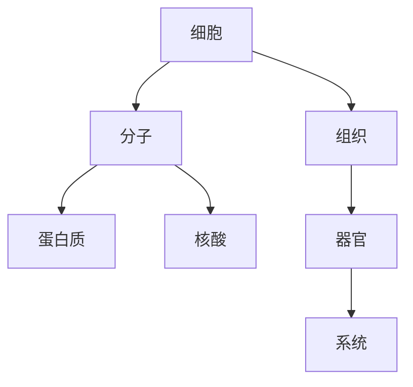

通过这一流程图，我们可以清晰地看到生命从分子到细胞，再到组织和器官，最终形成复杂系统的过程。

#### 总结

通过本章的讨论，我们对生命的定义与特征、生命世界的多样性和复杂性有了初步的认识。在下一章中，我们将进一步探讨生命广度的概念与重要性，帮助我们更好地理解拓展生命广度的意义。

### 第2章：生命广度的概念与重要性

**2.1 生命广度的定义**

生命广度，可以理解为生命在时间和空间上的扩展程度。具体来说，它包括：

- **时间维度**：生命在演化过程中所经历的时间长度，从生命起源到今天，生命在地球上已经存在了约40亿年。
- **空间维度**：生命在地球上的分布范围，包括从海洋深处到高海拔的山峰，从热带雨林到极地冰原。

生命广度不仅仅是生命体存在的范围，还包括了生命在生态系统中扮演的角色和与其他生物的相互作用。

**2.2 拓展生命广度的重要性**

拓展生命广度具有重要的科学、生态和社会价值：

- **科学价值**：拓展生命广度有助于我们更全面地理解生命的起源、演化和发展过程。例如，通过研究海洋生态系统，我们可以揭示生命的早期形式及其适应性进化。
- **生态价值**：生命广度的拓展有助于维护生态平衡。生物多样性是生态系统的基石，不同生物种类的共存和相互作用，有助于维持生态系统的稳定和健康。
- **社会价值**：拓展生命广度可以提高人类对自然界的认知，促进环境保护和可持续发展。了解生命的多样性和复杂性，有助于我们更好地应对环境挑战，实现人与自然的和谐共生。

**2.3 拓展生命广度的方法**

要拓展生命广度，我们可以从以下几个方面入手：

- **科学研究**：通过生物技术、生态学、地质学等多学科的研究，揭示生命的奥秘，拓展我们对生命世界的认识。
- **生态保护**：保护生物多样性，维护生态系统的完整性和稳定性，为生命广度的拓展提供保障。
- **公众教育**：通过科普宣传，提高公众对生命广度的认识，增强环保意识，促进社会共同参与生态保护。
- **技术应用**：利用现代科技手段，如遥感技术、基因测序等，对生命世界进行全方位的监测和研究。

为了更直观地展示生命广度的拓展方法，我们可以使用Mermaid流程图来描述：

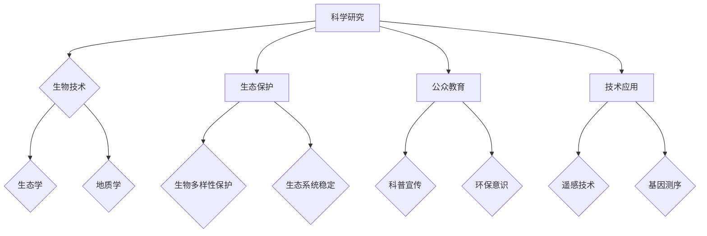

通过这一流程图，我们可以看到，拓展生命广度是一个多维度、多层次的过程，需要科学、生态、社会和技术等多方面的协同作用。

#### 总结

本章从定义和重要性出发，探讨了拓展生命广度的概念和方法。在下一章中，我们将进一步探讨通过科学探索来拓展生命广度的具体实践。

### 第3章：科学探索

科学探索是拓展生命广度的重要手段，通过系统的实验和研究，我们能够逐步揭示生命的奥秘，推动科学技术的进步。本章将详细介绍科学方法论、科学探究的过程以及科学技术在拓展生命广度中的应用。

#### 3.1 科学方法论

科学方法论是指科学研究的基本原则和程序，包括以下关键要素：

- **假设**：科学研究的起点是提出一个可以被验证或否定的假设。这个假设通常是针对某一现象或问题的初步解释。
- **观察与实验**：通过观察和实验来收集数据和证据，以检验假设的正确性。观察是被动地收集信息，而实验则是主动地操控变量来验证假设。
- **数据分析**：对实验数据进行系统的分析，以找出数据中的模式和规律。数据分析通常使用统计学方法，以确保结论的可靠性和有效性。
- **验证与理论构建**：通过重复实验和进一步研究，验证假设的有效性，并构建科学理论，解释观察到的现象。
- **反思与修正**：科学方法论强调持续反思和修正，以不断改进研究方法和结论。

科学方法论的基本流程可以用以下Mermaid流程图来表示：

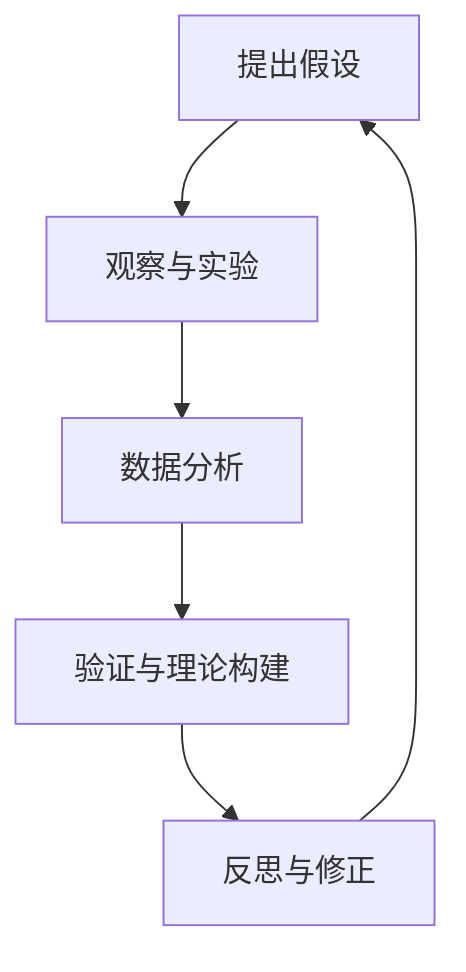

#### 3.2 科学探究的过程

科学探究是一个系统性的过程，包括以下几个阶段：

1. **问题提出**：科学探究始于对某个问题或现象的提出。问题可以是基于观察、理论矛盾或者现有研究的空白。
2. **文献回顾**：在问题提出后，研究者需要进行广泛的文献回顾，以了解相关领域的研究现状和前沿进展。
3. **假设构建**：在文献回顾的基础上，研究者提出一个或多个假设，这些假设将成为后续实验和研究的基础。
4. **实验设计**：根据假设，研究者设计实验方案，包括实验方法、实验设备和实验条件等。
5. **数据收集**：按照实验设计，研究者进行实验操作，并收集实验数据。
6. **数据分析**：对收集到的数据进行系统的分析，以找出数据中的规律和趋势。
7. **结果解释**：根据数据分析结果，研究者解释实验结果，评估假设的有效性。
8. **报告与交流**：研究者撰写研究报告，并在学术会议上进行交流，以共享研究成果。

科学探究的过程可以用以下Mermaid流程图来描述：

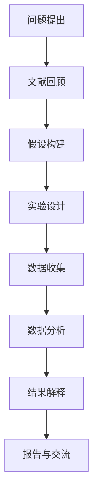

#### 3.3 科学技术在拓展生命广度中的应用

科学技术在拓展生命广度方面发挥了重要作用，以下是一些具体的应用：

1. **基因测序**：基因测序技术使我们能够精确地了解生物的遗传信息，这有助于揭示生命的起源和演化过程。例如，通过对不同物种的基因进行测序，科学家发现了生命在进化过程中的一些关键事件。
   
2. **生态监测**：遥感技术和环境监测技术使我们能够实时监测生态系统的变化，这有助于保护生物多样性，维护生态系统的稳定性。例如，通过卫星图像，科学家可以监测森林覆盖率的变化，评估生态系统的健康状况。

3. **生物工程**：生物工程技术，如基因编辑和生物合成，使我们能够创造新的生物体和生物产品，这有助于拓展生命的形式和应用范围。例如，通过基因编辑，科学家可以培育抗病、耐旱的农作物，提高农业生产的效率。

4. **医学研究**：医学科学技术的发展，如生物信息学和计算生物学，使我们能够更好地理解疾病的机理，开发新的治疗方法。例如，通过生物信息学分析，科学家可以发现与疾病相关的基因，从而为个性化医疗提供依据。

为了更好地理解科学技术在拓展生命广度中的应用，我们可以通过一个具体的案例来详细阐述。

**案例：基因测序在拓展生命广度中的应用**

假设我们想研究一种罕见的遗传疾病，该疾病可能影响了某个小规模的族群。以下是使用基因测序技术进行研究的步骤：

1. **样本收集**：首先，研究者需要收集该族群成员的血液或唾液样本。
2. **DNA提取**：从样本中提取DNA，并制备用于测序的模板。
3. **基因测序**：使用高通量基因测序技术，如高通量测序（NGS），对提取的DNA进行测序。
4. **数据分析**：对测序结果进行生物信息学分析，识别与疾病相关的基因变异。
5. **功能验证**：对分析出的基因变异进行功能验证，以确认其与疾病的关联。
6. **结果解释**：根据功能验证的结果，研究者可以解释疾病的发生机制，并可能提出治疗策略。

下面是一个简化的Python代码示例，用于描述基因测序的数据分析过程：

```python
# 假设我们有一个基因序列文件和已知疾病相关基因的列表

# 导入必要的库
import pandas as pd
from Bio import SeqIO

# 读取基因序列文件
gene_sequences = SeqIO.read('gene_sequence.fa', 'fasta')

# 读取疾病相关基因的列表
disease_genes = ['gene_A', 'gene_B', 'gene_C']

# 初始化一个空的字典，用于存储基因变异信息
gene_variations = {}

# 对每个疾病相关基因进行变异分析
for gene in disease_genes:
    # 查找基因序列中的变异
    variations = find_variations(gene_sequences[gene].seq)
    # 将变异信息添加到字典中
    gene_variations[gene] = variations

# 输出基因变异信息
for gene, variations in gene_variations.items():
    print(f"基因：{gene}")
    for variation in variations:
        print(f"位置：{variation.position}, 变异类型：{variation.type}")
```

在上面的代码中，`find_variations`函数是一个假设的函数，用于识别基因序列中的变异。实际应用中，这一过程会涉及到复杂的生物信息学算法和数据分析方法。

通过基因测序技术，科学家可以深入挖掘生命的遗传信息，拓展我们对生命广度的理解。这一过程不仅揭示了疾病的发病机制，还为个性化医疗提供了新的可能性。

#### 总结

本章介绍了科学方法论、科学探究的过程以及科学技术在拓展生命广度中的应用。科学探索是拓展生命广度的重要手段，通过系统的实验和研究，我们能够逐步揭示生命的奥秘。在下一章中，我们将探讨艺术体验在拓展生命广度中的作用。

### 第4章：艺术体验

艺术体验作为一种独特的认知和情感活动，对于拓展生命广度具有重要意义。艺术不仅仅是美的表达，更是人类对世界认知和情感的深度体现。通过艺术体验，我们可以超越日常生活的琐碎，探索更广阔的内心世界和外在宇宙。本章将详细探讨艺术与生命广度的关系、艺术体验的方法及其在拓展生命广度中的作用。

#### 4.1 艺术与生命广度的关系

艺术作为一种跨越文化和时空的普遍语言，与生命广度的拓展有着密切的联系。艺术体验能够帮助我们：

- **扩展认知边界**：艺术作品往往反映了创作者对世界的独特视角和感受，通过欣赏和理解艺术作品，我们可以拓宽自己的认知范围，了解不同文化、历史和生活方式。
- **激发创造力**：艺术创作和欣赏活动能够激发个体的创造力，帮助我们在面对生活和工作的挑战时，找到创新的解决方案。
- **促进情感交流**：艺术作品常常承载着深刻的情感和情绪，通过艺术体验，我们能够与创作者和作品产生共鸣，增进人与人之间的情感联系。
- **提高审美能力**：艺术体验能够培养我们的审美能力，使我们在日常生活中更加注重美的事物，提升生活质量。

艺术与生命广度的关系可以用以下Mermaid流程图来描述：

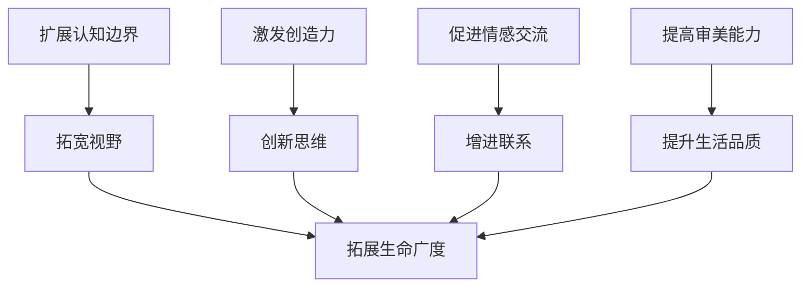

#### 4.2 艺术体验的方法

艺术体验的方法多种多样，以下是一些常见的方法：

- **观赏艺术作品**：通过观看绘画、雕塑、音乐、戏剧等艺术形式，我们可以直接感受艺术家的情感和创意。例如，参观美术馆或音乐厅，欣赏名画或经典音乐会，都是有效的艺术体验方式。
- **参与艺术创作**：亲自动手参与艺术创作，如绘画、写作、音乐演奏等，能够让我们更深入地理解和感受艺术。例如，参加艺术工作坊或写作班，通过实际操作来提升艺术技能和创造力。
- **艺术交流**：与艺术家或其他艺术爱好者进行交流，分享对艺术作品的理解和感受，能够帮助我们更好地理解和欣赏艺术。例如，参加艺术沙龙或线上艺术论坛，与艺术家和爱好者进行深入讨论。
- **艺术旅行**：通过旅行，我们能够亲身感受不同文化背景下的艺术表现形式，拓宽视野。例如，参观世界各地的博物馆和艺术馆，体验不同文化的艺术魅力。

为了更好地理解艺术体验的方法，我们可以通过一个具体的案例来详细阐述。

**案例：艺术旅行中的艺术体验**

假设我们计划进行一次艺术旅行，目的地是意大利的罗马。以下是艺术体验的方法和步骤：

1. **参观博物馆和艺术馆**：在罗马，我们可以参观如梵蒂冈博物馆、博尔盖塞博物馆等著名艺术馆，欣赏世界著名的绘画和雕塑作品，如达芬奇的《最后的晚餐》和米开朗基罗的《大卫》雕像。
2. **参加艺术工作坊**：在旅行期间，我们可以报名参加一些艺术工作坊，学习意大利的传统艺术形式，如绘画和陶艺。通过实际操作，我们可以更深入地理解艺术创作的技巧和过程。
3. **与艺术家交流**：在罗马，我们可以参加一些艺术沙龙或研讨会，与当地艺术家交流，了解他们对艺术的看法和创作经验。这种交流能够帮助我们拓宽对艺术的认知，并激发我们的创作灵感。
4. **艺术旅行记录**：在旅行结束后，我们可以将自己的艺术体验记录下来，通过写作或绘画等形式，表达对艺术的感受和思考。这种记录不仅可以帮助我们回顾和总结旅行中的艺术体验，还能成为我们艺术成长的重要资料。

以下是一个简化的Python代码示例，用于描述艺术旅行记录的写作过程：

```python
# 假设我们有一个艺术旅行的日记记录

# 导入必要的库
import pandas as pd

# 创建一个日记记录的数据框
art_travel_journal = pd.DataFrame(columns=['date', 'activity', 'thoughts'])

# 添加日记记录
art_travel_journal = art_travel_journal.append({'date': '2023-04-01', 'activity': '参观梵蒂冈博物馆', 'thoughts': '达芬奇的画作让人叹为观止，对艺术的敬畏之情油然而生。'}, ignore_index=True)
art_travel_journal = art_travel_journal.append({'date': '2023-04-02', 'activity': '参加绘画工作坊', 'thoughts': '通过实际操作，我学到了很多关于绘画的技巧，感觉自己进步了很多。'}, ignore_index=True)
art_travel_journal = art_travel_journal.append({'date': '2023-04-03', 'activity': '与艺术家交流', 'thoughts': '与艺术家的交流让我对艺术有了更深的理解，也激发了我的创作灵感。'}, ignore_index=True)

# 输出日记记录
print(art_travel_journal)
```

在上面的代码中，`art_travel_journal`是一个数据框，用于记录艺术旅行的日记。通过添加和输出日记记录，我们可以有效地总结和回顾艺术体验。

#### 4.3 艺术在拓展生命广度中的作用

艺术在拓展生命广度中的作用体现在以下几个方面：

- **提升自我认知**：通过艺术体验，我们可以更好地了解自己的情感、需求和价值观，从而提升自我认知。
- **促进社会融合**：艺术作品往往反映了人类的共同情感和经历，通过艺术体验，不同文化背景的人可以找到共同的话题和共鸣，促进社会融合。
- **提高生活质量**：艺术体验能够丰富我们的生活，提升我们的精神满足感，使我们的生活更加多彩和有意义。

为了更好地理解艺术在拓展生命广度中的作用，我们可以通过一个具体的案例分析。

**案例：艺术治疗在康复中的应用**

假设我们想探讨艺术治疗在康复中的作用，以下是一个具体的案例：

- **康复背景**：患者李先生因车祸导致下半身瘫痪，需要进行长期的康复训练。在康复期间，他参与了艺术治疗项目。
- **艺术治疗过程**：康复师为李先生提供了一系列的艺术创作活动，如绘画、音乐和舞蹈。通过这些活动，李先生表达了自己的情感和经历，逐渐增强了自信心和积极情绪。
- **治疗效果**：经过一段时间的艺术治疗，李先生在身体康复的同时，精神状态也得到了显著改善。他的绘画作品展示了他在康复过程中的心路历程，引起了康复师和同病患者的共鸣。

艺术治疗通过以下方式在拓展生命广度中发挥作用：

1. **情感表达**：艺术创作成为患者表达情感和释放压力的途径，帮助他们处理负面情绪。
2. **精神支持**：艺术作品和创作过程为患者提供了精神支持，增强了他们的积极情绪和自信心。
3. **社会互动**：艺术治疗项目中的团队合作和艺术展示活动，促进了患者与康复师和同病患者的互动，增强了社会支持网络。

通过上述案例，我们可以看到艺术在康复中的应用，不仅有助于患者的身体康复，还丰富了他们的生活体验，拓展了生命的广度。

#### 总结

本章通过探讨艺术与生命广度的关系、艺术体验的方法及其在拓展生命广度中的作用，展示了艺术在个人成长和社会发展中的重要性。在下一章中，我们将探讨文化理解对于拓展生命广度的影响。

### 第5章：文化理解

文化理解是拓展生命广度的重要组成部分，它涉及到对不同文化背景、价值观和社会习俗的认知与尊重。通过深入的文化理解，我们不仅能够拓宽自己的视野，还能够促进跨文化的交流与合作，构建更加和谐的社会。本章将详细探讨文化的定义与特征、文化理解的重要性以及拓展文化理解的方法。

#### 5.1 文化的定义与特征

文化是一个复杂且多元的概念，通常被定义为人类在社会生活中创造、传递和共享的各种知识和价值观的集合。文化包含了以下几个方面：

- **物质文化**：物质文化包括建筑、艺术品、服装、工具等可见的物质实体，它们反映了人类的生活方式和技术水平。
- **精神文化**：精神文化包括语言、信仰、价值观、习俗和艺术等非物质文化元素，它们是文化的重要组成部分，反映了人类的精神世界和价值取向。
- **行为文化**：行为文化是指人们在日常生活中的行为规范和礼仪，如礼貌、礼仪和社交习惯等，它们是文化在个体行为中的具体体现。

文化的特征主要包括：

- **多样性**：文化具有多样性，不同的社会和地区拥有各自独特的文化特征，这种多样性使得人类文明丰富多彩。
- **传承性**：文化是代代相传的，通过教育、传统习俗和仪式等方式，文化得以在一代又一代人中延续。
- **适应性**：文化具有适应性，能够随着社会和环境的变迁而不断调整和变革，以适应新的需求和挑战。
- **共享性**：文化是共享的，文化元素不是个人的私有物，而是整个社会的共同财富，每个人都可以参与其中并贡献自己的力量。

为了更直观地展示文化的定义与特征，我们可以通过以下Mermaid流程图来描述：

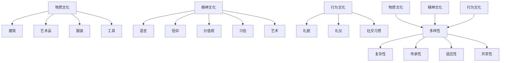

#### 5.2 文化理解的重要性

文化理解的重要性体现在以下几个方面：

- **促进跨文化交流**：随着全球化和信息化的加速，不同文化之间的交流越来越频繁。文化理解能够帮助我们更好地理解其他文化，减少误解和冲突，促进跨文化的和谐与共融。
- **增强文化自信**：通过深入了解自己的文化，我们能够更好地认识自己的价值观和身份，增强文化自信，从而更好地应对文化挑战和全球化进程。
- **推动社会和谐**：文化理解有助于我们理解不同文化背景下的行为规范和价值观念，促进社会成员之间的相互尊重和包容，从而构建更加和谐的社会关系。
- **提升个人素养**：文化理解能够丰富我们的精神世界，提升我们的文化素养，使我们在面对不同文化时更加从容和自信。

为了更好地理解文化理解的重要性，我们可以通过以下Mermaid流程图来展示其影响：

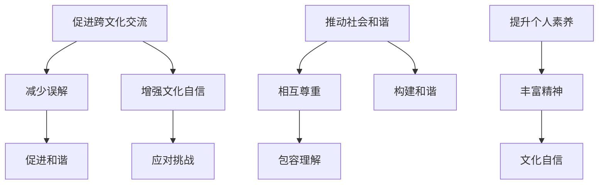

#### 5.3 拓展文化理解的方法

要拓展文化理解，我们可以采取以下几种方法：

- **学习与教育**：通过学习不同文化的知识，了解其历史、价值观和社会习俗，我们可以更好地理解其他文化。学校教育、在线课程和讲座都是有效的方式。
- **文化交流**：积极参与文化交流活动，如文化节、艺术展览和讲座，能够让我们亲身体验不同文化的魅力。
- **实践体验**：通过旅行和实际参与其他文化的社会活动，我们可以更深入地了解和体验其他文化的独特性。
- **跨文化沟通**：学会倾听和尊重其他文化的观点和意见，通过有效的跨文化沟通，我们可以更好地理解其他文化，促进文化交流与和谐。

为了更直观地展示拓展文化理解的方法，我们可以通过以下Mermaid流程图来描述：

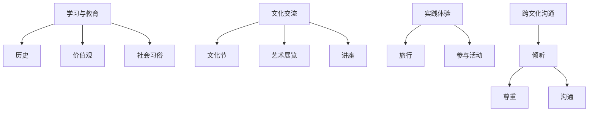

通过上述方法，我们可以逐步拓展对文化的理解，促进不同文化之间的交流与和谐，从而丰富我们的人生体验，拓展生命的广度。

#### 总结

本章探讨了文化的定义与特征、文化理解的重要性以及拓展文化理解的方法。通过深入的文化理解，我们能够更好地适应和融入不同文化环境，促进个人成长和社会发展。在下一章中，我们将探讨社会参与在拓展生命广度中的作用。

### 第6章：社会参与

社会参与是拓展生命广度的重要途径，它不仅能够增强我们的社会责任感，还能帮助我们更好地理解和融入社会。通过社会参与，我们可以体验到不同的人生经历，拓宽视野，提升个人素养。本章将详细探讨社会参与的意义、社会参与的形式以及社会参与在拓展生命广度中的作用。

#### 6.1 社会参与的意义

社会参与的意义主要体现在以下几个方面：

- **增强社会责任感**：通过参与社会活动，我们能够意识到自己在社会中的角色和责任，培养对社会和他人的责任感。
- **提升个人素养**：社会参与活动通常需要我们具备一定的知识和技能，通过参与这些活动，我们可以不断学习和提升自己的素养。
- **促进社会和谐**：社会参与有助于不同社会群体之间的交流和互动，促进社会的和谐与稳定。
- **实现个人价值**：通过社会参与，我们可以将个人的兴趣、特长和资源投入到社会服务中，实现个人价值。
- **提升生活质量**：社会参与能够丰富我们的生活体验，提升精神满足感，使我们的生活更加充实和有意义。

为了更直观地展示社会参与的意义，我们可以通过以下Mermaid流程图来描述：

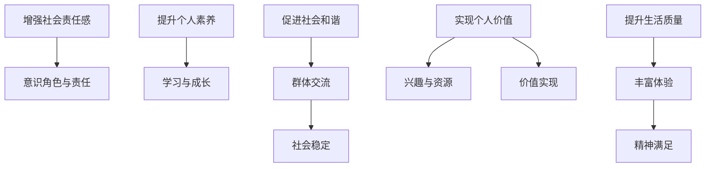

#### 6.2 社会参与的形式

社会参与的形式多种多样，以下是一些常见的社会参与形式：

- **志愿服务**：志愿服务是一种无私奉献的行为，志愿者通过参与各种公益活动，为社会提供帮助。志愿服务的形式包括支教、环保、扶贫等。
- **社区活动**：社区活动是居民参与社区事务、促进邻里关系的一种方式，如社区清洁、邻里聚餐、社区文化节等。
- **公益活动**：公益活动是通过筹款、捐物等方式，帮助有需要的人群，如慈善捐助、爱心义卖、公益活动等。
- **公益项目**：公益项目是社会组织或团体发起的，旨在解决社会问题的长期项目，如公益基金、社区改造、环境保护项目等。
- **公共事务参与**：公共事务参与是指公民参与社会管理和公共决策的过程，如选举、公民投票、公共政策讨论等。

为了更直观地展示社会参与的形式，我们可以通过以下Mermaid流程图来描述：

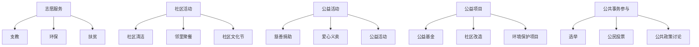

#### 6.3 社会参与在拓展生命广度中的作用

社会参与在拓展生命广度中的作用主要体现在以下几个方面：

- **拓宽视野**：通过参与不同形式的社会活动，我们可以接触到不同的社会群体和问题，拓宽我们的视野，增加对社会的认知。
- **提升沟通能力**：社会参与活动通常需要与不同的人进行沟通和合作，这有助于提升我们的沟通能力和团队合作能力。
- **增强社会认同感**：通过参与社会活动，我们能够感受到自己对社会的贡献，增强对社会的认同感和归属感。
- **丰富人生经历**：社会参与活动为我们提供了丰富的人生经历，使我们的生活更加多彩和有意义。
- **促进个人成长**：社会参与活动能够帮助我们不断学习和成长，提升自己的能力和素质。

为了更直观地展示社会参与在拓展生命广度中的作用，我们可以通过以下Mermaid流程图来描述：

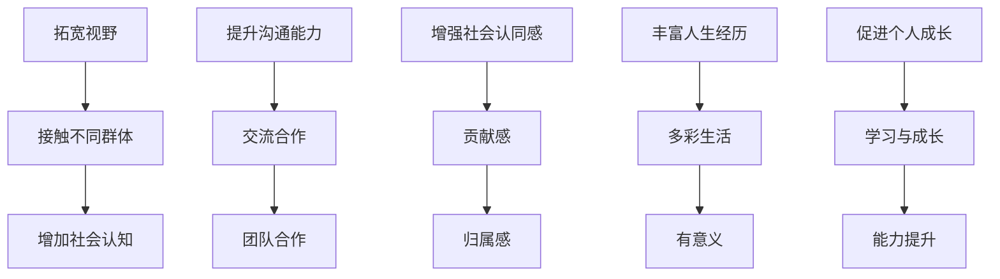

为了更好地理解社会参与在拓展生命广度中的作用，我们可以通过一个具体的案例来详细阐述。

**案例：志愿服务在拓展生命广度中的作用**

假设我们参与了一次支教活动，以下是支教活动中的具体经历和收获：

1. **活动背景**：一支由志愿者组成的团队前往偏远的山区小学，为孩子们提供为期一周的免费教育辅导。
2. **活动过程**：志愿者们根据孩子们的不同年龄段和学科需求，设计了丰富的课程内容，包括语文、数学、英语和艺术等。志愿者们利用自己的专业知识和技能，为孩子们提供了高质量的教育服务。
3. **活动收获**：通过支教活动，志愿者们不仅教授了孩子们知识，还与孩子们建立了深厚的情感联系。在活动结束后，志愿者们分享了各自的感受和成长：

   ```python
   # 假设我们有一个志愿者分享的日志

   # 导入必要的库
   import pandas as pd

   # 创建一个日志数据框
   volunteer_log = pd.DataFrame(columns=['name', 'experience', 'learning'])

   # 添加志愿者分享
   volunteer_log = volunteer_log.append({'name': '张三', 'experience': '与孩子们共同学习，让我深刻感受到教育的力量。', 'learning': '我学会了如何更好地与学生沟通和教学。'}, ignore_index=True)
   volunteer_log = volunteer_log.append({'name': '李四', 'experience': '孩子们的热情和纯真让我感受到生活的美好。', 'learning': '我学会了如何面对挑战和压力，保持积极的心态。'}, ignore_index=True)

   # 输出志愿者分享
   print(volunteer_log)
   ```

   通过这个案例，我们可以看到志愿服务不仅拓宽了志愿者的视野，提升了他们的沟通能力和教学技能，还增强了他们对生活的热情和责任感，从而在拓展生命广度中发挥了重要作用。

#### 总结

本章探讨了社会参与的意义、形式以及在拓展生命广度中的作用。通过社会参与，我们能够拓宽视野、提升沟通能力、增强社会认同感和丰富人生经历。在下一章中，我们将总结个体成长与自我探索在拓展生命广度中的应用。

### 第7章：个体成长与自我探索

个体成长与自我探索是拓展生命广度的重要途径，它不仅有助于提升我们的个人素质和自我认知，还能帮助我们更好地理解生命的意义和价值。本章将详细探讨个体成长的重要性、自我探索的方法以及个体成长在拓展生命广度中的应用。

#### 7.1 个体成长的重要性

个体成长的重要性体现在以下几个方面：

- **提升自我认知**：个体成长使我们能够更好地了解自己的兴趣、优势和不足，从而提升自我认知，明确人生目标和方向。
- **增强自我效能感**：通过不断学习和实践，我们能够提升自己的能力和技能，增强自我效能感，更加自信地面对生活中的挑战。
- **促进自我实现**：个体成长让我们有机会发挥自己的潜力，实现个人价值和梦想，从而实现自我实现。
- **提升生活质量**：个体成长能够丰富我们的生活，提升我们的精神满足感和幸福感，从而提高生活质量。

为了更直观地展示个体成长的重要性，我们可以通过以下Mermaid流程图来描述：

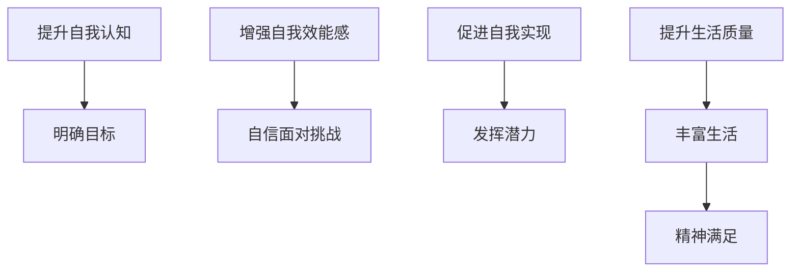

#### 7.2 自我探索的方法

自我探索是一个长期且复杂的过程，以下是一些常见的自我探索方法：

- **反思与自我评估**：定期对自己的行为、想法和情绪进行反思，通过自我评估来了解自己的优点和不足，从而制定改进计划。
- **学习与成长**：通过学习新知识、技能和经验，不断充实自己，提升个人素质和能力。
- **咨询与指导**：寻求专业的咨询和指导，如心理咨询师、职业规划师等，帮助我们更好地理解自己，制定合适的发展计划。
- **参与社会活动**：通过参与各种社会活动和志愿服务，了解不同的人生经历，拓宽视野，丰富自我。
- **艺术创作**：通过艺术创作，如写作、绘画、音乐等，表达自己的情感和思想，探索内心世界。

为了更直观地展示自我探索的方法，我们可以通过以下Mermaid流程图来描述：

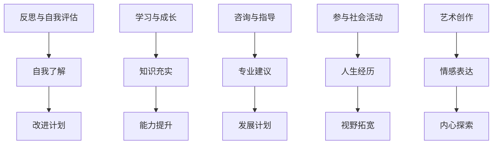

#### 7.3 个体成长在拓展生命广度中的应用

个体成长在拓展生命广度中的应用主要体现在以下几个方面：

- **提高综合素质**：通过个体成长，我们能够不断提升自己的综合素质，包括知识、技能、情感和道德等方面，从而更好地适应社会发展的需求。
- **增强适应能力**：个体成长使我们具备更强的适应能力，能够更好地应对生活中的各种变化和挑战。
- **实现人生价值**：个体成长帮助我们实现个人价值和梦想，从而拓展生命的广度和深度。
- **促进社会和谐**：个体成长有助于我们更好地理解社会，增强社会责任感，促进社会和谐与稳定。

为了更直观地展示个体成长在拓展生命广度中的应用，我们可以通过以下Mermaid流程图来描述：

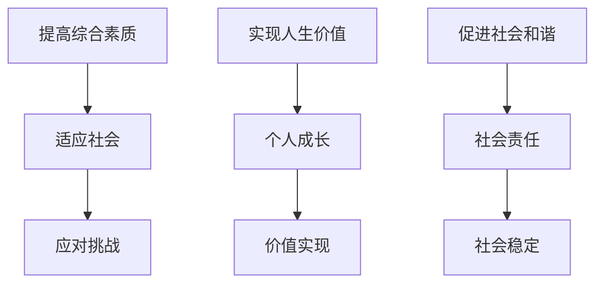

为了更好地理解个体成长在拓展生命广度中的应用，我们可以通过一个具体的案例来详细阐述。

**案例：个人成长在拓展生命广度中的应用**

假设小明是一名大学生，他通过自我探索和个体成长，实现了个人价值和生命广度的拓展。以下是他的成长过程：

1. **大学期间**：小明积极参加各种社团活动，通过团队合作和领导力的培养，提升了自己的综合素质和适应能力。
2. **实习经历**：在实习期间，小明通过实践积累了丰富的行业经验和专业技能，增强了自己的适应能力和职业竞争力。
3. **自我反思**：小明定期进行自我反思和自我评估，通过了解自己的兴趣和优势，明确了自己的职业发展方向。
4. **学术研究**：在导师的指导下，小明参与了一项学术研究项目，通过深入研究，提升了自己的学术水平和研究能力。
5. **社会参与**：小明积极参与社会公益活动，如支教、环保等，通过这些活动，他不仅实现了个人价值，还促进了社会和谐。

通过这个案例，我们可以看到个体成长如何帮助小明拓展生命的广度，实现个人价值和梦想。

#### 总结

本章探讨了个体成长与自我探索的重要性、方法以及在拓展生命广度中的应用。通过个体成长和自我探索，我们能够提升自我认知、增强适应能力、实现人生价值，从而拓展生命的广度。在下一章中，我们将探讨群体互动与社会参与在拓展生命广度中的作用。

### 第8章：群体互动与社会参与

群体互动与社会参与是拓展生命广度的重要组成部分，通过这些互动和参与，我们不仅能够增强社会联系，还能提升个人的综合素养和幸福感。本章将详细探讨群体互动的意义、群体互动的形式以及群体互动在拓展生命广度中的作用。

#### 8.1 群体互动的意义

群体互动在社会生活中扮演着重要角色，其意义主要体现在以下几个方面：

- **增强社会联系**：群体互动有助于建立和维护社会关系，增强个体与群体之间的联系，促进社会的稳定和和谐。
- **提升沟通能力**：群体互动提供了交流和沟通的平台，通过互动，个体能够提升自己的沟通技巧和表达能力，增强人际交往能力。
- **促进共同成长**：在群体互动中，个体可以共同面对挑战，分享经验和知识，从而促进个人的成长和进步。
- **增强归属感**：通过参与群体活动，个体能够感受到集体的支持和认可，增强归属感和认同感，提升幸福感。

为了更直观地展示群体互动的意义，我们可以通过以下Mermaid流程图来描述：

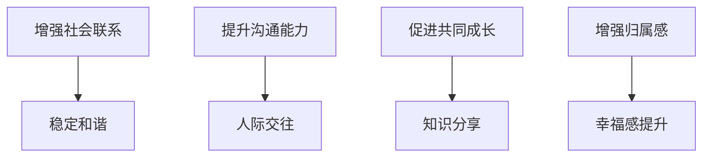

#### 8.2 群体互动的形式

群体互动的形式多种多样，以下是一些常见的群体互动形式：

- **团队协作**：团队协作是一种典型的群体互动形式，通过团队成员的共同努力，实现共同的目标。团队协作可以发生在各种领域，如工作、学习和公益活动中。
- **社交活动**：社交活动是人们在日常生活中进行互动和交流的重要方式，如聚会、晚会、运动会等。这些活动能够促进人际关系的建立和维护。
- **社区参与**：社区参与是居民在社区事务中积极参与和贡献的行为，如社区清洁、文化节、社区讨论等。通过社区参与，居民能够更好地了解社区，增进邻里关系。
- **志愿者服务**：志愿者服务是一种无私奉献的行为，志愿者通过参与各种公益活动，为社会提供帮助。志愿者服务形式包括支教、环保、慈善活动等。
- **线上社群**：随着互联网的发展，线上社群成为了一种新的群体互动形式，通过线上平台，人们可以跨越地域和时间的限制，进行交流和合作。

为了更直观地展示群体互动的形式，我们可以通过以下Mermaid流程图来描述：

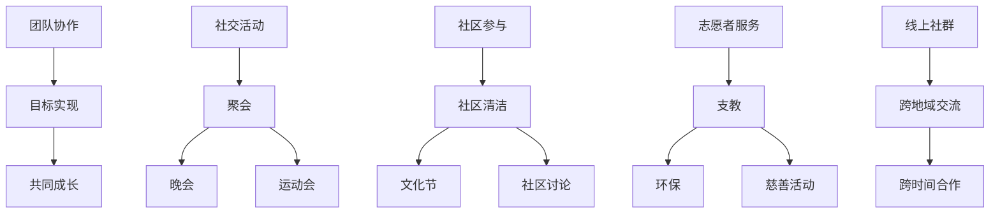

#### 8.3 群体互动在拓展生命广度中的作用

群体互动在拓展生命广度中的作用主要体现在以下几个方面：

- **提升人际关系能力**：通过群体互动，个体能够提升自己的沟通技巧和人际交往能力，建立和维护更广泛的人际关系网络。
- **拓宽视野**：群体互动使个体能够接触到不同背景和经验的人，从而拓宽视野，增加对世界的认知和理解。
- **增强自我认知**：在群体互动中，个体能够更好地了解自己的优势和不足，提升自我认知，促进个人成长。
- **提升幸福感**：群体互动能够增强个体的归属感和认同感，提升幸福感，使生活更加充实和有意义。

为了更直观地展示群体互动在拓展生命广度中的作用，我们可以通过以下Mermaid流程图来描述：

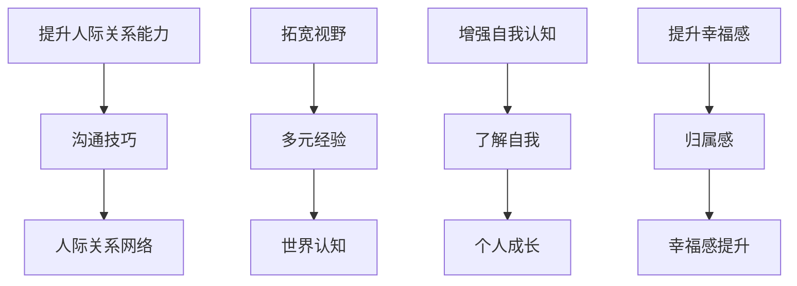

为了更好地理解群体互动在拓展生命广度中的作用，我们可以通过一个具体的案例来详细阐述。

**案例：团队协作在拓展生命广度中的应用**

假设一个公司团队通过有效的群体互动，实现了个人成长和企业发展。以下是这个团队的具体经历：

1. **项目启动**：团队成员共同参与一个重要项目，明确项目目标和任务分工。
2. **定期会议**：团队定期召开会议，讨论项目进展和遇到的问题，确保团队成员之间的信息畅通和协作顺畅。
3. **互相支持**：在项目执行过程中，团队成员相互支持和鼓励，共同克服困难，提升团队凝聚力。
4. **知识分享**：团队成员定期分享各自的专业知识和经验，通过学习他人的优点，提升自己的能力。
5. **项目成功**：通过团队成员的共同努力，项目顺利完成，达到了预期目标。团队成员在项目成功后，感受到了成就感，提升了自信心和团队归属感。

通过这个案例，我们可以看到团队协作如何帮助个体和团队拓展生命的广度，实现个人成长和企业发展。

#### 总结

本章探讨了群体互动的意义、形式以及在拓展生命广度中的作用。通过群体互动，我们能够提升人际关系能力、拓宽视野、增强自我认知和提升幸福感，从而拓展生命的广度。在下一章中，我们将进行总结与反思，并对拓展生命广度的策略提出建议。

### 第9章：总结与反思

在本文中，我们从多个角度探讨了拓展生命广度的方法和策略。通过科学探索、艺术体验、文化理解、社会参与以及个体成长与自我探索，我们认识到生命广度不仅是一个物理空间上的概念，更是一个精神和文化层面的深度体验。本章将对全文进行总结，并提出未来的展望。

#### 9.1 拓展生命广度的总结

拓展生命广度的核心在于：

- **多维度的探索**：无论是科学探索、艺术体验，还是文化理解和社会参与，都是拓展生命广度的重要途径。通过这些方式，我们能够从不同维度加深对世界的认识，丰富自己的生活体验。
- **个体与集体的互动**：个体成长与自我探索是个人层面的拓展，而社会参与和群体互动则是集体层面的拓展。这两者相辅相成，共同促进了个人与社会的和谐发展。
- **持续的学习与反思**：拓展生命广度是一个持续的过程，需要我们不断学习新知识、新技能，并进行深刻的自我反思。只有这样，我们才能在不断的探索和成长中，拓展生命的广度和深度。

#### 9.2 反思与实践

通过本文的探讨，我们可以反思以下几个方面：

- **科学探索的实践**：在科学探索中，我们强调了假设、实验、数据分析和验证的重要性。在实际操作中，我们是否真正遵循了科学方法论，是否能够有效地进行科学探究？
- **艺术体验的反思**：艺术体验不仅是美的享受，更是心灵的触动。我们是否真正投入地去欣赏和理解艺术作品，是否能够在艺术创作中找到心灵的共鸣？
- **文化理解的实践**：在文化理解中，我们强调了学习与教育、文化交流、实践体验和跨文化沟通的重要性。在实际生活中，我们是否积极参与这些活动，是否能够真正理解和尊重不同的文化？
- **社会参与的反思**：社会参与不仅能够提升我们的社会责任感，还能丰富我们的生活体验。我们是否真正参与了社会活动，是否在参与中实现了个人价值和社会价值的统一？

#### 9.3 未来展望

未来，拓展生命广度将面临新的挑战和机遇：

- **科技的发展**：随着科技的不断进步，我们能够利用更多的工具和技术来拓展生命广度。例如，虚拟现实和增强现实技术将为我们提供更加丰富和沉浸式的体验。
- **全球化的深入**：全球化的深入使得文化交流和合作更加频繁，我们有机会接触和了解更多的文化。通过积极参与国际交流和合作，我们可以拓展视野，提升全球竞争力。
- **可持续发展的理念**：在可持续发展的背景下，我们需要更加关注环境保护和生态平衡。通过参与环保活动和社会公益项目，我们可以为拓展生命广度做出贡献。

为了更好地实现这些展望，我们可以采取以下策略：

- **持续学习**：不断学习新知识、新技能，提升自己的综合素质。
- **积极参与**：积极参与社会活动和文化交流，拓宽视野，增强社会责任感。
- **自我反思**：定期进行自我反思，了解自己的成长和不足，制定改进计划。
- **创新实践**：勇于尝试新的方法和理念，在实践中探索拓展生命广度的有效途径。

#### 总结

通过本文的探讨，我们认识到拓展生命广度的重要性，并提出了具体的实践方法和策略。在未来，我们需要不断学习和实践，积极探索新的途径，以实现更加丰富和有意义的生活。只有通过不断的努力，我们才能拓展生命的广度，实现个人价值和社会价值的统一。

### 附录：拓展生命广度的资源与工具

为了帮助读者更好地拓展生命广度，以下是推荐的一些书籍、学术资源、社交媒体与论坛，以及其他相关资源。

#### A.1 书籍推荐

- 《人类简史》（Yuval Noah Harari）：这本书详细阐述了人类从史前时代到现代社会的演化过程，帮助我们理解生命的广度。
- 《自私的基因》（Richard Dawkins）：通过探讨基因如何影响生命的发展和演化，这本书揭示了生命的本质和复杂性。
- 《艺术的故事》（E.H.贡布里希）：系统介绍了艺术的历史和发展，帮助我们理解艺术在生命广度中的重要作用。
- 《文化苦旅》（余秋雨）：通过作者对各地文化遗址的探访，展示了不同文化的魅力，拓展了我们的文化视野。
- 《社会心理学》（David Myers）：这本书介绍了社会心理学的基本概念和理论，帮助我们更好地理解社会参与的重要性。

#### A.2 学术资源

- 《科学杂志》（Science）：这是全球顶尖的科学学术期刊，涵盖了自然科学、医学和社会科学的最新研究进展。
- 《自然》（Nature）：另一本顶尖的科学学术期刊，关注生命科学、物理学、化学和地球科学等领域的突破性研究。
- 《PNAS》（Proceedings of the National Academy of Sciences）：美国国家科学院的官方期刊，发表原创性和创新性的科学研究论文。
- 《艺术与设计杂志》（Art and Design Journal）：这是一本涵盖艺术和设计领域的学术期刊，探讨了艺术理论和创作实践。

#### A.3 社交媒体与论坛

- Twitter：在Twitter上，可以关注一些专业的科学、艺术和文化账号，获取最新的研究动态和行业资讯。
- Reddit：Reddit上有许多与科学、艺术和文化相关的子版块，如r/science、r/art和r/culture，是交流和学习的好去处。
- Quora：Quora是一个知识分享平台，用户可以提问和回答问题，特别是在科学、艺术和文化等领域，有许多专业人士的回答。
- Stack Overflow：对于编程和计算机科学爱好者，Stack Overflow是一个非常有用的技术问答社区。

#### A.4 其他资源

- Coursera、edX和Udacity：这些在线学习平台提供了大量的免费和付费课程，涵盖了科学、艺术和文化等多个领域。
- TED Talks：TED Talks汇集了许多领域内外的杰出演讲者，分享了他们对于科学、艺术和文化等方面的独特见解。
- OpenCourseWare：许多顶尖大学，如麻省理工学院（MIT）、哈佛大学（Harvard）等，提供了大量的开放课程资源，免费供全球用户学习。

通过利用这些书籍、学术资源、社交媒体与论坛以及其他相关资源，读者可以更好地拓展生命广度，提升自己的知识水平和综合素质。

