                 

## 《丰富生命的调色板：拓展情感和体验的范畴》

### 关键词：情感体验、生命质量、自我提升、情感管理、技术应用

> **摘要：** 本文旨在探讨如何通过丰富情感体验和拓展个人体验范畴来提升生命质量。文章从情感认知、体验拓展、情感管理和技术应用四个角度，详细阐述了情感与体验的多样性，以及如何有效地管理和提升这些体验，以实现个人的全面成长。

---

### 第一部分：引言

#### 1. 引言

在现代社会中，人们越来越意识到情感体验和生命质量之间的关系。情感不仅是我们内心的波动，更是我们与世界互动的桥梁。**《丰富生命的调色板：拓展情感和体验的范畴》**旨在探讨如何通过丰富情感体验和拓展个人体验范畴来提升生命质量。本书将带领读者深入了解情感与体验的多样性，以及如何有效地管理和提升这些体验。

#### 2. 目标读者

本书适合对情感体验和自我提升有兴趣的读者，包括心理学爱好者、心理咨询师、教育工作者以及普通读者。无论你是希望提升自身心理健康，还是希望在工作、生活和社交中更好地理解和处理情感，这本书都将成为你的宝贵指南。

#### 3. 内容概述

本书分为四个主要部分，分别从情感认知、体验拓展、情感管理和技术应用四个角度，全面探讨如何丰富生命调色板。

- **第一部分：情感认知**：包括情感的本质与分类、情感体验的多样性以及情感与心理健康的关系。
- **第二部分：体验拓展**：包括体验拓展的途径、实际应用以及对个人成长的影响。
- **第三部分：情感管理**：包括情感管理的基本策略、实际操作以及情感管理技术工具。
- **第四部分：技术应用**：包括情感计算技术、情感分析技术以及情感技术应用案例。

通过以上四个部分，本书旨在为读者提供一个全面、系统的指南，帮助读者更好地理解、管理并拓展情感与体验的范畴。

---

### 第二部分：情感认知

#### 1. 情感认知基础

**第2章：情感的本质与分类**

- **情感的定义与本质**：情感是人对客观事物的主观体验和反应，是认知和行为的驱动力。情感不仅仅是一种心理状态，它还涉及生理、行为和认知的多个层面。
  
- **情感的分类与功能**：情感可以分为基本情感和复合情感。基本情感如快乐、悲伤、愤怒等是人类共有的，而复合情感则是由基本情感混合而成，如爱、厌恶等。每种情感都有其特定的功能，如快乐促进人际互动，悲伤帮助个体从损失中恢复。

- **情感的神经科学基础**：情感的产生与大脑中的多个区域有关，包括前额叶、杏仁核和扣带回等。神经科学家通过研究这些区域的活动，揭示了情感的形成和调节机制。

**Mermaid 流程图：**

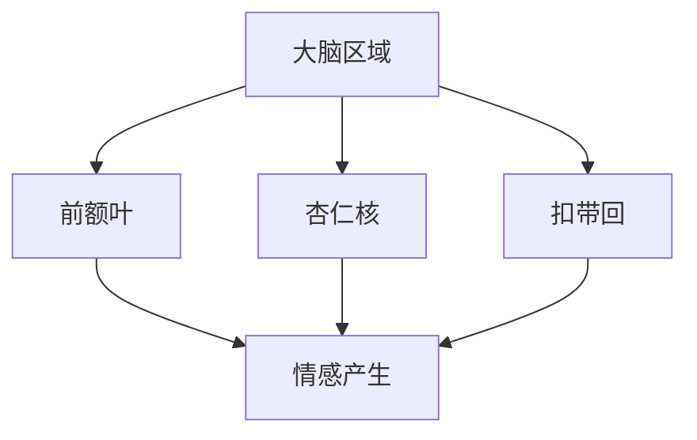

#### 2. 情感体验的多样性

**第3章：情感体验的多样性**

- **情感体验的层次与类型**：情感体验可以从不同的层次进行分类，包括表面情感和深层情感。表面情感如快乐和悲伤，而深层情感则与个人的价值观和信念有关。

- **不同情境下的情感体验**：不同的情境会导致不同的情感体验。例如，在职场中，可能更多地体验到竞争和成就；而在家庭中，可能更多地体验到温暖和亲密。

- **情感体验的文化差异**：不同文化背景下的个体可能对相同的情境有不同的情感体验。这种文化差异源于不同的价值观、信仰和社会规范。

**Mermaid 流程图：**

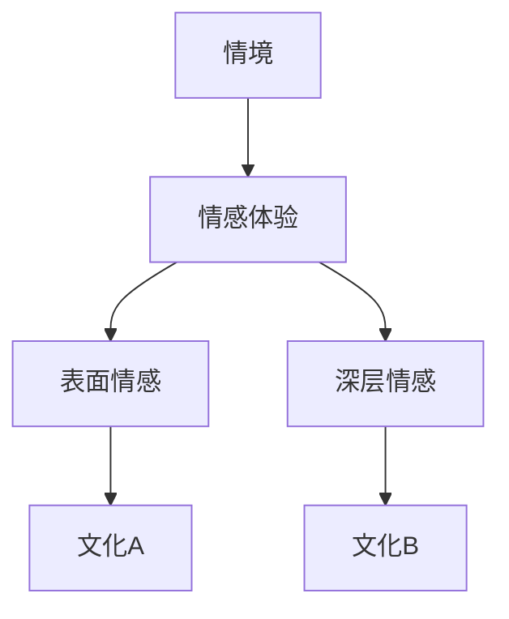

#### 3. 情感与心理健康

**第4章：情感与心理健康的关系**

- **情感对心理健康的影响**：积极的情感体验有助于提升心理健康，而消极的情感体验则可能导致心理健康问题。例如，长期的愤怒和焦虑可能导致心理压力和抑郁。

- **情感障碍与心理健康问题**：情感障碍如抑郁症和焦虑症是常见的心理健康问题。这些障碍会影响个体的情感体验和生活质量。

- **情感调节与心理健康的提升**：通过有效的情感调节，个体可以更好地管理自己的情绪，从而提升心理健康。情感调节策略包括认知重构、情感表达和情绪释放等。

**Mermaid 流程图：**

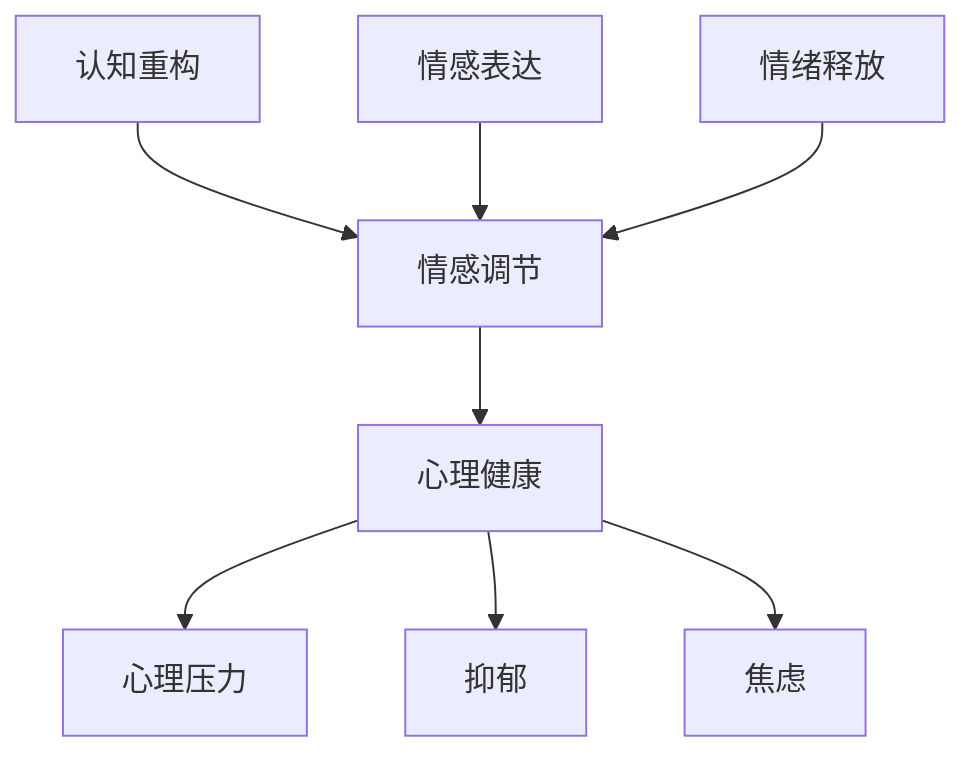

---

### 第三部分：体验拓展

#### 1. 体验拓展的途径

**第5章：体验拓展的途径**

- **情感扩展训练**：通过特定的训练方法，如正念冥想和情感调节训练，个体可以提升对情感体验的敏感度和掌控力。

- **新体验的创造与探索**：个体可以通过尝试新的事物和活动，如旅行、学习新技能和参与社交活动，来创造和探索新的情感体验。

- **情感开放性提升策略**：提升情感开放性可以帮助个体更全面地体验情感，从而丰富生命的调色板。这可以通过自我反思、情感交流和情感教育来实现。

**Mermaid 流�程图：**

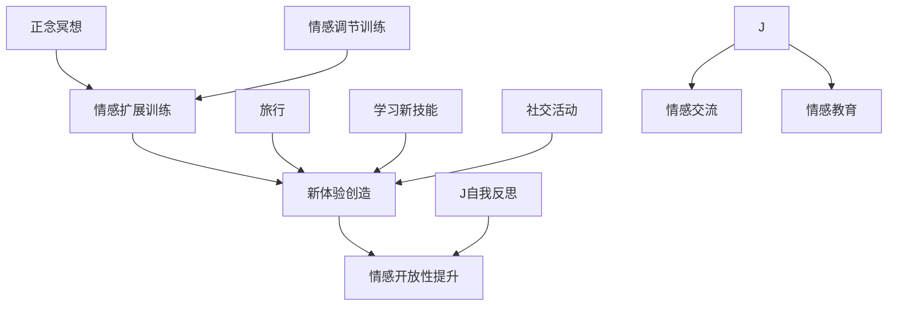

#### 2. 体验拓展的实际应用

**第6章：体验拓展在实际生活中的应用**

- **职场体验拓展**：在职场中，个体可以通过参与不同类型的项目和工作，拓展自己的职业经验和情感体验。

- **个人生活体验拓展**：在生活中，个体可以通过旅行、阅读和艺术创作等途径，拓展自己的情感和生活体验。

- **社交体验拓展**：通过参加社交活动和建立人际关系，个体可以拓展自己的社交圈和情感体验。

**Mermaid 流程图：**

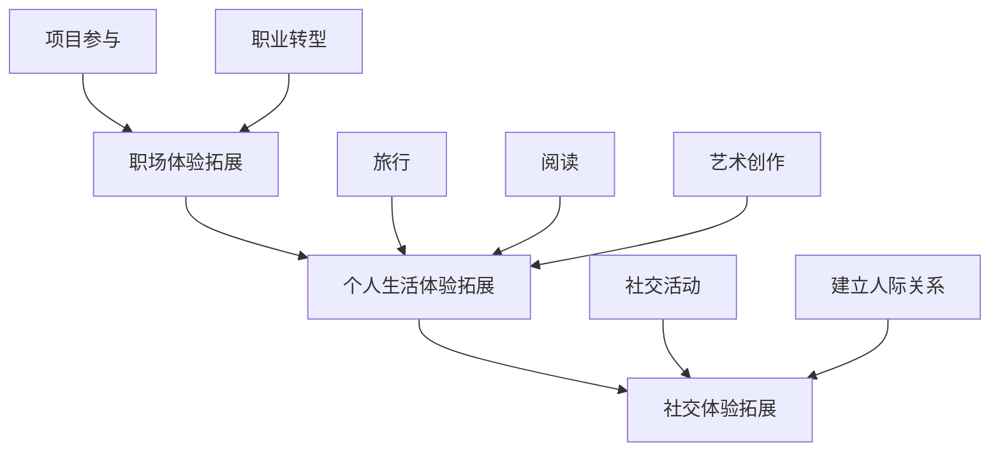

#### 3. 体验拓展对个人成长的影响

**第7章：体验拓展对个人成长的影响**

- **体验拓展与自我认知**：通过丰富的体验，个体可以更深入地了解自己，发现自己的兴趣和潜力。

- **体验拓展与自我提升**：通过不断尝试新事物和挑战自己，个体可以实现自我提升和成长。

- **体验拓展与人际关系**：丰富的情感体验有助于个体更好地理解和处理人际关系，从而提升人际交往能力。

**Mermaid 流程图：**

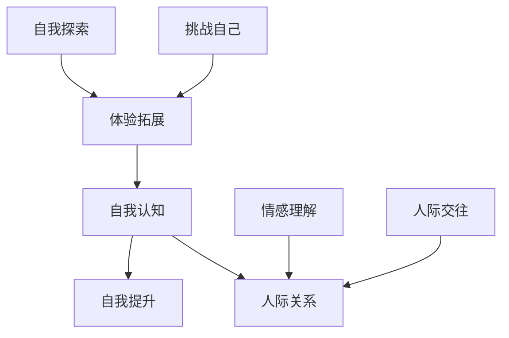

---

### 第四部分：情感管理

#### 1. 情感管理的基本策略

**第8章：情感管理的基本策略**

- **情感识别与理解**：个体需要学会识别和理解自己的情感，这是情感管理的基础。通过自我反思和情感日记，个体可以更好地了解自己的情感状态。

- **情感表达与沟通**：学会表达情感是情感管理的重要环节。有效的情感表达可以促进人际关系的和谐，避免情感压抑和冲突。

- **情感调节与平衡**：通过情感调节技巧，个体可以平衡自己的情感，保持心理健康的稳定。

**Mermaid 流程图：**

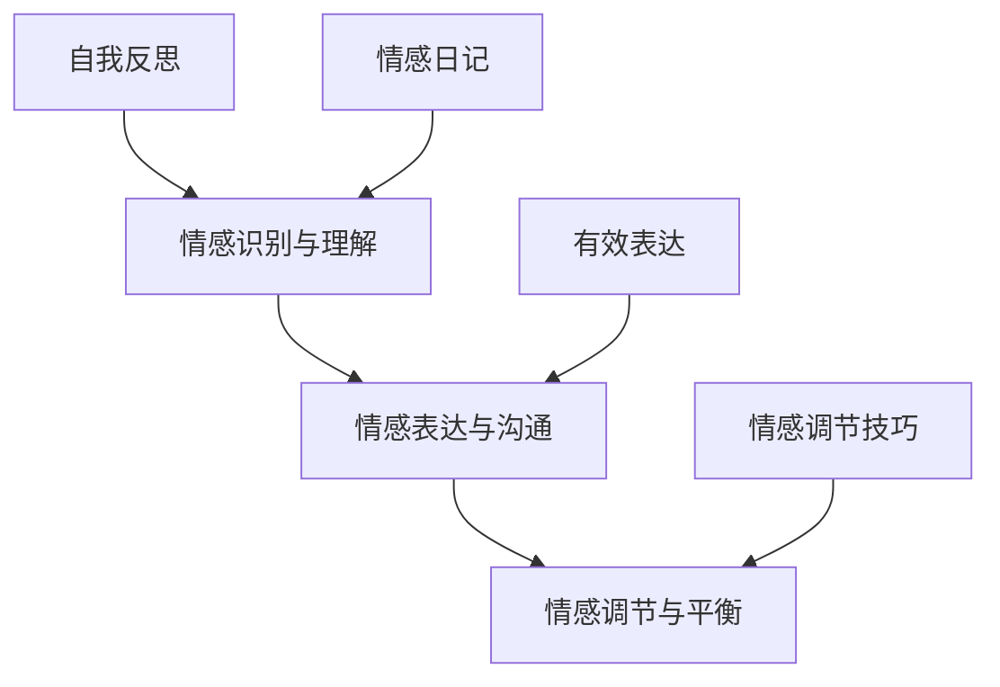

#### 2. 情感管理的实际操作

**第9章：情感管理的实际操作**

- **情感管理技巧训练**：通过特定的训练方法，如情感角色扮演和情感反馈，个体可以提升情感管理的技巧。

- **情感管理案例分享**：通过分享他人的情感管理经验，个体可以从中获得启示和指导。

- **情感管理实践建议**：根据不同情境，提供具体的情感管理实践建议，帮助个体更好地应对各种情感挑战。

**Mermaid 流程图：**

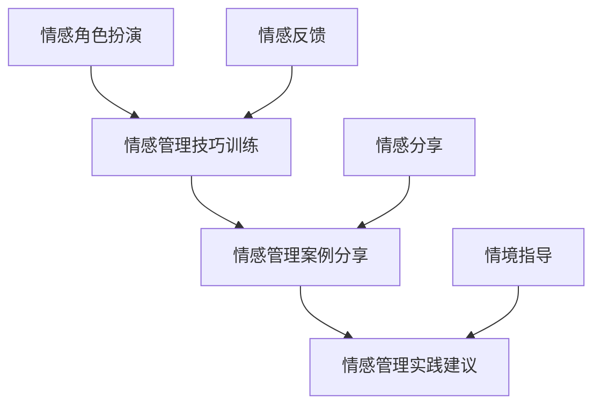

#### 3. 情感管理技术工具

**第10章：情感管理技术工具**

- **情感监控工具**：通过情感监控工具，个体可以实时了解自己的情感状态，从而进行有效的情感管理。

- **情感分析软件**：情感分析软件可以帮助个体分析自己的情感数据，提供个性化的情感管理建议。

- **情感管理应用**：手机应用和网站提供各种情感管理工具和资源，帮助个体进行情感管理。

**Mermaid 流程图：**

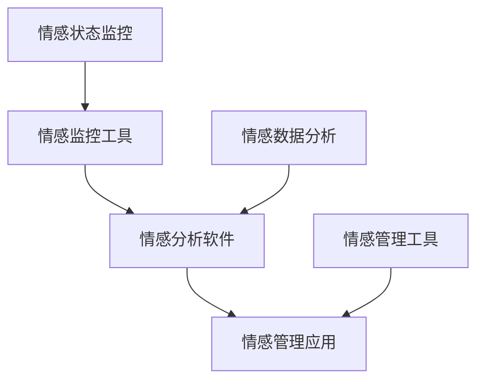

---

### 第五部分：技术应用

#### 1. 情感计算技术

**第11章：情感计算技术**

- **情感计算的基本原理**：情感计算是利用计算机技术对情感进行分析和处理。其核心是情感识别和情感建模。

- **情感计算的模型与方法**：情感计算包括情感识别、情感建模和情感预测等多个方面。常见的模型包括基于规则的方法、机器学习和深度学习等。

- **情感计算的应用场景**：情感计算广泛应用于人机交互、虚拟现实、智能客服和心理健康等领域。

**Mermaid 流程图：**

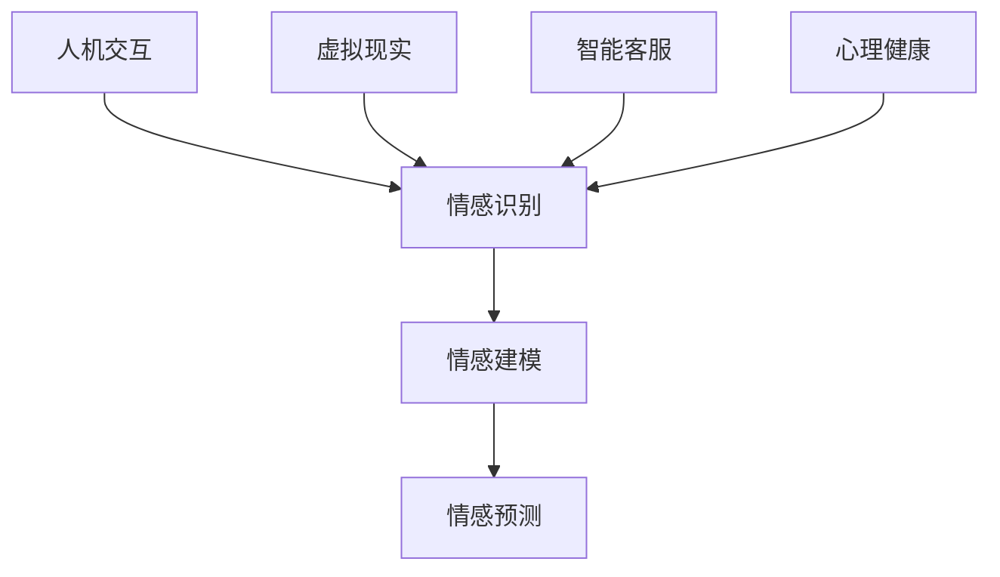

#### 2. 情感分析技术

**第12章：情感分析技术**

- **情感分析的理论基础**：情感分析是自然语言处理的一个分支，其核心是情感极性分类和情感强度分析。

- **情感分析的算法实现**：常见的算法包括基于规则的方法、机器学习和深度学习等。其中，深度学习在情感分析中表现出色。

- **情感分析在实际应用中的挑战与解决方案**：情感分析在实际应用中面临许多挑战，如数据标注困难、多语言支持和情感微表情识别等。通过数据增强、迁移学习和多模态融合等方法，可以解决这些挑战。

**Mermaid 流程图：**

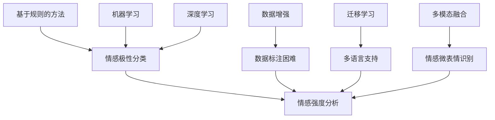

#### 3. 情感技术应用案例

**第13章：情感技术应用案例**

- **情感计算在教育中的应用**：情感计算在教育领域有广泛的应用，如情感识别、情感建模和情感预测等。通过情感分析，教育者可以更好地了解学生的情感状态，从而提供个性化的教育服务。

- **情感分析在市场营销中的应用**：情感分析可以帮助企业更好地了解消费者的情感需求，从而制定更有效的营销策略。例如，通过分析社交媒体上的情感，企业可以了解消费者的品牌态度和购买意图。

- **情感技术在人力资源管理中的应用**：情感分析可以帮助企业更好地了解员工的工作状态和心理健康，从而提供针对性的支持和关怀。例如，通过分析员工的情感日志，企业可以及时发现员工的心理问题，并提供专业的心理咨询。

**Mermaid 流程图：**

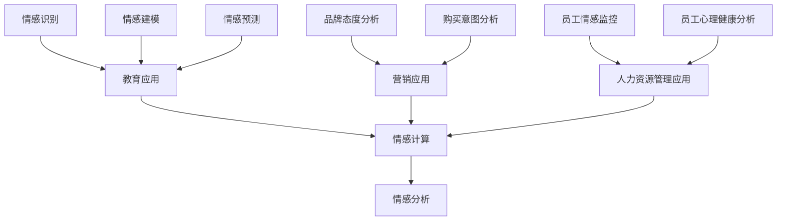

---

### 结论

**第14章：总结与展望**

本文从情感认知、体验拓展、情感管理和技术应用四个角度，详细探讨了如何丰富情感和体验的范畴。通过理解情感的本质和多样性，拓展体验的途径，以及应用情感计算和情感分析技术，个体可以更好地管理自己的情感，提升生命质量。

未来，随着技术的不断进步，情感计算和情感分析技术将在更多领域得到应用，为个体和社会带来更多的价值。我们鼓励读者不断探索和实践，用自己的调色板，丰富自己的人生色彩。

**作者：AI天才研究院/AI Genius Institute & 禅与计算机程序设计艺术 /Zen And The Art of Computer Programming**

---

通过以上内容，本文为读者提供了一个全面、系统的指南，帮助读者更好地理解、管理并拓展情感与体验的范畴。希望每一位读者都能在这本书中找到属于自己的调色板，丰富自己的生命色彩。

