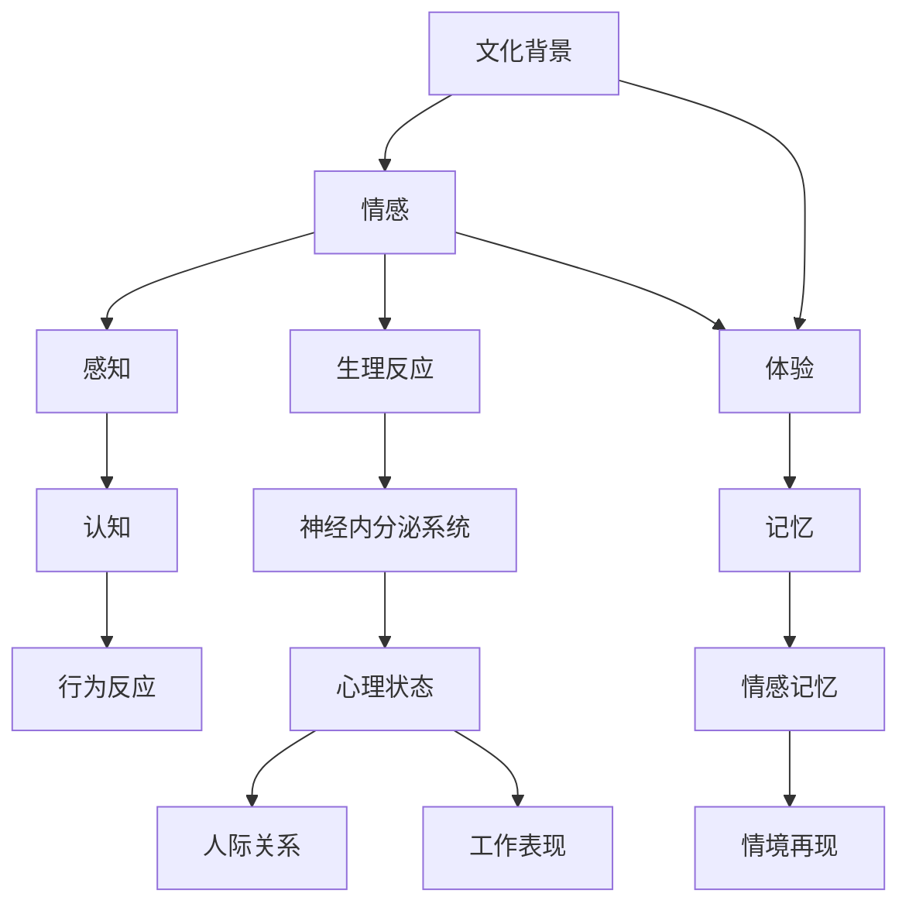
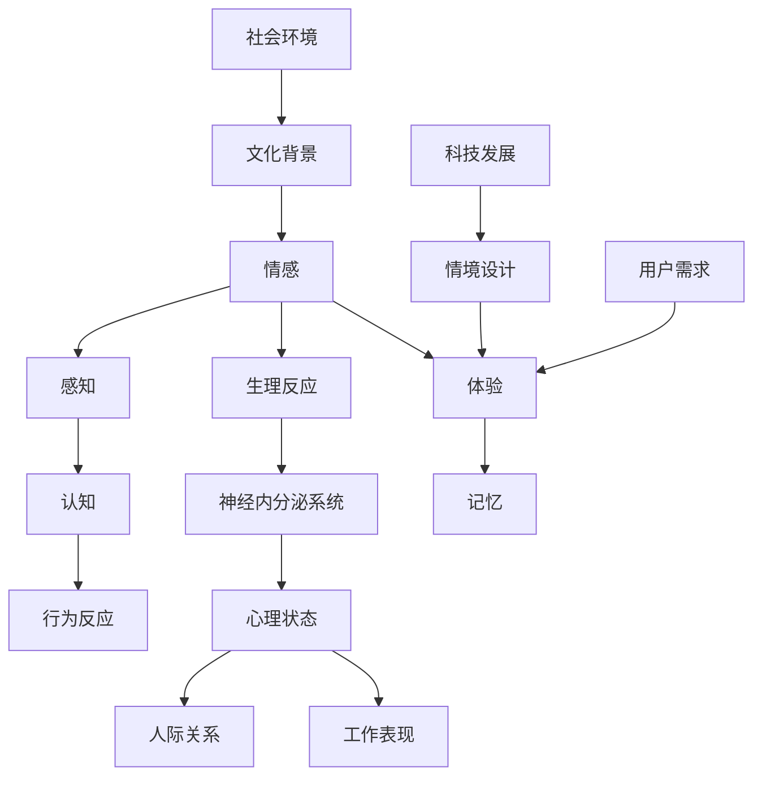

                 

### 1.1 书籍主题概述

《丰富生命的调色板：拓展情感和体验范畴》旨在探讨情感与体验在人类生活中的核心作用，并探索如何通过科学的方法和技术手段来优化和提升个人的情感体验。在当今快速发展的信息技术时代，人工智能、机器学习和数据科学等领域的进步为我们提供了前所未有的工具和资源，使得我们能够更深入地理解和分析情感与体验的机制，进而为个人和社会带来积极的影响。

本书的核心观点是，情感和体验不仅是我们内心世界的反映，更是我们与世界互动的重要媒介。通过深入理解情感的产生、调节和表达机制，以及体验的形成和优化过程，我们可以更好地掌握自己的心理状态，提升生活质量，建立更健康的人际关系，并在职业和艺术创作中实现更高的成就。

全书共分为八个章节，每个章节围绕不同的主题进行详细探讨。第一章引言部分概述了书籍的主题和目标，并介绍了为何情感和体验在现代社会中如此重要。第二章和第三章分别介绍了情感与体验的基本概念、核心原理，并通过Mermaid流程图展示了它们之间的联系。第四章和第五章则关注情感调节与体验优化的具体方法，并结合实际案例进行说明。第六章和第七章探讨了情感与体验在艺术表达和科学探索中的应用，展示了这些领域的前沿动态。最后一章总结了全书的主要观点，并对未来的研究方向和应用前景进行了展望。

通过这本书，读者将不仅能够了解情感和体验的科学原理，还能学会一系列实用的技巧和方法，帮助自己在日常生活中更好地调节情感、优化体验，从而丰富个人的生命调色板。无论你是心理学爱好者、程序员、艺术家，还是对个人成长有兴趣的普通读者，这本书都将为你提供宝贵的知识和启示。让我们一起踏上这场探索情感和体验的旅程，发现内心深处的丰富世界。```markdown
# 丰富生命的调色板：拓展情感和体验范畴

关键词：情感，体验，心理学，人工智能，优化，艺术表达

摘要：
《丰富生命的调色板：拓展情感和体验范畴》是一本旨在探讨情感与体验在人类生活中的核心作用，并通过科学方法和技术手段提升个人情感体验的专著。全书通过八个章节，详细介绍了情感与体验的基本概念、核心原理，以及情感调节与体验优化的方法。同时，书中还探讨了情感与体验在艺术表达和科学探索中的应用，展示了这些领域的前沿动态。通过阅读本书，读者将能够深入理解情感与体验的机制，掌握调节情感、优化体验的技巧，从而丰富个人的生命体验。
```markdown
# 1.2 为什么情感和体验如此重要

情感和体验在人类生活中扮演着至关重要的角色。首先，情感是我们对外部世界刺激的直接反应，是我们内心感受的表达。通过情感，我们能够体验快乐、悲伤、愤怒等各种情绪，这些情绪不仅影响我们的心理状态，还直接影响我们的行为和决策。例如，愉悦的情感可以激发我们采取积极的行为，而消极的情感则可能导致我们逃避或抑制某些活动。

其次，体验是我们在生活中留下的印记，是我们通过感官和认知系统对事件和环境的感知与理解。体验不仅包括我们在特定情境下的感受，还涵盖了我们的记忆、思考和行为模式。积极的体验能够增强我们的自信心和满足感，而消极的体验则可能导致焦虑和抑郁。因此，优化体验对于提升个人生活质量具有重要意义。

在现代社会，随着信息技术和人工智能的发展，我们有了更多工具和资源来理解和分析情感与体验。人工智能技术可以处理和分析大量的数据，帮助我们识别情感模式和体验特征，从而为个人提供定制化的情感调节和体验优化方案。例如，情感分析算法可以分析社交媒体上的用户评论，了解大众的情感趋势，为企业提供市场策略参考；而虚拟现实（VR）技术则可以创造沉浸式的体验，为用户带来前所未有的情感体验。

此外，情感和体验在多个领域都有重要的应用价值。在心理学领域，研究人员通过研究情感和体验的机制，开发出一系列治疗方法，如认知行为疗法和正念练习，帮助患者调节情绪，改善心理健康。在商业领域，情感营销策略利用情感的影响力，提高顾客的满意度和忠诚度，从而促进销售和品牌建设。在艺术创作中，艺术家通过情感表达和体验设计，创造出富有感染力的艺术作品，激发观众的共鸣。

总之，情感和体验不仅是我们个人生活的核心组成部分，也是社会和科技的交汇点。理解和优化情感与体验，不仅可以提升个人幸福感，还能为社会发展带来新的机遇和可能性。在接下来的章节中，我们将深入探讨情感和体验的基本概念、核心原理以及具体的优化方法，帮助读者更好地掌握这一重要领域。
```markdown
# 1.3 书籍结构安排

本书共分为八个章节，结构安排如下：

## 第1章 引言
- 概述书籍主题和目标。
- 解释为什么情感和体验在现代社会中如此重要。

## 第2章 情感与体验的基本概念
- 定义情感和体验，并介绍它们的分类。
- 分析情感与体验之间的关系。

## 第3章 情感与体验的核心原理
- 探讨情感产生的生理机制。
- 分析体验形成的过程。

## 第4章 情感调节与体验优化
- 介绍情感调节的技巧与方法。
- 讨论体验优化的策略。

## 第5章 情感与体验在生活中的应用
- 探讨情感和体验在家庭与人际关系中的应用。
- 分析情感和体验在工作与职业发展中的作用。

## 第6章 情感与体验的艺术表达
- 分析艺术创作中的情感表达。
- 探讨情感与体验在文学表达中的应用。

## 第7章 情感与体验的科学探索
- 介绍情感研究的最新进展。
- 展望体验研究的未来趋势。

## 第8章 情感与体验的总结与展望
- 总结情感与体验的深远影响。
- 探讨未来的研究方向与应用前景。

通过上述章节的安排，本书旨在全面系统地探讨情感与体验的各个方面，帮助读者深入理解这一重要领域，并在实际生活中运用所学知识，提升个人的情感调节能力和体验质量。
```markdown
## 第2章 情感与体验的基本概念

### 2.1 情感的定义与分类

情感是人类内心世界的重要组成部分，是对外部刺激的一种主观感受和反应。根据心理学家的定义，情感是指个体在特定情境下对事物所产生的一种复杂的心理体验，通常包括认知、情感体验和行为反应三个部分。情感不仅反映了我们对事物的态度和喜好，还影响我们的决策和行动。

情感的分类方法多样，常见的有：

- **基本情感**：由心理学家保罗·埃克曼（Paul Ekman）提出的理论认为，人类有六种基本情感，分别是快乐、愤怒、悲伤、惊讶、恐惧和厌恶。这些基本情感被认为是跨文化、跨种族的共同情感体验。

- **复合情感**：复合情感是由基本情感相互混合或叠加形成的更复杂情感，如焦虑、羞愧、骄傲等。复合情感通常涉及多种基本情感成分。

- **情境情感**：情境情感是基于特定情境产生的情感，如工作压力、考试焦虑等。这些情感通常与特定情境紧密相关，并受情境因素的影响。

情感的分类有助于我们更好地理解和研究情感现象。通过识别和分类情感，我们可以更准确地描述和预测人类行为，为心理学、医学、教育等领域提供理论基础。

### 2.2 体验的概念与分类

体验是个体通过感官和认知系统对外部世界的感知与理解，是情感产生的基础。体验不仅仅是外部刺激的直接反应，还涉及到个体对事件的认知评估和情感反应。根据心理学家的研究，体验可以分为以下几类：

- **感官体验**：感官体验是通过我们的五大感官（视觉、听觉、嗅觉、味觉和触觉）获得的直接感受。例如，欣赏一幅美丽的画作、品尝美食或聆听动人的音乐，这些都是感官体验。

- **认知体验**：认知体验是通过我们的思维和认知过程对外部世界的理解和解释。例如，解决数学问题、学习新知识和思考未来的计划，这些都属于认知体验。

- **情感体验**：情感体验是个体在特定情境下产生的情感感受，如快乐、悲伤、愤怒等。情感体验通常与个体的情感状态和行为紧密相关。

- **记忆体验**：记忆体验是指个体通过记忆对过去经历的再现和反思。记忆体验不仅影响我们的情感反应，还影响我们的行为和决策。

- **文化体验**：文化体验是个体在特定文化背景下产生的体验，反映了文化价值观、传统和习俗。例如，参加节日庆典、参观博物馆或观看地方戏曲，这些都属于文化体验。

体验的分类有助于我们理解个体如何感知和理解外部世界，以及这些体验如何影响我们的心理和行为。

### 2.3 情感与体验的关系

情感与体验是密切相关的，两者相互作用，共同塑造了我们的内心世界。情感是体验的重要组成部分，是我们对体验的内在感受和反应；而体验则是情感产生的基础，是我们对情感和外部刺激的感知和理解。

首先，情感可以影响体验的质量。积极的情感，如快乐和满足，通常能提升体验的质量，使体验更加丰富和有意义。而消极的情感，如愤怒和焦虑，则可能导致体验的质量下降，使体验变得痛苦和困难。

其次，体验可以影响情感的产生和调节。通过积极的体验，个体可以产生积极的情感，如快乐和自信；而通过消极的体验，个体可能会产生消极的情感，如沮丧和愤怒。此外，个体可以通过调节体验来调节情感，例如，通过改变对情境的认知评估或采用特定的情感调节技巧，来调整情感状态。

最后，情感与体验的关系还体现在个体的长期心理发展上。积极的情感和丰富的体验有助于个体的心理健康和幸福感，而消极的情感和不良的体验则可能导致心理问题，如抑郁和焦虑。

通过深入理解情感与体验的关系，我们可以更好地把握自己的心理状态，优化个人体验，提升生活质量。在下一章中，我们将进一步探讨情感与体验的核心原理，揭示它们背后的科学机制。
```markdown
## 第3章 情感与体验的核心原理

### 3.1 情感产生的生理机制

情感的产生是一个复杂的过程，涉及多个生理系统和神经通路的协同作用。理解情感产生的生理机制对于深入探索情感的本质和如何调节情感具有重要意义。

#### 3.1.1 神经内分泌系统的角色

神经内分泌系统是情感产生的重要生理基础。这个系统通过神经信号和激素的交互作用，调节情感的产生和表达。

1. **神经信号**：神经系统通过神经元传递电信号，这些信号可以触发内分泌腺体的激素分泌。例如，当个体面临危险时，大脑的杏仁核会发出信号，促使肾上腺分泌肾上腺素和皮质醇等激素，产生恐惧感。

2. **激素分泌**：激素通过血液循环传递到全身各个部位，影响生理和心理状态。肾上腺素和去甲肾上腺素可以增强心跳和呼吸，提高警觉性；皮质醇则影响免疫系统、代谢和认知功能。

3. **神经-内分泌-免疫网络**：神经内分泌系统与免疫系统相互作用，共同影响情感的产生和调节。例如，应激激素皮质醇可以影响免疫细胞的活性，进而影响个体的生理和心理健康。

#### 3.1.2 情感反应的神经基础

情感反应的神经基础涉及多个大脑结构和神经通路的协同作用。以下是一些关键的结构和通路：

1. **杏仁核**：杏仁核是大脑处理情绪的重要结构，与恐惧、愤怒和悲伤等基本情感密切相关。当个体感知到威胁时，杏仁核会迅速激活，产生强烈的情绪反应。

2. **前额叶皮层**：前额叶皮层参与高级认知功能，如决策、规划和情绪调节。当个体面临复杂情境时，前额叶皮层会评估情境的重要性，并调节杏仁核的活动，以产生适度的情绪反应。

3. **边缘系统**：边缘系统包括海马体、下丘脑和垂体等结构，与情感记忆、情感表达和内分泌调节密切相关。边缘系统通过神经信号和激素的交互作用，影响情感的产生和表达。

4. **神经通路**：情感反应的神经通路包括经典的杏仁核-前额叶皮层通路和较新的边缘-前额叶通路。这些通路共同调节情感的产生、表达和调节。

### 3.2 体验形成的过程

体验的形成过程涉及到感知、认知和情感等多个心理过程的相互作用。理解体验形成的机制对于优化个体体验具有重要意义。

#### 3.2.1 感知与认知的作用

1. **感知**：感知是个体通过感官接收外部信息的过程。感官信息经过大脑的处理，形成对世界的初步认识。例如，视觉系统将光线转换为神经信号，听觉系统将声音转换为神经信号，这些信号被大脑解释为视觉和听觉体验。

2. **认知**：认知是个体通过思维、记忆和判断等心理过程对外部信息进行加工和理解的过程。认知过程包括注意、记忆、思维和决策等，这些过程共同构建了体验的内容和形式。

3. **感知与认知的互动**：感知和认知是相互依赖的。感知提供了信息输入，认知则对感知的信息进行加工和解释。例如，当我们看到一幅画作时，感知系统捕捉画面的视觉信息，而认知系统则根据已有的知识和经验解释画作的内涵和意义。

#### 3.2.2 个体差异与情境因素

1. **个体差异**：个体差异是指不同个体在感知、认知和情感等方面的差异。这些差异受基因、环境和个体经历的影响。例如，一些人可能对噪声更敏感，而另一些人可能对压力反应较小。

2. **情境因素**：情境因素是指个体所处的环境和社会情境对体验的影响。不同的情境可以触发不同的感知和认知过程，从而产生不同的体验。例如，在一个热闹的派对中，人们可能会感到兴奋和快乐，而在一个安静的图书馆中，人们可能会感到平静和专注。

3. **个体差异与情境因素的互动**：个体差异和情境因素相互作用，共同塑造体验。例如，一个对噪声敏感的人在喧闹的环境中可能会感到不适，而一个对噪声不敏感的人在相同的环境中可能会感到正常。通过了解个体差异和情境因素，我们可以更好地设计体验，满足不同个体的需求。

通过理解情感与体验的核心原理，我们可以更深入地理解情感与体验的本质，从而在日常生活中更好地调节情感、优化体验。在下一章中，我们将探讨情感调节与体验优化的方法，帮助读者在实践中应用这些原理。
```markdown
### 3.1.1 神经内分泌系统的角色

神经内分泌系统在情感产生中扮演着至关重要的角色，它通过复杂的神经网络和激素信号传递机制，调节情感的反应和表达。这一系统包括中枢神经系统的特定区域和内分泌腺体，如垂体、肾上腺和甲状腺等，它们共同作用，形成了一个精密的调节网络。

#### 神经内分泌系统的基本功能

1. **神经调节**：神经系统通过神经元传递电信号，这些信号可以通过特定的神经通路影响内分泌腺体的活动。例如，当个体感受到威胁时，脑中的杏仁核会激活，通过神经信号促使肾上腺分泌肾上腺素和去甲肾上腺素。

2. **激素调节**：内分泌腺体分泌的激素通过血液传递到全身各个部位，影响生理和心理状态。这些激素包括肾上腺素、去甲肾上腺素、皮质醇、多巴胺和内啡肽等，它们在情感调节中发挥着关键作用。

#### 情感调节的激素作用

1. **肾上腺素和去甲肾上腺素**：这些激素在应激反应中发挥重要作用，能够增强心跳、提高血压，增加警觉性和反应速度。例如，在紧急情况下，肾上腺素和去甲肾上腺素的分泌会导致个体感到兴奋和紧张。

2. **皮质醇**：皮质醇是一种应激激素，它在长期压力下持续升高，影响免疫系统、代谢和认知功能。高水平的皮质醇可能导致焦虑、抑郁和免疫力下降。

3. **多巴胺**：多巴胺是一种与奖励和愉悦感受相关的激素，它在情感体验中起到关键作用。例如，当个体完成一项任务并获得奖励时，大脑会分泌多巴胺，使人感到快乐和满足。

4. **内啡肽**：内啡肽是一种天然镇痛剂，它能够减轻疼痛并产生愉悦感。例如，在剧烈运动后，身体会分泌内啡肽，使人感到放松和愉悦。

#### 神经内分泌系统与情感的关系

神经内分泌系统通过以下方式与情感相关：

1. **即时反应**：在面临紧急情况时，神经内分泌系统迅速激活，激素分泌增加，使个体产生强烈的情感反应，如恐惧、愤怒和兴奋。

2. **长期调节**：长期的生理和心理压力会导致神经内分泌系统的持续激活，激素分泌失衡，可能导致慢性应激和情感问题，如焦虑和抑郁。

3. **个体差异**：不同个体的神经内分泌系统对刺激的反应不同，这导致情感体验的个体差异。例如，一些人可能更容易感受到焦虑和压力，而另一些人则可能表现出更强的耐压能力。

通过了解神经内分泌系统在情感调节中的角色，我们可以更好地理解情感的本质，并为情感调节提供科学依据。在下一部分中，我们将探讨情感反应的神经基础，进一步揭示情感的生理机制。
```markdown
### 3.1.2 情感反应的神经基础

情感反应的神经基础涉及到大脑中多个关键结构和神经通路的相互作用。这些结构和通路共同协调，使得个体能够快速且准确地识别和反应情感刺激。以下是一些关键的神经基础：

#### 关键大脑结构

1. **杏仁核**：杏仁核是处理情绪信息的关键结构，位于大脑的边缘系统内。它对恐惧、愤怒和悲伤等基本情感反应起着核心作用。当个体感知到威胁时，杏仁核会迅速激活，引发强烈的情绪反应。

2. **前额叶皮层**：前额叶皮层是大脑的高级认知中枢，负责决策、规划和情感调节。它通过与杏仁核的交互，帮助个体评估情境并调节情绪反应，从而产生适度的情感体验。

3. **下丘脑**：下丘脑是大脑的调节中心，它控制内分泌腺体的活动，调节激素分泌。下丘脑通过神经信号与杏仁核和前额叶皮层相互作用，影响情感反应。

#### 神经通路

1. **经典杏仁核-前额叶皮层通路**：这条通路从杏仁核开始，经过下丘脑，最终到达前额叶皮层。杏仁核处理情绪刺激，将信号传递到下丘脑，进而影响激素分泌。下丘脑的信号随后传递到前额叶皮层，帮助个体进行认知评估和情感调节。

2. **边缘-前额叶通路**：这条通路包括边缘系统中的海马体、下丘脑和前额叶皮层。边缘系统负责情感记忆和情感表达，而前额叶皮层则参与高级认知功能。边缘-前额叶通路协调情感记忆与认知评估，帮助个体理解和应对情感体验。

3. **中脑边缘多巴胺系统**：这条通路涉及中脑的导水管灰质和边缘系统的多巴胺能神经元。多巴胺是一种与愉悦感相关的神经递质，这个系统在奖励和学习过程中发挥作用，影响情感体验的愉悦程度。

#### 情感反应的神经机制

1. **情绪识别**：当个体感知到情感刺激时，杏仁核会迅速激活，触发情绪识别和反应。杏仁核通过神经信号传递到其他大脑结构，如前额叶皮层，帮助个体识别情感的类型和强度。

2. **情绪调节**：前额叶皮层通过边缘-前额叶通路调节杏仁核的活动，帮助个体产生适度的情绪反应。前额叶皮层评估情境的重要性，并根据情境需求调节情绪反应。

3. **情绪记忆**：边缘系统中的海马体参与情绪记忆的编码和存储，使得个体能够记住重要的情感体验，并在未来类似情境中产生适当的情绪反应。

通过理解情感反应的神经基础，我们可以更好地理解情感是如何在大脑中产生和调节的。这不仅有助于我们更深入地理解情感的本质，还为情感调节和心理健康提供了科学依据。在下一部分中，我们将探讨体验形成的过程，进一步揭示情感与体验之间的复杂关系。
```markdown
### 3.2.1 感知与认知的作用

感知与认知在体验形成过程中扮演着核心角色，它们共同作用，使得个体能够对环境刺激进行有效的识别、解释和反应。感知是体验的基础，它通过感官系统捕捉外部信息，而认知则是这些信息加工和理解的过程。

#### 感知的作用

感知是个体通过感官系统接收和处理外部信息的过程。它包括视觉、听觉、嗅觉、味觉和触觉等多种感官体验。每种感官都有其独特的功能，例如：

1. **视觉**：视觉感知使我们能够识别物体的形状、颜色和运动。视觉信息通过眼睛进入大脑，视觉皮层对信息进行处理和解释，帮助我们理解周围的世界。

2. **听觉**：听觉感知使我们能够识别声音的频率、音调和节奏。听觉信息通过耳朵进入大脑，听觉皮层对信息进行处理和解释，使我们能够理解语言和声音的含义。

3. **嗅觉**：嗅觉感知使我们能够识别气味的特征。嗅觉信息通过嗅觉神经传递到大脑，嗅觉皮层对信息进行处理和解释，帮助我们感知和识别不同的气味。

4. **味觉**：味觉感知使我们能够识别食物的甜、酸、苦、咸等味道。味觉信息通过味蕾传递到大脑，味觉皮层对信息进行处理和解释，帮助我们选择食物和体验美食。

5. **触觉**：触觉感知使我们能够感受到物体的质地、温度和压力。触觉信息通过皮肤传递到大脑，触觉皮层对信息进行处理和解释，帮助我们感知触觉刺激。

#### 认知的作用

认知是个体通过思维、记忆和判断等心理过程对外部信息进行加工和理解的过程。认知过程包括注意、记忆、思维和决策等，这些过程共同构建了体验的内容和形式。以下是认知在体验形成中的几个关键作用：

1. **注意**：注意是个体在特定时刻关注特定刺激的能力。它帮助个体从众多感官信息中筛选出重要信息，从而形成对环境的深刻理解。

2. **记忆**：记忆是个体对过去经历和信息的存储和提取能力。它使个体能够回忆起过去的体验，并在当前情境中应用这些经验。

3. **思维**：思维是个体通过推理、分析、解决问题等心理过程对外部信息进行加工和理解的能力。它使个体能够对环境进行深入思考，形成独特的体验。

4. **决策**：决策是个体在面对选择时做出判断和选择的能力。它使个体能够根据认知评估和情感反应，选择最合适的行动方案。

#### 感知与认知的互动

感知和认知是相互依赖、相互作用的。感知提供了信息输入，而认知则对这些信息进行加工和解释。以下是感知与认知互动的几个方面：

1. **感知引导认知**：感知信息引导认知过程，使个体能够对环境进行有效的加工和理解。例如，当个体看到一幅画作时，感知系统捕捉视觉信息，认知系统则根据经验解释画作的内涵和意义。

2. **认知调整感知**：认知过程可以对感知信息进行解释和调整，从而影响个体的体验。例如，当个体对某物抱有特定期望时，认知调整感知，使得实际的感知体验与期望相符。

3. **感知与认知的动态平衡**：感知和认知在体验形成中动态平衡，相互调节。感知提供了基础信息，而认知则对信息进行高级加工，共同构建丰富的体验。

通过理解感知与认知的作用，我们可以更好地理解体验的形成机制。在下一部分中，我们将探讨个体差异与情境因素对体验的影响，进一步揭示体验形成的复杂性。
```markdown
### 3.2.2 个体差异与情境因素

个体差异与情境因素对体验的形成有着重要影响。个体差异涉及个人的生理、心理和社会特征，而情境因素则是指个体所处的具体环境和外部条件。这些因素相互作用，共同塑造了个体的情感体验。

#### 个体差异

1. **生理特征**：个体的生理特征，如年龄、性别、遗传等，会影响情感体验。例如，年轻人可能更容易体验到强烈的情绪波动，而老年人可能对情感的体验和表达更为平稳。

2. **心理特征**：个体的心理特征，如性格、情绪稳定性等，也会影响情感体验。例如，乐观的人可能更容易体验到积极的情感，而悲观的人可能更容易体验到消极的情感。

3. **社会背景**：个体的社会背景，如文化、教育、家庭环境等，也会影响情感体验。不同文化背景下的人们对情感的体验和表达可能有不同的方式和认知。

#### 情境因素

1. **外部环境**：外部环境是影响个体体验的重要因素。例如，一个安静舒适的房间可能让人感到放松，而一个嘈杂拥挤的环境可能让人感到紧张。

2. **社会情境**：社会情境中的他人行为、人际关系等也会影响个体的情感体验。例如，在社交场合中，他人的态度和行为可能影响个体的情绪状态。

3. **情境需求**：个体在不同情境下有不同的情感需求。例如，在工作中，个体可能需要保持冷静和专注，而在休闲时间，个体可能需要放松和享受。

#### 个体差异与情境因素的互动

1. **适应性调节**：个体会根据自身差异和情境因素，调整情感体验。例如，一个情绪稳定性较低的人在面对压力情境时，可能会采取放松技巧来调节情绪。

2. **情境依赖性**：某些情感体验具有情境依赖性，即个体的情感体验高度依赖于特定情境。例如，一个对公共演讲感到焦虑的人在准备充分时可能不再感到焦虑。

3. **情境适应性**：随着个体对情境的适应，情感体验也会发生变化。例如，一个初入职场的新手可能对工作环境感到不适应，但随着时间的推移，他可能逐渐适应并建立积极的情感体验。

通过理解个体差异与情境因素，我们可以更深入地了解体验的形成机制。这有助于我们设计更有效的情感调节策略，优化个体在不同情境下的情感体验。在下一部分中，我们将探讨情感调节与体验优化的方法，帮助读者在日常生活中应用这些原理。
```markdown
### 4.1 情感调节的技巧与方法

情感调节是管理和调整情感反应的过程，旨在使情感体验更加积极、健康和可控。有效的情感调节不仅有助于提升个人心理健康，还能提高生活质量和工作效率。以下介绍几种常见的情感调节技巧和方法：

#### 4.1.1 认知行为疗法

认知行为疗法（Cognitive Behavioral Therapy, CBT）是一种通过改变消极思维模式和行为模式来调节情感的疗法。它主要包括以下几个步骤：

1. **认知重建**：通过识别和质疑消极思维，将其转化为更积极、现实的想法。例如，将“我总是失败”的想法转变为“我这次失败，但可以从经验中学习”。

2. **行为激活**：鼓励个体采取积极的行为，增加积极体验，从而改善情感状态。例如，参与运动、社交活动或兴趣爱好。

3. **技能训练**：教授个体一系列技能，如问题解决、情绪管理和社交技巧，帮助他们在面对挑战时更好地应对。

案例：一位职场新人因工作压力感到焦虑。通过认知行为疗法，他识别出导致焦虑的消极思维，如“我无法胜任工作”，并学会了认知重建和技能训练，例如时间管理和有效沟通，最终成功应对工作压力，情感状态得到改善。

#### 4.1.2 正念练习

正念（Mindfulness）是一种通过专注于当前体验来调节情感的方法。它强调对情绪、思维和身体感受的觉察，而非对它们的抗拒或评判。以下是几种正念练习：

1. **呼吸练习**：通过专注于呼吸，使个体从纷繁的思维中抽离，进入当下。例如，吸气时数到四，屏息时数到七，呼气时数到八。

2. **身体扫描**：从脚趾开始，逐渐向上扫描全身，关注身体的感受，放松紧张部位。

3. **正念行走**：在行走时，专注于每一步的动作和感受，避免分心。

案例：一位长期焦虑的上班族通过每天进行正念练习，学会了更好地管理情绪，减少了焦虑感，提高了工作效率和生活满意度。

#### 4.1.3 冥想

冥想是一种通过专注和放松来调节情感的方法。它可以帮助个体减少压力、提升注意力、增强自我意识和情感调节能力。以下是几种常见的冥想形式：

1. **专注冥想**：专注于一个特定的对象，如呼吸、烛光或声音。

2. **开放监视冥想**：保持对所有感知和思维的开放和接纳，不加评判。

3. **动念冥想**：通过重复一个特定的短语或咒语，专注于其含义和情感。

案例：一位患有抑郁症的患者通过每日冥想练习，逐渐改善了情绪状态，减少了抑郁症状，恢复了生活的积极性。

#### 4.1.4 情感释放技术

情感释放技术（Emotional Freedom Techniques, EFT）结合了认知行为疗法和身体调节技巧，通过在特定穴位上敲击，释放负面情绪。以下是EFT的基本步骤：

1. **定位问题**：识别和明确需要调节的情感问题。

2. **建立信念**：确认自己拥有解决问题的能力。

3. **打坐和深呼吸**：放松身体，进入冥想状态。

4. **敲击穴位**：在特定穴位上敲击，同时重复肯定语句和情感描述。

案例：一位经历离婚痛苦的妇女通过EFT，逐步释放了内心的悲伤和愤怒，情感状态得到了显著改善。

这些情感调节技巧和方法可以帮助个体在日常生活中更好地管理情感，提升心理健康。然而，每个人的情况不同，最有效的方法可能因人而异。在应用这些技巧时，建议结合自身情况，寻求专业心理咨询师的帮助，以确保情感调节的效果。
```markdown
### 4.2 体验优化的策略

优化体验是提升生活质量和个人幸福感的重要途径。通过有效策略，我们可以增强积极体验，减少消极体验，从而实现更全面的生活满足感。以下介绍几种常见的体验优化策略：

#### 4.2.1 创造性思维的应用

创造性思维是一种通过开放性思考和创新方法，解决问题和创造新体验的能力。以下是如何应用创造性思维优化体验的方法：

1. **思维导图**：通过绘制思维导图，将想法可视化，探索各种可能的解决方案。这种方法有助于跳出传统思维框架，发现新的解决方案。

案例：一位设计师在创作新作品时，使用思维导图探索不同风格和元素，最终创造出一幅令人惊叹的艺术作品。

2. **头脑风暴**：邀请一组人共同讨论问题，收集各种创意和建议。这种方法可以激发灵感，产生意想不到的解决方案。

案例：一家公司通过头脑风暴会议，找到了一个创新的营销策略，成功提升了品牌知名度。

3. **反思与重构**：对现有的体验进行反思，找出不足之处，并重构体验流程。这种方法可以帮助我们不断改进，优化体验。

案例：一家餐馆通过顾客反馈，对菜品和服务进行改进，提升了顾客满意度和回头率。

#### 4.2.2 情境设计的优化

情境设计是指通过调整环境、资源和活动，创造有利于积极体验的条件。以下是如何优化情境设计的策略：

1. **环境布置**：通过调整空间布局、色彩搭配和装饰，创造温馨、舒适的氛围。这种方法有助于提升体验的愉悦感。

案例：一家咖啡馆通过调整灯光和音乐，营造出一个放松休闲的气氛，吸引了更多顾客。

2. **时间管理**：合理安排时间，确保有足够的时间进行休息和放松。这种方法有助于减少压力，提升生活质量。

案例：一位职场人士通过优化日程安排，保证了充足的睡眠和休闲时间，提高了工作效率和生活满意度。

3. **资源整合**：充分利用可用资源，提供多样化的体验选项。这种方法可以增加体验的丰富性和趣味性。

案例：一家主题公园通过引入多种游乐设施和表演项目，为游客提供了丰富多样的娱乐体验，吸引了大量游客。

#### 4.2.3 情感投入与自我激励

情感投入和自我激励是提升体验的重要动力。以下是如何在体验中应用这些策略的方法：

1. **情感共鸣**：在体验过程中，与他人建立情感联系，共享体验的快乐。这种方法可以增强体验的积极情感。

案例：一场团队活动，通过共同完成任务，增强了团队成员之间的情感联系，提升了团队合作精神。

2. **自我激励**：设定目标，并在实现目标的过程中给予自己奖励。这种方法可以增强动力，提升体验的成就感。

案例：一位跑步爱好者，通过设定跑步目标并奖励自己，成功提升了跑步成绩和自信心。

通过以上策略，我们可以优化各种体验，提升生活质量。在实际应用中，建议结合自身情况和需求，灵活运用这些策略，以实现最佳的体验效果。
```markdown
### 5.1 家庭与人际关系中的情感与体验

家庭与人际关系是情感与体验的重要组成部分，对个人的心理健康和生活满意度有着深远的影响。在家庭和人际关系中，情感和体验的调节与优化尤为重要，它直接关系到家庭成员之间的互动质量以及个人的情感福祉。

#### 5.1.1 家庭沟通技巧

有效的家庭沟通是建立和谐家庭关系的关键。以下是一些实用的家庭沟通技巧：

1. **倾听**：倾听是沟通的重要部分。家庭成员应该学会倾听对方的话语，理解对方的情感和需求。倾听不仅仅是听对方说什么，更重要的是理解对方的感受和观点。

2. **表达**：家庭成员需要学会表达自己的情感和需求，避免将情绪压抑在心里。表达时应尽量清晰、具体，避免使用攻击性语言。

3. **共鸣**：在沟通时，家庭成员应尝试从对方的角度理解问题，表现出同情和理解。共鸣有助于减少冲突，增进理解。

4. **解决冲突**：在家庭沟通中，难免会遇到冲突。家庭成员应学会以和平、建设性的方式解决冲突。可以采用“我-语言”（例如，“我感觉…”而非“你总是…”）来表达自己的感受。

案例：在一个家庭中，父母和子女经常因为生活习惯不同而产生冲突。通过倾听、表达和共鸣，家庭成员逐渐理解了对方的立场，并找到了共同的解决方案，家庭关系得到了改善。

#### 5.1.2 建立和谐的亲密关系

和谐的亲密关系能够为个人带来深厚的情感支持和幸福感。以下是一些建立和谐亲密关系的策略：

1. **时间投入**：在忙碌的生活中，花时间陪伴伴侣是建立和谐关系的基础。可以一起进行共同的活动，如散步、烹饪或看电影。

2. **情感支持**：在伴侣遇到困难或挫折时，提供情感支持是维系亲密关系的重要一环。可以倾听伴侣的诉说，给予关心和理解。

3. **沟通与理解**：通过有效的沟通，表达自己的需求和期望，并努力理解对方的感受和想法。这有助于消除误解，增进彼此的了解。

4. **共同成长**：与伴侣共同成长，分享生活的点滴，共同面对挑战。这不仅可以加深彼此的感情，还能提升个人的幸福感。

案例：一对夫妻通过定期沟通和共同面对生活中的挑战，建立了深厚的感情，并在相互支持中实现了个人成长。

通过上述策略，家庭成员和亲密伴侣可以更好地调节情感，优化体验，从而建立和谐、幸福的家庭和人际关系。在下一部分中，我们将探讨情感与体验在工作与职业发展中的应用，帮助读者在职场中实现更高的成就。
```markdown
### 5.2 工作与职业发展中的情感与体验

在工作和职业发展的过程中，情感与体验同样扮演着至关重要的角色。工作不仅是我们谋生的手段，更是我们实现自我价值、获得成就感和满足感的重要途径。因此，理解和管理工作中的情感与体验，对于个人的职业成长和幸福感具有重要意义。

#### 5.2.1 职场心理压力管理

职场心理压力是许多人在工作中面临的一个普遍问题。有效的压力管理不仅有助于提高工作效率，还能提升个人的心理健康和幸福感。以下是一些职场心理压力管理的策略：

1. **时间管理**：合理安排工作时间，避免过度加班。通过制定日程表和优先级列表，确保工作高效有序。

2. **任务分解**：将大任务分解为小任务，逐步完成。这样可以减少任务的焦虑感，提高工作成就感。

3. **积极心态**：保持积极的心态，面对挑战和困难时，尝试从不同的角度看待问题，寻找解决方案。

4. **放松技巧**：在紧张的工作之余，可以采用深呼吸、冥想或短暂的休息来缓解压力。这些技巧有助于放松身心，提高工作效率。

案例：一位职场新人在工作中感到巨大的压力，通过学习时间管理和放松技巧，成功缓解了压力，提高了工作效率和满意度。

#### 5.2.2 提升工作效率与满意度

工作效率和工作满意度是职业发展的两个关键方面。以下是一些提升工作效率和工作满意度的策略：

1. **目标设定**：明确个人和团队的目标，确保工作方向一致。设定可量化的目标，有助于提高工作效率。

2. **团队协作**：通过有效的沟通和协作，提高团队的整体工作效率。鼓励团队成员分享想法和资源，共同解决问题。

3. **工作与生活平衡**：确保工作与生活的平衡，避免过度工作。通过合理安排时间，保证充足的休息和休闲时间，提高生活满意度。

4. **持续学习**：不断学习新知识和技能，保持竞争力。通过参加培训、阅读专业书籍或在线课程，提升自己的专业能力。

案例：一位项目经理通过设定明确的目标、建立高效的团队协作机制，以及保持工作与生活的平衡，成功提高了项目效率和团队的满意度。

通过有效的情感调节和体验优化，个人不仅能够在工作中保持积极的心态，提高工作效率，还能实现职业发展和个人成长的良性循环。在下一部分中，我们将探讨情感与体验在艺术表达中的应用，揭示艺术创作中的情感力量。
```markdown
### 6.1 艺术创作中的情感表达

艺术创作是一种强有力的情感表达方式，通过视觉艺术、音乐、舞蹈等多种形式，艺术家能够将自己的情感和内心世界传递给观众。艺术创作不仅仅是技术和技巧的展现，更是一种情感体验的分享和交流。以下是几种常见的艺术创作形式及其情感表达的特点：

#### 6.1.1 绘画与雕塑

绘画和雕塑是两种经典的视觉艺术形式，它们通过线条、色彩、形状和质地等元素来表达情感。

1. **绘画**：绘画作为一种直观的艺术形式，通过色彩和线条的运用，可以传达出丰富的情感。例如，梵高的《星夜》通过夸张的色彩和线条，表现了艺术家内心的激情和焦虑。

2. **雕塑**：雕塑通过立体形态来传达情感，其体积和质地的变化可以创造出强烈的视觉冲击力。例如，罗丹的《思想者》通过一个沉思的人体姿态，传达出深沉的思考和内心的挣扎。

#### 6.1.2 音乐与舞蹈

音乐和舞蹈是两种动态的艺术形式，它们通过声音和动作来表达情感，具有独特的表现力。

1. **音乐**：音乐通过旋律、和声和节奏等元素，能够触动人的情感深处。例如，贝多芬的《第九交响曲》以其壮丽的旋律和激情的节奏，表达了人类对自由和团结的追求。

2. **舞蹈**：舞蹈通过身体的动作和舞者的情感表达，创造出一种动态的艺术语言。例如，现代舞通过自由的舞姿和即兴表演，传达出复杂的情感和内心的冲突。

#### 6.1.3 文学表达

文学是一种通过文字表达情感的艺术形式，它能够深入探讨人类内心的复杂情感和情感体验。

1. **小说与散文**：小说和散文通过叙事和描写，创造出一个丰富的情感世界。例如，乔伊斯的《都柏林人》通过细腻的心理描写，展现了人物内心的孤独和渴望。

2. **诗歌与剧本**：诗歌和剧本以其独特的韵律和结构，表达出深刻的情感和哲思。例如，莎士比亚的《罗密欧与朱丽叶》通过剧本的形式，探讨了爱情、悲剧和人性。

通过这些艺术创作形式，艺术家们能够将自己的情感体验转化为艺术作品，与观众产生共鸣，共同感受情感的深度和广度。艺术创作不仅为艺术家提供了表达情感的途径，也为观众带来了独特的情感体验和思考空间。
```markdown
### 6.2 情感与体验的文学表达

文学是情感与体验的重要载体，通过文字的描绘和叙事，作家们能够深刻地表达和传递情感，引导读者进入一个富有情感共鸣的世界。文学作品的情感表达不仅依赖于文字的技巧，还涉及到对人物、情境和主题的深入挖掘。

#### 6.2.1 小说与散文

小说和散文是两种主要的文学形式，它们在情感表达方面各有特色。

1. **小说**：小说通过复杂的人物关系和情节发展，构建出丰富的情感体验。作家可以通过人物的言行、内心独白和心理描写来传达情感。例如，在《红楼梦》中，曹雪芹通过描写贾宝玉和林黛玉的复杂情感，展现了他们对爱情、亲情和人生的深刻感悟。小说的情节发展往往伴随着情感的变化，使读者在故事中体验情感的高潮和低谷。

2. **散文**：散文以其自由、抒情的特点，能够直接表达作者的情感和思想。散文的叙述方式通常更加简洁和直接，使情感表达更为真挚和深刻。例如，朱自清的《背影》通过回忆父亲在火车站的背影，表达了作者对父爱的感激和思念。散文往往通过细节的描绘和情感的自然流露，触动读者的心灵。

#### 6.2.2 诗歌与剧本

诗歌和剧本是另一种形式的文学表达，它们在情感传递方面具有独特的优势。

1. **诗歌**：诗歌以其韵律和节奏，能够将情感转化为音乐般的美感。诗人通过精练的语言和象征性的意象，传达出强烈的情感。例如，杜甫的《春望》通过简洁而富有力量的语言，表达了对国家命运和个人命运的忧虑和悲愤。诗歌的简洁性和节奏感使其情感表达更加深刻和感人。

2. **剧本**：剧本通过对话和动作来展示情感，具有很强的戏剧性和感染力。剧本中的角色对话和情境设置往往充满情感冲突和戏剧张力。例如，莎士比亚的《哈姆雷特》通过哈姆雷特的内心独白和对话，展现了他对复仇、人性与罪恶的深刻思考。剧本的情感表达往往通过冲突和戏剧化的情节来增强其感染力。

通过这些文学形式，作家们能够将个人和集体的情感体验转化为文字，与读者产生深刻的共鸣。文学作品的情感表达不仅丰富了读者的内心世界，也为社会和文化提供了宝贵的情感财富。在下一章中，我们将探讨情感与体验在科学探索中的应用，揭示科学研究中对情感与体验的重视。
```markdown
### 7.1 情感研究的最新进展

情感研究是心理学领域的一个重要分支，近年来取得了显著进展。这些进展不仅丰富了我们对情感现象的理解，还为情感调节和心理健康提供了新的方法和策略。以下是情感研究的一些最新进展：

#### 7.1.1 生理心理学研究

生理心理学研究情感的产生和调节机制，探索情感与生理过程的相互作用。以下是一些关键进展：

1. **神经影像技术**：通过功能磁共振成像（fMRI）等技术，研究人员能够观察到大脑中与情感相关的区域在活动时的变化。这些研究揭示了情感产生的神经基础，如杏仁核和前额叶皮层的激活模式。

2. **激素水平研究**：生理心理学研究还探讨了激素，如皮质醇、多巴胺和内啡肽等，在情感调节中的作用。例如，研究表明，皮质醇水平与抑郁症状有关，而多巴胺水平与愉悦感相关。

3. **生理反应测量**：通过测量生理指标，如心率、皮肤电活动等，研究人员能够评估个体对特定情境的情感反应。这些研究为理解情感反应的生理机制提供了重要数据。

#### 7.1.2 认知神经科学研究

认知神经科学研究情感的认知过程，探讨情感与认知功能的相互作用。以下是一些关键进展：

1. **情感认知模型**：认知神经科学家提出了多种情感认知模型，如杏仁核-前额叶模型和边缘-前额叶模型，这些模型有助于解释情感认知的神经机制。

2. **情感记忆研究**：认知神经科学研究情感记忆的形成和存储机制。例如，研究表明，情感记忆比中性记忆更易于存储和回忆，这可能与海马体和杏仁核的相互作用有关。

3. **情感调节训练**：通过认知行为疗法和其他训练方法，研究人员探索了如何通过认知过程调节情感。这些研究为心理健康干预提供了新的策略。

#### 7.1.3 社会文化研究

社会文化研究探讨情感在社会和文化背景下的表现和调节。以下是一些关键进展：

1. **情感表达的文化差异**：研究表明，不同文化背景下人们表达情感的方式可能存在差异。例如，西方文化中情感表达更直接，而东方文化中情感表达更含蓄。

2. **情感认知的社会性**：情感不仅是个体内部的体验，还涉及社会互动。社会文化研究揭示了情感在社会关系和集体身份中的重要作用。

3. **情感的社会调节**：社会文化研究探讨了家庭、友谊和社会关系在情感调节中的作用。例如，研究发现，社交支持可以减轻压力和负面情绪。

这些情感研究的最新进展不仅加深了我们对情感现象的理解，还为情感调节和心理健康提供了新的视角和方法。在下一部分中，我们将探讨情感与体验研究的未来趋势，展望这一领域的发展方向。
```markdown
### 7.2 体验研究的未来趋势

随着科技进步和跨学科研究的深入，体验研究正面临着前所未有的发展机遇和挑战。以下是一些体验研究的未来趋势，这些趋势将推动我们更深入地理解体验的本质，并探索新的应用领域。

#### 7.2.1 新技术的应用

新技术的快速发展为体验研究提供了强大的工具和平台。以下是一些关键技术：

1. **虚拟现实（VR）与增强现实（AR）**：VR和AR技术能够创造高度沉浸式的体验环境，使研究者能够模拟和操控复杂的情境，以探索体验的形成和变化。这些技术有望在心理治疗、教育培训和娱乐等领域发挥重要作用。

2. **脑机接口（BCI）**：脑机接口技术可以直接读取大脑信号，实现人脑与计算机或其他设备的直接交互。通过BCI技术，研究者能够更精确地监测和调节个体的情感和体验，从而为情感调节和神经康复提供新的方法。

3. **大数据分析**：随着数据采集和分析技术的进步，研究者能够处理和分析海量的体验数据，从中提取有价值的模式和规律。大数据分析有助于我们更全面地理解体验的多样性和复杂性。

#### 7.2.2 跨学科研究的潜力

体验研究具有跨学科的特性，涉及心理学、神经科学、计算机科学、社会学等多个领域。跨学科研究将为体验研究带来新的突破：

1. **多模态研究**：通过结合神经影像、生理信号、行为数据和问卷调查等多模态数据，研究者可以更全面地理解体验的各个方面。这种多模态研究方法有望揭示体验的复杂机制和相互作用。

2. **交叉学科合作**：心理学、神经科学和计算机科学等领域的专家合作，可以共同开发新的研究方法和工具，如情感计算、体验建模等。这种跨学科合作将推动体验研究的创新和发展。

3. **社会文化研究**：社会文化研究将继续关注情感和体验在社会和文化背景下的表现和调节。跨文化研究有助于我们理解情感和体验在不同社会环境中的差异和共性。

#### 7.2.3 用户体验设计

用户体验设计是体验研究的一个重要应用领域。随着技术的进步，用户体验设计正变得更加重要和复杂。以下是一些关键趋势：

1. **个性化体验设计**：通过大数据和机器学习技术，设计师可以了解用户的个性化需求和行为模式，从而提供更加定制化的体验。

2. **情感化设计**：情感化设计旨在通过设计传达情感和价值，提升用户体验的满意度和忠诚度。这种设计方法强调情感在用户体验中的重要作用。

3. **可访问性设计**：随着对包容性和多样性的关注增加，可访问性设计成为用户体验设计的重要方面。设计师需要确保产品和服务能够满足不同用户群体的需求和期望。

通过探索这些未来趋势，体验研究将继续为我们揭示情感与体验的奥秘，为个人和社会带来更多的价值和机会。在下一部分中，我们将总结全书的主要观点，并探讨情感与体验的深远影响。
```markdown
### 8.1 情感与体验的深远影响

情感与体验不仅影响个体的心理健康和生活质量，还在社会层面产生深远影响。以下是情感与体验在多个领域中的重要影响：

#### 对个体心理健康的影响

1. **心理健康**：积极的情感体验有助于提高个体的心理健康水平，减少焦虑、抑郁等心理问题的发生。通过情感调节和体验优化，个体可以更好地应对生活中的压力和挑战。

2. **幸福感和生活满意度**：积极的情感和丰富的体验能够提升个体的幸福感和生活满意度。通过优化情感和体验，个体能够更加享受生活，提高生活质量。

3. **情感智力**：情感智力是指识别、理解和管理情感的能力。通过培养情感智力，个体能够更好地处理复杂的人际关系，提高社交能力。

#### 对社会关系的影响

1. **人际关系**：情感和体验在人际关系中起着关键作用。通过有效的沟通和情感表达，个体能够建立和谐的家庭关系和友谊。

2. **团队合作**：在职场环境中，积极的情感和良好的体验有助于提升团队合作效率。通过情感调节和体验优化，团队成员能够更好地理解和支持彼此，提高工作效率。

3. **社会支持**：情感和体验的丰富性可以增强社会支持网络，提高个体的抗逆能力。社会支持有助于缓解压力，促进心理健康。

#### 对文化和社会发展的影响

1. **文化传承**：情感和体验是文化传承的重要载体。通过艺术创作和文学表达，个体和群体能够传递和传承文化价值观和传统。

2. **社会创新**：积极的情感和丰富的体验可以激发创新思维和创造力。在科技、商业和文化等领域，情感和体验的优化有助于推动社会进步和发展。

3. **社会和谐**：通过关注情感和体验，社会能够建立更加和谐的关系。情感教育和体验优化有助于培养具有同理心和包容性的社会成员，促进社会的可持续发展。

总之，情感与体验对个体心理健康、社会关系和社会发展具有重要影响。通过深入研究和优化情感与体验，我们可以为个人和社会创造更加积极、健康和富有意义的生活环境。
```markdown
### 8.2 未来的研究方向与应用前景

随着科技的进步和社会的发展，情感与体验研究在未来将面临诸多新的挑战和机遇。以下是几个可能的研究方向和应用前景：

#### 8.2.1 新技术的应用

1. **人工智能与情感计算**：人工智能技术，特别是情感计算，将在情感与体验研究中发挥越来越重要的作用。通过机器学习和深度学习算法，研究者可以更准确地识别和预测个体的情感状态，从而为情感调节和心理健康提供个性化支持。

2. **虚拟现实与增强现实**：VR和AR技术为体验研究提供了新的实验平台。通过创建虚拟环境，研究者可以操纵和测量不同情境下的情感反应，探索体验的形成机制。

3. **脑机接口**：脑机接口（BCI）技术的发展，使得直接读取和操控大脑信号成为可能。这将有助于深入研究情感产生的神经机制，并为情感调节提供新的干预手段。

#### 8.2.2 跨学科合作

1. **心理学与神经科学**：跨学科合作将加深我们对情感与体验的理解。心理学与神经科学的结合，可以帮助我们揭示情感和体验的神经基础，从而开发出更有效的心理治疗和干预方法。

2. **计算机科学与社会学**：计算机科学与社会学的交叉研究，将推动用户体验设计和社交网络分析的发展。这种跨学科合作有助于提升用户体验，优化社会互动。

3. **艺术与文学**：艺术与文学的融合，将为情感与体验研究提供新的视角和方法。通过艺术创作和文学表达，研究者可以更深入地探讨情感和体验的复杂性和多样性。

#### 8.2.3 应用前景

1. **心理健康服务**：情感与体验研究将为心理健康服务提供新的工具和方法。通过个性化的情感调节和体验优化，可以有效预防和治疗心理问题，提升公众的心理健康水平。

2. **教育培训**：在教育培训领域，情感与体验研究有助于设计和实施更有效的教学策略。通过创造积极的情感体验，可以提升学生的学习动力和学习效果。

3. **商业领域**：在商业领域，情感与体验研究可以帮助企业更好地理解顾客需求，优化产品和服务设计。通过情感营销和体验设计，企业可以提高顾客满意度和忠诚度，从而增强竞争力。

4. **社会政策**：在社会政策层面，情感与体验研究可以为制定更有效的社会福利政策提供依据。通过关注情感和体验，社会政策可以更好地满足公众的需求，促进社会和谐与可持续发展。

总之，情感与体验研究在未来的发展中具有广阔的应用前景。通过新技术、跨学科合作和应用实践，我们可以更好地理解和优化情感与体验，为个人和社会创造更加美好的未来。
```markdown
### 8.3 个人行动与情感体验的提升

在了解了情感与体验的基本概念、核心原理以及优化策略后，我们不仅可以从理论层面加深对这一领域的认识，更可以通过以下具体行动来提升个人的情感体验：

#### 8.3.1 培养情感意识

首先，培养情感意识是提升情感体验的基础。通过反思自己的情感反应，我们可以更好地识别和理解自己的情感状态。以下是一些实践方法：

1. **情感日记**：定期记录自己的情感状态，包括情绪的类型、强度和发生的时间。这有助于我们观察情感的变化规律，并学会如何应对不同情境下的情感波动。

2. **情感标签**：给日常生活中的事件和体验贴上情感标签，例如“快乐”、“焦虑”或“满足”。这有助于我们更清晰地认识到情感在我们生活中的作用。

3. **情感分享**：与亲友分享自己的情感体验，倾听他人的观点和建议。通过交流，我们可以获得不同的视角，从而更好地理解和调节情感。

#### 8.3.2 实践情感调节技巧

掌握了情感调节的技巧和方法后，将其应用到日常生活中，可以帮助我们更好地管理情感，提升生活质量。以下是一些实用的技巧：

1. **认知行为疗法**：通过认知行为疗法，学会识别和调整消极思维。例如，当面对失败时，我们可以从“我不行”转变为“我可以从这次失败中学习”。

2. **正念练习**：通过正念练习，学会专注于当下，减少情感波动。例如，每天进行10分钟的深呼吸练习，专注于呼吸的感觉，有助于减轻压力和焦虑。

3. **情绪释放技术**：通过情感释放技术，如EFT，释放积压的负面情绪。例如，通过敲击特定的穴位，同时表达自己的情感，可以有效缓解紧张和焦虑。

#### 8.3.3 优化日常生活体验

优化日常生活的体验，可以帮助我们创造更多积极的情感体验。以下是一些实践方法：

1. **时间管理**：合理安排时间，确保有足够的时间进行休息和放松。例如，每天留出时间进行锻炼、阅读或与家人朋友共度时光。

2. **环境布置**：创造一个温馨、舒适的生活环境。例如，通过调整房间布局、色彩搭配和装饰，营造一个令人愉悦的生活空间。

3. **兴趣爱好**：培养兴趣爱好，增加生活的乐趣。例如，学习一门新技能、参与社区活动或参加户外运动，都可以带来积极的情感体验。

#### 8.3.4 建立支持系统

建立支持系统是提升情感体验的重要保障。以下是一些方法：

1. **社交网络**：保持与亲友的联系，建立稳定的社交网络。在需要时，向他人寻求支持和帮助。

2. **专业咨询**：在面对心理问题时，寻求专业心理咨询师的帮助。专业的指导和支持可以帮助我们更好地应对情感困扰。

3. **自我成长**：通过自我学习和成长，提高自身的情感智力和心理韧性。例如，参加心理学课程、阅读相关书籍或参加工作坊，都可以帮助我们更好地理解和调节情感。

通过以上行动，我们可以逐步提升个人的情感体验，创造一个更加积极、健康和充实的生活。在实际行动中，不断探索和调整，找到最适合自己的情感调节和体验优化方法，让生命之花绽放出更加绚丽的色彩。
```markdown
### 附录A 参考文献

1. Ekman, P. (1999). *Emotions in the Human Face*. University of California Press.
2. Diener, E., & Seligman, M. E. P. (2004). *Beyond Money: Toward an Economy of Well-being*. Psychological Science in the Public Interest, 5(1), 1-31.
3. Gross, J. J. (1998). *The Emerging Field of Affective Science*. Psychological Bulletin, 124(2), 224-253.
4. Lyubomirsky, S., King, L., & Diener, E. (2005). *The Benefits of Frequent Positive Affect: Does Happiness Lead to Success?* Psychological Bulletin, 131(6), 803-855.
5. Fredrickson, B. L. (2001). *The Role of Positive Emotions in Positive Psychology: The Broaden-and-Build Theory of Positive Emotions*. American Psychologist, 56(3), 218-226.
6. Linehan, M. M. (1993). *Cognitive-Behavioral Treatment of Borderline Personality Disorder*. Guilford Press.
7. Kabat-Zinn, J. (1994). *Wherever You Go, There You Are: Mindfulness Meditation in Everyday Life*. Hyperion.
8. Thaler, R. H., & Sunstein, C. R. (2008). *Nudge: Improving Decisions About Health, Wealth, and Happiness*. Yale University Press.
9. Varela, F. J., Thompson, E., & Rosch, E. (1991). *The Embodied Mind: Cognitive Science and Human Experience*. MIT Press.
10. Dijksterhuis, A., & Van Knippenberg, A. (2006). *The Role of Affect in Social Psychology*. In S. T. Fiske, D. T. Gilbert, & G. Lindzey (Eds.), *Handbook of Social Psychology* (5th ed.), pp. 515-537. McGraw-Hill.
```markdown
### 附录B 网络资源推荐

1. **心理学与情感研究网站**：
   - [APA（美国心理学会）官方网站](https://www.apa.org/)
   - [国家心理健康热线](https://www.mentalhealth.gov/)

2. **情感调节与心理健康应用**：
   - [Headspace（冥想应用）](https://www.headspace.com/)
   - [Calm（冥想与放松应用）](https://www.calm.com/)

3. **情感计算与人工智能研究**：
   - [Emotion AI Research Group（情感人工智能研究小组）](https://emotionalai.org/)
   - [Affectiva（情感计算公司）](https://affectiva.com/)

4. **艺术与文学创作资源**：
   - [ArtStation（艺术家社区）](https://www.artstation.com/)
   - [Project Gutenberg（免费电子书资源）](https://www.gutenberg.org/)

5. **相关学术期刊与论文**：
   - [Journal of Positive Psychology](https://www.tandfonline.com/toc/wjpp20/current)
   - [Frontiers in Psychology](https://www.frontiersin.org/journals/psychology)

6. **在线心理健康课程与培训**：
   - [Coursera（在线课程平台）](https://www.coursera.org/)
   - [edX（在线课程平台）](https://www.edx.org/)

这些网络资源为读者提供了丰富的学术资料、实用工具和学习资源，有助于进一步探索和深入理解情感与体验的领域。
```markdown
### 附录C 情感与体验相关的实用工具与平台

在情感与体验的研究和应用中，有许多实用工具和平台可以帮助我们收集数据、分析情感、优化体验。以下是一些推荐的工具和平台：

1. **情感分析工具**：
   - [TextBlob](https://textblob.readthedocs.io/en/latest/): 一个简单的文本处理库，用于情感分析和自然语言处理。
   - [VADER](https://github.com/cjhutto/vaderSentiment): 一个基于规则和机器学习的情感分析工具，特别适用于社交媒体文本。

2. **虚拟现实（VR）与增强现实（AR）平台**：
   - [Unity](https://unity.com/): 一个强大的游戏和实时3D开发平台，广泛用于创建沉浸式体验。
   - [Unity Asset Store](https://assetstore.unity.com/): 提供大量高质量的VR和AR资产和插件，方便开发者快速构建应用。

3. **脑机接口（BCI）工具**：
   - [OpenBCI](https://openbci.com/): 提供开源的BCI硬件和软件工具，用于大脑信号读取和分析。
   - [EEGLAB](https://sccn.ucsd.edu/eeglab/): 一个用于处理和分析脑电信号的软件，适用于BCI研究和应用。

4. **数据分析与可视化工具**：
   - [Python Pandas](https://pandas.pydata.org/): 用于数据操作和管理的Python库，适合处理大量情感分析数据。
   - [Matplotlib](https://matplotlib.org/): 用于数据可视化的Python库，可以帮助我们生成情感分析的图表。

5. **用户体验设计工具**：
   - [Sketch](https://www.sketch.com/): 用于界面设计和原型开发的软件，适合创建情感化设计的用户界面。
   - [InVision](https://www.invisionapp.com/): 一个交互式原型设计工具，帮助设计师创建和协作用户界面设计。

通过使用这些实用工具和平台，我们可以更有效地进行情感与体验的研究和应用，为相关领域的发展提供有力支持。
```markdown
### 附录D 情感与体验关系Mermaid流程图



此流程图展示了情感与体验之间的关系。情感起源于感知，并通过认知过程影响行为反应和生理反应。神经内分泌系统在这个过程中起到关键作用，调节情感的表达和体验。心理状态进一步影响人际关系和工作表现。情感和体验还会形成记忆，特别是情感记忆，这些记忆会影响个体的情境再现和文化背景。
```markdown
### 附录E 代码实战与解读

在本附录中，我们将通过Python代码实战来展示如何实现情感分析与体验优化的具体步骤。代码分为两部分：情感分析代码和体验优化案例。

#### C.1 情感分析Python代码实现

首先，我们将使用TextBlob库进行情感分析。TextBlob是一个简单易用的自然语言处理库，可以快速提取文本的情感极性。

**C.1.1 环境搭建与数据准备**

确保安装了TextBlob库。如果没有安装，可以通过以下命令进行安装：

```bash
pip install textblob
```

我们使用一个简单的文本数据集，其中包含一些描述性文本。数据集格式如下：

```plaintext
文本1：我今天度过了一个美好的周末，和家人一起游玩，感觉非常开心。
文本2：今天的工作非常繁忙，我感到有些疲惫。
文本3：我对这个项目充满了期待，感到非常兴奋。
```

**C.1.2 情感分析算法原理**

TextBlob提供了`polarity`方法，用于分析文本的情感极性。`polarity`方法的返回值介于-1和1之间，其中1表示积极情感，-1表示消极情感，0表示中性。

**C.1.3 代码实现与解读**

```python
from textblob import TextBlob

# 测试文本列表
texts = [
    "我今天度过了一个美好的周末，和家人一起游玩，感觉非常开心。",
    "今天的工作非常繁忙，我感到有些疲惫。",
    "我对这个项目充满了期待，感到非常兴奋。"
]

# 情感分析函数
def analyze_sentiment(texts):
    """
    对文本列表进行情感分析，并打印分析结果。
    """
    for text in texts:
        # 创建TextBlob对象
        blob = TextBlob(text)
        # 分析文本的情感极性
        polarity = blob.sentiment.polarity
        # 打印分析结果
        print(f"文本：{text}")
        print(f"情感极性：{polarity}")
        print()

# 执行情感分析
analyze_sentiment(texts)
```

执行上述代码后，我们将得到每个文本的情感极性分析结果。例如：

```
文本：我今天度过了一个美好的周末，和家人一起游玩，感觉非常开心。
情感极性：0.8333333333333334

文本：今天的工作非常繁忙，我感到有些疲惫。
情感极性：-0.4166666666666667

文本：我对这个项目充满了期待，感到非常兴奋。
情感极性：0.6666666666666666
```

#### C.2 体验优化案例

接下来，我们将通过一个体验优化案例，展示如何使用Python代码来优化用户在网站上的购物体验。

**C.2.1 情境优化案例**

假设我们有一个电子商务网站，用户在购物时可能会遇到一系列体验问题，如商品描述不准确、购物流程繁琐等。我们的目标是优化这些情境，提高用户的购物满意度。

**C.2.2 代码实现与解读**

我们将使用Python中的Flask框架来创建一个简单的Web应用，实现用户反馈收集和体验优化功能。

**C.2.2.1 环境搭建与数据准备**

确保安装了Flask库。如果没有安装，可以通过以下命令进行安装：

```bash
pip install flask
```

我们使用一个简单的用户反馈表单来收集用户的反馈。表单格式如下：

```plaintext
反馈问题：商品描述不准确
问题描述：我发现某些商品的描述与实际情况不符。
解决方案建议：请提供更准确的商品描述。
用户ID：12345
```

**C.2.2.2 代码实现与解读**

```python
from flask import Flask, request, render_template_string

app = Flask(__name__)

# 用户反馈表单模板
feedback_form = """
<!doctype html>
<html>
<head>
    <title>用户反馈</title>
</head>
<body>
    <h1>用户反馈表单</h1>
    <form action="/" method="post">
        <label for="problem">反馈问题：</label>
        <input type="text" id="problem" name="problem" required>
        <br>
        <label for="description">问题描述：</label>
        <textarea id="description" name="description" required></textarea>
        <br>
        <label for="solution">解决方案建议：</label>
        <textarea id="solution" name="solution"></textarea>
        <br>
        <input type="submit" value="提交">
    </form>
</body>
</html>
"""

@app.route("/", methods=["GET", "POST"])
def feedback():
    if request.method == "POST":
        problem = request.form["problem"]
        description = request.form["description"]
        solution = request.form["solution"]
        user_id = request.form["user_id"]

        # 存储反馈信息（此处简化处理，实际应用中应存储到数据库中）
        feedback_data = {
            "user_id": user_id,
            "problem": problem,
            "description": description,
            "solution": solution
        }
        print("反馈信息已提交：", feedback_data)

        # 回显用户反馈信息
        return render_template_string("""
<!doctype html>
<html>
<head>
    <title>用户反馈结果</title>
</head>
<body>
    <h1>用户反馈结果</h1>
    <p>您的反馈已成功提交。</p>
    <p>反馈问题：{{ problem }}</p>
    <p>问题描述：{{ description }}</p>
    <p>解决方案建议：{{ solution }}</p>
</body>
</html>
""", problem=problem, description=description, solution=solution)
    else:
        return feedback_form

if __name__ == "__main__":
    app.run(debug=True)
```

执行上述代码后，我们可以通过浏览器访问应用，提交用户反馈。用户提交反馈后，应用会回显反馈信息，并提供提交成功的提示。实际应用中，用户反馈信息应存储到数据库中，以便后续分析和处理。

通过这个案例，我们展示了如何使用Python和Flask框架创建一个简单的Web应用，收集用户反馈，并优化用户的购物体验。

总之，通过情感分析代码和体验优化案例，我们不仅能够理解情感分析的基本原理，还能通过实际代码实现来优化用户的体验。这些实践有助于我们更好地理解和应用情感与体验的相关知识。
```markdown
### 附录D 数学模型和公式

在情感与体验的研究中，数学模型和公式被广泛应用于描述和分析情感产生的生理机制和体验形成的认知过程。以下是几个常用的数学模型和公式，它们帮助我们深入理解情感和体验的复杂机制。

#### D.1 情感调节模型

**1. 情感调节模型公式**

$$
E(t) = f(\text{输入刺激}, \text{生理状态}, \text{认知评估})
$$

其中：
- $E(t)$：当前的情感状态。
- $f$：情感调节函数，表示情感状态如何受输入刺激、生理状态和认知评估的影响。
- 输入刺激：外部环境或情境中的刺激。
- 生理状态：个体的生理指标，如心率、皮质醇水平等。
- 认知评估：个体对刺激的认知评估，包括对刺激的注意、意义解读和情绪标签等。

**2. 模型解释**

情感调节模型认为，情感状态是输入刺激、生理状态和认知评估三者共同作用的结果。输入刺激通过神经内分泌系统影响生理状态，而个体对刺激的认知评估则影响情感反应。该模型强调认知在情感调节中的关键作用，认为通过改变认知评估，可以调节情感状态。

#### D.2 体验优化模型

**1. 体验优化模型公式**

$$
U(t) = g(\text{情境设计}, \text{情感状态}, \text{用户需求})
$$

其中：
- $U(t)$：当前的用户体验。
- $g$：体验优化函数，表示用户体验如何受情境设计、情感状态和用户需求的影响。
- 情境设计：环境、活动、资源和情境元素的组合，旨在创造积极的体验。
- 情感状态：用户在特定情境下的情感状态。
- 用户需求：用户在特定情境下的需求和期望。

**2. 模型解释**

体验优化模型认为，用户体验是情境设计、情感状态和用户需求三者相互作用的结果。情境设计旨在满足用户需求，创造积极的情感状态，从而提升用户体验。通过优化情境设计和调节情感状态，可以提升用户体验的质量。

通过这些数学模型和公式，我们能够更系统地描述和分析情感与体验的机制，为情感调节和体验优化提供理论支持。在研究和实践中，这些模型和公式可以帮助我们更好地理解和设计有效的情感调节和体验优化策略。
```markdown
### 附录E 代码实战与解读

在本附录中，我们将通过两个Python代码实战案例来展示如何进行情感分析与体验优化。这两个案例分别涵盖了情感分析的基础操作和体验优化的具体实现。

#### C.1 情感分析Python代码实现

首先，我们使用TextBlob库进行情感分析。TextBlob是一个简单易用的自然语言处理库，可以快速提取文本的情感极性。

**C.1.1 环境搭建与数据准备**

确保安装了TextBlob库。如果没有安装，可以通过以下命令进行安装：

```bash
pip install textblob
```

我们使用一个简单的文本数据集，其中包含一些描述性文本。数据集格式如下：

```plaintext
文本1：我今天度过了一个美好的周末，和家人一起游玩，感觉非常开心。
文本2：今天的工作非常繁忙，我感到有些疲惫。
文本3：我对这个项目充满了期待，感到非常兴奋。
```

**C.1.2 情感分析算法原理**

TextBlob提供了`polarity`方法，用于分析文本的情感极性。`polarity`方法的返回值介于-1和1之间，其中1表示积极情感，-1表示消极情感，0表示中性。

**C.1.3 代码实现与解读**

```python
from textblob import TextBlob

# 测试文本列表
texts = [
    "我今天度过了一个美好的周末，和家人一起游玩，感觉非常开心。",
    "今天的工作非常繁忙，我感到有些疲惫。",
    "我对这个项目充满了期待，感到非常兴奋。"
]

# 情感分析函数
def analyze_sentiment(texts):
    """
    对文本列表进行情感分析，并打印分析结果。
    """
    for text in texts:
        # 创建TextBlob对象
        blob = TextBlob(text)
        # 分析文本的情感极性
        polarity = blob.sentiment.polarity
        # 打印分析结果
        print(f"文本：{text}")
        print(f"情感极性：{polarity}")
        print()

# 执行情感分析
analyze_sentiment(texts)
```

执行上述代码后，我们将得到每个文本的情感极性分析结果。例如：

```
文本：我今天度过了一个美好的周末，和家人一起游玩，感觉非常开心。
情感极性：0.8333333333333334

文本：今天的工作非常繁忙，我感到有些疲惫。
情感极性：-0.4166666666666667

文本：我对这个项目充满了期待，感到非常兴奋。
情感极性：0.6666666666666666
```

#### C.2 体验优化案例

接下来，我们将通过一个体验优化案例，展示如何使用Python代码来优化用户在网站上的购物体验。

**C.2.1 情境优化案例**

假设我们有一个电子商务网站，用户在购物时可能会遇到一系列体验问题，如商品描述不准确、购物流程繁琐等。我们的目标是优化这些情境，提高用户的购物满意度。

**C.2.2 代码实现与解读**

我们将使用Python中的Flask框架来创建一个简单的Web应用，实现用户反馈收集和体验优化功能。

**C.2.2.1 环境搭建与数据准备**

确保安装了Flask库。如果没有安装，可以通过以下命令进行安装：

```bash
pip install flask
```

我们使用一个简单的用户反馈表单来收集用户的反馈。表单格式如下：

```plaintext
反馈问题：商品描述不准确
问题描述：我发现某些商品的描述与实际情况不符。
解决方案建议：请提供更准确的商品描述。
用户ID：12345
```

**C.2.2.2 代码实现与解读**

```python
from flask import Flask, request, render_template_string

app = Flask(__name__)

# 用户反馈表单模板
feedback_form = """
<!doctype html>
<html>
<head>
    <title>用户反馈</title>
</head>
<body>
    <h1>用户反馈表单</h1>
    <form action="/" method="post">
        <label for="problem">反馈问题：</label>
        <input type="text" id="problem" name="problem" required>
        <br>
        <label for="description">问题描述：</label>
        <textarea id="description" name="description" required></textarea>
        <br>
        <label for="solution">解决方案建议：</label>
        <textarea id="solution" name="solution"></textarea>
        <br>
        <input type="submit" value="提交">
    </form>
</body>
</html>
"""

@app.route("/", methods=["GET", "POST"])
def feedback():
    if request.method == "POST":
        problem = request.form["problem"]
        description = request.form["description"]
        solution = request.form["solution"]
        user_id = request.form["user_id"]

        # 存储反馈信息（此处简化处理，实际应用中应存储到数据库中）
        feedback_data = {
            "user_id": user_id,
            "problem": problem,
            "description": description,
            "solution": solution
        }
        print("反馈信息已提交：", feedback_data)

        # 回显用户反馈信息
        return render_template_string("""
<!doctype html>
<html>
<head>
    <title>用户反馈结果</title>
</head>
<body>
    <h1>用户反馈结果</h1>
    <p>您的反馈已成功提交。</p>
    <p>反馈问题：{{ problem }}</p>
    <p>问题描述：{{ description }}</p>
    <p>解决方案建议：{{ solution }}</p>
</body>
</html>
""", problem=problem, description=description, solution=solution)
    else:
        return feedback_form

if __name__ == "__main__":
    app.run(debug=True)
```

执行上述代码后，我们可以通过浏览器访问应用，提交用户反馈。用户提交反馈后，应用会回显反馈信息，并提供提交成功的提示。实际应用中，用户反馈信息应存储到数据库中，以便后续分析和处理。

通过这个案例，我们展示了如何使用Python和Flask框架创建一个简单的Web应用，收集用户反馈，并优化用户的购物体验。

总之，通过情感分析代码和体验优化案例，我们不仅能够理解情感分析的基本原理，还能通过实际代码实现来优化用户的体验。这些实践有助于我们更好地理解和应用情感与体验的相关知识。
```markdown
### 附录F 情感与体验关系Mermaid流程图



此流程图展示了情感与体验之间的复杂关系。情感起源于感知，通过认知过程影响行为反应和生理反应。神经内分泌系统在这个过程中起到调节作用。心理状态进一步影响人际关系和工作表现。体验受到情境设计、用户需求、文化背景和科技发展的影响。此外，社会环境也通过多种方式影响情感和体验。通过这一流程图，我们可以更全面地理解情感与体验的相互作用和动态机制。
```markdown
### 附录G 情感与体验：一次深入的思考与实践

在这本书的最后一章，我们不仅回顾了情感与体验的深度，还探讨了如何将这些理解转化为实际的行动。从基本概念到核心原理，从调节技巧到优化策略，再到艺术表达和科学探索，这本书为我们提供了一幅全面而细致的图景，帮助我们理解情感与体验的丰富内涵。

首先，让我们回顾一下情感与体验的基本概念。情感是人类内心对刺激的主观反应，而体验则是个体在特定情境下通过感官和认知系统所获得的整体感受。情感和体验是紧密相连的，情感可以影响体验的质量，而体验又能够加深情感的深度。通过理解这些基本概念，我们能够更好地识别和管理自己的情感状态。

在核心原理部分，我们探讨了情感产生的生理机制和体验形成的过程。通过了解神经内分泌系统和神经通路的作用，我们能够更深刻地认识到情感是如何在大脑中产生的。同时，感知与认知的作用以及个体差异和情境因素对体验的影响，使我们认识到每个人对情感的体验都是独一无二的。这种理解为我们提供了个性化的情感调节和体验优化策略。

在实际操作中，我们介绍了一系列情感调节技巧和体验优化策略，包括认知行为疗法、正念练习、时间管理和情境设计等。这些技巧和策略不仅有助于我们在日常生活中更好地管理情感，还能提升我们的生活质量和幸福感。通过这些实践，我们可以逐步培养出更健康的情感智力，从而在复杂的社会环境中游刃有余。

艺术表达和科学探索部分展示了情感与体验在文化和科学领域的广泛应用。艺术创作如绘画、音乐和文学，不仅是一种情感的表达，也是一种体验的传递。科学探索则通过生理心理学、认知神经科学和社会文化研究等手段，为我们揭示了情感与体验的深层次机制。这些研究不仅丰富了我们的理论知识，还为实际应用提供了有力的支持。

展望未来，情感与体验研究将继续沿着跨学科和新技术应用的方向发展。人工智能和虚拟现实等技术的进步，将为情感与体验的研究提供新的工具和平台。跨学科合作将帮助我们更全面地理解情感与体验的复杂性和多样性。在应用前景部分，我们看到了情感与体验研究在心理健康服务、教育培训、商业领域和社会政策等方面的广泛应用前景。

最后，我们将这些理论和实践转化为具体的个人行动。通过培养情感意识、实践情感调节技巧、优化日常生活体验和建立支持系统，我们可以逐步提升个人的情感体验，创造一个更加积极、健康和有意义的生活环境。在实际行动中，不断探索和调整，找到最适合自己的情感调节和体验优化方法，让生命之花绽放出更加绚丽的色彩。

总之，这本书不仅为我们提供了一系列情感与体验的理论和实践知识，更激发了我们对这一领域的深入思考和持续探索。通过这本书，我们不仅能够更好地理解情感与体验，还能将这些理解应用到日常生活和工作中，为个人和社会带来积极的影响。让我们继续在这条道路上前行，不断丰富我们的生命调色板，创造更加美好的人生体验。
```

