                 

# 为心灵成长准备沃土：培育丰富的内在世界

## 关键词
- 心灵成长
- 自我认识
- 心理健康
- 情绪管理
- 人际关系
- 精神修养
- 实践
- 未来趋势

## 摘要
本文旨在探讨心灵成长的重要性，并详细阐述其核心概念、方法与实践。通过分析心灵成长与个人发展、心理健康、情绪管理、人际关系和精神修养的关系，本文提供了一系列实用的策略和技巧，帮助读者在日常生活中培育丰富的内在世界。最后，文章展望了心灵成长领域的未来趋势，并鼓励读者积极参与这一充满潜力的领域。

## 第1章 心灵成长的重要性

### 1.1 心灵成长的概念与意义

**背景介绍**：心灵成长是一个涉及个人精神、情感和认知发展的过程。它不仅关乎心理健康，更关系到个人的整体幸福感和生活质量。

**核心概念与联系**：

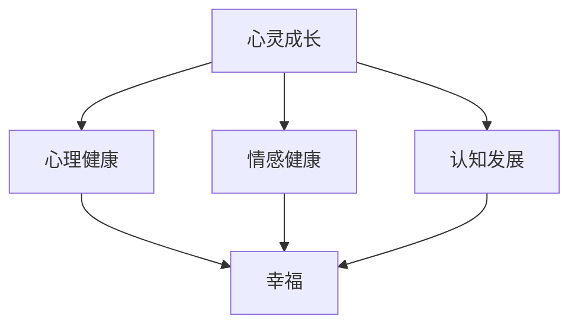

在上述流程图中，心灵成长与心理健康、情感健康和认知发展相互关联，共同作用于个体的幸福感。

**核心算法原理讲解**：

心灵成长的算法可以理解为以下几个步骤：

1. **自我认知**：通过内省和反思，了解自己的情绪、需求和价值观。
2. **自我激励**：设定目标，激发内在动力，实现自我提升。
3. **情绪调节**：学会识别和处理负面情绪，保持情绪稳定。
4. **人际关系**：建立和维护积极的人际关系，获得情感支持。
5. **精神修养**：通过冥想、瑜伽等精神实践活动，提升精神层次。

以下是一个简单的Python代码示例，展示了自我认知的过程：

```python
# 自我认知示例

def self_awareness():
    print("正在进入自我认知环节...")
    print("请回答以下问题：")
    print("- 你最近有什么情绪波动吗？")
    print("- 你的长期目标是什么？")
    print("- 你如何看待自己的优点和缺点？")
    user_input = input()
    print(f"您的回答：{user_input}")

self_awareness()
```

通过上述代码，我们可以引导用户进行自我认知，从而为心灵成长打下基础。

### 1.2 心灵成长对个人发展的影响

**核心概念与联系**：

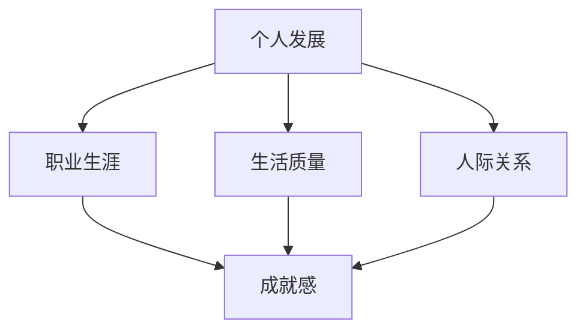

心灵成长对个人发展的影响是多方面的，包括提高职业生涯的成就感、提升生活质量以及改善人际关系。

**核心算法原理讲解**：

心灵成长对个人发展的算法可以概括为以下几点：

1. **目标设定**：明确个人目标，制定合理计划。
2. **时间管理**：合理安排时间，提高效率。
3. **情感管理**：处理负面情绪，保持积极心态。
4. **社交技巧**：提升人际交往能力，建立良好关系。
5. **自我反思**：定期反思个人发展，调整策略。

以下是一个简单的Python代码示例，展示了目标设定的过程：

```python
# 目标设定示例

def set_goals():
    print("请设定您的短期和长期目标：")
    short_term = input("短期目标（例如：学习一门新技能）： ")
    long_term = input("长期目标（例如：获得某个职业资格）： ")
    print(f"您的短期目标是：{short_term}")
    print(f"您的长期目标是：{long_term}")

set_goals()
```

通过上述代码，我们可以帮助用户设定明确的目标，从而促进个人发展。

### 1.3 当代社会心灵成长的挑战

**核心概念与联系**：

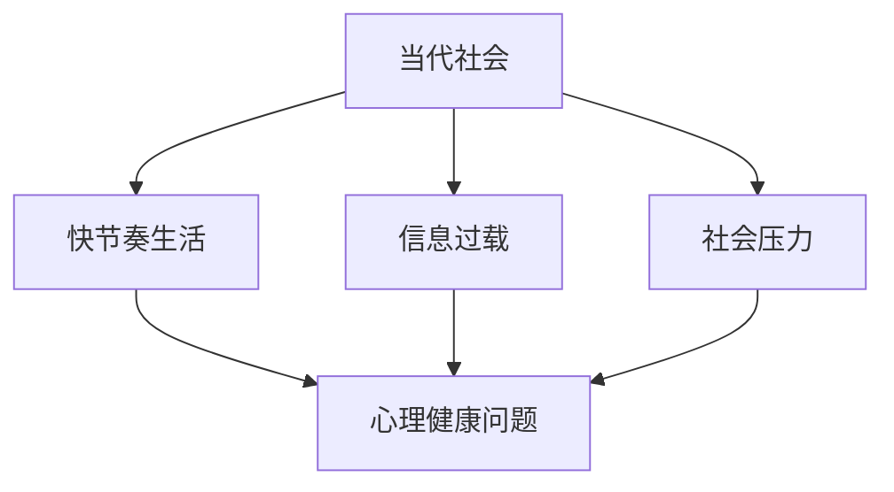

在当代社会，快节奏生活、信息过载和社会压力等因素给心灵成长带来了诸多挑战。

**核心算法原理讲解**：

面对当代社会的挑战，心灵成长的算法可以包括以下几点：

1. **时间管理**：合理安排时间，减少不必要的压力。
2. **情绪调节**：学会处理负面情绪，保持心理平衡。
3. **社交支持**：建立稳定的社交网络，获得情感支持。
4. **自我反思**：定期反思生活状态，调整心态。
5. **心理健康**：寻求专业帮助，维护心理健康。

以下是一个简单的Python代码示例，展示了情绪调节的过程：

```python
# 情绪调节示例

def emotion_regulation():
    print("请描述您的当前情绪：")
    emotion = input()
    print("以下是一些情绪调节方法：")
    print("- 深呼吸")
    print("- 运动")
    print("- 冥想")
    print("- 与朋友交流")
    print("请选择一种方法尝试：")
    method = input()
    print(f"您选择了{method}来调节情绪。")

emotion_regulation()
```

通过上述代码，我们可以帮助用户学会处理负面情绪，从而应对当代社会的挑战。

## 第2章 了解自我与心灵成长

### 2.1 自我认识的步骤

**核心概念与联系**：

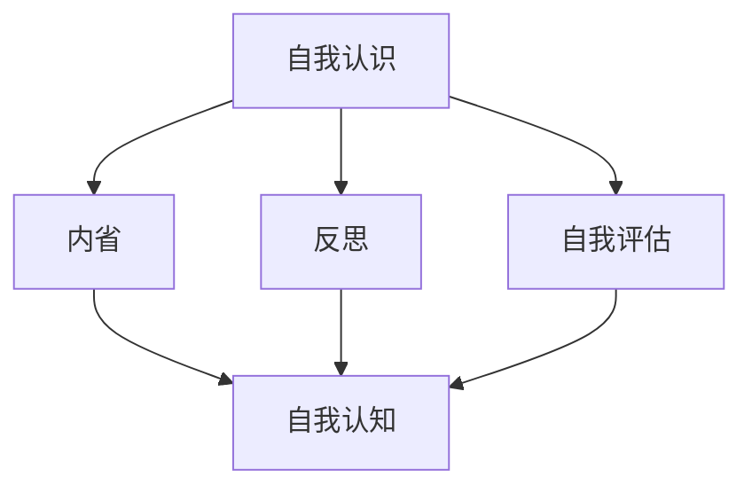

自我认识是心灵成长的基础，包括内省、反思和自我评估三个步骤。

**核心算法原理讲解**：

自我认识的算法可以概括为以下几点：

1. **内省**：通过静心冥想，深入思考自己的情绪和动机。
2. **反思**：回顾自己的行为和决策，分析其背后的原因和影响。
3. **自我评估**：根据反思结果，评估自己的优点和不足，制定改进计划。

以下是一个简单的Python代码示例，展示了内省的过程：

```python
# 内省示例

def introspection():
    print("请花几分钟时间，静心冥想，思考以下问题：")
    print("- 你最近的情绪变化是什么？")
    print("- 你在什么情况下感到最幸福？")
    print("- 你对自己的未来有什么期待？")
    print("请记录下你的思考过程：")
    reflection = input()
    print(f"您的内省记录：{reflection}")

introspection()
```

通过上述代码，我们可以引导用户进行内省，从而深入了解自己。

### 2.2 心灵成长的内在动力

**核心概念与联系**：

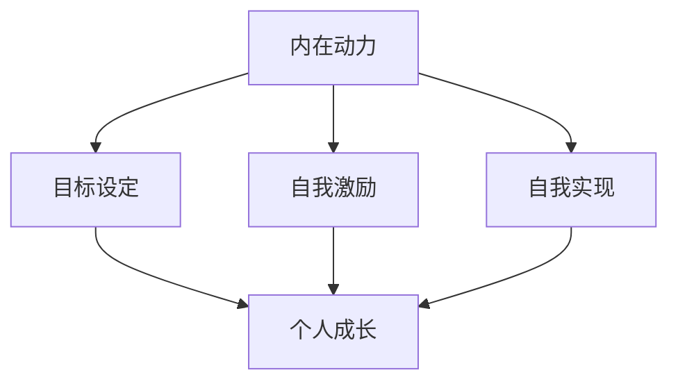

心灵成长的内在动力来源于目标设定、自我激励和自我实现。

**核心算法原理讲解**：

内在动力的算法可以包括以下几点：

1. **目标设定**：设定明确、具有挑战性的目标，激发内在动力。
2. **自我激励**：通过自我激励，保持持续的努力和进步。
3. **自我实现**：不断追求自我实现，实现个人成长。

以下是一个简单的Python代码示例，展示了目标设定的过程：

```python
# 目标设定示例

def set_goals():
    print("请设定您的短期和长期目标：")
    short_term = input("短期目标（例如：学习一门新技能）： ")
    long_term = input("长期目标（例如：获得某个职业资格）： ")
    print(f"您的短期目标是：{short_term}")
    print(f"您的长期目标是：{long_term}")

set_goals()
```

通过上述代码，我们可以帮助用户设定明确的目标，从而激发内在动力。

### 2.3 自我探索的实践方法

**核心概念与联系**：


自我探索的实践方法包括冥想、写作和艺术创作，这些活动有助于情绪调节和个人成长。

**核心算法原理讲解**：

自我探索的算法可以包括以下几点：

1. **冥想**：通过冥想，放松身心，提升自我意识。
2. **写作**：通过写作，表达内心感受，梳理思绪。
3. **艺术创作**：通过艺术创作，发掘创造力，提升情感体验。

以下是一个简单的Python代码示例，展示了冥想的过程：

```python
# 冥想示例

def meditation():
    print("请找一个安静的地方，坐直身体，闭上眼睛，深呼吸...")
    print("当您的思绪开始飘散时，轻轻地将它们带回到呼吸上...")
    print("保持这个状态，持续5分钟。")
    input("完成后，按下回车键。")

meditation()
```

通过上述代码，我们可以引导用户进行冥想，从而进行自我探索。

## 第3章 心理健康与心灵成长

### 3.1 心理健康的重要性

**核心概念与联系**：

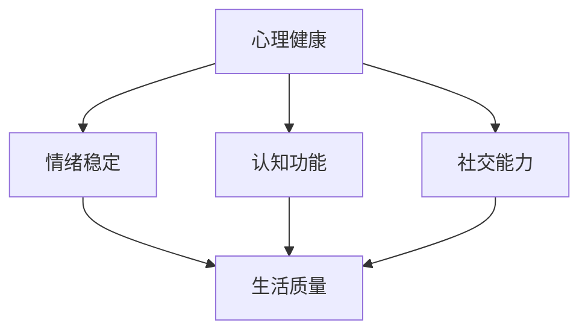

心理健康是心灵成长的重要组成部分，它关乎情绪稳定、认知功能和社交能力，进而影响生活质量。

**核心算法原理讲解**：

心理健康的重要性可以通过以下几个步骤进行阐述：

1. **情绪稳定**：通过情绪调节，保持心理平衡。
2. **认知功能**：通过学习新知识和技能，提升认知能力。
3. **社交能力**：通过建立和维护良好的人际关系，提升社交能力。

以下是一个简单的Python代码示例，展示了情绪调节的过程：

```python
# 情绪调节示例

def emotion_regulation():
    print("请描述您的当前情绪：")
    emotion = input()
    print("以下是一些情绪调节方法：")
    print("- 深呼吸")
    print("- 运动")
    print("- 冥想")
    print("- 与朋友交流")
    print("请选择一种方法尝试：")
    method = input()
    print(f"您选择了{method}来调节情绪。")

emotion_regulation()
```

通过上述代码，我们可以帮助用户学会处理负面情绪，从而维护心理健康。

### 3.2 心理健康的评估指标

**核心概念与联系**：

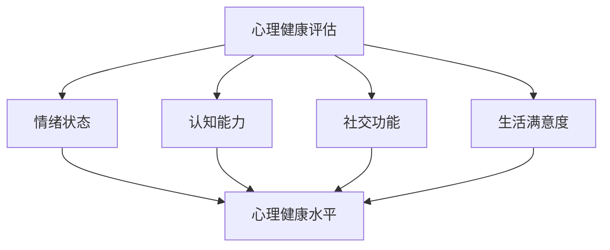

心理健康的评估指标包括情绪状态、认知能力、社交功能和生活满意度，这些指标共同反映了心理健康水平。

**核心算法原理讲解**：

心理健康的评估算法可以包括以下几点：

1. **情绪状态**：通过情绪调节问卷，评估情绪稳定性。
2. **认知能力**：通过认知功能测试，评估认知水平。
3. **社交功能**：通过社交能力问卷，评估社交适应性。
4. **生活满意度**：通过生活质量评估，评估生活满意度。

以下是一个简单的Python代码示例，展示了情绪状态的评估过程：

```python
# 情绪状态评估示例

def assess_emotion():
    print("以下是一些关于情绪状态的问题，请如实回答：")
    print("1. 您是否经常感到焦虑或紧张？(是/否)")
    print("2. 您是否经常感到抑郁或沮丧？(是/否)")
    print("3. 您的情绪是否容易受到外界影响？(是/否)")
    print("4. 您是否感到情绪失控或难以控制？(是/否)")
    responses = []
    for i in range(1, 5):
        response = input(f"问题{i}：")
        responses.append(response)
    print(f"您的情绪状态评估结果：{responses}")

assess_emotion()
```

通过上述代码，我们可以帮助用户评估情绪状态，从而了解自己的心理健康状况。

### 3.3 心理健康的维护与提升策略

**核心概念与联系**：

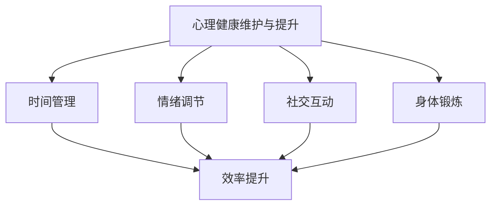

心理健康的维护与提升策略包括时间管理、情绪调节、社交互动和身体锻炼，这些策略有助于提升心理效率和生活质量。

**核心算法原理讲解**：

心理健康的维护与提升算法可以包括以下几点：

1. **时间管理**：合理安排时间，减少压力，提高效率。
2. **情绪调节**：通过情绪调节方法，保持心理平衡。
3. **社交互动**：积极参与社交活动，建立良好的人际关系。
4. **身体锻炼**：定期进行身体锻炼，提升身体素质。

以下是一个简单的Python代码示例，展示了情绪调节的过程：

```python
# 情绪调节示例

def emotion_regulation():
    print("请描述您的当前情绪：")
    emotion = input()
    print("以下是一些情绪调节方法：")
    print("- 深呼吸")
    print("- 运动")
    print("- 冥想")
    print("- 与朋友交流")
    print("请选择一种方法尝试：")
    method = input()
    print(f"您选择了{method}来调节情绪。")

emotion_regulation()
```

通过上述代码，我们可以帮助用户学会处理负面情绪，从而维护心理健康。

## 第4章 情绪管理与心灵成长

### 4.1 情绪的类型与特点

**核心概念与联系**：

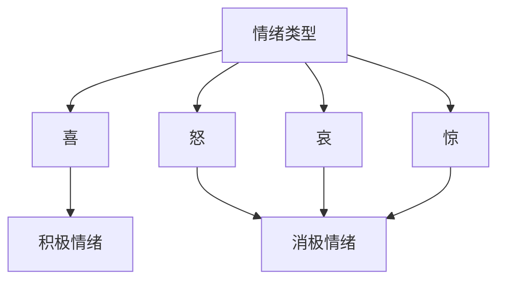

情绪可以分为喜、怒、哀、惊等类型，它们具有不同的特点。

**核心算法原理讲解**：

情绪的算法原理可以包括以下几点：

1. **情绪识别**：通过感知和认知，识别情绪的类型和特点。
2. **情绪评估**：根据情绪的影响，评估情绪的积极或消极性质。
3. **情绪调节**：通过调节方法，平衡情绪状态。

以下是一个简单的Python代码示例，展示了情绪识别的过程：

```python
# 情绪识别示例

def emotion_identification():
    print("以下是一些情绪描述，请选择您当前的情绪：")
    emotions = ["喜", "怒", "哀", "惊"]
    for i, emotion in enumerate(emotions, 1):
        print(f"{i}. {emotion}")
    choice = int(input("请选择一个数字："))
    print(f"您选择了{emotions[choice - 1]}。")

emotion_identification()
```

通过上述代码，我们可以帮助用户识别当前的情绪。

### 4.2 情绪管理与心灵成长的关系

**核心概念与联系**：

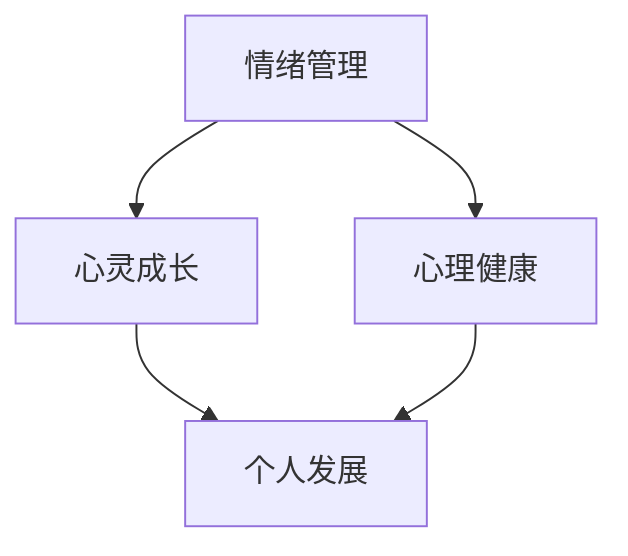

情绪管理是心灵成长的重要组成部分，它与心理健康和个人发展密切相关。

**核心算法原理讲解**：

情绪管理与心灵成长的关系可以通过以下步骤进行阐述：

1. **情绪调节**：通过情绪调节，保持心理平衡，促进心灵成长。
2. **情绪认知**：通过情绪认知，了解自己的情绪，提升自我意识。
3. **情绪应对**：通过情绪应对，学会处理负面情绪，增强心理韧性。

以下是一个简单的Python代码示例，展示了情绪调节的过程：

```python
# 情绪调节示例

def emotion Regulation():
    print("请描述您的当前情绪：")
    emotion = input()
    print("以下是一些情绪调节方法：")
    print("- 深呼吸")
    print("- 运动")
    print("- 冥想")
    print("- 与朋友交流")
    print("请选择一种方法尝试：")
    method = input()
    print(f"您选择了{method}来调节情绪。")

emotion Regulation()
```

通过上述代码，我们可以帮助用户学会处理负面情绪，从而促进心灵成长。

### 4.3 情绪管理的方法与技巧

**核心概念与联系**：

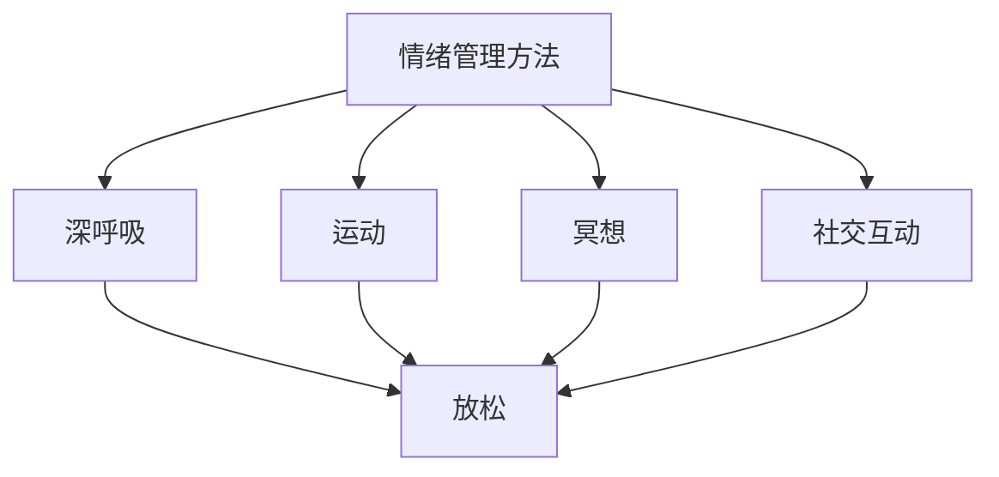

情绪管理的方法与技巧包括深呼吸、运动、冥想和社交互动，这些方法有助于放松身心，调节情绪。

**核心算法原理讲解**：

情绪管理的方法与技巧可以通过以下步骤进行阐述：

1. **深呼吸**：通过深呼吸，放松身心，降低紧张情绪。
2. **运动**：通过运动，释放压力，提升心情。
3. **冥想**：通过冥想，集中注意力，提升心理平衡。
4. **社交互动**：通过社交互动，获得支持，缓解情绪。

以下是一个简单的Python代码示例，展示了深呼吸的过程：

```python
# 深呼吸示例

def deep_breathing():
    print("请找一个安静的地方，坐直身体，进行深呼吸...")
    print("吸气...保持...呼气...")
    print("重复此过程，每次3分钟。")
    input("完成后，按下回车键。")

deep_breathing()
```

通过上述代码，我们可以引导用户进行深呼吸，从而调节情绪。

## 第5章 人际关系与心灵成长

### 5.1 人际关系的重要性

**核心概念与联系**：

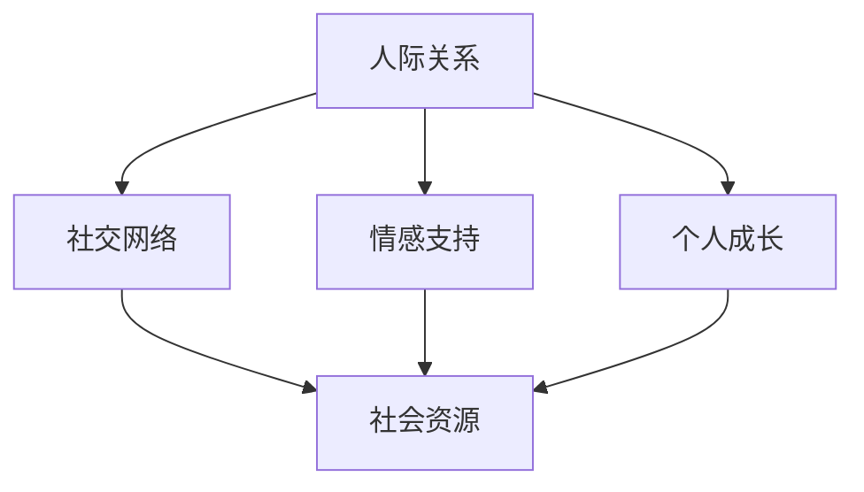

人际关系是心灵成长的重要组成部分，它关乎社交网络、情感支持和个人成长，进而影响社会资源和幸福感。

**核心算法原理讲解**：

人际关系的重要性可以通过以下步骤进行阐述：

1. **社交网络**：建立和维护广泛的社交网络，获取社会资源。
2. **情感支持**：通过人际关系，获得情感支持和理解。
3. **个人成长**：通过人际交往，学习新知识和技能，促进个人成长。

以下是一个简单的Python代码示例，展示了社交网络的建立过程：

```python
# 社交网络建立示例

def build_social_network():
    print("请输入您的社交网络成员信息：")
    members = input("请输入成员名称（用逗号分隔）：")
    print(f"您的社交网络成员：{members.split(',')}")

build_social_network()
```

通过上述代码，我们可以帮助用户建立社交网络，从而促进人际关系的发展。

### 5.2 人际关系的负面影响

**核心概念与联系**：

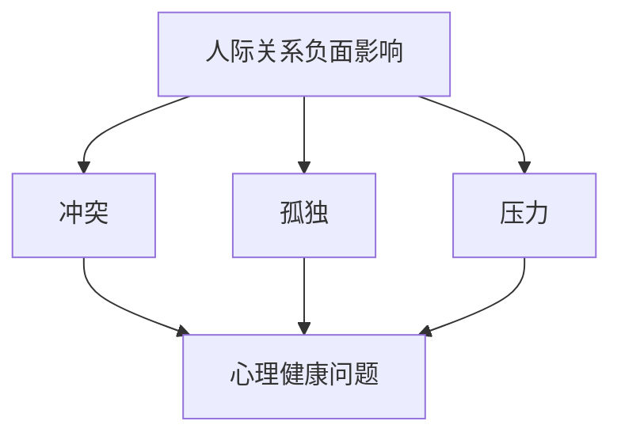

人际关系的负面影响包括冲突、孤独和压力，这些因素可能导致心理健康问题。

**核心算法原理讲解**：

人际关系的负面影响可以通过以下步骤进行阐述：

1. **冲突管理**：学会处理人际关系中的冲突，避免负面情绪。
2. **孤独缓解**：通过社交活动，减少孤独感，提升幸福感。
3. **压力缓解**：通过情绪调节方法，缓解压力，保持心理平衡。

以下是一个简单的Python代码示例，展示了冲突管理的流程：

```python
# 冲突管理示例

def conflict_management():
    print("请描述您遇到的人际冲突：")
    conflict = input()
    print("以下是一些冲突管理方法：")
    print("- 沟通与理解")
    print("- 妥协与让步")
    print("- 寻求第三方调解")
    print("请选择一种方法尝试：")
    method = input()
    print(f"您选择了{method}来处理冲突。")

conflict_management()
```

通过上述代码，我们可以帮助用户学会处理人际关系中的冲突，从而减轻负面影响。

### 5.3 培养良好人际关系的策略

**核心概念与联系**：

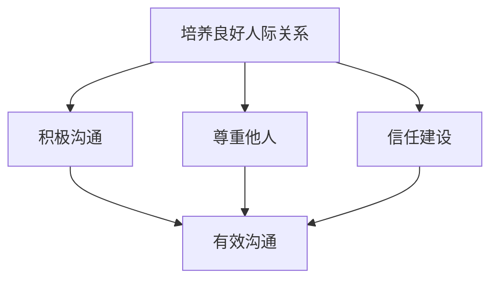

培养良好人际关系的策略包括积极沟通、尊重他人和信任建设，这些策略有助于建立和维护良好的人际关系。

**核心算法原理讲解**：

培养良好人际关系的策略可以通过以下步骤进行阐述：

1. **积极沟通**：通过主动沟通，建立良好的沟通渠道。
2. **尊重他人**：通过尊重他人，树立良好的形象。
3. **信任建设**：通过诚实和可靠性，建立信任关系。

以下是一个简单的Python代码示例，展示了积极沟通的过程：

```python
# 积极沟通示例

def active_communication():
    print("请描述您想要沟通的话题：")
    topic = input()
    print("以下是一些积极沟通的方法：")
    print("- 倾听与回应")
    print("- 表达观点与感受")
    print("- 寻求共识与理解")
    print("请选择一种方法尝试：")
    method = input()
    print(f"您选择了{method}来沟通。")

active_communication()
```

通过上述代码，我们可以帮助用户学会积极沟通，从而培养良好的人际关系。

## 第6章 精神修养与心灵成长

### 6.1 精神修养的意义

**核心概念与联系**：

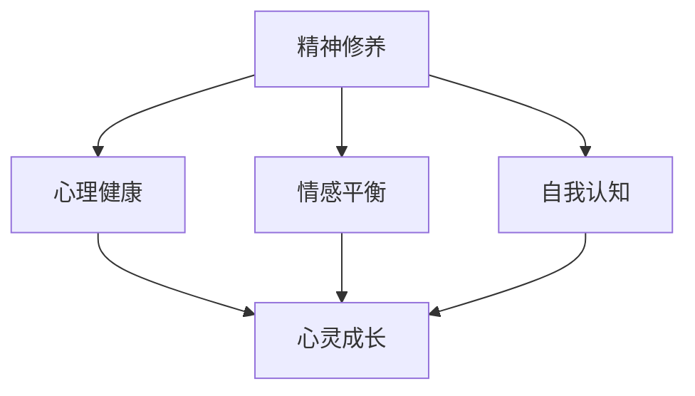

精神修养是心灵成长的重要组成部分，它关乎心理健康、情感平衡和自我认知，有助于提升心灵成长水平。

**核心算法原理讲解**：

精神修养的意义可以通过以下步骤进行阐述：

1. **心理健康**：通过精神修养，保持心理平衡，提升生活质量。
2. **情感平衡**：通过精神修养，调节情绪，保持情感平衡。
3. **自我认知**：通过精神修养，深入了解自己，提升自我认知。

以下是一个简单的Python代码示例，展示了情感平衡的过程：

```python
# 情感平衡示例

def emotional_balance():
    print("请描述您的当前情绪：")
    emotion = input()
    print("以下是一些情感平衡的方法：")
    print("- 冥想")
    print("- 运动")
    print("- 社交互动")
    print("请选择一种方法尝试：")
    method = input()
    print(f"您选择了{method}来平衡情绪。")

emotional_balance()
```

通过上述代码，我们可以帮助用户学会调节情绪，从而实现情感平衡。

### 6.2 精神修养的方法

**核心概念与联系**：

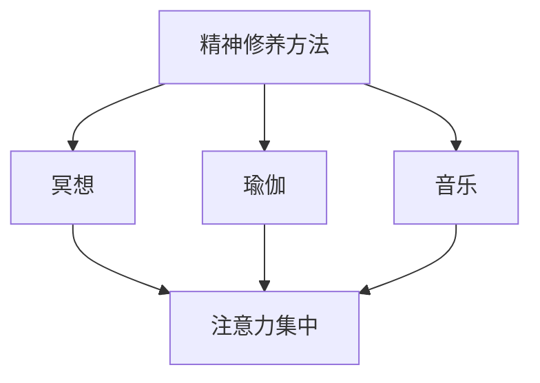

精神修养的方法包括冥想、瑜伽和音乐，这些活动有助于提升注意力、情绪调节和心理健康。

**核心算法原理讲解**：

精神修养的方法可以通过以下步骤进行阐述：

1. **冥想**：通过冥想，集中注意力，提升内心平静。
2. **瑜伽**：通过瑜伽，调节呼吸，增强身心健康。
3. **音乐**：通过音乐，激发情感，提升心理健康。

以下是一个简单的Python代码示例，展示了冥想的过程：

```python
# 冥想示例

def meditation():
    print("请找一个安静的地方，坐直身体，闭上眼睛，进行冥想...")
    print("当您的思绪开始飘散时，轻轻地将它们带回到呼吸上...")
    print("保持这个状态，持续5分钟。")
    input("完成后，按下回车键。")

meditation()
```

通过上述代码，我们可以引导用户进行冥想，从而实现精神修养。

### 6.3 精神修养与心灵成长的关系

**核心概念与联系**：

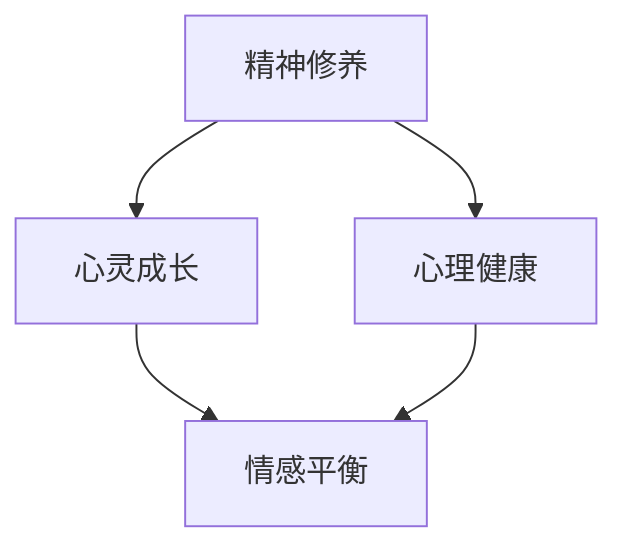

精神修养与心灵成长密切相关，它们共同作用于心理健康和情感平衡。

**核心算法原理讲解**：

精神修养与心灵成长的关系可以通过以下步骤进行阐述：

1. **精神修养**：通过冥想、瑜伽和音乐等活动，提升心理健康和情感平衡。
2. **心灵成长**：通过自我认知、情绪调节和人际关系等活动，促进个人成长。

以下是一个简单的Python代码示例，展示了情感平衡的过程：

```python
# 情感平衡示例

def emotional_balance():
    print("请描述您的当前情绪：")
    emotion = input()
    print("以下是一些情感平衡的方法：")
    print("- 冥想")
    print("- 运动")
    print("- 社交互动")
    print("请选择一种方法尝试：")
    method = input()
    print(f"您选择了{method}来平衡情绪。")

emotional_balance()
```

通过上述代码，我们可以帮助用户学会调节情绪，从而实现情感平衡，促进心灵成长。

## 第7章 实践中的心灵成长

### 7.1 心灵成长实践的重要性

**核心概念与联系**：

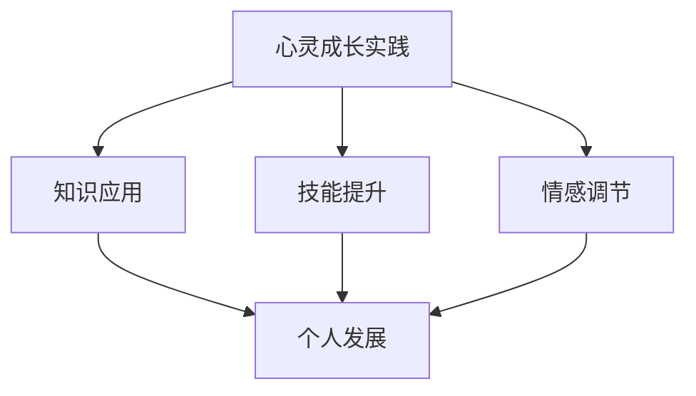

心灵成长实践是将理论知识应用于实际生活中的过程，它关乎知识应用、技能提升和情感调节，对个人发展具有重要意义。

**核心算法原理讲解**：

心灵成长实践的重要性可以通过以下步骤进行阐述：

1. **知识应用**：通过将心理学理论应用于实际情境，提升解决问题的能力。
2. **技能提升**：通过实践，掌握心理调适技巧，提升应对压力的能力。
3. **情感调节**：通过实践，学会调节情绪，保持心理健康。

以下是一个简单的Python代码示例，展示了知识应用的过程：

```python
# 知识应用示例

def knowledge_application():
    print("请选择一个您遇到的问题：")
    print("1. 如何提高工作效率？")
    print("2. 如何处理人际关系冲突？")
    print("3. 如何应对压力和焦虑？")
    choice = int(input("请选择一个数字："))
    if choice == 1:
        print("您可以选择以下方法提高工作效率：")
        print("- 制定合理的计划")
        print("- 避免多任务处理")
        print("- 保持工作环境的整洁")
    elif choice == 2:
        print("您可以选择以下方法处理人际关系冲突：")
        print("- 沟通与理解")
        print("- 寻求第三方调解")
        print("- 调整心态，避免过度反应")
    elif choice == 3:
        print("您可以选择以下方法应对压力和焦虑：")
        print("- 深呼吸")
        print("- 运动")
        print("- 冥想")
    else:
        print("请选择一个有效的问题。")

knowledge_application()
```

通过上述代码，我们可以帮助用户将心理学知识应用于实际问题，从而提升个人发展能力。

### 7.2 心灵成长实践的方法

**核心概念与联系**：

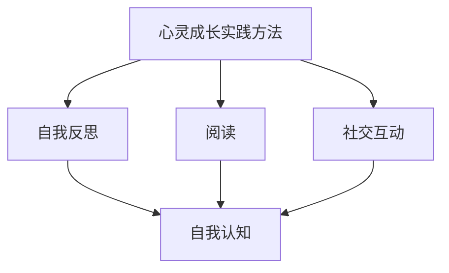

心灵成长实践的方法包括自我反思、阅读和社交互动，这些方法有助于提升自我认知、情感调节和人际交往能力。

**核心算法原理讲解**：

心灵成长实践的方法可以通过以下步骤进行阐述：

1. **自我反思**：通过反思自己的行为和情绪，提升自我认知。
2. **阅读**：通过阅读心理学书籍和文章，获取知识，提升认知水平。
3. **社交互动**：通过参与社交活动，建立和维护人际关系，提升情感调节能力。

以下是一个简单的Python代码示例，展示了自我反思的过程：

```python
# 自我反思示例

def self_reflection():
    print("请描述您最近的一次经历：")
    experience = input()
    print("请回答以下问题：")
    print("- 这个经历给您带来了什么感受？")
    print("- 您从这个经历中学到了什么？")
    print("- 您会怎样改进自己在类似情况下的表现？")
    reflection = input()
    print(f"您的自我反思：{reflection}")

self_reflection()
```

通过上述代码，我们可以帮助用户进行自我反思，从而提升自我认知。

### 7.3 心灵成长实践的案例分析

**核心概念与联系**：

```mermaid
graph TD
    A[心灵成长实践案例分析] --> B[成功案例]
    A --> C[失败案例]
    B --> D[经验分享]
    C --> D
```

心灵成长实践的案例分析包括成功案例和失败案例，这些案例有助于分享经验，提供实践参考。

**核心算法原理讲解**：

心灵成长实践的案例分析可以通过以下步骤进行阐述：

1. **成功案例**：分析成功案例，了解其方法、策略和成果。
2. **失败案例**：分析失败案例，总结教训，避免重复错误。
3. **经验分享**：通过分享成功和失败的经验，提供实践指导。

以下是一个简单的Python代码示例，展示了成功案例的分析过程：

```python
# 成功案例分析示例

def successful_case_analysis():
    print("请描述一个您认为成功的心灵成长案例：")
    case = input()
    print("以下是一些成功因素：")
    print("- 明确的目标设定")
    print("- 持续的努力和实践")
    print("- 正确的心态调整")
    print("请回答以下问题：")
    print("- 您从这个案例中学到了什么？")
    print("- 您会如何应用这些经验到自己的生活中？")
    reflection = input()
    print(f"您的分析结果：{reflection}")

successful_case_analysis()
```

通过上述代码，我们可以帮助用户分析成功案例，从而提升心灵成长实践的效果。

## 第8章 心灵成长的未来趋势

### 8.1 心灵成长领域的未来发展

**核心概念与联系**：

```mermaid
graph TD
    A[心灵成长领域] --> B[新兴技术]
    A --> C[心理健康应用]
    A --> D[教育整合]
    B --> E[数据驱动]
    C --> E
    D --> E
```

心灵成长领域的未来发展将受到新兴技术、心理健康应用和教育整合的推动，数据驱动将成为重要趋势。

**核心算法原理讲解**：

心灵成长领域的未来发展可以通过以下步骤进行阐述：

1. **新兴技术**：利用人工智能、虚拟现实等新兴技术，提升心灵成长实践的效果。
2. **心理健康应用**：开发心理健康应用，提供个性化的心灵成长服务。
3. **教育整合**：将心灵成长理念融入教育体系，提升整体心理健康水平。
4. **数据驱动**：通过数据分析，优化心灵成长实践策略，提高效果。

以下是一个简单的Python代码示例，展示了数据驱动的应用：

```python
# 数据驱动示例

def data_driven():
    print("请输入您的心理状态评分（1-10分）：")
    score = int(input())
    print("根据您的评分，我们建议：")
    if score >= 8:
        print("- 保持良好的生活习惯")
        print("- 继续探索心灵成长的方法")
    elif score >= 5:
        print("- 注意情绪调节")
        print("- 积极寻求社交互动")
    else:
        print("- 寻求专业心理咨询")
        print("- 关注心理健康知识")

data_driven()
```

通过上述代码，我们可以根据用户的心理状态评分，提供个性化的心灵成长建议。

### 8.2 心灵成长与新兴技术

**核心概念与联系**：

```mermaid
graph TD
    A[心灵成长] --> B[人工智能]
    A --> C[虚拟现实]
    A --> D[大数据]
    B --> E[个性化服务]
    C --> E
    D --> E
```

心灵成长与新兴技术的结合，将为个性化服务、虚拟现实和大数据等提供新的发展机遇。

**核心算法原理讲解**：

心灵成长与新兴技术的结合可以通过以下步骤进行阐述：

1. **人工智能**：利用人工智能，开发智能心理辅导系统，提供个性化服务。
2. **虚拟现实**：通过虚拟现实技术，创造沉浸式的心理训练环境，提升体验效果。
3. **大数据**：收集和分析大数据，了解用户需求，优化心理服务策略。

以下是一个简单的Python代码示例，展示了人工智能的应用：

```python
# 人工智能示例

def artificial_intelligence():
    print("请描述您遇到的心理问题：")
    problem = input()
    print("以下是一些可能的解决方案：")
    # 这里可以嵌入人工智能算法，根据问题提供解决方案
    print("1. 深呼吸练习")
    print("2. 冥想指导")
    print("3. 心理咨询建议")
    solution = int(input("请选择一个解决方案："))
    if solution == 1:
        print("我们建议您尝试深呼吸练习。")
    elif solution == 2:
        print("我们建议您尝试冥想指导。")
    elif solution == 3:
        print("我们建议您寻求专业心理咨询。")

artificial_intelligence()
```

通过上述代码，我们可以利用人工智能技术，为用户提供个性化的心理问题解决方案。

### 8.3 心灵成长与社会发展的关系

**核心概念与联系**：

```mermaid
graph TD
    A[心灵成长] --> B[社会稳定]
    A --> C[经济发展]
    A --> D[教育进步]
    B --> E[社会和谐]
    C --> E
    D --> E
```

心灵成长与社会发展密切相关，它关乎社会稳定、经济发展和教育进步，对构建和谐社会具有重要意义。

**核心算法原理讲解**：

心灵成长与社会发展的关系可以通过以下步骤进行阐述：

1. **社会稳定**：通过心灵成长，提升公民的心理素质，促进社会稳定。
2. **经济发展**：通过心灵成长，激发创新能力和创业精神，推动经济发展。
3. **教育进步**：通过心灵成长，提升教育质量，培养全面发展的人才。

以下是一个简单的Python代码示例，展示了社会稳定的应用：

```python
# 社会稳定示例

def social_stability():
    print("请描述您所在社区的心理状况：")
    situation = input()
    print("以下是一些提升社会稳定性的建议：")
    print("- 加强心理健康教育")
    print("- 推广心理辅导服务")
    print("- 增强社区凝聚力")
    suggestion = int(input("请选择一个建议："))
    if suggestion == 1:
        print("我们建议加强心理健康教育。")
    elif suggestion == 2:
        print("我们建议推广心理辅导服务。")
    elif suggestion == 3:
        print("我们建议增强社区凝聚力。")

social_stability()
```

通过上述代码，我们可以根据社区的心理状况，提供提升社会稳定性的建议。

## 总结与展望

**最佳实践 tips**：

1. **持续实践**：心灵成长需要持之以恒的实践，每日反思和调整，以实现持续进步。
2. **个性化策略**：根据自身情况和需求，选择合适的方法和策略，实现个性化成长。
3. **寻求支持**：在心灵成长过程中，不要孤立自己，寻求家人、朋友和专业人士的支持。

**注意事项**：

1. **心理安全**：在心灵成长过程中，注意保护自己的心理安全，避免过度自我批评和压力。
2. **适当调整**：根据实际情况，适时调整心灵成长目标和策略，以适应生活变化。
3. **心理健康**：关注自身心理健康，如遇到困扰，及时寻求专业帮助。

**拓展阅读**：

1. 《正念：如何活在当下》
2. 《心理学与生活》
3. 《心灵成长：从自我认识到自我实现》

作者：AI天才研究院/AI Genius Institute & 禅与计算机程序设计艺术 /Zen And The Art of Computer Programming

通过本文的详细阐述，我们希望读者能够更好地理解心灵成长的重要性，掌握实践方法，并在日常生活中积极培育丰富的内在世界。

