                 

# 为心灵成长准备沃土：培育丰富的内在世界

## 关键词
- 心灵成长
- 内在智慧
- 情绪管理
- 自我认知
- 冥想与放松
- 积极心态

## 摘要
在快节奏的现代社会中，心灵成长已成为许多人追求的目标。本文将探讨如何为心灵成长准备沃土，通过培育丰富的内在世界来提升个人幸福感。我们将从自我认知、情绪管理、内在智慧和积极心态等方面展开讨论，并提供具体的实践方法和策略。此外，本文还将探讨心灵成长对个人与社会的影响，以及如何通过实践持续提升内在世界。

## 引言
随着科技的迅猛发展和生活压力的增大，许多人开始关注心理健康和心灵成长。心灵成长不仅仅是解决心理问题，更是为了提高个人幸福感、增强心理韧性、实现人生目标。培育丰富的内在世界是实现心灵成长的关键，它包括自我认知、情绪管理、内在智慧和积极心态等多个方面。本文将逐步分析这些方面的核心概念和联系，并探讨如何通过具体实践方法来培育丰富的内在世界。

### 第一部分：心灵的觉醒

## 1.1 心灵成长的意义与目标

### 1.1.1 心灵成长的重要性

心灵成长是个人发展的核心。它不仅关系到心理健康，还影响人际关系、职业发展和生活质量。在快速变化的社会环境中，心灵成长能够帮助我们应对压力、适应变革，并实现个人潜力。

#### 核心概念与联系

心灵成长与心理健康密切相关。心理健康是指个体在情感、认知和行为方面保持良好的状态。心灵成长通过提升自我认知、情绪管理和内在智慧，促进心理健康的发展。

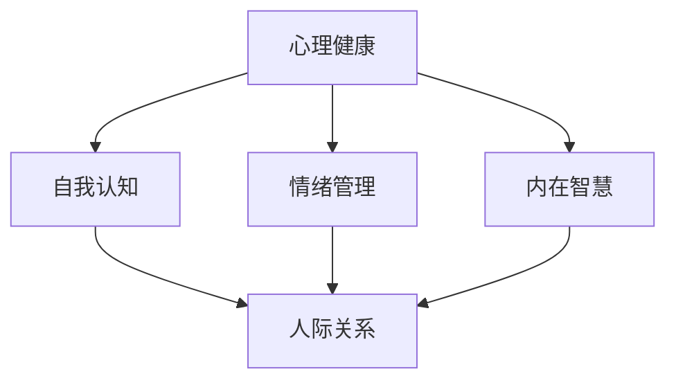

### 1.1.2 心灵成长的目标

心灵成长的目标是提升个人幸福感、增强心理韧性、实现人生目标。通过心灵成长，我们能够更好地理解自己、与他人建立更深层次的关系，并适应生活中的各种挑战。

#### 核心概念与联系

个人幸福感是心灵成长的重要目标之一。它包括情感满足、自我实现和生活满意度。内在智慧是实现个人幸福感和心理韧性的关键因素。

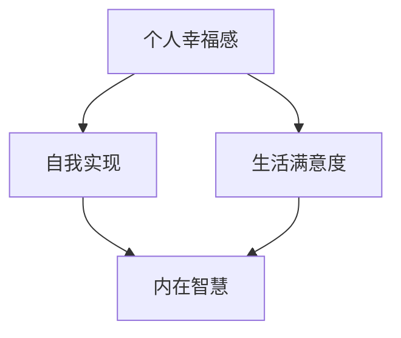

## 1.2 自我认知与自我接纳

### 1.2.1 自我认知的途径

自我认知是指对自己内心世界的理解和认识。以下是一些常见的自我认知途径：

1. **内省**：通过反思和思考自己的行为、情感和思维模式来了解自己。
2. **反馈**：通过他人的意见和建议来了解自己的优点和不足。
3. **心理测试**：使用专业的心理测试工具来评估自己的性格、能力和价值观。

#### 核心概念与联系

自我认知是心灵成长的基础。通过自我认知，我们能够更好地理解自己的需求和期望，从而更好地应对生活中的挑战。

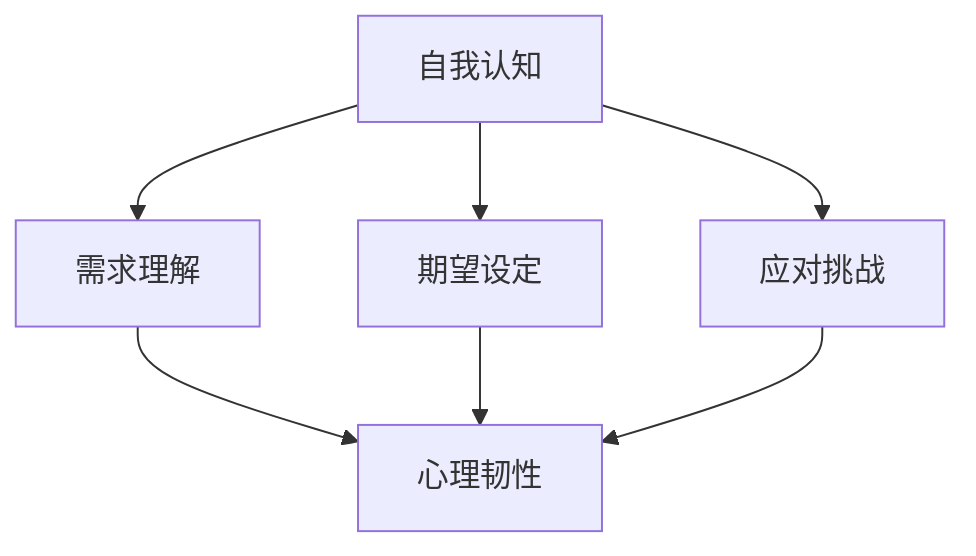

### 1.2.2 自我接纳的重要性

自我接纳是指接受自己的优点和缺点，不把自己与他人比较。自我接纳能够减少自我批评和焦虑，提升心理幸福感。

#### 核心概念与联系

自我接纳与心理健康密切相关。通过自我接纳，我们能够更好地处理负面情绪，提高自我价值感。

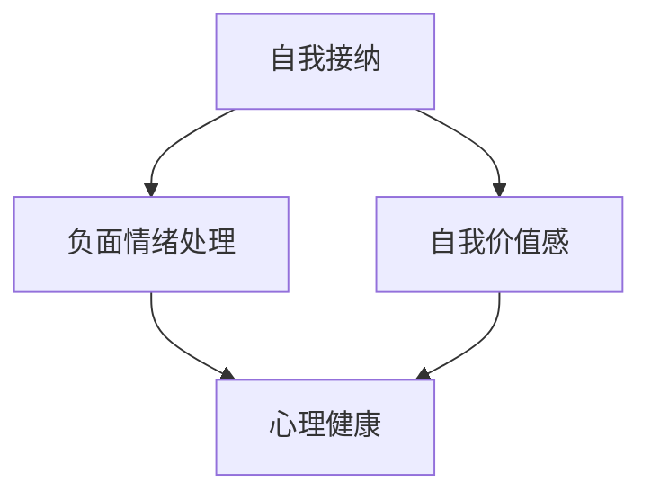

### 1.2.3 自我接纳的实践方法

以下是一些自我接纳的实践方法：

1. **正念冥想**：通过冥想和呼吸练习来提升自我接纳。
2. **感恩练习**：通过感恩日记或感恩冥想来提升自我接纳。
3. **自我肯定**：通过积极的自我对话来提升自我接纳。

#### 核心概念与联系

自我接纳是一个逐步的过程，需要持续的努力和实践。通过自我接纳，我们能够更好地理解自己，减少焦虑和压力，提高生活质量。

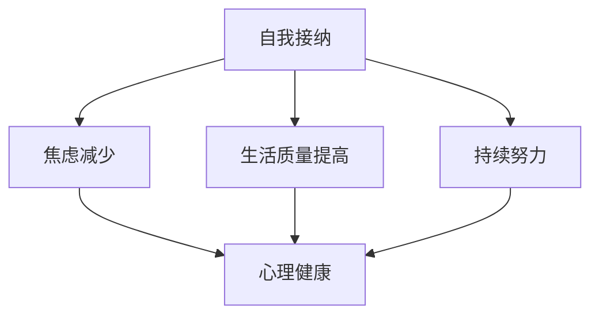

### 1.3 情绪管理

### 1.3.1 情绪的类型与特点

情绪是人类生活中不可或缺的一部分。以下是几种常见的情绪类型及其特点：

1. **喜悦**：积极、愉快的感觉。
2. **愤怒**：强烈、不满的感觉。
3. **悲伤**：失落、哀伤的感觉。
4. **焦虑**：紧张、担忧的感觉。
5. **平静**：安静、平和的感觉。

#### 核心概念与联系

情绪是心理健康的重要组成部分。情绪管理是指通过有效的方法来调节和控制情绪，以保持心理平衡。

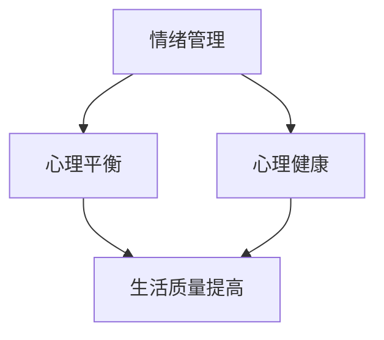

### 1.3.2 情绪管理的策略

以下是一些情绪管理的策略：

1. **认知行为疗法**：通过改变负面思维模式来调节情绪。
2. **放松技巧**：通过深呼吸、冥想等方法来缓解情绪紧张。
3. **运动**：通过运动来释放压力和焦虑。
4. **社交支持**：通过与他人交流来缓解负面情绪。

#### 核心概念与联系

情绪管理是心灵成长的关键环节。通过情绪管理，我们能够更好地应对生活中的挑战，提高生活质量。

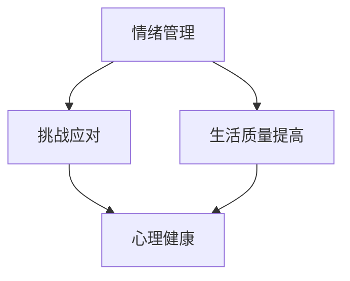

### 1.3.3 情绪调节的技巧

以下是一些情绪调节的技巧：

1. **情绪日记**：通过记录情绪变化来更好地理解自己的情绪。
2. **情感表达**：通过绘画、写作等方式来表达自己的情绪。
3. **情绪放松**：通过冥想、瑜伽等方法来放松情绪。

#### 核心概念与联系

情绪调节是情绪管理的具体实践。通过情绪调节，我们能够更好地控制情绪，提高心理幸福感。

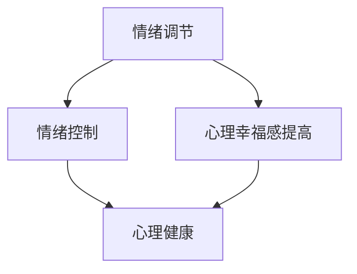

## 第二部分：内在世界的建设

## 2.1 培养内在智慧

### 2.1.1 内在智慧的内涵

内在智慧是指通过深入思考和反省来提升个人的认知能力、情感智慧和道德智慧。它不仅涉及知识的学习，更注重对人生和世界的深刻理解。

#### 核心概念与联系

内在智慧与心灵成长密切相关。通过培养内在智慧，我们能够更好地理解自己、他人和世界，提高生活质量。

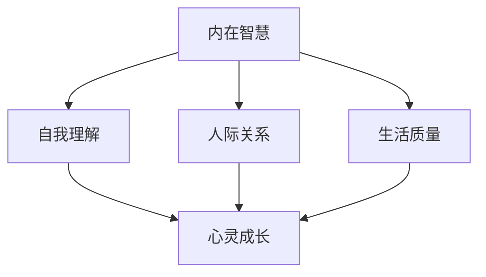

### 2.1.2 培养内在智慧的途径

以下是一些培养内在智慧的途径：

1. **阅读**：通过阅读书籍、文章和文学作品来拓宽知识视野。
2. **思考**：通过反思和思考来深化对问题的理解。
3. **体验**：通过实践和体验来积累人生经验。
4. **交流**：通过与他人交流和讨论来提升思维深度。

#### 核心概念与联系

培养内在智慧是一个长期的过程，需要持续的努力和实践。通过培养内在智慧，我们能够更好地理解自己和他人，提高心灵成长的效率。

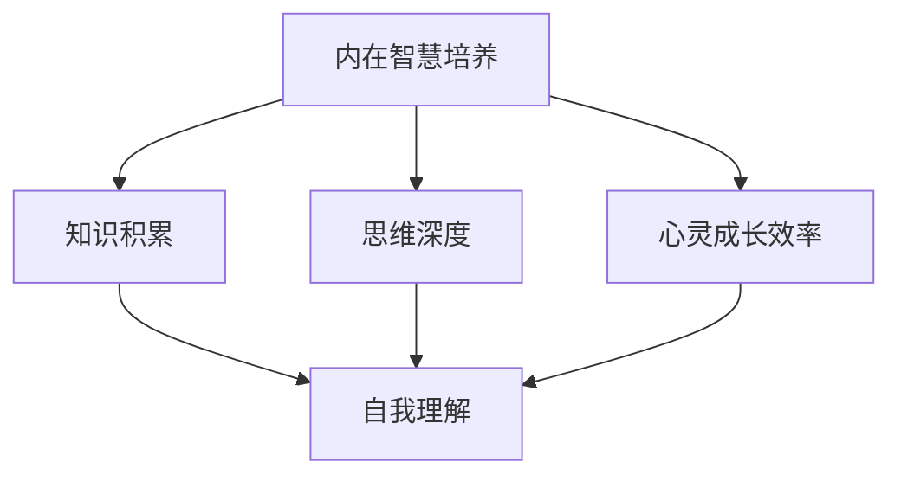

### 2.1.3 内在智慧的实践方法

以下是一些内在智慧的实践方法：

1. **反思日记**：通过记录反思日记来深入思考自己的生活和工作。
2. **心灵对话**：通过与他人进行真诚的心灵对话来提升思维深度。
3. **哲学思考**：通过阅读哲学作品和思考哲学问题来培养内在智慧。

#### 核心概念与联系

内在智慧的实践方法是提升内在智慧的关键。通过实践方法，我们能够更好地理解和运用内在智慧，提高生活质量。

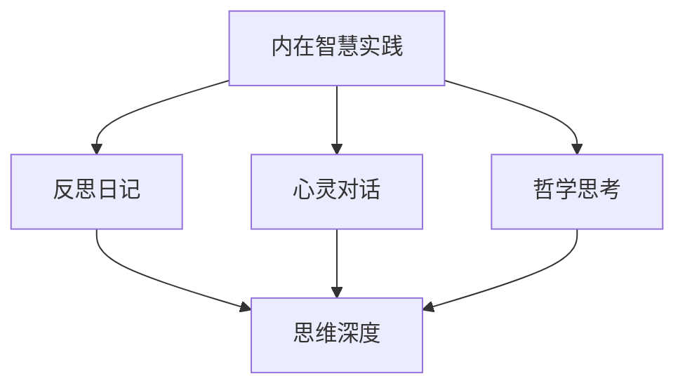

## 2.2 增强内在力量

### 2.2.1 内在力量的定义

内在力量是指个人在面对困难和挑战时，能够保持坚定信念、积极态度和持续行动的能力。它是心灵成长的重要标志，也是实现人生目标的关键因素。

#### 核心概念与联系

内在力量与心理韧性密切相关。通过增强内在力量，我们能够更好地应对生活中的压力和挑战，提高生活质量。

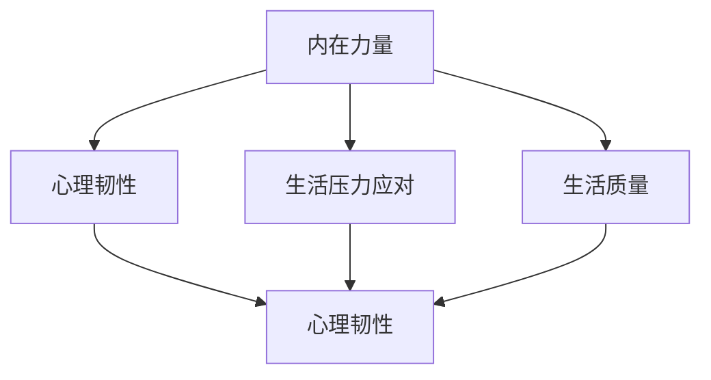

### 2.2.2 增强内在力量的途径

以下是一些增强内在力量的途径：

1. **积极心态**：通过培养积极的心态来增强内在力量。
2. **目标设定**：通过设定明确的目标来激发内在动力。
3. **行动实践**：通过实际行动来积累经验和增强内在力量。

#### 核心概念与联系

增强内在力量是一个逐步的过程，需要持续的努力和实践。通过增强内在力量，我们能够更好地应对生活中的挑战，实现人生目标。

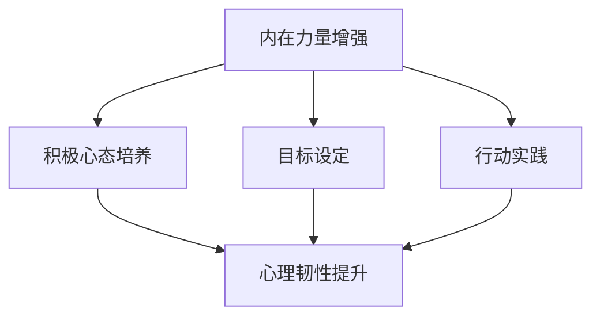

### 2.2.3 内在力量的实践方法

以下是一些内在力量的实践方法：

1. **日常锻炼**：通过锻炼身体来增强内在力量。
2. **心理训练**：通过心理训练来提升内在力量。
3. **应对挑战**：通过面对和解决挑战来增强内在力量。

#### 核心概念与联系

内在力量的实践方法是增强内在力量的关键。通过实践方法，我们能够更好地掌握内在力量，提高生活质量。

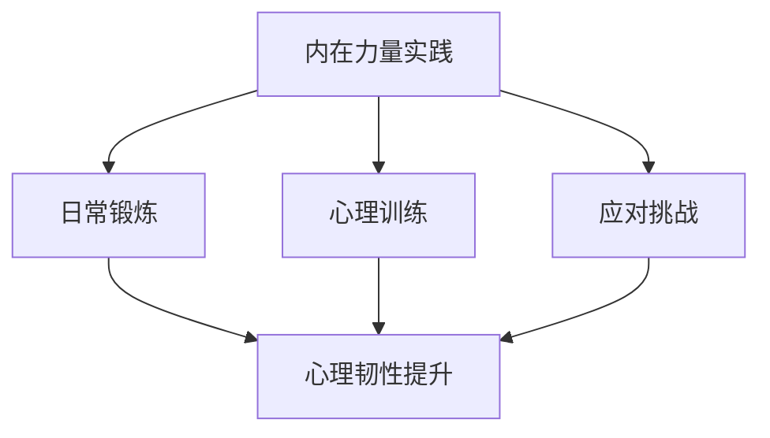

## 2.3 塑造积极心态

### 2.3.1 积极心态的重要性

积极心态是指在面对困难和挑战时，能够保持乐观、积极和自信的态度。积极心态对个人的心理健康和生活质量有着重要的影响。

#### 核心概念与联系

积极心态与心理健康密切相关。通过塑造积极心态，我们能够更好地应对生活中的压力和挑战，提高生活质量。

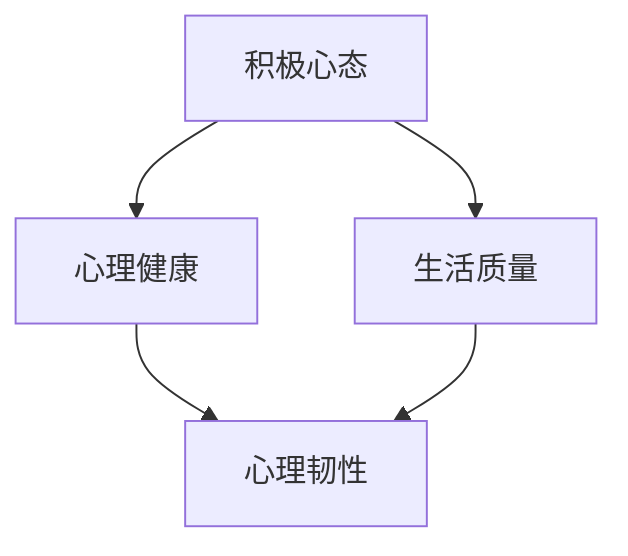

### 2.3.2 积极心态的培养方法

以下是一些积极心态的培养方法：

1. **正面思考**：通过正面思考来改变负面思维模式。
2. **感恩练习**：通过感恩练习来提升积极心态。
3. **目标设定**：通过设定明确的目标来激发积极心态。
4. **社交支持**：通过与他人建立良好的社交关系来提升积极心态。

#### 核心概念与联系

积极心态的培养是一个逐步的过程，需要持续的努力和实践。通过培养积极心态，我们能够更好地应对生活中的挑战，提高生活质量。

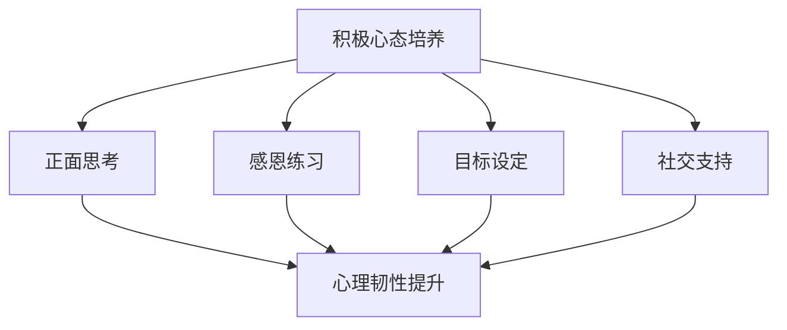

### 2.3.3 积极心态在生活中的应用

以下是一些积极心态在生活中的应用：

1. **面对挑战**：通过积极心态来应对生活中的挑战。
2. **处理冲突**：通过积极心态来处理人际关系中的冲突。
3. **应对失败**：通过积极心态来面对失败和挫折。

#### 核心概念与联系

积极心态在生活中的应用能够帮助我们更好地应对各种挑战和困难，提高生活质量。

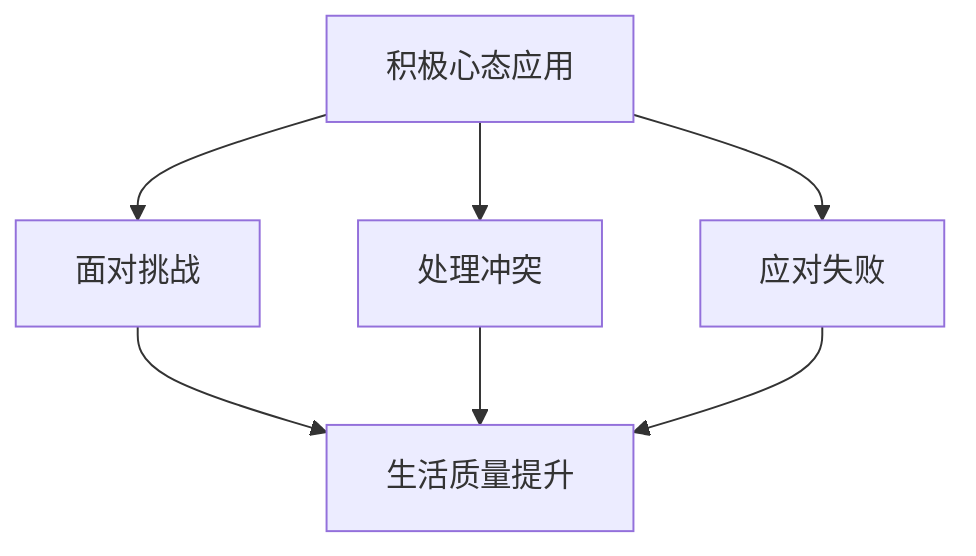

### 第三部分：心灵成长的具体实践

## 3.1 冥想与放松

### 3.1.1 冥想的原理与作用

冥想是一种通过专注和意识来放松身心、平静心灵的技术。它有助于减轻压力、提高注意力和提升整体幸福感。

```python
# 冥想的基本原理
def meditation():
    """冥想的基本原理是通过专注和意识来放松身心、平静心灵。"""
    # 专注呼吸
    focus_on_breathing()
    # 清空思维
    clear_mind()
    # 保持专注
    maintain_focus()

# 调用冥想函数
meditation()
```

#### 核心算法原理讲解

冥想的算法原理主要涉及以下几个方面：

1. **呼吸调节**：通过深呼吸来调节身心状态，降低紧张和焦虑。
2. **意识集中**：通过专注于呼吸或某个固定点来保持意识集中，减少杂念。
3. **放松身体**：通过身体放松来降低身体的紧张感，促进身体的放松和恢复。

```python
# 呼吸调节
def breathe_deeply():
    """深呼吸调节，每次呼吸时间控制在4-6秒之间。"""
    inhale(4)  # 吸气
    hold_breath(2)  # 暂停
    exhale(4)  # 呼气

# 意识集中
def focus_on_point():
    """专注于一个固定点，如鼻尖或心轮。"""
    while True:
        # 保持专注
        focus()
        # 如果思维跑偏，重新专注
        if distraction_detected():
            reset_focus()

# 身体放松
def relax_body():
    """逐步放松身体的各个部分。"""
    for part in ['头部', '颈部', '肩膀', '手臂', '背部', '腿部']:
        print(f"放松{part}...")
        # 等待几秒钟
        time.sleep(2)
```

#### 举例说明

以下是一个简单的冥想实践示例：

```python
# 冥想实践
def meditation_practice():
    """进行一个简单的冥想实践。"""
    print("开始冥想...")
    # 调节呼吸
    breathe_deeply()
    # 专注于呼吸
    focus_on_point()
    # 放松身体
    relax_body()
    print("冥想结束。")

# 调用冥想实践函数
meditation_practice()
```

### 3.1.2 冥想的实践方法

以下是一些冥想的实践方法：

1. **日常冥想**：每天固定时间进行冥想，如早晨或晚上。
2. **环境选择**：选择一个安静、舒适的环境进行冥想。
3. **坐姿冥想**：选择一个舒适的坐姿，保持身体的放松。
4. **呼吸冥想**：专注于呼吸，感受吸气和呼气的过程。

#### 核心算法原理讲解

冥想的实践方法主要涉及以下几个方面：

1. **时间安排**：选择一个固定的时间进行冥想，如早晨或晚上。
2. **环境调整**：选择一个安静、舒适的环境，有助于身心放松。
3. **姿势选择**：选择一个舒适的坐姿，有助于保持专注和放松。
4. **呼吸练习**：通过专注呼吸来调节身心状态，提高冥想效果。

```python
# 时间安排
def schedule_meditation():
    """安排冥想时间。"""
    print("设定冥想时间为每天早晨7点。")

# 环境调整
def adjust_environment():
    """调整冥想环境。"""
    print("确保环境安静、舒适。")

# 姿势选择
def choose_posture():
    """选择冥想姿势。"""
    print("选择一个舒适的坐姿。")

# 呼吸练习
def breathe_practice():
    """进行呼吸练习。"""
    print("专注于呼吸，感受吸气和呼气的过程。")
```

#### 举例说明

以下是一个简单的冥想实践示例：

```python
# 冥想实践
def meditation_practice():
    """进行一个简单的冥想实践。"""
    print("开始冥想...")
    schedule_meditation()
    adjust_environment()
    choose_posture()
    breathe_practice()
    print("冥想结束。")

# 调用冥想实践函数
meditation_practice()
```

### 3.1.3 放松技巧

以下是一些放松技巧：

1. **渐进性肌肉放松**：通过逐步放松身体的各个肌肉群来达到放松的效果。
2. **正念呼吸**：通过专注于呼吸来放松身心。
3. **瑜伽**：通过瑜伽的体位法和呼吸法来放松身心。

```python
# 渐进性肌肉放松
def progressive_muscle_relaxation():
    """进行渐进性肌肉放松。"""
    print("逐步放松身体的各个肌肉群。")

# 正念呼吸
def mindfulness_breathing():
    """进行正念呼吸。"""
    print("专注于呼吸，感受吸气和呼气的过程。")

# 瑜伽
def yoga():
    """进行瑜伽。"""
    print("练习瑜伽的体位法和呼吸法。")
```

#### 核心算法原理讲解

放松技巧的算法原理主要涉及以下几个方面：

1. **渐进性肌肉放松**：通过逐步收缩和放松身体的各个肌肉群来达到放松的效果。
2. **正念呼吸**：通过专注于呼吸来调节身心状态，减少压力和焦虑。
3. **瑜伽**：通过瑜伽的体位法和呼吸法来促进身体的放松和心灵的平静。

```python
# 渐进性肌肉放松
def progressive_muscle_relaxation():
    """进行渐进性肌肉放松。"""
    # 收缩肌肉
    contract_muscles()
    # 放松肌肉
    relax_muscles()

# 正念呼吸
def mindfulness_breathing():
    """进行正念呼吸。"""
    # 感受吸气
    feel_inhale()
    # 感受呼气
    feel_exhale()

# 瑜伽
def yoga():
    """进行瑜伽。"""
    # 练习体位法
    practice_asanas()
    # 练习呼吸法
    practice_pranayama()
```

#### 举例说明

以下是一个简单的放松练习示例：

```python
# 放松练习
def relaxation_practice():
    """进行一个简单的放松练习。"""
    print("开始放松...")
    progressive_muscle_relaxation()
    mindfulness_breathing()
    yoga()
    print("放松结束。")

# 调用放松练习函数
relaxation_practice()
```

### 3.2 瑜伽与呼吸练习

#### 3.2.1 瑜伽的起源与作用

瑜伽起源于印度，已有数千年的历史。它不仅是一种体位练习，更是一种精神修炼。瑜伽通过身体练习、呼吸控制和冥想来提升身心健康。

```python
# 瑜伽的起源
def yoga_origin():
    """瑜伽起源于印度，已有数千年的历史。"""
    print("瑜伽起源于古代印度，由瑜伽士和修行者发展而来。")

# 瑜伽的作用
def yoga_effects():
    """瑜伽通过身体练习、呼吸控制和冥想来提升身心健康。"""
    print("瑜伽有助于增强体质、缓解压力、提高专注力和提升生活质量。")
```

#### 核心概念与联系

瑜伽的起源与作用反映了心灵成长与身体健康之间的紧密联系。通过瑜伽，我们不仅能够锻炼身体，还能提升心理韧性，实现身心平衡。

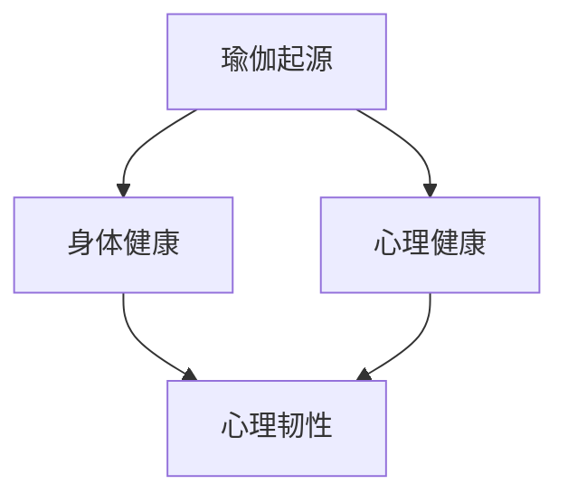

### 3.2.2 瑜伽的基本姿势与练习方法

以下是一些瑜伽的基本姿势和练习方法：

1. **山式**：站立，双脚并拢，双手合十，保持身体挺直。
2. **树式**：单脚站立，另一只脚的脚掌贴在墙上，保持身体平衡。
3. **骆驼式**：双脚分开，膝盖弯曲，背部向下弯曲，头部向后仰。
4. **莲花式**：坐在地上，双腿交叉，脚掌放在大腿上，双手合十。

```python
# 山式
def mountain_pose():
    """山式：站立，双脚并拢，双手合十，保持身体挺直。"""
    print("站立，双脚并拢，双手合十，身体保持挺直。")

# 树式
def tree_pose():
    """树式：单脚站立，另一只脚的脚掌贴在墙上，保持身体平衡。"""
    print("单脚站立，另一只脚的脚掌贴在墙上，保持身体平衡。")

# 骆驼式
def camel_pose():
    """骆驼式：双脚分开，膝盖弯曲，背部向下弯曲，头部向后仰。"""
    print("双脚分开，膝盖弯曲，背部向下弯曲，头部向后仰。")

# 莲花式
def lotus_pose():
    """莲花式：坐在地上，双腿交叉，脚掌放在大腿上，双手合十。"""
    print("坐在地上，双腿交叉，脚掌放在大腿上，双手合十。")
```

#### 核心算法原理讲解

瑜伽的基本姿势和练习方法涉及到身体的力量、平衡和柔韧性。通过这些姿势和练习，我们能够增强体质、提高专注力和提升心理韧性。

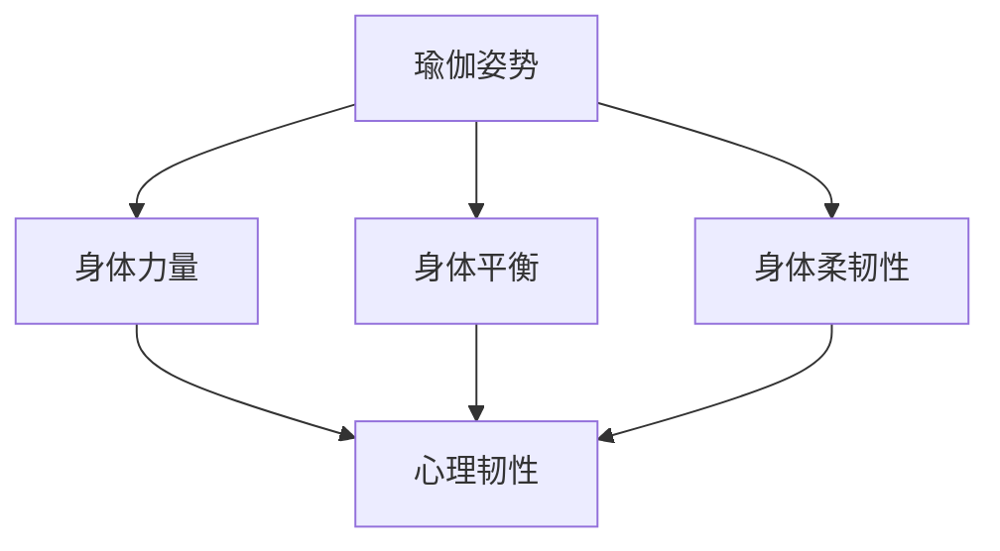

### 3.2.3 呼吸练习的原理与技巧

呼吸练习在瑜伽中起着重要的作用。它不仅有助于提升身体机能，还能调节情绪、缓解压力。

```python
# 呼吸练习的原理
def breathing_principles():
    """呼吸练习的原理是通过调节呼吸来提升身体机能和调节情绪。"""
    print("呼吸练习有助于提高氧气摄入、降低压力和提升整体身心健康。")

# 呼吸练习的技巧
def breathing_skills():
    """呼吸练习的技巧包括深呼吸、腹式呼吸和逆呼吸。"""
    print("深呼吸：缓慢而深长的呼吸；腹式呼吸：专注于腹部起伏；逆呼吸：通过鼻腔快速呼吸。")
```

#### 核心算法原理讲解

呼吸练习的原理和技巧涉及到呼吸频率、深度和方式。通过调整呼吸，我们能够改善身体的氧气供应、降低压力和提升心理健康。

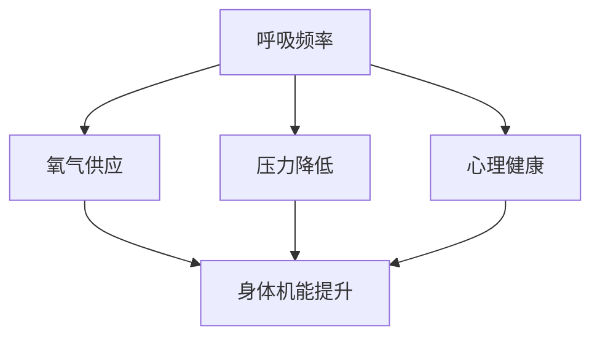

### 3.2.4 实践示例

以下是一个简单的瑜伽和呼吸练习的实践示例：

```python
# 瑜伽与呼吸练习实践
def yoga_breathing_practice():
    """进行一个简单的瑜伽和呼吸练习。"""
    print("开始瑜伽与呼吸练习...")
    mountain_pose()
    tree_pose()
    camel_pose()
    lotus_pose()
    breathing_principles()
    deep_breathing()
    diaphragmatic_breathing()
    nasal_breathing()
    print("瑜伽与呼吸练习结束。")

# 调用瑜伽与呼吸练习函数
yoga_breathing_practice()
```

### 3.3 写作与自我探索

#### 3.3.1 写作的益处

写作是一种有效的自我探索工具。它有助于我们表达内心感受、反思生活经历，并提升自我认知。以下是一些写作的益处：

1. **情绪释放**：通过写作，我们能够将内心的情感转化为文字，从而释放压力。
2. **自我反思**：写作让我们有机会深入思考自己的生活、价值观和目标。
3. **提高认知能力**：写作有助于提升我们的观察力、思维能力和表达能力。

```python
# 写作的益处
def benefits_of_writing():
    """写作的益处包括情绪释放、自我反思和提高认知能力。"""
    print("情绪释放：通过写作，我们能够将内心的情感转化为文字，从而释放压力；自我反思：写作让我们有机会深入思考自己的生活、价值观和目标；提高认知能力：写作有助于提升我们的观察力、思维能力和表达能力。")
```

#### 核心算法原理讲解

写作的益处反映了心理和认知科学中的几个关键概念：

1. **情绪表达**：情绪表达是通过文字将情感表达出来，从而缓解负面情绪。
2. **自我反思**：自我反思是通过思考自己的行为和经历，从而提升自我认知和自我理解。
3. **认知提升**：认知提升是通过写作过程，我们不断思考和表达，从而提高思维和语言能力。

```mermaid
graph TD
A[情绪表达] --> B[压力缓解]
A --> C[自我反思]
A --> D[认知提升]
B --> E[心理健康]
C --> E
D --> E
```

### 3.3.2 写作的方法与技巧

以下是一些写作的方法和技巧：

1. **自由写作**：不受限制地写下自己的想法和感受，有助于情绪释放和自我探索。
2. **主题写作**：围绕一个特定主题进行写作，有助于提高专注力和深度。
3. **日记写作**：定期记录自己的生活、感受和思考，有助于自我反思和成长。

```python
# 自由写作
def free_writing():
    """自由写作：不受限制地写下自己的想法和感受，有助于情绪释放和自我探索。"""
    print("写下你的想法和感受，不要担心语法和逻辑。")

# 主题写作
def thematic_writing():
    """主题写作：围绕一个特定主题进行写作，有助于提高专注力和深度。"""
    print("选择一个主题，深入思考和表达。")

# 日记写作
def journal_writing():
    """日记写作：定期记录自己的生活、感受和思考，有助于自我反思和成长。"""
    print("每天记录你的生活经历和感受。")
```

#### 核心算法原理讲解

写作的方法和技巧涉及到情感表达、认知提升和自我反思。通过不同的写作方法，我们能够达到不同的目标，如情绪释放、专注提升和自我成长。

```mermaid
graph TD
A[自由写作] --> B[情感释放]
A --> C[认知提升]
A --> D[自我反思]
B --> E[心理健康]
C --> E
D --> E
```

### 3.3.3 通过写作进行自我探索

以下是一个通过写作进行自我探索的示例：

```python
# 自我探索写作
def self_exploration_writing():
    """通过写作进行自我探索。"""
    print("开始自我探索写作...")
    free_writing()
    thematic_writing()
    journal_writing()
    print("自我探索写作结束。")

# 调用自我探索写作函数
self_exploration_writing()
```

### 第四部分：心灵成长的具体实践

## 4.1 心灵成长过程中的挑战与应对

### 4.1.1 心灵成长中的常见挑战

在心灵成长的过程中，人们可能会面临以下常见挑战：

1. **焦虑和恐惧**：焦虑和恐惧常常阻碍我们深入探索内心世界。
2. **自我怀疑**：自我怀疑可能导致我们失去信心，影响心灵成长。
3. **情绪波动**：情绪波动可能会影响我们的情绪稳定，使我们难以持续地进行心灵成长。

```python
# 心灵成长中的常见挑战
def common_challenges():
    """心灵成长中的常见挑战包括焦虑和恐惧、自我怀疑和情绪波动。"""
    print("焦虑和恐惧：阻碍内心探索；自我怀疑：失去信心；情绪波动：影响情绪稳定。")
```

#### 核心概念与联系

心灵成长中的挑战与心理韧性、自我认知和情绪管理密切相关。通过了解和应对这些挑战，我们能够提升心理韧性，实现更深入的心灵成长。

```mermaid
graph TD
A[心理韧性] --> B[焦虑和恐惧]
A --> C[自我认知]
A --> D[情绪管理]
B --> E[心灵成长]
C --> E
D --> E
```

### 4.1.2 挑战的应对策略

以下是一些应对心灵成长过程中挑战的策略：

1. **正面思维**：通过正面思维来克服焦虑和恐惧。
2. **自我接纳**：通过自我接纳来减少自我怀疑。
3. **情绪调节**：通过情绪调节来控制情绪波动。

```python
# 应对策略
def challenge_strategies():
    """应对策略包括正面思维、自我接纳和情绪调节。"""
    print("正面思维：克服焦虑和恐惧；自我接纳：减少自我怀疑；情绪调节：控制情绪波动。")
```

#### 核心算法原理讲解

应对策略的算法原理涉及到认知行为疗法、自我接纳和情绪调节。通过这些策略，我们能够提升心理韧性，实现更有效的内心探索。

```mermaid
graph TD
A[认知行为疗法] --> B[焦虑和恐惧克服]
A --> C[自我接纳]
A --> D[情绪调节]
B --> E[心理韧性提升]
C --> E
D --> E
```

### 4.1.3 挑战下的心理调适

以下是一些挑战下的心理调适方法：

1. **深呼吸**：通过深呼吸来缓解焦虑和紧张。
2. **冥想**：通过冥想来提高专注力和心理韧性。
3. **倾诉**：通过倾诉来释放内心的压力和情绪。

```python
# 心理调适方法
def mental_adaptation():
    """心理调适方法包括深呼吸、冥想和倾诉。"""
    print("深呼吸：缓解焦虑和紧张；冥想：提高专注力和心理韧性；倾诉：释放压力和情绪。")
```

#### 核心算法原理讲解

心理调适方法的算法原理涉及到呼吸调节、意识和情感表达。通过这些方法，我们能够有效地调节心理状态，提升心理韧性。

```mermaid
graph TD
A[呼吸调节] --> B[焦虑缓解]
A --> C[意识提升]
A --> D[情感表达]
B --> E[心理韧性提升]
C --> E
D --> E
```

### 4.2 长期坚持与成果积累

### 4.2.1 长期坚持的意义

在心灵成长的过程中，长期坚持具有重要意义。它能够帮助我们建立稳定的心理状态、提升内在智慧和实现个人目标。

```python
# 长期坚持的意义
def significance_of_persistence():
    """长期坚持的意义在于建立稳定的心理状态、提升内在智慧和实现个人目标。"""
    print("建立稳定的心理状态：长期坚持有助于我们应对生活中的挑战；提升内在智慧：持续努力有助于提升内在认知；实现个人目标：长期坚持使我们更接近人生目标。")
```

#### 核心概念与联系

长期坚持与心理韧性、内在智慧和目标实现密切相关。通过长期坚持，我们能够不断提升自我，实现个人成长。

```mermaid
graph TD
A[心理韧性] --> B[稳定心理状态]
A --> C[内在智慧]
A --> D[目标实现]
B --> E[长期坚持]
C --> E
D --> E
```

### 4.2.2 坚持的方法与技巧

以下是一些坚持的方法与技巧：

1. **制定目标**：明确自己的目标，有助于保持动力和方向。
2. **制定计划**：制定具体的计划，有助于合理安排时间和资源。
3. **持续反馈**：通过反馈来评估自己的进步，有助于持续改进。

```python
# 坚持的方法与技巧
def methods_of_persistence():
    """坚持的方法与技巧包括制定目标、制定计划和持续反馈。"""
    print("制定目标：明确自己的目标，有助于保持动力和方向；制定计划：合理安排时间和资源；持续反馈：评估自己的进步，有助于持续改进。")
```

#### 核心算法原理讲解

坚持的方法与技巧涉及到目标设定、计划执行和反馈调节。通过这些方法，我们能够有效提升自我管理能力，实现长期坚持。

```mermaid
graph TD
A[目标设定] --> B[动力保持]
A --> C[计划执行]
A --> D[反馈调节]
B --> E[自我管理提升]
C --> E
D --> E
```

### 4.2.3 成果积累与自我反思

在心灵成长的过程中，成果积累和自我反思是不可或缺的。以下是一些相关的方法与技巧：

1. **记录进展**：通过记录自己的进展来评估成果。
2. **定期反思**：通过定期反思来总结经验，提升自我认知。
3. **设定新的目标**：通过成果积累和自我反思来设定新的目标，推动自我成长。

```python
# 成果积累与自我反思
def accumulation_and_reflection():
    """成果积累与自我反思的方法包括记录进展、定期反思和设定新的目标。"""
    print("记录进展：评估自己的成果；定期反思：总结经验，提升自我认知；设定新的目标：推动自我成长。")
```

#### 核心算法原理讲解

成果积累与自我反思的算法原理涉及到自我监控、反馈调节和目标调整。通过这些方法，我们能够不断提升自我，实现持续成长。

```mermaid
graph TD
A[自我监控] --> B[成果评估]
A --> C[反馈调节]
A --> D[目标调整]
B --> E[自我提升]
C --> E
D --> E
```

### 第五部分：心灵成长的社会意义

## 5.1 心灵成长对个人与社会的影响

### 5.1.1 心灵成长对个人的影响

心灵成长对个人的影响是多方面的，包括心理健康、人际关系、职业发展和生活质量。

#### 核心概念与联系

心理健康、人际关系、职业发展和生活质量是心灵成长对个人的四个主要影响方面。通过心灵成长，我们能够提升这些方面的能力，实现个人全面发展。

```mermaid
graph TD
A[心理健康] --> B[人际关系]
A --> C[职业发展]
A --> D[生活质量]
B --> E[心灵成长]
C --> E
D --> E
```

### 5.1.2 心灵成长对社会的意义

心灵成长不仅对个人有益，也对整个社会产生积极影响。它有助于提高社会凝聚力、促进社会和谐和推动社会进步。

#### 核心概念与联系

社会凝聚力、社会和谐和社会进步是心灵成长对社会的主要影响方面。通过心灵成长，我们能够提升社会的整体幸福感和发展水平。

```mermaid
graph TD
A[社会凝聚力] --> B[社会和谐]
A --> C[社会进步]
B --> D[心灵成长]
C --> D
```

### 5.1.3 心灵成长与和谐社会的构建

心灵成长与和谐社会的构建密切相关。通过心灵成长，我们能够培养积极的社会价值观，推动社会和谐发展。

```python
# 心灵成长与和谐社会
def harmony_of_society():
    """心灵成长与和谐社会的构建密切相关。通过心灵成长，我们能够培养积极的社会价值观，推动社会和谐发展。"""
    print("培养积极的社会价值观：通过心灵成长，我们能够培养尊重、合作和共荣的社会价值观；推动社会和谐发展：积极的社会价值观有助于构建和谐的社会环境。")
```

#### 核心算法原理讲解

心灵成长与和谐社会构建的算法原理涉及到价值观培养和社会影响。通过培养积极的社会价值观，我们能够推动社会和谐发展。

```mermaid
graph TD
A[价值观培养] --> B[社会影响]
A --> C[社会和谐]
B --> D[心灵成长]
C --> D
```

## 第六部分：心灵成长的社会实践

### 5.2.1 社会组织与心灵成长

社会组织在推动心灵成长方面发挥着重要作用。以下是一些社会组织在心灵成长方面的实践：

1. **心理咨询服务**：提供专业的心理咨询服务，帮助个体应对心理问题。
2. **心理健康教育**：开展心理健康教育，提高公众的心理健康素养。
3. **心灵成长工作坊**：组织心灵成长工作坊，帮助个体提升心理韧性。

```python
# 社会组织与心灵成长
def social_organizations_and_mindfulness():
    """社会组织在推动心灵成长方面的实践包括心理咨询服务、心理健康教育和心灵成长工作坊。"""
    print("心理咨询服务：提供专业的心理支持；心理健康教育：提高公众的心理健康素养；心灵成长工作坊：帮助个体提升心理韧性。")
```

#### 核心算法原理讲解

社会组织与心灵成长的算法原理涉及到心理支持、教育和实践。通过这些实践，社会组织能够有效推动心灵成长。

```mermaid
graph TD
A[心理支持] --> B[心理健康教育]
A --> C[心灵成长实践]
B --> D[社会组织作用]
C --> D
```

### 5.2.2 社区活动与心灵成长

社区活动在推动心灵成长方面也发挥着重要作用。以下是一些社区活动在心灵成长方面的实践：

1. **冥想小组**：组织冥想小组，帮助居民掌握冥想技巧，提升心理素质。
2. **心理健康讲座**：举办心理健康讲座，提高居民的心理健康意识。
3. **心理健康日**：设立心理健康日，鼓励居民关注心理健康，分享心理健康经验。

```python
# 社区活动与心灵成长
def community_activities_and_mindfulness():
    """社区活动在推动心灵成长方面的实践包括冥想小组、心理健康讲座和心理健康日。"""
    print("冥想小组：帮助居民掌握冥想技巧，提升心理素质；心理健康讲座：提高居民的心理健康意识；心理健康日：鼓励居民关注心理健康，分享心理健康经验。")
```

#### 核心算法原理讲解

社区活动与心灵成长的算法原理涉及到心理支持、教育和实践。通过这些活动，社区能够有效推动心灵成长。

```mermaid
graph TD
A[心理支持] --> B[心理健康教育]
A --> C[心灵成长实践]
B --> D[社区作用]
C --> D
```

### 5.2.3 心灵成长的社会影响评估

评估心灵成长的社会影响是一个复杂的过程。以下是一些评估心灵成长社会影响的方法：

1. **问卷调查**：通过问卷调查来了解居民的心理健康状况和心灵成长满意度。
2. **统计分析**：通过统计分析来评估心灵成长对个体和社区的整体影响。
3. **案例研究**：通过案例研究来分析具体的心灵成长实践对社会的影响。

```python
# 心灵成长的社会影响评估
def impact_evaluation():
    """评估心灵成长的社会影响的方法包括问卷调查、统计分析和案例研究。"""
    print("问卷调查：了解居民的心理健康状况和心灵成长满意度；统计分析：评估心灵成长对个体和社区的整体影响；案例研究：分析具体的心灵成长实践对社会的影响。")
```

#### 核心算法原理讲解

心灵成长的社会影响评估涉及到数据收集、分析和解释。通过这些方法，我们能够全面评估心灵成长的社会影响。

```mermaid
graph TD
A[数据收集] --> B[统计分析]
A --> C[案例研究]
B --> D[影响评估]
C --> D
```

### 结论

心灵成长是一个复杂而长期的过程，它不仅涉及个人的内心世界，还与社会的整体发展密切相关。通过自我认知、情绪管理、内在智慧和积极心态的培养，我们能够提升个人幸福感，实现人生目标。同时，社会组织和社区活动的参与也推动了心灵成长在社会层面的实践。通过评估心灵成长的社会影响，我们能够更好地理解其价值和意义，为未来的心灵成长实践提供指导。

```python
# 结论
def conclusion():
    """心灵成长的重要性体现在提升个人幸福感和推动社会和谐发展的过程中。通过自我认知、情绪管理、内在智慧和积极心态的培养，我们能够实现个人成长；社会组织和社区活动的参与推动了心灵成长在社会层面的实践。通过评估心灵成长的社会影响，我们能够更好地理解其价值和意义，为未来的心灵成长实践提供指导。"""
    print("心灵成长的重要性体现在提升个人幸福感和推动社会和谐发展的过程中。通过自我认知、情绪管理、内在智慧和积极心态的培养，我们能够实现个人成长；社会组织和社区活动的参与推动了心灵成长在社会层面的实践。通过评估心灵成长的社会影响，我们能够更好地理解其价值和意义，为未来的心灵成长实践提供指导。")
```

### 附录

#### 6.1 心灵成长相关资源推荐

以下是一些心灵成长相关的资源推荐，供读者参考：

1. **书籍**：
   - 《禅与生活艺术》（《The Art of Living》）
   - 《积极心理学》（《Positive Psychology》）
   - 《当下的力量》（《The Power of Now》）

2. **音频课程**：
   - 《冥想与心灵成长》（《Mindfulness and Mindful Living》）
   - 《情绪智慧》（《Emotional Intelligence》）
   - 《自我认知与自我提升》（《Self-awareness and Self-improvement》）

3. **网络资源**：
   - 《哈佛幸福课》（Harvard University's幸福课）
   - 《心理学导论》（Introduction to Psychology）
   - 《冥想社区》（Meditation Community）

```python
# 资源推荐
def resource_recommendations():
    """心灵成长相关资源推荐包括书籍、音频课程和网络资源。"""
    print("""
书籍：
- 《禅与生活艺术》（《The Art of Living》）
- 《积极心理学》（《Positive Psychology》）
- 《当下的力量》（《The Power of Now》）

音频课程：
- 《冥想与心灵成长》（《Mindfulness and Mindful Living》）
- 《情绪智慧》（《Emotional Intelligence》）
- 《自我认知与自我提升》（《Self-awareness and Self-improvement》）

网络资源：
- 《哈佛幸福课》（Harvard University's幸福课）
- 《心理学导论》（Introduction to Psychology）
- 《冥想社区》（Meditation Community）
""")
```

### 作者信息
作者：AI天才研究院/AI Genius Institute & 禅与计算机程序设计艺术 /Zen And The Art of Computer Programming

