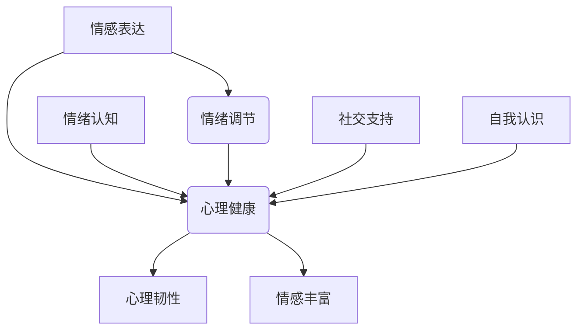

                 

# 为生命增添色彩：构建情感丰富的人生

> 关键词：情感丰富、心理健康、人际关系、自我成长、职业生涯、情感实践

> 摘要：本文从多个角度探讨了如何构建情感丰富的人生。文章首先解释了情感的本质与作用，接着分析了情感在人际关系和个人成长中的重要性，最后提出了实现情感丰富的实践方法。通过深入了解情感的力量，读者将能够更好地理解自己和他人的情感需求，从而在日常生活中培养情感丰富性，提升生活质量。

# 目录大纲

## 第一部分：情感的力量

### 第1章：情感的本质与作用

### 第2章：情感的表达与理解

### 第3章：情感的培养与提升

## 第二部分：情感与人际关系

### 第4章：情感在人际关系中的角色

### 第5章：建立积极的人际关系

### 第6章：情感与家庭生活

## 第三部分：情感与个人成长

### 第7章：情感与自我认识

### 第8章：情感与职业生涯

### 第9章：情感与心理健康

## 第四部分：情感丰富的实践

### 第10章：情感丰富的日常生活

### 第11章：情感实践与自我提升

### 第12章：情感丰富的社会影响

## 结论

## 附录

# 《为生命增添色彩：构建情感丰富的人生》

## 第一部分：情感的力量

### 第1章：情感的本质与作用

情感，作为一种复杂且多维的心理现象，贯穿于人类的日常生活。它不仅影响个体的心理状态，还深刻地影响着个体的人际关系、决策和行为。在这一章中，我们将探讨情感的基本概念与类型，分析情感在人类生活中的重要性，并探讨情感与心理健康的关系。

#### 情感的基本概念与类型

情感可以定义为一种主观体验，通常伴随着情绪反应和生理变化。情感的类型多种多样，包括但不限于愉悦、愤怒、悲伤、恐惧、厌恶和惊讶。每种情感都有其特定的生物学基础和神经机制。例如，愉悦感通常与多巴胺的释放有关，而愤怒则可能与肾上腺素的增加有关。

在心理学领域，情感通常被分为两种基本类型：基本情感和复合情感。基本情感是自然界中最普遍和最基础的情感，如快乐、悲伤、愤怒等。复合情感则是基本情感的组合，如爱、羞愧、嫉妒等。

#### 情感在人类生活中的重要性

情感在人类生活中扮演着至关重要的角色。首先，情感是我们与外界环境互动的重要方式。通过情感，我们能够感知和理解外部世界的刺激，从而做出相应的反应。例如，当我们感到快乐时，我们可能会更愿意与他人分享，从而建立亲密的关系。

其次，情感影响着我们的决策和行为。研究表明，情感可以显著影响我们的判断和选择。例如，当我们感到愤怒时，我们可能会做出冲动和冲动的决策，而不是经过深思熟虑的决策。

最后，情感对心理健康具有深远的影响。积极的情感如快乐和满足感能够提升个体的心理幸福感，而消极的情感如悲伤和愤怒则可能导致心理压力和情绪障碍。因此，理解和调节情感对于维护心理健康至关重要。

#### 情感与心理健康的关系

情感与心理健康密切相关。积极情感如快乐和满足感有助于提高个体的心理韧性，增强抗压能力，降低患心理疾病的风险。相反，消极情感如悲伤和愤怒则可能导致焦虑、抑郁等心理问题。

情感调节是维护心理健康的重要环节。情感调节是指个体通过认知和行为策略来管理自己的情绪体验。有效的情感调节策略包括情绪表达、情绪认知、情绪重构等。

总之，情感在人类生活中具有不可替代的重要性。通过理解情感的本质与作用，我们能够更好地理解自己和他人的情感需求，从而在日常生活中培养情感丰富性，提升生活质量。

### 第2章：情感的表达与理解

情感的表达与理解是人际交往中至关重要的一环。有效且恰当的情感表达能够增进人际关系的深度和广度，而准确的情感理解则有助于避免误解和冲突。在这一章中，我们将探讨情感表达的语言与非语言方式，分析情感理解的障碍与克服方法，并提供情感沟通的技巧。

#### 情感表达的语言与非语言方式

情感表达可以通过语言和非语言手段实现。语言表达包括口头和书面语言，如直接说出自己的感受、使用情感词汇等。非语言表达则包括面部表情、身体语言、语调等。

- **面部表情**：面部表情是人类情感表达最直接和普遍的方式。微笑、皱眉、瞪眼等面部表情可以清晰地传达出个体的情感状态。
- **身体语言**：身体语言包括姿势、手势、眼神交流等。例如，握手时的力度、点头、拥抱等都是情感表达的重要方式。
- **语调**：语调是指说话的音调、节奏和音量。通过语调的变化，可以传达出情感的不同层次，如兴奋、愤怒、悲伤等。

#### 情感理解的障碍与克服方法

情感理解并非总是一帆风顺的。个体之间的情感表达方式可能存在差异，加上文化背景和个人经验的影响，可能导致情感理解的障碍。以下是一些常见的障碍及其克服方法：

- **文化差异**：不同文化对于情感的表达和理解可能有不同的标准和习惯。例如，在一些文化中，直接表达情感被视为不礼貌的，而在另一些文化中，情感表达则更加开放和直接。为了克服文化差异带来的理解障碍，我们需要了解和尊重不同文化的情感表达方式。
- **个人经验**：个人的生活经历和情感经验也会影响情感理解。有些人可能更擅长表达和理解某些类型的情感，而另一些人可能在这方面存在困难。通过自我反思和情感教育，我们可以提高对情感的理解能力。
- **情绪盲点**：情绪盲点是指个体对自己情感状态的缺乏认识。例如，有些人可能很难意识到自己的愤怒或悲伤情绪。通过自我观察和情感觉察练习，我们可以减少情绪盲点，提高情感理解。

#### 情感沟通的技巧

为了实现有效且恰当的情感表达和理解，以下是一些实用的情感沟通技巧：

- **倾听**：倾听是情感沟通的重要部分。通过倾听他人的情感表达，我们可以更好地理解他们的情感状态。倾听不仅仅是听到对方说什么，更重要的是理解对方的情感需求。
- **明确表达**：明确表达自己的情感需求可以帮助避免误解。例如，当感到生气时，可以说：“我感到生气，因为...”，而不是简单地说：“你让我生气了。”
- **非暴力沟通**：非暴力沟通是一种以尊重和理解为基础的沟通方式。通过使用非暴力沟通技巧，如观察、感受、需求和请求，我们可以更有效地表达情感，并促进积极的人际关系。
- **情感觉察**：情感觉察是指对自己的情感状态保持敏感和认识。通过定期进行情感觉察练习，如冥想、日记记录等，我们可以更好地理解自己的情感，并提高情感表达能力。

总之，情感的表达与理解是构建和谐人际关系的关键。通过掌握情感表达的语言与非语言方式，克服情感理解的障碍，并运用情感沟通的技巧，我们可以在日常生活中更有效地处理情感问题，提升人际关系的质量。

### 第3章：情感的培养与提升

情感的培养与提升是每个人成长过程中不可或缺的一部分。通过培养积极情感和处理消极情感，我们可以提升情感丰富性，从而在生活和工作中更加自如和满足。在这一章中，我们将探讨如何培养积极情感、如何处理消极情感，以及提升情感丰富性的方法。

#### 如何培养积极情感

积极情感如快乐、满足和爱能显著提升生活质量。以下是一些培养积极情感的方法：

- **感恩练习**：每天花时间思考并记录自己感激的事情。感恩练习能够增强积极的情感体验，并提高对生活中美好事物的关注。
- **正念练习**：通过正念冥想，我们可以更好地觉察当前的情感状态，并培养对情感的接受和欣赏。正念练习有助于减少焦虑和抑郁，提升心理韧性。
- **积极自我对话**：积极自我对话是指用积极和鼓励的语言与自我交流。通过培养积极的自我对话，我们可以提升自我效能感，增强应对挑战的能力。
- **社交支持**：与家人、朋友和同事建立积极的关系，能够提供情感支持，增强积极情感体验。分享快乐和成就，寻求支持和帮助，都是培养积极情感的有效途径。

#### 如何处理消极情感

消极情感如悲伤、愤怒和恐惧是生活中难以避免的部分。以下是一些处理消极情感的方法：

- **情绪表达**：情绪表达是指通过适当的方式表达自己的情感。情绪压抑可能导致心理问题，因此学会表达情感是非常重要的。可以通过写日记、绘画、运动等方式表达情感。
- **认知重构**：认知重构是指通过改变负面思维模式来处理消极情感。例如，将“我不能做到”改变为“我可以尝试做到”，可以帮助减少焦虑和恐惧。
- **情感调节技巧**：情感调节技巧包括深呼吸、放松训练、正念冥想等。这些技巧可以帮助我们在面对消极情感时保持冷静和集中注意力。
- **寻求专业帮助**：当消极情感严重影响到日常生活时，寻求心理健康专业人士的帮助是非常重要的。心理咨询师可以提供专业的指导和支持，帮助应对情感问题。

#### 提升情感丰富性的方法

提升情感丰富性需要我们在日常生活中有意识地培养和关注情感。以下是一些具体的方法：

- **情感教育**：通过阅读书籍、参加工作坊、参加讲座等方式，学习情感知识，提高对情感的理解和管理能力。
- **情感实践**：在日常生活中进行情感实践，如进行情感反思、情感分享等。通过实践，我们可以更好地了解自己的情感，提升情感表达能力。
- **情感体验**：积极参与各种情感体验，如旅行、参加社交活动、尝试新事物等。这些体验能够丰富我们的情感世界，提升情感的丰富性。
- **情感联结**：与他人建立深层次的情感联结，如与家人、朋友、同事建立信任和亲密关系。情感联结能够增强我们的情感支持网络，提升情感丰富性。

总之，情感的培养与提升是一个持续的过程。通过培养积极情感、处理消极情感，并运用提升情感丰富性的方法，我们可以在生活中更加积极地应对挑战，提升心理幸福感，实现情感丰富的人生。

## 第二部分：情感与人际关系

### 第4章：情感在人际关系中的角色

情感在人际关系中扮演着至关重要的角色。它是建立和维护人际关系的基石，能够促进相互理解、信任和尊重。在这一章中，我们将探讨情感在亲密关系、友谊和工作关系中的重要性，并分析情感如何影响这些关系的质量。

#### 情感与亲密关系

亲密关系是人类情感需求的重要来源，如恋爱关系、家庭关系等。情感在亲密关系中起到了以下作用：

- **信任**：信任是亲密关系中的关键要素。通过情感表达和互动，双方能够建立起信任感，从而在关系中感到安全。
- **支持**：亲密关系中的情感支持对双方都是至关重要的。在困难时期，情感支持能够帮助对方度过难关，增强关系的稳定性。
- **情感共振**：情感共振是指双方在情感上的共鸣和相互理解。通过情感共振，双方能够更好地满足彼此的情感需求，提升关系的质量。

#### 情感与友谊

友谊是人际关系中另一种重要的情感联系，它能够带来快乐和支持。情感在友谊中的作用包括：

- **共鸣**：情感共鸣是指朋友之间在情感上的共鸣和理解。通过共鸣，朋友能够更好地理解彼此的需求，从而提供支持和帮助。
- **支持**：友谊中的情感支持能够帮助我们在面对挑战和困难时感到更有力量。朋友的支持可以增强我们的心理韧性，提升生活质量。
- **陪伴**：情感陪伴是友谊中的重要部分。通过共同的经历和分享，朋友之间的情感纽带得以加强，关系更加紧密。

#### 情感与工作关系

工作关系中的情感同样至关重要，它影响着工作效率、团队合作和职业发展。情感在工作关系中的作用包括：

- **团队协作**：情感协作能够促进团队成员之间的沟通和合作。通过情感互动，团队成员能够更好地理解彼此的需求，提高工作效率。
- **职业满足感**：工作关系中的情感满足感能够提升员工的职业幸福感和工作满意度。积极的情感体验能够增强员工对工作的投入和动力。
- **领导力**：情感领导力是指领导者通过情感智慧来影响和激励团队成员。具备情感领导力的领导者能够建立积极的工作环境，提升团队的整体表现。

#### 情感对关系质量的影响

情感在所有类型的人际关系中都有着深远的影响。以下是一些关键点：

- **沟通**：情感沟通是建立和维护人际关系的关键。通过情感表达和理解，个体能够更好地沟通彼此的需求和期望，减少冲突和误解。
- **信任与尊重**：信任和尊重是高质量关系的基础。情感互动能够增强信任和尊重，促进关系的长期稳定。
- **支持与理解**：情感支持和理解能够提升关系的质量。在困难时期，情感支持能够提供力量，增强关系的稳定性。

总之，情感在人际关系中扮演着至关重要的角色。通过理解和运用情感的力量，我们能够建立和维护高质量的人际关系，提升生活的幸福感和满足感。

### 第5章：建立积极的人际关系

建立积极的人际关系是提升生活质量的重要途径。一个健康、积极的人际关系网络不仅能提供情感支持，还能促进个人成长和职业发展。在这一章中，我们将探讨建立积极人际关系的技巧，包括有效沟通的技巧、解决冲突的方法，以及如何营造和谐的人际关系环境。

#### 有效沟通的技巧

有效沟通是建立积极人际关系的基础。以下是一些提升沟通效果的技巧：

- **倾听**：倾听是有效沟通的关键。在沟通中，不仅要听到对方说什么，更要理解对方的意思和情感。通过积极倾听，我们可以更好地理解他人的需求，从而更好地回应。
- **清晰表达**：清晰表达自己的观点和感受是有效沟通的重要部分。在表达时，要尽量使用简单、明确的语言，避免使用模糊或模棱两可的表述，以减少误解。
- **非语言沟通**：非语言沟通，如面部表情、身体语言和语调，同样在沟通中起到重要作用。通过恰当的非语言表达，我们可以增强信息的传达效果。
- **开放性沟通**：开放性沟通是指在与他人交流时，保持开放的心态，接受不同的观点和意见。通过开放性沟通，我们可以建立信任，促进良好的关系。

#### 解决冲突的方法

冲突是人际关系中难以避免的一部分。以下是一些解决冲突的方法：

- **冷静处理**：在冲突发生时，保持冷静和理智是非常重要的。通过冷静处理，我们可以避免情绪化的决策，从而更有效地解决冲突。
- **积极倾听**：积极倾听是解决冲突的重要技巧。通过倾听对方的观点和感受，我们可以更好地理解冲突的根本原因，并找到解决问题的方法。
- **共同寻找解决方案**：解决冲突的最佳方法是共同寻找解决方案。通过合作和协商，我们可以找到双方都能接受的解决方案，从而维护关系的稳定性。
- **寻求第三方帮助**：在某些情况下，寻求第三方帮助，如心理咨询师或调解员，可以帮助解决复杂的冲突，并提供中立的意见和建议。

#### 营造和谐的人际关系环境

营造和谐的人际关系环境是建立积极人际关系的重要环节。以下是一些建议：

- **建立信任**：信任是和谐关系的基础。通过诚实、尊重和可靠的行为，我们可以建立和维护信任。
- **尊重差异**：每个人都有自己的观点和需求。尊重差异意味着接受他人与自己的不同，并在互动中保持开放和包容的态度。
- **积极反馈**：通过给予积极的反馈和鼓励，我们可以增强他人的自信和积极性，从而促进和谐的人际关系。
- **共享经历**：共享经历是增强人际关系的重要方式。通过共同的经历和活动，我们可以加深彼此的了解和情感联结。

总之，建立积极的人际关系需要有效的沟通技巧、解决冲突的能力，以及营造和谐的环境。通过这些方法，我们可以在日常生活中建立和维护高质量的人际关系，提升生活的幸福感和满足感。

### 第6章：情感与家庭生活

家庭生活是人类生活中不可或缺的一部分，它是情感的港湾，也是个体情感发展的基础。在这一章中，我们将探讨家庭情感的重要性，分析情感教育在家庭中的实践，以及如何在家庭中提供情感支持和互助。

#### 家庭情感的重要性

家庭情感是家庭成员之间情感交流和支持的核心。它对个体的情感发展、心理健康和幸福感具有深远的影响。以下是家庭情感的重要性：

- **情感支持**：家庭情感支持是应对生活挑战和压力的重要资源。在家庭中，成员之间的情感支持能够增强个体的心理韧性，帮助他们更好地应对困难。
- **情感认同**：家庭情感认同是成员在情感上互相理解和接纳的基础。通过情感认同，家庭成员能够建立起紧密的情感纽带，增强家庭的凝聚力。
- **情感发展**：家庭情感教育对个体的情感发展具有深远的影响。通过在家庭中培养情感表达、理解和调节的能力，个体能够更好地应对生活中的情感挑战。

#### 情感教育在家庭中的实践

情感教育在家庭中的实践是培养家庭成员情感素质的重要途径。以下是一些具体的实践方法：

- **情感交流**：在家庭中建立开放和积极的情感交流氛围，鼓励成员分享自己的情感体验和感受。通过情感交流，家庭成员能够更好地理解彼此的需求，增强情感联结。
- **情感引导**：家长可以通过角色模型和指导，帮助子女理解和管理情感。例如，在子女感到愤怒或悲伤时，家长可以教导他们适当的表达方式和管理策略。
- **情感反思**：定期进行家庭情感反思，回顾和总结家庭成员的情感互动和经历。通过情感反思，家庭成员可以共同探讨情感问题，提升情感智慧。
- **情感培养**：通过阅读、观看电影、参与情感工作坊等方式，家庭成员可以共同培养情感意识和情感表达能力。

#### 在家庭中提供情感支持和互助

在家庭中提供情感支持和互助是维护家庭和谐和幸福的重要方式。以下是一些具体的方法：

- **倾听与理解**：家庭成员在遇到困难时，需要倾听和理解他们的情感需求。通过倾听，我们可以表达对他们的支持和关心。
- **情感表达**：在家庭中鼓励情感表达，使成员能够自由地表达自己的情感。情感表达不仅有助于缓解压力，还能增强家庭成员之间的情感联结。
- **共同解决问题**：当家庭中遇到问题时，共同寻找解决方案，而不是指责或逃避。通过共同解决问题，家庭成员能够增强合作和信任。
- **情感支持网络**：建立一个支持网络，如亲戚、朋友和社区，以提供额外的情感支持和资源。这些网络可以在家庭遇到困难时提供额外的帮助。

总之，家庭情感对个体的情感发展、心理健康和家庭和谐具有深远的影响。通过在家庭中实践情感教育，提供情感支持和互助，我们能够为家庭成员创造一个充满爱和理解的温馨环境，从而提升整个家庭的生活质量。

### 第7章：情感与自我认识

情感与自我认识紧密相连，个体的情感体验不仅反映了他人的态度和需求，也揭示了自我内心的真实状态。在这一章中，我们将探讨情感自我认知的重要性，分析情感自我探索的方法，并讨论如何增强自我情感调节能力。

#### 情感自我认知的重要性

情感自我认知是指个体对自己情感状态的觉察和理解。它对个人的心理健康和自我发展具有深远的影响。以下是情感自我认知的重要性：

- **心理健康**：情感自我认知有助于个体更好地管理自己的情绪，减少情绪困扰，提升心理幸福感。通过理解自己的情感，个体能够更好地应对生活中的挑战和压力。
- **自我发展**：情感自我认知是自我成长和发展的基础。它使个体能够深入探索自己的内心世界，发现自我潜力和优势，从而实现个人目标和价值观。
- **人际关系**：情感自我认知有助于个体在人际关系中更好地理解自己和他人的情感需求，增强沟通和合作能力，建立和谐的人际关系。

#### 情感自我探索的方法

情感自我探索是一个持续的过程，需要个体投入时间和精力。以下是一些情感自我探索的方法：

- **日记记录**：通过写日记，个体可以记录自己的情感体验，反思情感背后的原因和影响。日记记录有助于个体深入理解自己的情感，并找到情感调节的方法。
- **情感分享**：与信任的朋友或家人分享情感体验，可以获得外部的反馈和观点，帮助个体更好地理解自己的情感。情感分享还能够增强情感联结，提升心理韧性。
- **正念冥想**：通过正念冥想，个体可以培养对当前情感状态的觉察和接受，减少情绪困扰。正念冥想有助于提高情感自我认知，增强情感调节能力。
- **情感工作坊**：参加情感工作坊，通过互动和练习，个体可以学习情感自我探索的工具和技巧，提升情感智慧。

#### 如何增强自我情感调节能力

增强自我情感调节能力有助于个体更好地管理情感，提升生活质量。以下是一些具体的方法：

- **认知重构**：通过认知重构，个体可以改变负面思维模式，从而减少情绪困扰。例如，将“我不行”改变为“我可以尝试”，可以帮助个体在面临挑战时保持积极的心态。
- **情绪调节技巧**：通过学习情绪调节技巧，如深呼吸、放松训练、正念冥想等，个体可以在面对情绪困扰时保持冷静和集中注意力。这些技巧有助于减少情绪波动，提升情感稳定性。
- **情感表达**：学会适当表达自己的情感，不仅有助于缓解情绪压力，还能增强情感自我认知。通过表达情感，个体能够更好地理解自己的需求和期望，从而更好地调节情感。
- **寻求专业帮助**：当个体在情感调节方面遇到困难时，寻求心理健康专业人士的帮助是非常重要的。专业人士可以提供个性化的指导和支持，帮助个体克服情感问题。

总之，情感与自我认识是个人成长和发展的关键。通过情感自我认知，个体能够更好地理解自己的内心世界，提升自我情感调节能力，从而实现更高的心理健康和生活质量。

### 第8章：情感与职业生涯

情感在职业生涯中扮演着重要的角色，它不仅影响着个体的工作效率和职业满意度，还与职业发展密切相关。在这一章中，我们将探讨职业生涯中的情感挑战，分析职场情感管理技巧，并讨论情感智慧在职业发展中的作用。

#### 职业生涯中的情感挑战

职业生涯中常常会遇到各种情感挑战，这些挑战不仅影响工作效率，还可能对心理健康产生负面影响。以下是一些常见的情感挑战：

- **压力**：工作中的压力是常见的情感挑战。无论是来自工作任务的繁重，还是与同事或上级的关系紧张，压力都可能导致焦虑和沮丧。
- **工作与生活的平衡**：在追求职业成功的同时，许多人发现自己难以平衡工作与生活。工作压力和私人生活的冲突可能导致情感疲惫和不满。
- **职业发展**：在职业发展的过程中，个体可能会面临不确定性和竞争压力。这些情感挑战可能导致焦虑和自我怀疑，影响职业决策。

#### 职场情感管理技巧

有效的情感管理技巧有助于个体应对职业生涯中的情感挑战，提高工作效率和职业满意度。以下是一些实用的职场情感管理技巧：

- **情绪觉察**：情绪觉察是情感管理的第一步。通过培养情绪觉察，个体可以更好地了解自己的情感状态，从而及时调整自己的情绪和行为。
- **情绪调节**：情绪调节技巧如深呼吸、放松训练和正念冥想可以帮助个体在面对压力和情绪困扰时保持冷静。这些技巧有助于减少负面情绪，提升情绪稳定性。
- **有效沟通**：有效沟通是职场中重要的技能。通过倾听、表达和反馈，个体可以更好地理解他人的情感需求，从而改善人际关系，减少冲突。
- **时间管理**：合理的时间管理有助于减轻工作压力，提高工作效率。通过合理安排工作和休息时间，个体可以更好地平衡工作与生活，减少情感疲惫。

#### 情感智慧在职业发展中的作用

情感智慧，也称为情商（Emotional Intelligence，简称EQ），是个体识别、理解和管理自己情感和他人情感的能力。情感智慧在职业发展中起着关键作用：

- **领导力**：具备高情感智慧的人能够更好地理解和管理团队的情感，从而提升领导力。情感智慧的领导者能够建立信任、激发团队动力，推动团队达成共同目标。
- **团队合作**：在团队合作中，情感智慧有助于建立良好的团队关系，提高合作效率。通过理解和尊重团队成员的情感需求，个体可以促进团队合作，共同实现目标。
- **决策**：情感智慧在决策过程中起到重要作用。具备高情感智慧的人能够更好地理解自己的情感，避免因情绪波动而做出冲动的决策。通过情感智慧，个体可以做出更明智、更全面的决策。

总之，情感在职业生涯中具有重要的影响。通过应对情感挑战、掌握情感管理技巧，以及提升情感智慧，个体可以在职业发展中取得更好的成就，实现更高的职业满意度。

### 第9章：情感与心理健康

情感与心理健康紧密相连，情感体验不仅影响个体的心理状态，还与心理健康问题密切相关。在这一章中，我们将探讨情感与心理健康的关系，分析情感问题的影响与干预方法，以及如何增强心理弹性。

#### 情感与心理健康的关系

情感在心理健康中起着至关重要的角色。以下是情感与心理健康之间的一些关键联系：

- **情感表达**：情感表达是心理健康的重要部分。通过适当表达情感，个体可以缓解心理压力，提升情感调节能力。情感压抑可能导致焦虑、抑郁等心理问题。
- **情感理解**：情感理解能力有助于个体更好地应对生活中的挑战。具备高情感理解能力的人能够更好地理解自己和他人的情感需求，从而建立和谐的人际关系。
- **情感调节**：情感调节能力是指个体管理自己情感的能力。高情感调节能力有助于个体在面对压力和困难时保持心理平衡，降低心理问题的发生风险。

#### 情感问题的影响与干预方法

情感问题可能会对心理健康产生负面影响，如焦虑、抑郁等。以下是一些常见的情感问题及其干预方法：

- **焦虑**：焦虑是一种常见的情感问题，表现为过度担忧和紧张。干预方法包括认知行为疗法（CBT）和放松训练。通过CBT，个体可以学习如何改变负面思维模式，减少焦虑。放松训练如深呼吸、正念冥想等可以帮助缓解焦虑症状。
- **抑郁**：抑郁是一种严重的情感问题，表现为持续的悲伤、失去兴趣和动力。干预方法包括药物治疗、心理咨询和认知行为疗法。药物治疗可以缓解抑郁症状，心理咨询可以帮助个体探索抑郁的原因，并提供情感支持和指导。
- **情感压抑**：情感压抑可能导致心理压力积累，影响心理健康。干预方法包括情感表达和情绪调节技巧。通过写日记、艺术创作、运动等方式，个体可以表达自己的情感，减少压抑感。

#### 增强心理弹性

心理弹性是指个体在面临压力和挑战时保持适应和恢复能力的能力。以下是一些增强心理弹性的方法：

- **积极心态**：培养积极心态有助于个体更好地应对生活中的挑战。通过积极思考，个体可以减少消极情绪，增强心理韧性。
- **情感调节**：通过学习和运用情感调节技巧，个体可以更好地管理自己的情感，减少情绪困扰。情感调节技巧包括深呼吸、放松训练、正念冥想等。
- **社会支持**：建立和维持良好的社会支持网络是增强心理弹性的重要因素。通过与他人分享情感和寻求支持，个体可以减轻心理压力，增强心理韧性。
- **自我接纳**：自我接纳是指个体接受自己的优点和缺点，从而减少自我批评和负面情绪。通过自我接纳，个体可以增强心理弹性，提高心理健康水平。

总之，情感与心理健康密切相关。通过了解情感问题的影响，掌握干预方法，以及增强心理弹性，个体可以更好地维护心理健康，提升生活质量。

### 第10章：情感丰富的日常生活

情感丰富的日常生活是提升生活质量的关键。通过在日常生活中培养情感意识、营造情感丰富的环境，以及实践情感丰富的生活方式，我们可以在日常琐事中发现生活中的美好，提升生活的幸福感。在这一章中，我们将探讨如何在日常生活中实现情感丰富。

#### 在日常生活中培养情感意识

培养情感意识是情感丰富的第一步。以下是一些建议：

- **情感觉察**：定期进行情感觉察练习，通过冥想、日记记录等方式，了解自己的情感状态。情感觉察有助于我们更好地理解自己的情感需求，从而做出更明智的决策。
- **情感表达**：学会表达自己的情感，无论是喜悦还是悲伤。通过适当的方式表达情感，如谈话、写作、艺术创作等，我们可以更好地处理情绪，减少压抑感。
- **情感分享**：与亲友分享情感体验，增进彼此的情感联结。通过情感分享，我们可以获得他人的理解和支持，提升心理幸福感。

#### 营造情感丰富的环境

营造情感丰富的环境有助于提升生活质量。以下是一些建议：

- **家庭氛围**：在家庭中创造一个温馨、支持和理解的环境。通过装饰、布置和互动，营造一个有利于情感交流和家庭和谐的氛围。
- **工作环境**：在工作场所中，建立积极的人际关系和支持网络。通过团队合作、互相支持和鼓励，提升工作满意度和幸福感。
- **社区环境**：积极参与社区活动，与他人建立联系，增进社区凝聚力。通过参与社区服务、志愿者活动等，我们可以感受到他人的感激和尊重，提升情感丰富感。

#### 情感丰富的生活方式

情感丰富的生活方式是提升幸福感的重要途径。以下是一些建议：

- **情感体验**：通过尝试新事物、旅行、参加社交活动等方式，丰富自己的情感体验。新的体验能够带来新鲜感和快乐，提升情感丰富感。
- **感恩练习**：每天花时间思考并记录自己感激的事物。感恩练习有助于培养积极情感，提升幸福感。
- **情感调节**：学习情感调节技巧，如深呼吸、放松训练、正念冥想等，帮助自己更好地管理情绪，提升心理韧性。
- **情感教育**：通过阅读、参加工作坊、参加讲座等方式，学习情感知识，提高对情感的理解和管理能力。

总之，通过在日常生活中培养情感意识、营造情感丰富的环境，以及实践情感丰富的生活方式，我们可以在日常琐事中发现生活中的美好，提升生活的幸福感。情感丰富不仅能让我们的内心更加充实，还能让我们更加积极地面对生活中的挑战，实现全面而丰富的人生。

### 第11章：情感实践与自我提升

情感实践与自我提升是每个人成长过程中不可或缺的一部分。通过情感实践，我们不仅能够更好地理解和管理自己的情感，还能提升自我认知和情商，从而在生活和工作中更加自如和自信。在这一章中，我们将探讨情感实践的重要性，分析情感实践对个人成长的影响，并提供建立情感丰富个人成长计划的建议。

#### 情感实践的重要性

情感实践是指通过具体的行为和活动来培养和提升情感素质。情感实践的重要性体现在以下几个方面：

- **情感认知**：通过情感实践，个体能够更好地认识和理解自己的情感状态。情感实践有助于提升情感自我认知，使我们能够更加敏锐地觉察和识别自己的情感。
- **情感调节**：情感实践能够帮助我们更好地调节和管理自己的情感。通过反复练习情感调节技巧，如深呼吸、放松训练、正念冥想等，我们可以提高自己的情感调节能力，更好地应对生活中的挑战。
- **情感表达**：情感实践有助于我们更好地表达自己的情感。通过情感实践，如与亲友分享情感、参与情感表达活动等，我们能够提升情感表达能力，增强人际沟通能力。
- **情感智慧**：情感智慧，也称为情商，是情感实践的结果。通过不断实践，个体能够提升自己的情感智慧，更好地理解和管理自己和他人的情感。

#### 情感实践对个人成长的影响

情感实践对个人成长有着深远的影响。以下是情感实践对个人成长的几个关键影响：

- **心理健康**：情感实践有助于提升心理健康。通过情感实践，个体能够更好地管理情绪，减少心理压力，提升心理韧性。长期坚持情感实践，可以有效预防焦虑、抑郁等心理问题。
- **人际关系**：情感实践有助于改善人际关系。通过情感实践，个体能够更好地理解自己和他人的情感需求，提高沟通和协作能力，建立和谐的人际关系。
- **自我认知**：情感实践能够帮助我们更好地了解自己。通过情感实践，我们能够深入探索自己的内心世界，发现自我潜力和优势，从而实现个人成长和发展。
- **职业发展**：情感实践对职业发展也有重要影响。具备高情感智慧的人能够更好地理解和管理自己和他人的情感，提升领导力和团队合作能力，从而在职业发展中取得更好的成就。

#### 建立情感丰富个人成长计划的建议

为了实现情感丰富和个人成长，我们可以制定一个具体的情感丰富个人成长计划。以下是一些建议：

- **设定目标**：明确自己的情感目标和成长目标。例如，提升情感自我认知、增强情感调节能力、改善人际关系等。
- **定期实践**：制定情感实践计划，如每天进行情感觉察、每周进行一次情感表达、每月参加一次情感工作坊等。通过定期实践，我们可以持续提升情感素质。
- **情感反思**：定期进行情感反思，回顾自己的情感实践和成长过程。通过反思，我们可以发现自己在情感实践中的优点和不足，从而进行调整和改进。
- **寻求支持**：在情感实践过程中，寻求家人、朋友或专业人士的支持和指导。他们的反馈和建议可以帮助我们更好地理解和提升情感素质。
- **持续学习**：通过阅读、参加工作坊、参加讲座等方式，不断学习情感知识和技能。持续学习有助于我们不断提升情感智慧，实现个人成长。

总之，情感实践与自我提升是个人成长的重要途径。通过制定情感丰富个人成长计划，我们可以不断提升情感素质，实现全面而丰富的人生。

### 第12章：情感丰富的社会影响

情感丰富的个体不仅能够提升自己的生活质量，还能对社会产生积极的影响。在这一章中，我们将探讨情感丰富的个体对社会的贡献，分析如何构建情感丰富的社会环境，并讨论在全球化背景下培养情感丰富的全球视野。

#### 情感丰富的个体对社会的贡献

情感丰富的个体在社会中扮演着积极的角色，他们的贡献体现在多个方面：

- **促进社会和谐**：情感丰富的个体能够更好地理解和管理自己的情感，从而在人际交往中建立和谐的关系。通过积极的情感表达和理解，他们能够促进社会成员之间的相互尊重和理解，减少冲突和矛盾。
- **提升社会凝聚力**：情感丰富的个体具有较强的社会联结能力，能够建立和维护广泛的社交网络。这些网络有助于增强社会凝聚力，促进社会成员的团结和合作。
- **推动社会创新**：情感丰富的个体通常具有更高的创造力和创新能力。他们在面对挑战和问题时，能够从多角度思考，提出创新的解决方案，推动社会的进步和发展。

#### 如何构建情感丰富的社会环境

构建情感丰富的社会环境需要多方面的努力，包括政策支持、教育体系、社区建设等：

- **政策支持**：政府可以制定相关政策，鼓励和推动情感教育的发展。通过政策支持，我们可以将情感教育纳入学校课程，提供情感支持和咨询服务，促进社会成员的情感健康。
- **教育体系**：教育体系应将情感教育作为重要组成部分，培养学生的情感认知、表达和调节能力。通过系统的情感教育，学生可以更好地理解和管理自己的情感，为未来的社会生活打下坚实的基础。
- **社区建设**：社区是情感交流和互动的重要场所。通过开展情感丰富活动，如社区讲座、情感工作坊、情感支持小组等，可以促进社区成员的情感联结，构建情感丰富的社区环境。

#### 培养情感丰富的全球视野

在全球化的背景下，培养情感丰富的全球视野尤为重要。以下是一些建议：

- **跨文化交流**：通过参与跨文化交流活动，如国际交流项目、跨国志愿者工作等，个体可以接触到不同文化的情感表达和理解方式，拓宽自己的视野。
- **全球教育**：全球教育应注重培养个体的全球视野，包括对不同文化、社会问题的理解和敏感度。通过全球教育，个体可以更好地理解全球化的挑战和机遇，提升情感智慧。
- **多元思维**：培养多元思维，鼓励个体从不同角度思考问题，理解不同文化背景下的情感需求和表达方式。多元思维有助于提升个体的情感智慧，增强跨文化沟通能力。

总之，情感丰富的个体对社会具有积极的影响。通过构建情感丰富的社会环境和培养情感丰富的全球视野，我们可以创造一个更加和谐、团结、创新的社会，实现人类的共同繁荣。

## 结论

情感丰富的人生不仅意味着个体内心的充实和幸福，还对社会产生了深远的影响。通过培养和提升情感素质，我们能够更好地理解自己和他人的需求，建立和谐的人际关系，实现个人目标和职业发展。情感丰富的人生具有以下价值与意义：

1. **提升心理健康**：情感丰富有助于提升个体的心理健康，减少焦虑、抑郁等心理问题的发生，增强心理韧性和抗压能力。
2. **增强人际关系**：通过情感表达和理解，个体能够建立和维护高质量的人际关系，促进社会和谐与团结。
3. **促进个人成长**：情感丰富有助于个体更好地认识自己，发挥个人潜力，实现个人目标和价值观。
4. **推动社会进步**：情感丰富的个体能够积极参与社会建设，促进社会创新和进步，为社会发展贡献力量。

在未来的展望中，情感丰富的人生面临着新的挑战和机遇。随着科技的发展和全球化的深入，个体需要具备更高的情感智慧，以应对复杂多变的社会环境。以下是一些未来的展望与挑战：

1. **情感科技的融合**：随着人工智能和虚拟现实技术的发展，情感科技将越来越普及。通过情感科技，我们可以更好地理解和提升情感素质，实现更加个性化的情感体验。
2. **跨文化情感交流**：全球化背景下，跨文化情感交流变得尤为重要。个体需要具备跨文化情感智慧，理解不同文化背景下的情感需求和表达方式，促进全球文化的和谐与共生。
3. **情感教育的普及**：情感教育应成为教育体系的重要组成部分，通过系统的情感教育，培养个体的情感认知、表达和调节能力，提升整个社会的情感素质。

总之，情感丰富的人生不仅对个体有深远的影响，也对整个社会产生了积极的推动作用。在未来的发展中，我们应不断探索和培养情感智慧，创造一个更加和谐、幸福和充满活力的社会。

## 附录

### 情感丰富的实践案例分享

以下是一些情感丰富的实践案例，供读者参考：

1. **家庭情感分享会**：一个家庭每周定期举行情感分享会，每个成员轮流分享自己的情感体验和感受。这种活动有助于增强家庭成员之间的情感联结，提升家庭幸福感。
2. **情感工作坊**：参与一个情感工作坊，学习情感表达、情感调节和情感理解技巧。通过实践，个体可以提升情感素质，更好地应对生活中的情感挑战。
3. **志愿者活动**：参与志愿者活动，帮助需要帮助的人。通过无私奉献，个体可以感受到他人的感激和尊重，提升自己的情感丰富感。

### 情感丰富的资源推荐

以下是一些推荐的情感丰富资源，供读者进一步学习：

1. **书籍**：
   - 《情感智慧：如何理解和管理情感》（Daniel Goleman）
   - 《情感心理学：探索情感的本质与功能》（Paul Ekman）
   - 《情感的力量：如何掌控你的情绪，提升生活质量》（Richie Lehmkuhl）
2. **在线课程**：
   - Coursera上的《情感智慧与人际交往》（Duke University）
   - edX上的《情绪调节与心理韧性》（University of California, Berkeley）
3. **社交媒体**：
   - Twitter上的@EmotionalIntelligence，分享情感智慧的相关信息和资源。
   - Instagram上的#情感丰富，展示情感丰富的日常生活和案例。

### 情感丰富相关研究进展综述

以下是对当前情感丰富相关研究进展的简要综述：

1. **情感科技**：随着人工智能和虚拟现实技术的发展，情感科技成为研究的热点。研究人员正在探索如何利用情感科技提升情感认知、情感调节和情感表达。
2. **跨文化情感交流**：随着全球化的发展，跨文化情感交流成为重要研究课题。研究者正在研究如何在不同文化背景下理解和表达情感，以促进跨文化和谐与共生。
3. **情感教育与心理健康**：情感教育对个体心理健康和社会和谐具有重要意义。研究者正在探索如何通过系统的情感教育提升个体的情感素质，预防和缓解心理健康问题。

通过这些实践案例、资源推荐和研究进展，读者可以更深入地了解情感丰富的重要性，并在日常生活中积极培养和提升情感素质。

# Mermaid流程图：情感与心理健康的关系



# 核心算法原理讲解：情绪调节的Python源代码实现

```python
# 情绪调节的Python示例代码

import random

def regulate_emotion():
    """
    情绪调节的函数，根据情绪状态随机选择调节策略。
    """
    current_mood = random.choice(['happy', 'neutral', 'sad', 'angry'])
    print(f"当前情绪状态：{current_mood}")

    if current_mood == 'happy':
        print("情绪调节策略：享受当下，分享快乐。")
    elif current_mood == 'neutral':
        print("情绪调节策略：保持平衡，进行自我反思。")
    elif current_mood == 'sad':
        print("情绪调节策略：寻求支持，进行情感表达。")
    elif current_mood == 'angry':
        print("情绪调节策略：深呼吸，冷静思考，解决问题。")

regulate_emotion()
```

# 数学模型和数学公式：情感调节的期望最大化模型

$$
\begin{aligned}
J(\theta) &= \frac{1}{m} \sum_{i=1}^{m} [h_\theta(x^{(i)}) - y^{(i)}] \\
\theta_j &= \theta_j - \alpha \frac{\partial J(\theta)}{\partial \theta_j}
\end{aligned}
$$

详细讲解与举例说明：
- $J(\theta)$ 表示损失函数，用于衡量模型预测与真实标签之间的差距。
- $\theta_j$ 表示模型参数，用于调整模型使其预测更准确。
- $\alpha$ 是学习率，用于控制模型更新速度。

示例：
假设我们有一个简单的线性回归模型，用于预测情绪状态：

```python
import numpy as np

# 模型参数
theta = np.array([0.0, 0.0])

# 情绪状态特征
x = np.array([1, 1])

# 真实情绪标签
y = 1

# 计算损失函数
def compute_loss(theta, x, y):
    z = np.dot(x, theta)
    return (z - y)**2

# 计算梯度
def compute_gradient(theta, x, y):
    z = np.dot(x, theta)
    return 2 * (z - y) * x

# 学习率
alpha = 0.01

# 梯度下降迭代
for i in range(1000):
    loss = compute_loss(theta, x, y)
    gradient = compute_gradient(theta, x, y)
    theta -= alpha * gradient

print(f"模型参数更新后：{theta}")
```

通过这个示例，我们可以看到如何使用期望最大化模型进行情感调节。在实际应用中，我们可以根据具体情境调整模型参数和学习率，以提高情绪预测的准确性。

作者：AI天才研究院/AI Genius Institute & 禅与计算机程序设计艺术 /Zen And The Art of Computer Programming

