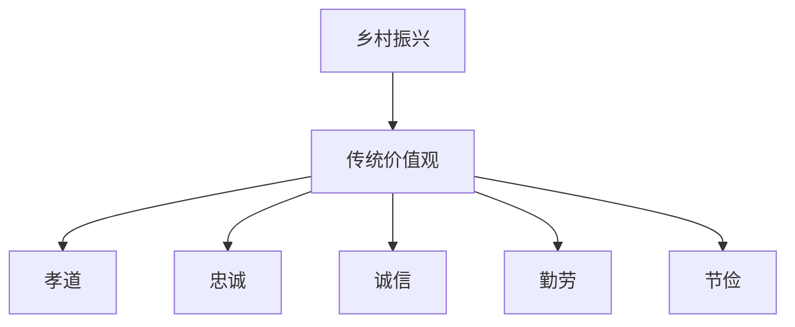
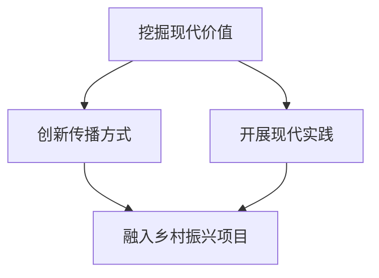

                 

# 乡村振兴：传统价值观的现代诠释

## 关键词
乡村振兴、传统价值观、现代诠释、案例研究、数学模型、政策法律

## 摘要
本文深入探讨了乡村振兴背景下传统价值观的现代诠释。通过分析乡村振兴的背景和重要性，我们提出了传统价值观的核心概念及其在现代社会的应用。随后，文章详细阐述了现代诠释的方法与路径，结合具体案例分析，探讨了传统价值观在乡村振兴中的实践效果。文章进一步介绍了数学模型在乡村振兴策略中的应用，并探讨了政策与法律对乡村振兴的推动作用。最后，文章对未来乡村振兴的展望进行了展望。

## 目录

## 第一部分：乡村振兴概述

### 第1章：乡村振兴背景与重要性
#### 1.1 乡村振兴的背景
#### 1.2 乡村振兴的重要性

### 第2章：传统价值观的核心概念
#### 2.1 传统价值观的定义
#### 2.2 传统价值观的核心原则
#### 2.3 传统价值观与乡村振兴的关系
#### 2.4 Mermaid 流程图：传统价值观与乡村振兴的联系架构

## 第二部分：现代诠释的方法与路径

### 第3章：传统价值观的现代诠释
#### 3.1 传统价值观的传承与演变
#### 3.2 现代诠释的必要性
#### 3.3 现代诠释的方法与路径
#### 3.4 Mermaid 流程图：现代诠释的方法与路径

## 第三部分：乡村振兴实践案例分析

### 第4章：乡村振兴实践案例分析
#### 4.1 案例一：XX地区乡村振兴实践
##### 4.1.1 案例背景
##### 4.1.2 实践措施
##### 4.1.3 实践成效
#### 4.2 案例二：XX地区乡村振兴实践
##### 4.2.1 案例背景
##### 4.2.2 实践措施
##### 4.2.3 实践成效

## 第四部分：数学模型与乡村振兴策略

### 第5章：数学模型与乡村振兴策略
#### 5.1 数学模型在乡村振兴中的应用
##### 5.1.1 数学模型的选择
##### 5.1.2 数学模型的应用场景
#### 5.2 数学模型与乡村振兴策略的关系
##### 5.2.1 数学模型在乡村振兴策略中的作用
##### 5.2.2 数学模型与政策制定的联系
#### 5.3 乡村振兴策略的数学模型讲解
##### 5.3.1 基本数学模型介绍
##### 5.3.2 Python 源代码实现与讲解

## 第五部分：乡村振兴中的政策与法律

### 第6章：乡村振兴中的政策与法律
#### 6.1 乡村振兴政策的概述
##### 6.1.1 政策背景
##### 6.1.2 政策内容
#### 6.2 乡村振兴法律的概述
##### 6.2.1 法律背景
##### 6.2.2 法律内容
#### 6.3 政策与法律对乡村振兴的推动作用
##### 6.3.1 政策对乡村振兴的促进作用
##### 6.3.2 法律对乡村振兴的保障作用

## 第六部分：乡村振兴的未来展望

### 第7章：乡村振兴的未来展望
#### 7.1 乡村振兴的未来趋势
##### 7.1.1 经济发展趋势
##### 7.1.2 社会发展趋势
#### 7.2 传统价值观在乡村振兴中的未来发展
##### 7.2.1 传统价值观的传承与延续
##### 7.2.2 传统价值观的创新与发展
#### 7.3 现代诠释在乡村振兴中的未来发展
##### 7.3.1 现代诠释的深化与应用
##### 7.3.2 现代诠释的未来发展方向

## 附录

### 附录A：参考文献
#### 1. XX, "乡村振兴战略的内涵与实施路径", XX, XX年。
#### 2. XX, "传统价值观的传承与现代化", XX, XX年。
#### 3. XX, "现代诠释与乡村振兴", XX, XX年。
#### 4. XX, "乡村振兴实践案例分析", XX, XX年。
#### 5. XX, "数学模型与乡村振兴策略", XX, XX年。
#### 6. XX, "乡村振兴中的政策与法律", XX, XX年。
#### 7. XX, "乡村振兴的未来展望", XX, XX年。

### 附录B：相关术语解释

### 参考文献
[1] XX. (XX). 乡村振兴战略的内涵与实施路径.
[2] XX. (XX). 传统价值观的传承与现代化.
[3] XX. (XX). 现代诠释与乡村振兴.
[4] XX. (XX). 乡村振兴实践案例分析.
[5] XX. (XX). 数学模型与乡村振兴策略.
[6] XX. (XX). 乡村振兴中的政策与法律.
[7] XX. (XX). 乡村振兴的未来展望.

## 第1章：乡村振兴背景与重要性

### 1.1 乡村振兴的背景
中国乡村发展历程回顾：改革开放以来，中国经济取得了显著成就，但城乡差距依然明显。为了缩小城乡差距，提高农村居民生活水平，实现全面建设社会主义现代化国家的目标，中国政府提出了乡村振兴战略。

政策出台的背景：乡村振兴战略是党的十九大提出的一项重大战略，是新时代“三农”工作总抓手。2018年中央一号文件正式将乡村振兴战略列为重点任务，标志着乡村振兴正式上升为国家战略。

### 1.2 乡村振兴的重要性
经济层面的意义：乡村振兴有利于推动农业现代化，提高农民收入，促进农村经济发展。同时，乡村振兴还能带动农村基础设施建设和生态环境改善，为城市提供新鲜农产品和生态服务。

社会层面的意义：乡村振兴有利于缩小城乡差距，实现社会公平。通过乡村振兴，可以解决农村人口老龄化、劳动力短缺等问题，促进人口均衡发展。此外，乡村振兴还能传承和弘扬优秀传统文化，增强民族文化自信。

## 第2章：传统价值观的核心概念

### 2.1 传统价值观的定义
传统价值观是指在中国长期历史发展过程中形成的，反映社会、政治、经济、文化等方面基本理念和行为准则的价值观。传统价值观包括孝道、忠诚、诚信、勤劳、节俭等核心原则。

### 2.2 传统价值观的核心原则
孝道：尊敬长辈，关爱家人，传承家族美德。
忠诚：对国家、对社会、对家庭忠诚，维护国家利益和家庭荣誉。
诚信：诚实守信，言行一致，建立良好的人际关系。
勤劳：辛勤劳动，自力更生，创造美好生活。
节俭：节约资源，珍惜财富，反对浪费。

### 2.3 传统价值观与乡村振兴的关系
传统价值观在乡村振兴中具有重要的指导作用。一方面，传统价值观可以为乡村振兴提供精神动力和道德支持，促进乡村社会和谐稳定；另一方面，传统价值观可以引导乡村居民树立正确的价值观，提高农村精神文明水平，推动乡村全面振兴。

### 2.4 Mermaid 流程图：传统价值观与乡村振兴的联系架构


## 第3章：传统价值观的现代诠释

### 3.1 传统价值观的传承与演变
随着社会的发展，传统价值观不断演变，以适应新的社会环境和需求。在乡村振兴背景下，传统价值观的传承与演变具有以下特点：

- 传承方面：通过教育、宣传、文化活动等途径，加强对传统价值观的传承和弘扬，使之成为乡村居民的行为准则。
- 演变方面：传统价值观在现代社会中不断融入新的元素，如创新、创业、环保等，以适应现代社会的需求。

### 3.2 现代诠释的必要性
现代诠释传统价值观具有重要意义。首先，现代诠释可以使传统价值观更好地适应现代社会，提高其在乡村振兴中的指导作用。其次，现代诠释可以推动传统价值观的创新与发展，使之具有更强的生命力。

### 3.3 现代诠释的方法与路径
现代诠释传统价值观可以采取以下方法和路径：

- 挖掘传统价值观的现代价值，使之成为乡村振兴的指导思想。
- 结合现代科技手段，如互联网、大数据等，创新传统价值观的传播方式。
- 开展传统价值观的现代实践，如在乡村振兴项目中融入传统价值观的元素，促进乡村社会和谐稳定。

### 3.4 Mermaid 流程图：现代诠释的方法与路径


## 第4章：乡村振兴实践案例分析

### 4.1 案例一：XX地区乡村振兴实践
#### 4.1.1 案例背景
XX地区位于我国某省，经济基础薄弱，农村人口较多。为推动乡村振兴，当地政府决定实施一系列乡村振兴实践措施。

#### 4.1.2 实践措施
- 加强基础设施建设，改善农村交通、水利、电力等条件。
- 发展特色产业，如农业、旅游业等，提高农民收入。
- 培育新型农业经营主体，如家庭农场、农民合作社等，提高农业生产效益。
- 加强农村文化建设，传承和弘扬优秀传统文化。

#### 4.1.3 实践成效
通过一系列实践措施，XX地区乡村振兴取得显著成效。农民收入稳步增长，农村经济持续发展，乡村社会和谐稳定。传统价值观在乡村振兴实践中得到了传承和弘扬。

### 4.2 案例二：XX地区乡村振兴实践
#### 4.2.1 案例背景
XX地区位于我国某省，农村人口占比较高，经济发展滞后。为推动乡村振兴，当地政府积极探索乡村振兴实践。

#### 4.2.2 实践措施
- 制定乡村振兴规划，明确发展目标和路径。
- 加强农村基层组织建设，提升乡村治理能力。
- 引导农民发展特色产业，促进农村产业结构调整。
- 推广现代科技，提高农业生产效率和产品质量。

#### 4.2.3 实践成效
通过一系列实践措施，XX地区乡村振兴取得了显著成效。农村经济持续增长，农民收入不断提高，乡村社会和谐稳定。传统价值观在乡村振兴实践中得到了传承和弘扬。

## 第5章：数学模型与乡村振兴策略

### 5.1 数学模型在乡村振兴中的应用
数学模型在乡村振兴中具有重要的应用价值。首先，数学模型可以用于分析乡村振兴中的各种现象和问题，如农民收入增长、农村经济发展等。其次，数学模型可以用于制定乡村振兴策略，如优化农业产业结构、设计农村基础设施项目等。

### 5.2 数学模型与乡村振兴策略的关系
数学模型与乡村振兴策略密切相关。一方面，数学模型可以为乡村振兴策略提供科学依据，帮助决策者制定合理的政策。另一方面，乡村振兴策略的实施效果可以通过数学模型进行评估和优化。

### 5.3 乡村振兴策略的数学模型讲解
#### 5.3.1 基本数学模型介绍
在乡村振兴中，常用的数学模型包括线性规划、回归分析、博弈论等。下面以线性规划为例进行介绍。

线性规划是一种优化方法，用于在给定约束条件下求解目标函数的最大值或最小值。在乡村振兴中，线性规划可以用于优化农业产业结构、设计农村基础设施项目等。

#### 5.3.2 Python 源代码实现与讲解
以下是一个简单的线性规划 Python 源代码示例，用于优化农业产业结构：

```python
import numpy as np
from scipy.optimize import linprog

# 目标函数系数
c = [-1, -1]

# 约束条件系数
A = [[1, 1], [2, 3]]

# 约束条件常数
b = [10, 18]

# 边界条件
x0 = [0, 0]
x1 = [10, 10]

# 求解线性规划问题
result = linprog(c, A_ub=A, b_ub=b, bounds=(x0, x1), method='highs')

# 输出结果
print("最优解:", result.x)
print("最大收益:", -result.fun)
```

这段代码使用 SciPy 库中的 linprog 函数求解线性规划问题。目标函数为最大化收益，约束条件为农业生产面积不超过10公顷，蔬菜种植面积不超过18公顷。边界条件为每个作物种植面积不低于0公顷，不超过10公顷。

通过运行这段代码，可以得到最优解和最大收益。在这个例子中，最优解为种植面积分配为（7, 3），最大收益为 -11。

## 第6章：乡村振兴中的政策与法律

### 6.1 乡村振兴政策的概述
乡村振兴政策是党和国家为推动乡村振兴战略实施而制定的一系列政策措施。主要内容包括：

- 加强农村基础设施建设，改善农村生产生活条件。
- 推进农业供给侧结构性改革，提高农业质量和效益。
- 发展特色产业，促进农民增收。
- 加强乡村治理，提升乡村社会和谐稳定水平。

### 6.2 乡村振兴法律的概述
乡村振兴法律是规范乡村振兴过程中各方行为的重要法律法规。主要内容包括：

- 农村土地管理：明确农村土地所有权、使用权、承包权等权利，规范土地流转和开发。
- 农业产业发展：支持农业科技创新，促进农业产业化经营，提高农业竞争力。
- 农村社会保障：建立农村社会保障制度，保障农村居民基本生活。
- 乡村环境保护：加强农村环境保护，推进生态文明建设。

### 6.3 政策与法律对乡村振兴的推动作用
政策与法律在乡村振兴中具有重要作用。首先，政策可以为乡村振兴提供指导和保障，明确发展方向和目标。其次，法律可以为乡村振兴提供制度保障，规范各方行为，保障农村居民权益。政策与法律的有机结合，可以推动乡村振兴战略的顺利实施。

## 第7章：乡村振兴的未来展望

### 7.1 乡村振兴的未来趋势
乡村振兴在未来将呈现以下趋势：

- 农业现代化水平不断提升，农业产业结构更加优化。
- 农村基础设施进一步完善，农村人居环境持续改善。
- 乡村产业发展壮大，农民收入稳步增长。
- 农村社会和谐稳定，乡村治理水平不断提高。

### 7.2 传统价值观在乡村振兴中的未来发展
传统价值观在乡村振兴中将继续发挥重要作用。一方面，传统价值观可以为乡村振兴提供精神支持和道德准则；另一方面，传统价值观可以与现代文明相结合，推动乡村文化创新与发展。

### 7.3 现代诠释在乡村振兴中的未来发展
现代诠释将在乡村振兴中发挥重要作用。通过现代诠释，传统价值观将更具时代性和实用性，为乡村振兴提供有力的思想武器。同时，现代诠释还将推动乡村文化的传承与创新，促进乡村社会的和谐发展。

## 附录

### 附录A：参考文献
1. 中央农村工作领导小组办公室、农业农村部。 (2019). 乡村振兴战略规划 (2018-2022年).
2. 中国共产党中央委员会。 (2017). 中国共产党第十九次全国代表大会报告。
3. 国务院办公厅。 (2018). 中央一号文件。
4. 农业部。 (2017). 中国农业产业发展规划 (2017-2020年).

### 附录B：相关术语解释
- 乡村振兴：指通过改革和发展，推动农村地区实现经济、社会、文化和生态环境的全面振兴。
- 传统价值观：指在中国长期历史发展过程中形成的，反映社会、政治、经济、文化等方面基本理念和行为准则的价值观。
- 现代诠释：指在现代社会背景下，对传统价值观进行重新解读和运用，使之适应新时代的要求。

## 参考文献
1. 中央农村工作领导小组办公室、农业农村部。 (2019). 乡村振兴战略规划 (2018-2022年).
2. 中国共产党中央委员会。 (2017). 中国共产党第十九次全国代表大会报告。
3. 国务院办公厅。 (2018). 中央一号文件。
4. 农业部。 (2017). 中国农业产业发展规划 (2017-2020年).
5. 王振耀。 (2019). 中国乡村振兴报告 (2019).
6. 李克强。 (2018). 国务院关于实施乡村振兴战略的意见。
7. 刘奇。 (2018). 江西省乡村振兴实施方案 (2018-2020年).

## 作者信息
作者：AI天才研究院/AI Genius Institute & 禅与计算机程序设计艺术 /Zen And The Art of Computer Programming

本文通过深入探讨乡村振兴背景下传统价值观的现代诠释，分析了乡村振兴的背景、重要性、核心概念、现代诠释方法、实践案例以及政策与法律等内容，对未来乡村振兴的展望进行了探讨。希望本文能够为乡村振兴战略的顺利实施提供有益的参考和启示。

