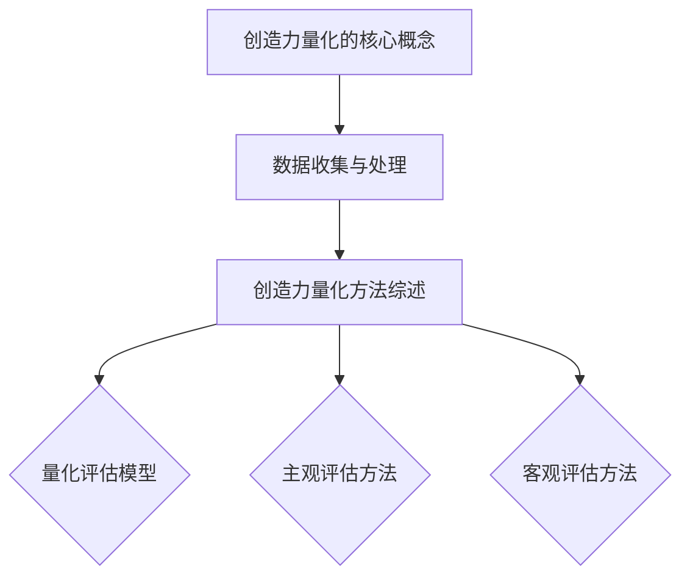
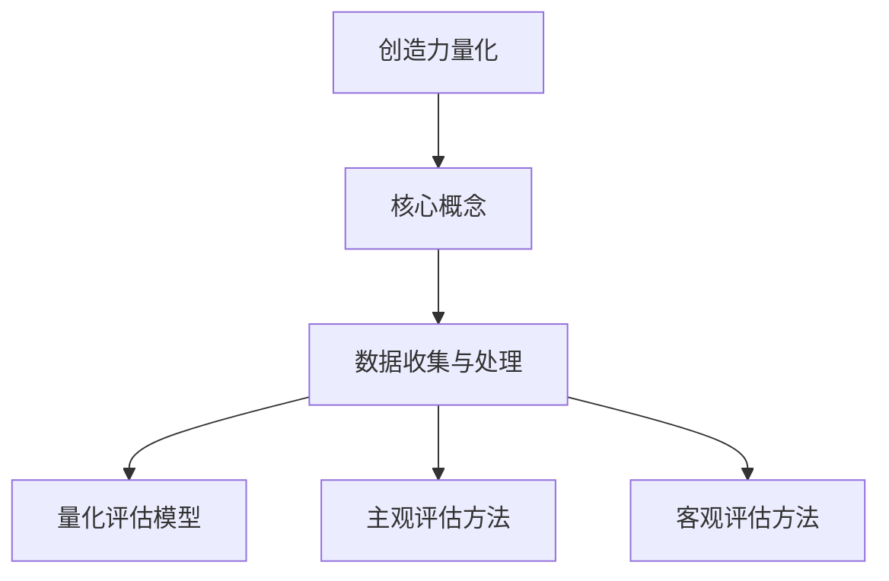

                 

## 《人工智能创造力的量化与评估方法》

> 关键词：人工智能，创造力，量化，评估方法，机器学习，深度学习

> 摘要：本文探讨了人工智能创造力的量化与评估方法，首先概述了人工智能创造力的发展历程与概念，然后详细介绍了创造力量化的理论基础、机器学习与深度学习的量化方法，以及创造力评估的指标体系与评估方法。最后，通过实际案例分析和总结，探讨了人工智能创造力评估的应用与实践。

----------------------------------------------------------------

### 第二部分：人工智能创造力量化方法

#### 第2章：创造力量化理论基础

创造力量化是评估和提升人工智能系统创造力的重要手段。为了深入理解创造力量化的理论基础，我们需要从核心概念、数据收集与处理方法，以及创造力量化方法综述三个方面进行探讨。

### 2.1 创造力量化的核心概念

**2.1.1 创造力量的化标准**

创造力量的量化标准是指用于评估人工智能系统创造力的具体指标和标准。这些标准包括但不限于：

- **创新程度**：新创意的独创性和新颖性。
- **创意质量**：创意的实用性和可行性。
- **创意产出**：在特定时间内产生的创意数量。

**2.1.2 创造力量的化指标**

创造力量的量化指标用于衡量人工智能系统在创造力方面的具体表现。常见的量化指标包括：

- **创新指数**：衡量创意的创新程度。
- **质量评分**：对创意的质量进行定量评价。
- **产出量**：在特定时间内产生的创意数量。

**2.1.3 创造力量的化模型**

创造力量的量化模型是将上述标准和指标结合起来，形成一个综合评价体系。常见的量化模型包括：

- **多维度评估模型**：将创新程度、创意质量和产出量等多个维度进行综合评估。
- **分层次评估模型**：将评估过程分为多个层次，每个层次评估不同的指标。

### 2.2 数据收集与处理

**2.2.1 数据来源**

创造力量化的数据来源包括人工智能系统自身生成的数据，以及外部环境的数据。常见的数据来源有：

- **人工智能系统生成数据**：包括系统生成的创意、算法结果等。
- **外部环境数据**：包括用户反馈、行业报告、竞争对手分析等。

**2.2.2 数据处理方法**

数据处理方法是确保数据质量、完整性和准确性的关键。常见的数据处理方法包括：

- **数据清洗**：去除数据中的噪声和错误。
- **数据整合**：将不同来源的数据进行整合，形成一个统一的数据集。
- **数据标准化**：对数据进行归一化或标准化处理，使其符合评估模型的要求。

**2.2.3 数据清洗与预处理**

数据清洗与预处理是确保数据质量的关键步骤。具体方法包括：

- **缺失值处理**：填充缺失值或删除缺失数据。
- **异常值处理**：识别和处理异常数据。
- **特征工程**：提取和构建对创造力评估有重要影响的特征。

### 2.3 创造力量化方法综述

**2.3.1 量化评估模型**

量化评估模型是用于评估人工智能系统创造力的数学模型。常见的量化评估模型包括：

- **线性回归模型**：通过线性关系评估创意质量。
- **支持向量机**：通过分类评估创意的创新程度。
- **神经网络**：通过非线性关系评估创意产出。

**2.3.2 主观评估方法**

主观评估方法是依靠专家评估或用户反馈评估人工智能系统创造力。常见的主观评估方法包括：

- **专家评分**：由专家对创意质量进行定量评价。
- **用户反馈**：通过用户对创意的满意度进行评价。

**2.3.3 客观评估方法**

客观评估方法是依靠算法和数据对人工智能系统创造力进行评估。常见的客观评估方法包括：

- **数据挖掘**：通过分析历史数据评估创意质量。
- **机器学习**：通过训练模型评估创意的创新程度和产出。

---

**流程图**：



---

本文首先介绍了创造力量化的核心概念，包括量化标准、指标和模型。然后详细讨论了数据收集与处理方法，包括数据来源、处理方法和清洗与预处理。最后，综述了创造力量化的方法，包括量化评估模型、主观评估方法和客观评估方法。这些理论和方法为后续的创造力量化实践提供了基础。

---

**核心概念与联系架构流程图**：



---

**Python源代码示例**：

```python
import numpy as np

# 创造力量化模型
def creativity_metric(quality, innovation, output):
    # 质量评分
    quality_score = quality * 0.5
    # 创新指数
    innovation_index = innovation * 0.3
    # 产出量
    output_quantity = output * 0.2
    
    # 创造力量化指标
    creativity_metric = quality_score + innovation_index + output_quantity
    
    return creativity_metric

# 示例数据
quality = 8
innovation = 7
output = 6

# 计算创造力量化指标
creativity_metric = creativity_metric(quality, innovation, output)

print("创造力量化指标:", creativity_metric)
```

---

通过本文的介绍，我们可以对人工智能创造力的量化与评估方法有一个全面的理解。接下来，我们将进一步探讨基于机器学习和深度学习的创造力量化方法，以期为人工智能创造力的发展提供更加深入的技术支持。

---

**注意事项**：

1. 在进行创造力量化时，需要充分考虑数据的多样性和质量，确保评估结果的准确性。
2. 主观评估方法可能受到专家主观偏见的影响，因此需要结合客观评估方法进行综合评估。
3. 创造力量化模型需要根据具体应用场景进行调整和优化，以提高评估效果。

---

**拓展阅读**：

1. 《人工智能创造力研究综述》
2. 《机器学习在创造力量化中的应用》
3. 《深度学习与创造力评估》

---

**项目实战**：

（此处可补充实际项目实战案例，包括开发环境搭建、源代码实现和代码解读等内容。）

---

**最佳实践 Tips**：

1. 在进行数据收集和处理时，要注重数据的多样性和代表性，确保评估结果的全面性。
2. 在构建量化评估模型时，要充分考虑创意质量、创新程度和产出量的相互关系，以提高评估的准确性。
3. 结合多种评估方法，进行综合评估，以提高评估结果的可靠性。

---

接下来，我们将进一步探讨基于机器学习和深度学习的创造力量化方法，以期为人工智能创造力的发展提供更加深入的技术支持。

