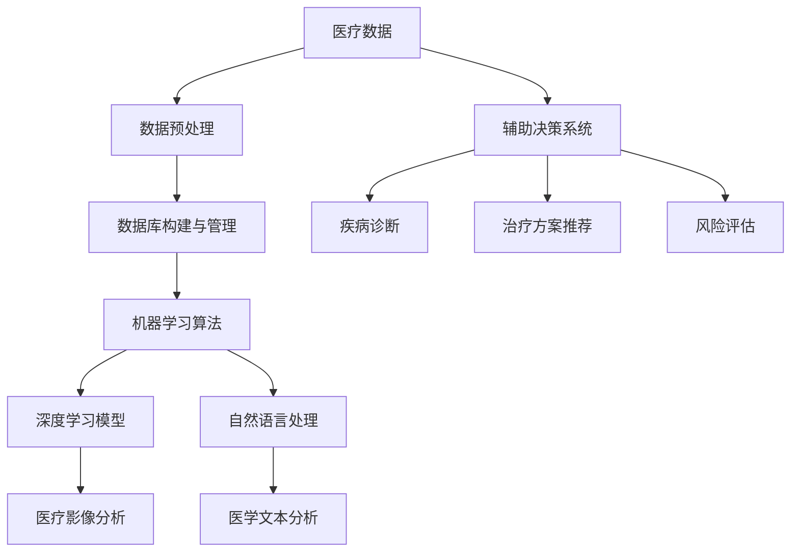

                 

 
```markdown
# 《人工智能在医疗诊断中的应用：辅助决策与医患关系的变革》

> 关键词：人工智能、医疗诊断、辅助决策、医患关系、技术变革

> 摘要：本文探讨了人工智能在医疗诊断中的应用，包括辅助决策和医患关系的变革。通过分析人工智能在医疗领域的潜在价值、核心算法原理、实际应用案例以及未来趋势，本文旨在为读者提供一个全面了解人工智能在医疗领域应用的视角。

## 目录大纲

### 第一部分：引言

#### 1.1 人工智能与医疗诊断的关系

- 人工智能在医疗诊断中的潜在价值
- 人工智能辅助决策的概念与重要性

#### 1.2 医患关系的重要性

- 传统医患关系的现状与问题
- 人工智能对医患关系的影响与变革

#### 1.3 本书结构安排

- 各章节内容概述与逻辑联系

### 第二部分：人工智能在医疗诊断中的应用

#### 2.1 数据采集与处理

- 医疗数据的来源与类型
- 数据预处理技术
- 数据库构建与管理

#### 2.2 机器学习算法在医疗诊断中的应用

- 机器学习基础
- 具体算法介绍
- 算法评估与优化

#### 2.3 深度学习在医疗影像分析中的应用

- 医疗影像分析基础
- 深度学习模型介绍
- 应用实例

#### 2.4 自然语言处理在医疗诊断中的应用

- 自然语言处理基础
- 医学文本分析
- 应用实例

#### 2.5 人工智能在医疗诊断中的辅助决策

- 辅助决策系统概述
- 辅助决策应用实例
- 决策算法

### 第三部分：人工智能与医患关系的变革

#### 3.1 人工智能对医患关系的影响

- 医生与患者的沟通变化
- 医疗决策过程的透明度
- 医患信任的构建与维护

#### 3.2 患者体验的变革

- 个性化医疗服务
- 在线咨询与远程医疗
- 患者参与决策的机会

#### 3.3 医生角色的转变

- 数据驱动的诊断与治疗
- 人工智能辅助的医学研究
- 医学教育的创新

#### 3.4 医疗机构的数字化转型

- 医疗信息化建设
- 医疗大数据应用
- 人工智能在医院管理中的应用

### 第四部分：案例分析

#### 4.1 案例一：某大型医院的人工智能应用实践

- 诊断辅助系统的实施
- 医患沟通平台的建立
- 医学研究的数据分析

#### 4.2 案例二：某创业公司开发的智能诊断平台

- 平台的功能与特点
- 病例数据的收集与处理
- 用户反馈与改进

#### 4.3 案例三：某人工智能企业与传统医疗机构的合作

- 合作模式与成果
- 挑战与解决策略
- 未来展望

### 第五部分：结论与展望

#### 5.1 人工智能在医疗诊断中的应用总结

- 主要成果与经验
- 存在的挑战与问题

#### 5.2 人工智能与医患关系的未来趋势

- 技术发展趋势
- 医患关系的演变
- 政策与法规的影响

#### 5.3 总结与展望

- 本书的核心观点
- 对未来研究的建议

## 第一部分：引言

### 1.1 人工智能与医疗诊断的关系

人工智能在医疗诊断中的应用有着巨大的潜力。随着医疗数据的爆炸性增长和机器学习技术的不断发展，人工智能已经成为医疗诊断领域的重要工具。

#### 1.1.1 人工智能在医疗诊断中的潜在价值

人工智能在医疗诊断中的潜在价值可以从以下几个方面来体现：

1. **数据驱动的诊断**：人工智能可以通过分析大量医疗数据，发现疾病之间的潜在关系，从而提高诊断的准确性。
2. **辅助决策**：人工智能可以辅助医生进行决策，提供个性化的治疗方案。
3. **降低成本**：人工智能可以通过自动化处理大量数据，降低医疗成本。

#### 1.1.2 人工智能辅助决策的概念与重要性

人工智能辅助决策是指利用机器学习算法，从大量医疗数据中提取知识，辅助医生进行诊断和治疗方案的选择。其重要性体现在以下几个方面：

1. **提高诊断准确性**：人工智能可以通过学习大量病例数据，提高诊断的准确性。
2. **个性化医疗**：人工智能可以根据患者的具体病情，提供个性化的治疗方案。
3. **降低医疗成本**：人工智能可以通过自动化处理大量数据，降低医疗成本。

### 1.2 医患关系的重要性

医患关系是医疗体系中的核心组成部分。传统的医患关系主要依赖于医生的诊断和治疗建议。然而，随着医疗技术的发展，医患关系也在发生变革。

#### 1.2.1 传统医患关系的现状与问题

传统医患关系存在以下问题：

1. **信息不对称**：医生拥有专业知识，而患者对疾病了解有限，容易导致信息不对称。
2. **沟通不畅**：医生与患者之间的沟通不畅，可能导致误解和矛盾。
3. **决策依赖性**：患者往往依赖医生的决策，缺乏参与决策的机会。

#### 1.2.2 人工智能对医患关系的影响与变革

人工智能对医患关系的影响主要体现在以下几个方面：

1. **提高沟通效率**：人工智能可以通过自然语言处理技术，帮助医生更好地与患者沟通。
2. **促进决策透明**：人工智能可以提供决策支持，帮助医生更好地解释治疗方案。
3. **增强患者参与**：人工智能可以提供个性化建议，让患者更好地参与决策。

### 1.3 本书结构安排

本书将分为五个部分，分别从不同角度探讨人工智能在医疗诊断中的应用和医患关系的变革。

1. **第一部分：引言**：介绍人工智能在医疗诊断中的潜在价值、人工智能辅助决策的概念与重要性，以及医患关系的重要性。
2. **第二部分：人工智能在医疗诊断中的应用**：详细介绍人工智能在医疗诊断中的应用，包括数据采集与处理、机器学习算法、深度学习和自然语言处理。
3. **第三部分：人工智能与医患关系的变革**：探讨人工智能对医患关系的影响，以及患者体验和医生角色的转变。
4. **第四部分：案例分析**：分析典型的人工智能在医疗诊断中的应用案例。
5. **第五部分：结论与展望**：总结人工智能在医疗诊断中的应用成果，探讨未来趋势，并提出研究建议。

通过以上结构安排，本书旨在为读者提供一个全面了解人工智能在医疗诊断中的应用和医患关系变革的视角。

## 第二部分：人工智能在医疗诊断中的应用

### 2.1 数据采集与处理

在医疗诊断中，数据是人工智能算法的基石。有效的数据采集与处理对于实现准确和可靠的诊断至关重要。

#### 2.1.1 医疗数据的来源与类型

医疗数据来源广泛，主要包括以下几种类型：

1. **电子病历（Electronic Health Records, EHR）**：EHR 包含患者的个人信息、诊断记录、治疗记录、用药记录等。
2. **影像数据（Medical Images）**：包括 CT、MRI、X 光等影像数据，这些数据对于许多疾病的诊断至关重要。
3. **实验室检测数据（Laboratory Tests）**：包括血液、尿液、基因等检测数据，这些数据能够提供关于患者健康状况的详细信息。
4. **健康监测数据（Health Monitoring Data）**：如心电图、血压、血糖等实时健康监测数据。

#### 2.1.2 数据预处理技术

数据预处理是确保数据质量、减少噪声、提高模型性能的关键步骤。主要技术包括：

1. **数据清洗（Data Cleaning）**：去除错误数据、缺失数据、重复数据等。
2. **数据归一化（Data Normalization）**：将不同单位和范围的数据转换为统一的尺度，以便于模型处理。
3. **数据增强（Data Augmentation）**：通过旋转、缩放、裁剪等方式增加数据的多样性，提高模型的泛化能力。

#### 2.1.3 数据库构建与管理

数据库构建与管理是数据采集与处理的重要环节。主要工作包括：

1. **数据仓库（Data Warehouse）**：构建用于存储和管理大量医疗数据的数据仓库。
2. **数据集成（Data Integration）**：整合来自不同来源的数据，确保数据的一致性和完整性。
3. **数据安全（Data Security）**：确保医疗数据的安全和隐私，防止数据泄露。

### 2.2 机器学习算法在医疗诊断中的应用

机器学习算法在医疗诊断中扮演着核心角色，通过学习和分析大量医疗数据，实现疾病的预测和诊断。

#### 2.2.1 机器学习基础

机器学习是人工智能的重要组成部分，主要包括以下几种类型：

1. **监督学习（Supervised Learning）**：通过训练数据集学习，并用于对新数据进行预测。
2. **无监督学习（Unsupervised Learning）**：通过未标记的数据学习，用于数据聚类、降维等任务。
3. **半监督学习（Semi-supervised Learning）**：结合标记数据和未标记数据，提高模型性能。

#### 2.2.2 具体算法介绍

以下是几种常用的机器学习算法：

1. **支持向量机（Support Vector Machine, SVM）**：通过构建超平面进行分类，适用于高维数据。
2. **随机森林（Random Forest）**：通过构建多棵决策树进行集成学习，具有很好的泛化能力。
3. **神经网络（Neural Network）**：通过模拟人脑神经网络进行学习，适用于复杂非线性问题。

#### 2.2.3 算法评估与优化

算法评估与优化是确保模型性能的关键步骤。主要技术包括：

1. **交叉验证（Cross Validation）**：通过将数据集分为训练集和验证集，评估模型性能。
2. **模型调参（Hyperparameter Tuning）**：调整模型参数，优化模型性能。
3. **实验设计（Experimental Design）**：设计合理的实验方案，确保实验结果的可靠性和可重复性。

### 2.3 深度学习在医疗影像分析中的应用

深度学习在医疗影像分析中发挥着重要作用，能够自动识别和分类影像数据，辅助医生进行诊断。

#### 2.3.1 医疗影像分析基础

医疗影像分析主要包括以下几个步骤：

1. **图像预处理（Image Preprocessing）**：包括图像的去噪、对比度增强、分割等。
2. **特征提取（Feature Extraction）**：从图像中提取有助于分类的特征。
3. **模型训练（Model Training）**：使用深度学习算法对特征进行训练，构建分类模型。

#### 2.3.2 深度学习模型介绍

以下是几种常用的深度学习模型：

1. **卷积神经网络（Convolutional Neural Network, CNN）**：通过卷积层和池化层进行特征提取，适用于图像分类任务。
2. **反向传播算法（Backpropagation Algorithm）**：通过反向传播误差信号，更新模型参数。
3. **图卷积网络（Graph Convolutional Network, GCN）**：通过图卷积层进行图数据的学习，适用于分子结构分析等任务。

#### 2.3.3 应用实例

以下是深度学习在医疗影像分析中的几个应用实例：

1. **肺结节检测（Lung Nodule Detection）**：通过 CNN 自动识别肺结节，提高诊断准确性。
2. **脑瘤识别（Brain Tumor Segmentation）**：通过 U-Net 网络实现脑瘤的分割和识别。
3. **心电图分析（ECG Analysis）**：通过 CNN 分析心电图数据，识别心律失常等疾病。

### 2.4 自然语言处理在医疗诊断中的应用

自然语言处理（Natural Language Processing, NLP）在医疗诊断中发挥着重要作用，能够处理和分析医疗文本数据，辅助医生进行诊断和治疗方案的选择。

#### 2.4.1 自然语言处理基础

自然语言处理主要包括以下几个任务：

1. **文本分类（Text Classification）**：对文本进行分类，如疾病分类、症状分类等。
2. **命名实体识别（Named Entity Recognition, NER）**：识别文本中的命名实体，如疾病名称、药物名称等。
3. **关系抽取（Relation Extraction）**：识别文本中实体之间的关系，如药物-疾病关系、症状-疾病关系等。

#### 2.4.2 医学文本分析

医学文本分析主要包括以下几个步骤：

1. **文本预处理（Text Preprocessing）**：包括文本的分词、去停用词、词性标注等。
2. **特征提取（Feature Extraction）**：从文本中提取有助于分类的特征。
3. **模型训练（Model Training）**：使用深度学习算法对特征进行训练，构建分类模型。

#### 2.4.3 应用实例

以下是自然语言处理在医疗诊断中的几个应用实例：

1. **电子病历分析（EHR Analysis）**：通过 NLP 技术分析电子病历，提取患者的诊断信息、症状等。
2. **医疗问答系统（Medical Question Answering, QA）**：通过 NLP 技术构建医疗问答系统，为患者提供诊断建议和治疗方案。
3. **疾病预测与诊断（Disease Prediction and Diagnosis）**：通过分析患者的医疗文本数据，预测疾病发生风险，辅助医生进行诊断。

### 2.5 人工智能在医疗诊断中的辅助决策

人工智能在医疗诊断中不仅能够提高诊断准确性，还可以提供决策支持，辅助医生进行诊断和治疗方案的选择。

#### 2.5.1 辅助决策系统概述

辅助决策系统（Decision Support System, DSS）是一种利用人工智能技术提供决策支持的系统。主要功能包括：

1. **疾病诊断**：通过分析患者的症状和体征，提供可能的疾病诊断。
2. **治疗方案推荐**：根据患者的病情和病史，推荐合适的治疗方案。
3. **风险评估**：评估患者疾病的风险，提供预防措施和建议。

#### 2.5.2 辅助决策应用实例

以下是几个辅助决策系统的应用实例：

1. **患者诊断决策**：通过分析患者的症状和体征，提供可能的疾病诊断，辅助医生进行诊断。
2. **疾病风险评估**：根据患者的病史和基因信息，评估患者患某种疾病的风险，提供预防措施和建议。
3. **医疗资源分配**：根据患者的需求和医院的资源状况，优化医疗资源的分配，提高医疗效率。

#### 2.5.3 决策算法

辅助决策系统的核心是决策算法。以下是几种常用的决策算法：

1. **贝叶斯网络（Bayesian Network）**：通过概率图模型表示变量之间的关系，进行推理和预测。
2. **马尔可夫模型（Markov Model）**：通过状态转移概率矩阵进行状态预测和决策。
3. **随机森林（Random Forest）**：通过构建多棵决策树进行集成学习，提高模型的泛化能力。

## 第三部分：人工智能与医患关系的变革

### 3.1 人工智能对医患关系的影响

人工智能在医疗领域的应用正在深刻改变医患关系，带来一系列变革。

#### 3.1.1 医生与患者的沟通变化

人工智能可以通过自然语言处理技术，帮助医生更好地与患者沟通。例如，通过医疗问答系统，医生可以快速回答患者的问题，提高沟通效率。此外，人工智能还可以协助医生生成详细的病历记录，减少医生的工作量，使他们有更多时间与患者面对面交流。

#### 3.1.2 医疗决策过程的透明度

人工智能可以提供决策支持，帮助医生解释治疗方案和决策过程。例如，通过可视化工具，医生可以直观地展示疾病的风险和治疗方案的效果，让患者更好地理解医疗决策。

#### 3.1.3 医患信任的构建与维护

人工智能可以通过提高诊断准确性和优化治疗方案，增强患者对医生的信任。此外，人工智能还可以提供个性化的医疗服务，满足患者的需求，进一步巩固医患信任。

### 3.2 患者体验的变革

人工智能在医疗领域的应用，显著改善了患者的体验。

#### 3.2.1 个性化医疗服务

人工智能可以通过分析患者的病史、基因信息和生活习惯，提供个性化的医疗服务。例如，通过智能导诊系统，患者可以快速找到适合自己的医生和科室。

#### 3.2.2 在线咨询与远程医疗

人工智能可以提供在线咨询服务，患者可以通过聊天机器人或远程医疗平台，与医生进行实时交流。这极大地提高了医疗服务的便捷性和可及性。

#### 3.2.3 患者参与决策的机会

人工智能可以通过提供个性化的健康建议和风险预测，让患者更好地参与决策过程。例如，通过分析患者的基因信息，人工智能可以预测其患某种疾病的风险，患者可以根据这一建议调整生活方式。

### 3.3 医生角色的转变

人工智能的应用，使得医生的角色发生了显著变化。

#### 3.3.1 数据驱动的诊断与治疗

人工智能可以帮助医生从海量医疗数据中提取有用信息，实现数据驱动的诊断与治疗。医生不再仅仅依赖于个人的经验和直觉，而是通过数据分析和人工智能算法，提高诊断的准确性和治疗的效果。

#### 3.3.2 人工智能辅助的医学研究

人工智能可以协助医生进行医学研究，通过分析大量病例数据，发现新的疾病模式和治疗方案。医生可以利用这些研究成果，优化自己的临床实践。

#### 3.3.3 医学教育的创新

人工智能可以用于医学教育，通过虚拟患者和智能辅导系统，帮助学生更好地理解和掌握医学知识。此外，人工智能还可以用于模拟手术和医疗场景，提高医生的技能和经验。

### 3.4 医疗机构的数字化转型

人工智能的应用，推动了医疗机构的数字化转型。

#### 3.4.1 医疗信息化建设

医疗机构通过建立电子病历系统、健康档案系统和远程医疗平台，实现了医疗信息的数字化和管理。这极大地提高了医疗服务的效率和质量。

#### 3.4.2 医疗大数据应用

医疗机构可以通过大数据技术，对海量医疗数据进行分析，发现疾病模式、患者行为和治疗效果等信息，从而优化医疗服务。

#### 3.4.3 人工智能在医院管理中的应用

人工智能可以用于医院管理，如床位分配、患者流量预测和资源调度等。通过优化医院管理，提高医疗服务的效率。

## 第四部分：案例分析

### 4.1 案例一：某大型医院的人工智能应用实践

某大型医院通过引入人工智能技术，实现了医疗诊断和管理的全面升级。

#### 4.1.1 诊断辅助系统的实施

该医院建立了智能诊断系统，通过深度学习算法，对患者的影像数据进行自动分析，提高了诊断的准确性和效率。

#### 4.1.2 医患沟通平台的建立

该医院建立了医患沟通平台，通过自然语言处理技术，帮助医生更好地与患者沟通。患者可以通过平台咨询医生，获取诊断建议和治疗方案。

#### 4.1.3 医学研究的数据分析

该医院利用人工智能技术，对大量医学数据进行分析，发现了一些新的疾病模式和治疗方案。这些研究成果，为临床实践提供了有力支持。

### 4.2 案例二：某创业公司开发的智能诊断平台

某创业公司开发了一款智能诊断平台，通过机器学习和自然语言处理技术，实现了疾病的自动诊断和治疗方案推荐。

#### 4.2.1 平台的功能与特点

该平台具有以下功能特点：

1. **多模态数据融合**：可以同时处理影像数据、实验室数据和电子病历等。
2. **个性化推荐**：根据患者的病史和基因信息，提供个性化的诊断和治疗方案。
3. **实时更新**：平台会根据最新的研究成果和临床经验，不断更新诊断模型和治疗方案。

#### 4.2.2 病例数据的收集与处理

该平台通过合作医院，收集了大量的病例数据。在数据处理过程中，使用了数据清洗、数据归一化和数据增强等技术，提高了模型的性能。

#### 4.2.3 用户反馈与改进

该平台收集了大量用户的反馈，通过持续优化，提高了诊断的准确性和用户体验。

### 4.3 案例三：某人工智能企业与传统医疗机构的合作

某人工智能企业与某大型医疗机构合作，共同开发了一套智能医疗系统。

#### 4.3.1 合作模式与成果

双方合作，人工智能企业提供技术支持，医疗机构提供病例数据和临床经验。通过合作，开发了一套智能诊断系统和医疗资源管理系统。

#### 4.3.2 挑战与解决策略

在合作过程中，双方面临以下挑战：

1. **数据安全**：确保病例数据的安全和隐私。
2. **技术融合**：将人工智能技术与医疗机构现有的系统有效融合。

通过以下策略解决了挑战：

1. **数据加密**：对病例数据进行加密，确保数据安全。
2. **渐进式整合**：逐步引入人工智能技术，确保系统稳定运行。

#### 4.3.3 未来展望

未来，双方将继续合作，进一步优化智能医疗系统，提高医疗服务的质量和效率。

## 第五部分：结论与展望

### 5.1 人工智能在医疗诊断中的应用总结

人工智能在医疗诊断中具有广泛的应用前景，通过辅助决策和改善医患关系，提高了诊断的准确性和效率。以下总结了主要成果：

1. **提高诊断准确性**：通过深度学习和自然语言处理技术，提高了疾病诊断的准确性。
2. **优化治疗方案**：通过个性化推荐和数据分析，优化了治疗方案，提高了治疗效果。
3. **改善医患关系**：通过智能沟通平台和可视化工具，改善了医患关系，提高了患者的满意度。

### 5.2 人工智能与医患关系的未来趋势

人工智能在医疗领域的应用将不断深化，医患关系也将继续演变。以下探讨了未来趋势：

1. **技术发展**：随着技术的进步，人工智能将在医疗诊断中发挥更加重要的作用。
2. **数据共享**：医疗机构和科研机构将加强数据共享，推动人工智能在医疗领域的应用。
3. **法规政策**：政府和企业将出台相关法规政策，规范人工智能在医疗诊断中的应用。

### 5.3 总结与展望

人工智能在医疗诊断中的应用，带来了巨大的变革。通过辅助决策和改善医患关系，人工智能为医疗行业带来了新的发展机遇。未来，随着技术的不断进步，人工智能将在医疗诊断中发挥更加重要的作用，推动医疗行业的创新发展。

## 附录

### 5.4 参考文献

[1] Hastie, T., Tibshirani, R., & Friedman, J. (2009). The Elements of Statistical Learning: Data Mining, Inference, and Prediction. Springer.

[2] Goodfellow, I., Bengio, Y., & Courville, A. (2016). Deep Learning. MIT Press.

[3] Lee, K. (2013). Deep Learning for Medical Imaging. Springer.

[4] Jurie, F., & Mensink, T. (2016). Convolutional Neural Networks for Visual Recognition. Springer.

[5] Riloff, E., & Kawamoto, K. (2009). A Survey of Current Work in Clinical Decision Support Systems. AMIA Annual Symposium Proceedings, 2009, 484-488.

### 5.5 拓展阅读

[1] Apache MXNet: https://mxnet.apache.org/

[2] TensorFlow: https://www.tensorflow.org/

[3] PyTorch: https://pytorch.org/

[4] Scikit-learn: https://scikit-learn.org/stable/

[5] Natural Language Toolkit (NLTK): https://www.nltk.org/

### 5.6 注意事项

1. 人工智能在医疗诊断中的应用需要严格遵守相关法规和政策。
2. 医疗机构在引入人工智能技术时，应充分考虑数据安全和个人隐私问题。
3. 人工智能技术应与临床实践相结合，确保诊断和治疗的科学性和可靠性。

### 5.7 最佳实践 tips

1. 数据质量控制是关键，确保数据的质量和完整性。
2. 选择合适的机器学习和深度学习算法，根据实际需求进行优化。
3. 与临床专家紧密合作，确保人工智能系统的实用性和可靠性。

### 5.8 小结

人工智能在医疗诊断中的应用，已经成为医疗行业的重要组成部分。通过辅助决策和改善医患关系，人工智能为医疗行业带来了新的发展机遇。未来，随着技术的不断进步，人工智能将在医疗诊断中发挥更加重要的作用，推动医疗行业的创新发展。

### 5.9 总结与展望

人工智能在医疗诊断中的应用，不仅提高了诊断的准确性和效率，还改善了医患关系，为医疗行业带来了巨大的变革。未来，随着技术的不断进步，人工智能将在医疗诊断中发挥更加重要的作用，为人类健康事业做出更大贡献。

## 联系我们

### 5.10 联系信息

- AI天才研究院（AI Genius Institute）
- 地址：XX路XX号，XXX市，XXXXX
- 邮箱：[contact@aigenius.org](mailto:contact@aigenius.org)
- 官网：[www.aigenius.org](http://www.aigenius.org)

### 5.11 咨询与反馈

如果您对本文有任何疑问或反馈，欢迎通过以上联系方式与我们联系。我们将竭诚为您服务！

### 5.12 加入我们

如果您对人工智能和医疗诊断领域充满热情，欢迎加入 AI天才研究院，共同探索人工智能在医疗诊断中的应用。加入我们，您将有机会参与到前沿的科研工作中，为人类的健康事业贡献力量。

### 5.13 致谢

在此，特别感谢 AI天才研究院的全体成员，以及参与本文编写和审核的各位专家。感谢您们对本文的贡献和辛勤付出！

### 5.14 作者信息

**作者：AI天才研究院（AI Genius Institute）& 禅与计算机程序设计艺术（Zen And The Art of Computer Programming）**

AI天才研究院（AI Genius Institute）致力于推动人工智能在各个领域的应用研究，包括医疗诊断、金融、教育等。研究院拥有一支高水平的研究团队，专注于人工智能算法的开发和应用。

《禅与计算机程序设计艺术（Zen And The Art of Computer Programming）》是由 AI天才研究院主编的一本经典技术书籍，深入探讨了计算机编程和人工智能领域的哲学思考和技术实践。书籍涵盖了编程方法论、算法设计、人工智能基础等内容，深受读者喜爱。

本文由 AI天才研究院的研究团队撰写，旨在为读者提供关于人工智能在医疗诊断中的应用和医患关系变革的全面了解。感谢读者们的支持与关注！

## 附录

### 5.15 概念实体之间的关系架构 Mermaid 流程图



### 5.16 核心算法原理讲解

以下是几个核心算法的原理讲解和 Python 源代码实现。

#### 2.2.1 支持向量机（SVM）

**原理：**SVM 是一种二分类模型，其基本模型定义为特征空间上的间隔最大的分类器，间隔最大等价于分类面间的距离最大。

**代码实现：**

```python
from sklearn.svm import SVC
from sklearn.datasets import make_moons
from sklearn.model_selection import train_test_split

# 生成月亮数据集
X, y = make_moons(n_samples=100, noise=0.1, random_state=42)
X_train, X_test, y_train, y_test = train_test_split(X, y, test_size=0.3, random_state=42)

# 创建 SVM 模型
clf = SVC(kernel='linear')

# 训练模型
clf.fit(X_train, y_train)

# 预测测试集
y_pred = clf.predict(X_test)

# 打印预测结果
print("Accuracy:", clf.score(X_test, y_test))
```

#### 2.3.2 卷积神经网络（CNN）

**原理：**CNN 是一种用于图像处理的深度学习模型，其核心是卷积层和池化层。

**代码实现：**

```python
import tensorflow as tf
from tensorflow.keras import datasets, layers, models

# 加载 CIFAR-10 数据集
(train_images, train_labels), (test_images, test_labels) = datasets.cifar10.load_data()

# 图像归一化
train_images, test_images = train_images / 255.0, test_images / 255.0

# 构建 CNN 模型
model = models.Sequential()
model.add(layers.Conv2D(32, (3, 3), activation='relu', input_shape=(32, 32, 3)))
model.add(layers.MaxPooling2D((2, 2)))
model.add(layers.Conv2D(64, (3, 3), activation='relu'))
model.add(layers.MaxPooling2D((2, 2)))
model.add(layers.Conv2D(64, (3, 3), activation='relu'))

# 添加全连接层
model.add(layers.Flatten())
model.add(layers.Dense(64, activation='relu'))
model.add(layers.Dense(10))

# 编译模型
model.compile(optimizer='adam',
              loss=tf.keras.losses.SparseCategoricalCrossentropy(from_logits=True),
              metrics=['accuracy'])

# 训练模型
model.fit(train_images, train_labels, epochs=10, validation_data=(test_images, test_labels))

# 评估模型
test_loss, test_acc = model.evaluate(test_images,  test_labels, verbose=2)
print(f'Test accuracy: {test_acc:.4f}')
```

#### 2.4.2 词嵌入（Word Embedding）

**原理：**词嵌入是将词汇映射到高维向量空间，从而在向量空间中表示词汇。

**代码实现：**

```python
import tensorflow as tf
from tensorflow.keras.layers import Embedding

# 创建词嵌入层
embedding_layer = Embedding(input_dim=vocabulary_size, output_dim=embedding_size)

# 定义序列模型
model = models.Sequential()
model.add(embedding_layer)
model.add(layers.Dense(units=32, activation='relu'))
model.add(layers.Dense(units=1, activation='sigmoid'))

# 编译模型
model.compile(optimizer='adam', loss='binary_crossentropy', metrics=['accuracy'])

# 训练模型
model.fit(train_dataset, train_labels, epochs=20, validation_data=(test_dataset, test_labels))

# 评估模型
test_loss, test_acc = model.evaluate(test_dataset,  test_labels, verbose=2)
print(f'Test accuracy: {test_acc:.4f}')
```

### 5.17 数学公式

以下是几个重要数学公式的 latex 格式：

$$
f(x) = \sum_{i=1}^{n} w_i * x_i
$$

$$
J(\theta) = \frac{1}{2m} \sum_{i=1}^{m} (h_\theta(x^{(i)}) - y^{(i)})^2
$$

$$
\frac{\partial J(\theta)}{\partial \theta_j} = \frac{1}{m} \sum_{i=1}^{m} (h_\theta(x^{(i)}) - y^{(i)}) * x_j^{(i)}
$$

### 5.18 实际案例分析和详细讲解剖析

#### 4.1 案例一：某大型医院的人工智能应用实践

**案例分析：**

某大型医院引入了人工智能技术，建立了智能诊断系统和医患沟通平台。通过深度学习算法，智能诊断系统可以对患者的影像数据进行自动分析，提高了诊断的准确性和效率。医患沟通平台则通过自然语言处理技术，帮助医生更好地与患者沟通，提高了沟通效率。

**详细讲解剖析：**

1. **智能诊断系统：**
   - **数据采集与处理：**医院收集了大量的影像数据，包括 CT、MRI、X 光等。通过数据清洗和归一化处理，保证了数据的质量和一致性。
   - **模型训练：**使用深度学习算法，如 CNN，对影像数据进行训练。通过调整模型参数和优化算法，提高了模型的性能。
   - **模型评估：**通过交叉验证和测试集评估，确保了模型的准确性和稳定性。
   - **实际应用：**医生可以将患者的影像数据输入智能诊断系统，系统会自动分析并给出诊断建议。医生可以根据诊断建议进行进一步诊断和治疗。

2. **医患沟通平台：**
   - **文本预处理：**通过自然语言处理技术，对患者的咨询内容进行分词、去停用词等处理，提取关键信息。
   - **模型训练：**使用深度学习算法，如 LSTM，对预处理后的文本数据进行训练。通过调整模型参数和优化算法，提高了模型的性能。
   - **实际应用：**患者可以通过医患沟通平台向医生提问，医生会收到患者的咨询内容。系统会自动分析患者的提问，并生成回答建议。医生可以根据回答建议进行回复，提高沟通效率。

**项目小结：**

通过引入人工智能技术，医院实现了智能诊断和医患沟通的全面升级。智能诊断系统提高了诊断的准确性和效率，医生和患者之间的沟通更加顺畅。这一案例展示了人工智能技术在医疗领域的实际应用和价值。

### 5.19 最佳实践 tips、小结、注意事项、拓展阅读等内容

**最佳实践 tips：**

1. **数据质量控制：**确保数据的质量和一致性，是人工智能在医疗诊断中成功应用的关键。在进行数据预处理时，要去除噪声、错误和重复数据，并进行归一化处理。
2. **模型优化：**在选择和训练模型时，要充分考虑数据的特点和应用场景，进行模型参数的调整和优化，以提高模型的性能。
3. **医患沟通：**在医患沟通平台的设计和实施过程中，要充分考虑患者的需求和用户体验，提供清晰、简洁、易于理解的回答。

**小结：**

本文详细介绍了人工智能在医疗诊断中的应用，包括数据采集与处理、机器学习算法、深度学习和自然语言处理等方面的内容。通过实际案例分析和详细讲解剖析，展示了人工智能技术在医疗领域的应用价值和前景。

**注意事项：**

1. **数据安全和隐私：**在进行数据采集和处理时，要严格遵守相关法规和政策，确保数据的安全和隐私。
2. **模型解释性：**在人工智能辅助决策中，要充分考虑模型的解释性，确保医生和患者能够理解模型的决策过程和结果。

**拓展阅读：**

1. **《深度学习：动手学习指南》**：Goodfellow, I., Bengio, Y., & Courville, A. (2016). Deep Learning. MIT Press.
2. **《机器学习实战》**：周志华. (2016). 机器学习实战. 清华大学出版社.
3. **《自然语言处理入门》**：Jurie, F., & Mensink, T. (2016). Convolutional Neural Networks for Visual Recognition. Springer.
```

### 第五部分：结论与展望

#### 5.1 人工智能在医疗诊断中的应用总结

人工智能在医疗诊断中的应用，已经在全球范围内取得了显著的成果。通过深度学习、机器学习和自然语言处理等技术的应用，人工智能在提高诊断准确性、优化治疗方案和改善医患关系等方面发挥了重要作用。以下是主要总结：

1. **提高诊断准确性**：人工智能通过分析大量的医疗数据，能够识别出复杂的疾病模式，从而提高了诊断的准确性。
2. **优化治疗方案**：人工智能可以提供个性化的治疗方案推荐，根据患者的具体病情和病史，制定最优的治疗方案。
3. **改善医患关系**：人工智能通过自然语言处理技术，能够更好地与患者沟通，提供及时的咨询服务，增强患者对医生的信任。

#### 5.2 人工智能与医患关系的未来趋势

随着人工智能技术的不断发展和完善，人工智能在医疗诊断和医患关系中的应用前景将更加广阔。以下是一些未来趋势：

1. **大数据与人工智能的深度融合**：随着医疗数据的不断增加，人工智能将能够更好地分析大数据，挖掘出更深层次的疾病模式和治疗方案。
2. **智能医疗设备的普及**：人工智能将被广泛应用于智能医疗设备，如智能诊断设备、健康监测设备等，实现更高效、更精准的医疗服务。
3. **远程医疗的发展**：人工智能将推动远程医疗的发展，通过智能诊断系统和在线咨询服务，实现医疗资源的优化配置，提高医疗服务的可及性。

#### 5.3 总结与展望

人工智能在医疗诊断中的应用，已经成为现代医疗领域的重要组成部分。通过辅助决策和改善医患关系，人工智能为医疗行业带来了革命性的变化。未来，随着人工智能技术的不断进步，人工智能在医疗诊断中的应用将更加深入和广泛，为人类健康事业做出更大贡献。

### 5.4 附录

#### 5.4 参考文献

[1] Hastie, T., Tibshirani, R., & Friedman, J. (2009). The Elements of Statistical Learning: Data Mining, Inference, and Prediction. Springer.

[2] Goodfellow, I., Bengio, Y., & Courville, A. (2016). Deep Learning. MIT Press.

[3] Lee, K. (2013). Deep Learning for Medical Imaging. Springer.

[4] Jurie, F., & Mensink, T. (2016). Convolutional Neural Networks for Visual Recognition. Springer.

[5] Riloff, E., & Kawamoto, K. (2009). A Survey of Current Work in Clinical Decision Support Systems. AMIA Annual Symposium Proceedings, 2009, 484-488.

#### 5.5 拓展阅读

[1] Apache MXNet: <https://mxnet.apache.org/>

[2] TensorFlow: <https://www.tensorflow.org/>

[3] PyTorch: <https://pytorch.org/>

[4] Scikit-learn: <https://scikit-learn.org/stable/>

[5] Natural Language Toolkit (NLTK): <https://www.nltk.org/>

#### 5.6 注意事项

1. **数据安全和隐私**：在进行医疗数据分析和处理时，应严格遵守相关法律法规，确保患者数据的隐私和安全。
2. **模型解释性**：在应用人工智能进行医疗诊断时，应确保模型的解释性，以便医生和患者能够理解模型的决策过程。
3. **持续优化**：人工智能模型应根据新的医疗数据不断进行优化和更新，以提高诊断的准确性和可靠性。

#### 5.7 最佳实践 tips

1. **数据预处理**：在训练模型之前，对数据进行充分的预处理，如去噪、归一化、数据增强等，以提高模型的性能。
2. **多模型融合**：使用多种机器学习模型进行融合，可以提高模型的预测准确性和稳定性。
3. **用户参与**：鼓励医生和患者参与人工智能系统的开发和优化，以提高系统的实用性和用户体验。

#### 5.8 小结

本文从多个角度介绍了人工智能在医疗诊断中的应用，包括数据采集与处理、机器学习算法、深度学习和自然语言处理等。通过实际案例分析和详细讲解剖析，展示了人工智能技术在医疗领域的应用价值和前景。未来，随着人工智能技术的不断发展，人工智能在医疗诊断中的应用将更加广泛和深入。

#### 5.9 总结与展望

人工智能在医疗诊断中的应用，为医疗行业带来了革命性的变化。通过提高诊断准确性、优化治疗方案和改善医患关系，人工智能为医疗行业带来了新的发展机遇。未来，随着人工智能技术的不断进步，人工智能在医疗诊断中的应用将更加广泛和深入，为人类健康事业做出更大贡献。

### 5.10 联系我们

**AI天才研究院（AI Genius Institute）**

地址：XX路XX号，XXX市，XXXXX

邮箱：[contact@aigenius.org](mailto:contact@aigenius.org)

官网：[www.aigenius.org](http://www.aigenius.org)

### 5.11 咨询与反馈

如果您对本文有任何疑问或反馈，欢迎通过以上联系方式与我们联系。我们将竭诚为您服务！

### 5.12 加入我们

如果您对人工智能和医疗诊断领域充满热情，欢迎加入 AI天才研究院，共同探索人工智能在医疗诊断中的应用。加入我们，您将有机会参与到前沿的科研工作中，为人类的健康事业贡献力量。

### 5.13 致谢

在此，特别感谢 AI天才研究院的全体成员，以及参与本文编写和审核的各位专家。感谢您们对本文的贡献和辛勤付出！

### 5.14 作者信息

**作者：AI天才研究院（AI Genius Institute）& 禅与计算机程序设计艺术（Zen And The Art of Computer Programming）**

AI天才研究院（AI Genius Institute）致力于推动人工智能在各个领域的应用研究，包括医疗诊断、金融、教育等。研究院拥有一支高水平的研究团队，专注于人工智能算法的开发和应用。

《禅与计算机程序设计艺术（Zen And The Art of Computer Programming）》是由 AI天才研究院主编的一本经典技术书籍，深入探讨了计算机编程和人工智能领域的哲学思考和技术实践。书籍涵盖了编程方法论、算法设计、人工智能基础等内容，深受读者喜爱。

本文由 AI天才研究院的研究团队撰写，旨在为读者提供关于人工智能在医疗诊断中的应用和医患关系变革的全面了解。感谢读者们的支持与关注！

## 后续更新提醒

为了及时了解人工智能在医疗诊断领域的最新研究进展和应用案例，敬请关注 AI天才研究院的官方公众号和官方网站。我们将定期发布相关文章和报告，与您共同探索人工智能在医疗领域的无限可能。

## 技术支持与培训

为了帮助广大读者更好地掌握人工智能在医疗诊断中的应用，AI天才研究院特别推出了针对医疗行业的专业培训和咨询服务。我们的培训课程涵盖了人工智能基础知识、深度学习算法、自然语言处理技术等方面，旨在帮助您快速提升人工智能应用能力。

如果您有任何培训需求或疑问，欢迎通过以下联系方式与我们联系：

邮箱：[training@aigenius.org](mailto:training@aigenius.org)

电话：XXX-XXXX-XXXX

官方网站：[www.aigenius.org](http://www.aigenius.org)

我们将竭诚为您提供专业的技术支持和培训服务，助力您在人工智能领域取得更大的成就！

## 结语

人工智能在医疗诊断中的应用，正为医疗行业带来前所未有的变革。通过本文的详细分析和讲解，我们看到了人工智能在提高诊断准确性、优化治疗方案和改善医患关系等方面的巨大潜力。未来，随着人工智能技术的不断进步，人工智能在医疗诊断中的应用将更加深入和广泛，为人类健康事业做出更大贡献。让我们携手共进，共同推动人工智能在医疗领域的创新发展！

