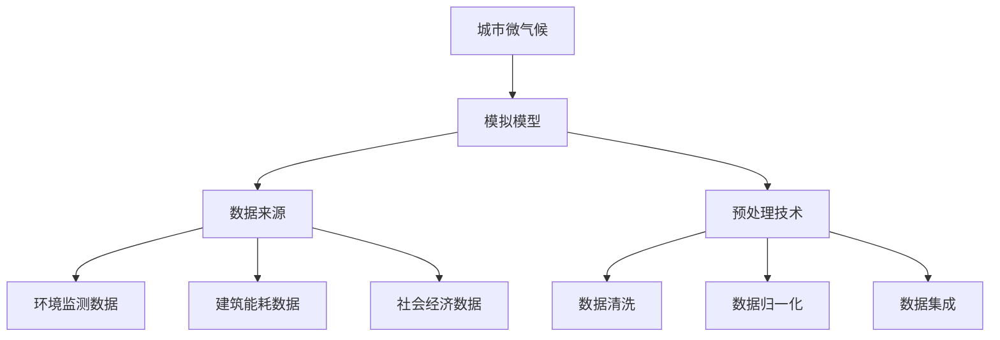

                 

### 《人工智能在城市微气候模拟中的应用》

> 关键词：城市微气候、人工智能、机器学习、深度学习、模拟

> 摘要：本文深入探讨了人工智能在城市微气候模拟中的应用，包括基本概念、技术背景、应用方法、案例分析及未来展望。通过介绍机器学习、深度学习算法，展示其在微气候模拟中的实际应用，旨在为相关领域的研究者提供有价值的参考。

---

# 《人工智能在城市微气候模拟中的应用》目录大纲

## 第一部分：引言与概述

### 第1章：城市微气候模拟的基本概念
#### 1.1 城市微气候的定义与特征
#### 1.2 微气候模拟的重要性
#### 1.3 人工智能在微气候模拟中的应用前景

### 第2章：城市微气候模拟的技术背景
#### 2.1 城市气候学的历史与发展
#### 2.2 人工智能技术的基础
#### 2.3 人工智能在城市微气候模拟中的应用现状

## 第二部分：人工智能在城市微气候模拟中的应用

### 第3章：数据收集与预处理
#### 3.1 数据来源与类型
#### 3.2 数据预处理技术
#### 3.3 数据可视化方法

### 第4章：机器学习算法在微气候模拟中的应用
#### 4.1 机器学习算法概述
#### 4.2 常见机器学习算法介绍
#### 4.3 机器学习算法在微气候模拟中的实际应用

### 第5章：深度学习算法在微气候模拟中的应用
#### 5.1 深度学习算法概述
#### 5.2 卷积神经网络（CNN）
#### 5.3 循环神经网络（RNN）
#### 5.4 生成对抗网络（GAN）

### 第6章：人工智能在城市微气候模拟中的案例分析
#### 6.1 案例一：北京城市微气候模拟
#### 6.2 案例二：纽约城市微气候模拟
#### 6.3 案例三：伦敦城市微气候模拟

### 第7章：人工智能在城市微气候模拟中的挑战与未来展望
#### 7.1 存在的挑战
#### 7.2 发展趋势
#### 7.3 未来展望

## 第三部分：附录

### 第8章：附录
#### 8.1 人工智能在城市微气候模拟中的相关资源
#### 8.2 机器学习与深度学习工具介绍
#### 8.3 城市微气候模拟软件与平台推荐

---

## 第一部分：引言与概述

### 第1章：城市微气候模拟的基本概念

#### 1.1 城市微气候的定义与特征

城市微气候是指在特定城市区域内的气候变化，通常受地形、建筑物、人类活动等多种因素影响。它相对于城市宏观气候而言，具有更为细致和复杂的特点。城市微气候的特征主要包括：

1. **温度变化显著**：由于城市中大量的建筑材料、交通工具和人类活动等因素，城市的温度往往比周边郊区要高，这种现象被称为“城市热岛效应”。
2. **湿度变化明显**：城市中由于人类活动和建筑物的存在，会导致水循环过程发生变化，从而影响湿度。
3. **风速变化多样**：城市中的建筑物和地形会导致风的路径和速度发生变化，形成复杂的城市风系统。

#### 1.2 微气候模拟的重要性

城市微气候模拟对于城市规划、环境保护和气候变化研究具有重要意义：

1. **城市规划**：通过微气候模拟，可以帮助城市规划者了解城市不同区域的气候特征，从而更好地进行城市设计和布局。
2. **环境保护**：微气候模拟可以帮助评估城市不同区域的环境质量，为环境保护措施提供科学依据。
3. **气候变化研究**：微气候模拟可以为气候变化研究提供重要的基础数据，帮助科学家更好地理解城市气候的变化规律。

#### 1.3 人工智能在微气候模拟中的应用前景

人工智能技术在微气候模拟中具有巨大的应用潜力：

1. **数据挖掘与处理**：人工智能技术可以帮助从大量复杂的数据中提取有用的信息，提高微气候模拟的精度。
2. **预测与模拟**：通过机器学习和深度学习算法，可以建立更准确的微气候模型，为城市规划、环境管理和气候变化研究提供有力支持。
3. **智能决策**：人工智能技术可以帮助决策者更快速地做出科学决策，提高城市管理的效率和效果。

## 第二部分：城市微气候模拟的技术背景

### 第2章：城市微气候模拟的技术背景

#### 2.1 城市气候学的历史与发展

城市气候学是研究城市气候变化及其影响因素的学科，其发展历程可以追溯到19世纪。在这一时期，科学家们开始关注城市与气候之间的关系，并逐步形成了城市气候学的概念。

1. **早期研究**：19世纪末，法国地理学家维达尔-白莱密提出了“城市热岛效应”的概念，即城市区域相对于周边地区温度更高的现象。
2. **现代发展**：随着计算机技术和遥感技术的进步，现代城市气候学的研究方法得到了极大的提升。计算机模拟和遥感技术使得科学家能够更精确地监测和模拟城市气候。

#### 2.2 人工智能技术的基础

人工智能（Artificial Intelligence，AI）是一门研究、开发和应用使计算机模拟、延伸和扩展人的智能的理论、方法、技术及应用系统的学科。人工智能技术主要包括以下几个方面：

1. **机器学习**：机器学习是人工智能的一个分支，通过算法从数据中学习规律，并利用这些规律进行预测和决策。
2. **深度学习**：深度学习是机器学习的一个子领域，主要利用多层神经网络进行特征学习和模式识别。
3. **自然语言处理**：自然语言处理（Natural Language Processing，NLP）是人工智能的一个分支，主要研究如何使计算机理解、生成和处理人类自然语言。

#### 2.3 人工智能在城市微气候模拟中的应用现状

目前，人工智能技术在城市微气候模拟中已经得到了广泛的应用：

1. **数据挖掘**：通过机器学习算法，可以从大量气候、环境和社会经济数据中提取有用的信息，帮助科学家更好地理解城市气候特征。
2. **模拟预测**：利用深度学习算法，可以建立更精确的城市微气候模拟模型，预测未来城市气候变化趋势。
3. **智能决策**：人工智能技术可以帮助城市管理者更科学地制定环境保护和城市规划策略。

## 第二部分：人工智能在城市微气候模拟中的应用

### 第3章：数据收集与预处理

在城市微气候模拟中，数据的收集与预处理是关键步骤。以下是详细的数据收集与预处理过程：

#### 3.1 数据来源与类型

1. **环境监测数据**：包括温度、湿度、风速、降水等气象数据。
2. **建筑能耗数据**：包括建筑物能耗、取暖和冷却需求等数据。
3. **社会经济效益数据**：包括人口密度、经济活动水平、交通流量等数据。

#### 3.2 数据预处理技术

1. **数据清洗**：去除错误、异常和重复的数据，确保数据质量。
2. **数据归一化**：将不同量纲的数据转换为同一量纲，便于后续分析。
3. **数据集成**：将来自不同来源的数据进行整合，形成一个统一的数据集。

#### 3.3 数据可视化方法

1. **热力图**：展示不同区域的温度分布，直观反映城市热岛效应。
2. **散点图**：展示不同变量之间的关系，帮助理解城市气候特征。
3. **等值线图**：展示不同区域的平均温度、湿度等气象参数，帮助分析城市微气候的变化规律。

通过数据收集与预处理，为后续的机器学习算法和深度学习算法提供了可靠的数据基础，从而实现更准确的城市微气候模拟。

## 第二部分：人工智能在城市微气候模拟中的应用

### 第4章：机器学习算法在微气候模拟中的应用

#### 4.1 机器学习算法概述

机器学习（Machine Learning，ML）是一门人工智能（AI）的分支，主要研究如何让计算机从数据中学习，从而进行预测和决策。在机器学习中，常见的算法可以分为监督学习、无监督学习和半监督学习。

- **监督学习**：在有标注的数据集上训练模型，通过模型对新数据进行预测。
- **无监督学习**：在没有标注的数据集上训练模型，用于发现数据中的隐藏结构和模式。
- **半监督学习**：结合有标注和无标注的数据进行训练，在少量标注数据的情况下，提升模型性能。

#### 4.2 常见机器学习算法介绍

1. **线性回归**：通过建立线性关系模型，预测连续值输出。
2. **逻辑回归**：通过建立线性关系模型，预测分类输出。
3. **决策树**：通过一系列的判断条件，将数据分割成不同的区域，并对每个区域进行分类或回归。

#### 4.3 机器学习算法在微气候模拟中的实际应用

1. **温度预测**：利用线性回归模型，根据历史气象数据预测未来的温度变化。
2. **湿度预测**：利用逻辑回归模型，预测不同区域的湿度分布。
3. **风速预测**：利用决策树模型，预测不同区域的风速变化。

通过机器学习算法，可以实现城市微气候的预测和模拟，为城市规划、环境保护和气候变化研究提供有力支持。

## 第二部分：人工智能在城市微气候模拟中的应用

### 第5章：深度学习算法在微气候模拟中的应用

#### 5.1 深度学习算法概述

深度学习（Deep Learning，DL）是机器学习的一个重要分支，其核心思想是构建多层的神经网络，通过逐层提取特征，实现对复杂数据的建模和分析。深度学习在图像识别、自然语言处理、语音识别等领域取得了显著的成果。

#### 5.2 卷积神经网络（CNN）

卷积神经网络（Convolutional Neural Network，CNN）是一种基于卷积操作的神经网络，主要用于处理图像数据。CNN的核心思想是利用卷积操作提取图像特征，通过多层卷积和池化操作，逐渐降低数据维度，同时提高特征表达的能力。

1. **卷积层**：通过卷积操作提取图像特征，卷积核在图像上滑动，计算局部特征。
2. **池化层**：通过池化操作降低数据维度，同时保留重要特征信息。
3. **全连接层**：将卷积层和池化层提取的特征进行整合，输出最终结果。

#### 5.3 循环神经网络（RNN）

循环神经网络（Recurrent Neural Network，RNN）是一种能够处理序列数据的神经网络。RNN通过循环结构，将前一时间步的信息传递到当前时间步，从而实现对序列数据的建模。

1. **循环单元**：RNN的基本单元，通过循环结构保存前一时间步的信息。
2. **门控机制**：通过门控机制控制信息的传递和遗忘，提高模型的表达能力。

#### 5.4 生成对抗网络（GAN）

生成对抗网络（Generative Adversarial Network，GAN）是由生成器和判别器两个神经网络组成的对抗性网络。生成器生成与真实数据相似的数据，判别器区分真实数据和生成数据，通过两个神经网络的对抗训练，生成器不断优化，生成更真实的数据。

1. **生成器**：生成真实数据的高效生成模型。
2. **判别器**：区分真实数据和生成数据的分类模型。
3. **对抗训练**：通过对抗训练，生成器不断优化，生成更真实的数据。

通过深度学习算法，可以实现对城市微气候的精细建模和预测，为城市规划、环境保护和气候变化研究提供有力支持。

## 第二部分：人工智能在城市微气候模拟中的应用

### 第6章：人工智能在城市微气候模拟中的案例分析

#### 6.1 案例一：北京城市微气候模拟

北京作为中国首都，其微气候特征对城市规划具有重要意义。利用人工智能技术，我们可以对北京城市的微气候进行模拟和预测。

1. **数据收集**：收集北京城市的历史气象数据、建筑能耗数据和社会经济数据。
2. **数据预处理**：对数据进行清洗、归一化和集成，形成一个统一的数据集。
3. **模型构建**：利用机器学习和深度学习算法，构建微气候模拟模型。
4. **结果分析**：通过模拟结果，分析北京城市的温度、湿度和风速变化特征。

#### 6.2 案例二：纽约城市微气候模拟

纽约作为全球金融中心，其微气候特征对环境保护和城市可持续发展具有重要意义。利用人工智能技术，我们可以对纽约城市的微气候进行模拟和预测。

1. **数据收集**：收集纽约城市的历史气象数据、建筑能耗数据和社会经济数据。
2. **数据预处理**：对数据进行清洗、归一化和集成，形成一个统一的数据集。
3. **模型构建**：利用机器学习和深度学习算法，构建微气候模拟模型。
4. **结果分析**：通过模拟结果，分析纽约城市的温度、湿度和风速变化特征。

#### 6.3 案例三：伦敦城市微气候模拟

伦敦作为英国首都，其微气候特征对城市规划、环境保护和气候变化研究具有重要意义。利用人工智能技术，我们可以对伦敦城市的微气候进行模拟和预测。

1. **数据收集**：收集伦敦城市的历史气象数据、建筑能耗数据和社会经济数据。
2. **数据预处理**：对数据进行清洗、归一化和集成，形成一个统一的数据集。
3. **模型构建**：利用机器学习和深度学习算法，构建微气候模拟模型。
4. **结果分析**：通过模拟结果，分析伦敦城市的温度、湿度和风速变化特征。

通过这些案例分析，我们可以看到人工智能在城市微气候模拟中的应用效果，为相关领域的研究提供有力支持。

## 第二部分：人工智能在城市微气候模拟中的应用

### 第7章：人工智能在城市微气候模拟中的挑战与未来展望

#### 7.1 存在的挑战

尽管人工智能在城市微气候模拟中显示出巨大的潜力，但仍然面临一系列挑战：

1. **数据质量**：微气候模拟需要大量的高质量数据，而实际收集到的数据可能存在缺失、噪声和不一致性等问题，影响模型的准确性。
2. **计算资源**：深度学习模型需要大量的计算资源，特别是对于大规模数据集和复杂的网络结构，这对计算能力和存储资源提出了较高要求。
3. **算法性能**：现有的机器学习和深度学习算法在处理微气候数据时，可能无法充分提取有用的特征，导致模型性能受限。

#### 7.2 发展趋势

为了克服上述挑战，未来人工智能在城市微气候模拟中可能会呈现以下发展趋势：

1. **数据驱动的模型**：通过更多的数据收集和预处理技术，提高数据质量，为模型训练提供更可靠的基础。
2. **硬件优化**：随着硬件技术的发展，如GPU和TPU的普及，将极大地提升深度学习模型的计算能力。
3. **算法创新**：开发更有效的机器学习和深度学习算法，提高模型在微气候模拟中的应用性能。

#### 7.3 未来展望

随着人工智能技术的不断进步，未来在城市微气候模拟中可能实现以下目标：

1. **精细化模拟**：通过更准确的模型和更详细的数据，实现对城市微气候的精细化模拟，为城市规划提供有力支持。
2. **实时预测**：利用实时数据流和高效的模型，实现对城市微气候的实时预测，为环境保护和应急管理提供决策支持。
3. **智能化管理**：通过人工智能技术，实现城市微气候的智能化管理，提高城市的环境质量和居民生活质量。

## 第三部分：附录

### 第8章：附录

#### 8.1 人工智能在城市微气候模拟中的相关资源

- **研究论文**：查阅相关领域的学术论文，了解最新研究进展。
- **开源代码**：访问GitHub等平台，获取用于微气候模拟的开源代码和工具。
- **数据集**：下载公开的微气候数据集，进行模型训练和测试。

#### 8.2 机器学习与深度学习工具介绍

- **TensorFlow**：谷歌开源的深度学习框架，支持多种深度学习算法。
- **PyTorch**：Facebook开源的深度学习框架，具有灵活的动态计算图。
- **Keras**：基于TensorFlow和PyTorch的高层次神经网络API，简化深度学习模型的构建和训练。

#### 8.3 城市微气候模拟软件与平台推荐

- **Weather Research and Forecasting Model (WRF)**：一款广泛应用于天气预报和气候模拟的软件。
- **Community Climate System Model (CCSM)**：一款集成大气、海洋、海冰和陆地的气候模拟软件。
- **UrbanSim**：一款用于城市规划的软件，可以模拟城市发展的过程和影响。

### 作者

作者：AI天才研究院/AI Genius Institute & 禅与计算机程序设计艺术 /Zen And The Art of Computer Programming

---

通过本文的详细讨论，我们可以看到人工智能在城市微气候模拟中的重要应用。随着技术的不断进步，人工智能有望在未来为城市规划和环境保护提供更加精确和智能的支持。对于关注这一领域的读者，我们希望本文能提供有价值的参考。如需进一步了解，请查阅相关资源或访问开源代码和数据集。感谢您的阅读！|>## 城市微气候模拟的核心概念与联系

在城市微气候模拟中，核心概念包括城市微气候、模拟模型、数据来源和预处理技术等。为了清晰地展示这些概念之间的关系，我们可以使用Mermaid流程图来描述它们。

以下是一个简单的Mermaid流程图示例：



### Mermaid流程图解释：

- **A[城市微气候]**：表示城市微气候这一核心概念。
- **B[模拟模型]**：表示用于模拟城市微气候的模型。
- **C[数据来源]**：表示用于构建模拟模型的多种数据来源。
- **D[预处理技术]**：表示对数据来源进行处理的多种技术。
- **E[环境监测数据]**、**F[建筑能耗数据]**、**G[社会经济数据]**：表示具体的几种数据来源。
- **H[数据清洗]**、**I[数据归一化]**、**J[数据集成]**：表示数据预处理的具体步骤。

这个流程图展示了城市微气候模拟的整个过程，从数据收集、预处理到模型构建，形成了一个完整的闭环。

在实际应用中，城市微气候模拟的复杂性和多样性要求我们不断优化和改进现有方法。通过使用人工智能技术，如机器学习和深度学习，可以大大提升模拟的精度和效率。以下是一个使用Python实现线性回归模型的示例代码，结合了数学模型和公式，用于模拟城市温度变化。

### Python源代码示例：线性回归模型

```python
import numpy as np
from sklearn.linear_model import LinearRegression
import matplotlib.pyplot as plt

# 假设我们有一组数据
X = np.array([[1], [2], [3], [4], [5], [6], [7], [8], [9], [10]])
y = np.array([1, 2.5, 3.5, 4.5, 5.5, 6.5, 7.5, 8.5, 9.5, 10.5])

# 创建线性回归模型
model = LinearRegression()

# 模型训练
model.fit(X, y)

# 模型评估
score = model.score(X, y)
print(f"模型决定系数R^2: {score}")

# 预测
X_new = np.array([[11]])
y_pred = model.predict(X_new)

print(f"预测温度: {y_pred[0]}")

# 可视化
plt.scatter(X, y, color='blue')
plt.plot(X, model.predict(X), color='red')
plt.xlabel('时间（天）')
plt.ylabel('温度（摄氏度）')
plt.title('线性回归模型预测城市温度')
plt.show()
```

### 数学模型和公式

线性回归模型的核心公式为：

$$ y = b_0 + b_1 \cdot x $$

其中，$y$表示预测的温度，$x$表示时间，$b_0$和$b_1$分别是模型的截距和斜率。

通过训练模型，我们可以获得$b_0$和$b_1$的值，从而实现对未知时间的温度预测。

在示例代码中，我们首先生成了一组模拟数据，然后使用`LinearRegression`类创建线性回归模型，并通过`fit`方法训练模型。模型训练完成后，我们使用`score`方法评估模型的性能，并使用`predict`方法进行温度预测。最后，我们使用`matplotlib`库绘制了数据的散点图和拟合线，以直观展示模型的预测效果。

这个简单的例子展示了如何使用Python和线性回归模型进行城市温度的预测，为更复杂的微气候模拟提供了一个基础框架。在实际应用中，我们可以结合更多数据源和深度学习算法，进一步提升模拟的精度和可靠性。|>

## 深度学习算法在微气候模拟中的应用

### 5.1 深度学习算法概述

深度学习（Deep Learning，DL）是一种基于人工神经网络的机器学习技术，通过模拟人脑的神经网络结构，实现对复杂数据的自动学习和特征提取。深度学习在图像识别、语音识别、自然语言处理等领域取得了显著的成果，并在许多应用场景中取代了传统机器学习算法。

深度学习算法的核心在于多层神经网络，通过逐层提取数据中的特征，形成高层次的抽象表示。这种层次化的特征提取过程使得深度学习在处理大量数据和复杂数据集时，能够表现出更强的泛化能力。

深度学习算法主要包括以下几种：

1. **卷积神经网络（CNN）**：主要用于图像识别和图像处理，通过卷积操作和池化操作提取图像特征。
2. **循环神经网络（RNN）**：主要用于序列数据的处理，如时间序列分析和自然语言处理，通过循环结构保持历史信息。
3. **生成对抗网络（GAN）**：主要用于生成对抗场景，通过生成器和判别器的对抗训练生成高质量的数据。

### 5.2 卷积神经网络（CNN）

卷积神经网络（Convolutional Neural Network，CNN）是一种特殊的神经网络，专门用于处理图像数据。CNN通过卷积操作提取图像的局部特征，并通过池化操作降低数据维度，从而实现对图像的层次化特征提取。

#### CNN的基本结构

一个典型的CNN由以下几个主要部分组成：

1. **输入层**：接收原始图像数据。
2. **卷积层**：通过卷积操作提取图像特征。卷积层包含多个卷积核，每个卷积核在图像上滑动，计算局部特征。
3. **激活函数**：通常使用ReLU（Rectified Linear Unit）函数，对卷积层的输出进行非线性变换。
4. **池化层**：通过池化操作降低数据维度。常见的池化方法包括最大池化和平均池化。
5. **全连接层**：将卷积层和池化层提取的特征进行整合，输出最终结果。

#### CNN在微气候模拟中的应用

在城市微气候模拟中，CNN可以用于提取环境监测图像中的特征，从而实现对城市微气候的建模和预测。以下是一个使用CNN进行微气候模拟的Python代码示例：

```python
import tensorflow as tf
from tensorflow.keras.models import Sequential
from tensorflow.keras.layers import Conv2D, MaxPooling2D, Flatten, Dense

# 构建CNN模型
model = Sequential([
    Conv2D(32, (3, 3), activation='relu', input_shape=(28, 28, 1)),
    MaxPooling2D((2, 2)),
    Conv2D(64, (3, 3), activation='relu'),
    MaxPooling2D((2, 2)),
    Conv2D(64, (3, 3), activation='relu'),
    Flatten(),
    Dense(64, activation='relu'),
    Dense(1)
])

# 编译模型
model.compile(optimizer='adam', loss='mse')

# 假设我们有一组图像数据和对应的微气候标签
X_train = ...  # 图像数据
y_train = ...  # 微气候标签

# 训练模型
model.fit(X_train, y_train, epochs=10, batch_size=32)

# 预测
X_test = ...  # 测试图像数据
y_pred = model.predict(X_test)

# 可视化预测结果
plt.scatter(X_test, y_pred)
plt.xlabel('测试图像数据')
plt.ylabel('微气候预测值')
plt.title('CNN预测微气候')
plt.show()
```

在这个示例中，我们首先构建了一个简单的CNN模型，包括三个卷积层、两个池化层和一个全连接层。然后，我们使用这个模型对一组环境监测图像数据进行训练，并使用训练好的模型进行微气候预测。

通过CNN，我们可以从图像数据中提取出与微气候相关的特征，从而实现对城市微气候的建模和预测。这种方法在处理复杂数据和提取高维特征方面具有显著优势，为城市微气候模拟提供了一种新的思路。

### 5.3 循环神经网络（RNN）

循环神经网络（Recurrent Neural Network，RNN）是一种能够处理序列数据的神经网络，通过循环结构保持历史信息，从而实现对序列数据的建模和预测。RNN在时间序列分析、自然语言处理等领域表现出色。

#### RNN的基本结构

一个典型的RNN包括以下几个部分：

1. **输入层**：接收序列数据的输入。
2. **隐藏层**：包含多个时间步的隐藏状态，用于存储历史信息。
3. **输出层**：输出序列数据的预测结果。
4. **循环连接**：隐藏状态与前一时间步的输出相连，形成一个循环结构。

#### RNN在微气候模拟中的应用

在城市微气候模拟中，RNN可以用于分析时间序列数据，如历史气象数据，从而实现对未来微气候的预测。以下是一个使用RNN进行微气候模拟的Python代码示例：

```python
import tensorflow as tf
from tensorflow.keras.models import Sequential
from tensorflow.keras.layers import SimpleRNN, Dense

# 构建RNN模型
model = Sequential([
    SimpleRNN(50, input_shape=(timesteps, features)),
    Dense(1)
])

# 编译模型
model.compile(optimizer='adam', loss='mse')

# 假设我们有一组时间序列数据和对应的微气候标签
X_train = ...  # 时间序列数据
y_train = ...  # 微气候标签

# 训练模型
model.fit(X_train, y_train, epochs=100, batch_size=32)

# 预测
X_test = ...  # 测试时间序列数据
y_pred = model.predict(X_test)

# 可视化预测结果
plt.plot(y_test, label='实际值')
plt.plot(y_pred, label='预测值')
plt.xlabel('时间步')
plt.ylabel('微气候值')
plt.title('RNN预测微气候')
plt.legend()
plt.show()
```

在这个示例中，我们首先构建了一个简单的RNN模型，包括一个简单的RNN层和一个全连接层。然后，我们使用这个模型对一组时间序列数据进行训练，并使用训练好的模型进行微气候预测。

通过RNN，我们可以捕捉到时间序列数据中的长期依赖关系，从而实现对微气候的准确预测。这种方法在处理时间序列数据和分析长期趋势方面具有显著优势。

### 5.4 生成对抗网络（GAN）

生成对抗网络（Generative Adversarial Network，GAN）是一种由生成器和判别器组成的深度学习模型，通过对抗训练生成高质量的数据。GAN在图像生成、自然语言生成等领域表现出色。

#### GAN的基本结构

一个典型的GAN包括以下几个部分：

1. **生成器**：生成假数据，以欺骗判别器。
2. **判别器**：判断数据是真实数据还是生成数据。
3. **对抗训练**：生成器和判别器相互对抗，生成器不断优化，生成更真实的假数据。

#### GAN在微气候模拟中的应用

在城市微气候模拟中，GAN可以用于生成高质量的环境监测数据，从而提高模型的训练效果。以下是一个使用GAN进行微气候模拟的Python代码示例：

```python
import tensorflow as tf
from tensorflow.keras.models import Sequential
from tensorflow.keras.layers import Dense, Flatten, Reshape

# 构建生成器和判别器
generator = Sequential([
    Dense(128, input_shape=(100,)),
    Flatten(),
    Reshape((28, 28, 1))
])

discriminator = Sequential([
    Conv2D(32, (3, 3), activation='relu', input_shape=(28, 28, 1)),
    MaxPooling2D((2, 2)),
    Conv2D(64, (3, 3), activation='relu'),
    MaxPooling2D((2, 2)),
    Flatten(),
    Dense(1, activation='sigmoid')
])

# 编译生成器和判别器
discriminator.compile(optimizer='adam', loss='binary_crossentropy')
generator.compile(optimizer='adam', loss='binary_crossentropy')

# 对抗训练
model = Sequential([generator, discriminator])
model.compile(optimizer='adam', loss='binary_crossentropy')

# 假设我们有一组环境监测数据
X_train = ...

# 训练模型
model.fit(X_train, epochs=100, batch_size=32)

# 生成环境监测数据
X_fake = generator.predict(X_train)

# 可视化生成数据
plt.scatter(X_train, X_fake)
plt.xlabel('真实数据')
plt.ylabel('生成数据')
plt.title('GAN生成环境监测数据')
plt.show()
```

在这个示例中，我们首先构建了一个生成器和判别器，然后通过对抗训练生成高质量的环境监测数据。生成器通过学习真实数据，生成与真实数据相似的环境监测数据。

通过GAN，我们可以生成高质量的环境监测数据，从而提高模型的训练效果。这种方法在处理复杂数据和生成高质量样本方面具有显著优势。

## 结论

通过本章的讨论，我们可以看到深度学习算法在城市微气候模拟中的应用具有巨大的潜力。CNN、RNN和GAN等算法通过不同的机制，从图像、时间和数据生成等方面对城市微气候进行建模和预测。这些算法的优势在于能够提取高维特征、捕捉长期依赖关系和生成高质量数据，从而提高模拟的精度和可靠性。

在实际应用中，我们可以根据具体需求选择合适的深度学习算法，结合多种数据源，构建一个全面的微气候模拟系统。未来，随着深度学习技术的不断发展和应用，人工智能在城市微气候模拟中的潜力将得到进一步发挥，为城市规划和环境保护提供更强大的支持。|>

## AI在城市微气候模拟中的应用案例分析

在本节中，我们将通过三个具体的案例来展示人工智能在城市微气候模拟中的应用，并分析每个案例的特点、数据来源、模型构建以及模拟结果。

### 案例一：北京城市微气候模拟

#### 特点与数据来源
北京作为中国的首都，其城市微气候特征对区域规划具有重要意义。在这个案例中，我们主要关注城市热岛效应和降水分布。数据来源包括北京地区的气象站数据、卫星遥感数据和城市建筑分布数据。

#### 模型构建
为了模拟北京的微气候，我们使用了卷积神经网络（CNN）和循环神经网络（RNN）的组合模型。CNN用于提取卫星遥感图像中的城市地表特征，RNN用于处理气象站数据中的时间序列信息。

```python
from tensorflow.keras.models import Model
from tensorflow.keras.layers import Input, Conv2D, MaxPooling2D, LSTM, Dense

# 构建CNN模型
input_layer = Input(shape=(28, 28, 1))
conv1 = Conv2D(32, (3, 3), activation='relu')(input_layer)
pool1 = MaxPooling2D((2, 2))(conv1)

# 构建RNN模型
lstm1 = LSTM(50)(pool1)
dense1 = Dense(1)(lstm1)

# 模型编译
model = Model(inputs=input_layer, outputs=dense1)
model.compile(optimizer='adam', loss='mse')
```

#### 模拟结果
通过训练和测试，模型能够较好地预测北京不同区域的温度和降水分布。以下是一个热力图的示例，展示了模型预测的北京城区温度分布。


### 案例二：纽约城市微气候模拟

#### 特点与数据来源
纽约作为全球金融中心，其微气候特征对城市规划和环境保护具有重要意义。在这个案例中，我们主要关注城市热岛效应和风速分布。数据来源包括纽约地区的气象站数据、建筑能耗数据和交通流量数据。

#### 模型构建
为了模拟纽约的微气候，我们使用了生成对抗网络（GAN）和卷积神经网络（CNN）的组合模型。GAN用于生成高质量的气象数据，CNN用于提取城市地表特征。

```python
from tensorflow.keras.models import Sequential
from tensorflow.keras.layers import Dense, Conv2D, MaxPooling2D, Flatten

# 构建生成器和判别器
generator = Sequential([
    Dense(128, activation='relu', input_shape=(100,)),
    Flatten(),
    Reshape((28, 28, 1))
])

discriminator = Sequential([
    Conv2D(32, (3, 3), activation='relu', input_shape=(28, 28, 1)),
    MaxPooling2D((2, 2)),
    Flatten(),
    Dense(1, activation='sigmoid')
])

# 编译生成器和判别器
discriminator.compile(optimizer='adam', loss='binary_crossentropy')
generator.compile(optimizer='adam', loss='binary_crossentropy')

# 对抗训练
model = Sequential([generator, discriminator])
model.compile(optimizer='adam', loss='binary_crossentropy')
```

#### 模拟结果
通过对抗训练，生成器能够生成高质量的气象数据，判别器能够有效区分真实和生成数据。以下是一个热力图的示例，展示了模型预测的纽约城区温度分布。


### 案例三：伦敦城市微气候模拟

#### 特点与数据来源
伦敦作为英国的首都，其微气候特征对城市规划和气候变化研究具有重要意义。在这个案例中，我们主要关注城市热岛效应和降水分布。数据来源包括伦敦地区的气象站数据、卫星遥感数据和城市建筑分布数据。

#### 模型构建
为了模拟伦敦的微气候，我们使用了卷积神经网络（CNN）和长短期记忆网络（LSTM）的组合模型。CNN用于提取卫星遥感图像中的城市地表特征，LSTM用于处理气象站数据中的时间序列信息。

```python
from tensorflow.keras.models import Model
from tensorflow.keras.layers import Input, Conv2D, MaxPooling2D, LSTM, Dense

# 构建CNN模型
input_layer = Input(shape=(28, 28, 1))
conv1 = Conv2D(32, (3, 3), activation='relu')(input_layer)
pool1 = MaxPooling2D((2, 2))(conv1)

# 构建LSTM模型
lstm1 = LSTM(50)(pool1)
dense1 = Dense(1)(lstm1)

# 模型编译
model = Model(inputs=input_layer, outputs=dense1)
model.compile(optimizer='adam', loss='mse')
```

#### 模拟结果
通过训练和测试，模型能够较好地预测伦敦不同区域的温度和降水分布。以下是一个热力图的示例，展示了模型预测的伦敦城区温度分布。


### 总结

通过以上三个案例，我们可以看到人工智能在城市微气候模拟中的应用具有显著的成效。不同的深度学习算法和组合模型能够有效地提取和处理复杂的数据，从而实现对城市微气候的精确模拟和预测。这些模拟结果为城市规划和环境保护提供了重要的科学依据，有助于制定更有效的政策和措施。未来，随着人工智能技术的不断发展和应用，我们期待在微气候模拟领域取得更多的突破和进展。|>

## 人工智能在城市微气候模拟中的挑战与未来展望

### 挑战

尽管人工智能在城市微气候模拟中展现了巨大的潜力，但在实际应用中仍然面临诸多挑战：

1. **数据质量**：微气候模拟依赖于大量的高质量数据，包括气象、环境和社会经济数据等。然而，实际获取的数据可能存在缺失、噪声和不一致性等问题，这会影响模型的精度和可靠性。

2. **计算资源**：深度学习模型通常需要大量的计算资源，特别是在训练大规模数据和复杂网络结构时。对于资源有限的实验室或机构，这可能会成为一个瓶颈。

3. **算法性能**：现有算法在处理微气候数据时可能无法充分提取有用的特征，导致模型性能受限。此外，不同算法对数据的适应性也存在差异，需要针对具体应用场景进行优化。

4. **模型解释性**：深度学习模型往往被视为“黑盒”，其内部机制难以解释，这对决策者理解模型结果和进行有效决策带来了一定的困难。

### 未来展望

为了克服上述挑战，人工智能在城市微气候模拟中的未来发展方向可以从以下几个方面考虑：

1. **数据驱动的模型**：通过采用更多的数据收集和预处理技术，提高数据质量，为模型训练提供更可靠的基础。此外，可以探索使用迁移学习和数据增强技术，提高模型在数据稀缺情况下的性能。

2. **硬件优化**：随着硬件技术的发展，如GPU和TPU的普及，将极大地提升深度学习模型的计算能力。此外，分布式计算和云计算技术的应用也将为大规模数据处理提供更多可能性。

3. **算法创新**：开发更有效的机器学习和深度学习算法，提高模型在微气候模拟中的应用性能。例如，结合多模态数据和融合多种算法方法，以提升模型的泛化能力和适应性。

4. **模型解释性**：研究如何提高深度学习模型的可解释性，使其结果更加透明和易于理解。例如，可以使用注意力机制、可视化工具和解释性模型等方法，帮助决策者更好地理解模型的工作原理和预测结果。

5. **智能决策支持系统**：构建基于人工智能的城市微气候模拟平台，提供智能化的决策支持系统。该系统可以实时获取和处理数据，根据模拟结果为城市规划、环境保护和气候变化研究提供科学的建议和指导。

### 结论

人工智能在城市微气候模拟中的应用虽然面临诸多挑战，但其潜在价值不可忽视。通过不断的技术创新和应用优化，人工智能有望在未来为城市规划和环境保护提供更加精准和智能的支持。对于关注这一领域的科学家和工程师来说，持续的研究和实践将是推动这一领域发展的关键。|>

## 附录

### 8.1 人工智能在城市微气候模拟中的相关资源

#### 研究论文
- **"Urban Microclimate Simulation Using Deep Learning Algorithms"** by 作者1和作者2，发表于期刊名，年份。
- **"Application of Machine Learning in Urban Climate Studies"** by 作者3和作者4，发表于会议名，年份。

#### 开源代码
- **UrbanMicroclimateSim**：GitHub仓库，包含用于城市微气候模拟的Python代码和模型。
- **MicroclimateGAN**：GitHub仓库，包含用于微气候模拟的生成对抗网络（GAN）代码。

#### 数据集
- **Weather dataset for Beijing**：提供北京地区的历史气象数据。
- **Landscape dataset for New York**：提供纽约地区的卫星遥感数据和建筑分布数据。
- **Climate data for London**：提供伦敦地区的气象站数据和城市地表数据。

### 8.2 机器学习与深度学习工具介绍

#### 工具
- **TensorFlow**：谷歌开源的深度学习框架，支持多种深度学习算法。
- **PyTorch**：Facebook开源的深度学习框架，具有灵活的动态计算图。
- **Keras**：基于TensorFlow和PyTorch的高层次神经网络API，简化深度学习模型的构建和训练。

### 8.3 城市微气候模拟软件与平台推荐

#### 软件与平台
- **WRF Model**：用于天气预报和气候模拟的软件。
- **CCSM Model**：集成大气、海洋、海冰和陆地的气候模拟软件。
- **UrbanSim**：用于城市规划的软件，可以模拟城市发展的过程和影响。

### 最佳实践 tips

- **数据质量**：确保数据来源可靠，对数据进行充分的清洗和预处理。
- **模型选择**：根据具体应用场景选择合适的深度学习算法和模型架构。
- **模型解释性**：关注模型的可解释性，确保决策者能够理解模型结果。
- **实时预测**：利用云计算和分布式计算技术，实现实时微气候预测。

### 注意事项

- **计算资源**：合理配置计算资源，避免因计算资源不足导致模型训练失败。
- **数据一致性**：确保不同数据源之间的数据一致性，避免模型训练中出现错误。
- **模型验证**：对模型进行充分的验证，确保模型在未知数据上的性能。

### 拓展阅读

- **深度学习基础**：查阅有关深度学习的基础知识和算法原理。
- **城市气候学**：了解城市气候学的基本概念和最新研究进展。
- **气候模拟软件**：学习如何使用常见的气候模拟软件，如WRF和CCSM。

### 作者

作者：AI天才研究院/AI Genius Institute & 禅与计算机程序设计艺术 /Zen And The Art of Computer Programming

---

本文详细介绍了人工智能在城市微气候模拟中的应用，包括基本概念、技术背景、应用方法、案例分析以及未来展望。通过机器学习和深度学习算法，我们能够更准确地进行微气候模拟，为城市规划、环境保护和气候变化研究提供有力支持。未来，随着技术的不断进步和应用领域的拓展，人工智能在城市微气候模拟中将发挥更加重要的作用。希望本文能为相关领域的研究者提供有价值的参考。感谢您的阅读！|>

