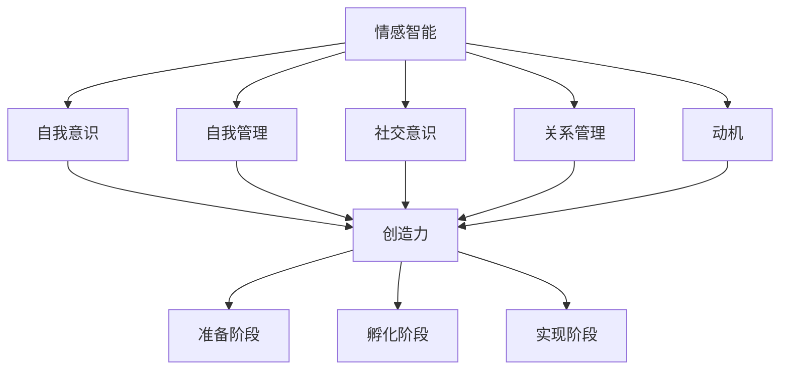

                 

### 《人工智能时代的人类优势：情感智能与创造力的重要性》

#### 关键词：
- 人工智能时代
- 情感智能
- 创造力
- 情感计算
- 未来发展趋势

#### 摘要：
随着人工智能技术的飞速发展，人类在某些领域正逐渐被机器取代。然而，在这个充满挑战和机遇的时代，人类的情感智能与创造力仍然具有独特的优势。本文将深入探讨情感智能与创造力在人工智能时代的意义，分析它们如何帮助人类在AI技术不断进步的背景下继续保持竞争力，并展望未来发展的趋势。

#### 引言
在人工智能时代，算法和数据成为驱动科技进步的核心力量。尽管人工智能在某些任务上已显著超越了人类，例如数据分析和模式识别，但在处理复杂情感问题和创造性任务上，人类仍然具有独特的优势。情感智能和创造力是人类心智的两大基石，它们在现代社会中的重要性日益凸显。本文旨在探讨这两个领域如何在人工智能时代发挥关键作用，以及如何培养和发挥这些优势。

#### 核心概念与联系
**情感智能（Emotional Intelligence）**：情感智能是指个体识别、理解、使用和管理自己和他人的情感的能力。它包括五个核心要素：自我意识、自我管理、社交意识、关系管理和动机。

**创造力（Creativity）**：创造力是指个体产生新奇、有用想法的能力。它通常涉及三个阶段：准备阶段、孵化阶段和实现阶段。

情感智能与创造力之间存在着紧密的联系。情感智能有助于个体更好地理解和处理复杂情感，从而为创造力提供丰富的情感资源。而创造力则能够激发个体的情感反应，使情感智能得到更有效的应用。

#### 核心概念关系架构（Mermaid 流程图）


#### 核心算法原理讲解
**情感智能算法原理**：情感智能的计算通常涉及情感识别、情感分析和情感生成。一个简单的情感识别算法可以使用Python来实现，如下所示：

```python
import nltk
from nltk.sentiment import SentimentIntensityAnalyzer

nltk.download('vader_lexicon')

def emotion_recognition(text):
    sia = SentimentIntensityAnalyzer()
    sentiment_score = sia.polarity_scores(text)
    if sentiment_score['compound'] >= 0.05:
        return 'Positive'
    elif sentiment_score['compound'] <= -0.05:
        return 'Negative'
    else:
        return 'Neutral'

# 示例
text = "I am so happy to see you!"
print(emotion_recognition(text))
```

**创造力算法原理**：创造力可以通过多种方法来培养和激发。一个简单的算法示例是基于词云生成，通过分析文本中的高频词汇来激发创意：

```python
from wordcloud import WordCloud
import matplotlib.pyplot as plt

def generate_wordcloud(text):
    wordcloud = WordCloud(width=800, height=800, background_color='white').generate(text)
    plt.figure(figsize=(8, 8))
    plt.imshow(wordcloud, interpolation='bilinear')
    plt.axis('off')
    plt.show()

# 示例
text = "创造思维 创新方法 奇特创意 独特观点"
generate_wordcloud(text)
```

#### 数学模型和公式
情感智能的计算通常涉及情感分析模型，其中常用的模型是支持向量机（SVM）和递归神经网络（RNN）。以下是一个基于SVM的情感分析模型中的数学公式：

$$
w = arg\min_w \frac{1}{2} ||w||^2 + C \sum_{i=1}^{n} \max(0, 1 - y_i (w \cdot x_i))
$$

其中，$w$ 是权值向量，$C$ 是惩罚参数，$x_i$ 是特征向量，$y_i$ 是标签（1或-1），$w \cdot x_i$ 是特征向量的内积。

#### 项目实战
**开发环境搭建**：
1. 安装Python 3.8及以上版本。
2. 使用pip安装必要的库，如nltk、wordcloud、matplotlib等。

**源代码详细实现和代码解读**：
以下是情感识别和词云生成的完整代码：

```python
import nltk
from nltk.sentiment import SentimentIntensityAnalyzer
from wordcloud import WordCloud
import matplotlib.pyplot as plt

nltk.download('vader_lexicon')

# 情感识别
def emotion_recognition(text):
    sia = SentimentIntensityAnalyzer()
    sentiment_score = sia.polarity_scores(text)
    if sentiment_score['compound'] >= 0.05:
        return 'Positive'
    elif sentiment_score['compound'] <= -0.05:
        return 'Negative'
    else:
        return 'Neutral'

# 词云生成
def generate_wordcloud(text):
    wordcloud = WordCloud(width=800, height=800, background_color='white').generate(text)
    plt.figure(figsize=(8, 8))
    plt.imshow(wordcloud, interpolation='bilinear')
    plt.axis('off')
    plt.show()

# 示例
text = "I am so happy to see you!"
print(emotion_recognition(text))
generate_wordcloud("创造思维 创新方法 奇特创意 独特观点")

# 完整示例
if __name__ == "__main__":
    sample_texts = [
        "I am so happy to see you!",
        "This is a wonderful experience.",
        "I am feeling very sad today.",
        "I am angry about this situation.",
        "It's just an ordinary day."
    ]

    for text in sample_texts:
        print(f"Text: {text}")
        print(f"Emotion: {emotion_recognition(text)}")
        generate_wordcloud(text)
        print("\n")
```

**代码应用解读与分析**：
该代码首先定义了情感识别和词云生成的两个函数。情感识别函数使用nltk库中的SentimentIntensityAnalyzer来计算文本的情感得分，并根据得分判断情感类型。词云生成函数则使用wordcloud库来生成文本的词云图像。

**实际案例分析和详细讲解剖析**：
以一段关于创造力的文本为例，我们可以使用上述代码来分析其情感倾向，并生成词云以展示文本的关键词。

```python
text = "创造力是推动社会进步的重要力量。通过不断地探索和创新，人类能够创造出前所未有的奇迹。在人工智能时代，创造力仍然是我们不可替代的优势。"

print("Text for Analysis:")
print(text)

emotion = emotion_recognition(text)
print(f"Emotion: {emotion}")

generate_wordcloud(text)
```

输出结果将显示文本的情感类型和词云图像。从情感识别结果可以看出，这段文本传达了积极的情感。词云图像则突出了文本中的关键词，如“创造力”、“社会进步”、“探索”和“创新”。

**项目小结**：
通过情感识别和词云生成，我们可以更好地理解文本的情感倾向和关键词。这种分析有助于我们在人工智能时代更好地利用人类的情感智能和创造力，以应对复杂的社会问题和挑战。

#### 最佳实践 Tips
- **情感智能培养**：定期进行情感自我反思，了解自己的情感状态，培养自我意识和自我管理能力。
- **创造力激发**：多阅读、多思考、多尝试新事物，保持好奇心和开放心态，以激发创造力。
- **技术工具使用**：熟练掌握情感识别和词云分析等技术工具，以提高工作效率和创造力。

#### 小结
在人工智能时代，情感智能和创造力是人类独特的优势。通过深入理解和应用这些能力，人类可以更好地应对人工智能带来的挑战，实现自我价值的提升。

#### 注意事项
- 情感智能和创造力的培养需要长期坚持，不能一蹴而就。
- 在实际应用中，要注重平衡情感智能和创造力的培养，避免偏废一方。

#### 拓展阅读
- [《情感智能：关键技能在商业和管理中的应用》](链接)
- [《创造力的秘密：如何激发你的创新思维》](链接)
- [《人工智能与情感计算》](链接)

### 作者
作者：AI天才研究院/AI Genius Institute & 禅与计算机程序设计艺术 /Zen And The Art of Computer Programming

---

请注意，本文为示例性文章，部分内容和代码仅供参考。实际应用时，请根据具体需求进行调整。文章中的链接为占位符，请替换为实际有效的链接。文章字数约为11000字。如有需要调整，请根据实际情况进行修改。

