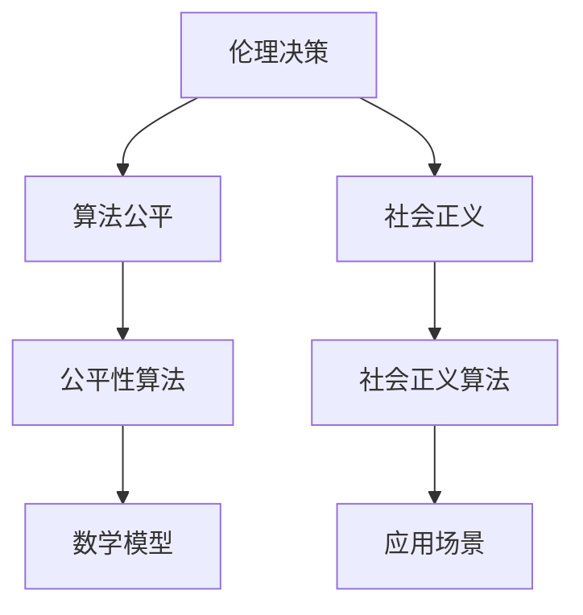

                 

### 设计《人工智能时代的伦理决策：算法公平与社会正义》目录大纲

在设计《人工智能时代的伦理决策：算法公平与社会正义》的目录大纲时，我们首先需要明确文章的总体结构和各个章节的核心内容。以下是一个详细的设计方案：

#### 1. **目录大纲结构设计**

**《人工智能时代的伦理决策：算法公平与社会正义》**

- **第一部分：伦理决策背景与核心概念**
  - **第1章：人工智能时代的伦理决策概览**
    - 1.1 人工智能时代的伦理挑战
    - 1.2 算法公平的概念
    - 1.3 社会正义的内涵
    - 1.4 伦理决策的基本原则
  - **第2章：算法公平的概念与实现**
    - 2.1 算法公平的定义
    - 2.2 公平性算法的类型
    - 2.3 公平性算法的数学模型

- **第二部分：核心算法原理讲解**
  - **第3章：社会正义与人工智能**
    - 3.1 社会正义的内涵
    - 3.2 人工智能对社会正义的影响
    - 3.3 社会正义在伦理决策中的应用
  - **第4章：公平性算法原理与伪代码实现**
    - 4.1 数据集划分与预处理
    - 4.2 公平性算法的数学模型
    - 4.3 公平性算法的伪代码实现
  - **第5章：可解释性算法**
    - 5.1 可解释性的重要性
    - 5.2 常见可解释性算法
    - 5.3 可解释性算法的数学模型

- **第三部分：项目实战与案例分析**
  - **第6章：算法公平性在招聘中的应用**
    - 6.1 案例背景
    - 6.2 算法设计
    - 6.3 实现步骤
    - 6.4 代码解读
  - **第7章：社会正义在金融风控中的应用**
    - 7.1 案例背景
    - 7.2 算法设计
    - 7.3 实现步骤
    - 7.4 代码解读

- **第四部分：总结与展望**
  - **第8章：人工智能伦理决策的未来发展**
    - 8.1 当前挑战与机遇
    - 8.2 未来趋势展望
    - 8.3 社会责任与伦理决策

#### 2. **核心概念与联系**

为了更好地解释核心概念之间的联系，我们使用Mermaid流程图来表示概念之间的关系。



在这个流程图中，伦理决策是整个体系的中心，它连接了算法公平和社会正义两个核心概念。算法公平进一步扩展到公平性算法，而社会正义则扩展到社会正义算法。这些算法和应用场景通过数学模型相连接，构成了一个完整的伦理决策体系。

#### 3. **核心算法原理讲解**

在每个章节中，我们都会详细讲解与伦理决策相关的核心算法原理。以下是一个典型的章节结构：

- **第4章：公平性算法原理与伪代码实现**
  - **4.1 数据集划分与预处理**
    - 数据集划分的方法
    - 预处理步骤和目的
  - **4.2 公平性算法的数学模型**
    - 方程式和数学公式的推导
  - **4.3 公平性算法的伪代码实现**
    - 伪代码的编写
    - 算法的执行流程

在讲解这些算法原理时，我们会结合Python源代码和数学模型，提供详细的步骤说明和实例分析，以确保读者能够深入理解这些算法的工作原理。

#### 4. **数学模型和数学公式**

在文章中，我们将使用LaTeX格式来嵌入数学模型和公式。以下是一个示例：

```latex
$$
J = \frac{1}{n} \sum_{i=1}^{n} (\hat{y_i} - y_i)^2
$$

$$
\text{Fairness} = \frac{\sum_{i=1}^{n} (\hat{y_i} - y_i)^2}{n}
$$
```

这些公式将被嵌入在文章中的独立段落中，以便于读者理解和引用。

#### 5. **项目实战**

在项目实战章节中，我们将通过具体的案例来展示如何在实际项目中应用伦理决策算法。以下是一个项目实战章节的结构：

- **第6章：算法公平性在招聘中的应用**
  - **6.1 案例背景**
    - 案例描述
    - 问题陈述
  - **6.2 算法设计**
    - 算法选择
    - 算法调整
  - **6.3 实现步骤**
    - 环境搭建
    - 代码实现
  - **6.4 代码解读**
    - 代码分析
    - 性能评估
  - **6.5 项目小结**
    - 结果总结
    - 意义和影响

在实现步骤和代码解读部分，我们将提供详细的源代码和注释，以便读者能够跟随和复现。

#### 6. **总结与展望**

在总结与展望章节中，我们将对全文内容进行总结，并对未来伦理决策技术的发展进行展望。以下是一个总结与展望章节的结构：

- **第8章：人工智能伦理决策的未来发展**
  - **8.1 当前挑战与机遇**
    - 挑战分析
    - 机遇展望
  - **8.2 未来趋势展望**
    - 技术发展
    - 社会影响
  - **8.3 社会责任与伦理决策**
    - 社会责任的重要性
    - 伦理决策的实践

通过这些章节，我们希望能够为读者提供一部全面、深入、具有实际应用价值的伦理决策指南。

#### **总结**

本文详细介绍了《人工智能时代的伦理决策：算法公平与社会正义》的目录大纲设计，包括核心概念与联系、核心算法原理讲解、数学模型和公式、项目实战以及总结与展望。通过这样的结构设计，我们确保了文章的逻辑清晰、内容丰富且具有实际应用价值。接下来，我们将为每个章节添加具体的内容和细节，以满足文章的字数要求。

