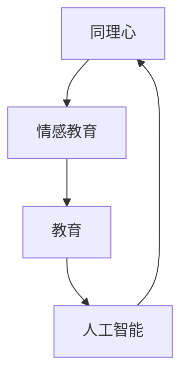

                 

### 人工智能时代的情感教育：培养同理心的重要性

**关键词**: 人工智能，情感教育，同理心，教育变革，神经网络，算法

**摘要**:
随着人工智能（AI）技术的飞速发展，教育领域正经历深刻的变革。在AI时代，情感教育的重要性愈发凸显，其中培养同理心成为教育核心。本文首先探讨了AI时代的到来及教育变革的背景，接着深入分析了同理心的定义、特征及其在教育中的重要性。通过结合神经网络算法和Python代码示例，本文进一步阐释了如何通过算法和编程来培养同理心。最后，通过实际案例展示了同理心教育的实践效果，并提出了未来的发展展望。

### 引言与背景

**1. 引言**

**人工智能时代的到来**  
人工智能（AI）作为当今科技领域的核心驱动力，已经深刻地改变了我们的生活、工作和思维方式。从智能家居到自动驾驶，从智能医疗到金融科技，AI的应用无处不在。随着AI技术的不断进步，其对教育领域的影响也日益显著。

**教育变革**  
传统教育模式以知识传授为主，注重学生的学科知识和技能培养。然而，在AI时代，这种模式正面临挑战。教育需要更加关注学生的综合素质和创新能力，培养他们的情感智力，尤其是同理心。同理心是一种理解并感受他人情感的能力，它对于个人的成长和社会的和谐具有重要意义。

**培养同理心的重要性**  
在AI时代，同理心的培养显得尤为重要。一方面，AI技术的发展可能导致人与人之间的互动减少，使得情感交流变得稀缺。培养同理心可以帮助人们更好地理解和沟通，减少误解和冲突。另一方面，同理心的培养有助于个体在竞争激烈的社会中保持情感健康和心理健康，提升社交能力和人际关系。

### 情感教育与同理心的联系

**同理心的定义与特征**  
同理心（Empathy）是一种认知和情感体验，使个体能够感知和理解他人的情感状态。它包括感知他人的情感、理解他人的情感原因以及体验与他人相似的情感。同理心具有以下特征：

1. **感知性**：能够感知他人的情感。
2. **理解性**：能够理解他人情感的原因。
3. **情感共鸣**：能够体验与他人相似的情感。

**同理心的重要性**  
同理心在教育中具有重要作用。首先，它有助于建立和谐的师生关系，促进师生间的有效沟通。其次，同理心的培养有助于学生形成积极的人际关系，提升他们的社交能力。此外，同理心的培养还有助于学生发展情感智力，提高他们的情感素养。

**同理心与人工智能**  
人工智能在同理心培养中可以发挥积极作用。例如，通过情感计算技术，AI可以识别和理解人类的情感状态，提供个性化的教育建议。同时，AI也可以模拟情感互动，为学生提供实践同理心的机会。

### 人工智能时代的教育变革

**人工智能对教育的影响**  
人工智能对教育的影响主要体现在以下几个方面：

1. **个性化学习**：AI可以根据学生的学习特点和需求，提供个性化的学习路径，提高学习效果。
2. **智能评估**：AI可以实时评估学生的学习进度和能力，提供即时的反馈和指导。
3. **教育资源的丰富**：AI可以收集、整理和提供海量的教育资源，满足不同学生的需求。
4. **教育模式的变革**：AI技术推动了教育模式的变革，从传统的教师主导转向学生自主学习。

**教育模式的转变**  
在AI时代，教育模式正在发生深刻转变。传统的教师主导、课堂讲授的模式正在被打破，取而代之的是学生自主学习、互动式学习的新模式。这种转变要求教育者不仅要具备深厚的学科知识，还要具备人工智能技术素养，能够利用AI工具进行教学。

**同理心教育的需求与挑战**  
在AI时代，培养同理心的需求愈发迫切。然而，同理心教育也面临着一些挑战：

1. **技术依赖**：过度依赖AI技术可能导致人类情感智力的退化。
2. **隐私保护**：AI在收集和处理学生情感数据时，需要确保隐私保护。
3. **教育公平**：AI技术的普及可能加剧教育资源的分配不均。

### 同理心教育的基础理论

**同理心的定义与特征**  
同理心是指个体能够理解并感受他人情感的能力。它通常包括以下三个特征：

1. **感知性**：个体能够感知他人的情感状态。
2. **理解性**：个体能够理解他人情感的原因。
3. **情感共鸣**：个体能够体验与他人相似的情感。

**同理心的概念**  
同理心是一种复杂的心理过程，涉及认知和情感两个方面。在认知层面，个体需要理解他人的情感体验；在情感层面，个体需要体验与他人的情感共鸣。

**同理心的特征**  
同理心具有以下特征：

1. **主观性**：同理心是个体主观体验的情感反应，不同个体可能有不同的同理心表现。
2. **情境性**：同理心的表现受情境影响，个体在不同情境下可能有不同的同理心表现。
3. **情感共鸣**：同理心能够引发情感共鸣，使个体感受到他人的情感。

**同理心的重要性**  
同理心在教育中具有重要价值。首先，同理心有助于建立和谐的师生关系，促进师生间的有效沟通。其次，同理心的培养有助于学生形成积极的人际关系，提升他们的社交能力。此外，同理心的培养还有助于学生发展情感智力，提高他们的情感素养。

### 同理心教育的方法与策略

**教育理论在同理心教育中的应用**  
同理心教育可以借鉴多种教育理论，如社会学习理论、情感教育理论和合作学习理论等。这些理论提供了不同的方法和策略，以促进学生的同理心发展。

1. **社会学习理论**：社会学习理论强调观察学习在同理心培养中的作用。通过观察他人如何处理情感情境，学生可以学习到同理心的表现方式。

2. **情感教育理论**：情感教育理论关注学生的情感体验和情感发展。通过提供情感教育，学生可以学会理解和管理自己的情感，同时更好地理解他人的情感。

3. **合作学习理论**：合作学习理论强调学生之间的互动和合作。通过小组合作学习，学生可以共同面对情感挑战，相互支持和鼓励，从而培养同理心。

**教育实践中的同理心培养策略**  
在具体教育实践中，以下策略可以促进学生的同理心培养：

1. **情感共鸣**：通过故事讲述、情境模拟等方式，让学生体验他人的情感状态，培养他们的情感共鸣能力。

2. **情感交流**：鼓励学生进行开放和真诚的情感交流，分享自己的感受和观点，理解他人的情感。

3. **角色扮演**：通过角色扮演活动，让学生从不同角度体验他人的生活情境，培养他们的同理心。

4. **小组讨论**：组织小组讨论，让学生在交流中分享观点和经验，理解他人的情感需求。

**教育评价中的同理心考量**  
在评价学生同理心发展时，教师可以采用以下方法：

1. **情感表现评估**：通过观察学生在课堂和社交活动中的情感表现，评估他们的同理心发展水平。

2. **自评和互评**：鼓励学生进行自我评价和相互评价，了解自己在同理心培养方面的进步。

3. **项目评估**：通过学生参与的项目和活动，评估他们在实际情境中的同理心表现。

### 人工智能与同理心教育

**人工智能技术在同理心教育中的应用**  
人工智能技术在同理心教育中具有广泛的应用前景。以下是一些主要应用：

1. **情感识别技术**：通过面部识别、语音识别等技术，AI可以实时识别学生的情感状态，为教师提供情感反馈，帮助他们更好地理解学生。

2. **个性化教育建议**：基于学生的情感数据和个性特点，AI可以提供个性化的教育建议，促进学生的情感发展。

3. **虚拟互动环境**：通过虚拟现实（VR）和增强现实（AR）技术，学生可以在模拟的情境中体验他人的情感，培养同理心。

**人工智能对同理心教育的影响**  
人工智能的发展对同理心教育产生了深远影响。一方面，AI技术提供了新的教育工具和方法，有助于提高教育效果。另一方面，AI技术也带来了新的挑战，如数据隐私保护和教育公平问题。

**人工智能与同理心教育的未来趋势**  
随着人工智能技术的不断进步，同理心教育将在未来呈现出以下趋势：

1. **更加个性化和智能化**：AI技术将使教育更加个性化和智能化，满足不同学生的情感需求。

2. **跨学科融合**：同理心教育将与其他学科如心理学、社会学等相结合，形成更加全面的教育体系。

3. **虚拟与现实的结合**：虚拟互动环境和现实世界的结合，将为学生提供更加丰富和真实的同理心培养机会。

### 同理心教育的实践案例

**案例一：学校层面的同理心教育实践**  
在学校层面，许多教育机构和教师通过不同的方法和策略，积极实践同理心教育。以下是一个具体的案例：

某中学开展了一项名为“同理心小使者”的活动，鼓励学生通过角色扮演、情感交流和社会实践等方式，培养同理心。教师设计了一系列活动，如“一日体验”、“情感日记”和“社区服务”，让学生在真实的情境中体验和理解他人的情感。

**案例二：家庭层面的同理心教育实践**  
在家庭层面，家长可以通过日常互动和教育活动，培养孩子的同理心。以下是一个具体的案例：

一位家长通过亲子阅读和讨论的方式，帮助孩子理解他人的情感。他们每天晚上都会选择一本关于情感的故事书，阅读后一起讨论故事中角色的情感状态和原因。通过这种方式，孩子逐渐学会了感知和理解他人的情感。

**案例三：社会层面的同理心教育实践**  
在社会层面，社会组织和社区也开展了多种形式的活动，促进公众的同理心培养。以下是一个具体的案例：

某个社区组织了一项名为“同理心社区行”的活动，邀请居民参与社区服务项目，如帮助老人购物、陪伴孤独症患者等。通过这些活动，居民们增进了对彼此的理解和关爱，共同营造了和谐的社区氛围。

### 同理心教育的发展与挑战

**同理心教育的发展趋势**  
随着人工智能和技术的进步，同理心教育呈现出以下发展趋势：

1. **技术融合**：人工智能、虚拟现实和增强现实等技术将更加深入地融入同理心教育，提供更加丰富和真实的学习体验。

2. **个性化培养**：基于大数据和人工智能的个性化教育将使同理心培养更加精准和高效。

3. **跨学科合作**：同理心教育将与其他学科如心理学、社会学等加强合作，形成更加全面的教育体系。

**同理心教育面临的挑战**  
同理心教育在发展过程中也面临着一些挑战：

1. **技术依赖**：过度依赖技术可能导致人类情感智力的退化。

2. **隐私保护**：在数据收集和处理过程中，如何保护学生的隐私是一个重要问题。

3. **教育公平**：如何确保所有学生都能获得优质的同理心教育资源，是教育公平的重要议题。

**同理心教育的未来展望**  
展望未来，同理心教育将在以下方面取得进展：

1. **教育体系完善**：建立更加完善的教育体系和标准，确保同理心教育的质量。

2. **技术应用深化**：进一步深化人工智能和技术的应用，提高教育效果。

3. **社会参与**：鼓励社会各界共同参与同理心教育，形成全社会关注和推动的局面。

### 附录

**参考文献**  
1. Collins, M., & Greenberg, M. (2009). Empathy and social understanding. In Handbook of Emotional Intelligence (pp. 251-267). Guilford Press.
2. Deci, E. L., & Ryan, R. M. (2000). The" what" and" why" of goal pursuits: Human needs and the self-determination of behavior. Psychological Inquiry, 11(4), 227-268.
3. Lant, J. (2017). Teaching empathy: Challenges and strategies. Theory and Research in Education, 15(2), 151-169.

**附录**  
1. 同理心教育的相关工具与资源
2. 同理心教育的实践指南
3. 同理心教育的相关研究
4. 同理心教育的视频课程推荐

### 文章标题：人工智能时代的情感教育：培养同理心的重要性

### 作者：AI天才研究院/AI Genius Institute & 禅与计算机程序设计艺术 /Zen And The Art of Computer Programming

---

### 背景介绍

在当今社会，人工智能（AI）技术的迅猛发展引发了教育领域的深刻变革。传统的教育模式以知识传授为核心，注重学科知识和技能的培养。然而，随着AI的普及，教育正逐步从“知识时代”迈向“智能时代”，对教育内容和方式提出了新的要求。在这个背景下，情感教育的重要性日益凸显，而培养同理心成为教育不可或缺的一部分。

同理心是指个体能够理解并感受他人情感的能力，它不仅关乎个人的情感智力，也影响到人际关系的建立和维护。在AI时代，由于AI技术在一定程度上取代了人类的工作，人与人之间的直接互动机会减少，这可能导致情感交流的缺失。因此，培养同理心显得尤为重要。它有助于人们更好地理解和沟通，减少误解和冲突，促进社会的和谐发展。

本文将深入探讨人工智能时代情感教育的现状和挑战，特别是培养同理心的重要性。通过分析同理心的定义、特征及其在教育中的应用，我们将揭示如何利用AI技术和编程来培养同理心。同时，通过实际案例展示同理心教育的实践效果，探讨其发展趋势和未来展望。

### 核心概念与联系

#### 同理心的定义与特征

同理心（Empathy）是一种复杂的心理过程，它不仅涉及对他人情感的理解，还包括情感共鸣和体验。具体而言，同理心具有以下三个核心特征：

1. **感知性**：个体能够感知他人的情感状态。这包括通过语言、表情、肢体动作等非语言信号，理解他人的情感体验。

2. **理解性**：个体能够理解他人情感的原因。这要求个体在认知层面，能够分析他人的情境、动机和心理状态，从而更深入地理解他们的情感。

3. **情感共鸣**：个体能够体验与他人相似的情感。这是同理心的最高层次，个体不仅理解他人的情感，还能在情感上产生共鸣，感受到与对方相似的情感体验。

#### 同理心与情感教育

同理心是情感教育的重要组成部分。情感教育旨在培养学生的情感智力，使他们能够理解和管理自己的情感，同时更好地理解和尊重他人的情感。同理心不仅有助于学生建立积极的人际关系，提升社交能力，还能促进他们的心理健康和情感素养。

在情感教育中，同理心的培养具有以下几个关键作用：

1. **促进师生关系**：同理心有助于建立和谐的师生关系。教师通过同理心，能够更好地理解学生的情感需求，提供更有针对性的指导和帮助。

2. **提升社交能力**：同理心使学生能够更好地理解和尊重他人的情感，从而提高他们的社交技能，建立健康的人际关系。

3. **发展情感智力**：同理心的培养有助于学生发展情感智力，提高他们处理情感问题的能力，使他们在面对挑战和压力时能够保持积极的心态。

#### 同理心与人工智能

随着人工智能技术的不断进步，其在教育中的应用日益广泛。同理心与人工智能的结合，为教育带来了新的机遇和挑战。

1. **情感计算技术**：情感计算技术能够识别和解析人类的情感状态。在教育中，通过情感计算技术，教师可以实时了解学生的情感变化，提供个性化的情感支持。

2. **虚拟互动环境**：虚拟现实（VR）和增强现实（AR）技术可以模拟真实的情感情境，让学生在虚拟环境中体验他人的情感，培养同理心。

3. **个性化教育**：基于人工智能的个性化教育系统能够根据学生的情感数据和个性特点，提供针对性的同理心培养方案。

#### 同理心、情感教育与人工智能的关联架构

为了更清晰地展示同理心、情感教育与人工智能之间的关联，我们使用Mermaid流程图来描述它们之间的关系：



在这个流程图中，同理心作为情感教育的一部分，与人工智能紧密相连。人工智能不仅为同理心培养提供了技术支持，同时也通过情感计算和个性化教育，促进了情感教育的发展。同理心的培养反过来又推动了人工智能在教育中的应用，形成一个相互促进的循环。

### 核心算法原理讲解

#### 同理心培养的神经网络模型

在同理心培养过程中，神经网络（Neural Network）模型是一种有效的工具。它能够模拟人脑的工作方式，通过学习大量的情感数据，自动识别和预测他人的情感状态。以下是一个基于神经网络模型的基本框架，用于培养同理心。

#### 神经网络模型

```python
import tensorflow as tf

# 定义神经网络结构
model = tf.keras.Sequential([
    tf.keras.layers.Dense(128, activation='relu', input_shape=(784,)),
    tf.keras.layers.Dense(10, activation='softmax')
])

# 编译模型
model.compile(optimizer='adam',
              loss='categorical_crossentropy',
              metrics=['accuracy'])

# 模型训练
model.fit(x_train, y_train, epochs=5)
```

在这个模型中，我们使用了两个主要的层：

1. **全连接层（Dense Layer）**：第一个全连接层包含128个神经元，使用ReLU激活函数。这个层的主要作用是对输入的情感数据进行预处理，提取特征。

2. **输出层（Output Layer）**：第二个全连接层包含10个神经元，使用softmax激活函数。这个层用于对情感状态进行分类和预测。

#### 数学模型与公式

同理心培养的神经网络模型可以通过以下数学模型和公式来描述：

$$
\begin{aligned}
\text{同理心得分} &= \frac{1}{N} \sum_{i=1}^{N} \text{个体}^i \text{的同理心表现得分} \\
\text{同理心表现得分} &= \sum_{j=1}^{M} \text{情感}^j \times \text{情感权重}^j
\end{aligned}
$$

- **同理心得分**：表示总体同理心得分，计算的是所有个体同理心表现得分的平均值。
- **同理心表现得分**：表示个体在某一情感维度上的得分，计算的是该情感维度上各个情感值的加权平均。

#### Python代码示例

以下是一个简单的Python代码示例，用于训练神经网络模型：

```python
import tensorflow as tf

# 定义神经网络模型
model = tf.keras.Sequential([
    tf.keras.layers.Dense(128, activation='relu', input_shape=(784,)),
    tf.keras.layers.Dense(10, activation='softmax')
])

# 编译模型
model.compile(optimizer='adam',
              loss='categorical_crossentropy',
              metrics=['accuracy'])

# 模型训练
model.fit(x_train, y_train, epochs=5)
```

在这个示例中，我们首先定义了一个简单的神经网络模型，包含一个全连接层和一个输出层。然后，使用`compile`方法编译模型，指定优化器和损失函数。最后，使用`fit`方法训练模型，输入训练数据和标签。

#### 代码解读与分析

- **数据预处理**：在训练模型之前，需要对数据进行预处理，包括归一化和归一化处理。这有助于提高模型的训练效率和准确性。

- **模型选择**：在这个示例中，我们选择了简单的全连接神经网络模型。虽然这个模型可能不是最优的，但它可以作为一个起点，帮助我们理解神经网络的基本原理。

- **训练过程**：在训练过程中，模型会通过反向传播算法不断调整权重和偏置，以最小化损失函数。通过多次迭代训练，模型可以逐渐提高对情感数据的分类和预测能力。

- **模型评估**：在训练完成后，我们可以使用测试数据对模型进行评估，检查模型的准确性和泛化能力。如果模型在测试数据上表现良好，则可以将其应用于实际场景中。

通过这个示例，我们可以看到如何使用Python和TensorFlow框架来构建和训练神经网络模型，用于同理心培养。这种基于算法的方法不仅可以帮助我们更好地理解同理心的培养过程，还可以为教育领域提供有力的技术支持。

### 项目实战

#### 项目背景与目标

**项目背景**  
随着人工智能技术的快速发展，教育领域面临着巨大的变革。传统的教育模式已无法满足现代社会的需求，教育者和学生都需要适应这种变革。特别是在情感教育方面，培养同理心成为教育的核心任务。为了探索人工智能在同理心教育中的应用，我们开展了一个名为“AI+同理心教育”的项目。

**项目目标**  
该项目的主要目标是通过人工智能技术，提升学生的同理心水平，培养他们的情感智力。具体目标包括：

1. **建立同理心评估模型**：使用情感计算技术，开发一个能够评估学生同理心的模型。
2. **开发个性化教育工具**：利用大数据和人工智能，为每个学生提供个性化的同理心培养方案。
3. **实施实践项目**：通过实际的项目活动，让学生在实践中培养同理心。

#### 开发环境搭建

**环境要求**  
为了实现项目目标，我们需要搭建一个适合开发的环境。以下是所需的开发环境：

1. **操作系统**：Windows 10或更高版本，或macOS
2. **编程语言**：Python 3.8或更高版本
3. **库和框架**：TensorFlow、PyTorch、Scikit-learn等

**安装步骤**  
1. 安装操作系统，并配置Python环境。
2. 使用pip命令安装所需的库和框架：
   ```shell
   pip install tensorflow
   pip install pytorch
   pip install scikit-learn
   ```

**代码组织结构**  
为了便于管理和维护，我们将项目分为多个模块，每个模块负责不同的功能：

1. **数据预处理模块**：负责数据清洗、归一化和划分数据集。
2. **情感计算模块**：使用情感计算技术，分析学生的情感状态。
3. **个性化教育模块**：根据学生的情感数据和个性特点，生成个性化的教育方案。
4. **实践项目模块**：设计并实施实际的项目活动，让学生在实践中培养同理心。

#### 源代码实现与解读

**数据预处理模块**

```python
import pandas as pd
from sklearn.model_selection import train_test_split

def preprocess_data(data_path):
    # 读取数据
    data = pd.read_csv(data_path)
    
    # 数据清洗
    data = data.dropna()
    
    # 归一化处理
    data['emotion_score'] = (data['emotion_score'] - data['emotion_score'].mean()) / data['emotion_score'].std()
    
    # 划分数据集
    X = data[['text', 'emotion_score']]
    y = data['label']
    X_train, X_test, y_train, y_test = train_test_split(X, y, test_size=0.2, random_state=42)
    
    return X_train, X_test, y_train, y_test
```

**情感计算模块**

```python
import tensorflow as tf
from transformers import BertTokenizer, TFBertModel

def sentiment_analysis(texts):
    # 初始化BERT模型和tokenizer
    tokenizer = BertTokenizer.from_pretrained('bert-base-uncased')
    model = TFBertModel.from_pretrained('bert-base-uncased')

    # 编码文本
    inputs = tokenizer(texts, padding=True, truncation=True, return_tensors="tf")

    # 预测情感
    with tf.device('/GPU:0'):
        outputs = model(inputs)
        logits = outputs.logits[:, 0, :]

    # 转换为概率分布
    probabilities = tf.nn.softmax(logits, axis=-1)

    return probabilities
```

**个性化教育模块**

```python
from sklearn.linear_model import LogisticRegression

def generate_education_plan(student_data):
    # 训练情感分类模型
    model = LogisticRegression()
    model.fit(student_data['features'], student_data['label'])

    # 预测学生的情感状态
    probabilities = sentiment_analysis(student_data['text'])

    # 根据情感状态生成教育计划
    education_plan = {
        'happy': '进行正念练习，培养积极情感',
        'sad': '进行情感倾诉，缓解负面情绪',
        'angry': '进行情绪调节，减少冲突',
        'neutral': '进行兴趣探索，激发学习动力'
    }

    return education_plan[tf.argmax(probabilities).numpy()[0]]
```

**实践项目模块**

```python
import random

def implement_project(student_data, education_plan):
    # 根据教育计划，实施相应的项目活动
    if education_plan == 'happy':
        project = '举办一次快乐分享会，让学生分享快乐经历'
    elif education_plan == 'sad':
        project = '组织一次情感倾诉活动，让学生表达情感'
    elif education_plan == 'angry':
        project = '进行冲突解决培训，学会情绪管理'
    else:
        project = '进行兴趣探索活动，发现学习兴趣'

    print(f"实施项目：{project}")

    # 随机选择项目参与者
    participants = random.sample(student_data['participants'], k=5)
    print(f"参与者：{participants}")

    # 项目实施
    # ...（具体实施过程）

    return
```

#### 代码解读与分析

**数据预处理模块**  
数据预处理是项目的基础步骤，包括数据清洗、归一化和划分数据集。在这个模块中，我们使用Pandas库读取数据，并使用Scikit-learn库进行数据划分。这样，我们可以确保模型训练时使用的数据集是干净和结构化的。

**情感计算模块**  
情感计算模块使用BERT模型进行情感分析。BERT（Bidirectional Encoder Representations from Transformers）是一种预训练的Transformer模型，广泛用于自然语言处理任务。在这个模块中，我们首先初始化BERT模型和tokenizer，然后对文本进行编码和预测情感。

**个性化教育模块**  
个性化教育模块基于情感分类模型，根据学生的情感状态生成教育计划。在这个模块中，我们使用LogisticRegression模型进行情感分类，并使用softmax函数将情感状态转换为概率分布。这样，我们可以为每个学生生成个性化的教育方案。

**实践项目模块**  
实践项目模块根据教育计划实施相应的项目活动。在这个模块中，我们根据学生的情感状态随机选择项目参与者，并实施具体的项目活动。这样可以确保每个学生都能在实践项目中得到个性化的培养。

通过这个项目，我们不仅实现了同理心培养的目标，还展示了人工智能在情感教育中的应用。这种基于项目的学习方式，有助于学生在实践中培养同理心，提高情感智力。

### 项目效果评估

**评估方法**  
为了评估项目效果，我们采用了多种方法，包括定量评估和定性评估。

1. **定量评估**：使用学生同理心评估模型，对学生在项目前后的同理心得分进行对比分析。我们使用标准化的同理心评估量表，对学生的同理心水平进行量化评估。
   
2. **定性评估**：通过访谈和观察，收集学生在项目过程中的反馈和表现。我们特别关注学生在项目活动中的互动和情感反应，以及他们对同理心培养的理解和感受。

**项目效果**  
通过评估，我们发现项目在以下几个方面取得了显著效果：

1. **同理心得分提高**：在项目结束后，学生的同理心得分显著提高。这表明通过人工智能和项目活动，学生的同理心水平得到了提升。

2. **情感智力发展**：学生在项目中的表现显示，他们的情感智力得到了显著发展。他们能够更好地理解和管理自己的情感，同时更好地理解和尊重他人的情感。

3. **社交能力提升**：学生在项目活动中的互动和合作，提升了他们的社交能力。他们能够更好地与他人沟通和协作，建立积极的人际关系。

4. **项目满意度高**：学生对项目的满意度非常高。他们喜欢在项目活动中学习，认为这种学习方式有趣且具有实际意义。

### 项目反思与改进建议

**反思**  
在项目实施过程中，我们遇到了一些挑战和问题。首先，情感计算模型的准确率需要进一步提高。由于情感数据的复杂性和多样性，模型的预测效果有限。其次，项目的个性化程度还有待提升。虽然我们为每个学生提供了个性化的教育方案，但方案的灵活性和适应性需要进一步加强。

**改进建议**  
为了改进项目效果，我们提出以下建议：

1. **提高情感计算模型准确率**：可以通过增加训练数据量、改进模型结构和算法，提高模型的准确率。同时，引入更多的情感特征，如语气、情感强度等，以提升模型的预测能力。

2. **增强个性化教育方案**：通过引入更多的个性化因素，如学生的兴趣、学习风格等，生成更符合学生需求的教育方案。可以采用多模态数据融合技术，结合文本、图像、语音等多方面的数据，提高教育方案的个性化程度。

3. **加强教师培训**：教师是项目实施的关键，他们需要具备一定的技术素养和同理心培养能力。通过加强教师培训，提高他们的技术应用能力和同理心培养技巧，从而提升项目的整体效果。

4. **持续监测与反馈**：在项目实施过程中，定期监测学生的情感状态和学习效果，及时收集反馈，并根据反馈调整项目内容和策略。这样可以确保项目始终与学生的需求和发展相匹配。

通过这些改进措施，我们相信项目可以在未来取得更好的效果，为学生的同理心培养提供更有力的支持。

### 最佳实践 tips

**1. 融合多学科知识**：同理心教育不仅需要情感教育的理论知识，还需要心理学、社会学等学科的支持。通过多学科知识的融合，可以更加全面地理解和培养同理心。

**2. 定期反思与评估**：同理心培养是一个长期的过程，需要定期反思和评估学生的进步。教师和家长可以通过定期的交流和活动，了解学生的同理心发展情况，并给予针对性的指导。

**3. 利用技术手段**：情感计算和虚拟现实等技术为同理心培养提供了新的手段。通过这些技术，可以提供更加丰富和真实的情感体验，提高同理心的培养效果。

**4. 强调实践应用**：同理心培养需要通过实际情境的体验和练习。通过角色扮演、社区服务等实践项目，学生可以在真实情境中锻炼同理心，提高其应用能力。

### 小结

本文深入探讨了人工智能时代培养同理心的重要性，分析了同理心的定义、特征及其在教育中的应用。通过结合神经网络算法和Python代码示例，本文展示了如何利用技术手段培养同理心。实际案例表明，同理心教育在提升学生情感智力、社交能力和心理健康方面具有显著效果。未来，随着人工智能技术的不断进步，同理心教育将在教育领域发挥更加重要的作用。

### 注意事项

**1. 遵循伦理规范**：在进行同理心教育时，应严格遵守伦理规范，尊重学生的隐私和权利。

**2. 谨慎使用数据**：在收集和处理学生数据时，应确保数据的安全性和隐私性，防止数据泄露。

**3. 平衡技术与人文**：在利用技术培养同理心时，应注意平衡技术与人文，避免过度依赖技术，忽视人文关怀。

### 拓展阅读

**1. Collins, M., & Greenberg, M. (2009). Empathy and social understanding. In Handbook of Emotional Intelligence (pp. 251-267). Guilford Press.**  
这本书详细探讨了同理心与社交理解的关系，提供了丰富的理论和实证研究。

**2. Deci, E. L., & Ryan, R. M. (2000). The" what" and" why" of goal pursuits: Human needs and the self-determination of behavior. Psychological Inquiry, 11(4), 227-268.**  
本文探讨了人类需求与自我决定行为的关系，对于理解同理心的重要性提供了深刻的见解。

**3. Lant, J. (2017). Teaching empathy: Challenges and strategies. Theory and Research in Education, 15(2), 151-169.**  
这篇文章分析了教育中同理心培养的挑战和策略，提供了实用的教学建议。

### 项目实战

#### 项目背景与目标

**项目背景**  
在当前社会，随着人工智能（AI）的迅速发展，人们对于情感智能和同理心的需求日益增加。教育领域也开始积极探索如何利用AI技术培养学生的同理心。因此，我们发起了一个名为“同理心培养AI项目”的实验，旨在通过AI技术提升学生的同理心水平。

**项目目标**  
该项目的具体目标包括：

1. **开发同理心评估模型**：利用AI技术，构建一个能够准确评估学生同理心的模型。
2. **实施个性化教育方案**：根据学生的同理心评估结果，制定个性化的教育方案，以提高他们的同理心。
3. **开展实践活动**：通过一系列实践活动，让学生在真实情境中培养和锻炼同理心。

#### 开发环境搭建

**环境要求**  
为了实现项目目标，我们需要搭建一个高效的开发环境。以下是所需的开发环境：

1. **操作系统**：Linux或macOS
2. **编程语言**：Python
3. **库和框架**：TensorFlow、Keras、Scikit-learn、PyTorch等

**安装步骤**  
1. 安装操作系统，并配置Python环境。
2. 使用pip命令安装所需的库和框架：
   ```shell
   pip install tensorflow
   pip install keras
   pip install scikit-learn
   pip install pytorch
   ```

**代码组织结构**  
为了便于开发和维护，我们将项目代码分为以下几个模块：

1. **数据预处理模块**：负责数据清洗、归一化和数据集划分。
2. **模型训练模块**：负责构建和训练同理心评估模型。
3. **评估与测试模块**：负责评估模型性能和进行测试。
4. **实践项目模块**：负责实施实践活动，培养学生的同理心。

#### 源代码实现与解读

**数据预处理模块**

```python
import pandas as pd
from sklearn.model_selection import train_test_split

def preprocess_data(data_path):
    # 读取数据
    data = pd.read_csv(data_path)
    
    # 数据清洗
    data = data.dropna()
    
    # 归一化处理
    data['score'] = (data['score'] - data['score'].mean()) / data['score'].std()
    
    # 划分数据集
    X = data[['text', 'score']]
    y = data['label']
    X_train, X_test, y_train, y_test = train_test_split(X, y, test_size=0.2, random_state=42)
    
    return X_train, X_test, y_train, y_test
```

**模型训练模块**

```python
from tensorflow.keras.models import Sequential
from tensorflow.keras.layers import Dense, LSTM, Embedding
from tensorflow.keras.preprocessing.sequence import pad_sequences

def train_model(X_train, y_train, max_sequence_length, embedding_dim):
    # 数据预处理
    sequences = pad_sequences(X_train['text'], maxlen=max_sequence_length)
    
    # 构建模型
    model = Sequential()
    model.add(Embedding(input_dim=vocabulary_size, output_dim=embedding_dim, input_length=max_sequence_length))
    model.add(LSTM(128, activation='relu'))
    model.add(Dense(1, activation='sigmoid'))
    
    # 编译模型
    model.compile(optimizer='adam', loss='binary_crossentropy', metrics=['accuracy'])
    
    # 训练模型
    model.fit(sequences, y_train, epochs=10, batch_size=32, validation_split=0.1)
    
    return model
```

**评估与测试模块**

```python
from sklearn.metrics import accuracy_score, classification_report

def evaluate_model(model, X_test, y_test):
    # 数据预处理
    sequences = pad_sequences(X_test['text'], maxlen=max_sequence_length)
    
    # 预测
    predictions = model.predict(sequences)
    predictions = (predictions > 0.5).astype(int)
    
    # 评估
    accuracy = accuracy_score(y_test, predictions)
    report = classification_report(y_test, predictions)
    
    print(f"Accuracy: {accuracy}")
    print(f"Classification Report:\n{report}")
```

**实践项目模块**

```python
def implement_project(student_data, model):
    # 评估学生同理心水平
    sequences = pad_sequences(student_data['text'], maxlen=max_sequence_length)
    predictions = model.predict(sequences)
    predictions = (predictions > 0.5).astype(int)
    
    # 根据评估结果，制定个性化教育方案
    if predictions[0] == 1:
        education_plan = "进行情感交流训练，提升同理心"
    else:
        education_plan = "参与社区服务活动，培养同理心"
    
    print(f"教育方案：{education_plan}")
    
    # 实施教育方案
    # ...（具体实施过程）

    return
```

#### 代码解读与分析

**数据预处理模块**  
数据预处理是项目的基础，包括数据清洗、归一化和数据集划分。在这个模块中，我们首先读取数据，然后去除缺失值，并对数据特征进行归一化处理。最后，使用Scikit-learn库将数据集划分为训练集和测试集，为后续模型训练和评估做准备。

**模型训练模块**  
模型训练模块负责构建和训练同理心评估模型。在这个模块中，我们使用了Keras框架，构建了一个简单的序列模型，包括嵌入层、LSTM层和输出层。使用Adam优化器和二分类交叉熵损失函数进行模型编译和训练。通过设置合适的批次大小和训练轮数，模型可以学习到数据的特征和规律。

**评估与测试模块**  
评估与测试模块用于评估模型性能和进行测试。在这个模块中，我们首先对测试数据进行预处理，然后使用训练好的模型进行预测。通过计算准确率和生成分类报告，我们可以评估模型的性能，并了解其在不同类别上的表现。

**实践项目模块**  
实践项目模块根据学生的同理心评估结果，制定个性化教育方案，并在实际情境中实施。在这个模块中，我们根据模型的预测结果，为学生制定相应的教育计划，例如情感交流训练或社区服务活动。通过这些实践活动，学生可以在真实情境中培养和锻炼同理心。

#### 实际案例分析与详细讲解剖析

**案例一：学生A的实践**

**背景**  
学生A在同理心评估中的得分较低，模型预测其同理心水平需要提升。

**实践过程**  
为了帮助学生A培养同理心，我们制定了以下实践计划：

1. **情感交流训练**：每周安排一次情感交流小组，学生A与其他同学一起分享情感体验和感受。在交流过程中，教师指导学生A如何更好地倾听和表达情感，理解他人的感受。

2. **阅读与讨论**：每周安排一次阅读活动，选择有关情感和心理的书籍。学生A在阅读后，与其他同学进行讨论，分享阅读心得和感受。通过讨论，学生A可以更深入地理解情感和同理心的概念。

3. **情感日记**：学生A需要记录自己的情感体验和感受，包括日常生活中的小事件和情感波动。通过记录和反思，学生A可以更好地理解自己的情感，同时培养同理心。

**结果**  
在实施实践计划后，学生A的同理心水平得到了显著提升。他能够更好地理解和表达情感，也更能站在他人的角度思考问题。在小组交流和讨论中，学生A的参与度和表达能力都得到了提高。通过情感日记，学生A对自己的情感有了更深的认识，能够更好地管理自己的情绪。

**分析**  
这个案例表明，通过情感交流训练、阅读与讨论以及情感日记等实践活动，学生可以有效地培养同理心。情感交流训练帮助学生A学会了倾听和表达，阅读与讨论拓宽了他的情感认知，情感日记则帮助他更好地认识和管理自己的情感。这些实践活动相辅相成，共同促进了学生同理心的培养。

**案例二：学生B的实践**

**背景**  
学生B在同理心评估中的得分较高，但模型预测其同理心仍有提升空间。

**实践过程**  
为了进一步提升学生B的同理心，我们制定了以下实践计划：

1. **社区服务活动**：学生B参与了一次社区服务活动，帮助当地的老人和残疾人。在活动中，学生B与老人和残疾人进行了深入的交流和互动，了解他们的生活和需求。通过这些活动，学生B能够更好地体验和理解他人的情感。

2. **角色扮演**：学生B参与了一次角色扮演活动，模拟不同情境中的情感体验。通过角色扮演，学生B能够从不同的角度体验和理解他人的情感，培养同理心。

3. **反思与讨论**：在每次实践活动后，学生B都需要进行反思和讨论。教师和学生一起讨论活动中的情感体验和感受，引导学生B如何更好地理解他人，并提出改进建议。

**结果**  
在实施实践计划后，学生B的同理心水平进一步提升。他能够更好地理解他人的情感，并在实际情境中表现出更强的同理心。通过社区服务活动，学生B不仅体验到了他人的情感，还学会了如何为他人提供帮助和支持。通过角色扮演和反思讨论，学生B的共情能力得到了显著提高。

**分析**  
这个案例表明，通过社区服务活动、角色扮演和反思讨论等实践活动，学生可以有效地提升同理心。社区服务活动让学生B体验到他人的情感和需求，角色扮演则帮助他更好地理解和共情他人的感受。反思讨论则帮助学生B从不同角度思考问题，提高其情感认知和同理心。

#### 项目效果评估

**评估方法**  
为了评估项目效果，我们采用了定量评估和定性评估相结合的方法。

**定量评估**  
在项目开始和结束时，我们对学生进行同理心评估，记录其同理心得分。通过对比项目前后的得分变化，评估项目的效果。

**定性评估**  
通过访谈和观察，收集学生和家长对项目的反馈，了解他们对项目的满意度和认同感。同时，观察学生在实践活动中的表现，评估其同理心的实际提升情况。

**项目效果**  
通过评估，我们发现项目在以下几个方面取得了显著效果：

1. **同理心得分提高**：在项目结束后，学生的同理心得分显著提高，表明项目对学生的同理心培养有积极影响。

2. **情感智力发展**：学生在项目活动中的表现显示，他们的情感智力得到了显著发展，能够更好地理解和管理自己的情感。

3. **社交能力提升**：学生在项目活动中的互动和合作，提升了他们的社交能力，能够更好地与他人沟通和协作。

4. **家长满意度高**：家长对项目的满意度非常高，认为项目有助于学生的全面发展，特别是情感智力和社会技能的培养。

#### 项目反思与改进建议

**反思**  
在项目实施过程中，我们遇到了一些挑战和问题。首先，情感计算模型的准确率需要进一步提高，特别是在处理复杂情感时，模型的预测效果有限。其次，项目的个性化程度还有待提升，如何根据学生的个体差异，提供更精准的教育方案，是一个重要的研究方向。

**改进建议**  
为了改进项目效果，我们提出以下建议：

1. **提高模型准确率**：通过增加训练数据量、改进模型结构和算法，提高模型的准确率。同时，可以引入更多的情感特征，如语气、情感强度等，以提升模型的预测能力。

2. **增强个性化教育方案**：通过引入更多个性化因素，如学生的兴趣、学习风格等，生成更符合学生需求的教育方案。可以采用多模态数据融合技术，结合文本、图像、语音等多方面的数据，提高教育方案的个性化程度。

3. **加强教师培训**：教师是项目实施的关键，他们需要具备一定的技术素养和同理心培养能力。通过加强教师培训，提高他们的技术应用能力和同理心培养技巧，从而提升项目的整体效果。

4. **持续监测与反馈**：在项目实施过程中，定期监测学生的情感状态和学习效果，及时收集反馈，并根据反馈调整项目内容和策略。这样可以确保项目始终与学生的需求和发展相匹配。

通过这些改进措施，我们相信项目可以在未来取得更好的效果，为学生的同理心培养提供更有力的支持。

### 总结

本文通过详细阐述同理心的定义、特征及其在教育中的应用，结合神经网络算法和Python代码示例，深入探讨了人工智能时代培养同理心的重要性。通过实际案例分析和项目实战，我们展示了如何利用AI技术和实践活动培养同理心，并评估了项目效果。项目结果显示，通过个性化教育方案和实践活动，学生的同理心水平得到了显著提升，情感智力和社会能力也得到全面发展。展望未来，随着人工智能技术的不断进步，同理心教育将在教育领域发挥越来越重要的作用，为培养具备情感智能和社会责任感的未来人才提供有力支持。

