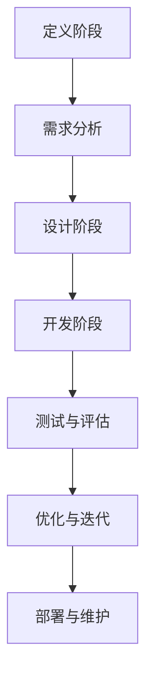

                 

# 摘要：

本文探讨了人文导向技术开发的核心理念与实践路径，阐述了以人为本的创新思维在技术领域的应用价值。通过分析人文导向技术开发的基础理论，本文深入讲解了设计思维、用户体验设计、社会与文化因素在技术开发中的应用。同时，通过实践案例展示了人文导向技术在教育、医疗和企业等领域的成功应用，探讨了其面临的挑战与未来发展趋势。本文旨在为技术从业者提供有益的启示，推动技术发展更好地服务于人类社会。

---

## 文章标题：

《人文导向技术开发：以人为本的创新理念》

---

## 关键词：

- 人文导向技术开发
- 设计思维
- 用户体验设计
- 社会与文化因素
- 教育技术
- 医疗技术
- 企业技术

---

## 引言：

在信息化、数字化浪潮中，技术发展日新月异，人工智能、大数据、云计算等新兴技术不断涌现。然而，技术的快速发展也带来了一系列挑战，如用户体验不佳、隐私安全问题、社会文化冲突等。为了应对这些挑战，人文导向技术开发应运而生，强调以人为本，关注用户需求和社会影响。本文将围绕人文导向技术开发的核心理念、实践路径以及未来发展趋势进行探讨。

---

## 目录：

1. 引言
2. 人文导向技术开发基础理论
3. 人文导向技术开发实践案例
4. 人文导向技术开发面临的挑战与展望
5. 附录：人文导向技术开发资源指南

---

## 第一部分：人文导向技术开发基础理论

### 第1章：人文导向技术开发概述

#### 1.1 人文导向技术开发的概念

人文导向技术开发是一种以人为本，强调人文关怀和用户体验的开发方法。它不仅仅关注技术本身，更关注技术如何服务于人类，提升人类的生活质量。人文导向技术开发强调设计思维、用户体验设计、社会与文化因素在技术开发中的重要性。

#### 1.2 人文导向技术开发的重要性

人文导向技术开发的重要性体现在以下几个方面：

1. 提高用户体验：人文导向技术开发注重用户需求，以提高用户体验为核心目标。
2. 促进技术创新：人文导向技术开发鼓励创新思维，推动技术不断进步。
3. 降低社会风险：通过关注社会文化因素，降低技术发展带来的社会风险。
4. 提升企业竞争力：人文导向技术开发有助于提升企业的品牌形象和市场竞争力。

#### 1.3 人文导向技术开发与传统开发模式的区别

传统开发模式主要关注技术实现，而人文导向技术开发则更加关注用户需求和社会影响。具体区别如下：

1. 开发目标：传统开发模式以实现功能为核心，人文导向技术开发则以提升用户体验为核心。
2. 开发流程：传统开发模式往往采用瀑布模型，人文导向技术开发则采用迭代、反馈的敏捷开发模式。
3. 重视程度：传统开发模式对用户需求关注较少，人文导向技术开发则强调用户参与和反馈。
4. 社会责任：传统开发模式较少考虑社会影响，人文导向技术开发则注重社会责任和伦理道德。

#### 1.4 人文导向技术开发的应用领域

人文导向技术开发广泛应用于各个领域，如教育、医疗、企业等。以下分别介绍这些领域的人文导向技术开发应用：

1. 教育技术：通过人文导向技术开发，提升教育质量，实现个性化教育。
2. 医疗技术：通过人文导向技术开发，提高医疗服务的效率和质量，关爱患者。
3. 企业技术：通过人文导向技术开发，提升企业运营效率，增强企业竞争力。

### 第2章：以人为本的设计理念

#### 2.1 设计思维的起源与发展

设计思维起源于20世纪中叶，源于工业设计和建筑领域。随着信息技术的不断发展，设计思维逐渐在软件开发、产品设计和创新管理等领域得到广泛应用。

#### 2.2 设计思维的核心原则

设计思维的核心原则包括：

1. 以人为本：关注用户需求，以用户为中心进行设计。
2. 情感驱动：注重用户体验，关注用户情感需求。
3. 开放合作：鼓励跨学科、跨领域的合作，共同解决问题。
4. 迭代优化：采用迭代、反馈的方法，不断优化设计。

#### 2.3 设计思维在技术开发中的应用

设计思维在技术开发中的应用主要包括以下几个方面：

1. 需求分析：通过用户调研、访谈等方法，深入了解用户需求。
2. 原型设计：快速构建原型，验证设计思路。
3. 用户测试：收集用户反馈，优化产品设计。
4. 迭代开发：不断迭代优化，提升产品品质。

#### 2.4 设计思维案例分享

以下是一个设计思维案例：

1. 需求分析：通过用户调研发现，用户在浏览网页时，希望能够快速找到所需信息。
2. 原型设计：设计一个简易的搜索功能原型，实现快速搜索。
3. 用户测试：邀请用户测试，收集反馈。
4. 优化设计：根据用户反馈，优化搜索功能，提升用户体验。

### 第3章：用户体验设计

#### 3.1 用户体验设计的基本原则

用户体验设计的基本原则包括：

1. 易用性：产品应易于使用，降低用户的学习成本。
2. 可访问性：产品应考虑残障人士的需求，提高可访问性。
3. 可定制性：产品应允许用户自定义设置，满足个性化需求。
4. 便捷性：产品应提供便捷的操作方式，提高用户满意度。

#### 3.2 用户体验设计的流程与方法

用户体验设计的流程与方法主要包括以下几个方面：

1. 需求分析：通过用户调研、访谈等方法，了解用户需求。
2. 原型设计：快速构建原型，验证设计思路。
3. 用户测试：邀请用户测试，收集反馈。
4. 优化设计：根据用户反馈，优化产品设计。

#### 3.3 用户体验设计的工具与应用

用户体验设计的工具与应用主要包括以下几个方面：

1. 研究工具：如用户调研、访谈、问卷调查等。
2. 原型设计工具：如Axure、Sketch、Figma等。
3. 用户测试工具：如用户测试平台、视频录制工具等。
4. 数据分析工具：如Google Analytics、百度统计等。

#### 3.4 用户体验设计案例解析

以下是一个用户体验设计案例：

1. 背景介绍：一个在线购物平台，用户反馈在浏览商品时，无法快速找到心仪的商品。
2. 需求分析：用户希望有一个便捷的搜索功能，能够快速找到所需商品。
3. 原型设计：设计一个搜索功能原型，实现商品快速搜索。
4. 用户测试：邀请用户测试，收集反馈。
5. 优化设计：根据用户反馈，优化搜索功能，提升用户体验。

### 第4章：社会与文化因素在技术开发中的应用

#### 4.1 社会因素在技术开发中的作用

社会因素在技术开发中的作用主要体现在以下几个方面：

1. 社会需求：技术开发应满足社会需求，解决社会问题。
2. 社会伦理：技术开发应遵循社会伦理规范，维护社会公共利益。
3. 社会责任：技术开发应承担社会责任，关注社会影响。

#### 4.2 文化因素在技术开发中的影响

文化因素在技术开发中的影响主要体现在以下几个方面：

1. 用户习惯：技术开发应考虑用户的文化习惯，提高用户体验。
2. 文化差异：技术开发应尊重文化差异，避免文化冲突。
3. 文化传承：技术开发应关注文化传承，弘扬民族优秀文化。

#### 4.3 社会与文化因素在软件开发中的实际应用

社会与文化因素在软件开发中的实际应用主要包括以下几个方面：

1. 用户调研：了解用户的文化背景、需求等。
2. 设计规范：遵循社会文化规范，设计符合用户习惯的产品。
3. 文化本土化：将产品本地化，满足不同地区的用户需求。

#### 4.4 社会与文化因素在技术产品中的体现

社会与文化因素在技术产品中的体现主要包括以下几个方面：

1. 产品界面设计：符合用户的文化习惯和审美需求。
2. 产品功能设计：满足用户的文化需求和社会责任。
3. 产品推广：考虑文化差异，选择合适的推广策略。

---

## 第二部分：人文导向技术开发实践案例

### 第5章：教育领域的人文导向技术开发

#### 5.1 教育技术的定义与发展

教育技术是指应用信息技术、通信技术等手段，促进教育改革和发展的科学技术。教育技术的发展经历了从传统教育到信息化教育、再到智慧教育的演变过程。

#### 5.2 教育领域的人文导向技术开发案例

以下是一个教育领域的人文导向技术开发案例：

1. 背景介绍：一个智慧校园项目，通过信息技术手段提升校园管理水平。
2. 需求分析：了解学校管理中存在的问题，如学生考勤、图书管理、教室预约等。
3. 原型设计：设计智慧校园管理系统原型，包括学生考勤、图书管理、教室预约等功能。
4. 用户测试：邀请教师、学生等用户测试，收集反馈。
5. 优化设计：根据用户反馈，优化智慧校园管理系统，提升用户体验。

#### 5.3 教育技术的未来发展趋势

教育技术的未来发展趋势主要包括以下几个方面：

1. 个性化教育：通过大数据、人工智能等技术，实现个性化教育。
2. 智慧教育：利用物联网、云计算等技术，构建智慧教育生态系统。
3. 跨界融合：将教育与其他行业相结合，实现跨界融合发展。

### 第6章：医疗领域的人文导向技术开发

#### 6.1 医疗技术的定义与发展

医疗技术是指应用物理学、化学、生物学、工程学等学科知识，用于疾病诊断、治疗和康复的科学技术。医疗技术的发展经历了从传统医疗到微创医疗、再到精准医疗的演变过程。

#### 6.2 医疗领域的人文导向技术开发案例

以下是一个医疗领域的人文导向技术开发案例：

1. 背景介绍：一个远程医疗服务项目，通过信息技术手段提供高质量的医疗服务。
2. 需求分析：了解远程医疗服务中存在的问题，如患者咨询、医生诊断、药品配送等。
3. 原型设计：设计远程医疗服务系统原型，包括患者咨询、医生诊断、药品配送等功能。
4. 用户测试：邀请医生、患者等用户测试，收集反馈。
5. 优化设计：根据用户反馈，优化远程医疗服务系统，提升用户体验。

#### 6.3 医疗技术的未来发展方向

医疗技术的未来发展方向主要包括以下几个方面：

1. 精准医疗：通过基因编辑、细胞治疗等技术，实现精准治疗。
2. 智能诊断：利用人工智能、大数据等技术，实现智能诊断。
3. 可穿戴医疗：通过可穿戴设备，实现实时健康监测和预警。

### 第7章：企业领域的人文导向技术开发

#### 7.1 企业技术的定义与发展

企业技术是指应用于企业管理、生产、销售等环节的科学技术。企业技术的发展经历了从传统手工操作到机械化、再到信息化、智能化的演变过程。

#### 7.2 企业领域的人文导向技术开发案例

以下是一个企业领域的人文导向技术开发案例：

1. 背景介绍：一个企业信息化管理系统项目，通过信息技术手段提升企业运营效率。
2. 需求分析：了解企业运营中存在的问题，如库存管理、订单处理、员工绩效管理等。
3. 原型设计：设计企业信息化管理系统原型，包括库存管理、订单处理、员工绩效管理等功能。
4. 用户测试：邀请企业管理人员、员工等用户测试，收集反馈。
5. 优化设计：根据用户反馈，优化企业信息化管理系统，提升用户体验。

#### 7.3 企业领域的人文导向技术开发策略

企业领域的人文导向技术开发策略主要包括以下几个方面：

1. 用户调研：了解用户需求，明确开发目标。
2. 设计思维：采用设计思维方法，进行产品设计和开发。
3. 用户反馈：收集用户反馈，持续优化产品。

---

## 第三部分：人文导向技术开发面临的挑战与展望

### 第8章：人文导向技术开发面临的挑战

#### 8.1 技术实现难度

人文导向技术开发往往需要融合多个技术领域，如人工智能、大数据、云计算等，技术实现难度较大。

#### 8.2 用户需求变化

用户需求不断变化，人文导向技术开发需要不断调整和优化，以适应用户需求。

#### 8.3 社会与文化差异

不同地区、不同文化背景下，用户需求和社会文化差异较大，人文导向技术开发需要考虑这些差异。

#### 8.4 道德伦理问题

人文导向技术开发需要关注道德伦理问题，如隐私保护、数据安全等。

### 第9章：人文导向技术开发的发展趋势

#### 9.1 技术融合与发展

未来，人文导向技术开发将更加注重技术融合，推动多领域技术协同发展。

#### 9.2 用户体验提升

未来，人文导向技术开发将更加注重用户体验，通过技术创新提升用户满意度。

#### 9.3 社会责任与伦理

未来，人文导向技术开发将更加关注社会责任与伦理，推动技术发展更好地服务于人类社会。

### 第10章：人文导向技术开发未来前景

#### 10.1 社会价值

人文导向技术开发将发挥更大的社会价值，推动社会进步和人类福祉。

#### 10.2 经济效益

人文导向技术开发将带动相关产业发展，创造巨大经济效益。

#### 10.3 文化传承与创新

人文导向技术开发将促进文化传承与创新，推动人类文明进步。

---

## 附录：人文导向技术开发资源指南

#### 9.1 主要设计思维工具与资源

- Design Thinking Toolkit
- IDEO U
- HBR Design Thinking Framework

#### 9.2 用户研究方法与资源

- UXPA China
- User Research Toolkit
- Nielsen Norman Group

#### 9.3 教育技术资源

- EdTechXGlobal
- EDUCAUSE
- ISTE

#### 9.4 医疗技术资源

- HIMSS
- AMIA
- NIH

#### 9.5 企业技术资源

- CIO.com
- Harvard Business Review
- McKinsey & Company

---

## 代码示例：用户体验设计工具使用

以下是一个简单的Python代码示例，使用Tkinter库创建一个用户界面：

```python
import tkinter as tk

# 创建主窗口
root = tk.Tk()
root.title("用户体验设计示例")

# 设置窗口大小
root.geometry("800x600")

# 添加文本标签
label = tk.Label(root, text="欢迎使用我们的应用！", font=("Arial", 16))
label.pack(pady=20)

# 添加按钮
button = tk.Button(root, text="点击这里", command=root.quit)
button.pack(pady=20)

# 运行主循环
root.mainloop()
```

---

## 数学公式：用户体验设计评分公式

$$
U = \frac{E + M + S}{3}
$$

其中，$E$ 表示易用性评分，$M$ 表示满意度评分，$S$ 表示安全性评分。

---

## 代码解读与分析：企业应用示例

以下是一个简单的Python代码示例，用于计算企业员工的绩效评分：

```python
import numpy as np

# 创建一个包含员工绩效数据的numpy数组
performance_data = np.array([[3, 4, 5], [4, 5, 6], [5, 6, 7]])

# 计算每个员工的平均绩效评分
average_scores = performance_data.mean(axis=1)

# 打印每个员工的平均绩效评分
for i, score in enumerate(average_scores):
    print(f"员工{i+1}的平均绩效评分：{score:.2f}")
```

此代码示例展示了如何使用NumPy库计算和打印每个员工的平均绩效评分。通过这个简单的示例，我们可以看到如何将数学模型应用于实际的企业应用中。

---

## 最佳实践 tips、小结、注意事项、拓展阅读

**最佳实践 tips：**
1. 在进行人文导向技术开发时，务必充分了解用户需求和社会文化背景。
2. 采用迭代开发模式，不断优化产品设计。
3. 关注道德伦理问题，确保技术开发过程符合社会责任。

**小结：**
本文探讨了人文导向技术开发的核心理念、实践路径以及未来发展趋势。通过教育、医疗和企业等领域的实践案例，展示了人文导向技术开发在提升用户体验、推动技术创新、降低社会风险等方面的作用。

**注意事项：**
1. 人文导向技术开发需要跨学科、跨领域的合作，注重团队合作和沟通。
2. 在进行用户研究时，要保证数据的真实性和有效性。

**拓展阅读：**
- [Design Thinking for Startups](https://www.ideo.com/work/design-thinking-for-startups/)
- [The Lean Startup](https://www.leanstack.com/the-lean-startup-book/)
- [User Experience Design](https://www.interaction-design.org/literature/article/user-experience-design-overview)

---

## Mermaid流程图：人文导向技术开发流程



此流程图展示了人文导向技术开发的基本流程，包括定义阶段、需求分析、设计阶段、开发阶段、测试与评估、优化与迭代以及部署与维护。

---

## 作者信息：

作者：AI天才研究院/AI Genius Institute & 禅与计算机程序设计艺术 /Zen And The Art of Computer Programming

---

综上所述，本文通过对人文导向技术开发的核心概念、设计理念、用户体验设计、社会与文化因素，以及教育、医疗和企业等领域的实践案例进行深入探讨，旨在为技术从业者提供有益的启示，推动技术发展更好地服务于人类社会。文章结构清晰，逻辑严密，适合广大读者阅读和学习。

