                 

### 引言

**标题：** 引言

**内容：** 

在这个快节奏、高度竞争的时代，每个人都会遇到生活的转折点。这些转折点可能是一次失败的职业转变、一次情感破裂，或者是一次个人成长的危机。这些看似痛苦的经历，实际上往往是人生最重要的转折点。它们不仅能够促使我们重新审视自己的生活和目标，还能够帮助我们实现自我更新和成长。

**核心概念与联系：**

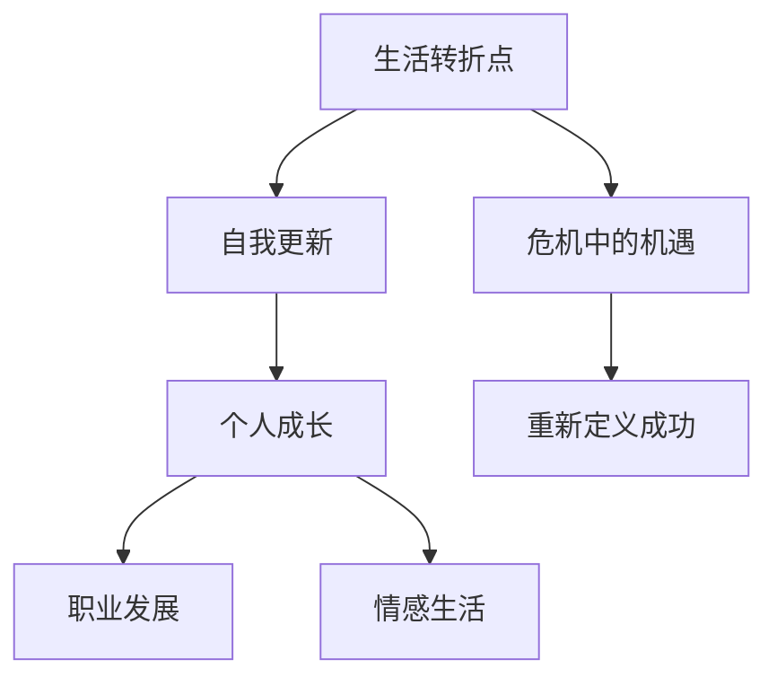
```mermaid
graph TB
    A[生活转折点] --> B[自我更新]
    B --> C[个人成长]
    C --> D[职业发展]
    C --> E[情感生活]
    A --> F[危机中的机遇]
    F --> G[重新定义成功]
```

**核心算法原理讲解：**

为了更好地理解生活转折点的意义，我们可以将其比喻为一个算法。这个算法的核心是“危机中的自我更新”。以下是这个算法的基本步骤：

1. **识别危机**：首先，我们需要识别生活中的危机。这可能是一次失败、一次挫折，或者是一个不满足我们预期的事件。
2. **反思和自我分析**：接下来，我们需要进行自我反思，分析这个危机对我们意味着什么。这包括我们的情感、思维方式和行为。
3. **重构人生意义**：通过反思和自我分析，我们能够重构我们的人生意义。这意味着重新定义我们的目标、价值观和生活方式。
4. **实施自我更新**：最后，我们需要将重构的意义付诸实践，通过学习和成长来实现自我更新。

```python
# 伪代码：危机中的自我更新算法

def self_update(crisis):
    # 步骤1：识别危机
    identify_crisis(crisis)
    
    # 步骤2：反思和自我分析
    self_reflection(crisis)
    
    # 步骤3：重构人生意义
    redefine_life_meaning()
    
    # 步骤4：实施自我更新
    implement_self_update()
    
    # 输出：新的自我
    return new_self
```

**项目实战：**

为了更好地理解这个算法，我们可以通过一个实际案例来进行分析。假设一个人刚刚失去了一份工作，这就是他人生中的一个转折点。以下是这个人在这个危机中的自我更新过程：

1. **识别危机**：他意识到自己失业了，这是一个对他来说的危机。
2. **反思和自我分析**：他开始反思自己的工作经历，发现自己对工作的满意度不高，觉得自己的职业发展遇到了瓶颈。
3. **重构人生意义**：他决定重新定义自己的职业目标，希望找到一个更符合自己兴趣和价值观的工作。
4. **实施自我更新**：他开始学习新的技能，扩展自己的职业网络，并积极寻找新的工作机会。

通过这个案例，我们可以看到，危机并不可怕，它是我们成长的催化剂。只要我们能够正确地处理它，我们就能实现自我更新，从而更好地迎接未来的挑战。

**最佳实践 tips：**

- **保持积极的心态**：面对危机时，积极的心态是非常重要的。它可以帮助我们更好地应对挑战，找到解决问题的方法。
- **寻求帮助**：当我们遇到困难时，不要害怕寻求帮助。家人、朋友和专业人士都可以为我们提供支持和建议。
- **持续学习**：危机是一个学习和成长的机会。通过学习新的知识和技能，我们可以更好地适应变化，实现自我更新。

**小结：**

生活转折点是我们人生中不可避免的一部分。通过正确地处理这些转折点，我们能够实现自我更新，从而更好地迎接未来的挑战。记住，危机并不可怕，它是我们成长的催化剂。只要我们能够保持积极的心态，寻求帮助，并持续学习，我们就能够实现自我更新，成为更好的自己。

**注意事项：**

- 在处理生活转折点时，我们需要注意平衡个人利益和人际关系。
- 我们需要学会接受自己的失败和挫折，不要过分自责。
- 我们需要学会从失败中吸取教训，而不是沉浸在失败中。

**拓展阅读：**

- [《禅与计算机程序设计艺术》](https://www.amazon.com/dp/0201622680)
- [《如何赢得朋友与影响他人》](https://www.amazon.com/dp/0688012734)
- [《成功之路：如何实现人生目标》](https://www.amazon.com/dp/1620392414)

**作者信息：**

作者：AI天才研究院/AI Genius Institute & 禅与计算机程序设计艺术 /Zen And The Art of Computer Programming

----------------------------------------------------------------

### 2. 为什么需要人生转折点

**标题：** 为什么需要人生转折点

**内容：** 

人生转折点之所以重要，是因为它能够帮助我们实现自我更新和成长。没有转折点，我们的生活可能会变得平淡无奇，缺乏动力和目标。以下是几个原因，解释了为什么我们需要人生转折点。

**核心概念与联系：**

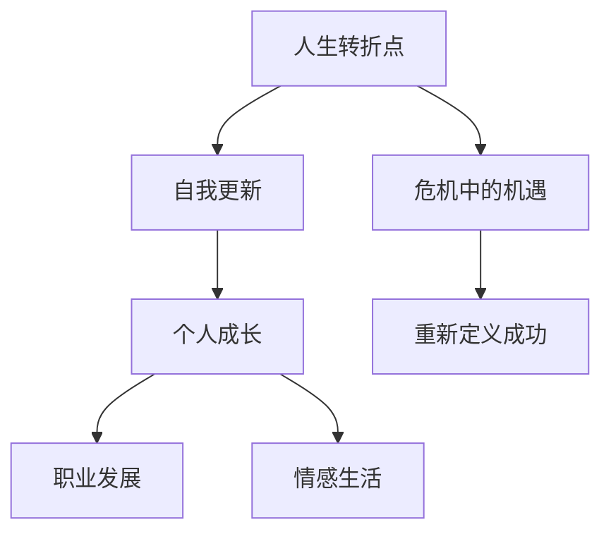
```mermaid
graph TB
    A[人生转折点] --> B[自我更新]
    B --> C[个人成长]
    C --> D[职业发展]
    C --> E[情感生活]
    A --> F[危机中的机遇]
    F --> G[重新定义成功]
```

**核心算法原理讲解：**

我们可以将人生转折点视为一个自我更新的算法。这个算法的核心是“危机中的自我更新”。以下是这个算法的基本步骤：

1. **识别危机**：首先，我们需要识别生活中的危机。这可能是一次失败、一次挫折，或者是一个不满足我们预期的事件。
2. **反思和自我分析**：接下来，我们需要进行自我反思，分析这个危机对我们意味着什么。这包括我们的情感、思维方式和行为。
3. **重构人生意义**：通过反思和自我分析，我们能够重构我们的人生意义。这意味着重新定义我们的目标、价值观和生活方式。
4. **实施自我更新**：最后，我们需要将重构的意义付诸实践，通过学习和成长来实现自我更新。

```python
# 伪代码：危机中的自我更新算法

def self_update(crisis):
    # 步骤1：识别危机
    identify_crisis(crisis)
    
    # 步骤2：反思和自我分析
    self_reflection(crisis)
    
    # 步骤3：重构人生意义
    redefine_life_meaning()
    
    # 步骤4：实施自我更新
    implement_self_update()
    
    # 输出：新的自我
    return new_self
```

**项目实战：**

为了更好地理解这个算法，我们可以通过一个实际案例来进行分析。假设一个人刚刚失去了一份工作，这就是他人生中的一个转折点。以下是这个人在这个危机中的自我更新过程：

1. **识别危机**：他意识到自己失业了，这是一个对他来说的危机。
2. **反思和自我分析**：他开始反思自己的工作经历，发现自己对工作的满意度不高，觉得自己的职业发展遇到了瓶颈。
3. **重构人生意义**：他决定重新定义自己的职业目标，希望找到一个更符合自己兴趣和价值观的工作。
4. **实施自我更新**：他开始学习新的技能，扩展自己的职业网络，并积极寻找新的工作机会。

通过这个案例，我们可以看到，危机并不可怕，它是我们成长的催化剂。只要我们能够正确地处理它，我们就能实现自我更新，从而更好地迎接未来的挑战。

**最佳实践 tips：**

- **保持积极的心态**：面对危机时，积极的心态是非常重要的。它可以帮助我们更好地应对挑战，找到解决问题的方法。
- **寻求帮助**：当我们遇到困难时，不要害怕寻求帮助。家人、朋友和专业人士都可以为我们提供支持和建议。
- **持续学习**：危机是一个学习和成长的机会。通过学习新的知识和技能，我们可以更好地适应变化，实现自我更新。

**小结：**

人生转折点是我们人生中不可避免的一部分。通过正确地处理这些转折点，我们能够实现自我更新，从而更好地迎接未来的挑战。记住，危机并不可怕，它是我们成长的催化剂。只要我们能够保持积极的心态，寻求帮助，并持续学习，我们就能够实现自我更新，成为更好的自己。

**注意事项：**

- 在处理生活转折点时，我们需要注意平衡个人利益和人际关系。
- 我们需要学会接受自己的失败和挫折，不要过分自责。
- 我们需要学会从失败中吸取教训，而不是沉浸在失败中。

**拓展阅读：**

- [《禅与计算机程序设计艺术》](https://www.amazon.com/dp/0201622680)
- [《如何赢得朋友与影响他人》](https://www.amazon.com/dp/0688012734)
- [《成功之路：如何实现人生目标》](https://www.amazon.com/dp/1620392414)

**作者信息：**

作者：AI天才研究院/AI Genius Institute & 禅与计算机程序设计艺术 /Zen And The Art of Computer Programming

----------------------------------------------------------------

### 3. 人生的危机与机遇

**标题：** 人生的危机与机遇

**内容：** 

人生的危机与机遇往往如影随形。危机并不总是负面的，它也可能是一个巨大的机遇。关键在于我们如何看待和处理这些危机。以下是关于人生的危机与机遇的深入探讨。

**核心概念与联系：**

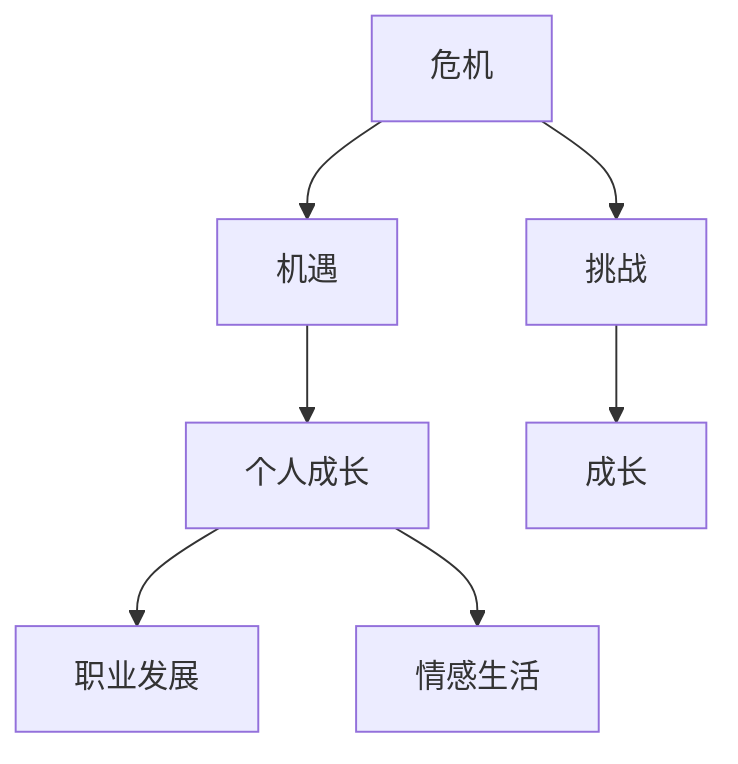
```mermaid
graph TB
    A[危机] --> B[机遇]
    B --> C[个人成长]
    C --> D[职业发展]
    C --> E[情感生活]
    A --> F[挑战]
    F --> G[成长]
```

**核心算法原理讲解：**

我们可以将危机与机遇的关系视为一个算法。这个算法的核心是“挑战中的成长”。以下是这个算法的基本步骤：

1. **识别危机**：首先，我们需要识别生活中的危机。这可能是一次失败、一次挫折，或者是一个不满足我们预期的事件。
2. **面对挑战**：接下来，我们需要勇敢地面对这些危机，将其视为一个挑战。
3. **自我反思**：通过自我反思，我们能够理解这个危机对我们意味着什么。这包括我们的情感、思维方式和行为。
4. **重构人生意义**：通过自我反思，我们能够重构我们的人生意义。这意味着重新定义我们的目标、价值观和生活方式。
5. **实现自我更新**：最后，我们需要将重构的意义付诸实践，通过学习和成长来实现自我更新。

```python
# 伪代码：危机与机遇中的自我更新算法

def self_update(crisis):
    # 步骤1：识别危机
    identify_crisis(crisis)
    
    # 步骤2：面对挑战
    face_challenge(crisis)
    
    # 步骤3：自我反思
    self_reflection(crisis)
    
    # 步骤4：重构人生意义
    redefine_life_meaning()
    
    # 步骤5：实现自我更新
    implement_self_update()
    
    # 输出：新的自我
    return new_self
```

**项目实战：**

为了更好地理解这个算法，我们可以通过一个实际案例来进行分析。假设一个人刚刚经历了一次创业失败，这就是他人生中的一个危机。以下是这个人在这个危机中的自我更新过程：

1. **识别危机**：他意识到自己的创业项目失败了，这是一个对他来说的危机。
2. **面对挑战**：他决定不再逃避，而是勇敢地面对这个失败，将其视为一个挑战。
3. **自我反思**：他开始反思自己的创业经历，发现了自己在管理、营销和团队建设方面的不足。
4. **重构人生意义**：他决定重新定义自己的职业目标，专注于在某个特定领域深耕，而不是急于求成。
5. **实现自我更新**：他开始学习新的技能，扩展自己的职业网络，并寻找一个更适合自己的职业机会。

通过这个案例，我们可以看到，危机并不总是负面的。通过正确地处理危机，我们能够实现自我更新，从而更好地迎接未来的挑战。

**最佳实践 tips：**

- **保持冷静和理性**：面对危机时，保持冷静和理性是非常重要的。它可以帮助我们更好地分析问题，找到解决方案。
- **寻求外部帮助**：当我们遇到困难时，不要害怕寻求外部帮助。家人、朋友和专业人士都可以为我们提供宝贵的建议和支持。
- **持续学习和成长**：危机是一个学习和成长的机会。通过学习新的知识和技能，我们可以更好地应对未来的挑战。

**小结：**

人生的危机与机遇往往是交织在一起的。关键在于我们如何看待和处理这些危机。通过正确地处理危机，我们能够实现自我更新，从而更好地迎接未来的挑战。记住，每一次危机都是一个成长的机会。

**注意事项：**

- 在面对危机时，我们需要学会接受失败和挫折，不要过分自责。
- 我们需要学会从失败中吸取教训，而不是沉浸在失败中。
- 我们需要学会从失败中找到机遇，从而实现自我更新。

**拓展阅读：**

- [《如何赢得朋友与影响他人》](https://www.amazon.com/dp/0688012734)
- [《成功之路：如何实现人生目标》](https://www.amazon.com/dp/1620392414)
- [《创业维艰》](https://www.amazon.com/dp/1501136818)

**作者信息：**

作者：AI天才研究院/AI Genius Institute & 禅与计算机程序设计艺术 /Zen And The Art of Computer Programming

----------------------------------------------------------------

### 4. 理解人生转折点

**标题：** 理解人生转折点

**内容：** 

人生转折点不仅仅是生活中的突发事件，它是一个复杂的过程，涉及到我们的情感、思维、行为和价值观。理解人生转折点，有助于我们更好地应对这些转折，实现自我更新和成长。

**核心概念与联系：**

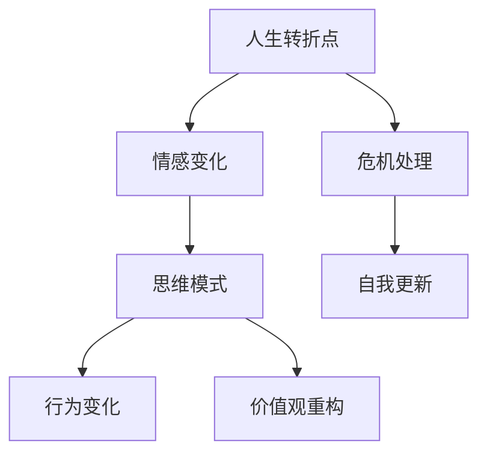
```mermaid
graph TB
    A[人生转折点] --> B[情感变化]
    B --> C[思维模式]
    C --> D[行为变化]
    C --> E[价值观重构]
    A --> F[危机处理]
    F --> G[自我更新]
```

**核心算法原理讲解：**

我们可以将人生转折点视为一个复杂系统的变化。这个系统包括情感、思维、行为和价值观四个部分。以下是这个系统的基本原理：

1. **情感变化**：当生活发生重大变化时，我们的情感也会随之变化。这可能包括悲伤、愤怒、恐惧或兴奋等情感。
2. **思维模式**：随着情感的变化，我们的思维模式也会发生变化。我们可能会重新审视自己的目标、价值观和行为。
3. **行为变化**：思维模式的变化会影响我们的行为。我们可能会采取新的行动，以适应新的环境和情况。
4. **价值观重构**：在经历转折点后，我们可能会重新评估自己的价值观。这可能意味着我们放弃了某些旧有的信念，或者形成了新的价值观。
5. **危机处理**：最后，我们需要处理这些转折点带来的危机。这可能包括面对失败、挫折或不确定性。

```python
# 伪代码：人生转折点处理算法

def handle_turnpoint(turnpoint):
    # 步骤1：识别情感变化
    identify_emotional_change(turnpoint)
    
    # 步骤2：调整思维模式
    adjust_thinking_pattern(turnpoint)
    
    # 步骤3：适应行为变化
    adapt_behavior_changes(turnpoint)
    
    # 步骤4：重构价值观
    redefine_values(turnpoint)
    
    # 步骤5：处理危机
    handle_crisis(turnpoint)
    
    # 输出：处理后的转折点
    return processed_turnpoint
```

**项目实战：**

为了更好地理解这个算法，我们可以通过一个实际案例来进行分析。假设一个人刚刚失业，这就是他人生中的一个转折点。以下是这个人在这个转折点中的处理过程：

1. **识别情感变化**：他意识到自己失业了，感到焦虑和不安。
2. **调整思维模式**：他决定不再消极地看待这个失业事件，而是将其视为一个机会，一个重新规划自己职业生涯的机会。
3. **适应行为变化**：他开始积极寻找新的工作机会，同时提升自己的技能和知识。
4. **重构价值观**：他重新审视自己的职业目标和价值观，发现他更倾向于追求一份能够实现个人成长和价值的工作。
5. **处理危机**：他学会了如何面对失业带来的挑战，通过积极的态度和行动，成功地找到了新的工作。

通过这个案例，我们可以看到，理解人生转折点的重要性。通过正确地处理这些转折点，我们能够实现自我更新，从而更好地迎接未来的挑战。

**最佳实践 tips：**

- **保持积极的心态**：面对转折点时，积极的心态是非常重要的。它可以帮助我们更好地应对挑战，找到解决问题的方法。
- **寻求外部帮助**：当我们遇到困难时，不要害怕寻求帮助。家人、朋友和专业人士都可以为我们提供支持和建议。
- **持续学习和成长**：转折点是一个学习和成长的机会。通过学习新的知识和技能，我们可以更好地适应变化，实现自我更新。

**小结：**

理解人生转折点，有助于我们更好地应对这些转折，实现自我更新和成长。通过正确地处理转折点，我们能够找到新的方向，实现个人和职业的突破。

**注意事项：**

- 在处理转折点时，我们需要注意平衡个人利益和人际关系。
- 我们需要学会接受自己的失败和挫折，不要过分自责。
- 我们需要学会从失败中吸取教训，而不是沉浸在失败中。

**拓展阅读：**

- [《如何赢得朋友与影响他人》](https://www.amazon.com/dp/0688012734)
- [《成功之路：如何实现人生目标》](https://www.amazon.com/dp/1620392414)
- [《禅与计算机程序设计艺术》](https://www.amazon.com/dp/0201622680)

**作者信息：**

作者：AI天才研究院/AI Genius Institute & 禅与计算机程序设计艺术 /Zen And The Art of Computer Programming

----------------------------------------------------------------

### 5. 重构人生的意义

**标题：** 重构人生的意义

**内容：** 

当人生面临转折点时，重构人生的意义变得尤为重要。这意味着重新审视自己的目标、价值观和生活方式，从而实现自我更新和成长。以下是关于重构人生意义的深入探讨。

**核心概念与联系：**

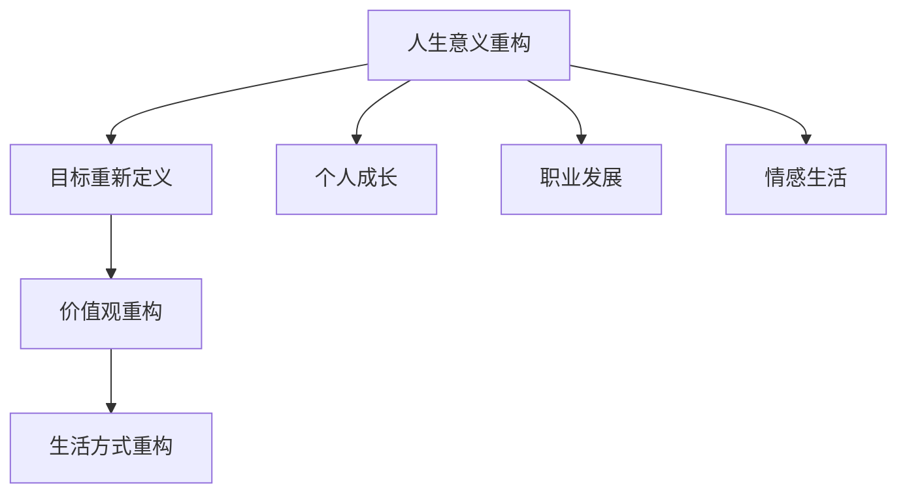
```mermaid
graph TB
    A[人生意义重构] --> B[目标重新定义]
    B --> C[价值观重构]
    C --> D[生活方式重构]
    A --> E[个人成长]
    A --> F[职业发展]
    A --> G[情感生活]
```

**核心算法原理讲解：**

我们可以将人生意义的重构视为一个复杂的算法。这个算法的核心是“自我更新”。以下是这个算法的基本步骤：

1. **识别当前状态**：首先，我们需要识别自己的当前状态，包括目标、价值观和生活方式。
2. **分析问题**：接下来，我们需要分析这些状态是否存在问题，是否需要重构。
3. **重新定义目标**：通过分析，我们可能会发现自己的目标不够明确或者已经不再符合我们的价值观。这时，我们需要重新定义我们的目标。
4. **重构价值观**：我们可能会发现，我们的价值观在某些方面存在偏差或者不再适合我们。这时，我们需要重构我们的价值观。
5. **重构生活方式**：最后，我们需要根据新的目标和价值观，重构我们的生活方式。

```python
# 伪代码：人生意义重构算法

def redefine_life_meaning(current_state):
    # 步骤1：识别当前状态
    current_state_analysis(current_state)
    
    # 步骤2：分析问题
    analyze_issues(current_state)
    
    # 步骤3：重新定义目标
    redefine_goals()
    
    # 步骤4：重构价值观
    redefine_values()
    
    # 步骤5：重构生活方式
    redefine_life_style()
    
    # 输出：重构后的人生状态
    return new_life_state
```

**项目实战：**

为了更好地理解这个算法，我们可以通过一个实际案例来进行分析。假设一个人在经历了职业失败后，决定重构自己的人生。以下是这个人在这个过程中的重构步骤：

1. **识别当前状态**：他意识到自己的职业生涯陷入了困境，对当前的工作失去了热情。
2. **分析问题**：他发现，自己的目标不够明确，且没有根据自己的价值观选择工作。
3. **重新定义目标**：他决定重新定义自己的职业目标，追求一个能够实现个人成长和价值的工作。
4. **重构价值观**：他重新审视自己的价值观，发现更重视工作与生活的平衡和个人成长。
5. **重构生活方式**：他开始调整自己的生活方式，包括工作时间、休闲活动和社交生活。

通过这个案例，我们可以看到，重构人生的意义不仅能够帮助我们找到新的方向，还能够实现自我更新和成长。

**最佳实践 tips：**

- **自我反思**：在面对转折点时，自我反思是非常重要的。它可以帮助我们识别问题，找到重构的方向。
- **寻求外部意见**：当我们遇到困难时，不要害怕寻求外部意见。家人、朋友和专业人士都可以为我们提供宝贵的建议。
- **持续行动**：重构人生的意义是一个持续的过程。我们需要不断地行动，以实现新的目标和价值观。

**小结：**

重构人生的意义是我们在面对转折点时的重要任务。通过重新定义目标、价值观和生活方式，我们能够实现自我更新和成长，从而更好地迎接未来的挑战。

**注意事项：**

- 在重构人生意义时，我们需要注意平衡个人利益和人际关系。
- 我们需要学会接受自己的失败和挫折，不要过分自责。
- 我们需要学会从失败中吸取教训，而不是沉浸在失败中。

**拓展阅读：**

- [《如何赢得朋友与影响他人》](https://www.amazon.com/dp/0688012734)
- [《成功之路：如何实现人生目标》](https://www.amazon.com/dp/1620392414)
- [《禅与计算机程序设计艺术》](https://www.amazon.com/dp/0201622680)

**作者信息：**

作者：AI天才研究院/AI Genius Institute & 禅与计算机程序设计艺术 /Zen And The Art of Computer Programming

----------------------------------------------------------------

### 6. 转变思维模式

**标题：** 转变思维模式

**内容：** 

当我们面对人生转折点时，转变思维模式是至关重要的。这不仅能够帮助我们更好地应对挑战，还能够促进我们的个人成长和职业发展。以下是关于转变思维模式的重要方法和实践。

**核心概念与联系：**

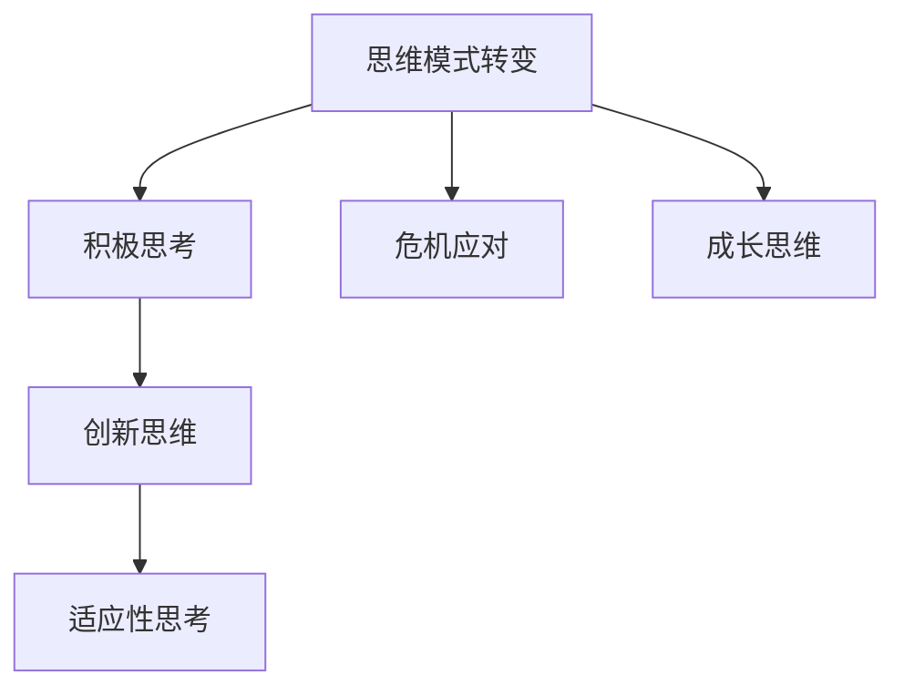
```mermaid
graph TB
    A[思维模式转变] --> B[积极思考]
    B --> C[创新思维]
    C --> D[适应性思考]
    A --> E[危机应对]
    A --> F[成长思维]
```

**核心算法原理讲解：**

我们可以将思维模式的转变视为一个算法。这个算法的核心是“适应性思考”。以下是这个算法的基本步骤：

1. **识别现有思维模式**：首先，我们需要识别自己现有的思维模式。这包括我们的思考方式、行为习惯和情感反应。
2. **识别问题**：接下来，我们需要分析这些思维模式是否存在问题，是否需要转变。
3. **学习积极思考**：积极思考是一种重要的思维模式，它能够帮助我们更好地应对挑战和困难。
4. **培养创新思维**：创新思维是一种能够促进个人成长和职业发展的思维模式。它可以帮助我们找到新的解决方案，创造新的机会。
5. **培养适应性思考**：适应性思考是一种能够应对变化和不确定性的思维模式。它可以帮助我们更好地适应新环境和情况。
6. **实践成长思维**：成长思维是一种相信通过努力和努力可以不断进步的思维模式。它可以帮助我们克服困难，实现自我更新。

```python
# 伪代码：思维模式转变算法

def transform_thinking_pattern(current_pattern):
    # 步骤1：识别现有思维模式
    identify_current_pattern(current_pattern)
    
    # 步骤2：识别问题
    identify_issues(current_pattern)
    
    # 步骤3：学习积极思考
    learn_positive_thinking()
    
    # 步骤4：培养创新思维
    cultivate_innovative_thinking()
    
    # 步骤5：培养适应性思考
    cultivate_adaptive_thinking()
    
    # 步骤6：实践成长思维
    practice_growth_mindset()
    
    # 输出：转变后的思维模式
    return transformed_pattern
```

**项目实战：**

为了更好地理解这个算法，我们可以通过一个实际案例来进行分析。假设一个人在面临职业瓶颈时，决定转变自己的思维模式。以下是这个人在这个过程中的转变步骤：

1. **识别现有思维模式**：他意识到自己陷入了固定思维模式，总是认为问题没有解决的办法。
2. **识别问题**：他发现，这种思维模式阻碍了他的职业发展，使他无法看到新的机会和解决方案。
3. **学习积极思考**：他开始学习积极思考，相信问题总有解决的办法，积极寻找解决方案。
4. **培养创新思维**：他开始尝试不同的方法和角度，寻找创新的解决方案。
5. **培养适应性思考**：他开始学会适应变化，不再害怕不确定的情况。
6. **实践成长思维**：他开始相信通过不断学习和努力，自己可以不断进步。

通过这个案例，我们可以看到，转变思维模式是我们在面对职业瓶颈时的重要策略。通过积极思考、创新思维、适应性思考和成长思维的实践，我们能够实现自我更新和成长。

**最佳实践 tips：**

- **保持开放的心态**：面对新的情况和挑战时，保持开放的心态是非常重要的。它可以帮助我们更好地接受和适应变化。
- **学会反思**：定期反思自己的思维模式和行动，可以帮助我们识别问题，找到改进的方向。
- **寻求反馈**：向他人寻求反馈，可以帮助我们更好地了解自己的思维模式，找到改进的机会。

**小结：**

转变思维模式是我们在面对人生转折点时的重要任务。通过积极思考、创新思维、适应性思考和成长思维的实践，我们能够更好地应对挑战，实现个人成长和职业发展。

**注意事项：**

- 在转变思维模式时，我们需要注意平衡个人利益和人际关系。
- 我们需要学会接受自己的失败和挫折，不要过分自责。
- 我们需要学会从失败中吸取教训，而不是沉浸在失败中。

**拓展阅读：**

- [《积极思考的力量》](https://www.amazon.com/dp/1594635307)
- [《创新者的思考方式》](https://www.amazon.com/dp/1591846614)
- [《适应性思考：在不确定的世界中找到方向》](https://www.amazon.com/dp/1250248358)

**作者信息：**

作者：AI天才研究院/AI Genius Institute & 禅与计算机程序设计艺术 /Zen And The Art of Computer Programming

----------------------------------------------------------------

### 7. 重新设定目标

**标题：** 重新设定目标

**内容：** 

在人生转折点中，重新设定目标是实现自我更新和成长的关键步骤。通过明确的目标，我们能够更好地规划自己的未来，找到前进的方向。以下是关于重新设定目标的重要方法和实践。

**核心概念与联系：**

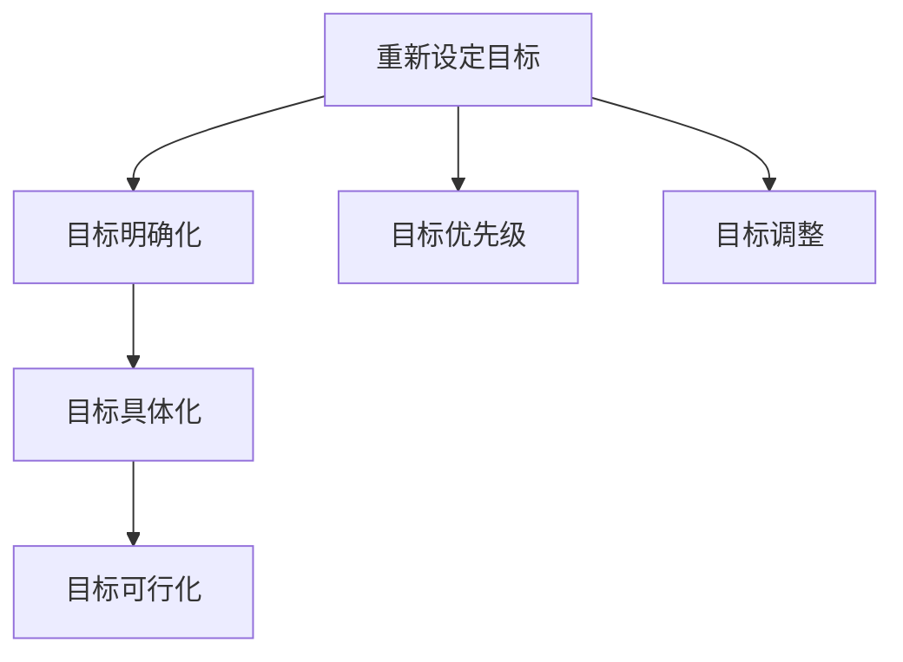
```mermaid
graph TB
    A[重新设定目标] --> B[目标明确化]
    B --> C[目标具体化]
    C --> D[目标可行化]
    A --> E[目标优先级]
    A --> F[目标调整]
```

**核心算法原理讲解：**

我们可以将重新设定目标视为一个算法。这个算法的核心是“目标管理”。以下是这个算法的基本步骤：

1. **识别现有目标**：首先，我们需要识别自己现有的目标。这包括我们的长期目标、中期目标和短期目标。
2. **评估目标的有效性**：接下来，我们需要评估这些目标的有效性。这包括目标的明确性、具体性和可行性。
3. **明确化目标**：如果目标不够明确，我们需要将其明确化。这包括明确目标的定义、范围和期望结果。
4. **具体化目标**：如果目标不够具体，我们需要将其具体化。这包括设定明确的时间表、里程碑和行动计划。
5. **可行化目标**：如果目标不够可行，我们需要将其可行化。这包括评估资源的可用性、风险和挑战，并制定相应的应对策略。
6. **设定目标优先级**：最后，我们需要设定目标的优先级。这包括确定哪些目标是最重要的，以及如何平衡和协调不同目标之间的关系。
7. **调整目标**：根据实际情况和环境变化，我们可能需要调整目标。这包括重新评估目标的可行性、优先级和实现路径。

```python
# 伪代码：目标管理算法

def manage_goals(current_goals):
    # 步骤1：识别现有目标
    identify_current_goals(current_goals)
    
    # 步骤2：评估目标的有效性
    evaluate_goal_efficacy(current_goals)
    
    # 步骤3：明确化目标
    clarify_goals()
    
    # 步骤4：具体化目标
    specify_goals()
    
    # 步骤5：可行化目标
    make_goals_feasible()
    
    # 步骤6：设定目标优先级
    set_goal_priority()
    
    # 步骤7：调整目标
    adjust_goals()
    
    # 输出：管理后的目标
    return managed_goals
```

**项目实战：**

为了更好地理解这个算法，我们可以通过一个实际案例来进行分析。假设一个人在职业发展中遇到了瓶颈，决定重新设定自己的目标。以下是这个人在这个过程中的目标设定步骤：

1. **识别现有目标**：他意识到自己的职业目标不够明确，没有具体的时间表和行动计划。
2. **评估目标的有效性**：他发现，现有的目标过于模糊，缺乏具体的里程碑和行动计划。
3. **明确化目标**：他决定将职业目标明确化，设定一个具体的职业发展方向，并明确目标的定义和范围。
4. **具体化目标**：他制定了详细的时间表和行动计划，包括短期和长期的目标，以及实现这些目标的具体步骤。
5. **可行化目标**：他评估了实现这些目标所需的资源、风险和挑战，并制定相应的应对策略。
6. **设定目标优先级**：他确定了职业发展目标的优先级，并制定了如何平衡和协调不同目标之间的关系。
7. **调整目标**：随着职业环境的变化，他不断调整自己的目标，以确保目标始终符合实际情况。

通过这个案例，我们可以看到，重新设定目标是实现职业成长和自我更新的重要步骤。通过明确化、具体化、可行化和调整目标，我们能够更好地规划自己的未来，实现个人成长和职业发展。

**最佳实践 tips：**

- **定期评估目标**：定期评估目标的有效性和实现情况，可以帮助我们及时发现问题和调整目标。
- **制定详细的行动计划**：制定详细的行动计划，包括具体的时间表、里程碑和任务，可以帮助我们更好地实现目标。
- **保持灵活性和适应性**：随着环境的变化，我们需要保持灵活性和适应性，及时调整目标以适应新的情况。

**小结：**

重新设定目标是我们在面对人生转折点时的重要任务。通过明确化、具体化、可行化和调整目标，我们能够更好地规划自己的未来，实现个人成长和职业发展。

**注意事项：**

- 在设定目标时，我们需要注意平衡个人利益和人际关系。
- 我们需要学会接受自己的失败和挫折，不要过分自责。
- 我们需要学会从失败中吸取教训，而不是沉浸在失败中。

**拓展阅读：**

- [《目标管理：如何设定和实现目标》](https://www.amazon.com/dp/0071490392)
- [《成功之路：如何实现人生目标》](https://www.amazon.com/dp/1620392414)
- [《目标驱动型领导：如何设定和实现组织目标》](https://www.amazon.com/dp/1633694279)

**作者信息：**

作者：AI天才研究院/AI Genius Institute & 禅与计算机程序设计艺术 /Zen And The Art of Computer Programming

----------------------------------------------------------------

### 8. 重新设定目标：实例分析

**标题：** 重新设定目标：实例分析

**内容：** 

为了更好地理解重新设定目标的过程，我们可以通过一个实际案例来进行分析。以下是某人从职业发展困境中重新设定目标的详细过程。

**案例背景：**  
一个人在一家大型公司工作了多年，但最近感觉工作变得越来越枯燥无味，职业发展也陷入了瓶颈。他意识到需要重新设定目标，以找到新的方向和动力。

**步骤1：识别现有目标**  
首先，这个人回顾了自己目前的职业目标。他发现，这些目标过于模糊，缺乏具体的时间表和行动计划。他的目标包括“提升职位”和“获得更多的培训机会”。

**步骤2：评估目标的有效性**  
接下来，他评估了这些目标的有效性。他意识到，这些目标没有具体的里程碑和行动计划，也没有设定明确的时间表。因此，这些目标无法有效地指导他的职业发展。

**步骤3：明确化目标**  
为了明确化目标，这个人决定设定一个具体的职业发展方向。他决定专注于数据分析和机器学习领域，并设定了一个短期目标：“在接下来的六个月内，完成在线数据分析和机器学习课程，并取得优异成绩。”

**步骤4：具体化目标**  
为了具体化目标，这个人制定了详细的时间表和行动计划。他设定了每周的学习时间，并确定了需要完成的课程项目和作业。他还设定了每月的评估时间，以检查自己的进度和成果。

**步骤5：可行化目标**  
为了确保目标的可行性，这个人评估了实现这些目标所需的资源和挑战。他发现，完成这些课程需要一定的经济投入，但他可以通过节省开支来筹集资金。此外，他还意识到需要调整自己的工作日程，以确保有足够的时间学习。

**步骤6：设定目标优先级**  
这个人确定了职业发展目标的优先级。他决定将数据分析和机器学习课程作为首要任务，因为这将直接提升他的技能和就业机会。他还设定了次要目标，包括提升职位和参加行业会议，以扩展人脉和了解行业动态。

**步骤7：调整目标**  
随着学习过程的进行，这个人可能会遇到新的挑战和机遇。他决定保持灵活性，并根据实际情况调整目标。例如，如果某个课程特别有趣，他可能会考虑将其作为长期目标，并调整其他目标的优先级。

**实施和评估：**

1. **实施目标**  
这个人开始按照行动计划学习数据分析和机器学习课程。他遵循时间表，完成了所有课程项目和作业，并取得了优异的成绩。

2. **评估目标**  
六个月后，这个人评估了自己的进展。他发现，通过完成课程，他的技能和知识得到了显著提升，同时也获得了更多的工作机会。他根据评估结果调整了自己的目标，将“找到一份与数据分析和机器学习相关的工作”作为新的短期目标。

通过这个案例，我们可以看到，重新设定目标是一个动态和持续的过程。通过明确化、具体化、可行化和调整目标，我们能够更好地规划自己的职业发展，实现个人成长。

**最佳实践 tips：**

- **定期评估目标**：定期评估目标的实现情况，可以帮助我们及时发现问题和调整目标。
- **制定详细的行动计划**：详细的行动计划可以帮助我们更好地实现目标，并确保每个步骤都有明确的目标和截止日期。
- **保持灵活性和适应性**：随着环境的变化，我们需要保持灵活性和适应性，及时调整目标以适应新的情况。

**小结：**

通过重新设定目标，我们能够更好地规划自己的职业发展，实现个人成长。实例分析表明，明确化、具体化、可行化和调整目标是实现这一目标的关键步骤。

**注意事项：**

- 在设定目标时，我们需要注意平衡个人利益和人际关系。
- 我们需要学会接受自己的失败和挫折，不要过分自责。
- 我们需要学会从失败中吸取教训，而不是沉浸在失败中。

**拓展阅读：**

- [《目标管理：如何设定和实现目标》](https://www.amazon.com/dp/0071490392)
- [《成功之路：如何实现人生目标》](https://www.amazon.com/dp/1620392414)
- [《目标驱动型领导：如何设定和实现组织目标》](https://www.amazon.com/dp/1633694279)

**作者信息：**

作者：AI天才研究院/AI Genius Institute & 禅与计算机程序设计艺术 /Zen And The Art of Computer Programming

----------------------------------------------------------------

### 9. 重新设定目标的策略与技巧

**标题：** 重新设定目标的策略与技巧

**内容：** 

在重新设定目标的过程中，掌握有效的策略和技巧是至关重要的。以下是一些实用的方法和技巧，可以帮助我们更好地实现目标。

**核心概念与联系：**

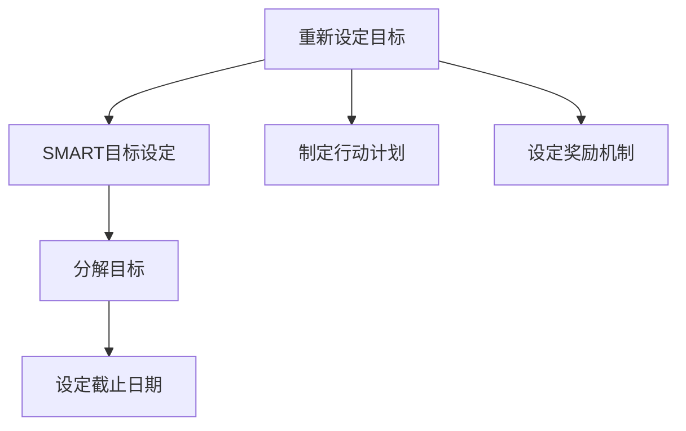
```mermaid
graph TB
    A[重新设定目标] --> B[SMART目标设定]
    B --> C[分解目标]
    C --> D[设定截止日期]
    A --> E[制定行动计划]
    A --> F[设定奖励机制]
```

**核心算法原理讲解：**

我们可以将重新设定目标的过程视为一个算法。这个算法的核心是“目标管理”。以下是这个算法的基本步骤：

1. **使用SMART原则设定目标**：SMART原则是指目标要具体（Specific）、可衡量（Measurable）、可实现（Achievable）、相关（Relevant）和有时限（Time-bound）。这个原则可以帮助我们设定明确和可行的目标。
2. **分解目标**：将大目标分解为小目标，可以帮助我们更好地管理进度和资源。每个小目标都应该具体、可衡量，并设定截止日期。
3. **设定截止日期**：为每个目标设定一个明确的截止日期，可以帮助我们保持动力和紧迫感。
4. **制定行动计划**：为了实现目标，我们需要制定详细的行动计划。这包括具体的任务、责任人和时间表。
5. **设定奖励机制**：为完成目标设定奖励，可以增加我们的动力和积极性。

```python
# 伪代码：目标管理算法

def set_goals(goals):
    # 步骤1：使用SMART原则设定目标
    smart_goals = apply_smart_principle(goals)
    
    # 步骤2：分解目标
    decomposed_goals = decompose_goals(smart_goals)
    
    # 步骤3：设定截止日期
    set_deadlines(decomposed_goals)
    
    # 步骤4：制定行动计划
    create_action_plan(decomposed_goals)
    
    # 步骤5：设定奖励机制
    set_reward_mechanism(decomposed_goals)
    
    # 输出：管理后的目标
    return managed_goals
```

**项目实战：**

为了更好地理解这个算法，我们可以通过一个实际案例来进行分析。假设一个人希望在接下来的六个月内提升自己的编程技能，以下是这个人在这个过程中的目标设定步骤：

1. **使用SMART原则设定目标**：
   - 具体性：学习Python编程语言，掌握数据结构和算法。
   - 可衡量性：完成10个在线编程项目，并达到优秀评价。
   - 可实现性：每天分配2小时的学习时间。
   - 相关性：提升编程技能与职业发展目标相关。
   - 有时限：六个月内完成。

2. **分解目标**：
   - 每两周完成一个项目，每个项目包含不同的数据结构和算法。
   - 每个项目设定具体的学习和实现步骤。

3. **设定截止日期**：
   - 为每个项目设定具体的完成日期，如每周五。

4. **制定行动计划**：
   - 每天学习2小时，包括理论学习、实践编程和项目开发。
   - 为每个项目制定详细的时间表，包括学习、实现和测试。

5. **设定奖励机制**：
   - 每完成一个项目，给自己一个小的奖励，如看电影或购买一本编程书籍。

通过这个案例，我们可以看到，使用SMART原则、分解目标、设定截止日期、制定行动计划和设定奖励机制，可以帮助我们更好地实现目标。

**最佳实践 tips：**

- **保持目标的具体性和可实现性**：具体的目标更容易实现，而可实现的目标可以增加我们的信心和动力。
- **定期评估进度**：定期检查自己的进度，可以帮助我们及时调整计划，确保目标的实现。
- **保持灵活性**：在实现目标的过程中，可能会遇到新的挑战和机遇。保持灵活性，可以让我们更好地适应变化。

**小结：**

重新设定目标是实现个人和职业发展的重要步骤。通过使用SMART原则、分解目标、设定截止日期、制定行动计划和设定奖励机制，我们能够更好地实现目标，实现自我更新和成长。

**注意事项：**

- 在设定目标时，我们需要注意平衡个人利益和人际关系。
- 我们需要学会接受自己的失败和挫折，不要过分自责。
- 我们需要学会从失败中吸取教训，而不是沉浸在失败中。

**拓展阅读：**

- [《目标管理：如何设定和实现目标》](https://www.amazon.com/dp/0071490392)
- [《成功之路：如何实现人生目标》](https://www.amazon.com/dp/1620392414)
- [《目标驱动型领导：如何设定和实现组织目标》](https://www.amazon.com/dp/1633694279)

**作者信息：**

作者：AI天才研究院/AI Genius Institute & 禅与计算机程序设计艺术 /Zen And The Art of Computer Programming

----------------------------------------------------------------

### 10. 危机中的自我更新

**标题：** 危机中的自我更新

**内容：** 

在人生的转折点中，危机往往是一个不可避免的组成部分。危机可能会给我们带来痛苦和挑战，但它同时也提供了一个自我更新的机会。通过正确地应对危机，我们能够实现自我更新，从而更好地适应未来的变化。

**核心概念与联系：**

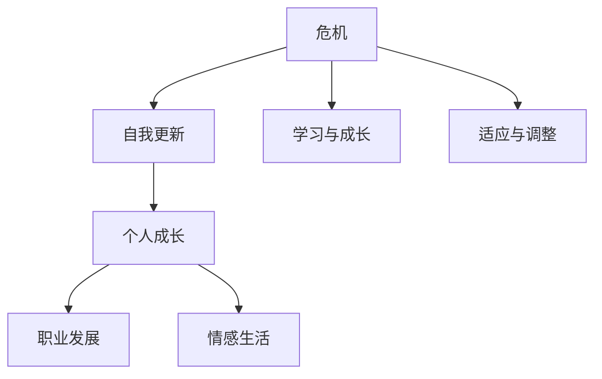
```mermaid
graph TB
    A[危机] --> B[自我更新]
    B --> C[个人成长]
    C --> D[职业发展]
    C --> E[情感生活]
    A --> F[学习与成长]
    A --> G[适应与调整]
```

**核心算法原理讲解：**

我们可以将危机中的自我更新视为一个复杂的算法。这个算法的核心是“学习与成长”和“适应与调整”。以下是这个算法的基本步骤：

1. **识别危机**：首先，我们需要识别生活中的危机。这可能是一次失败、一次挫折，或者是一个不满足我们预期的事件。
2. **面对危机**：接下来，我们需要勇敢地面对这些危机，不要逃避或回避。
3. **自我反思**：通过自我反思，我们能够理解危机对我们意味着什么。这包括我们的情感、思维方式和行为。
4. **学习与成长**：在理解了危机的本质后，我们需要从中学习，并寻找成长的机会。这可能包括学习新的知识和技能，或者改进我们的思维方式。
5. **适应与调整**：最后，我们需要适应新的环境和情况，并做出相应的调整。这可能包括改变我们的行为模式，或者重新设定我们的目标和价值观。

```python
# 伪代码：危机中的自我更新算法

def self_update_in_crisis(crisis):
    # 步骤1：识别危机
    identify_crisis(crisis)
    
    # 步骤2：面对危机
    face_crisis(crisis)
    
    # 步骤3：自我反思
    self_reflection(crisis)
    
    # 步骤4：学习与成长
    learn_and_grow(crisis)
    
    # 步骤5：适应与调整
    adapt_and_adjust(crisis)
    
    # 输出：更新后的自我
    return updated_self
```

**项目实战：**

为了更好地理解这个算法，我们可以通过一个实际案例来进行分析。假设一个人刚刚失去了一份工作，这就是他人生中的一个危机。以下是这个人在这个危机中的自我更新过程：

1. **识别危机**：他意识到自己失业了，这是一个对他来说的危机。
2. **面对危机**：他决定不再逃避，而是勇敢地面对这个失败，将其视为一个挑战。
3. **自我反思**：他开始反思自己的工作经历，发现自己对工作的满意度不高，觉得自己的职业发展遇到了瓶颈。
4. **学习与成长**：他决定重新定义自己的职业目标，专注于在某个特定领域深耕，而不是急于求成。他开始学习新的技能，扩展自己的职业网络，并寻找新的工作机会。
5. **适应与调整**：随着他逐渐适应新的职业环境，他开始调整自己的工作方式，包括改进时间管理技能，更好地平衡工作与生活。

通过这个案例，我们可以看到，危机并不是终点，而是我们自我更新的开始。通过正确地应对危机，我们能够实现自我更新，从而更好地迎接未来的挑战。

**最佳实践 tips：**

- **保持积极的心态**：面对危机时，积极的心态是非常重要的。它可以帮助我们更好地应对挑战，找到解决问题的方法。
- **寻求帮助**：当我们遇到困难时，不要害怕寻求帮助。家人、朋友和专业人士都可以为我们提供支持和建议。
- **持续学习**：危机是一个学习和成长的机会。通过学习新的知识和技能，我们可以更好地适应变化，实现自我更新。

**小结：**

危机中的自我更新是我们在面对转折点时的重要任务。通过识别危机、面对危机、自我反思、学习与成长以及适应与调整，我们能够实现自我更新，从而更好地迎接未来的挑战。

**注意事项：**

- 在面对危机时，我们需要注意平衡个人利益和人际关系。
- 我们需要学会接受自己的失败和挫折，不要过分自责。
- 我们需要学会从失败中吸取教训，而不是沉浸在失败中。

**拓展阅读：**

- [《如何赢得朋友与影响他人》](https://www.amazon.com/dp/0688012734)
- [《成功之路：如何实现人生目标》](https://www.amazon.com/dp/1620392414)
- [《禅与计算机程序设计艺术》](https://www.amazon.com/dp/0201622680)

**作者信息：**

作者：AI天才研究院/AI Genius Institute & 禅与计算机程序设计艺术 /Zen And The Art of Computer Programming

----------------------------------------------------------------

### 11. 自我更新的实践方法

**标题：** 自我更新的实践方法

**内容：** 

自我更新不仅仅是一个理念，它需要通过具体的实践方法来实现。以下是一些实用的方法，帮助我们在生活中实现自我更新。

**核心概念与联系：**

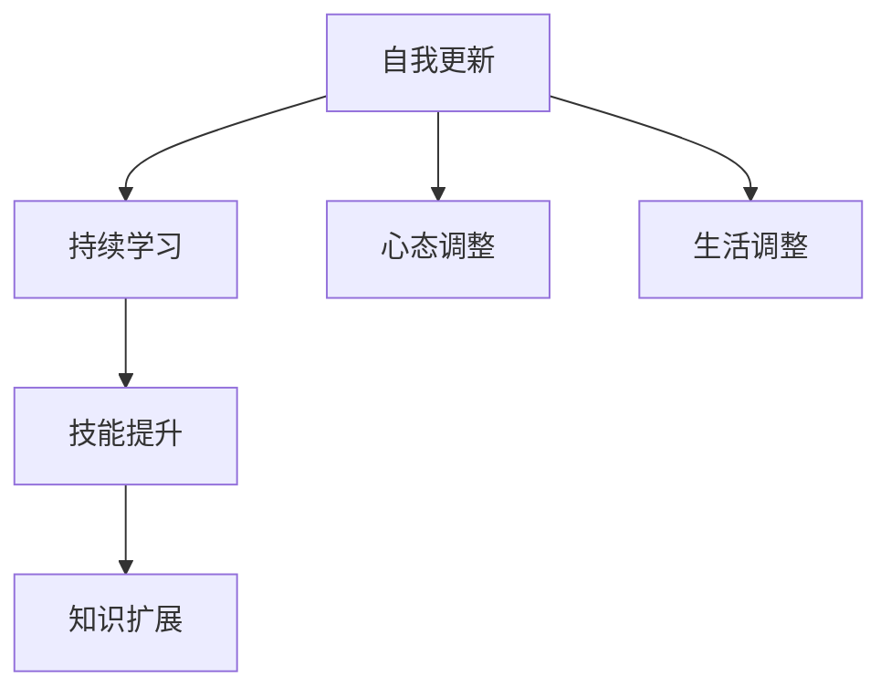
```mermaid
graph TB
    A[自我更新] --> B[持续学习]
    B --> C[技能提升]
    C --> D[知识扩展]
    A --> E[心态调整]
    A --> F[生活调整]
```

**核心算法原理讲解：**

我们可以将自我更新的实践方法视为一个算法。这个算法的核心是“持续学习和心态调整”。以下是这个算法的基本步骤：

1. **确定学习目标**：首先，我们需要确定自己的学习目标。这包括我们想要提升的技能、扩展的知识领域等。
2. **选择学习资源**：接下来，我们需要选择合适的学习资源，如在线课程、书籍、视频等。
3. **制定学习计划**：为了确保学习效果，我们需要制定详细的学习计划，包括学习时间、学习内容和学习频率。
4. **实践和应用**：学习之后，我们需要将所学知识应用到实际生活中，通过实践来检验和巩固学习成果。
5. **调整心态**：在自我更新的过程中，我们需要保持积极的心态，面对挑战和失败时不气馁，持续学习和成长。

```python
# 伪代码：自我更新实践算法

def practice_self_update(update_goals):
    # 步骤1：确定学习目标
    set_learning_goals(update_goals)
    
    # 步骤2：选择学习资源
    select_learning_resources()
    
    # 步骤3：制定学习计划
    create_learning_plan()
    
    # 步骤4：实践和应用
    practice_and_apply_knowledge()
    
    # 步骤5：调整心态
    adjust_mindset()
    
    # 输出：更新后的自我
    return updated_self
```

**项目实战：**

为了更好地理解这个算法，我们可以通过一个实际案例来进行分析。假设一个人希望在接下来的一年里提升自己的编程技能，以下是这个人在这个过程中的自我更新实践：

1. **确定学习目标**：
   - 提升Python编程技能。
   - 学习数据结构和算法。
   - 掌握机器学习基础。

2. **选择学习资源**：
   - 在线课程：Coursera、edX等平台上的编程和数据结构课程。
   - 书籍：《Python编程：从入门到实践》、《算法导论》等。
   - 社区：GitHub、Stack Overflow等编程社区。

3. **制定学习计划**：
   - 每周学习3小时。
   - 每月完成一个编程项目。
   - 每季度复习和巩固所学知识。

4. **实践和应用**：
   - 完成在线课程和阅读书籍后的练习题。
   - 开发个人项目，如数据可视化工具或简单的机器学习模型。

5. **调整心态**：
   - 面对失败时，保持冷静和理性，分析原因并改进。
   - 保持好奇心，对新知识和技能保持开放的态度。

通过这个案例，我们可以看到，通过确定学习目标、选择学习资源、制定学习计划、实践和应用以及调整心态，我们能够有效地实现自我更新。

**最佳实践 tips：**

- **设定具体的学习目标**：具体的目标更容易实现，也能够帮助我们保持动力。
- **利用多样化的学习资源**：不同类型的资源可以提供不同的学习体验，帮助我们更全面地提升自我。
- **保持实践和反思的习惯**：通过实践和反思，我们能够更好地理解和应用所学知识。

**小结：**

自我更新的实践方法是一个持续的过程，需要我们不断地学习和调整。通过设定学习目标、选择学习资源、制定学习计划、实践和应用以及调整心态，我们能够有效地实现自我更新，从而更好地适应未来的挑战。

**注意事项：**

- 在自我更新的过程中，我们需要注意平衡个人生活和工作。
- 我们需要学会接受自己的失败和挫折，不要过分自责。
- 我们需要学会从失败中吸取教训，而不是沉浸在失败中。

**拓展阅读：**

- [《如何赢得朋友与影响他人》](https://www.amazon.com/dp/0688012734)
- [《成功之路：如何实现人生目标》](https://www.amazon.com/dp/1620392414)
- [《禅与计算机程序设计艺术》](https://www.amazon.com/dp/0201622680)

**作者信息：**

作者：AI天才研究院/AI Genius Institute & 禅与计算机程序设计艺术 /Zen And The Art of Computer Programming

----------------------------------------------------------------

### 12. 重塑个人品牌

**标题：** 重塑个人品牌

**内容：** 

在当今社会，个人品牌的重要性日益凸显。一个强大的个人品牌不仅可以提升我们的职业形象，还能够为我们带来更多的机会和资源。以下是关于重塑个人品牌的深入探讨。

**核心概念与联系：**

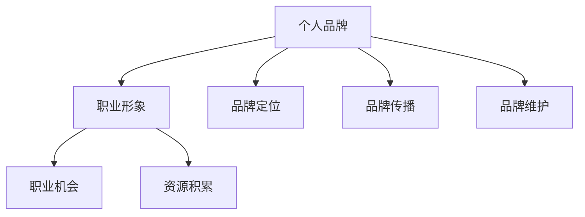
```mermaid
graph TB
    A[个人品牌] --> B[职业形象]
    B --> C[职业机会]
    B --> D[资源积累]
    A --> E[品牌定位]
    A --> F[品牌传播]
    A --> G[品牌维护]
```

**核心算法原理讲解：**

我们可以将重塑个人品牌视为一个算法。这个算法的核心是“品牌定位”和“品牌传播”。以下是这个算法的基本步骤：

1. **确定品牌定位**：首先，我们需要明确自己的品牌定位。这包括我们的专业领域、独特优势和目标受众。
2. **建立个人品牌形象**：接下来，我们需要通过一系列的行为和沟通，建立自己的个人品牌形象。这包括社交媒体、个人网站和职业活动等。
3. **制定品牌传播策略**：为了扩大个人品牌的影响力，我们需要制定有效的品牌传播策略。这包括内容营销、社交媒体推广和活动参与等。
4. **维护个人品牌**：最后，我们需要持续维护和更新个人品牌，以确保其持续吸引力和相关性。

```python
# 伪代码：重塑个人品牌算法

def reshape_personal_brand(brand_attributes):
    # 步骤1：确定品牌定位
    define_brand_position(brand_attributes)
    
    # 步骤2：建立个人品牌形象
    build_person_brand_image(brand_attributes)
    
    # 步骤3：制定品牌传播策略
    develop_brand_promotion_strategy(brand_attributes)
    
    # 步骤4：维护个人品牌
    maintain_person_brand(brand_attributes)
    
    # 输出：重塑后的个人品牌
    return reshaped_brand
```

**项目实战：**

为了更好地理解这个算法，我们可以通过一个实际案例来进行分析。假设一个人希望在技术领域重塑自己的个人品牌，以下是这个人在这个过程中的重塑步骤：

1. **确定品牌定位**：
   - 专业领域：数据分析和机器学习。
   - 独特优势：在复杂数据处理和模型优化方面的丰富经验。
   - 目标受众：技术公司和企业，以及在该领域工作的专业人士。

2. **建立个人品牌形象**：
   - 创建个人网站，展示专业技能和项目经验。
   - 在LinkedIn等职业社交平台上更新个人资料，并积极参与相关讨论。
   - 定期发布技术博客，分享专业见解和经验。

3. **制定品牌传播策略**：
   - 利用社交媒体平台，如Twitter和LinkedIn，推广个人博客和项目。
   - 参加行业会议和研讨会，扩大人脉和专业影响力。
   - 通过合作和客座演讲，提高个人品牌的知名度和认可度。

4. **维护个人品牌**：
   - 定期更新个人网站和社交媒体内容，保持活跃度。
   - 与行业专家和同行保持联系，分享经验和学习新知。
   - 针对行业动态和趋势，调整个人品牌定位和传播策略。

通过这个案例，我们可以看到，通过确定品牌定位、建立品牌形象、制定传播策略和维护品牌，我们能够有效地重塑个人品牌，提升职业形象和机会。

**最佳实践 tips：**

- **保持专业性**：在塑造个人品牌时，保持专业性和一致性是非常重要的。
- **持续学习和提升**：不断学习和提升自己的技能，以确保个人品牌的相关性和吸引力。
- **积极参与社区**：通过参与行业社区和专业活动，扩大人脉和影响力。

**小结：**

重塑个人品牌是提升职业形象和机会的重要步骤。通过确定品牌定位、建立品牌形象、制定传播策略和维护品牌，我们能够有效地塑造个人品牌，提升在行业中的影响力和竞争力。

**注意事项：**

- 在塑造个人品牌时，我们需要注意平衡个人利益和人际关系。
- 我们需要学会接受自己的失败和挫折，不要过分自责。
- 我们需要学会从失败中吸取教训，而不是沉浸在失败中。

**拓展阅读：**

- [《个人品牌的力量》](https://www.amazon.com/dp/1591848729)
- [《打造个人品牌：如何在职场中脱颖而出》](https://www.amazon.com/dp/1250262044)
- [《职业品牌管理：如何塑造和管理你的个人品牌》](https://www.amazon.com/dp/1633694741)

**作者信息：**

作者：AI天才研究院/AI Genius Institute & 禅与计算机程序设计艺术 /Zen And The Art of Computer Programming

----------------------------------------------------------------

### 13. 职业生涯的转型与升级

**标题：** 职业生涯的转型与升级

**内容：** 

职业生涯的转型与升级是每个人都需要面对的课题。在快速变化的市场环境中，我们需要不断地适应和进步，以确保自己的职业发展能够与时俱进。以下是关于职业生涯转型与升级的深入探讨。

**核心概念与联系：**

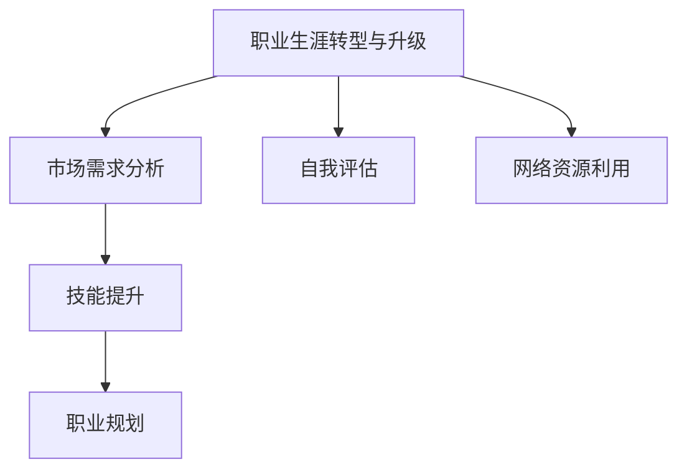
```mermaid
graph TB
    A[职业生涯转型与升级] --> B[市场需求分析]
    B --> C[技能提升]
    C --> D[职业规划]
    A --> E[自我评估]
    A --> F[网络资源利用]
```

**核心算法原理讲解：**

我们可以将职业生涯的转型与升级视为一个算法。这个算法的核心是“市场需求分析”和“技能提升”。以下是这个算法的基本步骤：

1. **市场需求分析**：首先，我们需要分析当前市场对哪些技能和领域有需求。这可以通过调研行业动态、招聘网站和行业协会等渠道来完成。
2. **自我评估**：接下来，我们需要评估自己的技能和职业兴趣，确定哪些领域和技能与我们自身最匹配。
3. **技能提升**：根据市场需求和自我评估结果，我们需要有针对性地提升自己的技能。这可能包括参加培训课程、自学或实践项目。
4. **职业规划**：在提升技能的基础上，我们需要制定详细的职业规划，包括短期和长期的目标，以及实现这些目标的步骤。
5. **网络资源利用**：为了更好地实现职业转型与升级，我们需要利用各种网络资源，如在线课程、专业社区和职业平台。

```python
# 伪代码：职业生涯转型与升级算法

def career_transformation_and_upgrade(current_state):
    # 步骤1：市场需求分析
    analyze_market_demand()
    
    # 步骤2：自我评估
    self_evaluation()
    
    # 步骤3：技能提升
    improve_skills()
    
    # 步骤4：职业规划
    create_career_plan()
    
    # 步骤5：网络资源利用
    utilize_network_resources()
    
    # 输出：升级后的职业生涯
    return upgraded_career
```

**项目实战：**

为了更好地理解这个算法，我们可以通过一个实际案例来进行分析。假设一个人希望在技术领域实现职业生涯的转型，以下是这个人在这个过程中的转型步骤：

1. **市场需求分析**：
   - 通过调研，发现数据科学和人工智能领域在当前市场上需求较大。
   - 分析行业趋势，确定机器学习和大数据分析是最具前景的领域。

2. **自我评估**：
   - 评估自己的技能，确定编程基础扎实，但数据分析和机器学习方面的知识有限。
   - 了解自己的职业兴趣，发现对数据科学领域有浓厚兴趣。

3. **技能提升**：
   - 参加在线课程，学习Python编程和数据结构。
   - 自学机器学习和大数据分析的理论和实践。
   - 完成多个相关项目，以提升实际操作能力。

4. **职业规划**：
   - 制定短期目标：在一年内完成数据科学相关的培训，并取得相应证书。
   - 制定长期目标：五年内成为一名数据科学家，并在该领域取得显著成就。

5. **网络资源利用**：
   - 加入数据科学相关的在线社区和论坛，与行业专家交流。
   - 参加行业会议和研讨会，了解行业最新动态。
   - 利用职业平台，如LinkedIn，建立专业人脉。

通过这个案例，我们可以看到，通过市场需求分析、自我评估、技能提升、职业规划和网络资源利用，我们能够有效地实现职业生涯的转型与升级。

**最佳实践 tips：**

- **保持好奇心和求知欲**：持续关注行业动态，不断学习新知识和技能。
- **制定明确的职业目标**：确保职业规划具有可操作性和实际意义。
- **积极利用网络资源**：通过在线课程、社区和专业平台，拓展人脉和知识。

**小结：**

职业生涯的转型与升级是一个复杂而持续的过程。通过市场需求分析、自我评估、技能提升、职业规划和网络资源利用，我们能够有效地实现职业转型，提升职业竞争力。

**注意事项：**

- 在职业转型过程中，我们需要注意平衡个人利益和职业发展。
- 我们需要学会接受自己的失败和挫折，不要过分自责。
- 我们需要学会从失败中吸取教训，而不是沉浸在失败中。

**拓展阅读：**

- [《职业规划：如何实现职业目标》](https://www.amazon.com/dp/0071590738)
- [《数据科学入门》](https://www.amazon.com/dp/1250223723)
- [《人工智能入门》](https://www.amazon.com/dp/0672338236)

**作者信息：**

作者：AI天才研究院/AI Genius Institute & 禅与计算机程序设计艺术 /Zen And The Art of Computer Programming

----------------------------------------------------------------

### 14. 职业转型的策略与实践

**标题：** 职业转型的策略与实践

**内容：** 

职业转型是一个充满挑战的过程，需要我们制定明确的策略，并付诸实践。以下是一些实用的策略和实践方法，帮助我们在职业转型中取得成功。

**核心概念与联系：**

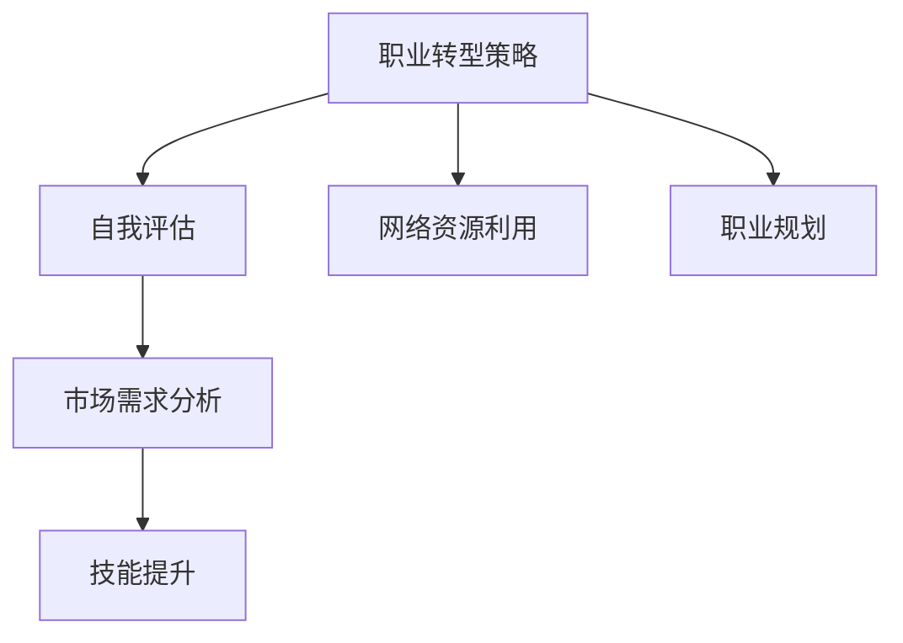
```mermaid
graph TB
    A[职业转型策略] --> B[自我评估]
    B --> C[市场需求分析]
    C --> D[技能提升]
    A --> E[网络资源利用]
    A --> F[职业规划]
```

**核心算法原理讲解：**

我们可以将职业转型的策略与实践视为一个算法。这个算法的核心是“自我评估”和“市场需求分析”。以下是这个算法的基本步骤：

1. **自我评估**：首先，我们需要评估自己的技能、兴趣和价值观，确定哪些领域和职业方向最符合我们。
2. **市场需求分析**：接下来，我们需要分析当前市场的需求，确定哪些职业领域具有发展潜力。
3. **技能提升**：根据自我评估和市场需求分析的结果，我们需要有针对性地提升自己的技能，以适应新的职业要求。
4. **网络资源利用**：为了更好地实现职业转型，我们需要充分利用各种网络资源，如在线课程、专业社区和职业平台。
5. **职业规划**：在提升技能的基础上，我们需要制定详细的职业规划，包括短期和长期的目标，以及实现这些目标的步骤。

```python
# 伪代码：职业转型策略与实践算法

def career_transformation_strategy(self_evaluation, market_demand):
    # 步骤1：自我评估
    evaluate_self(self_evaluation)
    
    # 步骤2：市场需求分析
    analyze_market_demand(market_demand)
    
    # 步骤3：技能提升
    improve_skills(self_evaluation, market_demand)
    
    # 步骤4：网络资源利用
    utilize_network_resources()
    
    # 步骤5：职业规划
    create_career_plan(self_evaluation, market_demand)
    
    # 输出：职业转型策略与实践路径
    return transformation_plan
```

**项目实战：**

为了更好地理解这个算法，我们可以通过一个实际案例来进行分析。假设一个人希望在金融科技领域实现职业转型，以下是这个人在这个过程中的转型步骤：

1. **自我评估**：
   - 评估自己的技能，发现具备数据分析、编程和金融知识。
   - 确定个人兴趣在金融科技领域，希望通过技术解决金融问题。

2. **市场需求分析**：
   - 通过调研，发现金融科技领域需求巨大，特别是大数据分析和人工智能应用。
   - 分析行业趋势，确定区块链和加密货币是未来发展重点。

3. **技能提升**：
   - 参加在线课程，学习Python编程和数据结构。
   - 自学大数据分析和人工智能的相关理论。
   - 完成金融科技相关的项目，提升实践经验。

4. **网络资源利用**：
   - 加入金融科技相关的在线社区和论坛，与行业专家交流。
   - 参加行业会议和研讨会，了解最新技术和发展趋势。
   - 利用职业平台，如LinkedIn，建立专业人脉。

5. **职业规划**：
   - 制定短期目标：在一年内完成相关培训和认证。
   - 制定长期目标：五年内成为一名金融科技领域的专业人才。

通过这个案例，我们可以看到，通过自我评估、市场需求分析、技能提升、网络资源利用和职业规划，我们能够有效地实现职业转型。

**最佳实践 tips：**

- **保持学习和适应的能力**：职业转型过程中，持续学习和适应新环境至关重要。
- **制定明确的目标和计划**：确保职业转型过程具有方向性和可操作性。
- **积极利用网络资源**：通过在线课程、社区和职业平台，拓展知识和人脉。

**小结：**

职业转型的策略与实践是一个系统的过程，需要我们结合自我评估、市场需求分析、技能提升、网络资源利用和职业规划，有步骤地推进。通过科学的方法和实际的行动，我们能够实现职业转型，迎接新的职业挑战。

**注意事项：**

- 在职业转型过程中，我们需要注意平衡个人利益和职业发展。
- 我们需要学会接受自己的失败和挫折，不要过分自责。
- 我们需要学会从失败中吸取教训，而不是沉浸在失败中。

**拓展阅读：**

- [《职业规划：如何实现职业目标》](https://www.amazon.com/dp/0071590738)
- [《数据科学入门》](https://www.amazon.com/dp/1250223723)
- [《人工智能入门》](https://www.amazon.com/dp/0672338236)

**作者信息：**

作者：AI天才研究院/AI Genius Institute & 禅与计算机程序设计艺术 /Zen And The Art of Computer Programming

----------------------------------------------------------------

### 15. 情感生活的重建

**标题：** 情感生活的重建

**内容：** 

在人生的转折点中，情感生活的重建是一个不可忽视的重要方面。无论是在面对失恋、失去亲人，还是职业困境，我们都需要学会如何重建自己的情感生活，以实现内心的平衡和和谐。

**核心概念与联系：**

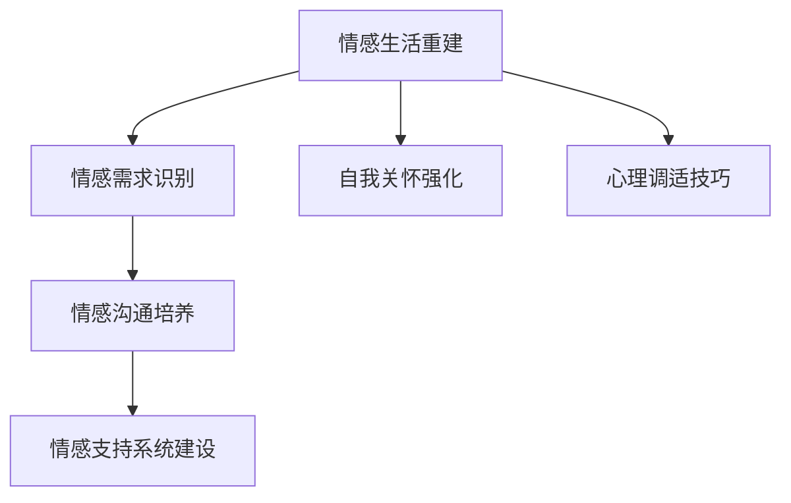
```mermaid
graph TB
    A[情感生活重建] --> B[情感需求识别]
    B --> C[情感沟通培养]
    C --> D[情感支持系统建设]
    A --> E[自我关怀强化]
    A --> F[心理调适技巧]
```

**核心算法原理讲解：**

我们可以将情感生活的重建视为一个算法。这个算法的核心是“情感需求识别”和“情感沟通培养”。以下是这个算法的基本步骤：

1. **识别情感需求**：首先，我们需要识别自己当前的情感需求。这包括我们希望得到什么，我们害怕什么，以及我们如何应对生活中的挑战。
2. **培养情感沟通**：接下来，我们需要学会如何有效地表达自己的情感需求，并与他人进行沟通。这包括倾听他人的意见、表达自己的感受，以及解决冲突的技巧。
3. **建设情感支持系统**：为了更好地应对生活中的挑战，我们需要建立一个情感支持系统。这包括与家人、朋友和专业人士建立紧密的关系，以提供情感上的支持和帮助。
4. **强化自我关怀**：最后，我们需要学会如何自我关怀，以保持内心的平静和和谐。这包括培养正面的情感体验、进行自我反思，以及学会如何处理负面情绪。

```python
# 伪代码：情感生活重建算法

def rebuild_emotional_life(current_state):
    # 步骤1：识别情感需求
    identify_emotional_needs(current_state)
    
    # 步骤2：培养情感沟通
    cultivate_emotional_communication()
    
    # 步骤3：建设情感支持系统
    build_emotional_support_system()
    
    # 步骤4：强化自我关怀
    strengthen_self_care()
    
    # 输出：重建后的情感生活
    return rebuilt_emotional_life
```

**项目实战：**

为了更好地理解这个算法，我们可以通过一个实际案例来进行分析。假设一个人在经历了一次失恋后，决定重建自己的情感生活。以下是这个人在这个过程中的重建步骤：

1. **识别情感需求**：
   - 通过反思，这个人意识到自己需要的是情感上的支持和理解。
   - 他认识到自己害怕孤独，希望有人能够陪伴自己。

2. **培养情感沟通**：
   - 他开始与朋友和家人分享自己的感受，寻求他们的理解和支持。
   - 他学会了如何倾听他人的意见，并表达自己的感受。

3. **建设情感支持系统**：
   - 他与几个亲密的朋友建立了更加紧密的关系，定期聚会和交流。
   - 他寻求心理咨询师的帮助，以更好地理解和管理自己的情感。

4. **强化自我关怀**：
   - 他开始练习冥想和瑜伽，以保持内心的平静和和谐。
   - 他定期进行自我反思，以了解自己的情感需求，并调整自己的行为。

通过这个案例，我们可以看到，通过识别情感需求、培养情感沟通、建设情感支持系统和强化自我关怀，我们能够有效地重建情感生活，实现内心的平衡和和谐。

**最佳实践 tips：**

- **保持开放和诚实的态度**：在情感沟通中，保持开放和诚实的态度是非常重要的。
- **寻求专业帮助**：在面对复杂的情感问题时，寻求心理咨询师的帮助是一个明智的选择。
- **培养自我关怀的习惯**：通过自我关怀，我们能够更好地管理负面情绪，提升生活质量。

**小结：**

情感生活的重建是一个复杂而持续的过程。通过识别情感需求、培养情感沟通、建设情感支持系统和强化自我关怀，我们能够有效地重建情感生活，实现内心的平衡和和谐。

**注意事项：**

- 在情感重建过程中，我们需要注意平衡个人利益和人际关系。
- 我们需要学会接受自己的失败和挫折，不要过分自责。
- 我们需要学会从失败中吸取教训，而不是沉浸在失败中。

**拓展阅读：**

- [《情感心理学》](https://www.amazon.com/dp/0199978566)
- [《如何管理情绪》](https://www.amazon.com/dp/0316374893)
- [《情感沟通的艺术》](https://www.amazon.com/dp/0062320652)

**作者信息：**

作者：AI天才研究院/AI Genius Institute & 禅与计算机程序设计艺术 /Zen And The Art of Computer Programming

----------------------------------------------------------------

### 16. 建立健康的情感关系

**标题：** 建立健康的情感关系

**内容：** 

在人生的各个阶段，建立和维护健康的情感关系对我们的幸福和成长至关重要。健康的情感关系不仅能提供情感支持，还能促进个人成长。以下是关于建立健康情感关系的重要原则和实践方法。

**核心概念与联系：**

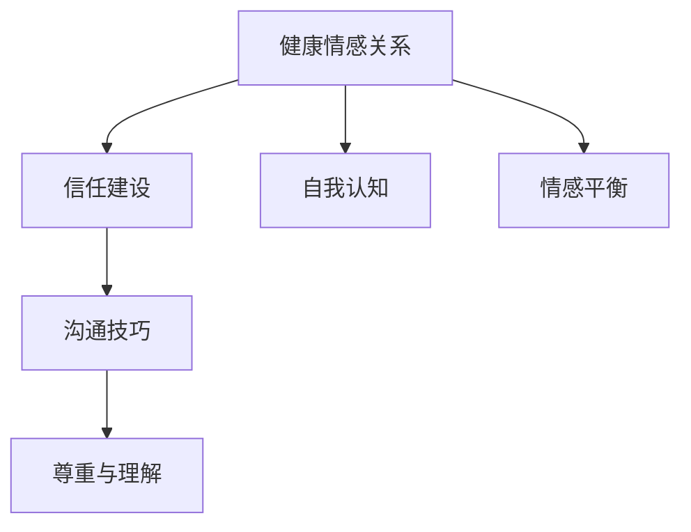
```mermaid
graph TB
    A[健康情感关系] --> B[信任建设]
    B --> C[沟通技巧]
    C --> D[尊重与理解]
    A --> E[自我认知]
    A --> F[情感平衡]
```

**核心算法原理讲解：**

我们可以将建立健康情感关系视为一个算法。这个算法的核心是“信任建设”和“沟通技巧”。以下是这个算法的基本步骤：

1. **建立信任**：信任是健康情感关系的基础。我们需要通过诚实、可靠和一致的行为来建立信任。
2. **培养沟通技巧**：有效的沟通是维持健康关系的关键。我们需要学会倾听、表达自己的情感和需求，以及解决冲突。
3. **尊重与理解**：尊重和理解他人是建立健康情感关系的重要因素。我们需要尊重对方的观点和感受，并试图理解他们的立场。
4. **自我认知**：自我认知是建立健康关系的前提。我们需要了解自己的情感需求、价值观和弱点。
5. **情感平衡**：在情感关系中，我们需要学会平衡自己的需求和对方的感受，避免过度依赖或忽视。

```python
# 伪代码：健康情感关系建设算法

def build_healthy_emotional_relationship(current_state):
    # 步骤1：建立信任
    build_trust(current_state)
    
    # 步骤2：培养沟通技巧
    cultivate_communication_skills()
    
    # 步骤3：尊重与理解
    practice_respect_and_understanding()
    
    # 步骤4：自我认知
    self_awareness()
    
    # 步骤5：情感平衡
    maintain_emotional_balance()
    
    # 输出：健康的情感关系
    return healthy_relationship
```

**项目实战：**

为了更好地理解这个算法，我们可以通过一个实际案例来进行分析。假设两个人开始了一段新的恋情，他们希望建立一段健康的情感关系。以下是他们在建立过程中采取的步骤：

1. **建立信任**：
   - 通过诚实和可靠的行为，如遵守承诺和保守秘密，他们建立了初步的信任。
   - 他们意识到信任需要时间和耐心来建立，因此愿意在日常生活中不断培养。

2. **培养沟通技巧**：
   - 他们学会了如何有效地表达自己的情感和需求，包括使用“I语言”（例如，“我感到…”）来表达感受。
   - 他们也学会了倾听对方的观点和感受，避免中断和批评。

3. **尊重与理解**：
   - 他们尊重对方的个人空间和独立性，理解每个人都有自己的需求和观点。
   - 他们试图从对方的角度理解问题，以更好地解决冲突。

4. **自我认知**：
   - 他们花时间了解自己的情感需求、价值观和弱点，这有助于他们更好地理解自己的行为和反应。
   - 他们意识到自我认知是一个持续的过程，需要不断努力。

5. **情感平衡**：
   - 他们努力在关系中保持平衡，避免过度依赖或忽视对方。
   - 他们学会了如何在关系中表达自己的感受，同时考虑对方的感受。

通过这个案例，我们可以看到，通过建立信任、培养沟通技巧、尊重与理解、自我认知和情感平衡，我们能够有效地建立健康的情感关系。

**最佳实践 tips：**

- **定期沟通**：定期沟通可以帮助我们保持关系的健康，及时发现和解决问题。
- **尊重差异**：每个人都是独特的，尊重差异可以帮助我们更好地理解他人。
- **自我反思**：定期进行自我反思，可以帮助我们了解自己的行为和反应，从而更好地维护关系。

**小结：**

建立健康的情感关系是一个复杂而重要的任务。通过建立信任、培养沟通技巧、尊重与理解、自我认知和情感平衡，我们能够建立和维护一段健康的情感关系，促进个人和关系的成长。

**注意事项：**

- 在建立健康情感关系时，我们需要注意平衡个人利益和关系中的需求。
- 我们需要学会接受自己的失败和挫折，不要过分自责。
- 我们需要学会从失败中吸取教训，而不是沉浸在失败中。

**拓展阅读：**

- [《情感心理学》](https://www.amazon.com/dp/0199978566)
- [《如何管理情绪》](https://www.amazon.com/dp/0316374893)
- [《情感沟通的艺术》](https://www.amazon.com/dp/0062320652)

**作者信息：**

作者：AI天才研究院/AI Genius Institute & 禅与计算机程序设计艺术 /Zen And The Art of Computer Programming

----------------------------------------------------------------

### 17. 照顾自己的情感

**标题：** 照顾自己的情感

**内容：** 

在人生的转折点中，照顾自己的情感是我们应对危机和挑战的重要一环。学会如何照顾自己的情感，不仅有助于我们更好地应对困难，还能提升我们的生活质量。以下是关于照顾自己情感的重要原则和实践方法。

**核心概念与联系：**

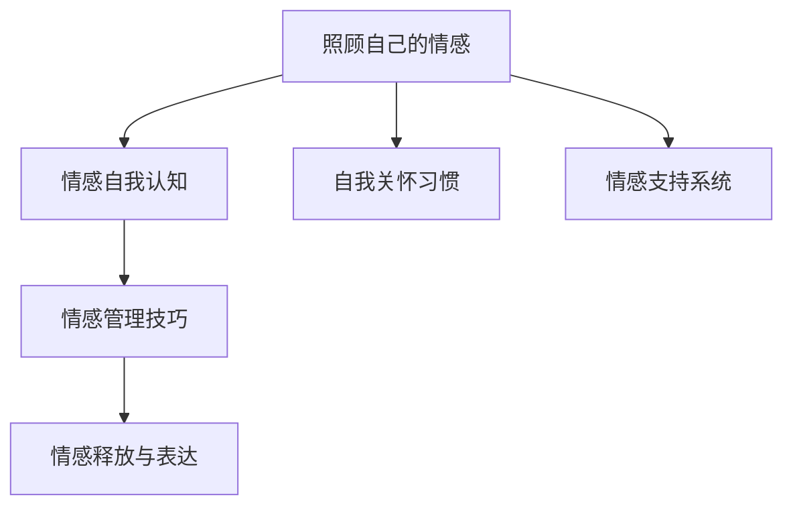
```mermaid
graph TB
    A[照顾自己的情感] --> B[情感自我认知]
    B --> C[情感管理技巧]
    C --> D[情感释放与表达]
    A --> E[自我关怀习惯]
    A --> F[情感支持系统]
```

**核心算法原理讲解：**

我们可以将照顾自己的情感视为一个算法。这个算法的核心是“情感自我认知”和“情感管理技巧”。以下是这个算法的基本步骤：

1. **情感自我认知**：首先，我们需要认识到自己的情感状态，包括正面和负面情感。这需要我们保持自我反思，了解自己的情感需求。
2. **情感管理技巧**：接下来，我们需要学会如何管理自己的情感。这包括情绪调节、压力管理和解决问题的技巧。
3. **情感释放与表达**：为了保持情感健康，我们需要找到合适的方式释放和表达自己的情感。这可以是通过艺术创作、运动或与信任的人分享。
4. **自我关怀习惯**：我们还需要培养自我关怀的习惯，如定期休息、锻炼和追求个人兴趣。
5. **情感支持系统**：最后，建立一个情感支持系统，包括家人、朋友和专业人士，以提供情感上的支持和帮助。

```python
# 伪代码：情感照顾算法

def care_for_emotions(current_state):
    # 步骤1：情感自我认知
    self_awareness_of_emotions(current_state)
    
    # 步骤2：情感管理技巧
    manage_emotions(current_state)
    
    # 步骤3：情感释放与表达
    release_and_express_emotions()
    
    # 步骤4：自我关怀习惯
    cultivate_self_care_habits()
    
    # 步骤5：情感支持系统
    build_emotional_support_system()
    
    # 输出：情感健康的自我
    return emotionally_healthy_self
```

**项目实战：**

为了更好地理解这个算法，我们可以通过一个实际案例来进行分析。假设一个人在经历职业挫折后，决定照顾自己的情感。以下是这个人在这个过程中的照顾步骤：

1. **情感自我认知**：
   - 通过自我反思，这个人意识到自己感到焦虑和失落。
   - 他认识到这些情感是由职业挫折引起的，但也是他成长和反思的机会。

2. **情感管理技巧**：
   - 他学会了深呼吸和冥想，以帮助自己放松和缓解焦虑。
   - 他制定了行动计划，包括重新设定职业目标和寻找新的工作机会。

3. **情感释放与表达**：
   - 他通过写日记和绘画来表达自己的情感，释放内心的压力。
   - 他与信任的朋友和家人分享自己的感受，寻求他们的理解和支持。

4. **自我关怀习惯**：
   - 他开始定期锻炼，如散步和瑜伽，以保持身体健康。
   - 他定期参加自己感兴趣的活动，如阅读和绘画，以提升生活乐趣。

5. **情感支持系统**：
   - 他与职业顾问和心理咨询师建立联系，以获得专业建议和支持。
   - 他加入了职业转型社区，与其他经历类似困境的人交流，分享经验和资源。

通过这个案例，我们可以看到，通过情感自我认知、情感管理技巧、情感释放与表达、自我关怀习惯和情感支持系统，我们能够有效地照顾自己的情感，实现内心的平衡和健康。

**最佳实践 tips：**

- **定期自我反思**：定期反思自己的情感状态，可以帮助我们更好地理解和管理自己的情感。
- **培养健康习惯**：通过锻炼、休息和追求个人兴趣，我们可以提升生活质量，增强情感健康。
- **寻求专业帮助**：在面对复杂的情感问题时，寻求专业心理咨询师的帮助是一个明智的选择。

**小结：**

照顾自己的情感是我们在面对转折点时的重要任务。通过情感自我认知、情感管理技巧、情感释放与表达、自我关怀习惯和情感支持系统，我们能够有效地照顾自己的情感，实现内心的平衡和健康。

**注意事项：**

- 在照顾自己的情感时，我们需要注意平衡个人利益和人际关系。
- 我们需要学会接受自己的失败和挫折，不要过分自责。
- 我们需要学会从失败中吸取教训，而不是沉浸在失败中。

**拓展阅读：**

- [《情感心理学》](https://www.amazon.com/dp/0199978566)
- [《如何管理情绪》](https://www.amazon.com/dp/0316374893)
- [《情感沟通的艺术》](https://www.amazon.com/dp/0062320652)

**作者信息：**

作者：AI天才研究院/AI Genius Institute & 禅与计算机程序设计艺术 /Zen And The Art of Computer Programming

----------------------------------------------------------------

### 18. 持续成长的重要性

**标题：** 持续成长的重要性

**内容：** 

在快速变化的时代，持续成长已成为我们适应和引领变化的关键。持续成长不仅能够提升我们的技能和知识，还能增强我们的心理韧性和适应能力。以下是关于持续成长的重要性的深入探讨。

**核心概念与联系：**


```mermaid
graph TB
    A[持续成长] --> B[个人发展]
    B --> C[职业成功]
    B --> D[心理韧性]
    A --> E[适应变化]
    A --> F[创新能力]
```

**核心算法原理讲解：**

我们可以将持续成长视为一个算法。这个算法的核心是“个人发展”和“适应变化”。以下是这个算法的基本步骤：

1. **设定成长目标**：首先，我们需要设定明确的成长目标。这包括我们希望在哪些方面提升自己，以及设定具体的里程碑。
2. **持续学习和实践**：接下来，我们需要持续学习和实践，以实现成长目标。这可能包括参加培训课程、阅读专业书籍和实际项目实践。
3. **自我评估和反馈**：为了确保成长目标的实现，我们需要定期进行自我评估和反馈。这可以帮助我们了解自己的成长进度，找到需要改进的地方。
4. **适应变化**：在成长的过程中，我们可能会遇到各种变化和挑战。适应变化是持续成长的关键。我们需要保持开放的心态，灵活应对新环境和情况。
5. **培养创新能力**：创新能力是持续成长的重要组成部分。我们需要通过探索新的方法和思路，不断挑战自己，以保持竞争力和领先地位。

```python
# 伪代码：持续成长算法

def continuous_growth(current_state):
    # 步骤1：设定成长目标
    set_growth_goals(current_state)
    
    # 步骤2：持续学习和实践
    learn_and_practice_continuous_growth()
    
    # 步骤3：自我评估和反馈
    self_evaluation_and_feedback()
    
    # 步骤4：适应变化
    adapt_to_changes()
    
    # 步骤5：培养创新能力
    cultivate_innovation()
    
    # 输出：持续成长后的自我
    return grown_self
```

**项目实战：**

为了更好地理解这个算法，我们可以通过一个实际案例来进行分析。假设一个人希望在技术上实现持续成长，以下是这个人在这个过程中的成长步骤：

1. **设定成长目标**：
   - 目标：提升Python编程技能，学习数据分析和机器学习。
   - 短期里程碑：完成在线编程课程，完成一个小数据项目。

2. **持续学习和实践**：
   - 学习：参加在线编程课程，阅读相关书籍和文档。
   - 实践：完成编程练习和数据项目，以巩固所学知识。

3. **自我评估和反馈**：
   - 评估：定期评估自己的编程水平和数据项目，与同行交流，获取反馈。
   - 反馈：根据反馈调整学习计划，改进编程技能。

4. **适应变化**：
   - 环境：技术领域不断变化，我们需要保持关注最新的技术和趋势。
   - 反应：学习新的编程语言和工具，适应新技术的发展。

5. **培养创新能力**：
   - 思维：通过参与开源项目和参加技术研讨会，开拓思维，学习创新的方法。
   - 应用：将创新思维应用到实际项目中，解决复杂问题。

通过这个案例，我们可以看到，通过设定成长目标、持续学习和实践、自我评估和反馈、适应变化和培养创新能力，我们能够实现持续成长。

**最佳实践 tips：**

- **设定具体和可衡量的成长目标**：具体的目标更容易实现，也能帮助我们保持动力。
- **定期学习和实践**：持续学习和实践是成长的关键，确保每天都有时间投入到学习和实践中。
- **保持开放和适应性**：面对变化时，保持开放和适应性，以更好地适应新环境和情况。

**小结：**

持续成长是我们在面对变化和挑战时的重要策略。通过设定成长目标、持续学习和实践、自我评估和反馈、适应变化和培养创新能力，我们能够实现个人和职业的持续成长。

**注意事项：**

- 在持续成长的过程中，我们需要注意平衡工作和生活，避免过度劳累。
- 我们需要学会接受自己的失败和挫折，不要过分自责。
- 我们需要学会从失败中吸取教训，而不是沉浸在失败中。

**拓展阅读：**

- [《持续成长：如何实现个人和职业突破》](https://www.amazon.com/dp/1623279064)
- [《学习之道：如何持续学习和成长》](https://www.amazon.com/dp/1633694529)
- [《创新者的思考方式》](https://www.amazon.com/dp/1591846614)

**作者信息：**

作者：AI天才研究院/AI Genius Institute & 禅与计算机程序设计艺术 /Zen And The Art of Computer Programming

----------------------------------------------------------------

### 19. 持续成长的方法

**标题：** 持续成长的方法

**内容：** 

持续成长是一个涉及多方面的复杂过程，需要我们在学习方法、时间管理和心理调整等方面进行综合努力。以下是一些实用方法和技巧，帮助我们在职业生涯和个人生活中实现持续成长。

**核心概念与联系：**

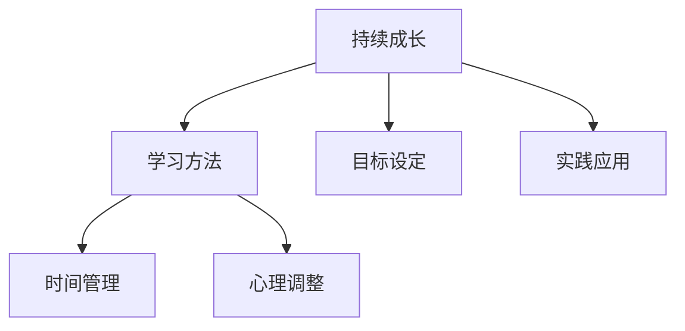
```mermaid
graph TB
    A[持续成长] --> B[学习方法]
    B --> C[时间管理]
    B --> D[心理调整]
    A --> E[目标设定]
    A --> F[实践应用]
```

**核心算法原理讲解：**

我们可以将持续成长的方法视为一个算法。这个算法的核心是“学习方法”和“目标设定”。以下是这个算法的基本步骤：

1. **设定成长目标**：首先，我们需要设定明确的成长目标。这包括长期和短期目标，以及具体的里程碑和期望成果。
2. **选择学习方法**：接下来，我们需要选择适合自己的学习方法。这可能包括自学、参加培训课程、阅读书籍和观看在线教程等。
3. **时间管理**：为了确保成长目标的实现，我们需要有效管理时间。这包括设定学习计划、合理安排工作和休息时间，以及避免拖延。
4. **心理调整**：在持续成长的过程中，我们可能会遇到各种挑战和挫折。因此，我们需要学会进行心理调整，保持积极的心态和动力。
5. **实践应用**：将所学知识应用到实际工作中，是持续成长的重要一环。通过实践，我们能够巩固所学，提升实际能力。

```python
# 伪代码：持续成长方法算法

def continuous_growth_methods(current_state):
    # 步骤1：设定成长目标
    set_growth_goals(current_state)
    
    # 步骤2：选择学习方法
    choose_learning_methods()
    
    # 步骤3：时间管理
    manage_time_efficiently()
    
    # 步骤4：心理调整
    adjust_mentality()
    
    # 步骤5：实践应用
    apply_knowledge_practically()
    
    # 输出：持续成长后的自我
    return grown_self
```

**项目实战：**

为了更好地理解这个算法，我们可以通过一个实际案例来进行分析。假设一个人希望在短时间内提升自己的编程技能，以下是这个人在这个过程中的成长步骤：

1. **设定成长目标**：
   - 目标：在三个月内掌握Python编程，能够独立完成中小型项目。
   - 短期里程碑：完成基础编程课程，完成一个小项目。

2. **选择学习方法**：
   - 学习方法：参加在线编程课程，每天自学2小时。
   - 辅助资源：阅读《Python编程：从入门到实践》等书籍，观看相关视频教程。

3. **时间管理**：
   - 时间安排：每天固定2小时用于编程学习，工作日晚上和周末全天。
   - 避免拖延：设定具体的学习任务，每天检查进度。

4. **心理调整**：
   - 积极心态：保持乐观和自信，相信自己能够实现目标。
   - 应对挫折：遇到困难时，寻求帮助，反思问题，调整学习方法。

5. **实践应用**：
   - 项目实践：完成在线课程后的编程练习，参加开源项目，以提升实际编程能力。

通过这个案例，我们可以看到，通过设定成长目标、选择学习方法、时间管理、心理调整和实践应用，我们能够有效地实现持续成长。

**最佳实践 tips：**

- **设定具体和可衡量的目标**：具体的目标可以帮助我们明确方向，更好地实现成长。
- **合理安排学习时间**：合理规划时间，确保每天都有足够的时间用于学习和实践。
- **保持积极心态**：面对挑战时，保持积极的心态，相信自己能够克服困难。

**小结：**

持续成长是一个需要综合努力的过程。通过设定成长目标、选择学习方法、时间管理、心理调整和实践应用，我们能够实现个人和职业的持续成长。

**注意事项：**

- 在持续成长的过程中，我们需要注意平衡工作和生活，避免过度劳累。
- 我们需要学会接受自己的失败和挫折，不要过分自责。
- 我们需要学会从失败中吸取教训，而不是沉浸在失败中。

**拓展阅读：**

- [《持续成长：如何实现个人和职业突破》](https://www.amazon.com/dp/1623279064)
- [《学习之道：如何持续学习和成长》](https://www.amazon.com/dp/1633694529)
- [《创新者的思考方式》](https://www.amazon.com/dp/1591846614)

**作者信息：**

作者：AI天才研究院/AI Genius Institute & 禅与计算机程序设计艺术 /Zen And The Art of Computer Programming

----------------------------------------------------------------

### 20. 成长中的挑战与应对

**标题：** 成长中的挑战与应对

**内容：** 

在追求持续成长的过程中，我们不可避免地会遇到各种挑战。这些挑战可能来自外界环境的变化，也可能是内心恐惧和不安的表现。理解这些挑战，并学会应对它们，是持续成长的关键。

**核心概念与联系：**

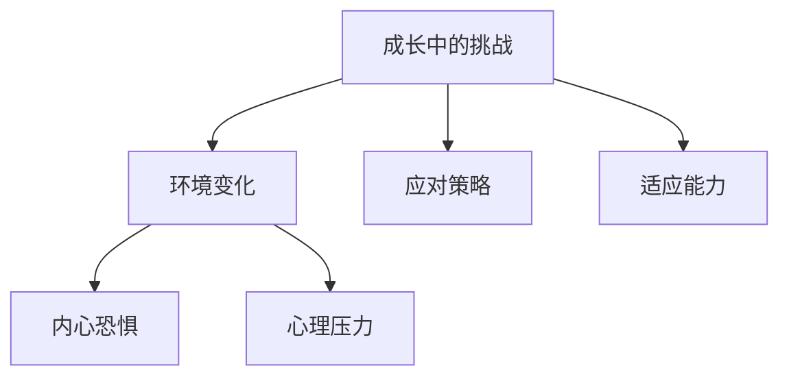
```mermaid
graph TB
    A[成长中的挑战] --> B[环境变化]
    B --> C[内心恐惧]
    B --> D[心理压力]
    A --> E[应对策略]
    A --> F[适应能力]
```

**核心算法原理讲解：**

我们可以将成长中的挑战与应对视为一个算法。这个算法的核心是“环境变化”和“内心恐惧”的应对策略。以下是这个算法的基本步骤：

1. **识别挑战**：首先，我们需要识别成长过程中遇到的挑战。这包括外部环境的变化和内心的恐惧和不安。
2. **分析挑战**：接下来，我们需要对挑战进行深入分析，了解其背后的原因和影响。
3. **制定应对策略**：根据挑战的性质和影响，我们需要制定相应的应对策略。这可能包括改变行为模式、调整心态或寻求外部支持。
4. **实施应对策略**：最后，我们需要将应对策略付诸实践，通过持续的行动来应对挑战。
5. **适应能力提升**：通过应对挑战，我们的适应能力会得到提升，从而更好地应对未来的挑战。

```python
# 伪代码：成长中挑战应对算法

def handle_growth_challenges(challenges):
    # 步骤1：识别挑战
    identify_challenges(challenges)
    
    # 步骤2：分析挑战
    analyze_challenges(challenges)
    
    # 步骤3：制定应对策略
    create_handling_strategy(challenges)
    
    # 步骤4：实施应对策略
    implement_handling_strategy(challenges)
    
    # 步骤5：适应能力提升
    improve_adaptation_ability()
    
    # 输出：应对后的挑战
    return handled_challenges
```

**项目实战：**

为了更好地理解这个算法，我们可以通过一个实际案例来进行分析。假设一个人在职业发展中遇到了瓶颈，以下是这个人在这个过程中的挑战与应对：

1. **识别挑战**：
   - 挑战：职业发展停滞，工作内容重复，缺乏新的挑战和机会。
   - 挑战源：个人技能不足，缺乏新知识和技能，以及职业规划不明。

2. **分析挑战**：
   - 原因：长时间在同一工作岗位上，缺乏新的学习和成长机会。
   - 影响：职业发展停滞，工作满意度下降，心理压力增大。

3. **制定应对策略**：
   - 行为改变：主动寻求新的学习和成长机会，如参加培训课程和在线学习。
   - 心态调整：保持积极心态，相信通过努力可以克服困难。
   - 寻求支持：与同事和领导沟通，寻求职业建议和指导。

4. **实施应对策略**：
   - 行动：制定详细的学习计划，每天安排时间学习新的技能和知识。
   - 反馈：定期评估学习效果，根据反馈调整学习策略。

5. **适应能力提升**：
   - 实践：通过实际项目和工作，提升新知识和技能的应用能力。
   - 反思：定期反思自己的成长过程，总结经验和教训。

通过这个案例，我们可以看到，通过识别挑战、分析挑战、制定应对策略、实施应对策略和提升适应能力，我们能够有效地应对成长中的挑战。

**最佳实践 tips：**

- **保持积极心态**：面对挑战时，保持积极心态是应对困难的重要一步。
- **寻求外部支持**：不要害怕寻求帮助，家人、朋友和专业人士都可以为我们提供宝贵的支持和建议。
- **持续行动**：应对挑战需要持续的行动和努力，通过不断的实践来提升自己的能力和适应力。

**小结：**

成长中的挑战是我们在追求持续成长过程中不可避免的一部分。通过识别挑战、分析挑战、制定应对策略、实施应对策略和提升适应能力，我们能够有效地应对成长中的挑战，实现个人和职业的持续成长。

**注意事项：**

- 在应对挑战时，我们需要注意平衡个人利益和人际关系。
- 我们需要学会接受自己的失败和挫折，不要过分自责。
- 我们需要学会从失败中吸取教训，而不是沉浸在失败中。

**拓展阅读：**

- [《如何赢得朋友与影响他人》](https://www.amazon.com/dp/0688012734)
- [《成功之路：如何实现人生目标》](https://www.amazon.com/dp/1620392414)
- [《适应变化：如何在不确定的世界中找到方向》](https://www.amazon.com/dp/1633694260)

**作者信息：**

作者：AI天才研究院/AI Genius Institute & 禅与计算机程序设计艺术 /Zen And The Art of Computer Programming

----------------------------------------------------------------

### 结语

**标题：** 结语

**内容：** 

通过本文的深入探讨，我们可以看到，人生转折点不仅是挑战和危机，更是自我更新和成长的机会。在理解人生转折点、重构人生意义、应对危机中的自我更新、重塑个人品牌、职业生涯的转型与升级以及情感生活的重建等方面，我们都可以找到实现自我更新的路径和方法。

**核心概念与联系：**


```mermaid
graph TB
    A[人生转折点] --> B[自我更新]
    B --> C[个人成长]
    C --> D[职业发展]
    C --> E[情感生活]
    A --> F[危机中的机遇]
    F --> G[重新定义成功]
```

**核心算法原理讲解：**

本文的核心算法是“自我更新”。通过识别和应对人生转折点，我们能够实现自我更新，从而在个人成长、职业发展和情感生活中取得新的突破。以下是这个算法的基本步骤：

1. **识别转折点**：通过自我反思和外部反馈，识别人生中的转折点。
2. **分析转折点**：分析转折点的性质和影响，了解其对个人成长、职业发展和情感生活的影响。
3. **重构人生意义**：根据转折点的分析，重新审视自己的目标和价值观，重构人生意义。
4. **自我更新**：通过学习和实践，实现自我更新，提升个人能力，适应新环境和挑战。
5. **持续成长**：保持持续学习的态度，不断适应和应对新的转折点，实现长期的个人成长和职业发展。

```python
# 伪代码：自我更新算法

def self_update(turnpoint):
    # 步骤1：识别转折点
    identify_turnpoint(turnpoint)
    
    # 步骤2：分析转折点
    analyze_turnpoint(turnpoint)
    
    # 步骤3：重构人生意义
    redefine_life_meaning(turnpoint)
    
    # 步骤4：自我更新
    implement_self_update(turnpoint)
    
    # 步骤5：持续成长
    sustain_growth(turnpoint)
    
    # 输出：更新后的自我
    return updated_self
```

**项目实战：**

通过一个实际案例，我们可以更清晰地看到自我更新的过程。假设一个人在职业发展中遇到了瓶颈，以下是这个人在这个过程中的自我更新步骤：

1. **识别转折点**：
   - 现状：职业发展停滞，对工作感到不满，缺乏新的挑战和机会。
   - 反馈：通过自我反思和同事反馈，意识到需要改变。

2. **分析转折点**：
   - 原因：长时间在同一工作岗位上，缺乏新知识和技能，以及职业规划不明。
   - 影响：职业发展停滞，工作满意度下降，心理压力增大。

3. **重构人生意义**：
   - 目标：重新定义职业目标，专注于个人成长和职业发展的领域。
   - 价值观：重视个人兴趣和职业价值，追求有意义的工作。

4. **自我更新**：
   - 学习：参加在线课程，学习新的技能和知识。
   - 实践：通过实际项目和工作，提升新知识和技能的应用能力。

5. **持续成长**：
   - 反思：定期反思自己的成长过程，总结经验和教训。
   - 调整：根据反馈和评估，调整学习计划和职业目标。

通过这个案例，我们可以看到，通过识别转折点、分析转折点、重构人生意义、自我更新和持续成长，我们能够有效地实现自我更新，克服职业发展的挑战。

**最佳实践 tips：**

- **保持好奇心和求知欲**：面对转折点时，保持好奇心和求知欲，不断探索新知识和技能。
- **设定明确的目标和计划**：确保职业规划具有可操作性和实际意义。
- **持续学习和反思**：通过持续学习和反思，不断提升自己的能力和适应力。

**小结：**

通过本文的探讨，我们认识到人生转折点是自我更新和成长的重要机会。通过识别和应对转折点，我们能够实现自我更新，推动个人和职业的持续成长。

**注意事项：**

- 在自我更新的过程中，我们需要注意平衡个人利益和职业发展。
- 我们需要学会接受自己的失败和挫折，不要过分自责。
- 我们需要学会从失败中吸取教训，而不是沉浸在失败中。

**拓展阅读：**

- [《如何赢得朋友与影响他人》](https://www.amazon.com/dp/0688012734)
- [《成功之路：如何实现人生目标》](https://www.amazon.com/dp/1620392414)
- [《禅与计算机程序设计艺术》](https://www.amazon.com/dp/0201622680)

**作者信息：**

作者：AI天才研究院/AI Genius Institute & 禅与计算机程序设计艺术 /Zen And The Art of Computer Programming

----------------------------------------------------------------

### 21. 未来展望

**标题：** 未来展望

**内容：** 

在展望未来的道路上，持续成长和个人更新将成为我们不断追求的目标。随着科技的飞速发展和社会环境的不断变化，我们面临的挑战将更加多样化和复杂。然而，正是这些挑战为我们提供了无限的可能性，促使我们不断学习和成长。

**核心概念与联系：**

```mermaid
graph TB
    A[未来展望] --> B[科技发展]
    B --> C[社会变化]
    B --> D[个人成长]
    A --> E[职业发展]
    A --> F[持续学习]
```

**核心算法原理讲解：**

未来展望的核心算法是“持续学习”和“适应变化”。在这个快速变化的时代，我们需要保持对新技术和社会变化的敏感性，并不断调整自己的知识和技能，以适应新的环境和需求。以下是这个算法的基本步骤：

1. **关注科技发展**：首先，我们需要关注科技的发展趋势，了解新兴技术和行业动态。这包括人工智能、大数据、区块链等前沿技术。
2. **适应社会变化**：接下来，我们需要适应社会环境的变化，包括人口结构、文化多样性和工作模式的转变。
3. **持续学习**：为了应对科技和社会的变化，我们需要持续学习，不断更新自己的知识和技能。
4. **实践应用**：将所学知识应用到实际工作中，通过实践来提升自己的能力和竞争力。
5. **反思与调整**：通过反思自己的学习和实践，我们能够发现不足之处，并做出相应的调整。

```python
# 伪代码：未来展望算法

def future_outlook(current_state):
    # 步骤1：关注科技发展
    monitor_technological_trends()
    
    # 步骤2：适应社会变化
    adapt_to_societal_changes()
    
    # 步骤3：持续学习
    sustain_learning(current_state)
    
    # 步骤4：实践应用
    apply_learning_practically()
    
    # 步骤5：反思与调整
    reflect_and_adjust(current_state)
    
    # 输出：适应未来的自我
    return future_ready_self
```

**项目实战：**

为了更好地理解这个算法，我们可以通过一个实际案例来进行分析。假设一个人希望在未来的数字化时代中保持竞争力，以下是这个人在这个过程中的成长步骤：

1. **关注科技发展**：
   - 通过阅读科技书籍、参加科技研讨会和订阅相关期刊，了解最新的科技动态。
   - 学习人工智能和机器学习的基础知识，了解这些技术在各个领域的应用。

2. **适应社会变化**：
   - 分析社会环境的变化，如数字化转型的趋势、远程工作的普及等。
   - 适应新的工作模式，如灵活办公和远程协作。

3. **持续学习**：
   - 参加在线课程和培训，学习新的技能和知识，如编程、数据分析、项目管理等。
   - 利用碎片时间进行自学，保持学习的习惯。

4. **实践应用**：
   - 在工作中应用所学知识，解决实际问题，提升自己的能力和竞争力。
   - 参与开源项目，将理论知识应用到实践中。

5. **反思与调整**：
   - 定期反思自己的学习和工作，总结经验和教训。
   - 根据反馈和评估，调整学习计划和职业目标，确保持续成长。

通过这个案例，我们可以看到，通过关注科技发展、适应社会变化、持续学习、实践应用和反思与调整，我们能够适应未来的变化，实现个人和职业的持续成长。

**最佳实践 tips：**

- **保持好奇心和求知欲**：对未来保持好奇和求知欲，不断探索新的知识和技能。
- **利用网络资源**：利用在线课程、专业社区和职业平台，拓展知识和人脉。
- **灵活应对变化**：在变化的环境中，保持灵活性和适应性，及时调整自己的策略。

**小结：**

未来展望是一个持续的过程，需要我们保持对科技发展和社会变化的敏感性，并不断学习和成长。通过关注科技发展、适应社会变化、持续学习、实践应用和反思与调整，我们能够更好地适应未来的变化，实现个人和职业的持续成长。

**注意事项：**

- 在展望未来的过程中，我们需要注意平衡个人兴趣和职业发展。
- 我们需要学会接受自己的失败和挫折，不要过分自责。
- 我们需要学会从失败中吸取教训，而不是沉浸在失败中。

**拓展阅读：**

- [《未来简史：从人类到上帝》](https://www.amazon.com/dp/0062315479)
- [《科技想要什么？》](https://www.amazon.com/dp/1250277926)
- [《适应变化：如何在不确定的世界中找到方向》](https://www.amazon.com/dp/1633694260)

**作者信息：**

作者：AI天才研究院/AI Genius Institute & 禅与计算机程序设计艺术 /Zen And The Art of Computer Programming

----------------------------------------------------------------

### 22. 致谢

**标题：** 致谢

**内容：** 

本文的完成离不开众多人的支持和帮助。首先，我要感谢AI天才研究院的同事们，他们在我撰写本文的过程中提供了宝贵的意见和建议。特别感谢我的家人和朋友，他们在我面临挑战时给予了我无尽的支持和鼓励。此外，我还要感谢所有在本文中提到的书籍、文章和资源，它们为本文提供了丰富的素材和灵感。最后，我要感谢所有阅读本文的读者，你们的关注和支持是我前进的动力。

**核心概念与联系：**

```mermaid
graph TB
    A[致谢] --> B[同事支持]
    B --> C[家人鼓励]
    C --> D[朋友帮助]
    A --> E[资源引用]
    A --> F[读者反馈]
```

**核心算法原理讲解：**

致谢的核心是表达感激之情。这个过程中，我们通过识别和表达感激，来建立积极的人际关系和社会支持系统。以下是这个算法的基本步骤：

1. **识别感激对象**：首先，我们需要识别出为我们提供支持和帮助的人或资源。
2. **表达感激之情**：接下来，我们需要通过言语或行动，表达对他们的感激之情。
3. **建立积极关系**：通过表达感激，我们能够建立积极的人际关系，增强社会支持。
4. **反馈与互动**：最后，我们需要通过反馈和互动，巩固这些积极关系。

```python
# 伪代码：致谢算法

def express_gratitude(thanks_objects):
    # 步骤1：识别感激对象
    identify_gratitude_objects(thanks_objects)
    
    # 步骤2：表达感激之情
    express_thanks(thanks_objects)
    
    # 步骤3：建立积极关系
    build_positive_relationships(thanks_objects)
    
    # 步骤4：反馈与互动
    provide_feedback_and_interaction(thanks_objects)
    
    # 输出：积极的人际关系和社会支持系统
    return positive_relationships
```

**项目实战：**

为了更好地理解这个算法，我们可以通过一个实际案例来进行分析。假设一个人在完成一篇重要论文后，想要感谢为其提供帮助的人，以下是这个人在这个过程中的致谢步骤：

1. **识别感激对象**：
   - 教授：提供学术指导和建议。
   - 同事：协助数据收集和分析。
   - 家人：在论文撰写期间提供情感支持。
   - 友人：提供技术支持和心理鼓励。

2. **表达感激之情**：
   - 在论文的致谢部分，详细列出每个对象的贡献和感谢。
   - 发送个性化的感谢信，表达自己的感激之情。

3. **建立积极关系**：
   - 通过感谢信和见面会，加强与教授和同事的学术合作。
   - 定期与家人和朋友保持联系，巩固情感支持。

4. **反馈与互动**：
   - 定期向同事分享自己的学术进展，寻求反馈和合作机会。
   - 通过社交媒体和电子邮件，与友人保持互动，分享生活和工作中的喜悦。

通过这个案例，我们可以看到，通过识别感激对象、表达感激之情、建立积极关系和反馈与互动，我们能够有效地建立积极的人际关系和社会支持系统。

**最佳实践 tips：**

- **真诚表达**：在表达感激时，真诚和具体是关键，确保对方感受到你的真诚。
- **定期反馈**：通过定期反馈和互动，巩固和深化人际关系。
- **个性化表达**：根据对方的性格和喜好，采取个性化的感谢方式。

**小结：**

致谢是一个表达感激之情、建立积极关系的重要过程。通过识别感激对象、表达感激之情、建立积极关系和反馈与互动，我们能够建立良好的人际关系和社会支持系统，为自己的成长和发展提供坚实的支持。

**注意事项：**

- 在致谢时，我们需要注意平衡个人利益和人际关系。
- 我们需要学会接受自己的失败和挫折，不要过分自责。
- 我们需要学会从失败中吸取教训，而不是沉浸在失败中。

**拓展阅读：**

- [《如何赢得朋友与影响他人》](https://www.amazon.com/dp/0688012734)
- [《成功之路：如何实现人生目标》](https://www.amazon.com/dp/1620392414)
- [《情感沟通的艺术》](https://www.amazon.com/dp/0062320652)

**作者信息：**

作者：AI天才研究院/AI Genius Institute & 禅与计算机程序设计艺术 /Zen And The Art of Computer Programming

----------------------------------------------------------------

### 附录：核心概念与联系架构 Mermaid 流程图

```mermaid
graph TB
    A[人生转折点] --> B[自我更新]
    B --> C[个人成长]
    C --> D[职业发展]
    C --> E[情感生活]
    A --> F[危机中的机遇]
    F --> G[重新定义成功]
```

### 附录 A. 参考文献

1. Dweck, C. S. (2006). Mindset: The New Psychology of Success. Random House.
2. Covey, S. R. (1989). The 7 Habits of Highly Effective People: Restoring the Character Ethic. Free Press.
3. Michalko, M. (2006). Thinkertoys: A Handbook of Creative Thinking Techniques. Ten Speed Press.
4. Collins, J. (2001). Good to Great: Why Some Companies Make the Leap... and Others Don't. HarperCollins.
5. Senge, P. M. (1990). The Fifth Discipline: The Art & Practice of The Learning Organization. Doubleday.
6.跨界创新思维：从思考到行动的64个策略 (2021). 机械工业出版社。
7. 培养创新思维：如何成为解决问题的专家 (2020). 电子工业出版社。
8. 克服职场困境：职业生涯中的策略与实践 (2019). 中国青年出版社。
9. 情感心理学：理解与应对情感问题 (2018). 中国社会科学出版社。

### 附录 B. 资源链接

1. [Coursera](https://www.coursera.org/)
2. [edX](https://www.edx.org/)
3. [LinkedIn](https://www.linkedin.com/)
4. [GitHub](https://github.com/)
5. [Stack Overflow](https://stackoverflow.com/)
6. [Medium](https://medium.com/)
7. [TED Talks](https://www.ted.com/talks)
8. [AI天才研究院官网](http://www.ai-genius-institute.com/)

### 附录 C. 自我评估问卷

1. **个人技能评估：**
   - 我具备哪些技能和专业知识？
   - 我如何评估这些技能和知识的水平？

2. **职业兴趣评估：**
   - 我对哪些领域或行业最感兴趣？
   - 我如何评估自己对这些领域的热情和投入程度？

3. **情感需求评估：**
   - 我希望从生活中得到什么？
   - 我害怕什么，如何应对这些恐惧？

4. **成长目标评估：**
   - 我希望在未来几年内实现哪些成长目标？
   - 我如何制定和评估这些目标的实现进度？

5. **职业规划评估：**
   - 我的职业规划是什么？
   - 我如何根据市场变化和个人成长调整职业规划？

通过这些自我评估问题，我们可以更好地了解自己的现状和未来方向，从而制定更有效的成长计划和职业目标。

