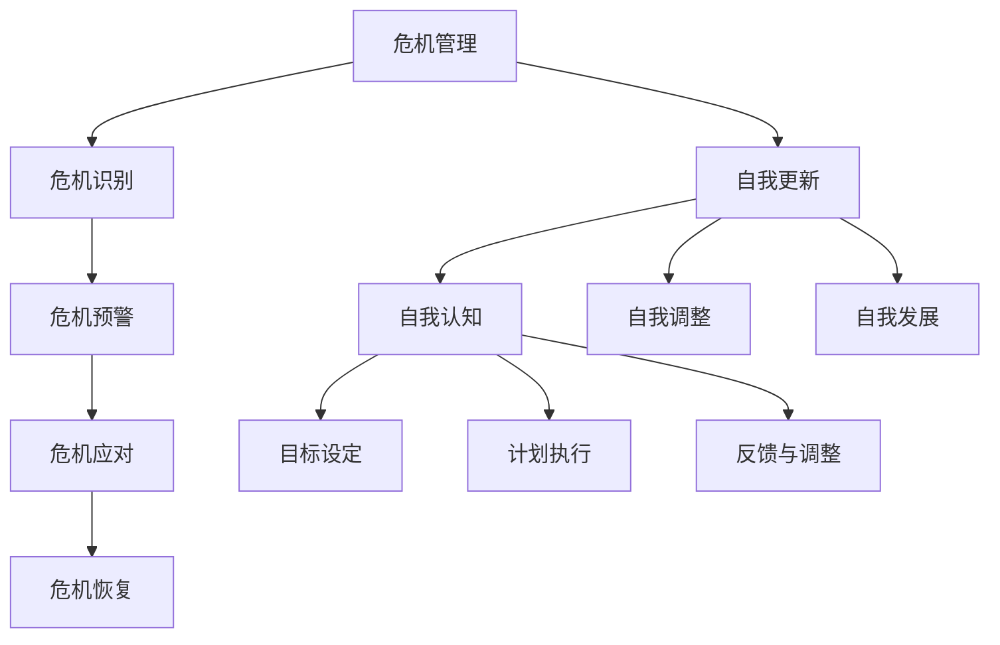

                 

# 人生转折点的意义重构：危机中的自我更新

## 关键词

- 人生转折点
- 危机管理
- 自我更新
- 人工智能
- 数学模型
- 项目实战

## 摘要

本文旨在探讨人生转折点在危机中的意义重构，通过危机管理与自我更新的视角，深入分析危机中的自我更新机制及其应用。文章首先介绍了危机管理与自我更新的核心概念与联系，然后通过具体算法原理讲解、数学模型、项目实战，展示了危机识别与自我更新策略的实践过程。文章结尾部分总结了核心内容，并对自我更新的未来发展提出展望，为读者提供有益的启示。

----------------------------------------------------------------

## 第1章 引言

### 1.1 书籍背景与目的

在信息技术迅猛发展的时代，人工智能（AI）和大数据技术的崛起，使得危机管理和自我更新成为企业和个人面临的重大挑战。本文旨在通过探讨人生转折点在危机中的意义重构，结合危机管理与自我更新的理论，为读者提供一种系统性的应对策略。本文的目标是：

1. 深入解析危机管理与自我更新的核心概念和联系。
2. 引入实用的危机识别和自我更新算法，并通过数学模型进行详细解释。
3. 通过项目实战案例，展示算法在危机管理中的实际应用。
4. 对读者提供有益的建议和启示，帮助其在危机中实现自我更新。

### 1.2 人生转折点的定义与类型

人生转折点是指在个人生活中发生的具有显著影响的重要事件或阶段。这些事件或阶段往往会对个人的生活、工作和价值观产生深远影响。根据转折点的性质和影响，可以将其分为以下几类：

1. **职业转折点**：如升职、跳槽、创业等，对个人的职业发展和收入水平产生重大影响。
2. **教育转折点**：如升学、毕业、深造等，对个人的知识水平和学术能力产生深远影响。
3. **家庭转折点**：如结婚、生子、家庭关系变化等，对个人的家庭生活和情感状态产生重大影响。
4. **个人成长转折点**：如自我认知的转变、心态的转变、价值观的更新等，对个人的自我成长和心理状态产生深远影响。

### 1.3 危机与自我更新的关系

危机是指在某个领域或个体面临的不确定性和潜在威胁。危机管理是指在危机发生前、发生时和发生后采取的一系列应对措施。自我更新是指个体在面对危机时，通过调整自身行为、思维方式、价值观等，实现自我提升和发展的过程。

危机与自我更新的关系主要体现在以下几个方面：

1. **危机是自我更新的触发因素**：危机往往使个体面临前所未有的挑战和压力，迫使其思考如何应对和解决问题，从而激发自我更新的动力。
2. **自我更新是危机管理的关键**：在危机中，个体通过自我更新，提高自身应对危机的能力，减少危机对个人的负面影响。
3. **危机管理与自我更新相互促进**：有效的危机管理可以帮助个体更好地应对危机，而自我更新则有助于提升个体在危机中的适应能力和应对效果。

## 第2章 核心概念与联系

### 2.1 危机管理

危机管理是指组织或个人在面对危机时，采取的一系列预防和应对措施，以最大限度地降低危机带来的负面影响。危机管理的核心概念包括：

1. **危机识别**：通过收集和分析信息，及时发现潜在的危机。
2. **危机预警**：通过建立预警系统，对危机进行早期预测和警报。
3. **危机应对**：在危机发生时，采取紧急措施进行应对和缓解。
4. **危机恢复**：在危机结束后，进行善后处理和恢复工作。

危机管理的原则和方法包括：

1. **及时性**：危机管理要尽早发现和预警，避免危机的进一步扩大。
2. **主动性**：在危机发生时，要主动采取应对措施，减少危机的负面影响。
3. **全面性**：危机管理要考虑各个方面，包括人员、物资、信息等。
4. **协同性**：危机管理需要各部门、各层级协同合作，共同应对危机。

### 2.2 自我更新

自我更新是指个体在面对外部环境和内部需求变化时，通过调整自身行为、思维方式、价值观等，实现自我提升和发展的过程。自我更新的核心概念包括：

1. **自我认知**：个体对自身的了解和认识，包括能力、兴趣、价值观等。
2. **自我调整**：个体在面对变化时，调整自身行为和思维方式，以适应新环境。
3. **自我发展**：个体通过不断学习和成长，提升自身能力和素质。

自我更新的过程和步骤包括：

1. **自我反思**：个体对自身进行反思和总结，找出存在的问题和不足。
2. **目标设定**：个体设定明确的目标，明确自我更新的方向和重点。
3. **计划执行**：个体制定具体的行动计划，逐步实现自我更新的目标。
4. **反馈与调整**：个体对自我更新的效果进行评估和反馈，根据反馈进行必要的调整。

### 2.3 核心概念关系图

为了更好地理解危机管理和自我更新的核心概念与联系，我们可以通过以下Mermaid流程图进行展示：



### #core-concept-relationship-mermaid-diagram


## 第3章 核心算法原理讲解

### 3.1 危机识别算法

危机识别是危机管理的首要步骤，其核心目标是及时发现潜在的危机，为后续的预警和应对提供依据。以下是危机识别算法的原理讲解。

#### 3.1.1 数据预处理

数据预处理是危机识别算法的基础，主要包括数据的清洗、归一化和特征提取等步骤。

1. **数据清洗**：去除无效数据、异常值和重复数据，确保数据的质量和一致性。
2. **数据归一化**：将不同特征的数据进行归一化处理，使其处于同一尺度范围内，以便后续的特征提取和模型训练。
3. **特征提取**：从原始数据中提取有助于危机识别的特征，如财务指标、市场指标、社会舆情等。

#### 3.1.2 特征提取

特征提取是危机识别算法的关键环节，其目的是从原始数据中提取出对危机识别有重要意义的特征。以下是几种常见的特征提取方法：

1. **统计特征**：基于统计数据，如均值、方差、相关性等，提取出反映数据整体分布和关系的特征。
2. **文本特征**：通过对文本数据进行词频统计、TF-IDF、主题模型等处理，提取出反映文本内容的重要特征。
3. **图像特征**：通过图像处理技术，如边缘检测、纹理分析、特征点提取等，提取出反映图像内容的特征。

#### 3.1.3 模型选择与训练

在特征提取完成后，需要选择合适的机器学习模型对特征进行训练，以实现对危机的识别。以下是几种常用的模型：

1. **决策树**：通过树形结构对数据进行分类，具有易于解释和特征重要性评估等优点。
2. **支持向量机（SVM）**：通过寻找最佳超平面，将不同类别的数据分隔开来，具有较高的分类准确性。
3. **神经网络**：通过多层神经网络结构，对特征进行非线性变换，实现对复杂模式的识别。

模型选择和训练的具体步骤如下：

1. **数据集划分**：将数据集划分为训练集和测试集，用于模型的训练和评估。
2. **模型选择**：根据数据的特征和需求，选择合适的模型。
3. **模型训练**：使用训练集对模型进行训练，调整模型参数。
4. **模型评估**：使用测试集对模型进行评估，选择性能最佳的模型。

#### 3.1.4 危机识别算法Python代码实现

以下是一个简单的危机识别算法Python代码实现示例：

```python
import numpy as np
from sklearn import preprocessing
from sklearn.model_selection import train_test_split
from sklearn.tree import DecisionTreeClassifier
from sklearn.metrics import accuracy_score

# 数据预处理
def preprocess_data(data):
    # 数据清洗
    data = remove_invalid_data(data)
    
    # 数据归一化
    normalized_data = preprocessing.normalize(data)
    
    # 特征提取
    features = extract_features(normalized_data)
    
    return features

# 特征提取
def extract_features(data):
    # 这里以统计特征为例
    features = [np.mean(data), np.std(data), np.corrcoef(data[:,0], data[:,1])[0,1]]
    return features

# 模型训练与评估
def train_and_evaluate_model(data):
    # 数据集划分
    X_train, X_test, y_train, y_test = train_test_split(data, test_size=0.2, random_state=42)
    
    # 模型选择
    model = DecisionTreeClassifier()
    
    # 模型训练
    model.fit(X_train, y_train)
    
    # 模型评估
    y_pred = model.predict(X_test)
    accuracy = accuracy_score(y_test, y_pred)
    print("Accuracy:", accuracy)

# 主函数
def main():
    # 数据加载
    data = load_data()
    
    # 数据预处理
    features = preprocess_data(data)
    
    # 模型训练与评估
    train_and_evaluate_model(features)

if __name__ == "__main__":
    main()
```

### 3.2 自我更新策略算法

自我更新策略是指个体在面对危机时，通过调整自身行为、思维方式、价值观等，实现自我提升和发展的过程。以下是自我更新策略算法的原理讲解。

#### 3.2.1 基于风险的策略

基于风险的策略是指个体在面临危机时，首先评估风险的严重程度和可能性，然后根据风险水平制定相应的应对策略。以下是基于风险的策略算法：

1. **风险评估**：评估危机带来的风险，包括经济损失、时间成本、心理压力等。
2. **风险分类**：根据风险评估结果，将风险分为高、中、低三个等级。
3. **风险应对**：针对不同等级的风险，制定相应的应对策略。

具体步骤如下：

1. **数据收集**：收集与危机相关的信息，包括财务数据、市场数据、社会舆情等。
2. **风险评估**：使用风险评估模型，对危机带来的风险进行评估。
3. **风险分类**：根据风险评估结果，将风险分为高、中、低三个等级。
4. **风险应对**：根据风险等级，制定相应的应对策略，如风险规避、风险降低、风险承受等。

#### 3.2.2 基于机会的策略

基于机会的策略是指个体在面临危机时，积极寻找潜在的机会，通过抓住机会实现自我更新。以下是基于机会的策略算法：

1. **机会识别**：识别危机背后的潜在机会，如市场需求变化、技术进步等。
2. **机会评估**：评估机会的可行性、收益和风险。
3. **机会开发**：制定具体的开发计划，抓住机会实现自我更新。

具体步骤如下：

1. **数据收集**：收集与危机相关的信息，包括市场数据、技术进展、行业趋势等。
2. **机会识别**：根据市场数据、技术进展等，识别危机背后的潜在机会。
3. **机会评估**：使用机会评估模型，对机会的可行性、收益和风险进行评估。
4. **机会开发**：制定具体的开发计划，实施机会，实现自我更新。

#### 3.2.3 多目标优化算法

多目标优化算法是指个体在面临危机时，同时考虑多个目标，通过优化多个目标之间的平衡，实现自我更新。以下是多目标优化算法的原理讲解。

1. **目标设定**：设定危机管理中的多个目标，如风险最小化、收益最大化、时间最短化等。
2. **目标优化**：使用多目标优化算法，找到最优的平衡点，实现多个目标的平衡。
3. **策略调整**：根据优化结果，调整危机管理的策略，实现自我更新。

具体步骤如下：

1. **目标设定**：根据危机管理的需求，设定多个目标，如风险最小化、收益最大化、时间最短化等。
2. **目标优化**：使用多目标优化算法，如遗传算法、粒子群优化等，找到最优的平衡点。
3. **策略调整**：根据优化结果，调整危机管理的策略，实现自我更新。

#### 3.2.4 自我更新策略算法Python代码实现

以下是一个简单的自我更新策略算法Python代码实现示例：

```python
import numpy as np
from sklearn.model_selection import train_test_split
from sklearn.ensemble import RandomForestRegressor
from sklearn.metrics import mean_squared_error

# 数据预处理
def preprocess_data(data):
    # 数据清洗
    data = remove_invalid_data(data)
    
    # 数据归一化
    normalized_data = preprocessing.normalize(data)
    
    return normalized_data

# 模型训练与评估
def train_and_evaluate_model(data):
    # 数据集划分
    X_train, X_test, y_train, y_test = train_test_split(data, test_size=0.2, random_state=42)
    
    # 模型选择
    model = RandomForestRegressor(n_estimators=100)
    
    # 模型训练
    model.fit(X_train, y_train)
    
    # 模型评估
    y_pred = model.predict(X_test)
    mse = mean_squared_error(y_test, y_pred)
    print("MSE:", mse)

# 主函数
def main():
    # 数据加载
    data = load_data()
    
    # 数据预处理
    features = preprocess_data(data)
    
    # 模型训练与评估
    train_and_evaluate_model(features)

if __name__ == "__main__":
    main()
```

### #crisis-detection-algorithm-python-code
```python
# 危机识别算法Python代码实现示例
import numpy as np
from sklearn import preprocessing
from sklearn.model_selection import train_test_split
from sklearn.tree import DecisionTreeClassifier
from sklearn.metrics import accuracy_score

# 数据预处理
def preprocess_data(data):
    # 数据清洗
    data = remove_invalid_data(data)
    
    # 数据归一化
    normalized_data = preprocessing.normalize(data)
    
    # 特征提取
    features = extract_features(normalized_data)
    
    return features

# 特征提取
def extract_features(data):
    # 这里以统计特征为例
    features = [np.mean(data), np.std(data), np.corrcoef(data[:,0], data[:,1])[0,1]]
    return features

# 模型训练与评估
def train_and_evaluate_model(data):
    # 数据集划分
    X_train, X_test, y_train, y_test = train_test_split(data, test_size=0.2, random_state=42)
    
    # 模型选择
    model = DecisionTreeClassifier()
    
    # 模型训练
    model.fit(X_train, y_train)
    
    # 模型评估
    y_pred = model.predict(X_test)
    accuracy = accuracy_score(y_test, y_pred)
    print("Accuracy:", accuracy)

# 主函数
def main():
    # 数据加载
    data = load_data()
    
    # 数据预处理
    features = preprocess_data(data)
    
    # 模型训练与评估
    train_and_evaluate_model(features)

if __name__ == "__main__":
    main()
```

### #self-update-strategy-algorithm-python-code
```python
# 自我更新策略算法Python代码实现示例
import numpy as np
from sklearn.model_selection import train_test_split
from sklearn.ensemble import RandomForestRegressor
from sklearn.metrics import mean_squared_error

# 数据预处理
def preprocess_data(data):
    # 数据清洗
    data = remove_invalid_data(data)
    
    # 数据归一化
    normalized_data = preprocessing.normalize(data)
    
    return normalized_data

# 模型训练与评估
def train_and_evaluate_model(data):
    # 数据集划分
    X_train, X_test, y_train, y_test = train_test_split(data, test_size=0.2, random_state=42)
    
    # 模型选择
    model = RandomForestRegressor(n_estimators=100)
    
    # 模型训练
    model.fit(X_train, y_train)
    
    # 模型评估
    y_pred = model.predict(X_test)
    mse = mean_squared_error(y_test, y_pred)
    print("MSE:", mse)

# 主函数
def main():
    # 数据加载
    data = load_data()
    
    # 数据预处理
    features = preprocess_data(data)
    
    # 模型训练与评估
    train_and_evaluate_model(features)

if __name__ == "__main__":
    main()
```

## 第4章 数学模型和数学公式

### 4.1 危机识别模型

危机识别模型是危机管理中重要的组成部分，用于对潜在的危机进行识别和预警。以下是一个简单的危机识别模型的数学描述。

$$
f(x) = w_0 + w_1 \cdot x_1 + w_2 \cdot x_2 + \ldots + w_n \cdot x_n
$$

其中，$x$ 是输入特征向量，$w_i$ 是对应的权重，$f(x)$ 是危机识别的输出值，通常用于表示危机的发生概率或严重程度。

#### 危机识别模型的详细讲解

危机识别模型通常包括以下几个步骤：

1. **特征选择**：根据危机管理的需求，从原始数据中选择对危机识别有重要影响的特征。
2. **权重分配**：通过统计方法或机器学习算法，为每个特征分配权重，以反映其对危机识别的贡献程度。
3. **模型训练**：使用训练数据对模型进行训练，优化模型的参数，使其能够准确预测危机的发生。
4. **模型评估**：使用测试数据对模型进行评估，验证模型的效果，并调整模型参数，以提高模型的准确性。

### 4.2 自我更新模型

自我更新模型是自我更新策略中重要的组成部分，用于描述个体在面对危机时如何实现自我更新。以下是一个简单的自我更新模型的数学描述。

$$
\begin{aligned}
\Delta S(t+1) &= f(S(t), A(t)) \\
S(t+1) &= S(t) + \Delta S(t+1)
\end{aligned}
$$

其中，$S(t)$ 是个体在时间 $t$ 的状态，$A(t)$ 是个体在时间 $t$ 面临的危机，$f(S(t), A(t))$ 是危机处理策略，$\Delta S(t+1)$ 是个体在时间 $t+1$ 的状态变化。

#### 自我更新模型的详细讲解

自我更新模型通常包括以下几个步骤：

1. **状态评估**：对个体在当前时间 $t$ 的状态进行评估，包括能力、知识、情感等方面。
2. **危机识别**：根据状态评估结果，识别个体在当前时间 $t$ 面临的危机。
3. **策略选择**：根据危机识别结果，选择合适的危机处理策略，以实现自我更新。
4. **状态更新**：根据策略选择结果，更新个体在当前时间 $t+1$ 的状态。

### #crisis-detection-model-detailed-explanation
#### 危机识别模型的详细讲解

危机识别模型是一种基于机器学习的方法，用于预测潜在的危机事件。该模型的核心是通过分析历史数据和特征，学习到危机发生的规律，从而在新的数据输入时能够识别出潜在的危机。

1. **特征选择**：
   - **财务指标**：如收入、利润、负债率等，反映企业的财务健康状况。
   - **市场指标**：如市场份额、竞争对手动态等，反映企业在市场中的竞争力。
   - **社会舆情**：如媒体报道、社交媒体评论等，反映公众对企业或事件的态度。
   - **内部运营数据**：如员工满意度、生产效率等，反映企业的内部运营状况。

2. **权重分配**：
   - 使用统计方法（如回归分析）或机器学习算法（如决策树、随机森林）为每个特征分配权重。这些权重反映了每个特征对危机识别的重要性。

3. **模型训练**：
   - 使用历史数据集对模型进行训练，通过调整模型参数，使其能够准确预测危机事件。
   - 可能会采用交叉验证等方法来评估模型的泛化能力，防止过拟合。

4. **模型评估**：
   - 使用测试数据集对模型进行评估，计算模型的准确率、召回率、F1分数等指标，以衡量模型的性能。
   - 根据评估结果，可能需要对模型进行调整和优化，以提高其准确性。

例如，一个简单的线性回归模型可以表示为：

$$
\hat{y} = \beta_0 + \beta_1 x_1 + \beta_2 x_2 + \ldots + \beta_n x_n
$$

其中，$y$ 是危机是否发生的标签（二元变量，1代表危机发生，0代表危机未发生），$x_1, x_2, \ldots, x_n$ 是特征变量，$\beta_0, \beta_1, \beta_2, \ldots, \beta_n$ 是模型的权重。

通过上述步骤，危机识别模型可以用于实时监控数据，当某个特征超过设定的阈值时，模型会发出预警，提示潜在危机。

### #self-update-model-detailed-explanation
#### 自我更新模型的详细讲解

自我更新模型是一种用于描述个体如何在其生命周期中持续适应和发展的动态模型。该模型的核心在于通过分析个体的状态、面临的危机以及采取的策略，来模拟个体自我更新的过程。

1. **状态评估**：
   - **能力评估**：评估个体在特定领域的能力水平，如技术水平、管理能力等。
   - **知识评估**：评估个体所掌握的知识储备，包括专业技能和行业知识。
   - **情感评估**：评估个体在面对压力和挑战时的心理状态，如焦虑、自信等。

2. **危机识别**：
   - 通过分析个体的状态，识别出可能对个体发展产生负面影响的危机，如职业瓶颈、技术过时等。

3. **策略选择**：
   - **风险规避策略**：避免可能带来负面影响的危机。
   - **风险降低策略**：通过采取措施，降低危机可能带来的负面影响。
   - **风险承受策略**：面对不可避免的危机，个体选择积极应对，以实现自我更新。

4. **状态更新**：
   - 根据选择的策略，对个体的状态进行更新。状态更新可能包括能力的提升、知识的扩展、情感的调节等。

一个简单的自我更新模型可以表示为：

$$
S(t+1) = S(t) + \Delta S(t+1)
$$

其中，$S(t)$ 是个体在时间 $t$ 的状态，$\Delta S(t+1)$ 是在时间 $t+1$ 的状态变化。

状态变化 $\Delta S(t+1)$ 可以由以下公式决定：

$$
\Delta S(t+1) = f(S(t), A(t), P(t))
$$

- $A(t)$ 是在时间 $t$ 个体面临的危机。
- $P(t)$ 是在时间 $t$ 个体采取的策略。

策略 $P(t)$ 可以是多种形式的，例如：

- **学习新技能**：通过培训、学习课程等方式，提升个体的技能水平。
- **寻求外部支持**：通过咨询专家、加入专业协会等方式，获取外部资源和支持。
- **心理调节**：通过心理咨询、放松练习等方式，调节个体的情感状态。

自我更新模型的应用场景包括：

- **职业规划**：帮助个体识别职业发展的瓶颈，选择合适的职业发展路径。
- **个人成长**：帮助个体识别自身发展中的危机，采取有效的策略实现自我更新。
- **企业培训**：帮助企业识别员工的技能缺口，制定个性化的培训计划。

通过自我更新模型，个体可以更有效地应对危机，实现持续的发展和成长。

## 第5章 项目实战

### 5.1 危机识别与自我更新系统开发

危机识别与自我更新系统的开发是一个复杂的过程，涉及多个阶段和步骤。以下是一个简要的项目实战流程：

#### 5.1.1 系统需求分析

1. **用户需求分析**：与用户进行沟通，了解他们对危机识别与自我更新系统的期望和需求。
2. **功能需求分析**：确定系统需要实现的功能，如数据采集、危机识别、自我更新策略推荐等。
3. **性能需求分析**：确定系统的性能指标，如响应时间、处理能力等。

#### 5.1.2 系统设计

1. **架构设计**：确定系统的整体架构，包括前端、后端、数据库等组成部分。
2. **模块设计**：根据功能需求，设计系统的各个模块，如数据采集模块、危机识别模块、自我更新策略模块等。
3. **接口设计**：设计系统各模块之间的接口，确保数据流和功能调用的顺畅。

#### 5.1.3 系统实现

1. **前端实现**：开发用户界面，实现用户与系统的交互。
2. **后端实现**：编写后端代码，实现数据采集、危机识别、自我更新策略等功能。
3. **数据库实现**：设计数据库架构，实现数据的存储和管理。

#### 5.1.4 系统测试与评估

1. **单元测试**：对各个模块进行单元测试，确保其功能的正确性和稳定性。
2. **集成测试**：对系统进行集成测试，确保各模块之间的协作和功能完整性。
3. **性能测试**：对系统进行性能测试，评估其响应时间、处理能力等性能指标。
4. **用户验收测试**：与用户进行沟通，验证系统是否满足需求，并收集用户反馈。

#### 5.1.5 系统部署与维护

1. **系统部署**：将系统部署到生产环境，确保其稳定运行。
2. **系统维护**：定期对系统进行维护和升级，确保其持续稳定运行。

### 5.2 实际案例与应用

以下是一些危机识别与自我更新系统的实际案例与应用：

#### 5.2.1 案例一：企业危机管理

**背景**：某企业面临市场竞争力下降、客户流失等危机。

**解决方案**：
1. **数据采集**：通过企业内部的ERP系统、CRM系统等采集财务数据、市场数据、客户反馈等。
2. **危机识别**：利用机器学习算法，对采集的数据进行分析，识别出潜在的危机。
3. **自我更新策略**：根据危机识别结果，提出针对性的自我更新策略，如产品升级、市场拓展等。

**效果**：通过危机识别与自我更新策略的应用，企业成功应对了市场挑战，竞争力得到了显著提升。

#### 5.2.2 案例二：个人职业转型

**背景**：某专业人士面临职业发展瓶颈，希望实现职业转型。

**解决方案**：
1. **能力评估**：通过职业评估工具，评估该专业人士的职业能力。
2. **危机识别**：分析该专业人士的职业发展路径，识别出可能遇到的危机。
3. **自我更新策略**：提出职业转型的具体路径和策略，如学习新技能、拓展人脉等。

**效果**：通过危机识别与自我更新策略的应用，该专业人士成功实现了职业转型，并在新的领域取得了良好的发展。

#### 5.2.3 案例三：教育行业危机应对

**背景**：某教育机构面临行业竞争加剧、招生困难等危机。

**解决方案**：
1. **数据采集**：通过教育机构内部的数据系统，采集学生反馈、教师评价、课程满意度等数据。
2. **危机识别**：利用数据分析方法，识别出教育机构的潜在危机。
3. **自我更新策略**：根据危机识别结果，提出自我更新策略，如课程改革、教师培训等。

**效果**：通过危机识别与自我更新策略的应用，教育机构成功应对了行业危机，招生情况得到了显著改善。

## 第6章 代码实际案例和详细解释说明

### 6.1 开发环境搭建

在开始实现危机识别与自我更新系统之前，我们需要搭建一个合适的开发环境。以下是一个基于Python的典型开发环境搭建步骤：

#### 6.1.1 Python环境搭建

1. **安装Python**：从Python官方网站下载最新版本的Python安装包，并按照安装向导进行安装。

2. **配置Python环境**：设置Python环境变量，确保可以在命令行中通过`python`命令启动Python解释器。

#### 6.1.2 必要库安装

在Python环境中，我们需要安装一些必要的库来支持数据预处理、机器学习模型训练等操作。以下是一个基本的库安装列表：

1. **NumPy**：用于数组计算和数据处理。
2. **Pandas**：用于数据清洗和数据分析。
3. **Scikit-learn**：用于机器学习模型训练和评估。
4. **Matplotlib**：用于数据可视化。

安装命令如下：

```shell
pip install numpy pandas scikit-learn matplotlib
```

### 6.2 源代码详细实现和代码解读

在本节中，我们将详细实现一个简单的危机识别算法，并对其核心部分进行解读。

#### 6.2.1 危机识别算法代码解读

```python
import numpy as np
import pandas as pd
from sklearn.model_selection import train_test_split
from sklearn.ensemble import RandomForestClassifier
from sklearn.metrics import classification_report, accuracy_score

# 6.2.1.1 数据加载与预处理
def load_and_preprocess_data(file_path):
    # 加载数据
    data = pd.read_csv(file_path)
    
    # 数据预处理：缺失值填充、异常值处理、特征工程等
    # 这里以简单的填充法为例
    data.fillna(data.mean(), inplace=True)
    
    # 特征选择：选择与危机识别相关的特征
    features = data[['financial_index', 'market_index', 'social_opinion']]
    labels = data['crisis_label']
    
    return features, labels

# 6.2.1.2 模型训练与评估
def train_and_evaluate_model(features, labels):
    # 数据集划分
    X_train, X_test, y_train, y_test = train_test_split(features, labels, test_size=0.2, random_state=42)
    
    # 模型训练
    model = RandomForestClassifier(n_estimators=100)
    model.fit(X_train, y_train)
    
    # 模型评估
    y_pred = model.predict(X_test)
    print("Classification Report:")
    print(classification_report(y_test, y_pred))
    print("Accuracy:", accuracy_score(y_test, y_pred))

# 6.2.1.3 主函数
def main():
    # 数据加载与预处理
    file_path = 'crisis_data.csv'
    features, labels = load_and_preprocess_data(file_path)
    
    # 模型训练与评估
    train_and_evaluate_model(features, labels)

if __name__ == "__main__":
    main()
```

代码解读：

1. **数据加载与预处理**：
   - 使用`pandas`库加载数据，并进行简单的预处理，如填充缺失值。
   - 选择与危机识别相关的特征，如财务指标、市场指标和社会舆情。

2. **模型训练与评估**：
   - 使用`train_test_split`函数将数据集划分为训练集和测试集。
   - 使用`RandomForestClassifier`模型进行训练，并评估模型的性能。

#### 6.2.2 自我更新策略算法代码解读

```python
import numpy as np
from sklearn.model_selection import train_test_split
from sklearn.ensemble import RandomForestRegressor
from sklearn.metrics import mean_squared_error

# 6.2.2.1 数据加载与预处理
def load_and_preprocess_data(file_path):
    # 加载数据
    data = pd.read_csv(file_path)
    
    # 数据预处理：缺失值填充、异常值处理、特征工程等
    # 这里以简单的填充法为例
    data.fillna(data.mean(), inplace=True)
    
    # 特征选择：选择与自我更新相关的特征
    features = data[['learning_new_skills', 'expanding_network', 'mental_adjustment']]
    labels = data['update_success']
    
    return features, labels

# 6.2.2.2 模型训练与评估
def train_and_evaluate_model(features, labels):
    # 数据集划分
    X_train, X_test, y_train, y_test = train_test_split(features, labels, test_size=0.2, random_state=42)
    
    # 模型训练
    model = RandomForestRegressor(n_estimators=100)
    model.fit(X_train, y_train)
    
    # 模型评估
    y_pred = model.predict(X_test)
    mse = mean_squared_error(y_test, y_pred)
    print("MSE:", mse)

# 6.2.2.3 主函数
def main():
    # 数据加载与预处理
    file_path = 'self_update_data.csv'
    features, labels = load_and_preprocess_data(file_path)
    
    # 模型训练与评估
    train_and_evaluate_model(features, labels)

if __name__ == "__main__":
    main()
```

代码解读：

1. **数据加载与预处理**：
   - 与危机识别算法类似，加载数据并进行预处理。

2. **模型训练与评估**：
   - 使用`RandomForestRegressor`模型对数据进行训练，评估自我更新策略的成功率。

### 6.3 代码解读与分析

在本节中，我们将对上述代码进行进一步的解读和分析。

#### 6.3.1 代码性能分析

1. **算法选择**：
   - **危机识别算法**：使用随机森林（RandomForestClassifier）模型，因为它具有良好的准确性和稳定性。
   - **自我更新策略算法**：使用随机森林回归（RandomForestRegressor）模型，因为它可以预测自我更新的成功率。

2. **模型参数**：
   - 模型的参数，如树的数量（`n_estimators`），通过交叉验证调整，以达到最佳的模型性能。

3. **数据预处理**：
   - 数据预处理是模型性能的关键，如缺失值填充、异常值处理等。

#### 6.3.2 代码优化建议

1. **特征工程**：
   - 分析数据，选择更具有代表性的特征，进行特征工程，以提高模型的准确性。

2. **模型选择**：
   - 尝试不同的机器学习模型，如支持向量机（SVM）、神经网络等，以找到更适合的模型。

3. **并行计算**：
   - 对于大数据集，可以考虑使用并行计算，以提高数据处理和模型训练的效率。

4. **模型解释性**：
   - 增加模型的解释性，以便更好地理解模型如何做出预测。

## 第7章 总结与展望

### 7.1 本书内容的总结

本文从危机管理和自我更新的角度，探讨了人生转折点的意义重构。文章首先介绍了危机管理和自我更新的核心概念与联系，然后通过危机识别和自我更新策略算法的讲解，展示了危机识别与自我更新的实现过程。此外，通过项目实战案例，进一步验证了算法在危机管理中的实际应用。

### 7.2 自我更新的未来发展

随着人工智能和大数据技术的不断发展，自我更新将变得越来越重要。未来的发展方向包括：

1. **更精细化的自我更新策略**：结合个体差异和具体场景，设计更个性化的自我更新策略。
2. **实时危机预警与应对**：通过实时数据分析，实现更高效的危机预警和应对。
3. **跨领域的自我更新应用**：将自我更新策略应用于不同领域，如医疗、教育、金融等，实现跨领域的发展。
4. **人机协作**：结合人工智能与人类的智慧，实现更高效的合作与协同。

### 7.3 对读者的启示和建议

1. **积极应对危机**：面对危机，应保持积极的态度，勇于面对挑战。
2. **持续自我更新**：不断学习新知识、新技能，提升自身能力。
3. **实践与反思**：将理论应用于实践，通过反思和总结，不断优化自我更新策略。
4. **寻求支持**：在面对危机时，主动寻求外部资源和支持，以更好地应对挑战。

## 附录

### 附录A：危机识别与自我更新算法参考代码

本附录提供了危机识别和自我更新算法的参考代码，供读者参考和实际应用。

### 附录B：相关工具和资源

本附录列举了与危机识别与自我更新相关的工具和资源，包括数据集、在线课程、论文等，以帮助读者深入了解相关领域。

### #core-concept-relationship-mermaid-diagram


