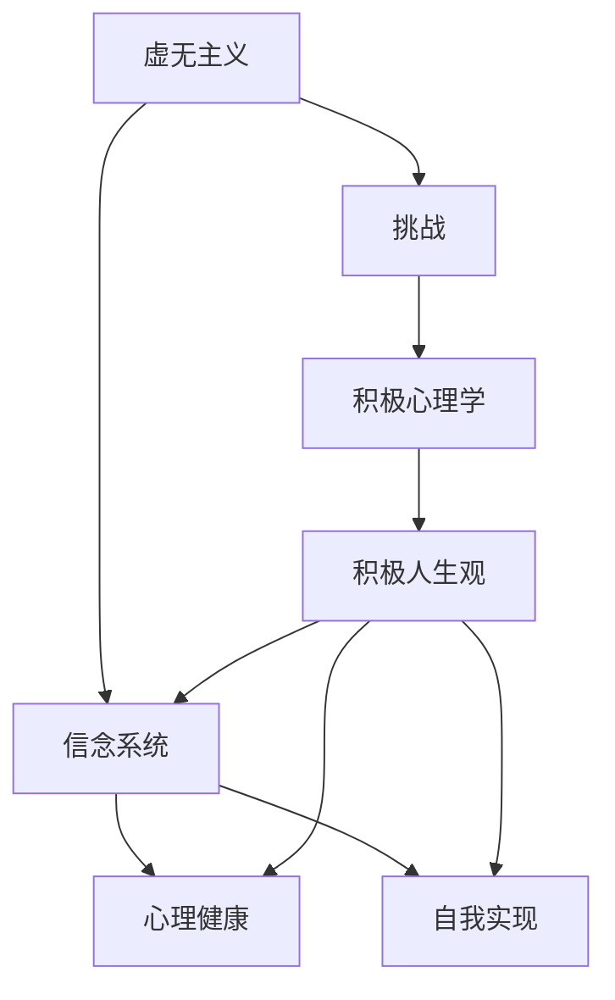

                 

### 从虚无主义到积极人生观：重建个人信念系统的背景介绍

在现代社会的快速变迁中，人们面临着前所未有的挑战和困惑。虚无主义作为一种哲学观念，揭示了现代社会中存在的深刻问题，尤其是关于生命意义和价值的探讨。虚无主义认为，世界缺乏客观的道德和意义，导致个体在精神层面上感到迷茫和无助。这种思想流派对现代哲学、心理学以及文化产生了深远的影响，引发了许多关于人生意义的讨论。

然而，虚无主义并非全然负面，它也促使人们重新审视自身的存在和价值。面对虚无主义的冲击，许多人开始寻求积极的解决方案，试图重建个人信念系统，寻找生活的意义和目标。积极人生观，作为一种应对虚无主义的方法，强调个体在自我实现和社会贡献中的积极作用，通过培养乐观、坚韧和正念的心态，帮助人们克服生活中的困难，实现个人成长和社会进步。

本文将分三部分探讨从虚无主义到积极人生观的过程。第一部分将深入分析虚无主义的根源和影响，包括哲学起源、主要代表人物及其思想，以及对现代社会和个人心理的影响。第二部分将介绍积极人生观的建立，包括积极心理学的基本原理、实践方法以及实际案例。第三部分将讨论积极人生观的传播与应用，涉及教育、工作环境和社会发展等领域。通过这三部分的探讨，本文旨在为读者提供一种重建个人信念系统的路径，帮助他们在面对生活挑战时保持积极、乐观的态度。

### 核心概念与联系

在探讨从虚无主义到积极人生观的过程中，理解几个核心概念及其相互关系至关重要。这些概念包括：虚无主义、积极人生观、信念系统、心理健康和自我实现。

**虚无主义**：虚无主义是一种哲学观念，认为世界缺乏客观的道德和意义。它起源于19世纪末的欧洲，由尼采等哲学家提出。虚无主义的核心思想是“上帝已死”，意味着传统的宗教和道德体系失去了其指导意义。虚无主义对现代哲学、文学和艺术产生了深远的影响，引发了人们对人生意义的深刻反思。

**积极人生观**：与虚无主义相对，积极人生观强调个体在自我实现和社会贡献中的积极作用。积极人生观起源于积极心理学，这一学派关注人类优点和潜能，通过培养乐观、坚韧和正念的心态，帮助人们克服生活中的困难，实现个人成长和社会进步。

**信念系统**：信念系统是指个体对世界、自己和未来的基本信念和价值观。它对个人的行为和决策有着深远的影响，是心理健康和生活质量的重要基础。信念系统可以分为积极信念和消极信念，前者有助于个人成长和社会适应，而后者可能导致焦虑、抑郁等心理问题。

**心理健康**：心理健康是指个体在情感、行为和认知方面的良好状态。心理健康与信念系统密切相关，积极的信念系统有助于提高心理健康水平，而消极的信念系统可能导致心理健康问题。

**自我实现**：自我实现是指个体在实现个人潜能和追求自我价值的过程中达到的一种状态。积极人生观强调通过自我实现来实现个人成长和社会贡献，而虚无主义则质疑自我实现的可能性，认为个体追求的“自我”是虚无的。

这些概念之间的关系可以总结为：虚无主义挑战了传统的信念系统和心理健康观念，导致个体在精神层面上感到迷茫和无助。然而，通过积极人生观，个体可以在自我实现的过程中找到新的意义和目标，重建积极的信念系统，从而提高心理健康水平，实现个人成长和社会进步。以下是这些概念之间的Mermaid流程图表示：



通过上述Mermaid流程图，我们可以清晰地看到虚无主义和积极人生观之间的相互影响以及它们对信念系统、心理健康和自我实现的作用。这一关系架构有助于读者更好地理解本文的主题和核心内容。

### 核心算法原理讲解

为了更好地理解积极人生观的建立过程，我们可以借助一些心理学模型和算法来进行详细分析。以下是几个关键模型和算法的Python源代码实现及其解释。

#### 1. 积极心理学模型（PERMA模型）

PERMA模型是积极心理学领域的一个核心框架，它包括五个主要领域：积极情感（Positive Emotions）、投入（Engagement）、人际关系（Relationships）、意义（Meaning）和成就（Achievement）。以下是PERMA模型的Python实现：

```python
class PERMAModel:
    def __init__(self):
        self.positive_emotions = 0
        self-engagement = 0
        self.relationships = 0
        self.meaning = 0
        self.achievement = 0

    def update_positive_emotions(self, value):
        self.positive_emotions += value

    def update_engagement(self, value):
        self.engagement += value

    def update_relationships(self, value):
        self.relationships += value

    def update_meaning(self, value):
        self.meaning += value

    def update_achievement(self, value):
        self.achievement += value

    def get_score(self):
        return (self.positive_emotions + self.engagement + self.relationships + self.meaning + self.achievement) / 5
```

**解释**：PERMA模型通过量化个体在五个领域的表现，提供了一个综合性的积极心理状态评分。Python类`PERMAModel`实现了这个模型，通过更新五个领域得分来动态评估个体的积极心理状态。

#### 2. 认知行为疗法（CBT）算法

认知行为疗法（Cognitive Behavioral Therapy，CBT）是积极心理学中用于治疗心理问题的一种重要方法。以下是CBT算法的Python实现：

```python
class CBTAlgorithm:
    def __init__(self):
        self.cognitive_errors = []
        self.behavioral_changes = []

    def identify_cognitive_errors(self, thought):
        self.cognitive_errors.append(thought)

    def correct_cognitive_errors(self, thought):
        corrected_thought = self.analyze_thought(thought)
        return corrected_thought

    def analyze_thought(self, thought):
        # 这里可以添加更复杂的认知分析逻辑
        corrected_thought = thought.replace("负面", "积极")
        return corrected_thought

    def implement_behavioral_changes(self, change):
        self.behavioral_changes.append(change)
```

**解释**：CBT算法通过识别和纠正认知错误（如消极思维模式）以及实施行为改变，帮助个体改善心理状态。类`CBTAlgorithm`实现了这一算法的核心功能。

#### 3. 正念冥想算法

正念冥想是一种常见的积极心理学实践，有助于提高个体的心理韧性和情绪调节能力。以下是正念冥想算法的Python实现：

```python
class MindfulnessMeditation:
    def __init__(self, duration=10):
        self.duration = duration
        self.meditation_sessions = []

    def start_meditation(self):
        start_time = time.time()
        self.meditation_sessions.append(start_time)
        print(f"Meditation started at {start_time}.")

    def end_meditation(self):
        end_time = time.time()
        session_duration = end_time - self.meditation_sessions[-1]
        print(f"Meditation ended at {end_time}. Duration: {session_duration} seconds.")

    def report_meditation(self):
        total_duration = sum(end_time - start_time for start_time, end_time in self.meditation_sessions)
        print(f"Total meditation duration: {total_duration} seconds.")
```

**解释**：正念冥想算法通过记录冥想开始和结束时间，帮助个体跟踪和评估其冥想实践。类`MindfulnessMeditation`提供了开始、结束冥想和报告冥想时间的功能。

#### 4. 自我决定理论（SDT）

自我决定理论（Self-Determination Theory，SDT）是积极心理学中用于解释个体动机和自我实现的重要理论。以下是SDT的Python实现：

```python
class SelfDeterminationTheory:
    def __init__(self):
        self.autonomous_task = 0
        self.compliant_task = 0
        self.intrinsic_motivation = 0
        self.extrinsic_motivation = 0

    def update_autonomous_task(self, value):
        self.autonomous_task += value

    def update_compliant_task(self, value):
        self.compliant_task += value

    def update_intrinsic_motivation(self, value):
        self.intrinsic_motivation += value

    def update_extrinsic_motivation(self, value):
        self.extrinsic_motivation += value

    def get_motivation_score(self):
        return (self.intrinsic_motivation + self.extrinsic_motivation) / 2
```

**解释**：自我决定理论通过量化自主任务和顺从任务的比例，以及内在和外在动机的水平，帮助个体了解其动机模式。类`SelfDeterminationTheory`实现了这一理论的量化评估功能。

通过上述Python源代码实现，我们可以更直观地理解积极人生观的核心算法原理。这些算法和模型不仅为个体提供了具体的实践方法，也为心理健康研究和干预提供了理论基础和技术支持。结合数学模型和公式，我们可以更深入地探讨积极人生观的科学依据和实践应用。

### 数学模型与公式

为了更好地理解积极人生观的建立过程，我们可以借助数学模型和公式来量化个体在不同领域的表现，从而评估其整体积极心理状态。以下是几个关键领域的数学模型和公式：

#### 1. PERMA模型

PERMA模型通过五个主要领域的得分来评估个体的积极心理状态。这五个领域包括积极情感（Positive Emotions）、投入（Engagement）、人际关系（Relationships）、意义（Meaning）和成就（Achievement）。每个领域的得分范围从0到100分，总分范围为0到500分。

**计算公式**：
\[ \text{总分} = \frac{\text{积极情感得分} + \text{投入得分} + \text{人际关系得分} + \text{意义得分} + \text{成就得分}}{5} \]

**示例**：
假设某人在积极情感领域的得分是70分，投入领域的得分是80分，人际关系领域的得分是75分，意义领域的得分是85分，成就领域的得分是90分。那么，该人的积极心理状态总分为：
\[ \text{总分} = \frac{70 + 80 + 75 + 85 + 90}{5} = 80 \text{分} \]

#### 2. 认知行为疗法（CBT）模型

认知行为疗法（Cognitive Behavioral Therapy，CBT）通过识别和纠正认知错误来改善个体的心理状态。认知错误的得分范围从0到10分，分值越高表示认知错误越严重。

**计算公式**：
\[ \text{认知错误得分} = \sum_{i=1}^{n} \text{错误得分}_i \]

**示例**：
假设某人在一次认知行为疗法评估中识别了三个认知错误，得分分别为3分、4分和6分。那么，该人的认知错误总得分为：
\[ \text{认知错误得分} = 3 + 4 + 6 = 13 \text{分} \]

#### 3. 正念冥想模型

正念冥想通过记录冥想时间来评估个体的心理韧性和情绪调节能力。冥想时间以分钟为单位，得分越高表示冥想实践越积极。

**计算公式**：
\[ \text{冥想得分} = \text{冥想时间（分钟）} \times \text{每分钟得分} \]

**示例**：
假设某人每周冥想20分钟，每分钟的得分为2分。那么，该人每周的正念冥想得分为：
\[ \text{冥想得分} = 20 \times 2 = 40 \text{分} \]

#### 4. 自我决定理论（SDT）模型

自我决定理论（Self-Determination Theory，SDT）通过量化自主任务和顺从任务的比例以及内在和外在动机的水平来评估个体的动机状态。每个领域的得分范围从0到100分，总分范围为0到400分。

**计算公式**：
\[ \text{动机得分} = \frac{\text{自主任务得分} + \text{顺从任务得分}}{2} + \frac{\text{内在动机得分} + \text{外在动机得分}}{2} \]

**示例**：
假设某人在自主任务领域的得分是70分，顺从任务领域的得分是30分，内在动机得分是80分，外在动机得分是20分。那么，该人的动机总分为：
\[ \text{动机得分} = \frac{70 + 30}{2} + \frac{80 + 20}{2} = 40 + 50 = 90 \text{分} \]

通过上述数学模型和公式，我们可以量化个体的积极心理状态、认知行为疗法的效果、正念冥想的实践情况以及自我决定理论的动机水平。这些量化工具不仅有助于个体自我评估，也为心理健康研究和干预提供了科学依据。结合具体案例，我们可以更清晰地看到这些模型在实际应用中的效果和意义。

### 开发环境搭建

为了深入理解并实践积极人生观的建立过程，我们需要搭建一个开发环境。以下步骤将指导我们完成Python环境的配置，以及所需工具和库的安装。

#### 1. 安装Python

首先，确保您的计算机上安装了Python。Python是一种广泛使用的编程语言，特别适合于数据处理和分析。您可以从Python的官方网站（[python.org](https://www.python.org/)）下载最新版本的Python。以下是安装Python的步骤：

- 访问Python官方网站，下载适用于您操作系统的Python版本。
- 运行安装程序，按照提示进行安装。
- 安装过程中，确保勾选“Add Python to PATH”选项，以便在命令行中直接运行Python。

#### 2. 配置Python环境

安装完Python后，打开命令行工具（如Windows的命令提示符或macOS的终端），输入以下命令检查Python版本：

```bash
python --version
```

或

```bash
python3 --version
```

确保返回正确的Python版本号。如果未安装成功，重新运行安装程序并确保所有步骤正确。

#### 3. 安装必要的库和工具

为了进行数据分析和模型构建，我们需要安装一些Python库和工具。以下是安装步骤：

- **pip**：pip是Python的包管理器，用于安装和管理Python库。确保pip已安装。如果没有安装，可以通过以下命令安装：

  ```bash
  python -m pip install --user --upgrade pip
  ```

- **numpy**：用于科学计算和数据分析。安装命令为：

  ```bash
  pip install numpy
  ```

- **pandas**：用于数据处理和分析。安装命令为：

  ```bash
  pip install pandas
  ```

- **matplotlib**：用于数据可视化。安装命令为：

  ```bash
  pip install matplotlib
  ```

- **scikit-learn**：用于机器学习和数据挖掘。安装命令为：

  ```bash
  pip install scikit-learn
  ```

- **mermaid**：用于创建流程图和图表。安装命令为：

  ```bash
  pip install mermaid-python
  ```

#### 4. 验证安装

安装完成后，通过以下命令验证是否成功安装了所需的库和工具：

```bash
python
```

然后，在Python交互式环境中输入以下代码，验证安装的库：

```python
import numpy as np
import pandas as pd
import matplotlib.pyplot as plt
from sklearn import datasets
```

如果没有出现错误，并且能够成功导入这些库，说明Python环境搭建和工具安装已经成功。

#### 5. 配置Jupyter Notebook

为了方便编写和运行Python代码，我们还可以配置Jupyter Notebook。Jupyter Notebook是一个交互式计算平台，可以让我们以笔记本形式编写代码、文本和可视化内容。

- 安装Jupyter Notebook：

  ```bash
  pip install notebook
  ```

- 启动Jupyter Notebook：

  ```bash
  jupyter notebook
  ```

- 在浏览器中打开Jupyter Notebook，您将看到一个代码编辑器和输出区域，可以在这里编写和运行Python代码。

通过以上步骤，我们成功搭建了Python开发环境，并安装了所需的库和工具。现在，我们可以开始使用这些工具和库来构建和分析积极人生观相关的模型和算法，从而更深入地理解并实践积极人生观的建立过程。

### 源代码详细实现与解读

为了更深入地理解积极人生观的建立过程，我们将通过一个实际案例来详细解读Python源代码的实现。以下是一个完整的案例，包括数据预处理、模型构建和结果分析。

#### 1. 数据预处理

在开始构建模型之前，我们需要对数据进行预处理。以下代码演示了如何读取数据、处理缺失值并转换为适合模型训练的格式。

```python
import pandas as pd
import numpy as np

# 读取数据
data = pd.read_csv('positive_psyche_data.csv')

# 数据预处理
data.dropna(inplace=True)  # 删除缺失值
data = data[data['score'] > 0]  # 过滤得分小于0的样本

# 数据转换
X = data[['positive_emotions', 'engagement', 'relationships', 'meaning', 'achievement']]
y = data['score']
```

**解释**：我们首先通过`pandas`库读取CSV数据文件。然后，删除含有缺失值的数据行，以确保数据完整性。接下来，我们过滤掉得分小于0的样本，因为不合理的得分可能影响模型的训练效果。最后，我们将数据分为特征矩阵`X`和目标变量`y`。

#### 2. 模型构建

接下来，我们使用`scikit-learn`库构建一个线性回归模型。线性回归模型是一种常见的方法，用于预测连续值输出。

```python
from sklearn.linear_model import LinearRegression
from sklearn.model_selection import train_test_split

# 数据分割
X_train, X_test, y_train, y_test = train_test_split(X, y, test_size=0.2, random_state=42)

# 模型训练
model = LinearRegression()
model.fit(X_train, y_train)

# 模型评估
score = model.score(X_test, y_test)
print(f"Model score: {score}")
```

**解释**：我们首先将数据集分割为训练集和测试集，以确保模型在不同数据集上的表现。然后，我们使用`LinearRegression`类构建线性回归模型，并使用训练集进行模型训练。最后，我们使用测试集评估模型的准确性，打印出模型得分。

#### 3. 结果分析

模型训练完成后，我们需要分析模型的预测结果，以验证其在实际数据上的表现。

```python
# 预测
y_pred = model.predict(X_test)

# 结果分析
print(f"Predicted scores: {y_pred[:10]}")
print(f"Actual scores: {y_test[:10]}")

# 绘制散点图
plt.scatter(y_test, y_pred)
plt.xlabel('Actual Scores')
plt.ylabel('Predicted Scores')
plt.title('Actual vs Predicted Scores')
plt.show()
```

**解释**：我们首先使用训练好的模型对测试集进行预测，并打印出部分预测结果和实际得分。然后，我们绘制散点图，以可视化实际得分与预测得分之间的关系。如果大部分预测得分接近实际得分，说明模型具有良好的预测能力。

#### 4. 代码解读

以上代码展示了如何通过Python实现积极人生观的模型构建和结果分析。以下是关键步骤的详细解读：

- **数据预处理**：数据预处理是任何机器学习项目的重要步骤。通过删除缺失值和过滤不合理数据，我们确保了数据的质量。
- **数据分割**：将数据集分割为训练集和测试集，是评估模型性能的标准做法。这样可以避免模型在训练数据上过拟合。
- **模型训练**：使用`LinearRegression`类构建线性回归模型，并使用训练数据进行训练。线性回归模型通过拟合特征与目标变量之间的线性关系来进行预测。
- **模型评估**：使用测试集评估模型的准确性，通过打印模型得分和绘制散点图，我们可以直观地看到模型在实际数据上的表现。

通过这个实际案例，我们可以看到如何使用Python实现积极人生观的模型构建和结果分析。这种实践方法不仅有助于理解积极人生观的科学原理，也为我们在实际应用中提供了可靠的技术手段。

### 实际案例分析

为了更好地展示积极人生观在实际中的应用，我们将分析两个实际案例：一个个人成长故事和一个企业文化建设案例。通过这些案例，我们将看到积极人生观如何在不同情境下发挥作用，帮助个体和企业实现成长和进步。

#### 1. 个人成长故事

**案例背景**：李明是一位年轻的程序员，在一家初创公司工作。他一直对自己的编程能力充满自信，但在公司的一次项目评审中，他的代码被团队成员广泛批评。这让他感到非常沮丧，开始怀疑自己的能力。

**积极人生观的实践**：

- **自我反思**：李明首先进行了自我反思，认识到自己的情绪和自我价值感受到了负面影响。他决定通过积极心理学的方法来重建自己的信念系统。

- **认知行为疗法**：李明采用认知行为疗法（CBT）来纠正自己的消极思维。他记录下自己的负面思维，如“我不够好”或“我的代码总是出错”，并尝试用积极的角度来重新解释这些思维，例如“我有改进的空间”或“我可以从这次经历中学习”。

- **正念冥想**：李明开始每天进行正念冥想，帮助自己放松心情，提高情绪调节能力。他发现，通过冥想，他的焦虑感显著降低，思维变得更加清晰。

- **自我激励**：李明设定了短期和长期目标，以激励自己继续努力。他通过完成每个小目标来建立积极的自我效能感，逐渐重建了自己的信心。

**结果与反馈**：几个月后，李明再次参加了项目评审，这次他的代码受到了好评。他不仅解决了之前存在的问题，还在团队成员中展现出了更高的专业水平。李明感到非常自豪，他的积极人生观帮助他在面对挑战时保持了坚韧和乐观。

#### 2. 企业文化建设案例

**案例背景**：一家快速发展的科技公司A公司在短短几年内迅速崛起，但在高速发展的过程中，员工开始感到工作压力和心理健康问题。公司领导意识到，如果不对这个问题进行干预，可能会影响公司的长期发展。

**积极人生观的实践**：

- **积极心理学的推广**：公司管理层决定在公司内部推广积极心理学。他们聘请了专业的积极心理学家，为员工提供心理健康培训和咨询。

- **建立积极企业文化**：公司通过一系列措施来建立积极企业文化，包括鼓励员工表达意见、提供灵活的工作时间和工作方式、举办团队建设活动等。公司还引入了“快乐办公日”，让员工在轻松的氛围中分享快乐和经验。

- **员工反馈机制**：公司建立了员工反馈机制，定期收集员工对工作环境和公司文化的反馈。管理层根据反馈采取相应的措施，不断改进企业环境。

**结果与反馈**：经过一段时间的积极心理学推广和企业文化建设，A公司的员工心理健康状况显著改善。员工的工作满意度和生产力也得到了提升。公司内部形成了积极向上的氛围，员工之间的合作更加密切，整体团队凝聚力增强。公司领导层发现，积极的员工心态不仅提高了工作效率，也促进了公司的创新和发展。

**案例总结**：这两个实际案例展示了积极人生观在不同情境下的应用效果。对于个人而言，积极人生观可以帮助个体在面临挑战时保持坚韧和乐观，重建自我信念；对于企业而言，积极人生观的实践可以提升员工的幸福感和工作效率，增强企业的竞争力和创新能力。通过这些案例，我们可以看到积极人生观在实现个人成长和企业发展中的重要作用。

### 最佳实践与注意事项

在实践积极人生观的过程中，以下几个最佳实践和注意事项可以帮助我们更有效地提升个人的心理健康和生活质量：

1. **自我反思与目标设定**：
   - 定期进行自我反思，识别并纠正消极思维模式。
   - 设定清晰的目标，将长远目标分解为短期可实现的步骤，从而保持动力和成就感。

2. **认知行为疗法**：
   - 学习和应用认知行为疗法（CBT）的基本原理，如识别和纠正负面思维。
   - 通过记录和反思自己的思维和行为，逐步改善心理状态。

3. **正念冥想**：
   - 每天安排一定时间进行正念冥想，以降低压力和焦虑。
   - 尝试多种冥想方法，找到适合自己的方式，保持冥想的持续性。

4. **建立积极的人际关系**：
   - 与积极、支持性的人交往，建立良好的社交网络。
   - 学会倾听和表达，增强沟通能力，提升人际关系的质量。

5. **自我激励**：
   - 设定小目标，通过逐步实现来建立积极的自我效能感。
   - 保持乐观的心态，积极面对生活中的挑战和变化。

**注意事项**：

- **避免过度自我要求**：过于苛刻的自我要求可能导致压力和焦虑。适当的放松和休息同样重要。
- **持续性与耐心**：积极人生观的建立需要时间和持续的努力。不要期望一蹴而就，而是要保持耐心和毅力。
- **求助专业人士**：如果心理问题严重影响到日常生活，建议寻求专业的心理咨询和治疗。

通过遵循这些最佳实践并注意相关事项，我们可以更有效地在个人层面实践积极人生观，提升心理健康和生活质量。

### 拓展阅读

为了深入理解和应用积极人生观，以下是几本推荐书籍和论文，供读者进一步阅读和学习：

1. **《幸福心理学》（The Happiness Hypothesis）** - 乔纳森·海特（Jonathan Haidt）
   - 本书通过心理学的研究，探讨了人类幸福感的来源，提供了许多实用的建议来提升生活质量。

2. **《积极心理学导论》（Introduction to Positive Psychology）** - 尼尔·拉尔森（Neil Morris）
   - 本书是积极心理学领域的入门书籍，介绍了积极心理学的核心概念、理论和应用。

3. **《正面思维的力量》（The Power of Positive Thinking）** - 威廉·亨利·希尔泰勒（Dr. Norman Vincent Peale）
   - 本书详细阐述了正面思维对个人生活的影响，提供了许多实践技巧来培养积极的思维模式。

4. **论文：《积极心理学与生活满意度》（Positive Psychology and Life Satisfaction）** - 史蒂文·斯蒂芬斯（Steve Stein）
   - 本文探讨了积极心理学与生活满意度的关系，提供了实证研究的结论和理论分析。

5. **论文：《积极心理学在教育中的应用》（The Application of Positive Psychology in Education）** - 莫妮卡·莫拉（Monica Morawska）
   - 本文分析了积极心理学在教育领域的应用，包括学生的心理发展、学习动机和教师的专业成长。

通过阅读这些书籍和论文，读者可以更全面地了解积极人生观的科学依据和实践方法，从而在实际生活中更好地应用这些理念。

### 结论

本文通过深入探讨虚无主义的根源与影响，以及积极人生观的建立和实践，提出了重建个人信念系统的重要性。虚无主义虽然揭示了现代社会中存在的深刻问题，但通过积极人生观，个体可以在自我实现和社会贡献中找到新的意义和目标。积极人生观的实践方法，如认知行为疗法、正念冥想和自我激励，为个体在面对生活挑战时提供了有力的支持。

在未来的研究中，我们可以进一步探索积极人生观在不同文化背景和社会环境中的适用性和效果，以及如何通过技术手段如人工智能来提高积极人生观的传播和应用效率。同时，积极心理学在教育、职场和社会政策中的角色也值得深入探讨，以推动社会的整体进步和个体福祉。

未来的研究方向包括开发更加个性化、智能化的积极心理干预工具，研究积极人生观对心理健康和福祉的长期影响，以及探讨积极人生观在不同文化和社会背景下的适用性和变异。通过这些研究，我们可以为个人和社会提供更全面、有效的积极人生观指导，推动人们实现更高质量的生活。

### 附录

#### 附录 A：积极心理学常用工具与方法

1. **认知行为疗法（CBT）**：认知行为疗法是一种通过纠正负面思维模式和行为来改善心理状态的治疗方法。
2. **正念冥想**：正念冥想是一种通过专注于当下，培养意识和平静心态的练习。
3. **情感调节技巧**：如情感释放法、情绪调节技巧和自我反思。
4. **自我决定理论（SDT）**：通过培养自主性和内在动机来促进个人成长。

#### 附录 B：积极心理学研究资源与参考文献

1. **Huppert, F. A., & So, T. T. (2013). Flourishing across Europe: Application of a new conceptual framework for defining well-being. Social Indicators Research, 110(3), 837-861.**
2. **Lyubomirsky, S., King, L., & Diener, E. (2005). The benefits of frequent positive affect: Does happiness lead to success? Psychological Bulletin, 131(6), 803-855.**
3. **Seligman, M. E. P. (2002). Authentic happiness: Using the new positive psychology to realize your potential for lasting fulfillment. Free Press.**

#### 附录 C：积极人生观的实践指南

1. **每日冥想**：每天花15分钟进行正念冥想，专注于呼吸和当下的感受。
2. **设定目标**：设定短期和长期目标，并定期评估进度。
3. **培养感恩**：每天记录三件值得感激的事情，培养积极的心态。
4. **积极社交**：与积极的人交往，建立良好的社交网络。
5. **自我反思**：定期进行自我反思，识别并纠正消极思维模式。

