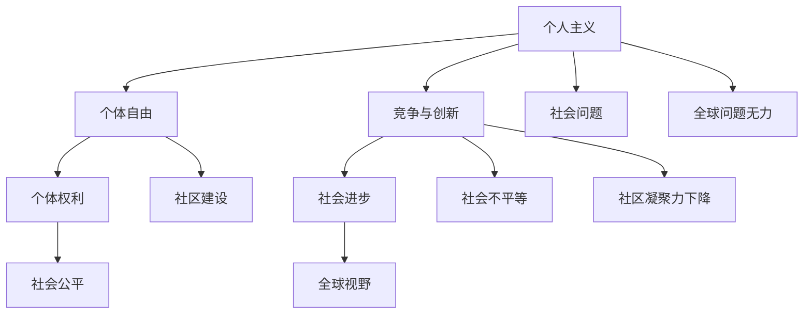
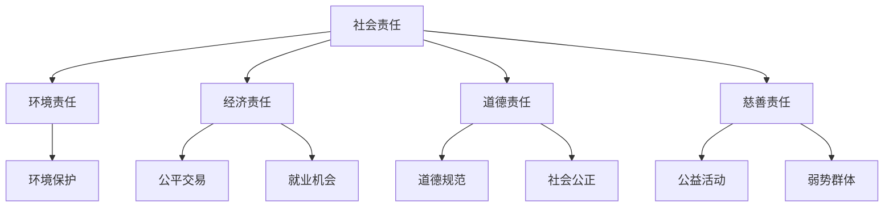
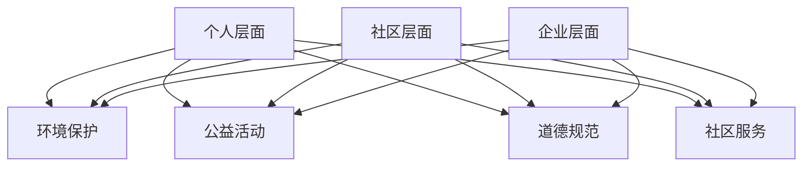
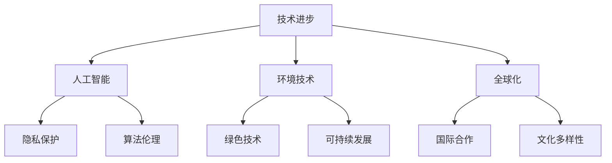
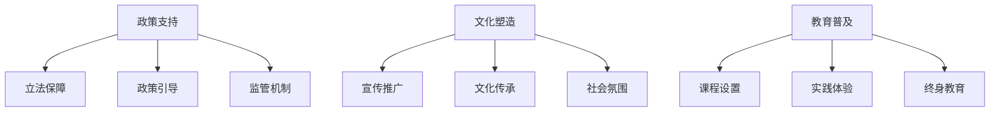

                 

# 从个人主义到社会责任：重新定义现代公民角色

## 关键词
- 个人主义
- 社会责任
- 现代公民角色
- 技术进步
- 社区行动
- 企业责任

## 摘要
本文旨在探讨从个人主义向社会责任转型的必要性，重新定义现代公民角色。通过对个人主义的局限性、社会责任的概念与意义、实践路径以及未来展望的分析，本文揭示了技术进步和社会责任教育在构建一个更加和谐社会的关键作用。

## 引言
在快速变化的世界中，个人主义和集体主义之间的张力不断演变。传统上，个人主义强调个体自由和自我实现，而集体主义则重视集体利益和社会整体发展。然而，现代社会面临着诸多挑战，如环境恶化、社会不平等和技术进步带来的伦理问题。这些问题要求我们重新审视个人主义和集体主义的边界，寻找一种更加平衡的公民角色。

本文将分四个部分展开讨论：第一部分分析个人主义的局限性；第二部分介绍社会责任的概念与意义；第三部分探讨社会责任的实践路径；第四部分展望社会责任的未来趋势。通过这一系列探讨，我们希望读者能够重新思考个人主义和集体主义的关系，理解并践行社会责任，为构建一个更加和谐的社会贡献力量。

## 第一部分：个人主义的局限性

### 第1章：个人主义的历史与现状

#### 1.1 个人主义的定义与起源

个人主义起源于西方哲学，强调个体的独立性和自由意志。其核心思想是，个体的权利和利益应优先于社会和集体的利益。这种思想最早可以追溯到古希腊的哲学家，如苏格拉底和柏拉图。在近代，个人主义得到了进一步的发展，尤其是在启蒙时代，约翰·洛克和托马斯·杰斐逊等思想家的著作中，个人权利和自由成为了政治哲学的基础。

在现代社会，个人主义已经成为主流价值观之一。市场经济体制和民主政治体制都强调个人自由和权利的重要性。个人主义提倡竞争和创新，推动了科技和经济的发展。然而，随着社会的进步，个人主义也暴露出了一些局限性。

#### 1.2 个人主义对现代社会的挑战

个人主义在带来经济增长和个人成就的同时，也带来了一系列社会问题。首先，个人主义的过度追求可能导致社会不平等。在竞争激烈的社会环境中，成功和失败之间的差距可能不断扩大，导致社会阶层固化。其次，个人主义的过度强调可能导致社区凝聚力的下降。当个体过于关注自己的利益时，他们可能忽视了社区和其他个体的需求，导致社会关系疏远。

此外，个人主义在面对全球性问题时显得无力。环境问题、全球贫困和疾病流行等挑战需要国际合作和集体行动。个人主义往往强调个体行为，而忽视了集体行动的重要性。

#### 1.3 个人主义与集体主义的关系

个人主义和集体主义并非完全对立，而是可以相互补充的。在现代社会，我们既需要个体的自由和创造力，也需要集体的合作和互助。关键在于如何在个人主义和集体主义之间找到平衡。

个人主义与集体主义的平衡可以通过以下方式实现：

1. **加强社区建设**：通过社区组织和活动，增强个体的社会联系和责任感。
2. **提倡社会公平**：确保每个人都能够享有公平的机会和资源，减少社会不平等。
3. **培养全球视野**：通过教育和文化交流，提高个体的全球意识和责任感。

通过这些措施，我们可以逐步克服个人主义的局限性，实现个人与社会之间的和谐发展。

### Mermaid流程图：个人主义与集体主义的关系



### Python源代码示例：个人主义与集体主义的平衡

```python
# 示例：计算个体自由与社会进步的平衡

def calculate_balance(individual_freedom, social_progress):
    """
    计算个体自由与社会进步的平衡值。
    
    参数:
    individual_freedom (float): 个体自由度，范围0-10。
    social_progress (float): 社会进步度，范围0-10。
    
    返回:
    balance (float): 平衡值，范围0-100。
    """
    balance = (individual_freedom + social_progress) / 2
    return balance

# 测试
individual_freedom_score = 7
social_progress_score = 8
balance = calculate_balance(individual_freedom_score, social_progress_score)
print(f"平衡值：{balance}")
```

#### 结论

个人主义在现代社会中发挥了重要作用，但其局限性也逐渐显现。通过平衡个人主义和集体主义，我们可以更好地应对现代社会面临的挑战。社会责任成为现代公民角色的关键，它不仅关注个体的自由和权利，也重视社区和社会的整体福祉。在接下来的部分，我们将深入探讨社会责任的概念与意义，为重新定义现代公民角色提供理论支持。

## 第二部分：社会责任的概念与意义

### 第2章：社会责任的概念与意义

#### 2.1 社会责任的定义与内涵

社会责任是指个体、组织或机构在其运营过程中对社会的责任和义务。它不仅涉及法律和道德层面的要求，还包含对环境保护、社会福祉和经济发展的关注。社会责任是一种价值观的体现，强调组织和个人应当超越自身的利益，积极参与社会事务，促进社会整体的繁荣和可持续发展。

社会责任的内涵可以从以下几个方面进行理解：

1. **环境责任**：组织和个人应当承担保护环境的责任，减少污染和资源浪费，促进绿色技术和可持续发展。
2. **经济责任**：组织和个人应当通过公平交易和诚信经营，为社会创造就业机会，促进经济增长，并回馈社会。
3. **道德责任**：组织和个人应当遵守道德规范，尊重他人权利，维护社会公正和诚信。
4. **慈善责任**：组织和个人应当积极参与公益活动，帮助弱势群体，促进社会和谐。

#### 2.2 社会责任的实践价值

社会责任的实践价值在于其对社会和个人产生的深远影响。首先，社会责任有助于建立组织和个人在社会中的良好声誉。当一个组织或个人积极参与社会事务，履行其社会责任时，会赢得社会的认可和尊重，从而提高其社会影响力。

其次，社会责任有助于促进社会整体的繁荣和可持续发展。通过环境保护、公平交易和社会公益等活动，社会责任可以减少社会矛盾，增强社会凝聚力，推动社会的全面进步。

此外，社会责任对于个人的成长和发展也具有重要意义。通过参与社会责任活动，个人可以培养责任感、团队合作精神和公民意识，提升自身的综合素质和社会竞争力。

#### 2.3 社会责任与个人利益的平衡

在个人主义强调个体自由和利益的同时，社会责任强调个体对社会的责任和义务。这两者之间的关系需要平衡，以实现个体与社会的和谐发展。

首先，社会责任不应被视为对个人自由的剥夺，而应被视为个体在享受自由的同时所承担的义务。个体在追求个人利益的同时，应当考虑到自己的行为对社会的影响，并尽力减少负面影响。

其次，社会责任与个人利益的平衡可以通过以下方式实现：

1. **政策引导**：政府可以通过立法和政策措施，鼓励组织和个人履行社会责任，同时保障个人的基本权益。
2. **文化宣传**：通过教育和宣传，提高公众对社会责任的认识和重视，形成良好的社会氛围。
3. **社会监督**：建立有效的社会监督机制，确保组织和个人履行社会责任，并对不履行责任的行为进行惩处。

#### 结论

社会责任是现代公民角色的重要组成部分，它不仅关注个体的自由和利益，也重视社会的整体福祉。通过平衡个人主义和社会责任，我们可以实现个体与社会的和谐发展，为构建一个更加公正、繁荣和可持续的社会贡献力量。在接下来的部分，我们将探讨社会责任的具体实践路径，帮助读者理解和践行社会责任。

### Mermaid流程图：社会责任的核心概念



### Python源代码示例：社会责任与个人利益的平衡

```python
# 示例：计算社会责任评分与个人利益评分的平衡

def calculate_balance(responsibility_score, individual_interest_score):
    """
    计算社会责任评分与个人利益评分的平衡值。
    
    参数:
    responsibility_score (float): 社会责任评分，范围0-10。
    individual_interest_score (float): 个人利益评分，范围0-10。
    
    返回:
    balance (float): 平衡值，范围0-20。
    """
    balance = (responsibility_score + individual_interest_score) / 2
    return balance

# 测试
responsibility_score = 8
individual_interest_score = 7
balance = calculate_balance(responsibility_score, individual_interest_score)
print(f"平衡值：{balance}")
```

## 第二部分：社会责任的实践

### 第3章：社会责任的实践路径

社会责任的实践路径多样，可以从个人、社区和企业三个层面进行探讨。每个层面都有其独特的实践策略和案例分析，以下将分别介绍。

#### 3.1 个人层面的社会责任

**3.1.1 个人社会责任的内涵**

个人社会责任是指个体在社会中应承担的责任和义务，包括但不限于环境保护、公益活动、道德规范和社区服务。个人社会责任的内涵可以从以下几个方面进行理解：

1. **环境保护**：个人应当关注环境保护，减少日常生活中的污染和资源浪费，如减少使用一次性塑料、节约用水用电等。
2. **公益活动**：个人应当积极参与公益活动，帮助弱势群体，如捐款、志愿服务等。
3. **道德规范**：个人应当遵守社会道德规范，尊重他人权利，诚实守信，公正公平。
4. **社区服务**：个人应当积极参与社区服务，增强社区凝聚力，如参与社区清洁、维护社区设施等。

**3.1.2 个人社会责任的实践策略**

1. **自我教育**：通过学习环境保护、社会责任等相关知识，提高个人的社会责任意识。
2. **行为改变**：在日常生活中实践社会责任，如减少污染、节约资源、参与公益活动等。
3. **社会参与**：积极参与社会活动和公共事务，为社会贡献力量。
4. **榜样作用**：通过自身行为影响他人，传递社会责任的理念。

**3.1.3 个人社会责任的案例分析**

**案例1：环保志愿者**

张先生是一位环保志愿者，他积极参与社区的环保活动，如垃圾分类宣传、环保讲座等。他还自己动手制作环保袋，鼓励家人和邻居减少使用一次性塑料。张先生的行为不仅提高了自己和家人的环保意识，还影响了周围的人，促进了社区的环保氛围。

**案例2：公益活动参与者**

李小姐是一名公益活动爱好者，她经常参加各种慈善捐款、志愿服务等活动。在一次地震救援行动中，李小姐主动请缨前往灾区，为灾民提供物资和心理支持。她的无私奉献和坚定信念感动了无数人，也激励了更多人参与公益活动。

#### 3.2 社区层面的社会责任

**3.2.1 社区社会责任的内涵**

社区社会责任是指社区成员在社区中应承担的责任和义务，包括但不限于社区服务、社区治理、社区教育和社区发展。社区社会责任的内涵可以从以下几个方面进行理解：

1. **社区服务**：社区成员应当积极参与社区服务，如维护社区环境、帮助邻里解决困难等。
2. **社区治理**：社区成员应当参与社区治理，共同维护社区的稳定和安全。
3. **社区教育**：社区成员应当关注社区教育，为社区儿童提供学习和成长的机会。
4. **社区发展**：社区成员应当共同规划社区的发展，提高社区的生活质量。

**3.2.2 社区社会责任的实践策略**

1. **社区组织**：建立社区组织，如居民委员会、志愿者团队等，组织社区成员参与社会责任活动。
2. **社区宣传**：通过宣传和教育活动，提高社区成员对社会责任的认知和重视。
3. **社区合作**：鼓励社区成员之间的合作与互助，共同解决社区问题。
4. **社区规划**：共同规划社区的发展，提高社区的生活质量。

**3.2.3 社区社会责任的案例分析**

**案例1：社区环保项目**

某社区的居民自发组织了一个环保项目，该项目包括垃圾分类、绿色出行和环保知识宣传等活动。通过这个项目，社区成员的环保意识得到了显著提升，社区环境也得到了明显改善。

**案例2：社区治理项目**

某社区成立了一个居民委员会，该委员会定期召开会议，讨论和解决社区问题。通过居民委员会的努力，社区的安全和秩序得到了有效保障，居民的生活质量也得到了提高。

#### 3.3 企业层面的社会责任

**3.3.1 企业社会责任的内涵**

企业社会责任是指企业在经营活动中应承担的责任和义务，包括但不限于环境保护、员工权益、客户权益和社会公益。企业社会责任的内涵可以从以下几个方面进行理解：

1. **环境保护**：企业应当关注环境保护，减少生产过程中的污染和资源浪费。
2. **员工权益**：企业应当保障员工的权益，如提供安全的工作环境、合理的薪酬和晋升机会等。
3. **客户权益**：企业应当尊重客户的权益，提供优质的产品和服务。
4. **社会公益**：企业应当积极参与社会公益，回馈社会，如捐赠物资、开展公益活动等。

**3.3.2 企业社会责任的实践策略**

1. **环保措施**：企业应当采取环保措施，如使用清洁能源、推行绿色生产等。
2. **员工培训**：企业应当提供员工培训，提高员工的专业技能和社会责任感。
3. **客户服务**：企业应当提供优质的客户服务，满足客户需求，提升客户满意度。
4. **公益活动**：企业应当积极参与公益活动，回馈社会，提升企业形象。

**3.3.3 企业社会责任的案例分析**

**案例1：环保企业**

某环保企业致力于研发和推广绿色技术，其产品和服务广泛应用于环保领域。该企业还积极参与环保公益活动，为环境保护作出了积极贡献。

**案例2：公益企业**

某知名企业设立了公益基金会，该基金会专注于支持教育、医疗和环保等领域的公益事业。通过基金会的努力，许多弱势群体得到了帮助，社会问题也得到了有效缓解。

#### 结论

社会责任的实践路径多样，从个人、社区到企业，每个层面都有其独特的实践策略和案例分析。通过个人行为改变、社区组织活动和企业社会责任的履行，我们可以逐步构建一个更加和谐、可持续发展的社会。在接下来的部分，我们将探讨社会责任的未来趋势，为构建一个更加美好的社会提供新的视角。

### Mermaid流程图：社会责任的实践路径



### Python源代码示例：社会责任实践效果评估

```python
# 示例：评估个人和企业社会责任实践的效果

def assess_responsibility(practice_score, impact_score):
    """
    评估社会责任实践的效果。
    
    参数:
    practice_score (float): 实践评分，范围0-10。
    impact_score (float): 影响评分，范围0-10。
    
    返回:
    effectiveness (float): 实践效果评分，范围0-20。
    """
    effectiveness = (practice_score + impact_score) / 2
    return effectiveness

# 测试
practice_score = 9
impact_score = 8
effectiveness = assess_responsibility(practice_score, impact_score)
print(f"实践效果评分：{effectiveness}")
```

## 第三部分：社会责任的未来展望

### 第4章：社会责任的未来趋势

随着全球化和技术进步的加速，社会责任的实践也在不断演变。未来的社会责任将更加多元化和复杂化，需要我们更深入地探讨其在各个领域的应用和挑战。

#### 4.1 技术进步与社会责任

技术进步，尤其是人工智能和大数据技术的发展，为社会责任的实践带来了新的机遇和挑战。以下是一些关键领域：

**4.1.1 人工智能与社会责任**

人工智能技术在医疗、教育、交通等领域有着广泛的应用，提高了生产效率和服务质量。然而，人工智能的发展也带来了隐私保护、算法偏见和社会不平等等问题。为了应对这些挑战，社会责任要求我们在技术开发和应用过程中，注重公平、透明和伦理。

1. **隐私保护**：人工智能技术的发展需要大量个人数据，如何保护用户隐私成为重要问题。社会责任要求我们在数据收集和使用过程中，严格遵守隐私保护法规，确保用户的数据安全。
   
2. **算法伦理**：人工智能算法的决策过程可能存在偏见，导致不公平的结果。社会责任要求我们在算法设计和应用中，充分考虑算法的伦理问题，确保算法的公平性和透明性。

**4.1.2 环境问题与社会责任**

环境问题是现代社会面临的重大挑战之一，技术进步在解决环境问题方面发挥着关键作用。

1. **绿色技术**：随着绿色技术的不断发展，如可再生能源、废物回收和环保材料等，社会责任要求企业积极采用绿色技术，减少对环境的负面影响。

2. **可持续发展**：社会责任要求企业在经营过程中，注重可持续发展，确保经济、社会和环境的协调发展。

**4.1.3 全球化与社会责任**

全球化使得社会问题变得更加复杂，社会责任的实践也需要跨国合作。

1. **国际合作**：面对全球性问题，如气候变化、全球贫困和传染病流行，社会责任要求各国加强合作，共同应对挑战。

2. **文化多样性**：全球化带来了文化的多样性，社会责任要求我们尊重不同的文化和价值观，促进文化交流和融合。

#### 4.2 社会责任的教育与实践

社会责任的教育和实践是构建一个负责任社会的关键。以下是一些关键措施：

**4.2.1 社会责任教育的重要性**

社会责任教育有助于培养个体的社会责任感和公民意识。以下是一些关键方面：

1. **学校教育**：学校应将社会责任教育纳入课程体系，通过课程、活动和项目，培养学生的社会责任感。

2. **家庭教育**：家长应在日常生活中，通过言行举止，传递社会责任的理念，培养孩子的公民意识。

**4.2.2 社会责任教育的实践路径**

1. **实践活动**：组织学生参与公益活动、志愿服务和社区服务等活动，提高他们的社会责任感。

2. **案例研究**：通过案例研究，让学生了解社会责任在不同领域的应用，提高他们的实践能力。

3. **跨学科学习**：将社会责任教育与其他学科相结合，如环境科学、社会学、经济学等，提高学生的综合素养。

**4.2.3 社会责任教育的案例分析**

**案例1：社会责任课程**

某学校开设了“社会责任”课程，通过案例分析、小组讨论和实地考察等方式，让学生了解社会责任在不同领域的应用。课程还组织学生参与公益活动，如环保行动和社区服务，提高了他们的社会责任感。

**案例2：社会责任俱乐部**

某学校成立了“社会责任俱乐部”，定期组织学生参与各种公益活动，如义卖、捐款和志愿服务等。俱乐部还邀请社会知名人士进行讲座，分享他们的社会责任实践经验，激发学生的社会责任意识。

#### 结论

技术进步和社会责任教育的结合，将为构建一个更加和谐和可持续的社会奠定基础。通过技术创新和教育的普及，我们可以更好地应对现代社会面临的挑战，实现个人与社会的共同进步。在未来的社会责任实践中，我们需要不断创新和探索，为构建一个更加美好的社会贡献力量。

### Mermaid流程图：技术进步与社会责任



### Python源代码示例：社会责任教育效果评估

```python
# 示例：评估社会责任教育效果

def assess_education(effectiveness_score, practical_experience_score):
    """
    评估社会责任教育效果。
    
    参数:
    effectiveness_score (float): 效果评分，范围0-10。
    practical_experience_score (float): 实践经验评分，范围0-10。
    
    返回:
    education_score (float): 教育效果评分，范围0-20。
    """
    education_score = (effectiveness_score + practical_experience_score) / 2
    return education_score

# 测试
effectiveness_score = 8
practical_experience_score = 9
education_score = assess_education(effectiveness_score, practical_experience_score)
print(f"教育效果评分：{education_score}")
```

### 第5章：构建社会责任型社会

#### 5.1 社会责任型社会的特征

构建社会责任型社会，是现代社会发展的必然趋势。社会责任型社会具有以下特征：

1. **社会责任意识普及**：社会成员普遍具有高度的社会责任意识，积极参与社会事务，关注社会问题。
2. **公平与正义**：社会公正，保障每个人的权利和机会，减少贫富差距和社会不平等。
3. **可持续发展**：社会在经济、社会和环境三个方面实现平衡发展，确保长期繁荣。
4. **社会凝聚力强**：社区凝聚力强，社会成员之间相互支持，共同面对挑战。
5. **技术创新驱动**：积极采用新技术，提高生产效率，促进社会进步。
6. **教育普及**：教育资源充足，公民素质高，社会责任教育深入人心。

#### 5.2 构建社会责任型社会的策略

构建社会责任型社会需要多方合作，以下是一些关键策略：

**5.2.1 政策支持与社会责任**

1. **立法保障**：政府应制定相关法律法规，保障社会责任的落实。
2. **政策引导**：通过税收优惠、补贴等措施，鼓励企业和社会组织履行社会责任。
3. **监管机制**：建立健全的社会责任监管机制，确保社会责任的执行。

**5.2.2 文化塑造与社会责任**

1. **宣传推广**：通过媒体、教育等渠道，广泛宣传社会责任的重要性，提高社会认知。
2. **文化传承**：弘扬具有社会责任感的文化传统，如慈善、助人等，培养社会责任意识。
3. **社会氛围**：营造一个积极履行社会责任的社会氛围，激励更多人参与到社会责任实践中。

**5.2.3 教育普及与社会责任**

1. **课程设置**：在学校教育中，设置社会责任课程，培养学生的社会责任感。
2. **实践体验**：通过实践活动，让学生亲身体验社会责任的重要性，提高其实践能力。
3. **终身教育**：鼓励社会成员终身学习，不断提高社会责任意识和能力。

#### 结论

构建社会责任型社会，是实现个体与社会的和谐发展、可持续发展的关键。通过政策支持、文化塑造和教育普及等策略，我们可以逐步实现这一目标。在未来的发展中，我们需要不断探索和创新，为构建一个更加美好的社会责任型社会而努力。

### Mermaid流程图：构建社会责任型社会的策略



### Python源代码示例：社会责任型社会的构建效果评估

```python
# 示例：评估社会责任型社会的构建效果

def assess_society(political_support_score, cultural_influence_score, education_level_score):
    """
    评估社会责任型社会的构建效果。
    
    参数:
    political_support_score (float): 政策支持评分，范围0-10。
    cultural_influence_score (float): 文化影响评分，范围0-10。
    education_level_score (float): 教育水平评分，范围0-10。
    
    返回:
    society_score (float): 社会责任型社会构建效果评分，范围0-30。
    """
    society_score = (political_support_score + cultural_influence_score + education_level_score) / 3
    return society_score

# 测试
political_support_score = 9
cultural_influence_score = 8
education_level_score = 7
society_score = assess_society(political_support_score, cultural_influence_score, education_level_score)
print(f"社会责任型社会构建效果评分：{society_score}")
```

## 附录

### 附录 A：社会责任实践指南

#### A.1 社会责任实践的基本原则

1. **尊重他人**：在履行社会责任的过程中，尊重他人的权利和尊严，避免侵犯他人利益。
2. **公平公正**：在分配资源和机会时，确保公平公正，减少社会不平等。
3. **持续改进**：不断反思和改进社会责任实践，提高实践效果。
4. **透明公开**：社会责任实践应公开透明，接受社会监督。

#### A.2 社会责任实践的工具与方法

1. **调研分析**：通过调研和数据分析，了解社会责任实践的需求和效果。
2. **项目管理**：运用项目管理方法，确保社会责任实践的顺利实施。
3. **合作机制**：建立合作机制，促进政府、企业和社会组织的合作。
4. **宣传教育**：通过宣传和教育，提高公众对社会责任的认知和参与度。

#### A.3 社会责任实践的案例分析

1. **案例1：某企业的社会责任实践**
   - **背景**：某企业在经营过程中，注重环境保护和社会责任。
   - **实践**：该企业推行绿色生产，减少污染和资源浪费，并积极参与公益活动。
   - **效果**：企业的社会责任实践提高了品牌形象，增强了员工和客户的满意度。

2. **案例2：某社区的社会责任实践**
   - **背景**：某社区面临环境污染和社区凝聚力下降的问题。
   - **实践**：社区成员自发组织环保项目和社区服务活动，提高了社区环境质量和居民凝聚力。
   - **效果**：社区环境得到了明显改善，居民之间的互动和合作增多。

### 最佳实践 tips

1. **制定明确的目标**：在开展社会责任实践前，制定明确的目标和计划，确保实践有方向和效果。
2. **注重实际效果**：社会责任实践不仅要形式多样，更要注重实际效果，确保对社会产生积极影响。
3. **持续跟踪和评估**：定期跟踪和评估社会责任实践的效果，及时调整和改进实践策略。

### 小结

社会责任实践是构建和谐社会的重要途径。通过遵循基本原则、运用有效工具和方法，我们可以更好地履行社会责任，促进个体和社会的共同发展。

### 注意事项

1. **法律法规**：在履行社会责任时，务必遵守相关法律法规，确保实践合法合规。
2. **尊重多样性**：在开展社会责任实践时，尊重不同文化背景和价值观，避免文化冲突。

### 拓展阅读

1. **《社会责任报告编制指南》**：详细介绍社会责任报告的编制方法和标准。
2. **《社会责任管理体系标准》**：介绍社会责任管理体系的构建和实施。

---

**作者：AI天才研究院/AI Genius Institute & 禅与计算机程序设计艺术 /Zen And The Art of Computer Programming**

