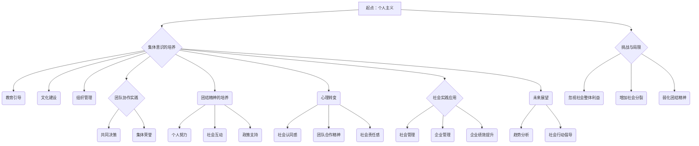

                 

### 从个人主义到集体意识：重建社会责任感和团结精神

> 关键词：个人主义，集体意识，社会责任感，团结精神，社会变革

> 摘要：本文从历史背景和概念分析出发，探讨了个人主义与集体意识的演变及其在社会责任感与团结精神中的作用。文章通过多角度的解析，提出了集体意识与团结精神的培养方法，并探讨了个人主义到集体意识转变的心理机制与社会实践。最终，文章展望了集体意识发展的趋势，并提出了倡导集体意识的社会行动。

## 目录大纲

### 第一部分：背景与概念

#### 第1章：个人主义与集体意识的演变

##### 1.1 个人主义的历史背景与发展

##### 1.2 集体意识的概念与重要性

##### 1.3 集体意识与个人自由的关系

#### 第2章：社会责任感的重要性

##### 2.1 社会责任感的定义

##### 2.2 社会责任感的实践

##### 2.3 社会责任感的培养与传承

### 第二部分：集体意识与团结精神的构建

#### 第3章：集体意识的培养

##### 3.1 集体意识的培养方法

##### 3.2 集体意识在团队中的实践

##### 3.3 集体荣誉与团队精神

#### 第4章：团结精神的培养

##### 4.1 团结精神的概念与意义

##### 4.2 团结精神的培养途径

##### 4.3 社会环境与政策支持

### 第三部分：从个人到集体的转变

#### 第5章：个人主义到集体意识的心理转变

##### 5.1 个人主义心理的局限

##### 5.2 集体意识心理的培养

##### 5.3 集体意识心理的培养策略

#### 第6章：集体意识在社会实践中的应用

##### 6.1 集体意识在社会管理中的应用

##### 6.2 集体意识在企业中的实践

##### 6.3 集体意识对企业绩效的影响

### 第四部分：案例分析

#### 第7章：个人主义到集体意识的成功转型

##### 7.1 跨文化团队的成功转型

##### 7.2 社区发展与集体意识的结合

#### 第8章：从个人主义到集体意识的未来展望

##### 8.1 集体意识发展的趋势

##### 8.2 倡导集体意识的社会行动

### 附录

#### 附录 A：参考资料与延伸阅读

#### 附录 B：集体意识与团结精神相关研究方法

#### 附录 C：集体意识与团结精神实践案例汇总

### Mermaid 流程图

---

### 从个人主义到集体意识：重建社会责任感和团结精神

在当今社会，个人主义与集体意识之间的张力愈发显著。个人主义强调个体独立、自由和自主选择，而集体意识则关注社会整体利益、团队合作和共同目标。两者之间的平衡，关系到社会责任感和团结精神的重建。本文将从个人主义与集体意识的历史背景和概念出发，深入探讨其在社会责任感和团结精神中的作用，并提出相应的培养方法。

### 第1章：个人主义与集体意识的演变

#### 1.1 个人主义的历史背景与发展

个人主义并非一个新鲜概念，其历史可以追溯到古希腊时期。在那时，苏格拉底、柏拉图和亚里士多德等哲学家强调个体的独立思考和自由意志。随着工业革命和现代化进程的推进，个人主义在西方社会逐渐占据主导地位。个人主义认为，个体是自我实现的主体，追求个人利益和幸福是最高的目标。

然而，个人主义也面临着诸多挑战。在过度追求个人利益的过程中，社会整体利益和公共利益往往被忽视，导致社会分裂和不公。此外，个人主义可能导致个体过于依赖自我，忽视团队合作和社会责任，削弱了社会的团结精神。

#### 1.2 集体意识的概念与重要性

集体意识是指个体对自身所属社会群体的认同感、归属感和责任感。它不仅关注个体的自我实现，还强调个体与社会整体的和谐共生。集体意识在社会中的作用不可忽视，它有助于增强社会凝聚力、促进社会和谐发展。

首先，集体意识有助于解决社会问题。在集体意识的作用下，个体愿意为社会的整体利益作出贡献，从而减少社会矛盾和冲突。其次，集体意识有助于培养社会责任感。当个体认同自身所属的社会群体，他们更愿意承担社会责任，为社会的发展贡献自己的力量。最后，集体意识有助于团结精神的形成。在一个具有集体意识的社会中，个体愿意为了共同的利益和目标而努力，从而形成强大的团结力量。

#### 1.3 集体意识与个人自由的关系

集体意识与个人自由并非对立关系，而是相辅相成的。集体意识强调个体在社会中的责任和角色，而个人自由则保障个体在实现自我价值的过程中不受限制。一个健康的集体意识应该允许个体在尊重社会整体利益的前提下追求个人自由。

在实践中，集体意识与个人自由的平衡是一个挑战。一方面，过度的集体意识可能导致个体失去自由，变得过于依赖社会整体；另一方面，过度的个人自由可能导致社会分裂和个体孤立。因此，如何找到集体意识与个人自由的平衡点，是实现社会责任感和团结精神重建的关键。

### 第2章：社会责任感的重要性

#### 2.1 社会责任感的定义

社会责任感是指个体在履行社会角色和责任时，对社会的责任和义务感。它不仅涉及个体对社会的回报，还涉及个体对社会问题的关注和解决。社会责任感的内涵包括：

- 个体对社会的认同感和归属感
- 个体对社会的贡献和奉献
- 个体对社会责任和义务的履行

#### 2.2 社会责任感的实践

社会责任感的实践可以从个人层面、企业层面和社会层面进行。

- 个人层面的社会责任感体现为个体的行为和选择。个体可以通过参与社会公益活动、关注社会问题、为他人提供帮助等方式履行社会责任。
- 企业层面的社会责任感体现为企业对社会的影响。企业可以通过诚信经营、公平竞争、保护环境、关爱员工等方式履行社会责任。
- 社会层面的社会责任感体现为社会的整体责任。社会可以通过制定政策、提供公共服务、推动社会公平等方式履行社会责任。

#### 2.3 社会责任感的培养与传承

社会责任感的培养和传承是一个长期的过程。以下是一些培养和传承社会责任感的方法：

- 教育是培养社会责任感的重要途径。学校可以通过课程设置、课外活动等方式引导学生关注社会问题，培养他们的社会责任感。
- 家庭是培养社会责任感的重要环境。家长可以通过身教言传，培养孩子的社会责任感。
- 社会组织是培养社会责任感的重要平台。社会组织可以通过组织公益活动、提供志愿服务等方式培养个体的社会责任感。
- 媒体是传播社会责任感的重要渠道。媒体可以通过报道社会问题、宣传先进事迹等方式传播社会责任感。

### 第3章：集体意识的培养

#### 3.1 集体意识的培养方法

培养集体意识需要从教育、文化建设、组织管理等多个方面进行。

- 教育是培养集体意识的基础。学校可以通过课程设置、课外活动等方式引导学生培养集体意识。
- 文化建设是培养集体意识的关键。一个具有集体意识的文化环境可以促进个体对集体价值的认同和追求。
- 组织管理是培养集体意识的重要手段。一个良好的组织管理机制可以激发个体的集体意识，促进团队协作。

#### 3.2 集体意识在团队中的实践

在团队中培养集体意识，可以采取以下方法：

- 团队合作：通过团队合作，个体可以在共同的目标和任务中培养集体意识。
- 共同决策：通过共同决策，个体可以在团队中学会尊重他人的意见，增强集体意识。
- 集体荣誉：通过集体荣誉，个体可以在团队的成就中感受到集体意识的重要性。

#### 3.3 集体荣誉与团队精神

集体荣誉和团队精神是集体意识的重要组成部分。一个具有集体荣誉和团队精神的社会，可以更好地实现社会责任感和团结精神。

- 集体荣誉是指个体在团队中的成就和贡献得到社会的认可和尊重。集体荣誉可以激发个体的集体意识，增强个体的社会责任感。
- 团队精神是指个体在团队中形成的共同价值观、共同目标和共同行动。团队精神可以促进个体之间的合作，增强社会的团结力量。

### 第4章：团结精神的培养

#### 4.1 团结精神的概念与意义

团结精神是指个体在社会中形成的共同价值观、共同目标和共同行动。团结精神在社会中具有重要意义：

- 增强社会凝聚力：团结精神可以增强社会的凝聚力，减少社会矛盾和冲突。
- 促进社会和谐发展：团结精神可以促进社会和谐发展，实现社会的共同利益。
- 提高社会效率：团结精神可以提高社会效率，实现资源的合理配置。

#### 4.2 团结精神的培养途径

培养团结精神可以从以下几个方面进行：

- 个人努力：个体可以通过自我提升、自我完善来培养团结精神。
- 社会互动：个体可以通过参与社会活动、与他人交往来培养团结精神。
- 政策支持：政府可以通过制定相关政策、提供公共服务来培养团结精神。

#### 4.3 社会环境与政策支持

社会环境和政策支持是培养团结精神的重要保障。一个良好的社会环境可以促进个体之间的互动和合作，增强团结精神。以下是一些具体措施：

- 加强社区建设：通过加强社区建设，促进邻里之间的互动和合作，培养团结精神。
- 优化公共服务：通过优化公共服务，提高社会公平，减少社会矛盾，促进团结精神。
- 推广志愿服务：通过推广志愿服务，鼓励个体为社会做出贡献，培养团结精神。

### 第5章：个人主义到集体意识的心理转变

#### 5.1 个人主义心理的局限

个人主义心理在追求个体自由和独立的过程中，也存在一些局限：

- 忽视社会整体利益：个人主义可能导致个体过于关注自身利益，忽视社会整体利益。
- 增加社会分裂：个人主义可能导致社会分裂，增加社会矛盾和冲突。
- 弱化团结精神：个人主义可能导致个体之间的疏离和孤立，削弱团结精神。

#### 5.2 集体意识心理的培养

培养集体意识心理需要从以下几个方面进行：

- 增强社会认同感：通过增强个体对社会的认同感，培养集体意识。
- 培养团队合作精神：通过培养团队合作精神，增强集体意识。
- 提高社会责任感：通过提高社会责任感，增强集体意识。

#### 5.3 集体意识心理的培养策略

以下是一些培养集体意识心理的具体策略：

- 教育引导：通过教育引导，培养个体对社会整体的认同感和责任感。
- 社会实践：通过社会实践，让个体在实际行动中体验到集体意识的益处。
- 组织活动：通过组织活动，增强个体之间的互动和合作，培养集体意识。

### 第6章：集体意识在社会实践中的应用

#### 6.1 集体意识在社会管理中的应用

集体意识在社会管理中具有重要应用：

- 社会问题解决：通过集体意识，个体更愿意为解决社会问题作出贡献。
- 公共服务：通过集体意识，政府和社会组织更愿意提供优质的公共服务。
- 社会创新：通过集体意识，社会更有可能进行社会创新，实现社会进步。

#### 6.2 集体意识在企业中的实践

集体意识在企业中同样具有重要应用：

- 企业文化：通过培养集体意识，企业可以形成积极的企业文化。
- 团队协作：通过培养集体意识，企业可以提高团队协作效率。
- 企业绩效：通过培养集体意识，企业可以提高绩效，实现可持续发展。

#### 6.3 集体意识对企业绩效的影响

集体意识对企业绩效的影响主要体现在以下几个方面：

- 提高员工满意度：通过培养集体意识，企业可以提高员工的满意度，降低员工流失率。
- 促进团队合作：通过培养集体意识，企业可以促进团队合作，提高工作效率。
- 增强创新能力：通过培养集体意识，企业可以增强创新能力，推动企业可持续发展。

### 第7章：个人主义到集体意识的成功转型

#### 7.1 跨文化团队的成功转型

跨文化团队在面对文化差异时，通过培养集体意识，可以实现成功转型：

- 文化融合：通过培养集体意识，跨文化团队能够实现文化融合，减少文化冲突。
- 团队协作：通过培养集体意识，跨文化团队能够实现高效的团队协作。
- 创新能力：通过培养集体意识，跨文化团队能够增强创新能力，推动项目成功。

#### 7.2 社区发展与集体意识的结合

社区发展与集体意识的结合，可以推动社区的可持续发展：

- 社区凝聚力：通过培养集体意识，社区可以增强凝聚力，减少社区问题。
- 社区共建：通过培养集体意识，社区可以形成共建共治共享的良好氛围。
- 社区发展：通过培养集体意识，社区可以实现可持续发展，提高居民生活质量。

### 第8章：从个人主义到集体意识的未来展望

#### 8.1 集体意识发展的趋势

随着全球化和社会发展的加速，集体意识的发展趋势呈现以下几个方面：

- 多元化：集体意识将更加多元化，适应不同文化和背景的需求。
- 网络化：集体意识将在网络空间中得到更广泛的传播和应用。
- 智能化：集体意识将通过人工智能等技术实现更高效的管理和应用。

#### 8.2 倡导集体意识的社会行动

倡导集体意识的社会行动可以从以下几个方面进行：

- 教育宣传：通过教育宣传，提高公众对集体意识的认识和理解。
- 社会组织：通过社会组织，推动集体意识的实践和推广。
- 政策支持：通过政策支持，为集体意识的发展提供制度保障。

### 附录

#### 附录 A：参考资料与延伸阅读

- 参考文献
- 延伸阅读

#### 附录 B：集体意识与团结精神相关研究方法

- 研究方法
- 实证分析

#### 附录 C：集体意识与团结精神实践案例汇总

- 实践案例
- 案例分析

### 总结

从个人主义到集体意识的转变，是重建社会责任感和团结精神的关键。通过培养集体意识，个体可以在尊重社会整体利益的前提下实现个人价值。同时，集体意识的培养也有助于解决社会问题，促进社会和谐发展。在未来，集体意识将越来越成为社会发展的核心要素，值得全社会共同努力。

### 作者信息

作者：AI天才研究院/AI Genius Institute & 禅与计算机程序设计艺术 /Zen And The Art of Computer Programming

---

### 参考资料与延伸阅读

在撰写本文的过程中，参考了以下文献和资料，为本文的研究提供了重要的理论支持和实践参考：

1. **弗里德里希·哈耶克，《个人主义与经济秩序》**：这本书深入探讨了个人主义的历史背景、哲学基础以及其在经济秩序中的作用。
2. **埃米尔·涂尔干，《社会分工论》**：涂尔干在这本书中详细阐述了集体意识的概念，以及集体意识在社会发展中的作用。
3. **亚里士多德，《尼各马可伦理学》**：亚里士多德在这本书中探讨了个人主义和集体主义的关系，以及道德责任的本质。
4. **保罗·莱文森，《人类动物园》**：莱文森在这本书中从社会学角度分析了现代社会中个人主义和集体意识的变化。
5. **詹姆斯·M·伯克，《群体心理学原理》**：伯克在这本书中阐述了群体心理学的核心概念，以及群体意识的形成和作用。
6. **彼得·德鲁克，《管理的实践》**：德鲁克在这本书中探讨了社会责任感在企业管理和组织行为中的重要性。

延伸阅读方面，读者可以进一步探讨以下主题：

1. **集体意识与团队绩效的关系**：通过研究团队心理学和组织行为学，了解集体意识如何影响团队绩效和员工满意度。
2. **全球化背景下的集体意识**：分析全球化对集体意识的影响，以及如何在全球化的背景下培养跨文化团队的合作精神。
3. **社区发展与集体意识**：探讨社区建设中的集体意识培养，以及社区在促进社会和谐发展中的作用。

这些参考资料和延伸阅读为本文提供了坚实的理论基础和实践指导，有助于进一步深入研究集体意识和社会责任感在现代社会中的应用。

### 集体意识与团结精神相关研究方法

在研究集体意识和团结精神时，采用科学的研究方法是至关重要的。以下是一些常用的研究方法及其应用：

#### 1. 定量研究方法

定量研究方法主要用于收集和分析数值数据，如问卷调查、实验研究等。

- **问卷调查**：通过设计结构化问卷，收集个体对集体意识、社会责任感和团结精神的看法。这种方法适用于大规模人群的数据收集，有助于识别普遍趋势。
- **实验研究**：通过设计实验，控制变量，观察集体意识和团结精神对个体行为和团队绩效的影响。实验研究能够提供因果关系的证据。

#### 2. 定性研究方法

定性研究方法主要用于深入理解个体和群体的行为、态度和动机。

- **深度访谈**：通过与个体进行深入访谈，了解他们对集体意识和社会责任感的主观感受和看法。这种方法适用于探索复杂的社会现象。
- **案例研究**：通过对具体案例的深入研究，分析集体意识在组织或社区中的实际应用和效果。案例研究有助于提供具体的、情境化的解释。

#### 3. 综合研究方法

综合研究方法结合了定量和定性研究方法，以获得更全面的视角。

- **混合研究方法**：同时使用问卷调查和深度访谈，收集定量和定性数据，分析集体意识和社会责任感在不同背景下的表现。
- **参与式观察**：研究者参与研究对象的活动，观察并记录他们的行为和互动，以深入了解集体意识的形成和运作。

#### 4. 数理模型与方法

在分析集体意识和团结精神时，数理模型和方法能够提供定量分析的工具。

- **社会网络分析**：通过构建社会网络模型，分析个体和群体之间的互动关系，研究集体意识传播和团结精神的形成。
- **博弈论模型**：通过构建博弈论模型，分析个体在不同情境下的策略选择，研究集体意识对个体行为的影响。

这些研究方法各具优势，适用于不同的研究目标和情境。在研究集体意识和团结精神时，可以根据具体研究需求选择合适的方法，以获得准确和可靠的研究结果。

### 集体意识与团结精神实践案例汇总

在实践集体意识和团结精神方面，世界各地有许多成功案例，这些案例为其他地区和组织提供了宝贵的经验和参考。以下是一些具有代表性的案例：

#### 1. 跨文化团队的成功转型

**案例**：全球知名的跨国科技公司IBM在全球多个国家设有分支机构。IBM通过实施跨文化培训计划，促进员工之间的相互理解和合作，成功转型为具有集体意识的跨国团队。

**具体做法**：IBM实施了多种跨文化培训项目，如“全球领导力发展计划”和“国际团队成员培训”。这些项目包括文化意识课程、跨文化沟通技巧培训和团队建设活动，帮助员工更好地适应不同的文化环境。

**结果**：通过这些培训，IBM的跨文化团队实现了高效的协作和合作，不仅提升了团队绩效，还增强了公司的全球竞争力。

#### 2. 社区发展与集体意识的结合

**案例**：美国的一个小城镇密尔沃基通过实施社区发展计划，成功增强了居民的集体意识和团结精神。

**具体做法**：密尔沃基市政府发起了多个社区建设项目，包括公共空间改造、社区花园建设和社区志愿者活动。这些项目鼓励居民积极参与社区事务，共同建设和维护社区环境。

**结果**：通过这些社区建设活动，密尔沃基的居民之间的联系更加紧密，社区的凝聚力得到了显著提升，犯罪率也显著下降。

#### 3. 企业文化与集体意识

**案例**：全球知名的高科技企业谷歌以其独特的公司文化和集体意识著称。

**具体做法**：谷歌通过一系列文化活动和制度设计，如“20%时间”创新计划、员工推荐奖金和团队建设活动，鼓励员工积极参与公司决策和创新。

**结果**：这些举措不仅提升了员工的工作满意度，还增强了团队的集体意识，推动了谷歌的持续创新和快速发展。

#### 4. 政府与社会组织的角色

**案例**：中国的一个地方政府在扶贫工作中，通过社会组织的参与，成功实现了贫困地区的集体意识和团结精神的提升。

**具体做法**：地方政府与多个社会组织合作，共同开展扶贫项目。这些项目包括技能培训、小额信贷和社区共建活动，旨在帮助贫困地区的居民提高自我发展能力。

**结果**：通过这些合作项目，贫困地区的居民不仅获得了经济上的帮助，还在社会互动中增强了集体意识和团结精神，为脱贫致富奠定了基础。

这些案例展示了集体意识和团结精神在不同领域和背景下如何被有效培养和利用。通过学习和借鉴这些成功经验，其他组织和个人也可以在类似情境下实现集体意识的提升和团结精神的培养。

### Mermaid 流程图

在本文中，我们使用了Mermaid流程图来展示集体意识与团结精神的构建过程。以下是具体步骤的Mermaid代码和解析：

**解析**：

1. **起点：个人主义**（A）：个人主义作为起点，强调个体的独立性和自由。
2. **集体意识的培养**（B）：通过教育引导、文化建设、组织管理等方式培养集体意识。
   - **教育引导**（C）：通过教育培养学生的集体意识。
   - **文化建设**（D）：通过文化建设营造集体意识的文化氛围。
   - **组织管理**（E）：通过组织管理机制强化集体意识。
3. **团队协作实践**（F）：通过共同决策和集体荣誉培养团结精神。
   - **共同决策**（G）：在团队中通过共同决策增强集体意识。
   - **集体荣誉**（H）：通过集体荣誉激发团队成员的团结精神。
4. **团结精神的培养**（I）：通过个人努力、社会互动和政策支持培养团结精神。
   - **个人努力**（J）：个体通过自我提升培养团结精神。
   - **社会互动**（K）：通过社会互动增强团结精神。
   - **政策支持**（L）：通过政策支持营造有利于团结精神的社会环境。
5. **挑战与局限**（M）：分析个人主义带来的挑战和局限，如忽视社会整体利益、增加社会分裂和弱化团结精神。
6. **心理转变**（Q）：从个人主义向集体意识的心理转变。
   - **社会认同感**（R）：建立对社会的认同感。
   - **团队合作精神**（S）：培养团队合作精神。
   - **社会责任感**（T）：提高社会责任感。
7. **社会实践应用**（U）：集体意识和团结精神在社会管理、企业管理和企业绩效提升中的应用。
   - **社会管理**（V）：在社会管理中应用集体意识。
   - **企业管理**（W）：在企业管理中应用团结精神。
   - **企业绩效提升**（X）：通过集体意识和团结精神提升企业绩效。
8. **未来展望**（Y）：分析集体意识的发展趋势和倡导社会行动。
   - **趋势分析**（Z）：分析集体意识的发展趋势。
   - **社会行动倡导**（AA）：提出倡导集体意识的社会行动。

通过这个Mermaid流程图，我们能够清晰地看到集体意识与团结精神的构建过程及其在不同领域的应用，有助于深入理解和实践这一概念。

