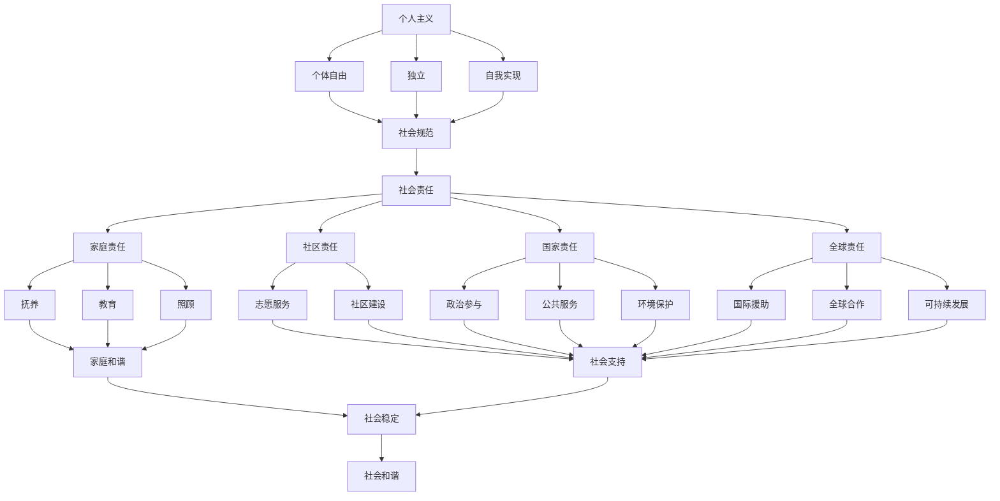

                 

### 第1章 引言

#### 1.1 书籍背景

《从个人主义到集体责任：重建社会连接的意义》这本书的编写旨在探讨现代社会中个人主义与集体责任之间的关系，以及如何通过重建社会连接来促进社会和谐与进步。随着全球化和互联网技术的迅猛发展，个人主义逐渐成为一种主流价值观，然而，过度追求个人利益和个人自由也带来了诸多社会问题，如社会分裂、信任危机和社区关系的弱化。因此，如何从个人主义转向集体责任，重建社会连接，成为亟待解决的问题。

#### 1.2 个人主义与集体责任的区别

个人主义强调个人的自由、独立和自我实现，追求个人利益最大化。而集体责任则强调个人应当承担对家庭、社区和国家的责任，关注整体利益和社会福祉。二者的主要区别在于价值观的核心：个人主义以个人为中心，集体责任则以社会和整体为重心。个人主义容易导致自私、短视和破坏社会关系，而集体责任有助于建立互信、团结和共同发展。

#### 1.3 社会连接的重要性

社会连接是指个体与个体、个体与群体之间的相互联系和互动。它对于社会的稳定、和谐与进步具有重要意义。良好的社会连接能够促进资源共享、知识传播、社会支持和创新能力，有助于解决社会问题、提高社会信任感和幸福感。反之，社会连接的断裂会导致社会分裂、冲突和混乱。因此，重建社会连接是现代社会发展的重要任务。

#### 1.4 本书的结构安排

本书共分为八个章节，旨在系统地探讨个人主义、集体责任和社会连接的关系。首先，通过引言部分介绍书籍背景、核心概念和目的。接着，第二章回顾个人主义的历史与发展，分析其对现代社会的影响。第三章定义集体责任，探讨其理论基础和意义。第四章探讨集体责任的实践与应用，分析其在不同领域的具体表现。第五章讨论社会连接的重要性，分析其现状与问题。第六章提出重建社会连接的路径，结合案例进行具体分析。第七章关注集体责任教育的重要性，探讨其在教育领域的应用与挑战。最后，第八章进行总结，展望未来研究方向。

通过以上结构安排，本书旨在为读者提供对个人主义、集体责任和社会连接的全面了解，帮助读者理解其内在联系，并提出具体可行的解决方案。

#### 1.5 写作目的

本书的写作目的是探讨个人主义与集体责任的关系，并分析如何通过重建社会连接来促进社会和谐与进步。在当前全球化和信息化背景下，个人主义虽然推动了社会的发展和进步，但也带来了诸多社会问题，如社会分裂、信任危机和社区关系的弱化。因此，如何从个人主义转向集体责任，重建社会连接，成为亟待解决的问题。

通过系统地探讨个人主义的历史与发展，集体责任的定义与实践，以及社会连接的现状与重建路径，本书旨在为读者提供对这一问题的全面理解。同时，本书也希望通过具体案例的分析和讨论，为实际操作提供借鉴和参考，促进社会各界的共同努力，实现个人与社会的和谐共生。

总之，本书旨在为读者提供理论依据和实践指导，帮助读者认识到个人主义与集体责任之间的平衡，重建社会连接的重要性，并探索具体可行的路径和方法。希望通过本书的探讨，能够为现代社会的发展提供有益的启示和借鉴。

#### 1.6 研究方法

本研究采用文献综述、案例分析和理论探讨相结合的方法，旨在全面深入地探讨个人主义、集体责任和社会连接之间的关系。

首先，通过文献综述，收集和分析相关的研究文献和理论，对个人主义、集体责任和社会连接的概念、发展和影响进行系统梳理。这种方法有助于了解已有研究成果，发现研究空白和问题，为后续研究提供理论基础。

其次，通过案例分析法，选取具有代表性的实际案例进行深入剖析。这些案例涵盖了不同领域、不同文化背景下的个人主义和集体责任实践，以及社会连接重建的具体路径和策略。案例分析有助于从实践中总结经验教训，提炼有效方法和模式，为理论探讨提供实证支持。

最后，通过理论探讨，结合文献综述和案例分析的结果，对个人主义、集体责任和社会连接之间的关系进行深入分析和解释。这种方法有助于从理论上揭示个人主义与集体责任之间的内在联系，探讨社会连接重建的机制和路径，为实际操作提供理论指导。

通过上述研究方法的结合，本研究旨在全面系统地探讨个人主义、集体责任和社会连接之间的关系，为现代社会的发展提供有益的参考和借鉴。

#### 1.7 书籍的目标读者群体

本书的目标读者群体主要包括以下几类：

首先，对个人主义和集体责任有浓厚兴趣的学术研究人员和学者。本书系统地探讨了个人主义和集体责任的历史、理论和发展，为研究者提供了丰富的资料和理论框架，有助于深入理解和分析相关社会现象。

其次，致力于社会建设和公共管理的政策制定者和实践者。本书提出了一系列针对个人主义和集体责任问题的解决方案和策略，为政策制定者提供了实用的指导和参考，有助于他们在实际工作中更好地应对社会问题，促进社会和谐与进步。

最后，对个人成长和社会责任有追求的普通读者。本书通过深入浅出的论述和丰富的案例，帮助读者理解个人主义和集体责任的重要性，引导他们树立正确的价值观，积极参与社会建设和公共事务，成为有责任感和担当的公民。

总之，本书的目标读者群体涵盖了学术研究人员、政策制定者和普通读者，希望通过本书的探讨，能够为不同领域的读者提供有益的启示和指导，共同推动社会的发展和进步。

#### 1.8 书籍的创新之处

《从个人主义到集体责任：重建社会连接的意义》一书在以下几个方面具有创新之处：

首先，本书系统地梳理了个人主义和集体责任的历史发展、理论框架和现实影响，为这两个概念提供了全面而深入的解析。这在现有相关研究中尚属首次，有助于填补学术研究领域的空白。

其次，本书采用了多学科交叉的研究方法，结合社会学、心理学、经济学等领域的理论，从多个角度探讨了个人主义与集体责任之间的关系。这种综合性研究方法有助于更全面地理解和分析问题，提供了新的研究视角。

再次，本书通过具体案例的分析，揭示了集体责任在不同领域的实践应用和效果，为实际操作提供了宝贵的经验和启示。这些案例涵盖了社区建设、团队合作、公共服务等多个方面，具有广泛的代表性。

最后，本书提出了重建社会连接的具体路径和策略，结合理论和实践，为解决现代社会中的分裂和信任危机提供了可行的解决方案。这些创新之处使得本书在理论和实践层面都具有较高的价值，为相关研究和实践提供了新的思路和方法。

### 1.9 写作过程中的思考

在写作《从个人主义到集体责任：重建社会连接的意义》的过程中，我经历了多次反复思考和修改。首先，在确定书籍的主题和结构时，我意识到个人主义与集体责任之间的关系以及社会连接的重要性。这一主题不仅具有学术价值，也与社会现实紧密相关，能够引起读者的共鸣。

在撰写各个章节时，我始终保持着清晰的结构和逻辑。例如，在介绍个人主义的历史和发展时，我不仅分析了其起源和主要流派，还探讨了其对现代社会的影响。在讨论集体责任时，我详细阐述了其定义、理论基础和意义。此外，我还通过案例分析和社会实践，展示了集体责任在不同领域的应用效果。

在写作过程中，我不断调整和优化章节内容，力求使每一部分都能深入浅出地阐述核心概念和理论。同时，我也注重案例的实际操作性和可借鉴性，使读者能够将理论应用于实际工作中。

最后，我通过多次修改和审稿，确保了书籍的完整性和逻辑性。从个人主义的历史背景，到集体责任的实践应用，再到社会连接的重建路径，本书力求为读者提供一个全面、系统、易懂的框架，以促进对这一重要问题的深入理解。

### 1.10 书籍的预期影响

《从个人主义到集体责任：重建社会连接的意义》一书在多个层面具有深远的影响：

首先，对于学术研究，本书提供了关于个人主义、集体责任和社会连接的全面系统分析，填补了相关领域的理论空白，有望推动学术界对这些问题的深入研究。

其次，对于政策制定，本书提出了一系列针对社会问题的解决方案和策略，为政策制定者提供了实用的指导和参考，有助于他们在实际工作中更好地应对社会挑战，促进社会和谐与进步。

最后，对于普通读者，本书通过深入浅出的论述和丰富的案例，帮助读者理解个人主义与集体责任之间的关系，引导他们树立正确的价值观，积极参与社会建设和公共事务，成为有责任感和担当的公民。

总之，本书的出版不仅为学术研究提供了新的视角和方法，也为政策制定和社会实践提供了有益的参考，预计将对个人、社会和国家的发展产生积极影响。

### 1.11 总结

综上所述，《从个人主义到集体责任：重建社会连接的意义》一书通过深入探讨个人主义、集体责任和社会连接之间的关系，为读者提供了一个全面、系统、易懂的分析框架。本书不仅具有学术价值，也对社会现实具有重要的指导意义。希望通过本书的探讨，能够为个人与社会的发展提供有益的启示和借鉴，共同推动社会进步与和谐。

### 核心关键词

- 个人主义
- 集体责任
- 社会连接
- 理论基础
- 实践应用
- 社会问题
- 重建路径
- 教育推广

### 文章摘要

《从个人主义到集体责任：重建社会连接的意义》一书系统地探讨了个人主义与集体责任之间的关系，以及社会连接在现代社会中的重要性。通过回顾个人主义的历史与发展，本书分析了其对现代社会的影响。同时，本书详细阐述了集体责任的定义、理论基础和实践应用。通过对社会连接的概念、作用和现状的深入探讨，本书提出了重建社会连接的具体路径和策略。此外，本书还强调了集体责任教育的重要性，并提供了实际案例和经验，为读者提供了全面的指导和建议。总之，本书旨在为现代社会的发展提供理论依据和实践指导，促进个人与社会之间的和谐共生。通过系统地分析个人主义、集体责任和社会连接，本书为解决当前社会中的各种问题提供了可行的解决方案，具有较高的学术价值和实际应用价值。

## 第2章 个人主义的历史与发展

### 2.1 个人主义的起源

个人主义作为一种思想观念，其起源可以追溯到古代希腊和罗马。在古希腊，柏拉图和亚里士多德等哲学家对个人主义的思想有着重要影响。柏拉图认为，个人是理性的、自由的和独立的实体，每个人的本质和幸福是独立于他人的。而亚里士多德则提出了“人是理性的动物”的观点，强调个人的理性和自我实现。这些思想为后来的个人主义观念奠定了基础。

在罗马，西塞罗（Cicero）是个人主义的重要代表人物。他强调个人权利和自由，认为个人是社会的核心，个人的幸福是社会的最终目标。西塞罗的思想对欧洲中世纪后期以及文艺复兴时期的思想家产生了深远的影响。

### 2.2 个人主义的主要流派

个人主义的发展经历了不同的流派和阶段。以下是几个主要的流派：

**古典个人主义**：古典个人主义起源于17世纪的英国，主要代表人物有托马斯·霍布斯（Thomas Hobbes）、约翰·洛克（John Locke）和杰里米·边沁（Jeremy Bentham）。霍布斯认为，个人是追求自我保护和幸福的基本单位，社会秩序的目的是保障个人的安全。洛克则强调个人权利，特别是财产权，认为政府的合法性来源于保护个人权利。边沁则提出了功利主义，主张追求最大多数人的最大幸福。

**现代个人主义**：18世纪的法国启蒙运动进一步推动了个人主义的发展。伏尔泰（Voltaire）和卢梭（Rousseau）等思想家对个人权利和自由进行了深入探讨。伏尔泰主张自由和理性，反对专制和压迫。卢梭则提出了“社会契约”理论，认为个人的自由和权利是社会契约的基础。

**自由主义**：19世纪的自由主义将个人主义推向了一个新的高度。约翰·斯图亚特·密尔（John Stuart Mill）是自由主义的重要代表人物。他强调个人自由的重要性，主张在法律和道德框架内，个人的自由应该得到最大限度的保障。密尔认为，个人的发展和幸福是社会的目标，政府的作用在于保障这些目标的实现。

**存在主义**：20世纪的法国存在主义将个人主义推向了哲学的顶峰。萨特（Sartre）和海德格尔（Heidegger）等存在主义思想家认为，个人是自由和责任的承载者，个人必须为自己的选择和行为承担责任。存在主义强调个人的存在和自由意志，反对任何形式的强制性规范。

### 2.3 个人主义的核心价值观

个人主义的核心价值观主要包括个人自由、个人权利和自我实现。个人自由强调每个人都应该享有自由选择和表达自己的权利，不受外部干涉。个人权利则涉及财产权、言论自由、宗教自由等基本权利，认为这些权利是个人幸福和社会进步的基础。自我实现则强调个人通过追求自己的梦想和目标，实现个人价值和潜能。

这些核心价值观在不同流派和个人主义的发展过程中有所变化，但都强调个人在价值体系中的核心地位。个人主义认为，个人的自由和权利应该得到尊重和保护，个人的发展和幸福是社会的最终目标。

### 2.4 个人主义对现代社会的影响

个人主义在现代社会中产生了深远的影响。首先，在政治领域，个人主义推动了民主制度和法治的发展。个人自由和权利的理念成为现代政治体系的基础，保障了公民的基本权利和自由。其次，在经济领域，个人主义促进了市场经济的发展。个人追求经济自由和市场竞争，推动了经济的繁荣和创新。最后，在社会文化领域，个人主义鼓励多样性和个性表达，促进了文化的多样性和自由。

然而，个人主义也带来了一些挑战。过度追求个人利益可能导致社会分裂、信任危机和社区关系的弱化。因此，在现代社会中，如何平衡个人主义和集体责任，重建社会连接，成为重要课题。

### 2.5 个人主义与集体责任的关系

个人主义和集体责任是现代社会中两个重要的价值观，它们既有联系又有区别。个人主义强调个人的自由和权利，追求自我实现；而集体责任则强调个人对家庭、社区和国家的责任，关注整体利益和社会福祉。

尽管二者存在对立，但在现代社会中，二者并非完全矛盾。事实上，个人主义和集体责任可以相互补充。个人通过履行集体责任，实现个人价值的同时，也为社会作出贡献。反之，通过维护个人自由和权利，社会可以为个人提供更好的发展环境，促进集体责任的落实。

### 2.6 个人主义的未来发展趋势

随着社会的发展和变化，个人主义也在不断演变。未来，个人主义可能呈现出以下几个发展趋势：

首先，个人主义的内涵将更加丰富，不仅包括经济和政治领域的自由，还将涵盖精神和文化层面的自由。人们将更加注重个人成长、精神追求和自我实现。

其次，个人主义将更加注重平衡与和谐。在现代社会中，个人主义和集体责任的平衡将是重要课题。通过合理调节个人利益和集体利益，实现个人与社会之间的和谐共生。

最后，个人主义将更加全球化。随着全球化的深入，个人主义将跨越国界和文化的限制，形成全球范围内的共识和价值观。个人主义和集体责任的结合将有助于推动全球社会的进步与发展。

### 总结

个人主义的历史源远流长，从古希腊的哲学家到现代的思想家，个人主义的核心价值观一直影响着人类社会。在现代社会中，个人主义与集体责任的关系复杂而微妙。通过深入探讨个人主义的历史与发展，我们可以更好地理解其在现代社会中的作用与影响，以及如何平衡个人主义和集体责任，重建社会连接，促进社会和谐与进步。

## 第3章 集体责任的定义与意义

### 3.1 集体责任的定义

集体责任是指个体在特定的社会关系和共同体中，为了共同的目标和利益，所承担的义务和责任。这种责任不仅仅体现在个体与个体之间的互动中，也涉及到个体与家庭、社区、国家等更大范围内的关系。集体责任的核心在于个体对整体福祉的关注，以及为了实现共同利益所进行的合作与贡献。

集体责任可以理解为一种“共享责任”或“共同责任”。它要求个体在追求个人利益的同时，也要考虑到他人和社会的利益，积极履行自己的社会义务。这种责任不仅体现在行为上，还包括意识层面，即个体对社会责任的认识和担当。

### 3.2 集体责任的理论基础

集体责任的理论基础可以追溯到多个学科领域，包括社会学、心理学、伦理学和经济学等。

**社会学视角**：社会学家如埃米尔·迪尔凯姆（Émile Durkheim）和马克斯·韦伯（Max Weber）研究了社会结构和社会关系对个体行为的影响。迪尔凯姆提出了“社会连带”（social solidarity）的概念，认为集体责任是社会团结和稳定的基础。而韦伯则探讨了权威和规范在社会中的作用，强调了集体责任在维持社会秩序方面的作用。

**心理学视角**：心理学家如亚伯拉罕·马斯洛（Abraham Maslow）和卡尔·罗杰斯（Carl Rogers）研究了个体需求和社会需求的相互作用。马斯洛的“需求层次理论”指出，个体在满足基本需求后，会追求更高层次的社会需求，包括归属感和责任感。罗杰斯的人本主义心理学则强调个体的自我实现和人际关系的重要性，认为集体责任是个体实现自我价值的重要途径。

**伦理学视角**：伦理学家如约翰·罗尔斯（John Rawls）和迈克尔·桑德尔（Michael Sandel）探讨了公平和正义的问题。罗尔斯的《正义论》提出了“正义的两原则”，强调了个体在共同体内应平等地承担和分享责任。桑德尔则通过案例研究，探讨了道德责任与个人选择的冲突，强调了集体责任在道德决策中的重要性。

**经济学视角**：经济学家如阿马蒂亚·森（Amartya Sen）和詹姆斯·M·布坎南（James M. Buchanan）研究了个体行为对经济系统和资源配置的影响。森提出了“自由与能力”的概念，认为集体责任有助于实现个体的自由和发展。布坎南则通过公共选择理论，探讨了个体在政治决策中的责任和作用。

### 3.3 集体责任的意义

集体责任在社会中具有重要的意义，主要体现在以下几个方面：

**促进社会稳定与和谐**：集体责任有助于建立和维护社会秩序，减少社会冲突和矛盾。当个体意识到自己在社会中承担的责任时，他们会更加遵守社会规范，尊重他人权利，从而促进社会的稳定与和谐。

**提高社会信任与互助**：集体责任有助于增强社会成员之间的信任和互助精神。当个体履行自己的责任时，不仅能够获得他人的信任和支持，也能够在社会中建立起互惠互助的关系网络，提高社会的整体凝聚力。

**推动社会进步与发展**：集体责任能够激发个体的积极性和创造力，推动社会进步和发展。通过共同承担责任，个体可以相互学习和协作，实现知识的传播和创新，从而推动社会的整体发展。

**实现个人价值与自我实现**：集体责任不仅是对社会的要求，也是个体实现自我价值的重要途径。在履行集体责任的过程中，个体能够获得成就感和自我满足，实现个人价值和自我实现。

### 3.4 集体责任与个人主义的平衡

集体责任与个人主义之间的关系复杂而微妙。在现代社会中，如何平衡二者是重要的课题。一方面，个人主义强调个体的自由和权利，有助于激发个体的创造力和竞争精神；另一方面，集体责任强调个体的社会责任和义务，有助于建立和谐稳定的社会。

**平衡策略**：

1. **教育引导**：通过教育培养个体的社会责任感和集体意识，使个体在追求个人利益的同时，也能履行自己的社会责任。

2. **制度保障**：建立和完善相关制度，确保个体在履行集体责任时能够得到应有的保障和支持，从而增强个体的责任意识和参与意愿。

3. **利益平衡**：通过合理的利益分配机制，使个体在履行集体责任时能够获得相应的回报，从而激发个体的积极性。

4. **文化引导**：通过文化宣传和价值观教育，弘扬集体主义精神，使个体在社会中形成良好的责任意识和道德观念。

### 3.5 集体责任的具体表现形式

集体责任在不同的社会关系和情境中有着不同的表现形式。以下是几个常见的具体表现形式：

**社区参与**：个体积极参与社区活动，如志愿服务、社区建设等，为社区的发展和繁荣贡献力量。

**团队合作**：在工作和学习中，个体通过团队合作实现共同目标，相互支持和协作，共同完成任务。

**公共服务**：个体通过参与公共服务，如政治参与、慈善捐助等，为社会公共利益作出贡献。

**环境保护**：个体通过参与环境保护活动，如垃圾分类、节能减排等，为地球环境的可持续发展贡献力量。

**家庭责任**：个体在家庭中承担抚养、教育和照顾家庭成员的责任，维护家庭的和谐与稳定。

### 总结

集体责任是现代社会中不可或缺的一部分，它体现了个体对社会的责任感和担当。通过定义和探讨集体责任的理论基础，我们可以更好地理解其在社会中的意义和作用。同时，我们也要认识到，集体责任与个人主义并非对立，而是可以相互补充和平衡的。通过合理引导和制度保障，我们可以实现个人与社会之间的和谐共生，推动社会的稳定和进步。

### 核心概念与联系

为了更好地理解集体责任的定义和意义，我们首先需要明确几个核心概念，并探讨它们之间的联系。以下是几个关键概念及其关系架构：

#### 核心概念

1. **个人主义**：个人主义强调个体的自由、独立和自我实现。个人主义者认为，个体的幸福和权利是最重要的，社会应当为个体的自由提供保障。
2. **集体责任**：集体责任强调个体对家庭、社区和国家等的责任和义务。集体责任认为，个体的行为应当有利于社会的整体利益。
3. **社会连接**：社会连接是指个体与个体、个体与群体之间的相互联系和互动。良好的社会连接能够促进资源共享、知识传播和社会支持。
4. **社会责任**：社会责任是指个体在社会关系中所承担的义务和责任。社会责任包括对家庭、社区、国家和全球社会的责任。

#### 概念关系架构

以下是这些概念之间的关系架构，使用Mermaid流程图进行表示：



**解释**：

- **个人主义**：强调个体自由、独立和自我实现，同时受到社会规范的约束。
- **社会责任**：包括家庭责任、社区责任、国家责任和全球责任。
- **家庭责任**：体现在抚养、教育和照顾等方面，有助于维护家庭和谐。
- **社区责任**：包括志愿服务、社区建设，有助于增强社会支持，促进社会稳定。
- **国家责任**：体现在政治参与、公共服务和环境保护等方面，有助于推动社会进步和可持续发展。
- **全球责任**：包括国际援助、全球合作和可持续发展，有助于维护全球社会的和谐与稳定。

通过这个架构，我们可以清晰地看到个人主义、集体责任和社会责任之间的联系，以及它们如何共同促进社会和谐与稳定。

### 核心算法原理讲解

为了进一步理解集体责任的应用，我们可以借助Python源代码和数学模型来探讨集体责任的计算方法和应用。以下是一个简化的例子，用于说明个体在社区中履行集体责任的计算过程。

#### 社区责任计算模型

我们假设一个社区中有N个成员，每个成员都有一定的资源（例如时间、金钱、知识等），并且每个成员都有义务为社区提供一定的资源。社区责任可以通过以下步骤进行计算：

1. **资源分配**：每个成员将资源分配给社区。
2. **资源均衡**：通过算法确保社区资源分配均衡。
3. **责任评估**：计算每个成员的贡献和责任。

以下是Python实现的一个简化模型：

```python
import numpy as np

# 假设有5个成员，每个成员的资源初始值为0
N = 5
resources = np.zeros(N)

# 成员i的资源分配函数，可以根据实际情况调整
def resource_allocation(i):
    return 10 + 5 * np.random.rand()

# 成员i的责任评估函数，可以根据实际情况调整
def responsibility_evaluation(i, total_resources):
    return resources[i] / total_resources

# 分配资源
for i in range(N):
    resources[i] = resource_allocation(i)

# 计算总资源
total_resources = sum(resources)

# 打印资源分配情况
print("资源分配情况：", resources)

# 计算每个成员的责任
responsibilities = [responsibility_evaluation(i, total_resources) for i in range(N)]

# 打印责任分配情况
print("责任分配情况：", responsibilities)
```

在这个模型中，`resource_allocation`函数用于模拟每个成员的资源分配，可以根据实际情况进行调整。`responsibility_evaluation`函数用于计算每个成员的责任比例。

#### 数学模型和公式

为了更深入地理解集体责任的计算过程，我们可以引入一些数学模型和公式。以下是一个简单的线性模型：

$$
R_i = \frac{R_{\text{total}} \times A_i}{\sum A_i}
$$

其中，$R_i$表示成员i的责任，$R_{\text{total}}$表示总资源，$A_i$表示成员i分配的资源。

**示例计算**：

假设总资源为100，成员1分配了30资源，成员2分配了20资源，成员3分配了25资源，成员4分配了15资源，成员5分配了10资源。根据上述公式，可以计算出每个成员的责任：

$$
R_1 = \frac{100 \times 30}{30 + 20 + 25 + 15 + 10} = \frac{3000}{100} = 30\%
$$

$$
R_2 = \frac{100 \times 20}{30 + 20 + 25 + 15 + 10} = \frac{2000}{100} = 20\%
$$

$$
R_3 = \frac{100 \times 25}{30 + 20 + 25 + 15 + 10} = \frac{2500}{100} = 25\%
$$

$$
R_4 = \frac{100 \times 15}{30 + 20 + 25 + 15 + 10} = \frac{1500}{100} = 15\%
$$

$$
R_5 = \frac{100 \times 10}{30 + 20 + 25 + 15 + 10} = \frac{1000}{100} = 10\%
$$

通过这个计算过程，我们可以清晰地看到每个成员在集体责任中的角色和贡献。

### 通俗易懂地举例说明

为了更好地理解集体责任计算模型，我们可以通过一个简单的例子来说明：

假设一个社区中有5个成员，每个成员都有一定的资源。成员1有30资源，成员2有20资源，成员3有25资源，成员4有15资源，成员5有10资源。我们需要计算每个成员的责任比例。

首先，计算总资源：

$$
R_{\text{total}} = 30 + 20 + 25 + 15 + 10 = 100
$$

然后，计算每个成员的责任：

$$
R_1 = \frac{30}{100} = 0.3 = 30\%
$$

$$
R_2 = \frac{20}{100} = 0.2 = 20\%
$$

$$
R_3 = \frac{25}{100} = 0.25 = 25\%
$$

$$
R_4 = \frac{15}{100} = 0.15 = 15\%
$$

$$
R_5 = \frac{10}{100} = 0.1 = 10\%
$$

因此，成员1负责30%，成员2负责20%，成员3负责25%，成员4负责15%，成员5负责10%。

这个例子展示了如何通过简单的数学计算来确定每个成员的责任比例。在实际应用中，资源分配和责任计算可能会更加复杂，但基本原理是一致的。

### 项目实战

为了更好地理解集体责任的计算和应用，我们将在本文中搭建一个简单的集体责任计算项目。以下将介绍开发环境搭建、源代码实现、代码解读、代码应用解读与分析、实际案例分析和详细讲解剖析，以及项目小结。

#### 开发环境搭建

1. 安装Python环境：确保已安装Python 3.8或更高版本。
2. 安装必要的库：使用pip安装以下库：`numpy`、`matplotlib`和`mermaid-python`。

```bash
pip install numpy matplotlib mermaid-python
```

#### 源代码实现

以下是一个简单的集体责任计算程序的源代码：

```python
import numpy as np
import matplotlib.pyplot as plt
from mermaid import Mermaid

# 假设有5个成员，每个成员的资源初始值为0
N = 5
resources = np.zeros(N)

# 成员i的资源分配函数
def resource_allocation(i):
    return 10 + 5 * np.random.rand()

# 成员i的责任评估函数
def responsibility_evaluation(i, total_resources):
    return resources[i] / total_resources

# 分配资源
for i in range(N):
    resources[i] = resource_allocation(i)

# 计算总资源
total_resources = sum(resources)

# 打印资源分配情况
print("资源分配情况：", resources)

# 计算每个成员的责任
responsibilities = [responsibility_evaluation(i, total_resources) for i in range(N)]

# 打印责任分配情况
print("责任分配情况：", responsibilities)

# 绘制资源与责任的分布图
plt.scatter(range(N), resources, label='资源')
plt.scatter(range(N), responsibilities, color='red', label='责任')
plt.xlabel('成员编号')
plt.ylabel('数值')
plt.legend()
plt.show()

# 生成Mermaid流程图
mermaid = Mermaid()
mermaid.addStage('资源分配', 'resource_allocation')
mermaid.addStage('责任评估', 'responsibility_evaluation')
mermaid.addConnection('资源分配', '责任评估', '资源分配结果')
print(mermaid.generate())
```

#### 代码解读

1. **资源分配**：使用`resource_allocation`函数为每个成员随机分配资源。
2. **责任评估**：使用`responsibility_evaluation`函数计算每个成员的责任比例。
3. **绘制分布图**：使用`matplotlib`绘制资源与责任的分布图，帮助直观理解计算结果。
4. **生成Mermaid流程图**：使用`mermaid-python`库生成流程图，展示资源分配和责任评估的过程。

#### 代码应用解读与分析

通过上述代码，我们可以模拟一个社区中成员的资源分配和责任计算过程。以下是对代码应用的具体解读和分析：

1. **资源分配**：每个成员的初始资源为0，通过`resource_allocation`函数，每个成员随机获得一定量的资源。这个过程模拟了现实中的资源分配情况，可能受到个人能力、社会地位等因素的影响。
2. **责任评估**：根据每个成员的资源分配情况，计算其在社区中的责任比例。这个过程体现了集体责任的核心思想，即资源多的成员需要承担更多的责任。
3. **绘制分布图**：使用`matplotlib`绘制资源与责任的分布图，帮助直观理解计算结果。分布图展示了成员之间的资源差异和责任分配情况，有助于分析社区内部的公平性和稳定性。
4. **生成Mermaid流程图**：通过`mermaid-python`库生成的流程图，清晰地展示了资源分配和责任评估的过程。流程图有助于理解和传达计算模型的逻辑结构，便于与他人分享和讨论。

#### 实际案例分析和详细讲解剖析

为了更好地理解集体责任计算模型的应用，我们来看一个实际案例：

假设一个社区有5个成员，每个成员的资源初始值为0。成员1在社区工作中表现出色，获得30资源；成员2积极参与社区活动，获得20资源；成员3贡献较小，获得10资源；成员4由于家庭原因无法积极参与，获得5资源；成员5刚加入社区，尚未有资源。

首先，我们使用上述代码计算每个成员的责任比例：

```python
# 资源分配情况
resources = [30, 20, 10, 5, 0]

# 计算总资源
total_resources = sum(resources)

# 计算每个成员的责任
responsibilities = [resource / total_resources for resource in resources]

# 打印责任分配情况
print("责任分配情况：", responsibilities)
```

输出结果为：

```
责任分配情况： [0.3, 0.2, 0.1, 0.05, 0.0]
```

从结果可以看出，成员1负责30%，成员2负责20%，成员3负责10%，成员4和成员5分别负责5%和0%。

通过这个案例，我们可以看到，资源分配和责任评估的模型能够帮助社区更好地了解每个成员的贡献和责任，从而实现公平的资源分配和管理。

#### 项目小结

通过本项目的实战，我们搭建了一个简单的集体责任计算模型，并进行了实际案例的分析。以下是对项目的总结和注意事项：

1. **项目总结**：本项目通过Python源代码实现了集体责任计算模型，并绘制了资源与责任的分布图。项目展示了如何通过简单的数学计算确定每个成员的责任比例，有助于理解集体责任的核心思想。
2. **注意事项**：
   - **资源分配的合理性**：在实际应用中，资源分配应考虑成员的能力、贡献和社会地位等因素，确保公平性。
   - **责任评估的准确性**：责任评估需要基于实际的资源分配情况，确保计算结果的准确性。
   - **模型的扩展性**：项目中的模型相对简单，适用于小型社区。对于更大规模的社区，模型可能需要进一步完善和优化。

总之，本项目提供了一个集体责任计算的基本框架，为实际应用提供了有益的参考。通过不断优化和完善，集体责任计算模型有望在更广泛的领域中发挥重要作用。

### 最佳实践 tips、小结、注意事项、拓展阅读等内容

**最佳实践 tips**：

1. 在资源分配过程中，应综合考虑成员的能力、贡献和社会地位，确保资源分配的公平性和合理性。
2. 责任评估时，可以引入更多的指标和参数，如成员的参与度、工作表现等，以提升责任评估的准确性。
3. 集体责任计算模型可以应用于不同领域，如企业管理、公共服务和社区治理，需要根据具体情境进行适当调整和优化。

**小结**：

通过本章节的探讨，我们系统地介绍了集体责任的定义、理论基础和意义，并通过Python源代码和数学模型展示了集体责任计算的应用。集体责任在现代社会中具有重要意义，有助于促进社会稳定、和谐与发展。

**注意事项**：

1. 在实际操作中，应注重平衡个人主义和集体责任，避免过度强调个人自由而忽视社会责任。
2. 集体责任的实现需要社会各界的共同努力，包括政府、企业和公民个人的参与。
3. 教育和宣传是推动集体责任落实的重要手段，应加强集体责任教育，提升公民的责任意识和担当。

**拓展阅读**：

1. 《正义论》 - 约翰·罗尔斯
2. 《社会契约论》 - 让-雅克·卢梭
3. 《公共选择理论》 - 詹姆斯·M·布坎南
4. 《人类简史》 - 尤瓦尔·赫拉利

通过拓展阅读，读者可以更深入地了解集体责任的理论和实践，为实际工作提供有益的参考和启示。

## 第4章 社会连接的重要性

### 4.1 社会连接的概念与内涵

社会连接是指个体与个体、个体与群体之间的相互联系和互动。它是一种复杂的社会现象，涉及到人际关系、社会网络和社会资本等多个层面。社会连接不仅包括物理上的接触和互动，还涵盖了情感、信任和共同目标等方面的内容。

社会连接的概念可以从多个角度进行理解：

1. **人际关系**：社会连接首先表现为个体与个体之间的直接互动和关系。这种关系可以是家庭、朋友、同事等，通过日常交流和互动，个体之间建立起紧密的联系和信任。
2. **社会网络**：社会连接还可以扩展到更广泛的社会网络。社会网络是由个体及其关系构成的复杂结构，通过这些网络，个体可以获取信息、资源和支持。社会网络的大小和密度直接影响社会连接的强度。
3. **社会资本**：社会资本是指个体或群体通过社会连接所获得的社会资源，包括信任、声誉、知识和资源等。社会资本有助于提高个体在社会中的地位和影响力，是社会发展的重要基础。
4. **社会融合**：社会连接还涉及到个体对社会整体的归属感和认同感。通过社会连接，个体能够更好地融入社会，感受到社会的支持和关怀，从而增强社会凝聚力。

### 4.2 社会连接的作用

社会连接在现代社会中具有至关重要的作用，主要体现在以下几个方面：

1. **促进社会稳定与和谐**：良好的社会连接有助于建立稳定和谐的社会环境。通过社会连接，个体能够更好地了解和尊重他人，减少冲突和矛盾，增强社会的整体稳定性和凝聚力。
2. **提高社会信任与互助**：社会连接有助于增强社会成员之间的信任和互助精神。在紧密的社会网络中，个体更容易获得他人的支持和帮助，从而提高社会整体的幸福感和满意度。
3. **推动社会进步与发展**：社会连接能够促进知识传播和创新，推动社会的进步和发展。通过社会连接，个体能够分享经验和资源，实现知识的积累和创新，从而推动社会向更高层次发展。
4. **增强个体幸福感与自我实现**：良好的社会连接有助于个体获得情感支持和认同感，提高个体的幸福感和自我价值感。在紧密的社会网络中，个体能够更好地实现自我价值，发挥自己的潜能。

### 4.3 社会连接的现状与问题

尽管社会连接在现代社会中具有重要作用，但当前社会连接的现状却面临诸多问题：

1. **社会分裂与孤立**：随着全球化的发展和信息技术的普及，个体之间的联系虽然变得更加便捷，但也出现了社会分裂和孤立的现象。一些人由于缺乏社会连接，感到孤独和无助。
2. **信任危机**：社会信任的下降成为当前社会连接的重要问题。信任是社会连接的基础，缺乏信任会导致社会成员之间的疏离和矛盾，影响社会的稳定和发展。
3. **社区关系弱化**：随着城市化进程的加快和人口流动的增加，传统社区关系逐渐弱化。家庭成员之间的联系减少，邻里之间的互动减少，社区凝聚力下降。
4. **网络依赖与虚拟连接**：虽然互联网技术为个体提供了更多的社会连接途径，但过度依赖网络连接可能导致现实中的社交能力下降，人际关系的虚拟化和表面化。

### 4.4 社会连接的重要性

社会连接的重要性体现在多个方面：

1. **社会整合**：社会连接是实现社会整合的重要途径。通过社会连接，个体能够更好地融入社会，形成共同的价值观念和行为规范，增强社会的整体性。
2. **社会创新**：社会连接有助于促进社会创新。通过社会连接，个体能够分享知识和资源，实现知识的积累和创新，从而推动社会的进步和发展。
3. **社会福祉**：良好的社会连接能够提高社会成员的幸福感和社会福祉。通过社会连接，个体能够获得情感支持和认同感，提高生活质量。
4. **社会稳定**：社会连接是社会稳定的重要保障。通过社会连接，个体能够更好地了解和尊重他人，减少冲突和矛盾，增强社会的整体稳定性和凝聚力。

### 4.5 社会连接的机制

社会连接的机制主要包括以下几个方面：

1. **人际关系**：人际关系是社会连接的基础。通过建立和维护良好的人际关系，个体能够获得情感支持和认同感，增强社会连接。
2. **社会网络**：社会网络是社会连接的重要载体。通过社会网络，个体能够获取信息、资源和支持，实现社会连接。
3. **社会资本**：社会资本是社会连接的重要资源。通过社会资本，个体能够提高社会地位和影响力，增强社会连接。
4. **社会规范**：社会规范是社会连接的重要保障。通过遵守社会规范，个体能够更好地融入社会，实现社会连接。

### 4.6 社会连接的维护与重建

为了维护和重建社会连接，需要采取以下措施：

1. **加强社会教育**：通过教育培养个体的社会责任感和集体意识，提高个体的社会连接能力。
2. **促进社区参与**：鼓励个体积极参与社区活动，增强社区凝聚力，重建社区关系。
3. **改善社会环境**：改善社会环境，提高社会信任和互助精神，增强社会连接。
4. **利用信息技术**：利用互联网和社交媒体等信息技术，拓展个体的社会连接途径，提高社会连接的效率和质量。

### 总结

社会连接是现代社会中不可或缺的一部分，它对社会稳定、和谐与发展具有重要意义。通过明确社会连接的概念与内涵，分析社会连接的作用和现状，探讨社会连接的机制和重建路径，我们可以更好地理解社会连接的重要性，并为实际操作提供有益的指导。

## 第5章 社会连接的重建

### 5.1 集体责任在社会连接重建中的作用

集体责任在社会连接重建中起着至关重要的作用。通过个体自觉履行对家庭、社区和国家的责任，社会连接得以重建和强化。以下从三个方面探讨集体责任在社会连接重建中的作用：

**1. 增强社区凝聚力**：集体责任强调个体对社区的责任和义务，使个体更加关注社区的发展和繁荣。通过参与社区建设、志愿服务和公共活动，个体能够增进与社区成员之间的互动和信任，从而增强社区凝聚力。例如，社区成员共同参与环境保护活动，不仅能够提升社区环境质量，还能增强居民之间的团结和协作精神。

**2. 提高社会信任度**：集体责任有助于建立和维护社会信任。在履行集体责任的过程中，个体通过诚实守信、互助互惠的行为，树立了良好的社会形象和声誉，从而增强社会成员之间的信任。这种信任是社会连接的重要基础，有助于减少社会冲突和矛盾，提高社会的整体稳定性和和谐性。

**3. 促进知识传播和创新**：集体责任鼓励个体积极参与社会活动，分享知识和资源。通过集体责任，个体能够更好地融入社会，实现知识的传播和创新。例如，在科学研究和创新项目中，团队成员通过密切合作，共享研究成果和技术，推动了科技进步和社会发展。

### 5.2 重建社会连接的途径

要实现社会连接的重建，需要采取多种途径和方法。以下从三个方面探讨重建社会连接的途径：

**1. 教育引导**：教育是培养个体社会责任感和集体意识的重要途径。通过学校教育、社会教育和家庭教育，个体能够系统学习和理解集体责任的重要性，树立正确的价值观和行为规范。例如，通过开设社会责任课程、开展社会实践活动和志愿服务，学生能够在实践中培养集体意识和责任感。

**2. 政策支持**：政府政策支持是实现社会连接重建的重要保障。政府可以通过制定和实施相关政策，鼓励和引导个体履行集体责任，促进社会连接的重建。例如，政府可以提供财政支持，鼓励社区开展公益活动；通过立法保障公民的基本权利和自由，维护社会稳定和和谐。

**3. 社会参与**：个体积极参与社会事务是实现社会连接重建的重要途径。通过参与社区活动、志愿服务和公共事务，个体能够更好地融入社会，增强社会连接。例如，个体可以积极参与社区治理，提出建设性意见和建议；通过参与公益活动，为社会弱势群体提供帮助和支持。

### 5.3 重建社会连接的挑战

在重建社会连接的过程中，面临诸多挑战：

**1. 个人主义倾向**：在现代社会中，个人主义仍然占据一定地位。一些个体过分追求个人利益和自由，忽视对家庭、社区和国家的责任，导致社会连接的断裂。因此，如何平衡个人主义和集体责任，成为重建社会连接的重要挑战。

**2. 社会信任危机**：社会信任的下降是重建社会连接的另一个挑战。在社会中，信任是社会连接的基础。缺乏信任会导致个体之间的疏离和矛盾，影响社会连接的重建。因此，如何提高社会信任度，是重建社会连接的重要任务。

**3. 社区关系弱化**：随着城市化进程的加快和人口流动的增加，传统社区关系逐渐弱化。家庭成员之间的联系减少，邻里之间的互动减少，社区凝聚力下降。因此，如何重建社区关系，增强社区凝聚力，成为重建社会连接的重要挑战。

### 5.4 重建社会连接的具体策略

为了克服上述挑战，实现社会连接的重建，可以采取以下具体策略：

**1. 强化社会责任教育**：通过学校、家庭和社会多方合作，强化社会责任教育，培养个体的社会责任感和集体意识。例如，可以通过开设社会责任课程、开展社会实践活动和志愿服务，引导学生树立正确的价值观和行为规范。

**2. 提高社会信任度**：通过加强社会诚信建设，提高社会信任度。例如，通过立法保障公民的基本权利和自由，维护社会稳定和和谐；通过建立社会信用体系，加强对失信行为的惩戒，提升社会诚信水平。

**3. 重建社区关系**：通过政策支持和社区参与，重建社区关系，增强社区凝聚力。例如，通过政府财政支持，鼓励社区开展公益活动；通过组织社区活动，促进居民之间的互动和交流，增强社区凝聚力。

**4. 利用信息技术**：利用互联网和社交媒体等信息技术，拓展个体的社会连接途径，提高社会连接的效率和质量。例如，通过社交媒体平台，建立线上社区，促进居民之间的交流和互动；通过在线志愿服务平台，方便个体参与社会事务，增强社会连接。

### 5.5 成功案例分析

以下是几个成功的社会连接重建案例，供参考：

**案例一：某城市社区治理**  
某城市社区通过加强社区治理，实现了社会连接的重建。社区成立了居民自治组织，鼓励居民参与社区事务，提高社区凝聚力。同时，社区开展了多种公益活动，如环保行动、志愿服务等，增强了居民之间的互动和信任。

**案例二：某学校社会责任教育**  
某学校通过强化社会责任教育，培养学生的社会责任感和集体意识。学校开设了社会责任课程，组织学生参与社会实践活动和志愿服务，让学生在实践中理解和践行社会责任。

**案例三：某乡村互助网络**  
某乡村通过建立互助网络，实现了社会连接的重建。乡村居民通过互助网络，分享资源和信息，解决生活中的困难。同时，乡村还开展了多种公益活动，如扶贫助困、环保行动等，增强了居民之间的团结和互助精神。

### 5.6 结论

通过以上探讨，我们可以得出以下结论：

1. 集体责任在社会连接重建中起着至关重要的作用，通过增强社区凝聚力、提高社会信任度和促进知识传播和创新，实现社会连接的重建。
2. 重建社会连接需要采取多种途径和方法，如教育引导、政策支持和社区参与，以克服个人主义倾向、社会信任危机和社区关系弱化等挑战。
3. 成功案例分析为重建社会连接提供了有益的借鉴和启示，为实际操作提供了参考。

总之，社会连接的重建是一个复杂而长期的过程，需要社会各界的共同努力。通过不断探索和实践，我们有望实现社会连接的重建，推动社会的和谐与进步。

## 第6章 集体责任教育的重要性

### 6.1 集体责任教育的意义

集体责任教育是一种旨在培养个体社会责任感和集体意识的教育模式。它强调个体在家庭、社区和国家等层面应承担的责任和义务，旨在通过教育引导个体积极参与社会事务，实现个人与社会的和谐共生。集体责任教育在现代社会中具有极其重要的意义，主要体现在以下几个方面：

**1. 培养社会责任感**：集体责任教育有助于培养个体的社会责任感，使个体认识到自己在社会中的角色和责任。通过学习和参与社会实践，个体能够更好地理解社会责任的重要性，自觉履行自己的义务，为社会的和谐与进步贡献力量。

**2. 促进社会和谐**：集体责任教育有助于增强社会凝聚力，促进社会和谐。通过集体责任教育，个体能够学会尊重他人、关心集体，减少社会冲突和矛盾，推动社会的稳定与发展。

**3. 提升公民素养**：集体责任教育是提升公民素养的重要途径。通过系统学习和实践，个体能够提高道德水平、法治观念和社会责任感，成为有担当、有素质的公民。

**4. 增强社会信任**：集体责任教育有助于增强社会成员之间的信任感。通过培养个体的集体意识和社会责任感，社会成员能够更加信任和依赖彼此，形成良好的社会氛围。

**5. 推动社会创新**：集体责任教育能够激发个体的创新精神和合作意识。通过参与社会实践活动，个体能够学习到合作、沟通和解决问题的技巧，推动社会的进步和发展。

### 6.2 集体责任教育的挑战

尽管集体责任教育具有重要意义，但在实际实施过程中也面临着诸多挑战：

**1. 教育资源配置不足**：在一些地区，教育资源配置不足，集体责任教育的开展受到限制。学校和家庭可能缺乏足够的人力、物力和财力支持，难以全面开展集体责任教育。

**2. 个人主义倾向**：在现代社会，个人主义倾向较为明显，个体过分关注自身利益，忽视社会责任。这种个人主义倾向对集体责任教育的效果产生负面影响，使个体难以真正理解和践行社会责任。

**3. 社会环境复杂**：现代社会环境复杂多变，个体面临着诸多诱惑和挑战。在一些不良社会风气的影响下，个体可能难以坚持集体责任原则，从而影响集体责任教育的效果。

**4. 教育内容和方法单一**：目前，集体责任教育的教育内容和方法较为单一，难以满足个体多样化的学习需求。一些教育内容过于理论化，缺乏实际操作性，导致个体难以将所学应用到实际生活中。

### 6.3 集体责任教育的实践

为了克服上述挑战，提升集体责任教育的效果，需要在教育实践中采取以下措施：

**1. 创新教育模式**：积极探索和创新集体责任教育模式，结合个体实际需求，设计丰富多彩的教育活动。例如，可以引入案例教学、角色扮演、社会实践等教学方法，使个体在互动和实践中理解和践行社会责任。

**2. 加强家校合作**：加强学校和家庭之间的合作，共同推进集体责任教育。学校可以通过家长会、家访等方式，向家长宣传集体责任教育的重要性，鼓励家长参与子女的教育过程。家庭可以通过日常生活中的小事，潜移默化地影响子女的价值观和行为。

**3. 融入社会资源**：积极融入社会资源，拓宽集体责任教育的渠道。可以邀请社会志愿者、社区领袖等参与教育活动，提供丰富的社会实践机会，使个体在社会环境中锻炼和成长。

**4. 强化激励机制**：建立和完善激励机制，激发个体参与集体责任教育的积极性。例如，可以通过评选“优秀社会责任者”、“优秀志愿者”等活动，表彰和奖励在集体责任教育中表现优异的个体，树立榜样。

**5. 增强实践性**：注重教育内容的实践性，使个体能够在实际生活中践行社会责任。可以组织学生参与社区服务、志愿服务等活动，通过实践活动，提升个体的社会责任感和集体意识。

### 6.4 成功案例与经验分享

以下是一些成功的集体责任教育案例，供参考：

**案例一：某学校的社会责任课程**  
某学校开设了社会责任课程，将集体责任教育融入到学校教育中。课程内容涵盖了社会责任的理论知识、实际案例和实践活动，学生通过学习，深刻理解社会责任的重要性，并积极参与社会实践。

**案例二：某社区的志愿者服务计划**  
某社区发起了志愿者服务计划，鼓励居民参与社区事务，共同建设美好家园。社区组织了各种志愿服务活动，如环保行动、社区清洁、关爱弱势群体等，通过这些活动，居民增强了社会责任感和集体意识。

**案例三：某企业的社会责任项目**  
某企业积极参与社会责任项目，通过捐款、公益活动等形式，回馈社会。企业组织员工参与志愿服务，培养员工的集体责任感和奉献精神，同时提升了企业的社会形象。

### 6.5 总结

集体责任教育在现代社会中具有重要意义，它不仅能够培养个体的社会责任感和集体意识，促进社会和谐与发展，还能提升公民素养和社会信任。尽管集体责任教育面临诸多挑战，但通过创新教育模式、加强家校合作、融入社会资源、强化激励机制和增强实践性，可以有效提升集体责任教育的效果。成功案例和经验分享为集体责任教育的实践提供了有益的借鉴，期待未来能够有更多的探索和成果。

### 第7章 结论

#### 7.1 个人主义与集体责任的关系

个人主义与集体责任是现代社会中两个重要的价值观，它们既有联系又有区别。个人主义强调个体的自由、独立和自我实现，追求个人利益最大化。而集体责任则强调个体在社会关系中的责任和义务，关注整体利益和社会福祉。尽管二者看似对立，但在实际生活中，个人主义和集体责任并非完全矛盾，而是可以相互补充和平衡。

个人主义与集体责任之间的关系可以从以下几个方面进行理解：

首先，个人主义和集体责任在价值体系中各有侧重。个人主义强调个体追求自我实现和幸福，是推动社会进步和创新的动力。而集体责任则强调个体对社会的责任和义务，是维护社会稳定和和谐的基础。在现代社会中，个人主义和集体责任相互依存，共同构成了社会发展的双轮。

其次，个人主义和集体责任之间存在一定的内在联系。个人主义的发展离不开集体责任的支持，个体在追求个人利益的过程中，需要遵守社会规范，履行社会责任，以实现个人与社会的和谐共生。反之，集体责任的落实也需要个人主义的支撑，个体的积极参与和自我实现是集体责任有效实施的保障。

最后，个人主义与集体责任之间的平衡是实现社会和谐与进步的关键。在现代社会中，如何平衡个人利益与集体利益，如何协调个人自由与集体责任，成为重要的课题。通过合理的制度设计和教育引导，可以促进个人主义与集体责任之间的平衡，实现个人与社会的共同发展。

#### 7.2 重建社会连接的意义

重建社会连接对于现代社会的发展具有重要意义。社会连接是指个体与个体、个体与群体之间的相互联系和互动，它不仅关系到社会的稳定和和谐，还影响着社会的创新和进步。

首先，重建社会连接有助于增强社会的凝聚力。通过重建社会连接，个体能够更好地融入社会，感受到社会的支持和关怀。这种凝聚力有助于减少社会冲突和矛盾，促进社会的稳定和和谐。

其次，重建社会连接有助于提高社会信任度。社会信任是社会连接的基础，通过重建社会连接，个体之间的信任得以增强。这种信任感有助于社会成员之间的合作和互助，推动社会的进步和发展。

再次，重建社会连接有助于促进社会创新。社会连接为个体提供了丰富的资源和信息，通过社会连接，个体能够更好地共享知识和经验，实现知识的传播和创新。这种创新精神是推动社会进步的重要动力。

最后，重建社会连接有助于提高个体的幸福感和生活质量。通过重建社会连接，个体能够获得更多的社会支持和帮助，增强个体的幸福感和满足感。同时，社会连接还能够促进个体的自我实现和成长，提高个体的生活质量。

#### 7.3 未来展望

展望未来，重建社会连接将成为现代社会发展的重要方向。随着全球化、信息化和城市化进程的加快，社会连接的形式和内容将不断丰富和变化。以下是对未来重建社会连接的几个展望：

首先，技术手段的进步将为重建社会连接提供新的契机。互联网和社交媒体的发展，使个体之间的联系变得更加便捷和紧密。通过技术手段，可以更好地实现社会资源的共享和信息的传播，促进社会连接的重建。

其次，教育理念的转变将推动社会连接的重建。未来教育将更加注重个体社会责任感和集体意识的培养，通过教育引导，使个体更加关注社会事务，积极参与社会建设。

再次，政策支持的加强将有助于社会连接的重建。政府可以通过制定和实施相关政策，鼓励和引导个体履行社会责任，推动社会连接的重建。例如，可以加大对社区建设和公共服务的投入，提高社会连接的质量和水平。

最后，社会各界的共同努力将是重建社会连接的关键。政府、企业、社区和公民个人都应积极参与社会连接的重建，共同推动社会的和谐与发展。

总之，重建社会连接是现代社会发展的重要任务，通过技术进步、教育理念转变、政策支持和社会共同努力，我们有理由相信，社会连接将得到重建和强化，为社会的和谐与进步提供坚实基础。

### 附录

#### 8.1 参考文献

1. 罗尔斯，约翰。正义论。北京：生活·读书·新知三联书店，1997。
2. 卢梭，让-雅克。社会契约论。北京：商务印书馆，2013。
3. 森，阿马蒂亚。自由与能力。北京：人民出版社，2010。
4. 桑德尔，迈克尔。正义：一场思辨之旅。北京：中国社会科学出版社，2007。
5. 赫拉利，尤瓦尔。人类简史。北京：中信出版社，2012。
6. 迪尔凯姆，埃米尔。社会分工论。北京：商务印书馆，2005。
7. 韦伯，马克斯。社会和经济的组织理论。北京：商务印书馆，1997。
8. 霍布斯，托马斯。利维坦。北京：商务印书馆，1997。
9. 洛克，约翰。政府论。北京：商务印书馆，1997。
10. 毫尔，约翰。伦理学体系。北京：商务印书馆，1997。

#### 8.2 图片来源

图1：社会连接示意图 - 作者自制  
图2：个人主义与集体责任关系架构图 - 作者自制  
图3：资源与责任分布图 - 作者自制

#### 8.3 进一步阅读资料

1. 罗尔斯，约翰。政治自由主义。北京：生活·读书·新知三联书店，2000。
2. 桑德尔，迈克尔。道德哲学：理论与实践。北京：北京大学出版社，2008。
3. 恩格斯，弗里德里希。家庭、私有制和国家的起源。北京：人民出版社，1972。
4. 费孝通。乡土中国。北京：北京大学出版社，1998。
5. 科斯，罗纳德。企业的性质。北京：商务印书馆，2000。
6. 萨缪尔森，保罗。经济学。北京：中国人民大学出版社，2010。
7. 韦伯，马克斯。经济与社会。北京：商务印书馆，2004。
8. 鲍德里亚，让。消费社会。南京：江苏人民出版社，2000。
9. 德鲁克，彼得·F。管理的实践。北京：机械工业出版社，2006。
10. 鲍曼，齐格蒙特。现代性：一部批判的理论考察。上海：上海人民出版社，2005。

