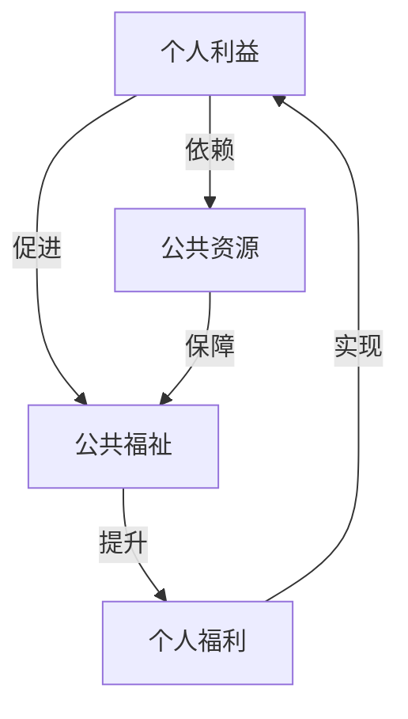
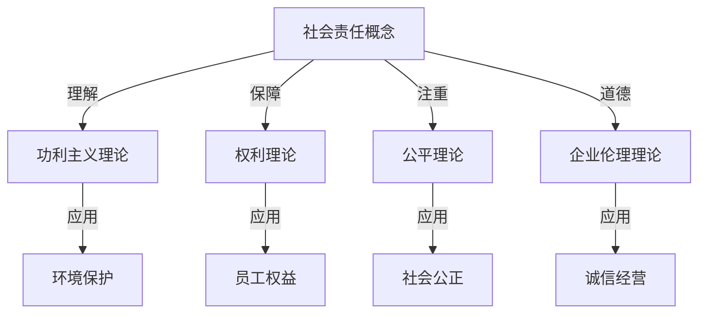

                 

### 《从个人利益到公共福祉：重新思考社会责任》

**关键词**：社会责任、个人利益、公共福祉、企业社会责任（CSR）、可持续发展

**摘要**：
在当今快速发展的社会中，个人利益与公共福祉之间的平衡成为了一个重要的议题。本文旨在探讨从个人利益到公共福祉的转变过程，以及这一转变对社会和企业的深远影响。通过分析个人利益与公共福祉的概念及其关联，探讨社会责任的理论基础，并引用实际案例，本文提出了实现个人利益与公共福祉平衡的具体路径，为个人和企业提供了有益的启示。

----------------------------------------------------------------

### 第1章 引言

#### 1.1 书籍背景

在全球化进程加快、科技迅猛发展的时代，个人和企业都在追求经济利益的同时，逐渐认识到社会责任的重要性。传统上，个人利益往往被视为至高无上的追求，然而，随着社会问题的加剧，如环境破坏、资源枯竭和社会不公，人们开始重新思考个人利益与公共福祉之间的关系。

本书旨在深入探讨这一重要议题，通过对社会责任概念的剖析，结合实际案例，旨在提出一种新的视角，帮助个人和企业更好地平衡个人利益与公共福祉。本文首先介绍了社会责任的概念及其重要性，然后探讨了个人利益与公共福祉的关联，为后续章节的分析奠定了基础。

#### 1.2 社会责任的重要性

社会责任（Social Responsibility）指的是个人或组织在追求经济利益的同时，对环境、社会和利益相关者的福祉承担的义务。社会责任不仅涉及企业的经营行为，还涵盖个人在社会中的行为和决策。

对于企业来说，社会责任有助于提升品牌形象、增强企业竞争力，并实现长期可持续发展。对于个人来说，社会责任则意味着在追求个人利益的同时，考虑到自身行为对社会的潜在影响，积极参与社会公益活动，为社会做出贡献。

在全球化和信息技术迅速发展的背景下，社会责任已经成为衡量个人和企业道德水平的重要标准。企业社会责任（Corporate Social Responsibility，简称CSR）已经成为企业管理的重要组成部分，个人社会责任也越来越受到关注。

#### 1.3 本书的目的和结构

本书的目的在于重新思考社会责任，探讨如何从个人利益出发，实现向公共福祉的转变。通过系统分析社会责任的理论基础、实际案例和实现路径，本书旨在为读者提供以下方面的启示：

1. **理解社会责任的概念及其重要性**：帮助读者深入理解社会责任的定义、内涵和重要性。
2. **探讨个人利益与公共福祉的关系**：分析个人利益与公共福祉之间的内在联系，探讨如何实现二者的平衡。
3. **提供实现社会责任的具体路径**：通过实际案例和理论分析，为个人和企业提供实现社会责任的具体方法和策略。
4. **反思社会责任的实践和挑战**：讨论社会责任实践中可能遇到的挑战，并提出相应的解决策略。

全书分为八个章节，结构如下：

- **第1章 引言**：介绍书籍背景、社会责任的重要性以及本书的目的和结构。
- **第2章 个人利益与公共福祉的概念**：详细阐述个人利益和公共福祉的定义及其关联。
- **第3章 社会责任的理论基础**：探讨社会责任的理论框架及其在企业和社会中的体现。
- **第4章 个人利益到公共福祉的转变过程**：分析从个人利益到社会责任意识觉醒的过程和个体行为的转变。
- **第5章 企业社会责任实践案例**：通过实际案例展示企业如何实践社会责任。
- **第6章 个人行为对社会的影响**：探讨个人消费、工作和志愿行为对社会福祉的贡献。
- **第7章 公共福祉的实现路径**：讨论实现公共福祉的政策、社会参与和教育意识提升等路径。
- **第8章 未来展望与挑战**：分析社会责任的发展趋势、个人利益与公共福祉的平衡以及面临的挑战和解决策略。
- **第9章 结论**：总结社会责任的现实意义，提出对个人和企业的启示。

通过以上章节的深入探讨，本书旨在为读者提供一种新的视角，帮助读者在追求个人利益的同时，更好地考虑公共福祉，实现个人与社会的和谐发展。

### 第2章 个人利益与公共福祉的概念

在讨论社会责任之前，我们需要首先明确个人利益和公共福祉的定义及其关系。个人利益通常指的是个人为了满足自身需求、实现个人目标和获得个人收益而追求的利益。而公共福祉则是指整个社会或群体共同享有的福利和利益，包括社会稳定、环境保护、资源合理利用和社会公正等方面。

#### 2.1 个人利益的理解

个人利益是经济学中的一个核心概念，它反映了个体在市场经济中的行为决策。在个人利益驱动下，人们会根据自身资源、能力和偏好，选择最有利于实现自身目标的行动。例如，一个企业在追求利润最大化的同时，也会考虑到市场需求、成本控制和管理效率等因素。

个人利益不仅体现在经济层面，还包括个人成长、健康、安全和幸福感等各个方面。在现代社会中，个人利益与个人权利、自由和尊严紧密相连，是社会发展的基础。然而，过度追求个人利益可能会导致资源浪费、环境破坏和社会不公等问题。

#### 2.2 公共福祉的内涵

公共福祉则是指为了满足社会公共利益而提供的基本服务和社会保障。这些服务包括教育、医疗、住房、交通、环境治理等。公共福祉的实现有助于提升社会整体福利水平，促进社会和谐与稳定。例如，良好的教育系统可以培养出有知识、有能力的社会成员，而健全的医疗体系则能保障人民的健康。

公共福祉不仅由政府提供，还包括非政府组织、社区和私人部门的共同参与。在全球化和信息技术快速发展的背景下，公共福祉的重要性日益凸显。例如，环境保护成为全球共同关注的议题，而数字经济的发展也对公共福祉产生了深远的影响。

#### 2.3 个人利益与公共福祉的关联

个人利益与公共福祉之间存在密切的关联。首先，个人利益和公共福祉在一定程度上是相互依赖的。个人的经济繁荣和社会地位的提升有助于公共福祉的实现，而公共福祉的改善也能为个人提供更好的生活条件和机会。

其次，个人利益和公共福祉之间存在一定的矛盾和冲突。例如，个人追求短期经济利益可能会导致环境污染和社会不公，而公共福祉的维护则需要长期的投入和牺牲。如何在个人利益和公共福祉之间找到平衡点，成为现代社会面临的一个重大挑战。

为了更好地理解个人利益与公共福祉的关系，我们可以通过一个简单的图示来展示它们之间的相互作用。下图使用Mermaid流程图来表示：

在这个流程图中，个人利益（A）和公共福祉（B）通过促进、依赖和提升等关系相互关联。公共资源（C）保障了公共福祉（B），而公共福祉（B）的提升又有利于个人福利（D）的实现。这种相互促进的关系表明，个人利益与公共福祉并非完全对立，而是可以在一定条件下实现平衡和统一。

总之，理解个人利益与公共福祉的概念及其关联，有助于我们更好地把握社会责任的本质，并在追求个人利益的同时，积极考虑公共福祉，实现个人与社会的和谐发展。

#### 第3章 社会责任的理论基础

社会责任（Social Responsibility，简称SR）是一个涉及个人、企业和政府等多方面利益的概念。其理论基础源于对个体行为对社会和环境影响的深刻认识。在本章节中，我们将深入探讨社会责任的概念及其历史与发展，并构建一个理论框架，以帮助读者更好地理解社会责任在企业和社会中的实际应用。

#### 3.1 社会责任的概念

社会责任是指个人、组织或企业基于道德、法律和社会期望，在追求自身经济利益的同时，对环境、社会和利益相关者承担的义务。社会责任不仅仅是一种道德约束，更是一种战略选择，通过负责任的经营行为，企业可以提升品牌形象、增强竞争力，实现长期可持续发展。

社会责任的内涵十分丰富，包括环境保护、公益慈善、员工福利、社区参与等多个方面。在个人层面，社会责任表现为个人的行为规范和道德选择；在企业层面，社会责任则体现在企业的经营理念、管理决策和实际行动中。

#### 3.2 企业社会责任（CSR）的历史与发展

企业社会责任（Corporate Social Responsibility，简称CSR）是一个相对较新的概念，其发展历程可以追溯到20世纪初。早期的CSR主要集中在企业对员工的关爱和对社区的回馈，如提供良好的工作环境、参与社区活动等。

随着社会问题的日益复杂和多样化，CSR的内涵不断丰富和扩展。20世纪80年代以来，可持续发展理念逐渐被引入企业社会责任，企业开始更加关注环境保护、资源利用和社会公正等问题。这一时期，联合国等国际组织也发布了多个关于企业社会责任的指导文件，推动了全球范围内CSR的发展。

在中国，企业社会责任的发展同样经历了多个阶段。从初期的慈善捐赠到后来的社会责任报告发布，再到如今的可持续发展战略，企业社会责任已经逐渐成为企业管理的重要组成部分。

#### 3.3 社会责任的理论框架

社会责任的理论框架为理解和实施社会责任提供了系统的方法和指导。以下是几种主要的社会责任理论框架：

1. **功利主义理论**：功利主义理论主张，社会责任的实现应该最大化社会总福利。企业应通过其经营活动，提高社会福利水平，实现经济效益和社会效益的双赢。

   公式表示：\[ \text{社会责任贡献} = \text{社会总福利} - \text{企业成本} \]

   例如，一个企业在生产过程中，通过采用环保技术和减少废弃物排放，不仅降低了环境成本，还提升了企业形象，实现了社会责任。

2. **权利理论**：权利理论强调，企业在享受社会资源和政策支持的同时，有义务保障社会成员的基本权利。这包括员工的权利、消费者的权利和社会环境权利等。

   公式表示：\[ \text{社会责任贡献} = \text{保障权利} - \text{侵害权利} \]

   例如，企业应确保员工享有公平的工资、良好的工作环境和职业发展机会，同时避免侵害消费者的权益，如提供真实的产品信息和合规的产品质量。

3. **公平理论**：公平理论认为，社会责任的实现应注重公平，消除社会不公。企业应通过公平的分配机制，使社会资源和财富更加均衡地分配。

   公式表示：\[ \text{社会责任贡献} = \text{公平分配} - \text{不公平分配} \]

   例如，企业可以通过税收、公益捐赠等方式，支持社会公益事业，减少贫富差距，促进社会公平。

4. **企业伦理理论**：企业伦理理论强调，企业应在道德伦理的指导下，做出正确的决策和行动。社会责任不仅是企业的法定义务，更是一种道德责任。

   公式表示：\[ \text{社会责任贡献} = \text{道德准则} - \text{道德违规} \]

   例如，企业应遵守相关法律法规，不仅做到合法经营，还要积极践行道德规范，如诚信、公正、尊重他人等。

通过这些理论框架，企业可以更系统地理解和实施社会责任。以下是一个简化的Mermaid流程图，展示了社会责任的理论基础及其在企业中的实际应用：

在这个流程图中，社会责任的概念（A）通过不同的理论框架（B、C、D、E）转化为具体的实践（F、G、H、I），从而指导企业在环境保护、员工权益、社会公正和诚信经营等方面履行社会责任。

综上所述，社会责任的理论基础为我们理解和实施社会责任提供了深刻的指导。通过功利主义、权利、公平和企业伦理等多种理论框架，企业可以更好地识别和应对社会责任，实现个人利益与公共福祉的平衡，为社会和环境的可持续发展做出贡献。

#### 第4章 个人利益到公共福祉的转变过程

从个人利益到公共福祉的转变是一个复杂且动态的过程，涉及到个体意识的觉醒、行为的转变以及社会责任实践的影响。在这一章中，我们将逐步探讨这一转变的过程，从个人层面到社会层面，分析个体如何通过自我意识和实际行动，最终实现向公共福祉的过渡。

#### 4.1 从个人利益到社会责任的意识觉醒

个人利益到公共福祉的转变首先源于个体对社会责任的意识觉醒。这种觉醒可能源自多种因素，包括个人价值观的塑造、社会事件的触动、道德准则的引导等。

首先，个人价值观的塑造是意识觉醒的基础。在成长过程中，人们通过家庭、学校和社会等多方面的影响，逐渐形成自己的价值观。这些价值观不仅影响个人的行为选择，也塑造了对社会责任的认识。例如，一个人如果从小接受环保教育的熏陶，长大后可能会更加关注环境保护问题，从而在个人行为中体现社会责任。

其次，社会事件的触动也是个体意识觉醒的重要原因。在现代社会，各种社会问题层出不穷，如贫富差距、环境污染和社会不公等。这些事件往往能够引起公众的广泛关注，促使个体反思自身行为对社会的潜在影响。例如，一次突如其来的自然灾害可能引发人们对灾难救援和社区服务的关注，从而激发个体的社会责任意识。

最后，道德准则的引导在意识觉醒过程中起着重要作用。道德准则是一种行为规范，它不仅约束个人的行为，也指导个体对社会和他人的责任。在道德准则的引导下，个体更加注重自身的道德义务，从而逐渐意识到社会责任的重要性。

#### 4.2 个体行为的转变

意识觉醒只是转变过程的第一步，个体行为的转变才是实现从个人利益到公共福祉的关键。个体行为的转变涉及多个方面，包括消费行为、工作行为和志愿行为等。

首先，消费行为的转变是一个显著的表现。随着社会责任意识的提高，个人在消费选择上开始更加注重产品的质量、环保性和社会责任。例如，消费者可能会选择购买绿色产品、支持可持续发展的品牌，甚至拒绝购买对环境有害的产品。这种消费行为的转变不仅有助于推动企业的可持续发展，也有利于实现公共福祉。

其次，工作行为的转变同样重要。在工作中，个体开始更加关注自身行为对组织和社会的影响。他们不仅追求职业成功，还注重通过自己的工作为社会创造价值。例如，员工可能会主动参与公司的社会责任项目，如环保行动、慈善捐赠和社区服务等。这种工作行为的转变有助于提升企业的社会责任形象，同时也能促进社会福祉的实现。

最后，志愿行为的转变是个人社会责任的重要体现。越来越多的个人开始积极参与各种公益活动，如志愿者服务、慈善捐助和社区发展等。通过志愿行为，个人不仅能够帮助有需要的人群，还能促进社区和谐和社会进步。例如，一个志愿者可能会在社区中组织环保活动、帮助贫困学生或参与老年关怀服务，这些行为不仅实现了个人价值，也为公共福祉做出了贡献。

#### 4.3 社会责任实践的影响

个体行为的转变不仅对个人有深远影响，也对整个社会产生了积极的作用。社会责任实践的推广有助于提升社会的整体福祉，实现个人利益与公共福祉的平衡。

首先，社会责任实践有助于改善社会环境。通过推动环境保护、资源节约和可持续发展，企业和社会能够共同应对环境问题，减少资源浪费和生态破坏。例如，企业通过实施绿色生产技术和节能减排措施，不仅可以降低运营成本，还能改善空气质量、减少污染，为公众提供更健康的生活环境。

其次，社会责任实践有助于促进社会公正。通过关注社会弱势群体、推动公平分配和减少贫困，企业和社会能够共同实现社会公正。例如，企业通过提供就业机会、提高员工福利和参与扶贫项目，可以提升弱势群体的生活水平，减少社会不公。

最后，社会责任实践有助于增强社会凝聚力。通过共同参与社会责任项目，个人和企业能够建立更紧密的联系，增强社会信任和合作精神。例如，社区成员通过共同参与环保行动、公益活动和社区建设，可以增进相互了解和友谊，增强社区凝聚力。

总之，从个人利益到公共福祉的转变是一个涉及意识觉醒、行为转变和社会责任实践的过程。通过个体自我意识的觉醒和实际行动，个人能够更好地履行社会责任，推动社会的进步和发展，最终实现个人利益与公共福祉的和谐统一。

#### 第5章 企业社会责任实践案例

为了更好地理解企业如何践行社会责任，本章节将介绍三个具有代表性的企业社会责任实践案例，涵盖公司的可持续发展战略、非盈利组织的社区服务和政府与企业合作的项目。通过这些案例，我们可以看到企业如何通过实际行动推动社会责任的实现，并对社会产生积极的影响。

##### 5.1 案例一：公司A的可持续发展战略

公司A是一家国际知名的高科技企业，其社会责任实践以可持续发展为核心。公司A的可持续发展战略包括环境保护、社会公正和经济发展的多个方面。

首先，在环境保护方面，公司A致力于减少碳排放和资源消耗。公司通过采用先进的环保技术和设备，优化生产流程，实现节能降耗。例如，公司引入了高效节能的设备，通过改进生产工艺，减少了能源消耗和废弃物排放。此外，公司还积极参与植树造林活动，通过绿化项目来改善环境质量。

其次，在社会公正方面，公司A注重员工福利和社会公平。公司提供良好的工作环境，确保员工享有公平的工资、晋升机会和职业发展空间。公司还推行平等就业政策，鼓励多元化包容，为女性和少数族裔提供更多的发展机会。此外，公司还通过慈善捐助和支持社区项目，帮助贫困地区改善生活条件，推动社会公正。

最后，在经济发展方面，公司A积极推动可持续发展经济模式。公司通过技术创新和产业升级，推动产业结构调整，促进经济高质量发展。例如，公司投资研发绿色能源技术，推动可再生能源的发展，为全球能源转型做出贡献。

公司A的可持续发展战略不仅提升了企业的品牌形象，还促进了环境保护、社会公正和经济发展，实现了企业社会责任的多赢。

##### 5.2 案例二：非盈利组织的社区服务

非盈利组织B是一家专注于社区服务的机构，其主要活动包括提供教育支持、医疗援助和贫困救济等。通过这些活动，非盈利组织B在社区层面践行了深刻的社会责任。

首先，在教育支持方面，非盈利组织B通过设立奖学金、提供课外辅导和职业培训等方式，帮助贫困家庭的孩子接受良好的教育。例如，组织志愿者团队定期到偏远地区开展教育扶贫项目，为当地学生提供免费的教学资源和辅导服务，帮助他们克服学习困难，提高学业成绩。

其次，在医疗援助方面，非盈利组织B积极开展健康检查、疾病预防和紧急救援等活动，为社区居民提供基本的医疗服务。例如，组织医疗团队定期到社区进行健康检查，提供免费的健康咨询和药品分发，帮助居民及时发现和治疗疾病。

最后，在贫困救济方面，非盈利组织B通过提供生活物资、临时住房和就业培训等帮助，帮助贫困家庭改善生活条件。例如，组织慈善募捐活动，筹集资金和物资，为受灾家庭提供紧急救援；组织职业培训项目，帮助失业者掌握一技之长，提高就业竞争力。

通过这些社区服务活动，非盈利组织B不仅改善了社区居民的生活质量，还增强了社区的凝聚力和社会认同感，实现了深层次的社会责任。

##### 5.3 案例三：政府与企业合作的项目

政府与企业合作的项目C是一个典型的公共私部门合作（Public-Private Partnership，简称PPP）案例，通过政府和企业的共同努力，实现公共福祉的提升。

项目C是一个城市环保项目，旨在改善城市空气质量、减少污染和提升居民生活品质。该项目由市政府和企业共同发起和实施，政府负责制定政策、提供基础设施和监管，企业负责技术支持和运营管理。

首先，在政策制定方面，市政府出台了严格的环保法规和标准，要求企业必须遵守环境保护要求。这些政策为企业提供了明确的指导，确保项目的顺利实施。

其次，在基础设施建设方面，市政府投资建设了多个空气质量监测站点和环保设施，为项目的实施提供了硬件支持。这些设施不仅能够实时监测空气质量，还能为企业提供数据支持，帮助企业优化生产流程，减少污染物排放。

最后，在技术支持和运营管理方面，企业利用其技术优势和运营经验，负责项目的日常运行和维护。企业通过引入先进的环保技术，优化生产过程，减少污染排放；同时，通过定期监测和数据分析，及时调整运营策略，确保项目达到预期效果。

通过政府与企业的合作，项目C不仅有效改善了城市空气质量，减少了污染，还提升了居民的生活质量，实现了公共福祉的提升。这一案例展示了公共私部门合作在实现社会责任中的巨大潜力。

综上所述，这些企业社会责任实践案例展示了企业在不同领域如何通过实际行动践行社会责任，对社会产生积极的影响。通过这些案例，我们可以看到，企业不仅要在经济利益方面取得成功，还要在环境保护、社会公正和经济发展等方面履行其社会责任，实现个人利益与公共福祉的平衡。

#### 第6章 个人行为对社会的影响

个人行为对社会的影响是多方面且深远的。在消费行为、工作行为和志愿行为等方面，个人的选择和行动不仅影响自身的福祉，也对整个社会产生重要的效应。以下将从这些方面详细探讨个人行为对社会的影响。

##### 6.1 个人消费行为对环境的影响

个人消费行为对环境的影响是显而易见的。随着消费者对物质生活的需求不断增长，资源的消耗和环境污染问题也日益严重。例如，过度消费导致的资源浪费和废弃物产生，不仅增加了环境负担，还可能导致资源枯竭和生态系统失衡。

以汽车消费为例，汽车尾气的排放是城市空气污染的重要来源之一。大量的汽车使用会导致空气中的氮氧化物和颗粒物浓度升高，严重影响城市居民的健康。此外，汽车生产过程中的资源消耗和碳排放也加剧了环境问题。

为了减少消费行为对环境的负面影响，个人可以采取以下措施：

- **选择绿色产品**：在购买商品时，选择环保认证的产品，如节能电器、有机食品等，减少对环境有害的消费品的使用。
- **节能减排**：在日常生活中，注重节能减排，如合理使用空调、减少电器待机时间，选择公共交通或骑自行车出行等。
- **循环利用**：积极参与废弃物回收和再利用，减少废弃物对环境的影响。

通过这些措施，个人可以在消费行为中体现对环境的责任，减少对自然资源的消耗和环境污染。

##### 6.2 个人工作行为对社区的影响

个人的工作行为不仅影响自身的职业发展和收入水平，也对所在社区的经济发展和社会稳定产生重要影响。例如，高技能人才的流入可以提升社区的整体竞争力，促进经济繁荣；而失业率的高企可能导致社区贫困和社会问题加剧。

以科技公司为例，其员工通常具有较高的专业技能和创新精神，能够推动技术创新和产业升级。公司的发展壮大不仅创造了大量就业机会，还带动了周边服务业、物流业等相关行业的发展，提升了整个社区的繁荣程度。

此外，个人的工作行为还涉及到对社区福祉的贡献。例如，员工参与社区志愿服务活动，如教育辅导、医疗援助和环境保护等，能够提升社区成员的生活质量，增强社区凝聚力。

为了提升个人工作行为对社区的积极影响，可以采取以下措施：

- **积极参与社区活动**：员工可以积极参与公司的社区服务项目，如为贫困学生提供辅导、为老年人提供志愿服务等。
- **推动企业社会责任**：鼓励企业履行社会责任，如通过捐款、慈善活动和支持社区项目等方式，回馈社会。
- **促进社区就业**：企业可以通过提供培训机会、职业指导和支持创业等方式，帮助社区居民提高就业能力和竞争力。

##### 6.3 个人志愿行为对社会福祉的贡献

个人的志愿行为是对社会责任的直接体现，对社会福祉具有显著贡献。志愿行为不仅帮助有需要的人群解决实际困难，还能提升社会互助精神和社区凝聚力。

以慈善捐助为例，个人可以通过捐款、物资捐助和志愿服务等方式，为贫困人群、受灾地区和弱势群体提供帮助。例如，在自然灾害发生时，志愿者团队可以迅速组织救援物资和医疗服务，帮助灾区群众渡过难关。

此外，志愿行为还可以促进社会和谐与进步。例如，志愿者参与社区环境整治、文化活动和公共事务，能够提升社区成员的参与感和归属感，增强社区的凝聚力和活力。

为了更好地发挥个人志愿行为对社会福祉的贡献，可以采取以下措施：

- **建立志愿者组织**：个人可以加入或成立志愿者组织，定期开展公益活动，如环保行动、慈善募捐和社区服务。
- **参与公共事务**：积极参与社区公共事务，如社区选举、公共政策讨论和社区规划等，通过自己的行动推动社会进步。
- **推广志愿服务文化**：通过宣传和推广志愿服务文化，鼓励更多人参与志愿服务，共同提升社会福祉。

综上所述，个人消费行为、工作行为和志愿行为对社会的影响是多方面且深远的。通过合理选择和积极行动，个人不仅能够提升自身福祉，还能为社会的繁荣和进步做出贡献。在追求个人利益的同时，考虑公共福祉，是实现个人与社会的和谐发展的重要途径。

### 第7章 公共福祉的实现路径

实现公共福祉需要政府、社会和个人的共同努力。通过政策与法规的推动、社会参与与协作以及教育意识的提升，我们可以逐步实现公共福祉，提高社会整体福利水平。以下将详细讨论这些实现路径。

#### 7.1 政策与法规的推动

政策与法规是推动公共福祉实现的重要手段。政府通过制定和实施相关法律法规，可以规范企业和社会行为，确保公共资源的合理分配和社会公平。

首先，政府可以通过环境保护法规，如排放标准、资源利用法规等，推动企业和个人减少污染、节约资源，保护生态环境。例如，中国的《环境保护法》和《大气污染防治法》就通过严格的法律规定，促进了企业的环保行为和环境保护。

其次，政府可以通过社会福利法规，如医疗、教育、住房保障等政策，确保社会成员的基本生活需求得到满足。例如，美国的《医疗保健法》和中国的《义务教育法》通过法律保障，推动了医疗和教育资源的公平分配。

此外，政府还可以通过劳动法规，如劳动保护、工资支付等规定，保障劳动者的合法权益，提高社会公正。例如，中国的《劳动法》和《劳动合同法》就通过法律手段，维护了劳动者的权益。

总之，政策与法规的推动是实现公共福祉的重要保障，通过规范和引导社会行为，政府可以有效地提升公共福祉，保障社会稳定和发展。

#### 7.2 社会参与与协作

社会参与与协作是实现公共福祉的重要途径。通过个人、企业和非政府组织的共同参与，社会可以形成合力，共同推动公共福祉的实现。

首先，个人可以通过参与社区服务和公益活动，实现对社会福祉的贡献。例如，个人可以参加志愿者服务、慈善捐赠和社区治理等活动，为有需要的人群提供帮助，促进社区和谐。

其次，企业可以通过社会责任项目和公共私部门合作，实现公共福祉的提升。例如，企业可以通过开展环保项目、支持教育发展和参与社区建设等方式，推动社会进步。同时，政府和企业可以通过PPP（Public-Private Partnership）模式，共同投资和运营公共项目，提高公共服务的效率和质量。

此外，非政府组织（NGO）在实现公共福祉方面发挥着重要作用。NGO通过开展公益活动、提供社会服务和倡导公共政策，能够有效地补充政府和企业的作用，推动社会福祉的实现。

总之，社会参与与协作是实现公共福祉的重要途径，通过个人、企业和非政府组织的共同努力，社会可以形成合力，共同推动公共福祉的实现。

#### 7.3 教育与意识的提升

教育与意识的提升是实现公共福祉的重要保障。通过教育培养公民的责任感和公共意识，提高社会成员的道德素养和综合素质，可以促进公共福祉的实现。

首先，学校教育可以通过课程设置和实践活动，培养学生的社会责任感和公共意识。例如，通过环保教育、社会服务项目和公民教育，学生可以学会关注社会问题，积极参与社会公益活动。

其次，社会教育可以通过媒体宣传、公益活动和社会实践等方式，提高公众的公共意识和责任意识。例如，通过媒体报道、公益广告和社会活动，可以引导公众关注社会问题，积极参与公共事务。

此外，政府和企业可以通过培训项目和宣传活动，提高员工的公共意识和社会责任感。例如，通过职业道德培训、社会责任教育和公益活动，员工可以更加关注企业的社会责任，积极参与社会公益事业。

总之，教育与意识的提升是实现公共福祉的重要保障。通过系统化的教育和广泛的社会宣传，可以提高公众的公共意识和责任意识，促进公共福祉的实现。

综上所述，实现公共福祉需要政策与法规的推动、社会参与与协作以及教育意识的提升。通过这些路径，政府、社会和个人可以共同努力，实现公共福祉，提高社会整体福利水平。

### 第8章 未来展望与挑战

在重新思考社会责任的过程中，我们不仅要关注当前的现实，还要对未来的发展趋势和挑战进行深入探讨。随着科技的进步和社会变革，社会责任的内涵和外延都将不断扩展，为个人和企业提出了更高的要求。

#### 8.1 社会责任的发展趋势

首先，社会责任将更加注重可持续发展。随着全球环境问题日益严重，企业和社会都将更加重视资源的合理利用和环境的保护。可持续发展理念不仅体现在生产过程中，还渗透到供应链管理、产品设计和消费者行为等方面。

其次，社会责任将更加关注社会公正和包容性。在全球化背景下，贫富差距、性别歧视和社会不公等问题日益凸显。企业和社会需要通过多元化包容、公平就业和公益项目等方式，促进社会公正和包容性。

此外，社会责任的数字化和智能化也将成为趋势。随着人工智能、大数据和区块链等技术的发展，企业和社会可以更加精准地识别社会问题，制定有效的解决方案。数字化工具的运用将提高社会责任管理的效率和透明度，促进公共福祉的实现。

#### 8.2 个人利益与公共福祉的平衡

在个人利益与公共福祉的平衡方面，未来的挑战将更加复杂。一方面，个人追求经济利益和社会地位的提升是无可厚非的，但过度追求个人利益可能导致资源浪费和社会不公。另一方面，公共福祉的实现需要长期投入和牺牲，可能影响到个人的短期利益。

为了实现个人利益与公共福祉的平衡，首先需要加强道德教育和价值观引导。个人需要树立正确的价值观，认识到个人利益与公共福祉之间的相互依赖关系，在追求个人利益的同时，考虑到社会的整体福祉。

其次，政策制定者需要制定合理的政策和法规，通过激励机制和约束机制，引导个人和企业履行社会责任。例如，通过税收优惠、绿色认证和社会责任评级等方式，鼓励个人和企业积极参与社会公益活动，推动公共福祉的实现。

此外，企业也需要在战略规划和管理决策中，充分考虑社会责任因素。通过可持续发展战略、环境保护政策和公益项目，企业不仅能够提升品牌形象，还能实现长期可持续发展。

#### 8.3 面临的挑战与解决策略

在实现社会责任的过程中，个人和企业将面临一系列挑战。以下是一些主要挑战及其解决策略：

1. **资源分配不均**：资源分配不均是实现社会责任的重要障碍。为解决这一问题，需要加强公共资源的管理和分配，确保资源能够公平、有效地利用。此外，可以通过社会救助、公益项目和慈善捐助等方式，帮助弱势群体获得基本的生活保障。

2. **社会责任认知不足**：许多个人和企业对社会责任的认知不足，导致其在实践中难以有效履行责任。为此，需要加强社会责任教育，提高公众和社会对社会责任的认识。通过学校教育、媒体宣传和社会活动，可以引导个人和企业树立正确的责任意识。

3. **短期利益与长期福祉的冲突**：在短期内，个人和企业可能更倾向于追求经济利益，而忽视公共福祉。为解决这一问题，可以通过制定长期发展规划，确保企业在追求短期利益的同时，考虑到长期的可持续发展和社会福祉。

4. **数字化时代的责任管理**：随着数字化和智能化的发展，社会责任管理面临新的挑战。为应对这些挑战，需要加强数字化工具的运用，提高社会责任管理的效率和透明度。例如，通过区块链技术实现公益项目信息的透明化，提高公众对社会责任项目的信任度。

总之，未来社会责任的发展将面临一系列挑战，但同时也蕴含着巨大的机遇。通过加强政策引导、教育提升和社会参与，个人和企业可以更好地实现个人利益与公共福祉的平衡，推动社会的繁荣和进步。

### 第9章 结论

在探讨从个人利益到公共福祉的重新思考社会责任的过程中，我们认识到，社会责任不仅是一种道德义务，更是实现个人与社会的和谐发展的关键。通过分析社会责任的概念、理论基础以及实际案例，我们深入了解了个人利益与公共福祉之间的关系，并提出了实现二者的平衡路径。

首先，社会责任的内涵丰富，涉及环境保护、社会公正、员工福利和可持续发展等多个方面。企业通过履行社会责任，不仅能提升品牌形象和竞争力，还能实现长期可持续发展。个人通过履行社会责任，不仅能提升自身的社会地位和幸福感，还能为社会的繁荣和进步做出贡献。

其次，从个人利益到公共福祉的转变过程涉及意识觉醒、行为转变和社会责任实践。个人通过自我教育和实际行动，逐渐认识到社会责任的重要性，并通过消费行为、工作行为和志愿行为等方式，实现向公共福祉的过渡。

在实际案例中，我们看到了企业如何通过可持续发展战略、非盈利组织的社区服务和政府与企业合作的项目，积极践行社会责任。这些实践不仅提升了企业的品牌形象，还改善了社会环境和公共福祉。

面对未来，社会责任的发展趋势将更加注重可持续发展、社会公正和数字化管理。为了实现个人利益与公共福祉的平衡，个人和企业需要加强道德教育和价值观引导，政策制定者需要制定合理的政策和法规，社会各主体需要加强合作与协作。

总之，社会责任不仅是对企业的一种要求，更是对每个公民的责任呼唤。通过共同努力，我们可以实现个人利益与公共福祉的和谐统一，推动社会的繁荣和进步。

**作者：AI天才研究院/AI Genius Institute & 禅与计算机程序设计艺术 /Zen And The Art of Computer Programming**

### 附录A：社会责任相关术语解释

- **社会责任（Social Responsibility）**：个人或组织在追求经济利益的同时，对环境、社会和利益相关者的福祉承担的义务。
- **企业社会责任（Corporate Social Responsibility，简称CSR）**：企业在追求利润的同时，对环境、社会和利益相关者承担的责任。
- **可持续发展（Sustainable Development）**：在不损害未来世代需求的前提下，满足当代人的需求。
- **公共福祉（Public Welfare）**：整个社会或群体共同享有的福利和利益，包括社会稳定、环境保护、资源合理利用和社会公正等方面。
- **公益慈善（Public Welfare and Charity）**：通过捐款、捐物、志愿服务等方式，帮助有需要的人群和社会发展。
- **环境保护（Environmental Protection）**：通过减少污染、节约资源和保护生态系统等方式，保护环境。
- **社会公正（Social Justice）**：在社会资源分配、权利保障和社会服务等方面，确保所有人享有平等的机会和待遇。

### 附录B：社会责任实践建议

- **个人层面**：
  - 关注环保，选择绿色产品，减少废弃物产生。
  - 积极参与志愿活动，帮助有需要的人群。
  - 在消费和投资决策中，优先选择社会责任感强的企业和产品。
  - 推广社会责任意识，鼓励家人和朋友参与社会公益活动。

- **企业层面**：
  - 制定可持续发展战略，减少碳排放和资源消耗。
  - 提高员工福利，关注员工职业发展和工作环境。
  - 参与社区服务项目，支持教育和医疗事业。
  - 公开社会责任报告，提高社会责任管理的透明度。

- **政府层面**：
  - 制定和实施环境保护法规，推动绿色发展。
  - 增加社会福利投入，保障公民的基本生活需求。
  - 加强社会责任教育和宣传，提高公众的责任意识。
  - 支持公共私部门合作，推动社会责任的实现。

### 拓展阅读

- 《企业社会责任管理》（著者：詹姆斯·R·赫斯克特）
- 《可持续发展》（著者：玛格丽特·梅德）
- 《环境保护与可持续发展》（著者：罗伯特·古尔斯比）
- 《社会公正与公共政策》（著者：迈克尔·波特）
- 《公益慈善与志愿服务》（著者：约翰·洛克）

