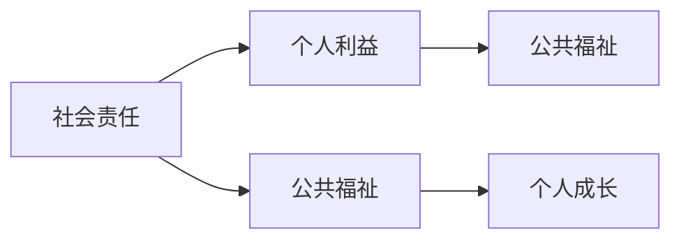

                 

### 《从个人利益到公共福祉：重新思考社会责任和贡献》

> 关键词：社会责任、公共福祉、个人利益、贡献、可持续性

> 摘要：本文将探讨个人利益与公共福祉之间的复杂关系，并深入分析社会责任在现代社会中的重要性。通过案例研究和理论分析，本文旨在为读者提供一个全面的理解，帮助他们在日常生活中更好地平衡个人利益与社会贡献，实现个人成长与公共福祉的双赢。

---

## 《从个人利益到公共福祉：重新思考社会责任和贡献》目录大纲

### 第一部分：社会责任与贡献的重新思考

#### 第1章：引言

- **1.1** 社会责任的概念与演变
- **1.2** 公共福祉的重要性
- **1.3** 个人利益与公共福祉的关系
- **1.4** 重新思考社会责任的意义

#### 第2章：社会责任的理论与实践

- **2.1** 社会责任的理论基础
  - **2.1.1** 道德责任与法律责任的界限
  - **2.1.2** 经济责任与社会责任的平衡
  - **2.1.3** 企业社会责任的演变
- **2.2** 社会责任实践的案例分析
  - **2.2.1** 国内外企业的社会责任实践
  - **2.2.2** 成功案例与挑战
  - **2.2.3** 教训与启示

### 第二部分：社会责任与个人行为

#### 第3章：个人社会责任的体现

- **3.1** 个人在社会中的角色与责任
  - **3.1.1** 公民责任与家庭责任
  - **3.1.2** 职场责任与社区责任
  - **3.1.3** 青年一代的责任意识
- **3.2** 个人行为对社会的影响
  - **3.2.1** 公共道德与个人行为规范
  - **3.2.2** 社交媒体与个人行为
  - **3.2.3** 环境保护与个人责任

#### 第4章：社会责任与个人成长

- **4.1** 社会责任对个人成长的影响
  - **4.1.1** 责任感与个人成就
  - **4.1.2** 社会参与与自我认知
  - **4.1.3** 责任教育的重要性
- **4.2** 个人成长与社会责任的关系
  - **4.2.1** 责任意识与创新能力
  - **4.2.2** 个人价值观与社会价值观的融合
  - **4.2.3** 责任培养与个人发展

### 第三部分：公共福祉的实现与贡献

#### 第5章：公共福祉的实现机制

- **5.1** 公共福祉的定义与内涵
  - **5.1.1** 公共福祉的构成要素
  - **5.1.2** 公共福祉的目标与原则
  - **5.1.3** 公共福祉的实现方式
- **5.2** 公共福祉的实现机制
  - **5.2.1** 政府责任与市场作用
  - **5.2.2** 社会组织与社会参与
  - **5.2.3** 公共政策与公共福祉

#### 第6章：个人对公共福祉的贡献

- **6.1** 个人对公共福祉的贡献方式
  - **6.1.1** 慈善捐赠与志愿服务
  - **6.1.2** 创业与创新对社会的影响
  - **6.1.3** 个人行为对公共环境的改变
- **6.2** 个人如何影响公共福祉
  - **6.2.1** 个人影响力与公共议题
  - **6.2.2** 社会创新与公共福祉
  - **6.2.3** 个人责任与公共福祉的实现

### 第四部分：社会责任与未来展望

#### 第7章：社会责任的未来发展趋势

- **7.1** 社会责任的新趋势
  - **7.1.1** 数字化时代的社会责任
  - **7.1.2** 可持续发展与社会责任
  - **7.1.3** 全球化背景下的社会责任
- **7.2** 未来社会责任的挑战与机遇
  - **7.2.1** 社会责任与经济利益的平衡
  - **7.2.2** 社会责任与创新
  - **7.2.3** 社会责任教育的重要性

#### 第8章：总结与展望

- **8.1** 社会责任与公共福祉的关系
  - **8.1.1** 社会责任对公共福祉的贡献
  - **8.1.2** 公共福祉对社会责任的影响
  - **8.1.3** 二者之间的互动机制
- **8.2** 社会责任与个人贡献的未来展望
  - **8.2.1** 社会责任的新模式
  - **8.2.2** 公共福祉的未来走向
  - **8.2.3** 个人与社会责任的关系发展趋势

## 附录

- **附录 A**: 社会责任与公共福祉相关的参考文献
- **附录 B**: 社会责任与个人贡献的实用工具和资源

---

### 核心概念与联系
#### 社会责任与个人利益的关系架构图

### 数学模型和数学公式

#### 社会责任与个人贡献的数学模型

$$
\text{社会责任贡献} = \frac{\text{个人利益贡献} + \text{公共福祉贡献}}{\text{总贡献}}
$$

---

在接下来的章节中，我们将一步步探讨社会责任与公共福祉的深刻联系，并通过理论和实践案例为读者提供全面的视角。我们希望通过这些探讨，能够激发每个人重新思考个人利益与公共福祉之间的平衡，为实现更美好的社会贡献力量。

---

## 第1章：引言

### 1.1 社会责任的概念与演变

社会责任（Corporate Social Responsibility，简称CSR）是指企业在其运营过程中，不仅要追求经济利益，还要承担起对环境、社会、利益相关者等方面的责任。社会责任的概念并非一蹴而就，而是随着社会经济的发展和人类对可持续性的认识不断演变。

最早的社会责任概念可以追溯到19世纪末至20世纪初，当时工业革命的兴起带来了大量工业污染和工人剥削问题。一些企业家和思想家开始提倡企业应承担社会责任，以解决这些社会问题。这一时期的社会责任主要关注企业的道德责任和法律法规要求。

进入20世纪中期，随着全球化和市场竞争的加剧，社会责任的概念进一步扩展。企业开始意识到，社会责任不仅关乎道德和法规，还关乎其品牌形象、市场竞争力和长期发展。此时，社会责任更多地涉及环境保护、社区参与、员工福利等方面。

近年来，社会责任的概念再次升级，从传统的单一维度发展到多维度的综合责任。企业不仅要关注内部运营和外部环境，还要考虑全球化和数字化时代带来的新挑战。例如，可持续发展、社会创新、道德伦理等方面成为社会责任的重要组成部分。

社会责任的演变历程体现了企业对社会责任认识的深化，从最初的道德责任和法律责任，到今天的综合责任，企业正逐步承担起更多的社会责任，以实现长期可持续发展。

### 1.2 公共福祉的重要性

公共福祉（Public Welfare）是指社会为满足全体成员的基本需求和提升生活质量所提供的一系列公共服务和保障。公共福祉的重要性不容忽视，它直接关系到社会的公平、稳定和可持续发展。

首先，公共福祉是实现社会公平的重要保障。通过提供基本公共服务，如教育、医疗、社会保障等，公共福祉有助于缩小贫富差距，保障弱势群体的基本权益，从而促进社会公平。

其次，公共福祉是维护社会稳定的重要因素。一个良好的公共福祉体系能够有效缓解社会矛盾，减少社会冲突，提高社会凝聚力，从而维护社会的稳定。

最后，公共福祉对经济的可持续发展具有重要意义。公共福祉的完善能够提高劳动者的素质和生活质量，激发创新和创业活力，从而推动经济的长期稳定发展。

总之，公共福祉不仅是社会公平的保障，也是社会稳定和经济可持续发展的基础。在现代社会，公共福祉的重要性日益凸显，需要我们共同努力，不断完善公共福祉体系，以实现全体社会成员的共同福祉。

### 1.3 个人利益与公共福祉的关系

个人利益与公共福祉之间的关系复杂且深刻。一方面，个人利益是社会发展的基础，人们追求个人利益是推动社会进步的重要动力。另一方面，公共福祉的实现离不开每个人的参与和贡献，个人利益的实现需要在公共福祉的基础上进行。

首先，个人利益与公共福祉之间存在互补关系。个人的发展和社会的进步相互促进，个人利益的有效实现有助于提高公共福祉水平，而公共福祉的提升又能更好地满足个人需求，促进个人发展。例如，良好的教育体系不仅能够提高个人的知识和技能，还能为社会培养高素质的人才，推动社会的整体进步。

其次，个人利益与公共福祉之间存在一定的冲突。在某些情况下，个人追求利益可能会对公共福祉造成负面影响。例如，过度追求经济利益可能导致环境污染、资源浪费等问题，影响社会的可持续发展。因此，如何在追求个人利益的同时，兼顾公共福祉，实现二者的平衡，是现代社会面临的重要挑战。

为了实现个人利益与公共福祉的平衡，需要从以下几个方面入手：

1. **法律与政策的引导**：通过制定相关法律和政策，明确企业在社会责任方面的要求，引导个人和企业履行社会责任，促进公共福祉的实现。

2. **教育体系的完善**：通过教育培养人们的责任意识和社会参与意识，使每个人在追求个人利益的同时，更加关注公共福祉，积极参与社会事务。

3. **社会责任的实践**：企业和个人应积极履行社会责任，通过慈善捐赠、志愿服务等方式，为社会做出贡献，实现个人利益与公共福祉的共赢。

4. **市场机制的调节**：通过市场机制调节个人利益与公共福祉之间的关系，鼓励企业和社会组织在追求经济效益的同时，注重社会责任，实现可持续发展。

总之，个人利益与公共福祉的关系是复杂而动态的。在现代社会，我们需要通过多种手段，不断探索和实现二者的平衡，以推动社会的全面进步和可持续发展。

### 1.4 重新思考社会责任的意义

重新思考社会责任的意义在于，它不仅关乎企业的长远发展和市场竞争，更关系到整个社会的可持续发展。在当今全球化和数字化时代，社会责任已经从传统的道德和法律要求，上升为一种战略性的竞争优势。

首先，重新思考社会责任有助于企业提升品牌形象。在消费者越来越注重企业社会责任的背景下，那些能够主动履行社会责任、积极参与社会公益事业的企业，往往能够获得更高的品牌认可度和消费者忠诚度。这有助于企业在激烈的市场竞争中脱颖而出，实现长期稳定的发展。

其次，重新思考社会责任有助于企业吸引和留住优秀人才。年轻一代的员工越来越看重企业的社会责任感和企业文化，他们更愿意加入那些有社会责任感、注重员工福利和职业发展的企业。通过积极履行社会责任，企业能够吸引更多优秀人才，提高整体竞争力。

再次，重新思考社会责任有助于企业实现可持续发展。在资源有限、环境压力增大的背景下，企业若能积极履行社会责任，关注环境保护、资源利用和节能减排，不仅能够降低运营风险，还能实现经济效益和社会效益的双赢。这有助于企业实现长期可持续发展，为后代留下更加美好的世界。

最后，重新思考社会责任有助于推动社会的全面进步。企业作为社会的一部分，其社会责任的实现能够带动社会各界共同关注和参与社会公益事业，提高社会的整体福祉水平。通过企业和社会的共同努力，我们可以实现更加公平、和谐、可持续的社会。

总之，重新思考社会责任不仅对企业发展具有重要意义，更是推动社会进步和可持续发展的重要动力。在新时代背景下，我们需要不断深化对社会责任的认识，积极履行社会责任，共同创造一个更加美好的未来。

## 第2章：社会责任的理论与实践

### 2.1 社会责任的理论基础

社会责任的理论基础主要包括道德责任、法律责任和经济责任。这些理论共同构成了企业社会责任的框架，为企业在运营过程中如何承担社会责任提供了指导。

#### 2.1.1 道德责任与法律责任的界限

道德责任是指企业基于道德伦理标准，自愿承担的对社会、环境、利益相关者等各方面的责任。道德责任通常超越法律要求，反映了企业对社会责任的主动担当和道德自律。例如，企业可能会自发参与环保活动、支持公益事业等，这些行为体现了企业的道德责任。

法律责任则是指企业根据法律法规，必须承担的对社会、环境、利益相关者等各方面的责任。法律责任是强制性的，企业必须遵守相关法律，否则将面临法律责任和惩罚。例如，企业必须遵守环保法、劳动法、消费者权益保护法等，否则将面临罚款、赔偿等法律后果。

道德责任与法律责任之间存在一定的界限和联系。道德责任通常要求企业主动承担社会责任，而法律责任则是对企业行为的最低要求。两者共同构成了企业社会责任的完整体系，企业应当在遵守法律责任的基础上，积极履行道德责任。

#### 2.1.2 经济责任与社会责任的平衡

经济责任是指企业在追求经济利益的同时，必须承担的对社会、环境、利益相关者等方面的责任。经济责任主要关注企业的盈利能力和可持续发展。企业在追求经济利益的过程中，必须关注环境保护、资源利用、社会责任等方面的因素，确保其经营活动符合可持续发展的要求。

社会责任则是指企业在经济责任的基础上，进一步承担的对社会、环境、利益相关者等方面的责任。社会责任不仅包括环境保护和资源利用，还包括员工福利、社区参与、道德伦理等方面。社会责任的实现有助于提升企业的社会形象，增强市场竞争力和品牌价值。

在平衡经济责任与社会责任时，企业需要考虑多方面的因素。首先，企业应确保其经营活动符合法律法规的要求，避免因违法行为导致的经济损失。其次，企业应关注环境保护和资源利用，采取可持续的经营策略，以降低对环境的负面影响。此外，企业还应关注员工福利和社区参与，积极履行社会责任，提升企业的社会形象。

#### 2.1.3 企业社会责任的演变

企业社会责任的概念和实践经历了长期的发展和演变。早期，企业社会责任主要关注企业的道德责任和法律责任，强调企业应遵守道德规范和法律法规，确保公平竞争和诚信经营。

随着全球化和市场竞争的加剧，企业社会责任逐渐扩展到经济责任和社会责任。企业开始意识到，单纯追求经济利益可能带来长期风险，需要关注环境保护、社会责任等方面的因素。这一阶段，企业社会责任的概念更加全面，涵盖了经济、社会和环境等多个方面。

近年来，随着可持续发展理念的普及和消费者对社会责任的关注度提升，企业社会责任进一步扩展到道德责任、法律责任、经济责任和社会责任等多个维度。企业不仅要关注自身的经营绩效，还要关注对社会和环境的影响，实现经济、社会和环境的协调发展。

企业社会责任的演变过程反映了企业对社会责任认识的深化和提升。在新时代背景下，企业应继续加强社会责任管理，积极探索和实践新的社会责任模式，为社会的可持续发展做出更大贡献。

### 2.2 社会责任实践的案例分析

为了更好地理解社会责任的实践，我们可以通过国内外企业的社会责任实践案例进行分析，探讨成功经验与面临的挑战。

#### 2.2.1 国内外企业的社会责任实践

国内企业的社会责任实践近年来取得了显著进展。以阿里巴巴为例，阿里巴巴不仅致力于推动电子商务发展，还积极投身于社会责任事业。通过“阿里巴巴公益平台”，阿里巴巴动员了数百万志愿者，开展了大量公益活动，包括环保、教育、扶贫等领域。此外，阿里巴巴还推出了“阿里巴巴公益基金会”，专注于长期公益项目，以推动社会的可持续发展。

国外企业的社会责任实践同样值得借鉴。以微软为例，微软一直致力于企业社会责任，其“微软公益”项目涵盖了教育、环保、慈善等多个领域。微软通过“微软教育项目”在全球范围内推广教育技术，支持教育改革和创新。此外，微软还积极推动环保工作，通过“微软绿色计算”项目，致力于减少公司运营过程中的碳排放和资源消耗。

#### 2.2.2 成功案例与挑战

国内外企业的社会责任实践取得了显著成果，但同时也面临诸多挑战。

成功案例方面，阿里巴巴和微软等企业通过积极履行社会责任，不仅提升了品牌形象，还增强了市场竞争力和员工凝聚力。这些企业在社会责任方面的成功经验为其他企业提供了有益的借鉴。

然而，企业社会责任实践也面临一系列挑战。首先，企业在履行社会责任过程中可能面临经济压力。一些企业为了履行社会责任，需要投入大量资金和资源，这可能会影响其盈利能力。其次，企业在社会责任实践过程中可能面临法律风险。在某些国家和地区，企业履行社会责任可能受到法律法规的限制，企业需要谨慎处理这些法律风险。

此外，企业社会责任实践还面临社会认同度的挑战。一些消费者和利益相关者可能对企业的社会责任实践持怀疑态度，认为这些行为只是为了提升品牌形象。因此，企业需要在社会责任实践过程中，加强与消费者和利益相关者的沟通，增强社会责任实践的透明度和可信度。

#### 2.2.3 教训与启示

通过对国内外企业社会责任实践的案例分析，我们可以总结出以下教训和启示：

1. **明确社会责任目标**：企业在制定社会责任战略时，应明确社会责任目标，确保社会责任实践与企业的长期发展目标相一致。

2. **加强社会责任管理**：企业应建立完善的社会责任管理体系，包括社会责任规划、执行、监控和评估等环节，确保社会责任实践的持续性和有效性。

3. **注重社会责任传播**：企业应积极传播社会责任理念，加强与消费者、利益相关者和社会公众的沟通，提高社会责任实践的透明度和可信度。

4. **关注社会责任成本**：企业在履行社会责任过程中，应合理控制社会责任成本，确保社会责任实践不会影响企业的盈利能力。

5. **培养社会责任文化**：企业应将社会责任理念融入企业文化，培养员工的社会责任感，形成全员参与的社会责任文化。

总之，企业社会责任实践是推动社会进步和可持续发展的重要力量。在新时代背景下，企业应不断探索和实践新的社会责任模式，为社会的可持续发展贡献更多力量。

### 第3章：个人社会责任的体现

#### 3.1 个人在社会中的角色与责任

个人在社会中扮演着多种角色，每种角色都伴随着相应的责任。首先，作为公民，个人有责任遵守法律法规，维护社会秩序。这包括但不限于投票、参与公共事务和遵守交通规则等。其次，个人在家庭中扮演着家庭成员的角色，需要履行家庭责任，如照顾家人、维护家庭和睦等。

在职场中，个人作为员工，有责任尽力完成工作任务，提升自身职业能力，同时也要关心同事，维护良好的工作氛围。此外，作为社区成员，个人应积极参与社区活动，关心社区问题，为社区的发展贡献力量。青年一代作为社会的未来，更应该具备强烈的社会责任意识，积极参与社会建设。

#### 3.1.1 公民责任与家庭责任

公民责任是指个人作为社会成员，应当承担的对国家和社会的责任。这包括但不限于遵守法律、参与公共事务、投票和纳税等。公民责任是维护社会秩序和公共利益的基础。

家庭责任则是个人在家庭中应当承担的责任，包括照顾家庭成员、维护家庭和谐、教育子女等。家庭是社会的基本单位，个人在家庭中的责任对整个社会的稳定和和谐具有重要意义。

#### 3.1.2 职场责任与社区责任

职场责任主要体现在工作中，个人应尽力完成工作任务，提升自身职业能力，同时也要关心同事，维护良好的工作氛围。此外，职场责任还体现在职业道德和职业操守上，如诚实守信、公平竞争等。

社区责任则是指个人在社区中应当承担的责任，包括参与社区活动、关心社区问题、为社区的发展贡献力量。社区责任有助于增强社区凝聚力，提高社区的整体生活质量。

#### 3.1.3 青年一代的责任意识

青年一代作为社会的未来，责任意识尤为重要。青年应树立正确的价值观，关注社会问题，积极参与社会事务。青年一代的责任意识不仅关系到个人的成长，更关系到整个社会的进步和发展。

培养青年一代的责任意识，需要从多个方面入手。首先，家庭和学校应重视责任教育，通过日常生活中的小事，引导青年树立正确的责任观念。其次，社会应提供更多实践机会，让青年在参与社会公益活动和社区服务中，提升责任意识。此外，政府和企业也应承担起社会责任，为青年提供更多成长机会和支持。

总之，个人在社会中承担着多种角色和责任。只有每个人都认识到自己的责任，积极参与社会事务，才能共同推动社会的进步和发展。

#### 3.2 个人行为对社会的影响

个人行为不仅影响自身的生活质量和幸福感，还对整个社会产生深远的影响。从公共道德到个人行为规范，从社交媒体到环境保护，每一个方面都在潜移默化地塑造着我们周围的世界。

#### 3.2.1 公共道德与个人行为规范

公共道德是维护社会秩序和公共利益的基本准则，它指导个人在社会生活中如何行事。一个具有良好公共道德的个人，不仅会遵守法律法规，还会自觉维护社会公德，如不乱扔垃圾、遵守交通规则等。这些看似微不足道的行为，实际上是在为社会文明进步贡献力量。

个人行为规范则是个人在社会中应当遵守的行为准则，它包括职业道德、社会行为规范和日常生活习惯等。良好的个人行为规范有助于建立和谐的人际关系，提高社会整体的道德水平。例如，诚实守信、公平竞争、尊重他人等都是个人行为规范的重要组成部分。

#### 3.2.2 社交媒体与个人行为

社交媒体的兴起极大地改变了人们的交流方式和行为模式。一方面，社交媒体为个人提供了表达意见、分享信息和结交朋友的平台，促进了社会互动和信息的流通。另一方面，社交媒体也带来了一系列挑战，如网络暴力和虚假信息的传播。

个人在社交媒体上的行为对社会产生直接和间接的影响。积极的行为，如分享正能量、传播真实信息等，有助于营造健康、积极的社会氛围。而消极的行为，如恶意攻击、散布谣言等，则可能引发社会冲突，破坏社会和谐。

#### 3.2.3 环境保护与个人责任

环境保护是现代社会面临的重大挑战之一，每个人都应当承担起环境保护的责任。个人可以通过多种方式参与环境保护，如减少能源消耗、垃圾分类、使用环保产品等。

减少能源消耗是个人环境保护的重要措施。通过节约用电、合理使用交通工具、推广节能产品等，个人可以有效降低碳排放，减少对环境的影响。垃圾分类也是环境保护的重要环节，通过将垃圾进行有效分类，可以提高垃圾的资源利用率，减少垃圾填埋和焚烧带来的环境污染。

使用环保产品是个人对环境保护的另一种贡献。购买环保认证的产品、减少一次性用品的使用等，都可以减少对环境的负面影响。此外，个人还可以通过参与环保活动、宣传环保理念等方式，提高公众的环保意识，共同推动社会的绿色发展。

总之，个人行为对社会的影响是多方面且深远的。从公共道德到个人行为规范，从社交媒体到环境保护，每个人都可以通过自己的行为，为社会的进步和发展贡献力量。

### 第4章：社会责任与个人成长

#### 4.1 社会责任对个人成长的影响

社会责任对个人成长的影响是多维度且深远的。责任感不仅能够帮助个人在职业生涯中取得成功，还能提升个人的社会地位和幸福感。

首先，责任感与个人成就密切相关。具有强烈责任感的人往往能够承担更多的责任，面对挑战时更加坚韧不拔。这种坚韧和担当精神使他们在工作中更容易获得领导者的信任，进而获得更多的职业机会和晋升空间。此外，责任感还促使个人不断提升自身能力，以更好地履行职责，从而实现个人职业成就。

其次，责任感有助于提升个人的社会地位。在社会中，那些履行社会责任、积极奉献的人往往受到社会的尊重和认可。责任感不仅体现在工作中的专业能力和敬业精神，还体现在对社区、环境和社会问题的关注和参与。通过参与公益活动、志愿服务等，个人可以提升自己的社会影响力，增强社会地位。

最后，责任感对个人的幸福感有重要影响。研究表明，具有强烈责任感的人通常更加快乐和满足。这是因为责任感使个人在面对困难和挑战时能够保持积极的心态，增强应对问题的能力。此外，责任感还使个人在帮助他人、参与社会公益活动中获得成就感，从而提升幸福感。

#### 4.1.2 社会参与与自我认知

社会参与是个人成长的重要途径，通过参与社会事务，个人可以提升自我认知，拓宽视野，增强社会责任感。

首先，社会参与有助于提升自我认知。在参与社会事务的过程中，个人会面临各种问题和挑战，这些经历使个人有机会反思自己的价值观、能力和行为模式。通过不断反思和调整，个人可以更好地认识自己，明确自己的优势和不足，从而更好地规划个人发展路径。

其次，社会参与有助于拓宽视野。参与社会事务使个人接触到不同的群体和文化，了解社会多样性和复杂性。这种多元化的体验有助于个人开阔眼界，提升对不同社会问题的理解和认识。通过了解不同社会问题，个人可以更加全面地看待世界，培养包容和开放的思维方式。

最后，社会参与有助于增强社会责任感。通过参与社会公益活动和志愿服务，个人可以感受到自己对社会的贡献，从而增强社会责任感。社会责任感使个人更加关注社会问题，积极参与社会事务，为实现社会公正和进步贡献力量。

总之，社会参与是个人成长的重要途径，通过参与社会事务，个人可以提升自我认知，拓宽视野，增强社会责任感，从而实现全面发展。

#### 4.1.3 责任教育的重要性

责任教育是培养个人社会责任感的基石，对个人的成长和社会的进步具有重要意义。首先，责任教育有助于个人树立正确的价值观。通过责任教育，个人可以认识到自己在社会中的角色和责任，明确自己的行为对社会的影响。这种认识有助于个人树立正确的行为准则，培养良好的道德品质。

其次，责任教育有助于提升个人的自我管理能力。责任教育强调自律和担当，通过培养个人对自己和他人负责的态度，个人可以学会如何管理自己的时间和资源，提高工作和学习效率。此外，责任教育还有助于培养个人的团队合作精神，增强个人在团队中的责任感和协作能力。

最后，责任教育对社会发展具有重要意义。一个具有强烈社会责任感的公民群体，是推动社会进步和和谐发展的重要力量。通过责任教育，我们可以培养更多的社会责任感强烈的公民，提高社会的整体道德水平，推动社会的全面进步。

总之，责任教育对个人成长和社会发展具有深远的影响，通过责任教育，我们可以培养出具有责任感、自律和担当精神的公民，为社会的繁荣和进步贡献力量。

### 第4.2节：个人成长与社会责任的关系

个人成长与社会责任之间存在着密切的相互影响和互动机制。个人的成长过程不仅受到社会责任感的塑造，同时个人的行为和贡献也对社会责任的实现产生重要影响。

首先，责任意识与创新能力之间存在紧密的联系。一个具有强烈责任意识的个人，往往能够更加关注社会问题和挑战，积极探索创新的解决方案。责任意识激发了个人的使命感，使他们在面对困难时勇于尝试新方法，不断寻求突破。例如，许多社会创新者和企业家都是在强烈的社会责任感驱动下，推动了新技术、新商业模式的发展，为社会带来了显著的变革。

其次，个人价值观与社会价值观的融合是个人成长与社会责任关系的核心。个人的价值观是在社会环境中形成的，而社会责任则反映了社会价值观的具体体现。通过参与社会责任活动，个人不仅能够践行社会价值观，还能在实践过程中不断反思和调整自己的价值观，使其更加符合社会的期望。这种融合过程不仅促进了个人价值观的成熟，也为社会价值观的传承和发展提供了动力。

最后，责任培养与个人发展密切相关。在个人成长过程中，通过承担各种社会责任，个人可以积累经验，提升自身能力，实现自我价值的最大化。例如，参与志愿服务和社区活动不仅能够增强个人的社会责任感，还能提高沟通能力、团队协作能力和问题解决能力，这些都是在职业生涯中非常重要的素质。通过责任培养，个人不仅能够获得成就感，还能在实现个人发展的同时，为社会做出贡献。

总之，个人成长与社会责任之间存在着深刻的互动机制。责任意识、价值观融合和责任培养不仅是个人成长的重要推动力，也是实现社会责任的关键因素。通过积极培养个人的责任意识和能力，我们可以为社会培养出更多有担当、有创新精神的公民，共同推动社会的进步和发展。

### 第5章：公共福祉的实现机制

#### 5.1 公共福祉的定义与内涵

公共福祉是指社会为满足全体成员的基本需求和提升生活质量所提供的一系列公共服务和保障。公共福祉的内涵主要包括以下几个方面：

首先，公共福祉强调满足基本需求。这包括保障基本生活条件，如食物、住房、医疗和教育等。公共福祉的目的是确保每个社会成员都能享有基本的生活保障，避免因贫困和基本需求无法满足而导致的社会问题。

其次，公共福祉强调提升生活质量。这包括提供高质量的教育、医疗、文化、体育等公共服务，使社会成员能够享受到丰富多彩的生活，提高整体幸福感。

第三，公共福祉强调社会公平。通过提供公平的机会和资源分配，公共福祉旨在缩小贫富差距，减少社会不平等，促进社会的和谐稳定。

最后，公共福祉强调可持续性。公共福祉的实现需要考虑环境、经济和社会的长期发展，确保公共服务的可持续性和有效性，为未来的社会成员提供良好的生活条件。

#### 5.1.2 公共福祉的目标与原则

公共福祉的目标是确保社会成员的基本需求得到满足，同时提升整体生活质量，实现社会的和谐与可持续发展。具体来说，公共福祉的目标包括以下几个方面：

1. **基本生活保障**：确保每个社会成员都能获得基本的生存条件，如食物、住房、医疗等。
2. **教育机会均等**：提供高质量的教育资源，确保每个孩子都能接受良好的教育，实现教育公平。
3. **医疗保障**：建立完善的医疗保障体系，确保社会成员在面临疾病时能够得到及时、有效的治疗。
4. **就业保障**：提供就业机会和职业培训，帮助社会成员实现就业，提高生活水平。
5. **社会福利**：建立完善的社会福利体系，为弱势群体提供必要的支持和保障。

公共福祉的实现需要遵循一系列原则：

1. **公平性原则**：公共福祉应确保社会资源的公平分配，避免因财富和权力差距而导致的社会不公。
2. **普惠性原则**：公共福祉应惠及所有社会成员，尤其是弱势群体，确保他们能够享受到公共服务和保障。
3. **可持续性原则**：公共福祉的实现需要考虑环境、经济和社会的长期发展，确保公共服务的可持续性。
4. **创新性原则**：公共福祉的实现需要不断创新，通过科技进步和管理创新，提高公共服务的效率和质量。
5. **参与性原则**：公共福祉的实现需要社会各界的参与，包括政府、企业、社会组织和公民个人，共同推动公共福祉的发展。

#### 5.1.3 公共福祉的实现方式

公共福祉的实现方式多种多样，主要包括以下几个方面：

1. **政府主导**：政府在公共福祉的实现中发挥着核心作用。政府通过制定相关政策和法规，提供公共服务和保障，推动公共福祉的实现。例如，政府可以通过建设公共基础设施、提供教育、医疗、社会保障等公共服务，满足社会成员的基本需求。

2. **市场调节**：市场在公共福祉的实现中也扮演着重要角色。市场机制通过资源优化配置，提高公共服务的效率和质量。例如，通过市场化运作，可以推动教育、医疗、住房等公共服务的多元化发展，满足社会成员的多样化需求。

3. **社会组织参与**：社会组织在公共福祉的实现中发挥着补充作用。社会组织可以通过志愿服务、公益项目、社会倡导等方式，参与公共福祉的实现。例如，公益组织可以通过开展慈善活动、提供社会福利服务，帮助弱势群体改善生活条件。

4. **公民参与**：公民在公共福祉的实现中具有重要作用。公民可以通过参与公共事务、提出建议和意见，推动公共福祉的实现。例如，公民可以通过投票、参与社区活动、提出公益项目等，积极参与公共福祉的建设。

总之，公共福祉的实现需要政府、市场、社会组织和公民的共同努力。通过多种方式的协同作用，我们可以构建一个更加公平、和谐、可持续的社会，实现全体社会成员的共同福祉。

### 第5.2节：公共福祉的实现机制

#### 5.2.1 政府责任与市场作用

政府在公共福祉的实现中承担着核心责任，其主要任务包括制定和执行相关政策、提供公共服务和保障社会公平。具体来说，政府应采取以下措施：

1. **制定和执行政策**：政府应制定涵盖教育、医疗、社会保障、环境保护等各个领域的政策，确保公共福祉的实现。同时，政府应加强对政策执行情况的监督和评估，确保政策目标的达成。

2. **提供公共服务**：政府应提供高质量的教育、医疗、社会保障等公共服务，确保社会成员的基本需求得到满足。政府可以通过建设公共设施、招聘和培训专业人员、提供财政支持等方式，提高公共服务的质量和覆盖面。

3. **保障社会公平**：政府应通过税收、福利分配、就业机会等手段，缩小贫富差距，保障弱势群体的基本权益。政府还应加强对社会不公现象的干预，维护社会稳定。

市场在公共福祉的实现中也发挥着重要作用，其主要任务包括优化资源配置、提高公共服务效率和质量。具体来说，市场应采取以下措施：

1. **优化资源配置**：市场通过竞争和价格机制，能够有效地分配资源，提高公共服务的效率。政府应减少对市场的不必要干预，让市场在公共福祉的实现中发挥更大的作用。

2. **提高公共服务效率和质量**：市场机制可以激励企业创新，提高公共服务的质量和效率。政府可以通过市场化的方式，引入竞争机制，推动公共服务的多元化发展。

3. **促进公共和私人部门的合作**：政府和企业可以通过合作，共同推动公共福祉的实现。例如，政府可以与企业合作，推动教育和医疗领域的社会化服务，提高公共服务的覆盖率和质量。

#### 5.2.2 社会组织与社会参与

社会组织在公共福祉的实现中发挥着补充和协调作用，其主要任务包括开展公益活动、提供社会福利服务和倡导社会公正。具体来说，社会组织应采取以下措施：

1. **开展公益活动**：社会组织可以通过志愿服务、慈善捐赠、公益项目等方式，为社会成员提供帮助和支持。例如，慈善组织可以通过资助贫困学生、为残疾人提供辅助设备等方式，改善他们的生活条件。

2. **提供社会福利服务**：社会组织可以通过承接政府委托的服务项目，为弱势群体提供社会福利服务。例如，养老院、救助站等社会组织可以为老年人、孤儿、流浪人员等提供生活照料和关爱服务。

3. **倡导社会公正**：社会组织可以通过社会调查、政策建议、公众宣传等方式，倡导社会公正，推动公共福祉的实现。例如，环保组织可以通过调查环境污染问题，提出改善措施，推动政府和企业采取行动。

公民参与是公共福祉实现的重要保障，其主要任务包括参与公共事务、提出建议和意见、监督政府和企业行为。具体来说，公民应采取以下措施：

1. **参与公共事务**：公民应积极参与社区活动、公共讨论和决策过程，为公共福祉的实现提供支持和建议。例如，公民可以通过参加社区会议、提出公共议题等方式，参与公共事务的决策。

2. **提出建议和意见**：公民可以通过书信、电话、网络等多种渠道，向政府和企业提出建议和意见，促进公共福祉的实现。例如，公民可以通过向政府部门反映问题、提出政策建议等方式，推动公共事务的改善。

3. **监督政府和企业行为**：公民应加强对政府和企业行为的监督，确保公共福祉的实现。例如，公民可以通过舆论监督、参与审计等方式，监督政府和企业履行社会责任，确保公共资源的合理使用。

总之，公共福祉的实现需要政府、市场、社会组织和公民的共同努力。通过多种方式的协同作用，我们可以构建一个更加公平、和谐、可持续的社会，实现全体社会成员的共同福祉。

### 第6章：个人对公共福祉的贡献

#### 6.1 个人对公共福祉的贡献方式

个人对公共福祉的贡献多种多样，既可以通过慈善捐赠和志愿服务，也可以通过创业和创新对社会产生影响。以下是几种主要的贡献方式：

##### 6.1.1 慈善捐赠与志愿服务

慈善捐赠是个人对公共福祉最直接和普遍的贡献方式。通过捐赠资金、物资或时间，个人可以直接帮助到那些需要帮助的群体。例如，捐赠资金可以用于支持教育、医疗、扶贫等公益项目，改善弱势群体的生活条件。捐赠物资则可以为贫困地区、灾害地区提供紧急援助。

志愿服务也是个人贡献的重要方式。通过参与志愿服务，个人可以深入了解社会问题，提升自己的社会责任感和团队合作能力。志愿服务的形式多种多样，包括支教、扶贫、环保、社区服务等。例如，支教志愿者可以为贫困地区的孩子提供教育支持，提高他们的知识水平和未来机会。

##### 6.1.2 创业与创新对社会的影响

创业和创新是推动社会进步和公共福祉提升的重要力量。通过创业，个人可以创造就业机会，促进经济发展，提高社会的整体福祉。创业不仅带来了新的商业机会，还推动了技术创新和管理创新，为社会带来了新的解决方案。

创新在公共福祉中的作用同样不可忽视。技术创新可以改善公共服务，提高服务效率和质量。例如，互联网技术的普及使得远程教育、在线医疗等服务成为可能，为更多人提供了便利和机会。管理创新则可以优化公共资源分配，提高公共服务的公平性和可持续性。

##### 6.1.3 个人行为对公共环境的改变

个人的行为习惯和生活方式对公共环境有深远的影响。通过改变个人行为，个人可以积极推动环境保护和可持续发展。例如，通过减少碳排放、节约能源、垃圾分类等行为，个人可以减少对环境的负面影响，促进生态平衡。

此外，个人还可以通过参与社区环保活动，如植树造林、清洁行动等，直接改善公共环境。例如，志愿者可以组织社区清洁活动，清理垃圾，美化环境，提高社区居民的生活质量。

总之，个人可以通过多种方式对公共福祉做出贡献。无论是通过慈善捐赠和志愿服务，还是通过创业和创新，个人都可以在社会进步和公共福祉提升中发挥重要作用。每个人的贡献，无论大小，都是实现更美好社会的重要力量。

#### 6.2 个人如何影响公共福祉

个人在公共福祉的实现中发挥着不可替代的作用。通过个人影响力、社会创新和个人责任，每个人都可以在公共福祉的提升中发挥独特的作用。

##### 6.2.1 个人影响力与公共议题

个人影响力在社会中具有重要作用，特别是在公共议题的讨论和推动方面。有影响力的个人可以通过媒体、社交网络和其他平台，传播有关公共福祉的信息，提高公众对重要社会问题的认识。例如，公众人物和意见领袖可以通过发表见解、分享经历，引起公众对教育不公、医疗资源不足等问题的关注。这种影响力的传播不仅能够增加公众对公共议题的了解，还能激发更多人的参与和行动。

此外，个人还可以通过参与公共讨论和政策制定，为公共福祉的提升提供建议和意见。例如，通过参加社区会议、公共政策研讨会等，个人可以直接参与社会议题的讨论，提出改进建议。这种参与不仅能够提高政策制定的科学性和有效性，还能确保政策的实施更加贴近公众需求。

##### 6.2.2 社会创新与公共福祉

社会创新是推动公共福祉提升的重要力量。通过创新思维和实践活动，个人可以提出新的解决方案，解决社会问题，改善公共福祉。社会创新可以涵盖多个领域，如教育、医疗、环保和社会服务。

在教育领域，社会创新可以通过开发新的教育技术和教学模式，提高教育质量和公平性。例如，在线教育平台和远程学习工具的普及，为偏远地区和贫困家庭的孩子提供了接受优质教育的机会，大大提升了公共教育的覆盖率和质量。

在医疗领域，社会创新可以通过研发新技术、推广健康理念，改善医疗服务的可及性和质量。例如，移动医疗应用的推广，使得医疗信息更加透明，患者可以更方便地获取医疗服务，同时医生也能够更高效地管理和治疗患者。

在环保领域，社会创新可以通过推广可持续生活方式，减少资源消耗和环境污染。例如，绿色建筑的推广、环保产品的研发，以及社区环保活动的开展，都为环境保护和可持续发展做出了积极贡献。

在社会服务领域，社会创新可以通过优化服务流程、提高服务效率，改善公共服务的质量和公平性。例如，智慧城市技术的应用，可以提升城市管理的效率，提供更加便捷和高效的城市服务。

##### 6.2.3 个人责任与公共福祉的实现

个人责任是实现公共福祉的基础。每个人都有责任关注社会问题，积极参与社会事务，为公共福祉的提升贡献力量。通过履行个人责任，个人不仅可以改善自己的生活环境，还可以影响和带动身边的人，共同推动社会的进步。

首先，个人可以通过履行家庭责任，为子女提供良好的成长环境，培养下一代的公民意识和责任感。其次，个人在职场中应当承担起职业道德和职业责任，通过诚实守信、公平竞争，推动企业的可持续发展。此外，个人还可以积极参与社区活动，为社区的发展和改善做出贡献。

总之，个人影响力、社会创新和个人责任是个人如何影响公共福祉的关键因素。通过发挥个人影响力，关注公共议题，推动社会创新，履行个人责任，每个人都可以在公共福祉的提升中发挥重要作用。无论通过何种方式，个人的贡献都是实现更美好社会的重要力量。

### 第7章：社会责任的未来发展趋势

#### 7.1 社会责任的新趋势

随着全球化和数字化的发展，社会责任也面临着新的挑战和机遇。以下将探讨数字化时代、可持续发展以及全球化背景下的社会责任新趋势。

##### 7.1.1 数字化时代的社会责任

在数字化时代，社会责任的范围和形式都在不断扩展。数字化技术为社会责任提供了新的工具和平台，使得企业、个人和社会组织能够更有效地履行社会责任。例如，通过大数据和人工智能技术，企业可以更精准地识别社会需求，设计更具针对性的公益项目。此外，社交媒体和在线平台也为个人提供了更多参与公益和表达意见的渠道。

数字化时代的社会责任还体现在数据安全和隐私保护方面。随着数据收集和分析技术的广泛应用，企业和政府都需要确保数据的安全和隐私。这不仅是对个人权益的保护，也是社会责任的重要组成部分。

##### 7.1.2 可持续发展与社会责任

可持续发展成为全球关注的焦点，社会责任也在这一背景下发生了深刻变化。企业在履行社会责任时，越来越注重环境、社会和经济效益的平衡，即所谓的“三重底线”（Triple Bottom Line）原则。企业不仅要追求经济利益，还要关注环境保护和社会福祉，确保其经营活动对环境和社会的长期影响是积极的。

社会责任的可持续发展还体现在企业对气候变化、资源利用和生物多样性保护的承诺。例如，许多企业已经制定了碳中和目标，致力于减少碳排放和环境污染。此外，企业还通过推广节能减排技术和可持续产品，促进绿色消费和可持续发展。

##### 7.1.3 全球化背景下的社会责任

全球化使得企业和社会组织的影响范围不断扩大，同时也带来了新的社会责任挑战。全球化背景下，企业需要关注全球供应链中的社会责任问题，确保其业务活动在不同国家和地区都符合当地的法律和道德标准。此外，全球化还要求企业承担更多的国际责任，如支持全球贫困地区的教育和医疗发展。

全球化背景下，社会责任的另一个趋势是跨国合作和协同行动。国际组织和跨国企业通过合作，共同应对全球性挑战，如气候变化、贫困和疾病等。这种协同行动不仅提高了社会责任的效率，还增强了国际合作和全球治理能力。

#### 7.2 未来社会责任的挑战与机遇

未来社会责任面临诸多挑战，同时也充满机遇。以下将探讨社会责任与经济利益平衡、社会责任与创新以及社会责任教育的重要性。

##### 7.2.1 社会责任与经济利益的平衡

社会责任与经济利益的平衡是未来社会责任面临的主要挑战之一。在追求经济利益的同时，企业需要确保其经营活动符合社会责任要求，避免对社会和环境造成负面影响。这种平衡需要企业在战略规划、资源分配和管理实践中做出综合考虑。

为了实现社会责任与经济利益的平衡，企业需要建立有效的社会责任管理体系。这包括制定社会责任战略、设立社会责任目标、实施社会责任项目以及定期评估社会责任绩效。此外，企业还需要与利益相关者（如员工、客户、投资者、社区等）保持良好的沟通和合作，确保社会责任的实现得到广泛支持和认可。

##### 7.2.2 社会责任与创新

社会责任与创新之间存在紧密的联系。通过创新，企业可以开发出新的产品和服务，满足社会需求，同时实现经济和社会效益的平衡。例如，环保科技和创新解决方案可以减少环境污染，改善公共健康，提升生活质量。

未来，社会责任与创新将在多个领域得到进一步融合。例如，绿色科技和可持续发展的创新将推动企业在环境责任方面的表现；教育科技的创新将提高教育质量和公平性；健康科技的创新将改善医疗服务的可及性和效率。

##### 7.2.3 社会责任教育的重要性

社会责任教育是培养未来社会责任感强的人才和社会成员的关键。通过教育，个人可以了解社会责任的概念和实践，培养责任感和社会参与意识。

未来，社会责任教育需要涵盖多个层面。首先，学校教育应将社会责任纳入课程体系，通过课堂教学、实践活动等方式，培养学生的社会责任感。其次，职业教育和培训应注重培养学生的职业道德和社会责任感，提高其职业素养。此外，社会教育也至关重要，通过公众宣传、社区活动等方式，提高公众对社会责任的认识和参与度。

总之，未来社会责任将面临诸多挑战和机遇。通过平衡社会责任与经济利益、推动社会责任与创新、加强社会责任教育，我们可以为未来的社会培养出更多有责任感、有创新能力的人才，共同推动社会的可持续发展。

### 第8章：总结与展望

#### 8.1 社会责任与公共福祉的关系

社会责任与公共福祉之间存在着紧密的互动关系。社会责任是实现公共福祉的重要保障，而公共福祉的实现又为社会责任的履行提供了动力和目标。通过积极履行社会责任，企业、个人和社会组织能够为公共福祉的提升贡献力量，从而实现社会的全面进步和可持续发展。

首先，社会责任对公共福祉的贡献体现在多个方面。企业通过履行社会责任，可以提升公共服务的质量和效率，改善社会福利，促进社会公平。例如，企业通过投资教育、医疗等领域，可以提升公共服务水平，满足社会成员的基本需求。此外，企业还可以通过环境保护和资源管理，减少环境污染和资源浪费，为公共福祉的实现提供良好的生态环境。

其次，公共福祉对社会责任的影响也至关重要。公共福祉的实现需要社会各界的共同努力，包括政府、企业、社会组织和公民个人。公共福祉的提升能够激发更多人参与社会责任的履行，形成全社会共同推动公共福祉提升的良好氛围。例如，当社会成员普遍享受到高质量的教育、医疗和社会保障时，他们更愿意参与社会公益事业，为社会的发展贡献力量。

总之，社会责任与公共福祉之间的关系是相互促进、相互依赖的。通过积极履行社会责任，企业和社会组织可以提升公共福祉水平，为社会的可持续发展奠定基础。同时，公共福祉的实现又为社会责任的履行提供了明确的方向和动力，推动社会各界的共同参与和努力。

#### 8.2 社会责任与个人贡献的未来展望

展望未来，社会责任和个人贡献将呈现一系列新的发展趋势和模式，这些趋势将对个人和社会产生深远的影响。

首先，随着全球化和数字化的发展，社会责任的边界将进一步扩大。企业和社会组织不仅需要在本地履行社会责任，还需要在全球范围内考虑其业务活动对全球环境和社区的影响。例如，跨国企业将需要制定全球社会责任战略，确保其经营活动在不同国家和地区都符合社会责任标准。

其次，个人贡献的形式将更加多样化和个性化。随着科技的发展，个人可以通过在线平台和社交媒体更方便地参与社会公益事业，如通过捐赠、志愿服务、社会创新等方式贡献自己的力量。同时，个人影响力将在社会责任中扮演越来越重要的角色。有影响力的个人和公众人物可以通过社交媒体和公共演讲等途径，推动社会议题的讨论和解决。

此外，社会责任和个人贡献将更加注重可持续性和创新性。企业和个人将更加关注长期的社会影响，采取可持续的经营模式和创新解决方案，以实现经济、社会和环境的协调发展。例如，企业可以通过推广绿色技术和可持续产品，减少对环境的负面影响，同时提高公共福祉水平。

最后，社会责任教育将变得更加重要。未来的社会需要培养具有强烈社会责任感和创新能力的人才，这需要从教育体系入手，通过课程设置、实践活动和公益项目等多种方式，培养学生的社会责任意识和社会参与能力。此外，社会教育也将发挥重要作用，通过公众宣传和社区活动，提高公众对社会责任的认识和参与度。

总之，未来社会责任和个人贡献的发展趋势将推动社会更加公平、和谐和可持续。通过企业和社会组织的共同努力，以及每个人的积极参与，我们可以共同创造一个更加美好的社会。

### 附录

#### 附录 A：社会责任与公共福祉相关的参考文献

1. Carrol, A.B. (1991). **Corporate Social Responsibility: Evolution of a Definitional Construct**. Business Horizons, 34(4), 39-48.
2. Davis, K., & Blau, P.M. (1997). **Who Manages Corporate Social Responsibility?**. Journal of Management, 23(1), 1-13.
3. Freeman, R.E. (1984). **Strategic Management: A Stakeholder Approach**. Pitman.
4. McWilliams, A., & Siegel, D.S. (2001). **Corporate Social Responsibility and Financial Performance: Correlation or Causation?**. Academy of Management Journal, 44(1), 117-137.
5. Sen, A. (1999). **Development as Freedom**. Oxford University Press.
6. World Business Council for Sustainable Development (2000). **Competitive Advantage Through Sustainability**.

#### 附录 B：社会责任与个人贡献的实用工具和资源

1. **社会责任管理工具**：
   - CSRHub: https://www.csrhub.com/
   - CSR Navigator: https://www.csronavigator.com/
   - The Conference Board: https://www.conference-board.org/

2. **社会责任评估工具**：
   - GRI Standards: https://www.globalreporting.org/
   - SASB Standards: https://www.sasb.org/

3. **社会责任教育资源**：
   - CSR Education Network: https://www.csr-edu.org/
   - Net Impact: https://www.netimpact.org/
   - The Center for Corporate Citizenship: https://www.illinois.edu/

4. **社会责任案例库**：
   - Case Place: https://caseplace.org/
   - CSR International Case Studies: https://www.csrinternational.com/case-studies

通过以上参考文献和实用工具，读者可以进一步深入学习和实践社会责任与公共福祉相关的理论和实践。希望这些资源能够为推动社会责任和个人贡献提供有力支持。

---

**作者：AI天才研究院/AI Genius Institute & 禅与计算机程序设计艺术 /Zen And The Art of Computer Programming**

