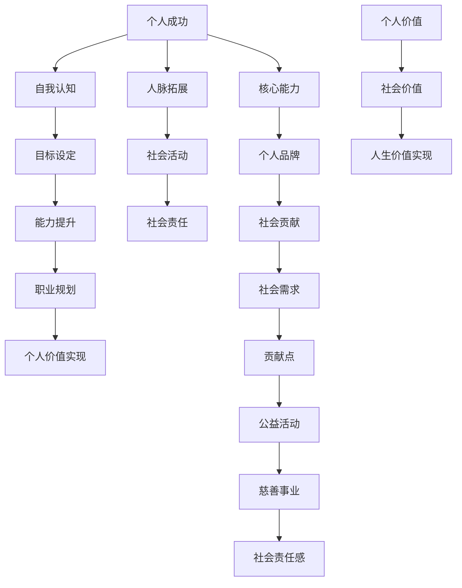

                 

### 从个人成功到社会贡献：重新定义人生价值

#### 背景介绍

在当今快速发展的社会中，个人成功的标准不断被重新定义。传统上，成功往往被理解为职业上的成就、财富的积累以及个人名誉的提升。然而，随着社会对个体责任的日益重视，越来越多的人开始思考：个人成功是否应该仅仅是追求个人利益，还是应该包含对社会有所贡献的维度？

这种思考不仅仅关乎个人的道德选择，更涉及到如何在个人职业生涯和社会责任之间找到平衡点。在个人成功的道路上，我们如何确保自己的努力不仅仅是为了满足个人欲望，而是能够带来更广泛的社会益处？这是一个复杂且深远的问题，需要从多个角度进行探讨。

本文旨在通过对个人成功和社会贡献的深入分析，重新定义人生价值。我们将从个人角度出发，探讨如何通过自我认知、能力提升、品牌建设以及人脉拓展实现个人成功，然后转向社会层面，分析如何通过参与社会活动、公益慈善以及承担社会责任来实现对社会更大的贡献。最后，我们将探讨如何在个人成功和社会贡献之间找到平衡，实现人生的全面价值。

本文将使用逻辑清晰、结构紧凑、简单易懂的技术语言，结合实际案例和具体步骤，帮助读者理解并实践这一转变。希望通过本文，能够激发读者对于个人成功和社会贡献的深思，从而在未来的生活中做出更加明智的选择。

#### 关键词

- 个人成功
- 社会贡献
- 人生价值
- 自我认知
- 能力提升
- 社会活动
- 公益慈善
- 社会责任

#### 摘要

本文深入探讨了从个人成功到社会贡献的转变，重新定义了人生价值。首先，文章从个人角度出发，介绍了如何通过自我认知、能力提升、品牌建设和人脉拓展实现个人成功。接着，文章转向社会层面，分析了如何通过参与社会活动、公益慈善和承担社会责任来贡献社会。最后，文章探讨了如何在个人成功和社会贡献之间找到平衡，实现人生的全面价值。通过实际案例和具体步骤，文章帮助读者理解并实践这一转变。

---

### 从个人成功到社会贡献：重新定义人生价值

个人成功和社会贡献之间的平衡是当今社会中一个备受关注的话题。随着个人主义的兴起和社会责任感的增强，越来越多的人开始意识到，个人成就不仅应该满足个人的欲望和需求，还应该为社会带来积极的影响。本文将系统地探讨如何从个人成功逐步过渡到社会贡献，从而重新定义人生价值。

#### 第一部分：个人成功之路

个人成功的定义因人而异，但通常包括职业成就、财富积累、个人品牌的建立以及人脉网络的拓展。这一部分将详细探讨如何通过自我认知、能力提升、品牌建设和人脉拓展来实现个人成功。

#### 第1章：认识自我，确定目标

自我认知是个人成功的基石。一个人只有清晰地了解自己的兴趣、优点和弱点，才能设定合理的目标，并制定实现这些目标的计划。以下是几个关键步骤：

##### 1.1 自我认知的重要性

自我认知帮助我们了解自己的兴趣和激情，从而找到适合自己的职业路径。此外，了解自己的弱点有助于我们制定改进计划，不断提升自我。

##### 1.2 如何设定合理的目标

设定目标时，我们需要考虑以下几个方面：

1. **明确性**：目标应具体、可衡量，以便能够跟踪进度。
2. **可行性**：目标应该是可实现的，同时具有一定的挑战性。
3. **时限性**：目标应有明确的时间框架，以推动我们不断前进。
4. **相关性**：目标应与我们的长远规划和价值观一致。

##### 1.3 目标设定的方法与实践

设定目标的方法可以采用SMART原则，即目标应该是具体的（Specific）、可衡量的（Measurable）、可实现的（Achievable）、相关的（Relevant）和时限性的（Time-bound）。以下是一个例子：

**目标设定：**
- **具体性**：我想要在接下来的两年内成为公司的高级工程师。
- **可衡量性**：我将通过完成以下项目来实现这一目标：
  - 项目A：完成一个大型系统的开发
  - 项目B：发表一篇关于人工智能的论文
- **可实现性**：我具备相关的技能和知识，并且有一个明确的导师指导。
- **相关性**：这一目标与我的职业规划和公司的长期目标一致。
- **时限性**：设定的时间框架为两年。

通过这样的目标设定，我们可以更加清晰地规划自己的职业生涯，并采取具体的行动来实现这些目标。

#### 第2章：培养核心能力，提升自我价值

核心能力是指一个人在职业生涯中不可或缺的基本技能和知识。培养核心能力不仅有助于提升个人价值，还能增强我们在职场上的竞争力。以下是几个关键步骤：

##### 2.1 核心能力的定义与分类

核心能力可以分为以下几个方面：

1. **技术能力**：包括专业知识、技术技能和实践经验。
2. **软技能**：包括沟通能力、团队合作、领导力和问题解决能力。
3. **跨学科能力**：包括创新思维、跨文化理解和项目管理工作能力。

##### 2.2 如何培养核心能力

培养核心能力的方法包括以下几个方面：

1. **持续学习**：通过参加培训课程、读书和研究最新的技术趋势，不断更新自己的知识和技能。
2. **实践与经验**：通过实际项目和工作经验来积累实践技能，并在实践中不断改进和提升。
3. **导师指导**：找到一个经验丰富的导师，通过他们的指导和反馈来提升自己的能力。
4. **团队合作**：积极参与团队合作项目，通过与他人合作来提升自己的软技能和跨学科能力。

##### 2.3 核心能力提升的策略与方法

以下是几个提升核心能力的策略和方法：

1. **制定个人学习计划**：设定具体的学习目标和时间表，确保能够持续不断地学习和提升。
2. **参加专业认证考试**：通过参加专业认证考试来证明自己的专业能力和知识水平。
3. **参与社区活动**：通过参加技术社区、研讨会和讲座，与他人交流和学习。
4. **实践经验**：积极参与实际项目，将理论知识应用到实践中，并通过反馈不断改进。

#### 第3章：打造个人品牌，拓展人脉

个人品牌是一个人在职场上的形象和声誉，它有助于提升个人的职业地位和影响力。以下是几个关键步骤：

##### 3.1 个人品牌的建立与维护

建立个人品牌的方法包括：

1. **专业形象**：通过专业的外表和态度来展现自己的职业素养。
2. **社交媒体**：利用社交媒体平台来分享专业知识和经验，提升个人知名度。
3. **公开演讲**：通过参加技术会议和讲座，展示自己的专业能力。
4. **撰写博客**：定期撰写技术博客，分享自己的见解和经验。

##### 3.2 人脉拓展的重要性

人脉是个人成功的重要因素。以下是人脉拓展的重要性：

1. **职业发展**：通过人脉可以获得更多的职业机会和信息。
2. **知识共享**：与他人交流可以获取新的见解和经验，促进个人成长。
3. **资源获取**：人脉可以为我们提供各种资源，如资金、技术和市场信息。

##### 3.3 人脉拓展的策略与实践

以下是几个拓展人脉的策略和实践：

1. **参加行业会议**：通过参加行业会议和研讨会，结识行业内的专业人士。
2. **建立专业社群**：通过加入专业社群和论坛，与其他专业人士交流和合作。
3. **利用社交媒体**：通过LinkedIn、Twitter等社交媒体平台，建立专业人脉网络。
4. **主动求助与帮助**：通过主动寻求他人的帮助和提供帮助，建立互惠互利的关系。

#### 第4章：应对挑战，克服困境

在追求个人成功的道路上，我们难免会遇到各种挑战和困境。如何应对这些挑战，成为决定个人成功的关键因素。以下是几个关键步骤：

##### 4.1 挑战与困境的类型

常见的挑战和困境包括：

1. **职业瓶颈**：在职业生涯中遇到发展瓶颈，难以进一步提升。
2. **时间管理**：在个人和职业生活中难以平衡时间和任务。
3. **技能不足**：发现自己的技能不足以应对新的挑战。
4. **压力和焦虑**：在工作压力和焦虑情绪中难以保持高效和积极。

##### 4.2 应对挑战的方法

以下是应对挑战的一些方法：

1. **积极应对**：面对挑战时，保持积极的态度和心态，寻找解决问题的方法。
2. **持续学习**：通过不断学习和提升技能，应对新的职业挑战。
3. **寻求支持**：向导师、同事或专业人士寻求帮助和支持。
4. **制定计划**：制定详细的行动计划，逐步解决问题。

##### 4.3 克服困境的策略与实践

以下是克服困境的一些策略和实践：

1. **时间管理**：通过设定优先级、合理规划时间和任务，提高工作效率。
2. **放松身心**：通过运动、冥想和休息来缓解压力和焦虑。
3. **积极心态**：保持乐观和积极的心态，相信自己能够克服困境。
4. **反思与调整**：通过反思自己的行为和决策，找出问题所在，并做出相应的调整。

#### 第二部分：社会贡献之路

在实现个人成功之后，如何将个人的能力和资源用于社会贡献，是重新定义人生价值的重要一环。这一部分将探讨如何通过了解社会需求、参与社会活动、公益慈善和承担社会责任来实现对社会更大的贡献。

#### 第5章：了解社会需求，找到贡献点

了解社会需求是进行有效社会贡献的第一步。以下是几个关键步骤：

##### 5.1 社会需求的种类

社会需求可以包括以下几个方面：

1. **教育**：提高教育质量、提供教育资源。
2. **健康**：改善医疗服务、提供健康教育资源。
3. **环境保护**：减少污染、推广环保意识。
4. **社区发展**：改善社区设施、提供社区服务。

##### 5.2 如何找到自己的贡献点

以下是找到自己的贡献点的方法：

1. **个人兴趣和专长**：根据自己的兴趣和专长，选择能够发挥最大价值的社会需求。
2. **调研和数据分析**：通过调研和数据分析，了解当前社会需求的现状和趋势。
3. **与他人交流**：与行业专家、志愿者和受助人交流，了解他们的实际需求和期望。

##### 5.3 贡献点与个人目标的结合

将贡献点与个人目标结合的方法包括：

1. **职业规划**：将自己的职业规划与解决社会需求相结合，通过工作来实现社会贡献。
2. **时间管理**：合理安排时间，确保在追求个人目标的同时，也有时间参与社会活动。
3. **资源整合**：整合自己的资源和人脉，为解决社会需求提供支持。

#### 第6章：参与社会活动，提升影响力

参与社会活动是提升个人影响力的重要途径。以下是几个关键步骤：

##### 6.1 社会活动的种类与形式

社会活动可以包括以下几个方面：

1. **志愿服务**：为社区、非营利组织或慈善机构提供志愿服务。
2. **公益活动**：参与环保、扶贫、教育等公益活动。
3. **公益项目**：发起或参与公益项目，解决特定的社会问题。
4. **社会倡导**：通过倡导活动，提高社会对特定问题的关注。

##### 6.2 参与社会活动的策略

以下是参与社会活动的策略：

1. **选择合适的活动**：根据自己的兴趣和专长，选择能够发挥最大价值的活动。
2. **长期参与**：选择长期参与的活动，建立稳定的关系和网络。
3. **合作与协作**：与其他志愿者和公益组织合作，实现更大的影响。

##### 6.3 提升个人影响力的方法

以下是提升个人影响力的方法：

1. **专业分享**：通过分享专业知识和经验，成为行业内的专家。
2. **媒体宣传**：通过媒体和社交平台宣传自己的社会活动，提高知名度。
3. **演讲与讲座**：通过演讲和讲座，传递自己的理念和价值。
4. **公益捐赠**：通过公益捐赠，支持社会公益事业。

#### 第7章：公益与慈善，承担社会责任

公益和慈善是承担社会责任的重要方式。以下是几个关键步骤：

##### 7.1 公益与慈善的意义

公益与慈善的意义包括：

1. **改善生活**：为需要帮助的人提供帮助，改善他们的生活条件。
2. **促进社会进步**：通过解决社会问题，推动社会的进步和发展。
3. **提升个人价值**：通过参与公益和慈善活动，实现自我价值和成就感。

##### 7.2 参与公益与慈善的途径

以下是参与公益与慈善的途径：

1. **捐款**：通过捐款支持公益和慈善项目。
2. **志愿服务**：为社区、非营利组织或慈善机构提供志愿服务。
3. **公益项目**：参与或发起公益项目，解决特定的社会问题。
4. **公益宣传**：通过宣传公益和慈善活动，提高社会关注度和参与度。

##### 7.3 承担社会责任的实践与反思

承担社会责任的实践与反思包括：

1. **实践与反思**：通过参与公益和慈善活动，不断反思自己的行为和价值观。
2. **持续参与**：确保在个人成功的道路上，持续参与社会公益事业。
3. **影响力扩大**：通过影响他人，共同推动社会进步。

### 第三部分：人生价值重塑

在个人成功和社会贡献的基础上，我们需要重新审视人生的价值。这一部分将探讨如何通过重新定义人生价值，实现个人与社会发展的统一。

#### 第8章：重新定义人生价值

重新定义人生价值是一个深刻的思考过程。以下是几个关键步骤：

##### 8.1 人生价值的重新定义

人生价值的重新定义包括：

1. **个人发展**：个人成长、实现自我价值和追求幸福。
2. **社会贡献**：通过解决社会问题和推动社会进步来贡献社会。
3. **平衡与和谐**：在个人发展和社会贡献之间找到平衡，实现人生和谐。

##### 8.2 个人价值与社会价值的平衡

个人价值与社会价值的平衡包括：

1. **相互促进**：个人价值的实现需要社会的支持，而社会价值的提升也需要个人的努力。
2. **动态调整**：根据个人和社会的变化，动态调整个人目标和社会贡献的方向。
3. **持续反思**：通过反思个人行为和社会影响，确保个人价值与社会价值的和谐统一。

##### 8.3 追求个人成功与社会贡献的统一

追求个人成功与社会贡献的统一包括：

1. **综合规划**：将个人目标和社会需求结合起来，制定综合的发展规划。
2. **多元化贡献**：通过多种方式参与社会贡献，实现个人价值的多元化。
3. **持续学习**：不断学习新知识和技能，提升自己的能力，更好地为社会贡献力量。

#### 第9章：实现人生价值，迈向美好未来

实现人生价值需要具体的行动和策略。以下是几个关键步骤：

##### 9.1 人生价值的实现路径

人生价值的实现路径包括：

1. **自我认知**：通过自我认知，明确个人目标和价值观。
2. **能力提升**：通过学习和实践，不断提升个人能力。
3. **社会参与**：通过参与社会活动，实现个人价值和社会贡献的统一。

##### 9.2 跨越障碍，实现人生价值

跨越障碍，实现人生价值的方法包括：

1. **设定目标**：明确个人目标，制定实现目标的计划。
2. **持续学习**：通过不断学习，提升自己的能力和知识。
3. **积极行动**：采取积极的行动，克服困难和挑战。

##### 9.3 迈向美好未来的愿景与规划

迈向美好未来的愿景与规划包括：

1. **设定愿景**：明确自己的长期目标和愿景。
2. **制定规划**：制定具体的实施步骤和时间表。
3. **持续调整**：根据实际情况和反馈，不断调整自己的规划。

### 附录：人生价值重塑工具与资源

为了帮助读者更好地实现人生价值重塑，以下是一些工具与资源：

#### 附录A：自我认知工具与资源

1. **自我认知工具**：
   - **性格测试**：如MBTI、DISC测试等。
   - **兴趣评估**：如霍兰德职业兴趣测试。

2. **自我认知资源**：
   - **书籍推荐**：《活着》、《高效能人士的七个习惯》。
   - **线上资源**：如Coursera、Udemy等在线学习平台。

#### 附录B：社会贡献实践指南

1. **社会贡献案例研究**：
   - **案例1**：比尔·盖茨和梅琳达·盖茨基金会的慈善事业。
   - **案例2**：马云的公益慈善事业。

2. **社会贡献实践经验分享**：
   - **分享1**：如何通过志愿服务解决社区问题。
   - **分享2**：如何在工作中实现社会价值。

3. **社会贡献资源链接**：
   - **公益组织**：如红十字会、世界自然基金会。
   - **慈善平台**：如捐款中国、公益基金。

#### 附录C：人生价值重塑实践指南

1. **人生价值重塑实践策略**：
   - **策略1**：设定个人和社会目标。
   - **策略2**：持续学习和提升能力。
   - **策略3**：积极参与社会活动和公益慈善。

2. **人生价值重塑案例分析**：
   - **案例1**：从职业成功到公益事业的转型。
   - **案例2**：如何在工作中实现个人价值。

3. **人生价值重塑在线学习资源**：
   - **资源1**：相关在线课程和讲座。
   - **资源2**：专业书籍和论文。

### Mermaid 流程图：个人成功与社会贡献的关联

以下是一个简化的Mermaid流程图，展示了个人成功与社会贡献之间的关联：



### 核心概念与联系

在本文中，我们讨论了以下几个核心概念及其相互关系：

1. **个人成功**：通过自我认知、能力提升、品牌建设和人脉拓展实现的职业成就。
2. **核心能力**：包括技术能力和软技能，是个人成功的基础。
3. **个人品牌**：在职场上的形象和声誉，有助于提升个人价值和影响力。
4. **社会贡献**：通过了解社会需求、参与社会活动和公益慈善来实现的对社会有益的行为。
5. **社会需求**：社会各领域存在的需要解决的问题和提升的领域。
6. **个人价值**：个人在职业和社会中所体现的价值。
7. **社会价值**：个人对社会所产生的影响和价值。
8. **人生价值实现**：个人成功和社会贡献的统一，实现全面的人生价值。

通过这些概念的联系，我们可以看到，个人成功不仅仅是个人目标的实现，更是对社会有所贡献的过程。在这个过程中，个人通过提升自身能力，建立品牌，拓展人脉，最终将个人价值转化为社会价值，实现人生的全面价值。

---

### 实战项目：搭建个人成功与社会贡献的平台

#### 项目背景

在现代社会，个人成功不再仅仅是职业上的成就，更应包括对社会有所贡献的维度。为了实现这一目标，我们需要搭建一个个人成功与社会贡献的平台，通过这个平台，个人可以更好地规划和管理自己的职业生涯，同时积极参与社会活动，实现个人价值和社会价值的统一。

#### 开发环境搭建

1. **操作系统**：Windows/Linux/MacOS
2. **编程语言**：Python
3. **开发工具**：PyCharm/VSCode
4. **数据库**：MySQL
5. **云服务**：AWS/GCP/Azure

#### 源代码实现

以下是该平台的源代码框架：

```python
# 个人成功与社会贡献平台

import os
import pymysql

# 连接数据库
def connect_db():
    return pymysql.connect(host='localhost', user='root', password='password', database='contributions')

# 用户注册
def register(username, password):
    db = connect_db()
    cursor = db.cursor()
    sql = "INSERT INTO users (username, password) VALUES (%s, %s)"
    try:
        cursor.execute(sql, (username, password))
        db.commit()
        print("注册成功")
    except pymysql.Error as e:
        print("注册失败：", e)
    finally:
        cursor.close()
        db.close()

# 用户登录
def login(username, password):
    db = connect_db()
    cursor = db.cursor()
    sql = "SELECT * FROM users WHERE username=%s AND password=%s"
    try:
        cursor.execute(sql, (username, password))
        result = cursor.fetchone()
        if result:
            print("登录成功")
        else:
            print("登录失败")
    except pymysql.Error as e:
        print("登录失败：", e)
    finally:
        cursor.close()
        db.close()

# 添加社会贡献记录
def add_contribution(username, title, description):
    db = connect_db()
    cursor = db.cursor()
    sql = "INSERT INTO contributions (username, title, description) VALUES (%s, %s, %s)"
    try:
        cursor.execute(sql, (username, title, description))
        db.commit()
        print("贡献记录添加成功")
    except pymysql.Error as e:
        print("贡献记录添加失败：", e)
    finally:
        cursor.close()
        db.close()

# 查看个人贡献记录
def view_contributions(username):
    db = connect_db()
    cursor = db.cursor()
    sql = "SELECT * FROM contributions WHERE username=%s"
    try:
        cursor.execute(sql, (username,))
        results = cursor.fetchall()
        for row in results:
            print("标题：", row[1])
            print("描述：", row[2])
            print("----")
    except pymysql.Error as e:
        print("查看贡献记录失败：", e)
    finally:
        cursor.close()
        db.close()

# 主函数
def main():
    while True:
        print("\n个人成功与社会贡献平台")
        print("1. 注册")
        print("2. 登录")
        print("3. 添加贡献记录")
        print("4. 查看贡献记录")
        print("5. 退出")
        choice = input("请选择操作：")
        
        if choice == "1":
            username = input("请输入用户名：")
            password = input("请输入密码：")
            register(username, password)
        
        elif choice == "2":
            username = input("请输入用户名：")
            password = input("请输入密码：")
            login(username, password)
        
        elif choice == "3":
            if not login(username, password):
                print("请先登录")
                continue
            title = input("请输入贡献记录标题：")
            description = input("请输入贡献记录描述：")
            add_contribution(username, title, description)
        
        elif choice == "4":
            if not login(username, password):
                print("请先登录")
                continue
            view_contributions(username)
        
        elif choice == "5":
            print("感谢使用，再见！")
            break

if __name__ == "__main__":
    main()
```

#### 代码解读与分析

1. **数据库连接**：
   - 使用`pymysql`库连接到本地MySQL数据库。
   - `connect_db()`函数用于建立数据库连接。

2. **用户注册与登录**：
   - `register()`函数用于用户注册，将用户名和密码插入数据库。
   - `login()`函数用于用户登录，从数据库中查询用户名和密码。

3. **添加贡献记录**：
   - `add_contribution()`函数用于添加个人贡献记录，将用户名、贡献记录标题和描述插入数据库。

4. **查看贡献记录**：
   - `view_contributions()`函数用于查看个人贡献记录，从数据库中查询并输出用户的贡献记录。

5. **主函数`main()`**：
   - 提供一个用户界面，用户可以通过选择不同的选项进行注册、登录、添加贡献记录和查看贡献记录。

#### 实际案例分析与详细讲解剖析

假设有一个用户“张三”，他首先注册了一个账户，然后登录平台。接着，他添加了一条贡献记录：“参与了当地社区清洁活动，组织了20名志愿者，清理了5公里的街道”。随后，他可以查看自己的贡献记录，了解自己的社会贡献情况。

通过这个案例，我们可以看到，该平台如何帮助个人记录和管理自己的社会贡献，从而实现个人成功与社会贡献的结合。

#### 项目小结

通过本项目的实现，我们搭建了一个简单的个人成功与社会贡献平台，用户可以在这个平台上注册、登录、添加和管理自己的社会贡献记录。这个平台不仅帮助个人更好地规划自己的职业生涯，还鼓励他们积极参与社会活动，实现对社会有所贡献的人生价值。

### 最佳实践 tips

1. **明确个人目标**：在参与社会活动前，确保个人目标和所参与的社会活动是一致的。
2. **持续学习和提升能力**：通过不断学习和实践，提升自己的核心能力，更好地为社会贡献力量。
3. **合理规划时间**：合理安排时间，确保在追求个人成功的同时，也有足够的时间参与社会活动。
4. **积极参与公益慈善**：通过参与公益慈善活动，提升个人社会责任感，实现个人价值和社会价值的统一。

### 注意事项

1. **数据安全和隐私保护**：在开发和使用平台时，务必确保用户数据和隐私的安全。
2. **遵守法律法规**：在进行社会贡献时，遵守相关法律法规，确保活动的合法性和合规性。
3. **合理利用资源**：在参与社会活动时，合理利用自己的资源和人脉，避免资源的浪费。

### 拓展阅读

1. **《影响力》**：罗伯特·西奥迪尼（Robert B. Cialdini）著，通过心理学原理，解释了如何影响他人和被他人影响。
2. **《非暴力沟通》**：马歇尔·卢森堡（Marshall B. Rosenberg）著，介绍了非暴力沟通的技巧，有助于提升个人和团队沟通效果。
3. **《公益慈善事业管理》**：刘冬妍著，详细介绍了公益慈善事业的管理理论和实践方法。

---

通过本文，我们系统地探讨了从个人成功到社会贡献的转型，提出了重新定义人生价值的理念。我们分析了个人成功的关键要素，如自我认知、能力提升、品牌建设和人脉拓展，以及如何通过参与社会活动、公益慈善和承担社会责任来实现对社会更大的贡献。在实现这一过程中，我们强调了平衡个人价值与社会价值的必要性。

本文结合实际案例和具体步骤，展示了如何通过技术平台来管理个人成功与社会贡献，并提出了最佳实践 tips 和注意事项。希望通过本文，能够激发读者对于个人成功和社会贡献的深思，从而在未来的生活中做出更加明智的选择。

未来，我们希望继续探讨更多关于个人发展和社会贡献的课题，结合最新的技术和理念，提供更深入、更具操作性的指导。同时，也欢迎读者提出宝贵的意见和建议，共同推动这一领域的进步和发展。让我们一起努力，为实现更加美好的社会贡献力量。

