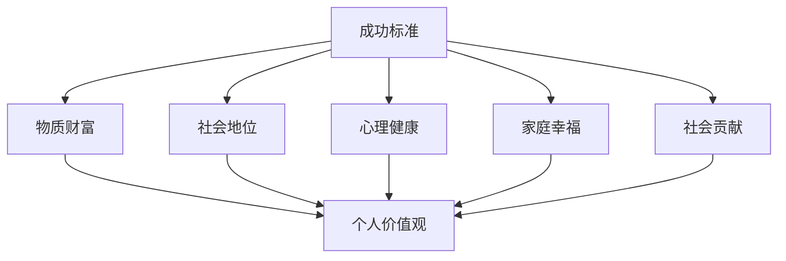
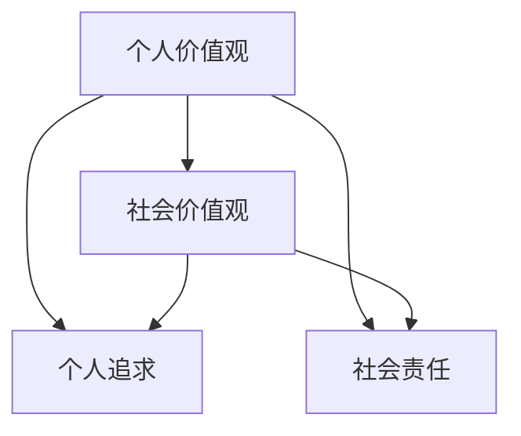

                 

### 从个人成功到社会责任：重新定义人生价值和意义

在当今这个快速变化的时代，成功的定义和标准不断演变。传统观念中的成功往往侧重于个人的物质成就和社会地位，但现代观点则更加多元，涵盖了心理健康、人际关系、社会贡献等多个维度。然而，无论是哪种定义，我们都必须面对一个核心问题：如何在我们个人的成功中融入社会责任，重新定义人生的价值和意义。

**关键词：个人成功，社会责任，人生价值，多元视角，自我成长，社会贡献**

**摘要：**本文旨在探讨从个人成功到社会责任的转变，强调在现代社会中，如何通过重新定义人生价值和意义，实现个人成长与社会发展的双赢。文章首先分析了成功的多元视角，随后探讨了个人成长和社会责任的路径，最后提出了社会责任在实践中的具体行动与实现方法。

---

**第一部分：人生价值的重新定义**

### 第1章：成功的多元视角

在现代社会的背景下，成功的定义和标准逐渐多元化。传统的成功观念往往侧重于物质财富和社会地位，这种单一的成功标准在过去可能相对有效，但如今，随着社会和经济的快速发展，人们对于成功的认知发生了显著变化。

#### 成功的定义与标准

首先，我们需要明确什么是成功。成功不仅仅是财富和地位的象征，它还包括个人的心理健康、家庭幸福、社会贡献等多个方面。以下是一个多维度的成功标准框架：

1. **物质财富**：通过努力工作和投资获得的经济收益。
2. **社会地位**：在职场和社会中获得的认可和尊重。
3. **心理健康**：良好的心理状态，包括情绪稳定、心理健康等。
4. **家庭幸福**：和谐的家庭关系和幸福的生活状态。
5. **社会贡献**：通过个人行动对社会产生的积极影响。

#### 成功标准与个人价值观的关系

个人价值观在成功标准中扮演着至关重要的角色。一个人的价值观决定了他们如何看待成功、如何追求成功以及如何评价成功的意义。例如，一个重视环境保护的人可能会将减少碳排放、参与环保活动视为成功的一部分，而一个重视社会责任的企业家可能会将企业的社会贡献和社会责任视为成功的核心指标。

**核心概念与联系**

为了更好地理解成功与价值观之间的关系，我们可以通过以下Mermaid流程图展示核心概念和实体之间的联系：

在这个流程图中，成功的标准（A）与个人价值观（G）之间存在直接关联。个人的价值观会影响到他们对成功的定义和追求方式，从而决定他们在不同维度上的成功程度。

#### 个人价值观与社会价值观的融合

个人价值观与社会价值观的融合是实现全面成功的关键。个人价值观是个体在成长过程中形成的，而社会价值观则是社会文化背景下的共识。在现代社会，这两者之间往往存在一定的冲突。例如，一个追求物质财富的人可能会因为过度工作而忽视家庭生活，这与社会价值观中强调家庭和谐的观念相悖。

然而，通过积极寻求个人价值观与社会价值观的融合，我们可以实现更加全面和持久的成功。以下是一些实现融合的方法：

1. **平衡追求**：在追求个人成功的同时，也要考虑社会责任和家庭幸福。
2. **价值观教育**：通过教育和个人反思，培养既符合个人价值观又适应社会价值观的思维方式。
3. **社会参与**：通过参与社会公益活动，实现个人价值与社会价值的统一。

**核心概念与联系（续）**

为了更直观地展示个人价值观与社会价值观的融合过程，我们可以再次使用Mermaid流程图：

在这个流程图中，个人价值观（A）和社会价值观（B）共同影响着个人追求（C）和社会责任（D）。通过平衡和融合，个人可以更加全面地实现成功。

### 小结

成功的多元视角让我们认识到，成功不仅仅是物质财富和社会地位的象征，它还包括心理健康、家庭幸福和社会贡献等多个维度。个人价值观与社会价值观的融合是实现全面成功的关键。通过重新定义人生价值和意义，我们可以实现个人成长与社会发展的双赢。

---

在接下来的章节中，我们将进一步探讨个人成长的路径，包括自我认知与自我提升、持续学习与知识更新，以及建立积极的人生态度。通过这些路径，我们可以为承担社会责任打下坚实的基础。请继续阅读下一章，让我们一起深入探讨个人成长的路径。

---

**作者：AI天才研究院/AI Genius Institute & 禅与计算机程序设计艺术 /Zen And The Art of Computer Programming**

