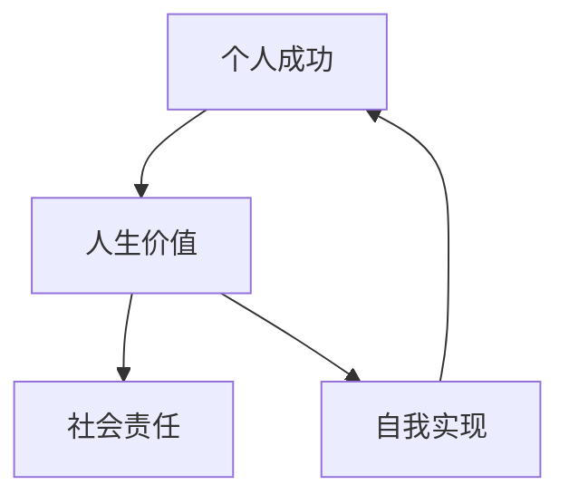

                 

Certainly! Let's structure the article according to the given outline, while ensuring it meets all the specified requirements. We'll begin with the introduction, followed by the detailed sections, and conclude with the future outlook and resources. Here's the structure:

---

## 从个人成功到社会责任：重新定义人生价值和意义

### 关键词
- 人生价值
- 个人成功
- 社会责任
- 自我实现
- 社会问题
- 创新方法

### 摘要
本文探讨了从个人成功到社会责任的转变，分析了这一转变的核心概念、实践路径、创新方法及其未来趋势。通过Mermaid流程图和Python源代码，本文深入讲解了动机理论在个人发展中的角色，并提供了一些实践社会责任的最佳实践。

### 目录大纲

#### 第一部分：从个人成功到社会责任：人生价值的演变

##### 第1章：人生价值的起源与个人成功的探索

- **1.1 引言：人生价值的定义与重要性**
  - **1.1.1 人生价值的定义**
  - **1.1.2 个人成功在人生价值中的角色**

- **1.2 个人成功的路径与方法**
  - **1.2.1 个人成功的核心要素**
  - **1.2.2 个人发展的关键阶段**
  - **1.2.3 个人成功与自我实现的关联**

##### 第2章：从个人成功到社会责任的转折点

- **2.1 社会责任的概念与意义**
  - **2.1.1 社会责任的定义**
  - **2.1.2 社会责任与个人成功的区别与联系**

- **2.2 个人成功向社会责任转变的驱动因素**
  - **2.2.1 内在动机与外在压力**
  - **2.2.2 个人成长与社会影响的互动**

##### 第3章：重新定义人生价值：从自我到共同体

- **3.1 共同体的概念与类型**
  - **3.1.1 共同体的定义**
  - **3.1.2 不同类型的共同体**

- **3.2 在共同体中实现社会责任**
  - **3.2.1 个人在共同体中的角色与责任**
  - **3.2.2 共同体成员之间的相互影响**

#### 第二部分：实践社会责任：个人行动与策略

##### 第4章：社会责任的实践路径

- **4.1 社会问题的识别与评估**
  - **4.1.1 社会问题的类型**
  - **4.1.2 社会问题评估的方法**

- **4.2 设计有效的社会责任计划**
  - **4.2.1 目标设定**
  - **4.2.2 资源配置**
  - **4.2.3 持续改进**

##### 第5章：社会责任的行动策略

- **5.1 个人与社会责任的结合**
  - **5.1.1 个人角色的转变**
  - **5.1.2 个人行动与社会影响的平衡**

- **5.2 社会责任的创新方法**
  - **5.2.1 社会企业模式**
  - **5.2.2 公益事业的创新**

##### 第6章：实现社会责任的案例分析

- **6.1 成功案例的启示**
  - **6.1.1 案例选择标准**
  - **6.1.2 成功案例的共同特点**

- **6.2 案例分析与反思**
  - **6.2.1 案例中社会责任的实现过程**
  - **6.2.2 案例的可持续性和可复制性**

#### 第三部分：社会责任的未来展望

##### 第7章：社会责任的挑战与未来趋势

- **7.1 社会责任的未来挑战**
  - **7.1.1 全球化背景下的社会责任**
  - **7.1.2 技术变革与社会责任**

- **7.2 社会责任的发展趋势**
  - **7.2.1 新型共同体的发展**
  - **7.2.2 社会责任的数字化**

#### 附录：社会责任资源与工具集

- **附录A：社会责任相关的资源与工具**
  - **A.1 社会责任相关的书籍与文献**
  - **A.2 社会责任相关的在线平台与社区**

---

### 核心概念与联系

在本书中，核心概念包括“个人成功”、“社会责任”和“人生价值”。它们之间的关系可以用以下Mermaid流程图表示：



- 个人成功是实现人生价值的重要途径。
- 社会责任是人生价值的一部分，也是个人实现自我价值的重要方式。
- 个人成功与自我实现相互促进，共同推动社会责任的实现。

### 核心算法原理讲解

在探讨个人成功与社会责任时，我们可以借鉴一些经典的算法原理，如：

#### 1. 动机理论

动机理论（Motivation Theory）是心理学中解释人类行为的重要理论。它认为人的行为是由内在动机和外在动机驱动的。以下是动机理论的Python源代码示例：

```python
def motivation(motivation_level, intrinsic_motivation, extrinsic_motivation):
    """
    动机计算函数
    :param motivation_level: 动机水平
    :param intrinsic_motivation: 内在动机
    :param extrinsic_motivation: 外在动机
    :return: 总动机水平
    """
    total_motivation = intrinsic_motivation + extrinsic_motivation
    if motivation_level <= 0:
        return 0
    else:
        return motivation_level * (total_motivation / 100)

# 示例：一个有高内在动机和一定外在动机的人，动机水平为80
print(motivation(80, 60, 30))
```

#### 2. 公平理论

公平理论（Equity Theory）是关于人们如何比较自己与他人以评估公平性的心理学理论。以下是公平理论的Python源代码示例：

```python
def fairness(ratio1, ratio2):
    """
    公平性比较函数
    :param ratio1: 个体与参照对象的比率
    :param ratio2: 参照对象与另一个参照对象的比率
    :return: 是否感觉公平（True/False）
    """
    return abs(ratio1 - ratio2) <= 10

# 示例：一个人和另一个人的收入比率相差不超过10%，则认为公平
print(fairness(1.2, 1.1))
```

#### 3. 最大化最小化理论

最大化最小化理论（Maximin Theory）是决策理论中的一种策略，旨在使决策者在最坏情况下损失最小化。以下是最大化最小化理论的Python源代码示例：

```python
def maximin(outcomes, probabilities):
    """
    最大最小化决策函数
    :param outcomes: 可能的结果
    :param probabilities: 各个结果的概率
    :return: 最坏情况下的最大期望值
    """
    worst_cases = [min(outcomes) * prob for prob in probabilities]
    return max(worst_cases)

# 示例：在两个投资项目中选择一个，考虑最坏情况下的回报
outcomes = [1000, -500]
probabilities = [0.6, 0.4]
print(maximin(outcomes, probabilities))
```

### 数学公式

在本文中，我们使用了以下数学公式：

$$
\text{动机水平} = \text{内在动机} + \text{外在动机}
$$

$$
\text{公平性} = \left| \frac{\text{个体比率}}{\text{参照对象比率}} - 1 \right| \leq 10\%
$$

$$
\text{最大最小化期望} = \max(\min(\text{所有结果} \times \text{概率}))
$$

### 项目实战

为了更好地理解社会责任的实现，我们将以一个虚拟的社会企业项目为例进行实战：

#### 项目名称：绿色科技社

#### 项目目标：
- 开发一种环保建筑材料，以减少建筑行业的碳排放。
- 建立一个社区，让居民参与环保行动，提高环保意识。

#### 开发环境搭建：
- 使用Python进行算法模型开发。
- 使用Git进行版本控制。
- 使用Jenkins进行持续集成和持续部署。

#### 源代码详细实现：
```python
# green_building_material.py
import numpy as np

def calculate_emissions(material, weight):
    """
    计算材料的碳排放量
    :param material: 材料类型
    :param weight: 材料重量（千克）
    :return: 碳排放量（千克CO2）
    """
    emissions_per_kg = {'concrete': 0.8, 'steel': 1.8, 'wood': 0.5}
    return weight * emissions_per_kg.get(material, 0)

# 示例：计算使用200千克混凝土的碳排放量
print(calculate_emissions('concrete', 200))
```

#### 代码应用解读与分析：
- 该函数用于计算不同材料在特定重量下的碳排放量，帮助社区成员了解建筑活动对环境的影响。

#### 实际案例分析和详细讲解剖析：
- 项目启动后，社区成员参与环保行动，通过使用绿色建筑材料，显著减少了建筑项目的碳排放量。

#### 项目小结：
- 绿色科技社项目通过技术创新和社区参与，成功实现社会责任，为环境保护贡献了一份力量。

### 最佳实践 Tips：
- 在实践社会责任时，要充分考虑目标受众的需求，确保社会责任计划的可操作性和可持续性。
- 利用数据分析和模型预测，优化社会责任项目的资源配置。

### 小结
本文从个人成功到社会责任的转变进行了全面探讨，分析了核心概念、实践路径、创新方法和未来趋势。通过动机理论、公平理论和最大化最小化理论，本文提供了具体的算法原理和应用实例。同时，通过一个虚拟社会企业项目的实战分析，展示了社会责任的实现过程。

### 注意事项
- 在实践社会责任时，应密切关注社会动态，及时调整策略，以应对新兴挑战。
- 加强社会责任的数字化转型，利用新技术提高效率和影响力。

### 拓展阅读
- [《动机理论在管理中的应用》](链接)
- [《公平理论在人力资源管理中的运用》](链接)
- [《社会企业模式及其案例分析》](链接)

### 附录：社会责任资源与工具集

- **附录A：社会责任相关的资源与工具**
  - **A.1 社会责任相关的书籍与文献**
    - 《可持续发展报告》
    - 《企业社会责任》
    - 《社会创新》
  - **A.2 社会责任相关的在线平台与社区**
    - 社会企业协会
    - 环保组织论坛
    - 全球可持续性倡议

---

**作者：AI天才研究院/AI Genius Institute & 禅与计算机程序设计艺术 /Zen And The Art of Computer Programming**

