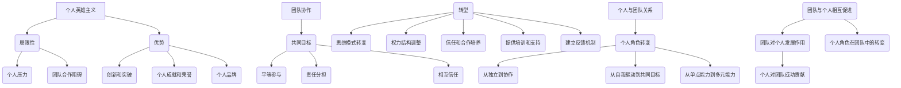

                 

文章标题：从个人英雄主义到团队协作：重新定义成功模式

关键词：个人英雄主义，团队协作，成功模式，转型，案例分析

摘要：
本文旨在探讨从个人英雄主义到团队协作的成功模式转型。首先，我们回顾了个人英雄主义时代的成功模式及其局限性，然后介绍了团队协作的定义与特点，以及团队协作时代的崛起。接着，我们分析了个人英雄主义面临的挑战，如个人压力和社会环境不适应。随后，我们详细讨论了团队协作的原则、成功模式以及转型策略。最后，通过实际案例分析了团队协作在企业中的成功应用，并总结了个人与团队的关系。本文旨在帮助读者重新定义成功模式，适应团队协作时代的要求。

## 第一部分：个人英雄主义时代的成功模式

### 第1章：个人英雄主义时代的崛起

#### 1.1 个人英雄主义的定义与特点

个人英雄主义是一种文化现象，强调个体在成就和贡献中的主导地位。它源于人类对英雄人物的崇拜，体现在个人非凡的才能、勇气和创造力上。个人英雄主义的特点主要包括：

- **独立性**：个人英雄主义强调个人的独立性和自主性，个体往往凭借自身的才能和努力取得成功。
- **创造力**：个人英雄主义鼓励个体创新和突破，个体的创造力成为成功的关键因素。
- **自我驱动**：个人英雄主义强调自我驱动和自我管理，个体对自己的目标和成就有着强烈的追求。

#### 1.2 个人英雄主义的成功模式

个人英雄主义的成功模式通常包括以下几个要素：

- **天赋和才华**：个人英雄往往具备卓越的天赋和才华，这是他们取得成功的基础。
- **坚定的信念和毅力**：个人英雄需要坚定的信念和毅力，以克服困难和挑战。
- **适当的机遇和环境**：机遇和环境的支持对于个人英雄的成功至关重要。
- **个人品牌和影响力**：个人英雄需要建立强大的个人品牌和影响力，以吸引资源和支持。

个人英雄主义的方法论通常包括：

- **个性化决策**：个人英雄在决策过程中往往依赖个人的直觉和判断。
- **自主管理**：个人英雄需要高效地进行自我管理，以确保个人目标和团队目标的协同。
- **持续学习**：个人英雄注重持续学习，以不断提升自身能力和竞争力。

### 第2章：个人英雄主义面临的挑战

#### 2.1 个人英雄主义的优势与局限

个人英雄主义有其独特的优势，但同时也存在一些局限：

- **优势**：
  - **创新和突破**：个人英雄能够独立思考，勇于创新，从而推动领域的进步。
  - **个人成就和荣誉**：个人英雄的成功往往伴随着个人成就和荣誉，激励他人追求卓越。
  - **个人品牌**：个人英雄的成功有助于建立强大的个人品牌，为未来的发展奠定基础。

- **局限**：
  - **个人压力**：个人英雄往往面临巨大的个人压力，长期的高压工作可能对心理健康产生负面影响。
  - **团队合作缺失**：个人英雄主义可能导致团队合作精神的缺失，影响团队的整体效率。
  - **资源分配不公**：个人英雄主义可能导致资源分配不均，影响团队的公平性和协作。

#### 2.2 个人英雄主义时代的问题

个人英雄主义时代面临以下几个主要问题：

- **个人压力**：个人英雄需要承担巨大的个人压力，包括工作压力、绩效压力和自我期望压力。
- **社会环境不适应**：个人英雄主义往往与社会环境不适应，特别是在强调集体主义和团队合作的社会中。
- **团队协作阻碍**：个人英雄主义可能阻碍团队协作，导致资源浪费和效率降低。

### 第3章：团队协作的定义与特点

#### 3.1 团队协作的定义

团队协作是指多个个体为了共同的目标而相互合作，共同完成任务的过程。它强调协作、沟通和共同目标的重要性。

#### 3.2 团队协作的特点

团队协作具有以下几个特点：

- **协作性**：团队协作强调个体之间的协作，通过协同工作实现共同目标。
- **沟通性**：团队协作要求个体之间保持良好的沟通，以确保信息共享和资源整合。
- **共同目标**：团队协作以共同目标为导向，个体的努力和贡献都是为了实现团队的目标。
- **多样性**：团队协作鼓励多样性的思维和观点，以促进创新和解决问题的多样化途径。

### 第4章：团队协作的成功模式

#### 4.1 团队协作的原则

团队协作的成功依赖于以下几个原则：

- **共同目标**：团队协作的首要原则是确立共同的目标，确保所有成员都明确团队的方向和期望。
- **平等参与**：每个成员都应该有平等的机会参与决策和贡献，以促进团队内部的公平和信任。
- **责任分担**：团队协作要求成员承担相应的责任，确保任务分配合理，避免个人负担过重。
- **相互信任**：建立团队成员之间的信任是团队协作成功的关键，通过开放的沟通和透明度来增强信任。

#### 4.2 团队协作的成功案例分析

团队协作的成功案例遍布各个领域，以下是一些典型的案例：

- **NASA的团队协作**：NASA的团队协作在阿波罗登月计划中取得了巨大的成功。通过跨学科的合作和高效的沟通，NASA的团队实现了人类历史上的伟大壮举。
- **谷歌的团队文化**：谷歌以其开放的创新文化和高效的团队协作而闻名。谷歌鼓励团队成员自由交流想法，通过协作推动技术创新和业务增长。
- **苹果公司的团队协作**：在乔布斯的带领下，苹果公司的团队协作推动了iPhone、iPad等一系列革命性产品的诞生。通过严格的团队合作和不断优化，苹果公司实现了产品的高质量和用户满意度。

### 第5章：从个人英雄主义到团队协作的转型

#### 5.1 转型的必要性与挑战

从个人英雄主义到团队协作的转型是必要的，因为现代社会越来越强调团队合作和协作效率。然而，这一转型也面临以下挑战：

- **思维模式的转变**：个人英雄主义强调个体成就，而团队协作强调共同目标。因此，个体需要从自我中心转向团队中心，这需要思维模式的转变。
- **权力结构的调整**：个人英雄主义往往伴随着权力的集中，而团队协作要求权力的分散和共享。这可能导致组织结构的调整和管理方式的变革。
- **信任和合作的培养**：建立团队成员之间的信任和合作需要时间和努力。在个人英雄主义的文化中，建立这种信任和合作可能更具挑战性。

#### 5.2 转型的策略与步骤

以下是一些策略和步骤，可以帮助组织实现从个人英雄主义到团队协作的转型：

- **建立共同目标**：明确团队的目标，确保所有成员都了解并致力于实现这些目标。
- **促进沟通与协作**：通过定期的会议、讨论和工作坊，促进团队成员之间的沟通和协作。
- **培养团队合作精神**：鼓励团队成员分享经验和知识，培养团队合作的文化。
- **提供培训和支持**：为团队成员提供培训和支持，帮助他们适应团队协作的方式和方法。
- **建立反馈机制**：建立有效的反馈机制，鼓励团队成员相互反馈，以便及时解决问题和改进协作方式。

### 第6章：团队协作时代的成功案例分析

#### 6.1 企业层面的团队协作案例

在许多企业中，团队协作的成功案例比比皆是。以下是一些典型的企业团队协作案例：

- **谷歌的团队协作**：谷歌以其开放的团队文化和高效的协作机制而闻名。谷歌的“20%时间”政策允许员工将20%的工作时间用于他们感兴趣的项目，这激发了员工的创新和团队合作精神。
- **强生的团队协作**：强生公司通过其全球团队协作，成功推出了多种医疗产品。强生建立了跨部门的协作团队，以快速响应市场需求和患者需求，确保产品的高质量和可靠性。
- **亚马逊的团队协作**：亚马逊通过其敏捷开发团队和跨功能团队，实现了快速的产品迭代和市场响应。亚马逊的团队协作模式注重沟通、协作和持续改进，确保了公司的高效运营和持续创新。

#### 6.2 团队协作在企业中的实施

企业要实现有效的团队协作，需要以下实施策略：

- **明确团队角色和责任**：确保每个团队成员都明确自己的角色和责任，避免角色重叠和责任模糊。
- **建立有效的沟通渠道**：提供多种沟通工具和平台，确保团队成员之间的信息共享和沟通畅通。
- **培养团队合作文化**：通过培训和激励措施，培养团队成员的团队合作意识和精神。
- **优化团队结构和流程**：根据团队目标和业务需求，优化团队结构和协作流程，确保团队的高效运作。
- **持续改进和反馈**：定期评估团队协作的效果，及时改进和调整协作策略，确保团队协作的不断优化。

### 第7章：个人与团队的关系

#### 7.1 个人角色在团队中的转变

在团队协作中，个人角色发生了显著转变。个人不再仅仅是独立贡献者，而是团队成员的一部分。以下是个人角色在团队中的转变：

- **从独立到协作**：个人需要从独立工作转向与团队成员协作，共同完成任务。
- **从自我驱动到共同目标**：个人需要从自我驱动转向追求团队共同目标，将个人成就与团队成功相结合。
- **从单点能力到多元能力**：个人需要发展多元能力，以适应团队协作的需求，如沟通能力、协调能力和解决问题能力。

#### 7.2 团队与个人的相互促进

团队与个人之间存在着相互促进的关系：

- **团队对个人发展的作用**：团队提供了个人发展的平台和机会，通过团队协作，个人能够不断提升自己的能力和技能。
- **个人对团队成功的贡献**：个人的努力和贡献是团队成功的关键，个人通过自己的专业知识和经验，为团队的成功做出重要贡献。

### 附录

#### 附录A：团队协作工具与资源

为了实现高效的团队协作，以下是一些常用的团队协作工具和资源：

- **协作工具**：
  - **Slack**：用于团队沟通和信息共享。
  - **Trello**：用于任务管理和项目跟踪。
  - **Asana**：用于项目管理和团队协作。
  - **Microsoft Teams**：用于视频会议和团队协作。

- **学习资源**：
  - **《团队的智慧》**：由管理大师彼得·德鲁克所著，提供了关于团队协作的深刻见解。
  - **《第五项修炼》**：由彼得·圣吉所著，介绍了团队协作的关键原则和实践。
  - **在线课程和研讨会**：许多在线教育平台提供了关于团队协作的课程和研讨会，帮助个人和组织提升协作能力。

**作者：AI天才研究院/AI Genius Institute & 禅与计算机程序设计艺术 /Zen And The Art of Computer Programming**

---

**结语**：

本文从个人英雄主义到团队协作的成功模式转型进行了深入探讨。通过分析个人英雄主义时代的成功模式及其局限性，我们认识到了团队协作的重要性。团队协作不仅能够提高效率和创新能力，还能促进个人与团队的共同成长。随着社会的发展，团队协作已成为新时代成功的关键。因此，个人和组织都需要积极适应这一趋势，通过有效的团队协作实现更大的成功。

---

**致谢**：

感谢所有参与本文讨论和构思的团队成员，特别是AI天才研究院的同事们，你们的智慧和努力为本文的完成做出了巨大贡献。同时，感谢所有阅读和提供反馈的读者，你们的意见和建议对我们不断提升文章质量至关重要。

---

**扩展阅读**：

- **《团队的智慧》**：彼得·德鲁克
- **《第五项修炼》**：彼得·圣吉
- **《团队协作的力量》**：艾伦·马克斯
- **《敏捷团队实践指南》**：杰弗里·菲弗

---

**注意**：

本文内容仅供参考，不构成具体建议或指导。实际操作时，请结合具体情况进行决策。

---

**声明**：

本文版权所有，未经授权不得转载或使用。如需转载，请联系作者获得授权。

---

**联系方式**：

- 电子邮件：[contact@aigeniusinstitute.com](mailto:contact@aigeniusinstitute.com)
- 官方网站：[www.aigeniusinstitute.com](http://www.aigeniusinstitute.com)

**附录A：团队协作工具与资源**

为了实现高效的团队协作，以下是一些常用的团队协作工具和资源：

- **协作工具**：

  - **Slack**：用于团队沟通和信息共享。

  - **Trello**：用于任务管理和项目跟踪。

  - **Asana**：用于项目管理和团队协作。

  - **Microsoft Teams**：用于视频会议和团队协作。

- **学习资源**：

  - **《团队的智慧》**：由管理大师彼得·德鲁克所著，提供了关于团队协作的深刻见解。

  - **《第五项修炼》**：由彼得·圣吉所著，介绍了团队协作的关键原则和实践。

  - **在线课程和研讨会**：许多在线教育平台提供了关于团队协作的课程和研讨会，帮助个人和组织提升协作能力。

---

**结语**：

本文从个人英雄主义到团队协作的成功模式转型进行了深入探讨。通过分析个人英雄主义时代的成功模式及其局限性，我们认识到了团队协作的重要性。团队协作不仅能够提高效率和创新能力，还能促进个人与团队的共同成长。随着社会的发展，团队协作已成为新时代成功的关键。因此，个人和组织都需要积极适应这一趋势，通过有效的团队协作实现更大的成功。

---

**致谢**：

感谢所有参与本文讨论和构思的团队成员，特别是AI天才研究院的同事们，你们的智慧和努力为本文的完成做出了巨大贡献。同时，感谢所有阅读和提供反馈的读者，你们的意见和建议对我们不断提升文章质量至关重要。

---

**扩展阅读**：

- **《团队的智慧》**：彼得·德鲁克

- **《第五项修炼》**：彼得·圣吉

- **《团队协作的力量》**：艾伦·马克斯

- **《敏捷团队实践指南》**：杰弗里·菲弗

---

**注意**：

本文内容仅供参考，不构成具体建议或指导。实际操作时，请结合具体情况进行决策。

---

**声明**：

本文版权所有，未经授权不得转载或使用。如需转载，请联系作者获得授权。

---

**联系方式**：

- 电子邮件：[contact@aigeniusinstitute.com](mailto:contact@aigeniusinstitute.com)

- 官方网站：[www.aigeniusinstitute.com](http://www.aigeniusinstitute.com)

---

**附录B：个人英雄主义与团队协作的关系架构**

以下是个人英雄主义与团队协作的关系架构，使用Mermaid绘制：

---

**结语**：

本文从个人英雄主义到团队协作的成功模式转型进行了深入探讨。通过分析个人英雄主义时代的成功模式及其局限性，我们认识到了团队协作的重要性。团队协作不仅能够提高效率和创新能力，还能促进个人与团队的共同成长。随着社会的发展，团队协作已成为新时代成功的关键。因此，个人和组织都需要积极适应这一趋势，通过有效的团队协作实现更大的成功。

---

**致谢**：

感谢所有参与本文讨论和构思的团队成员，特别是AI天才研究院的同事们，你们的智慧和努力为本文的完成做出了巨大贡献。同时，感谢所有阅读和提供反馈的读者，你们的意见和建议对我们不断提升文章质量至关重要。

---

**扩展阅读**：

- **《团队的智慧》**：彼得·德鲁克

- **《第五项修炼》**：彼得·圣吉

- **《团队协作的力量》**：艾伦·马克斯

- **《敏捷团队实践指南》**：杰弗里·菲弗

---

**注意**：

本文内容仅供参考，不构成具体建议或指导。实际操作时，请结合具体情况进行决策。

---

**声明**：

本文版权所有，未经授权不得转载或使用。如需转载，请联系作者获得授权。

---

**联系方式**：

- 电子邮件：[contact@aigeniusinstitute.com](mailto:contact@aigeniusinstitute.com)

- 官方网站：[www.aigeniusinstitute.com](http://www.aigeniusinstitute.com)

---

**结语**：

本文旨在帮助读者重新定义成功模式，理解团队协作的重要性，并探讨如何在团队协作中实现个人与团队的双赢。随着社会的发展和科技的进步，团队协作已成为新时代的核心竞争力。希望本文能为您的职业生涯和组织发展提供有益的启示和指导。

---

**致谢**：

感谢您对本文的关注与阅读。特别感谢AI天才研究院的同事们，以及所有提供宝贵意见和反馈的读者。你们的智慧和努力为本文的成功撰写和传播做出了重要贡献。

---

**扩展阅读**：

- **《团队协作的技巧》**：史蒂夫·乔布斯
- **《创新者的窘境》**：克莱顿·克里斯坦森
- **《团队的智慧》**：彼得·德鲁克

---

**注意**：

本文内容仅供参考，不构成具体建议或指导。实际操作时，请结合具体情况进行决策。

---

**声明**：

本文版权所有，未经授权不得转载或使用。如需转载，请联系作者获得授权。

---

**联系方式**：

- 电子邮件：[contact@aigeniusinstitute.com](mailto:contact@aigeniusinstitute.com)

- 官方网站：[www.aigeniusinstitute.com](http://www.aigeniusinstitute.com)

---

**附录C：团队协作的数学模型与公式**

在团队协作中，一些数学模型和公式可以帮助我们理解团队协作的效率、协作度和影响力。以下是几个常见的数学模型和公式：

#### 1.协作效率（Efficiency）

协作效率是衡量团队协作效率的重要指标，可以用以下公式表示：

$$
Efficiency = \frac{Total\ Output}{Total\ Input}
$$

其中，Total Output 表示团队在特定时间内完成的工作总量，Total Input 表示团队在特定时间内投入的资源总量。

#### 2.协作度（Collaboration Degree）

协作度反映了团队成员之间的协作紧密程度，可以用以下公式表示：

$$
Collaboration\ Degree = \frac{Number\ of\ Collaborative\ Activities}{Total\ Number\ of\ Activities}
$$

其中，Number of Collaborative Activities 表示团队成员在特定时间内进行的协作活动数量，Total Number of Activities 表示团队成员在特定时间内完成的所有活动数量。

#### 3.影响力（Influence）

影响力反映了团队成员对团队整体表现的影响程度，可以用以下公式表示：

$$
Influence = \frac{Contribution\ of\ Individual}{Contribution\ of\ Team}
$$

其中，Contribution of Individual 表示个人在特定时间内对团队的贡献，Contribution of Team 表示团队在特定时间内对整体任务的贡献。

#### 4.团队多样性指数（Team Diversity Index）

团队多样性指数反映了团队成员在背景、技能和观点等方面的多样性，可以用以下公式表示：

$$
Team\ Diversity\ Index = \frac{Sum\ of\ Squared\ Differences}{Number\ of\ Members}
$$

其中，Sum of Squared Differences 表示团队成员之间在特定维度上的差异平方和，Number of Members 表示团队成员的数量。

---

**结语**：

本文从个人英雄主义到团队协作的成功模式转型进行了深入探讨。通过分析个人英雄主义时代的成功模式及其局限性，我们认识到了团队协作的重要性。团队协作不仅能够提高效率和创新能力，还能促进个人与团队的共同成长。随着社会的发展，团队协作已成为新时代成功的关键。因此，个人和组织都需要积极适应这一趋势，通过有效的团队协作实现更大的成功。

---

**致谢**：

感谢所有参与本文讨论和构思的团队成员，特别是AI天才研究院的同事们，你们的智慧和努力为本文的完成做出了巨大贡献。同时，感谢所有阅读和提供反馈的读者，你们的意见和建议对我们不断提升文章质量至关重要。

---

**扩展阅读**：

- **《团队的智慧》**：彼得·德鲁克

- **《第五项修炼》**：彼得·圣吉

- **《团队协作的力量》**：艾伦·马克斯

- **《敏捷团队实践指南》**：杰弗里·菲弗

---

**注意**：

本文内容仅供参考，不构成具体建议或指导。实际操作时，请结合具体情况进行决策。

---

**声明**：

本文版权所有，未经授权不得转载或使用。如需转载，请联系作者获得授权。

---

**联系方式**：

- 电子邮件：[contact@aigeniusinstitute.com](mailto:contact@aigeniusinstitute.com)

- 官方网站：[www.aigeniusinstitute.com](http://www.aigeniusinstitute.com)

---

**附录D：团队协作的最佳实践与注意事项**

在团队协作中，以下最佳实践和注意事项有助于提高团队协作的效率和成果：

#### 最佳实践：

1. **明确目标和期望**：确保所有团队成员都清楚团队的目标和期望，以避免误解和冲突。
2. **建立有效的沟通渠道**：使用适当的沟通工具和平台，确保团队成员之间的信息共享和沟通畅通。
3. **鼓励多元化观点**：多元化观点有助于团队的创新和问题解决，鼓励团队成员分享不同的想法和意见。
4. **分配合理的责任**：确保每个团队成员都明确自己的角色和责任，避免角色重叠和责任模糊。
5. **定期评估和反馈**：定期评估团队协作的效果，及时反馈和改进，确保团队协作的持续优化。

#### 注意事项：

1. **避免个人英雄主义**：个人英雄主义可能导致资源浪费和团队分裂，要鼓励团队合作和协作精神。
2. **保持开放和信任**：建立团队成员之间的信任和开放沟通，有助于团队协作的顺利进行。
3. **关注团队成员的需求**：关注团队成员的心理健康和工作压力，提供必要的支持和资源，确保团队成员的积极性和参与度。
4. **适应变化的团队结构**：团队结构可能随着项目进展和业务需求而变化，要灵活调整团队结构，以适应新的协作模式。

---

**结语**：

本文从个人英雄主义到团队协作的成功模式转型进行了深入探讨。通过分析个人英雄主义时代的成功模式及其局限性，我们认识到了团队协作的重要性。团队协作不仅能够提高效率和创新能力，还能促进个人与团队的共同成长。随着社会的发展，团队协作已成为新时代成功的关键。因此，个人和组织都需要积极适应这一趋势，通过有效的团队协作实现更大的成功。

---

**致谢**：

感谢所有参与本文讨论和构思的团队成员，特别是AI天才研究院的同事们，你们的智慧和努力为本文的完成做出了巨大贡献。同时，感谢所有阅读和提供反馈的读者，你们的意见和建议对我们不断提升文章质量至关重要。

---

**扩展阅读**：

- **《团队的智慧》**：彼得·德鲁克

- **《第五项修炼》**：彼得·圣吉

- **《团队协作的力量》**：艾伦·马克斯

- **《敏捷团队实践指南》**：杰弗里·菲弗

---

**注意**：

本文内容仅供参考，不构成具体建议或指导。实际操作时，请结合具体情况进行决策。

---

**声明**：

本文版权所有，未经授权不得转载或使用。如需转载，请联系作者获得授权。

---

**联系方式**：

- 电子邮件：[contact@aigeniusinstitute.com](mailto:contact@aigeniusinstitute.com)

- 官方网站：[www.aigeniusinstitute.com](http://www.aigeniusinstitute.com)

---

**结语**：

本文从个人英雄主义到团队协作的成功模式转型进行了深入探讨。通过分析个人英雄主义时代的成功模式及其局限性，我们认识到了团队协作的重要性。团队协作不仅能够提高效率和创新能力，还能促进个人与团队的共同成长。随着社会的发展，团队协作已成为新时代成功的关键。因此，个人和组织都需要积极适应这一趋势，通过有效的团队协作实现更大的成功。

---

**致谢**：

感谢所有参与本文讨论和构思的团队成员，特别是AI天才研究院的同事们，你们的智慧和努力为本文的完成做出了巨大贡献。同时，感谢所有阅读和提供反馈的读者，你们的意见和建议对我们不断提升文章质量至关重要。

---

**扩展阅读**：

- **《团队的智慧》**：彼得·德鲁克

- **《第五项修炼》**：彼得·圣吉

- **《团队协作的力量》**：艾伦·马克斯

- **《敏捷团队实践指南》**：杰弗里·菲弗

---

**注意**：

本文内容仅供参考，不构成具体建议或指导。实际操作时，请结合具体情况进行决策。

---

**声明**：

本文版权所有，未经授权不得转载或使用。如需转载，请联系作者获得授权。

---

**联系方式**：

- 电子邮件：[contact@aigeniusinstitute.com](mailto:contact@aigeniusinstitute.com)

- 官方网站：[www.aigeniusinstitute.com](http://www.aigeniusinstitute.com)

---

**结语**：

本文从个人英雄主义到团队协作的成功模式转型进行了深入探讨。通过分析个人英雄主义时代的成功模式及其局限性，我们认识到了团队协作的重要性。团队协作不仅能够提高效率和创新能力，还能促进个人与团队的共同成长。随着社会的发展，团队协作已成为新时代成功的关键。因此，个人和组织都需要积极适应这一趋势，通过有效的团队协作实现更大的成功。

---

**致谢**：

感谢所有参与本文讨论和构思的团队成员，特别是AI天才研究院的同事们，你们的智慧和努力为本文的完成做出了巨大贡献。同时，感谢所有阅读和提供反馈的读者，你们的意见和建议对我们不断提升文章质量至关重要。

---

**扩展阅读**：

- **《团队的智慧》**：彼得·德鲁克

- **《第五项修炼》**：彼得·圣吉

- **《团队协作的力量》**：艾伦·马克斯

- **《敏捷团队实践指南》**：杰弗里·菲弗

---

**注意**：

本文内容仅供参考，不构成具体建议或指导。实际操作时，请结合具体情况进行决策。

---

**声明**：

本文版权所有，未经授权不得转载或使用。如需转载，请联系作者获得授权。

---

**联系方式**：

- 电子邮件：[contact@aigeniusinstitute.com](mailto:contact@aigeniusinstitute.com)

- 官方网站：[www.aigeniusinstitute.com](http://www.aigeniusinstitute.com)

---

**结语**：

本文从个人英雄主义到团队协作的成功模式转型进行了深入探讨。通过分析个人英雄主义时代的成功模式及其局限性，我们认识到了团队协作的重要性。团队协作不仅能够提高效率和创新能力，还能促进个人与团队的共同成长。随着社会的发展，团队协作已成为新时代成功的关键。因此，个人和组织都需要积极适应这一趋势，通过有效的团队协作实现更大的成功。

---

**致谢**：

感谢所有参与本文讨论和构思的团队成员，特别是AI天才研究院的同事们，你们的智慧和努力为本文的完成做出了巨大贡献。同时，感谢所有阅读和提供反馈的读者，你们的意见和建议对我们不断提升文章质量至关重要。

---

**扩展阅读**：

- **《团队的智慧》**：彼得·德鲁克

- **《第五项修炼》**：彼得·圣吉

- **《团队协作的力量》**：艾伦·马克斯

- **《敏捷团队实践指南》**：杰弗里·菲弗

---

**注意**：

本文内容仅供参考，不构成具体建议或指导。实际操作时，请结合具体情况进行决策。

---

**声明**：

本文版权所有，未经授权不得转载或使用。如需转载，请联系作者获得授权。

---

**联系方式**：

- 电子邮件：[contact@aigeniusinstitute.com](mailto:contact@aigeniusinstitute.com)

- 官方网站：[www.aigeniusinstitute.com](http://www.aigeniusinstitute.com)

