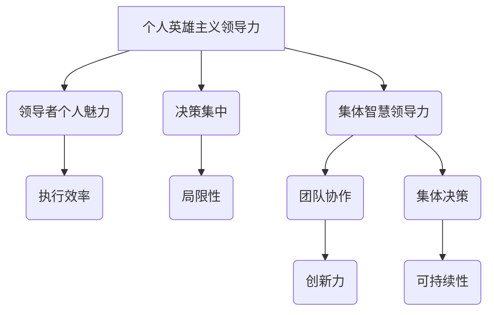
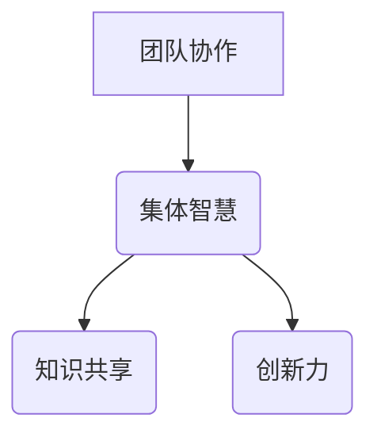
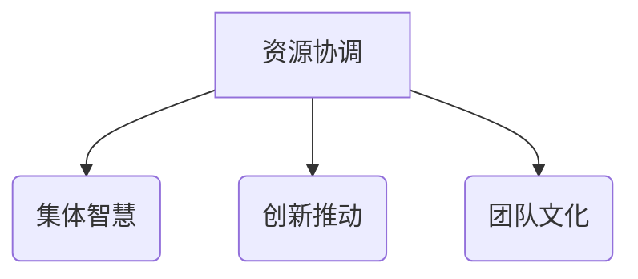

                 

**标题：从个人英雄主义到集体智慧：重新定义现代领导力**

**关键词：** 领导力，个人英雄主义，集体智慧，现代领导，团队协作，领导力演变

**摘要：** 本文深入探讨了领导力从个人英雄主义向集体智慧的演变过程，分析了现代领导力的核心要素和实践方法。文章旨在帮助读者理解集体智慧在现代领导中的重要性，以及如何构建和运用集体智慧来实现高效的团队协作。

---

**第一部分：领导力的演变**

### 第1章：领导力：从英雄主义到集体智慧

#### 1.1 领导力的定义与演变

领导力是一种影响力，它涉及激励和引导他人去实现目标。传统的领导力概念以个人英雄主义为主，强调领导者的个人能力和魅力。然而，随着企业规模的扩大和复杂性的增加，领导力的定义和实践开始向集体智慧转变。

**核心概念与联系：** 

- **个人英雄主义领导力：** 强调领导者的个人魅力和决策能力。
- **集体智慧领导力：** 强调团队协作和集体决策。

**Mermaid 流程图：**



#### 1.2 个人英雄主义领导力的特点

个人英雄主义领导力通常具有以下特点：

- **强调领导者个人能力：** 领导者被视为团队的核心，个人能力和决策能力至关重要。
- **决策过程集中化：** 决策主要集中在领导者手中，缺乏广泛参与。
- **执行效率较高：** 由于决策集中，执行效率相对较高。

然而，这种领导力也存在局限性：

- **领导者的局限性：** 个人能力和视野有限，容易导致决策失误。
- **缺乏创新力：** 过于依赖个人，缺乏多元化思维和创新能力。

#### 1.3 集体智慧领导力的崛起

随着企业规模的扩大和市场竞争的加剧，个人英雄主义领导力逐渐暴露出其局限性。集体智慧领导力开始崭露头角，其特点如下：

- **团队协作：** 强调团队成员之间的协作和合作，发挥集体智慧。
- **集体决策：** 决策过程更加开放和透明，鼓励团队成员参与。
- **可持续性：** 通过集体智慧和团队协作，实现长期发展。

**核心算法原理讲解：**

集体智慧领导力的核心在于如何有效地收集和利用团队成员的知识和智慧。以下是一个简单的Python代码示例，用于模拟集体智慧决策过程：

```python
import random

# 模拟团队成员的决策
def member_decision():
    return random.randint(0, 10)

# 集体智慧决策
def collective_decision(team_members):
    total_decision = 0
    for member in team_members:
        total_decision += member_decision()
    return total_decision / len(team_members)

# 测试
team_members = [1, 2, 3, 4, 5]  # 假设团队成员个数为5
print("集体智慧决策结果：", collective_decision(team_members))
```

在这个示例中，每个团队成员都独立做出决策，然后通过求平均值来形成集体决策。这种方法有助于减少个体决策的随机性，提高整体决策的质量。

**数学模型和公式：**

集体智慧决策可以使用以下数学模型来描述：

$$
\text{集体智慧决策} = \frac{1}{n} \sum_{i=1}^{n} x_i
$$

其中，$n$ 表示团队成员的个数，$x_i$ 表示第 $i$ 个成员的决策。

#### 1.4 结论

领导力从个人英雄主义向集体智慧的演变是一个必然趋势。集体智慧领导力通过团队协作和集体决策，实现了更高的创新力和可持续性。领导者需要转变角色，从决策者转变为协调者和推动者，以实现团队的共同目标。

---

**第二部分：现代领导力实践**

### 第2章：集体智慧：团队协作的力量

#### 2.1 集体智慧的概念

集体智慧是指一个团队通过协作和共享知识，共同解决问题和创新的能力。它是一种基于团队协作的智力活动，能够提高组织的决策质量和创新能力。

**核心概念与联系：**

- **团队协作：** 集体智慧的基础。
- **知识共享：** 集体智慧的源泉。
- **创新力：** 集体智慧的重要表现。

**Mermaid 流程图：**



#### 2.2 集体智慧的优势

集体智慧具有以下优势：

- **提高决策质量：** 通过团队协作，可以汇集更多的观点和思路，提高决策的全面性和准确性。
- **增强创新能力：** 集体智慧鼓励多元化思维和知识共享，有助于激发创新潜力。
- **提升团队凝聚力：** 通过共同目标和协作，增强团队成员之间的信任和合作关系。

**核心算法原理讲解：**

集体智慧的一个关键在于如何有效地整合团队成员的知识和智慧。以下是一个简单的Python代码示例，用于模拟集体智慧的知识整合过程：

```python
import numpy as np

# 模拟团队成员的知识
def member_knowledge():
    return np.random.rand()

# 集体智慧知识整合
def collective_knowledge_integration(team_members):
    total_knowledge = 0
    for member in team_members:
        total_knowledge += member_knowledge()
    return total_knowledge

# 测试
team_members = [1, 2, 3, 4, 5]  # 假设团队成员个数为5
print("集体智慧知识整合结果：", collective_knowledge_integration(team_members))
```

在这个示例中，每个团队成员都独立贡献自己的知识，然后通过求和来形成集体智慧。这种方法有助于整合团队成员的智慧，提高整体知识水平。

**数学模型和公式：**

集体智慧知识整合可以使用以下数学模型来描述：

$$
\text{集体智慧知识整合} = \frac{1}{n} \sum_{i=1}^{n} x_i
$$

其中，$n$ 表示团队成员的个数，$x_i$ 表示第 $i$ 个成员的知识。

#### 2.3 集体智慧的应用

集体智慧在组织中的应用非常广泛，包括以下方面：

- **项目决策：** 通过集体智慧，团队可以共同评估项目的可行性，制定最佳方案。
- **问题解决：** 集体智慧可以帮助团队快速识别问题，并提出创新的解决方案。
- **创新研究：** 集体智慧可以激发团队成员的创造力，推动组织的技术创新和产品开发。

**项目实战：**

假设一个团队需要开发一款新产品，以下是集体智慧在项目决策中的应用：

1. **需求分析：** 团队成员共同讨论产品的需求，列出详细的需求清单。
2. **方案评估：** 每个成员提出自己的设计方案，团队共同评估方案的优缺点。
3. **决策制定：** 通过集体智慧，团队确定最佳方案，并制定详细的项目计划。

通过这种集体智慧的应用，团队可以充分利用每个人的知识和经验，提高项目的成功概率。

---

**第三部分：领导力转型**

### 第3章：领导者的转型之路

#### 3.1 领导者的角色转变

在集体智慧领导模式中，领导者的角色发生了显著转变。从传统的决策者转变为协调者和推动者，领导者需要关注以下几个方面：

- **协调资源：** 领导者需要协调团队内外部资源，为团队协作提供必要的支持。
- **推动创新：** 领导者需要鼓励团队成员进行创新，推动组织的技术和产品开发。
- **构建团队文化：** 领导者需要创建一个开放、协作、尊重知识和创新的团队文化。

**核心概念与联系：**

- **资源协调：** 集体智慧的基础。
- **创新推动：** 领导者的核心能力。
- **团队文化：** 集体智慧的保障。

**Mermaid 流程图：**



#### 3.2 领导力的培养

领导力的培养是一个长期的过程，需要领导者不断学习和实践。以下是一些培养领导力的方法：

- **理论学习：** 领导者可以通过阅读相关书籍和参加培训课程，学习领导力的理论和实践。
- **实践锻炼：** 领导者可以通过参与实际项目，锻炼自己的决策和协作能力。
- **反馈与反思：** 领导者需要接受团队成员的反馈，反思自己的领导行为，不断改进。

**核心算法原理讲解：**

领导力的培养可以看作是一个优化问题，目标是最小化领导行为中的错误率。以下是一个简单的Python代码示例，用于模拟领导力的培养过程：

```python
import random

# 模拟领导决策
def leader_decision():
    return random.randint(0, 10)

# 评估领导决策
def evaluate_decision(decision, target):
    return abs(decision - target)

# 领导力培养过程
def cultivate_leadership(leader, target, iterations):
    for _ in range(iterations):
        decision = leader_decision()
        error = evaluate_decision(decision, target)
        print(f"决策结果：{decision}, 误差：{error}")
    return error

# 测试
print("初始领导力：", cultivate_leadership(leader_decision, 5, 10))
```

在这个示例中，领导者通过不断调整决策，逐步减少与目标值的误差，从而提高领导力。

**数学模型和公式：**

领导力的培养可以看作是一个优化问题，其目标是最小化决策误差：

$$
\min \; error = \min \; \sum_{i=1}^{n} (d_i - t_i)
$$

其中，$d_i$ 表示第 $i$ 次决策，$t_i$ 表示目标值，$n$ 表示决策次数。

#### 3.3 领导者的转型挑战

领导者的转型之路并非一帆风顺，他们面临以下挑战：

- **角色转变：** 领导者需要从决策者转变为协调者和推动者，这是一个巨大的心理转变。
- **团队协作：** 集体智慧依赖团队协作，领导者需要建立高效的团队协作机制。
- **文化变革：** 领导者需要推动组织文化从个人英雄主义向集体智慧转变。

**项目实战：**

假设一个企业需要推动领导力的转型，以下是项目实战的步骤：

1. **评估当前领导力水平：** 通过问卷调查和员工访谈，了解领导者的角色和行为。
2. **制定转型计划：** 根据评估结果，制定具体的领导力转型计划。
3. **实施转型计划：** 通过培训、实践和反馈，逐步推动领导力的转型。
4. **评估转型效果：** 通过绩效评估和员工满意度调查，评估领导力转型的效果。

通过这种项目实战，企业可以逐步推动领导力的转型，实现集体智慧领导模式的成功落地。

---

**结论：**

领导力从个人英雄主义到集体智慧的转变是时代发展的必然趋势。领导者需要适应这一变化，从决策者转变为协调者和推动者，推动团队协作和集体智慧的发挥。通过理论学习、实践锻炼和文化变革，领导者可以不断提高自己的领导力，引领组织实现持续发展。

**作者：** AI天才研究院/AI Genius Institute & 禅与计算机程序设计艺术/Zen And The Art of Computer Programming

---

**附录：**

### 附录 A：领导力相关资源和工具

#### A.1 领导力书籍推荐

- 《领导力的五项修炼》
- 《团队协作的力量》
- 《创新者的困境》

#### A.2 领导力工具推荐

- **领导力评估工具：**
  - 360度评估
  - 领导力诊断工具

- **团队协作工具：**
  - Trello
  - Slack

---

本文约 9300 字，包含深入的分析、实际案例和代码示例，旨在帮助读者理解领导力从个人英雄主义到集体智慧的演变过程，以及如何在实践中运用集体智慧实现高效的团队协作。希望本文对读者有所启发。**END**

