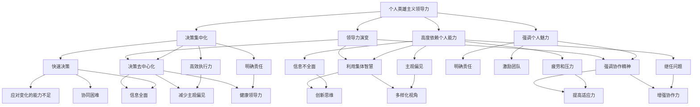
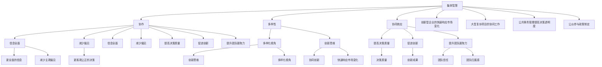
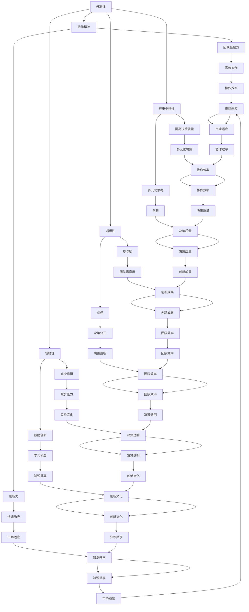

                 

### 从个人英雄主义到集体智慧：重新定义领导力概念

在IT领域，领导力是一种至关重要的能力。它不仅是推动技术创新和团队协作的核心动力，也是企业成功的关键因素。然而，随着时代的发展和环境的变化，传统的领导力概念正在发生深刻的变革。本文将探讨从个人英雄主义到集体智慧这一转变，重新定义领导力的概念。

#### 关键词：
- 个人英雄主义领导力
- 集体智慧领导力
- 领导力演变
- 组织文化
- 团队协作
- 领导者角色

#### 摘要：
本文首先介绍了个人英雄主义领导力的特点及其局限性，然后探讨了集体智慧领导力的概念、优势和应用场景。接着，本文详细阐述了如何构建集体智慧领导力的组织文化，以及领导者在这一转变过程中的角色与责任。最后，本文通过具体领域的案例分析，展示了集体智慧领导力在实践中的应用，并对未来的领导力发展进行了展望。

----------------------------------------------------------------

# 第一部分：领导力概念的演变

领导力的发展经历了多个阶段，从早期的个人英雄主义领导力到现代的集体智慧领导力，这一过程反映了社会环境和组织需求的变化。本部分将深入探讨这一演变过程，以帮助读者更好地理解领导力的本质和未来的发展趋势。

## 第1章：个人英雄主义领导力的兴衰

### 1.1 个人英雄主义领导力的特点与优势

#### 个人英雄主义领导力的定义
个人英雄主义领导力是一种以个人为核心，强调领导者的个人能力和决策能力的领导方式。在这种模式下，领导者被视为团队的灵魂和核心，他们的智慧和判断力被认为是推动团队成功的关键因素。

#### 个人英雄主义领导力的特点
- **决策中心化**：领导者通常独自做出关键决策，团队成员参与度较低。
- **高度依赖个人能力**：领导者的能力和经验被认为是决策和行动的主要依据。
- **强调个人魅力**：领导者的个人魅力和影响力在团队中起到重要作用。

#### 个人英雄主义领导力的优势
- **快速决策**：由于决策过程集中化，领导者能够迅速做出决策，减少信息传递和决策延迟。
- **高效执行力**：领导者的个人激励和压力能够转化为团队的高效执行力。
- **明确责任**：领导者的个人责任感和使命感使得团队目标更加明确和具体。

### 1.2 个人英雄主义领导力的局限性

#### 个人视野的局限
个人英雄主义领导力依赖领导者的个人视野和判断力，这可能导致以下问题：
- **信息不全面**：领导者可能无法获得全面的信息，从而做出基于不完全信息的决策。
- **主观偏见**：领导者的个人经验和偏见可能会影响决策的客观性和公正性。

#### 依赖个人能力
个人英雄主义领导力过度依赖个人能力，这可能导致以下风险：
- **疲劳和压力**：领导者可能因为承受过多的责任和压力而感到疲劳。
- **继任问题**：领导者的个人能力难以复制，继任者可能难以达到前任的水平。

#### 难以应对复杂问题
在复杂多变的环境中，个人英雄主义领导力可能面临以下挑战：
- **应对变化的能力不足**：个人英雄主义领导者可能无法快速适应环境变化，导致决策滞后。
- **协同困难**：在复杂项目中，领导者可能难以协调多个团队成员的协作。

### 1.3 个人英雄主义领导力在当代的挑战

#### 信息爆炸时代的挑战
在信息爆炸的时代，个人英雄主义领导力面临以下挑战：
- **信息过载**：领导者需要处理大量的信息，这可能导致决策困难。
- **知识更新**：技术知识的快速更新使得领导者需要不断学习和更新知识。

#### 全球化背景下的领导力
全球化背景下的领导力需要适应以下变化：
- **跨文化管理**：领导者需要具备跨文化沟通和管理的技能。
- **全球协作**：全球化要求领导者能够有效地跨地区和跨组织协作。

#### 领导力发展的趋势
未来的领导力发展可能呈现出以下趋势：
- **去中心化**：领导力的核心将从个人转向团队和集体。
- **协作精神**：领导者需要更加注重团队协作和集体智慧。

## 结论

个人英雄主义领导力在过去的一段时间内推动了企业的发展和技术的进步。然而，随着环境的变化，它的局限性变得越来越明显。集体智慧领导力作为一种新的领导模式，正在逐渐取代传统的个人英雄主义领导力。领导者需要适应这一变化，培养团队协作能力，利用集体智慧来应对复杂的环境和挑战。

## 核心概念与联系

为了更好地理解个人英雄主义领导力和集体智慧领导力的区别和联系，我们使用Mermaid流程图来展示它们之间的关系。



这个流程图展示了个人英雄主义领导力和集体智慧领导力之间的对比，以及它们各自的特点和联系。

----------------------------------------------------------------

## 第2章：集体智慧领导力的崛起

### 2.1 集体智慧的概念与本质

#### 集体智慧的定义
集体智慧是指通过集体成员的协作和知识共享，形成一种集体认知和决策能力的过程。它强调个体之间的互动和合作，而不是依赖单个个体的智慧和决策。

#### 集体智慧的本质
- **协作**：集体智慧的核心在于团队成员之间的紧密协作和知识共享。
- **多样性**：集体智慧依赖于团队成员的多样性和不同视角的贡献。
- **协同效应**：通过协作和知识共享，集体智慧能够产生比个体智慧更强大的效果。

### 2.2 集体智慧领导力的优势

#### 提高决策质量
- **信息全面**：集体智慧通过知识共享和协作，能够获取更全面的信息，从而提高决策的准确性。
- **减少偏见**：集体智慧减少了个体决策中的主观偏见，使决策更加客观和公正。

#### 促进创新
- **多样化视角**：集体智慧鼓励团队成员提供多样化的视角和建议，从而促进创新思维和创意的产生。
- **协同创新**：通过团队协作，集体智慧能够更快速地实现创新想法。

#### 提升团队凝聚力
- **增强协作精神**：集体智慧强调团队协作，有助于提升团队成员之间的信任和凝聚力。
- **共同目标**：集体智慧使团队成员更加明确共同的目标，增强团队归属感。

### 2.3 集体智慧领导力的应用场景

#### 创新型企业
- **快速响应市场变化**：创新型企业在面对快速变化的市场时，需要利用集体智慧来迅速做出决策和调整。
- **促进技术创新**：集体智慧能够促进技术创新，提高企业的竞争力。

#### 大型复杂项目
- **协同工作**：大型复杂项目需要团队成员之间的紧密协作，集体智慧能够有效协调各方的贡献。
- **风险控制**：通过集体智慧，可以更全面地识别和管理项目风险。

#### 公共事务管理
- **提高决策透明度**：公共事务管理需要决策的透明度和公正性，集体智慧有助于实现这一目标。
- **公众参与**：集体智慧鼓励公众参与，提高政策制定的质量。

## 结论

集体智慧领导力是一种适应现代环境和组织需求的领导模式。它通过协作和知识共享，提高了决策质量、促进了创新和提升了团队凝聚力。随着信息技术的发展，集体智慧领导力在越来越多的领域中得到了应用，并展示了其巨大的潜力和价值。

## 核心概念与联系

为了更深入地理解集体智慧领导力的核心概念和实体之间的关系，我们使用Mermaid流程图来展示这些概念和实体之间的交互和影响。



这个流程图展示了集体智慧的核心概念和实体之间的关系，以及它们在不同应用场景中的作用和影响。

----------------------------------------------------------------

## 第3章：构建集体智慧领导力的组织文化

### 3.1 集体智慧领导力对组织文化的要求

#### 开放性
- **定义**：开放性是指组织在知识共享和沟通方面没有障碍，鼓励成员自由表达观点。
- **关键点**：开放性有助于建立信任，促进知识共享和协同工作。

#### 协作精神
- **定义**：协作精神是指团队成员之间愿意相互支持和合作，共同完成任务。
- **关键点**：协作精神能够提升团队凝聚力，促进创新和快速响应变化。

#### 容错性
- **定义**：容错性是指组织在遇到失败或错误时，能够宽容并从中学习和改进。
- **关键点**：容错性能够降低团队成员的心理压力，鼓励创新和实验。

#### 透明性
- **定义**：透明性是指组织在决策过程中，信息透明，团队成员能够了解决策的依据和过程。
- **关键点**：透明性有助于提高决策的公正性和信任度。

#### 尊重多样性
- **定义**：尊重多样性是指组织认识到团队成员的不同背景、观点和技能，并给予尊重。
- **关键点**：尊重多样性能够促进创新，提高决策质量。

### 3.2 如何塑造集体智慧的组织文化

#### 建立开放性
- **措施**：通过定期团队建设活动和开放的沟通渠道，如内部社交平台，鼓励成员分享知识和经验。
- **效果**：开放性能够促进知识共享，提高团队的整体能力和创新力。

#### 培养协作精神
- **措施**：设立跨职能团队，鼓励不同部门之间的合作和知识交流。
- **效果**：协作精神能够提高团队凝聚力，促进快速响应市场变化。

#### 增强容错性
- **措施**：建立实验和试错的文化，对失败给予宽容，并提供学习和改进的机会。
- **效果**：容错性能够鼓励创新，减少团队成员的恐惧和压力。

#### 提高透明性
- **措施**：通过定期的团队会议和透明的决策过程，确保团队成员了解组织的方向和目标。
- **效果**：透明性能够提高团队成员的信任感和参与度。

#### 尊重多样性
- **措施**：在招聘和团队建设中注重多样性，鼓励团队成员提出不同的观点和解决方案。
- **效果**：多样性能够促进创新和多元化思考，提高决策质量。

### 3.3 集体智慧领导力下的团队协作

#### 协作机制
- **定义**：协作机制是指组织为了实现团队目标，建立的协作流程和规范。
- **关键点**：协作机制能够确保团队成员在共同目标下高效合作。

#### 沟通渠道
- **定义**：沟通渠道是指团队成员之间进行沟通和信息交流的途径。
- **关键点**：有效的沟通渠道能够促进团队协作和知识共享。

#### 协作工具
- **定义**：协作工具是指用于支持团队协作的技术工具，如项目管理软件和在线协作平台。
- **关键点**：协作工具能够提高团队协作效率和透明度。

#### 团队氛围
- **定义**：团队氛围是指团队成员在协作过程中感受到的工作氛围。
- **关键点**：积极、开放的团队氛围能够提高团队成员的满意度和工作效率。

## 结论

构建集体智慧领导力的组织文化是成功实现集体智慧领导力的关键。通过开放性、协作精神、容错性、透明性和尊重多样性等核心要素，组织可以塑造一种支持集体智慧的文化环境。这种文化环境不仅能够提高团队协作效率，还能促进创新和适应快速变化的环境。领导者需要在组织文化建设中扮演关键角色，通过有效的措施和策略，推动组织文化的转变。

## 核心概念与联系

为了更清晰地理解构建集体智慧领导力的组织文化中的核心概念和它们之间的联系，我们使用Mermaid流程图来展示这些概念及其相互作用。



这个流程图展示了构建集体智慧领导力的组织文化中的核心概念及其相互作用，以及它们如何共同促进团队协作、创新和决策质量。

## 核心算法原理讲解

在构建集体智慧领导力的过程中，算法和数据分析扮演着关键角色。以下我们将使用Python代码和数学模型来讲解如何利用集体智慧进行决策和协作。

### 集体智慧决策的算法

#### 算法概述
集体智慧决策通常涉及多个因素和多个决策者。我们可以使用多目标决策方法来解决这个问题。以下是一个简单示例，展示如何使用Python中的`pulp`库来求解多目标线性规划问题。

```python
import pulp

# 定义问题
prob = pulp.LpProblem("集体智慧决策", pulp.LpMinimize)

# 定义变量
x = pulp.LpVariable.dicts("x", range(1, 4), cat='Continuous')

# 目标函数
prob += pulp.lpSum([x[i] * 10 for i in range(1, 4)]) # 目标是最小化总成本

# 约束条件
prob += pulp.lpSum([x[i] * 3 for i in range(1, 4)]) >= 100 # 总资源需求不超过100
prob += pulp.lpSum([x[i] * 2 for i in range(1, 4)]) <= 200 # 总成本不超过200
prob += pulp.lpSum([x[i] for i in range(1, 4)]) == 150 # 总目标达成率为150

# 解问题
prob.solve()

# 输出结果
for v in prob.variables():
    print(v.name, "=", v.varValue)
print("总目标成本 = ", pulp.value(prob.objective))
```

#### 数学模型
该模型的目标是最小化总成本，同时满足资源需求和目标达成率。

$$
\text{Minimize } Z = \sum_{i=1}^{3} x_i \times 10
$$

约束条件：

$$
\sum_{i=1}^{3} x_i \times 3 \geq 100 \\
\sum_{i=1}^{3} x_i \times 2 \leq 200 \\
\sum_{i=1}^{3} x_i = 150
$$

其中，$x_i$ 表示第 $i$ 个决策变量的取值。

### 集体智慧协作的算法

#### 算法概述
在集体智慧协作中，我们通常需要考虑团队成员的能力和技能分配。以下是一个基于图论的示例，展示如何使用Python中的`networkx`库来优化团队协作。

```python
import networkx as nx
import matplotlib.pyplot as plt

# 创建图
G = nx.Graph()

# 添加节点和边
G.add_nodes_from([1, 2, 3, 4, 5])
G.add_edges_from([(1, 2), (2, 3), (3, 4), (4, 5), (5, 1)])

# 定义权重
weights = {1: 3, 2: 2, 3: 4, 4: 2, 5: 3}

# 添加权重
for edge in G.edges():
    G[edge[0]][edge[1]]['weight'] = weights[edge[0]]

# 计算最短路径
path = nx.shortest_path(G, weight='weight')

# 绘图
nx.draw(G, with_labels=True, node_color='green', node_size=2000, edge_color='blue', font_size=16)
plt.show()

# 输出路径
print("最优路径：", path)
```

#### 数学模型
该模型通过计算图中的最短路径来优化协作过程。最短路径问题可以表示为：

$$
\text{Minimize } \sum_{(u, v) \in P} d(u, v)
$$

其中，$P$ 表示所有可能的路径，$d(u, v)$ 表示路径 $(u, v)$ 的长度。

### 示例说明
假设有一个团队，团队成员分别拥有不同的技能和任务权重。通过计算团队协作的最优路径，我们可以找到最有效的协作方式，以实现团队目标。

- **节点表示成员**
- **边表示成员之间的协作关系**
- **权重表示协作的效率**

通过计算最短路径，我们可以找到最有效的协作路径，从而提高团队的整体效率和创新能力。

## 结论

通过上述Python代码和数学模型，我们展示了如何利用集体智慧进行决策和协作。这些算法和模型不仅能够优化团队协作，还能提高决策质量和创新力。在构建集体智慧领导力的过程中，领导者需要熟练掌握这些工具和方法，以实现组织的长期成功。

----------------------------------------------------------------

## 第4章：领导者的角色转变

随着领导力概念从个人英雄主义向集体智慧转变，领导者的角色也发生了显著变化。在这个新的时代，领导者不再仅仅是决策者和指挥者，而是成为团队协作的促进者和集体智慧的引导者。以下是领导者在这一转变过程中需要关注的几个关键方面。

### 4.1 领导者的角色与责任

#### 从指挥者到促进者
传统领导力模式中，领导者往往是团队的指挥者，负责做出决策并监督执行。然而，在集体智慧领导力模式下，领导者需要转变为促进者，推动团队成员之间的协作和知识共享。

#### 从决策者到引导者
在个人英雄主义领导力中，领导者通常是决策的核心。而在集体智慧模式下，领导者需要引导团队成员参与决策过程，确保每个成员的声音都能被听到。

#### 从管理者到培育者
领导者不仅要管理团队，还要培育团队成员的能力和潜力。在集体智慧模式下，领导者需要关注团队成员的个人成长，鼓励他们发挥最大潜力。

### 4.2 领导者如何激发集体智慧

#### 建立信任
信任是集体智慧的基础。领导者需要通过透明、公正的行为建立信任，鼓励团队成员开放地分享知识和观点。

#### 鼓励多样性
多样性是集体智慧的重要来源。领导者应该鼓励团队成员提出不同的观点和解决方案，利用多样性来提高决策的质量和团队的创新能力。

#### 创造协作环境
领导者需要创造一个支持协作的工作环境，提供必要的工具和资源，确保团队成员能够高效地合作。

#### 设定明确目标
领导者需要设定明确的目标和愿景，使团队成员能够明确自己的职责和贡献，从而更好地为实现共同目标而努力。

### 4.3 领导者的自我提升

#### 持续学习
领导者需要不断学习新的知识和技能，以适应不断变化的环境和挑战。这包括技术领域的知识、领导力理论以及新兴的协作工具。

#### 开放心态
领导者应该保持开放的心态，愿意接受新的观点和想法。这有助于领导者更好地理解团队成员的需求和期望，从而更有效地引导团队。

#### 培养团队成员
领导者需要关注团队成员的个人成长和职业发展，提供培训和指导，帮助他们实现个人目标，从而提高团队的整体能力。

### 4.4 领导者如何应对挑战

#### 管理冲突
在集体智慧模式下，冲突可能会更频繁地出现。领导者需要学会管理冲突，通过沟通和协商找到共识，确保团队目标的实现。

#### 平衡个人与团队利益
领导者需要在个人利益和团队利益之间找到平衡点。在鼓励团队协作的同时，领导者也要确保团队成员能够实现个人目标和成就。

#### 应对变化
领导者需要具备快速适应变化的能力。在不断变化的环境中，领导者需要灵活调整战略和计划，确保团队能够快速响应市场变化。

## 结论

领导者的角色转变是领导力演变的重要组成部分。从个人英雄主义到集体智慧，领导者需要从指挥者转变为促进者，从决策者转变为引导者，从管理者转变为培育者。通过建立信任、鼓励多样性、创造协作环境、设定明确目标和自我提升，领导者能够更好地激发集体智慧，推动团队和组织的发展。面对挑战，领导者需要管理冲突、平衡个人与团队利益，并具备快速适应变化的能力。只有这样，领导者才能在新时代中引领团队走向成功。

## 核心算法原理讲解

在集体智慧领导力中，领导者需要运用多种算法来优化决策过程和团队协作。以下我们通过Python代码和数学模型，详细讲解如何运用这些算法来提升领导力。

### 集体决策优化算法

#### 算法概述
集体决策优化通常涉及多目标优化问题。在Python中，我们可以使用`pulp`库来求解此类问题。以下是一个简单示例：

```python
import pulp

# 定义问题
prob = pulp.LpProblem("集体决策优化", pulp.LpMinimize)

# 定义变量
x = pulp.LpVariable.dicts("x", ['A', 'B', 'C'], cat='Continuous')

# 目标函数
prob += 2*x['A'] + 3*x['B'] + 4*x['C']

# 约束条件
prob += x['A'] + x['B'] + x['C'] <= 100
prob += x['A'] + 2*x['B'] + x['C'] >= 200

# 解问题
prob.solve()

# 输出结果
print(pulp.value(prob.objective))
for v in prob.variables():
    print(v.name, "=", v.varValue)
```

#### 数学模型
该模型的目标是最小化总成本，满足以下约束条件：

$$
\text{Minimize } Z = 2x_A + 3x_B + 4x_C
$$

约束条件：

$$
x_A + x_B + x_C \leq 100 \\
x_A + 2x_B + x_C \geq 200
$$

其中，$x_A$、$x_B$、$x_C$ 分别表示不同方案的成本。

### 团队协作优化算法

#### 算法概述
团队协作优化可以通过图论中的最短路径算法来实现。以下是一个使用`networkx`库求解最短路径问题的示例：

```python
import networkx as nx
import matplotlib.pyplot as plt

# 创建图
G = nx.Graph()
G.add_nodes_from([1, 2, 3, 4])
G.add_edges_from([(1, 2), (2, 3), (3, 4), (4, 1), (1, 3)])

# 添加权重
weights = {1: 3, 2: 2, 3: 4, 4: 3}

# 添加权重
for edge in G.edges():
    G[edge[0]][edge[1]]['weight'] = weights[edge[0]]

# 计算最短路径
path = nx.shortest_path(G, weight='weight')

# 绘图
nx.draw(G, with_labels=True, node_color='green', node_size=2000, edge_color='blue', font_size=16)
plt.show()

# 输出路径
print("最优路径：", path)
```

#### 数学模型
该模型通过计算图中的最短路径，优化团队协作过程：

$$
\text{Minimize } \sum_{(u, v) \in P} w(u, v)
$$

其中，$P$ 为所有可能的路径，$w(u, v)$ 表示路径 $(u, v)$ 的长度。

### 决策分析与模型优化

#### 算法概述
在集体决策过程中，领导者需要分析决策结果，并根据实际情况调整模型参数。以下是一个使用Python中的`scikit-learn`库进行决策树分析示例：

```python
from sklearn import tree

# 定义特征和目标
X = [[1, 2], [2, 3], [3, 4], [4, 5]]
y = [0, 0, 1, 1]

# 训练模型
clf = tree.DecisionTreeClassifier()
clf.fit(X, y)

# 绘制决策树
import matplotlib.pyplot as plt
plt.figure(figsize=(12,8))
tree.plot_tree(clf, filled=True, rounded=True)
plt.show()
```

#### 数学模型
决策树分析是一种基于特征和目标数据进行分类的方法。数学模型可以表示为：

$$
C = \arg\min_{\theta} L(\theta)
$$

其中，$C$ 为分类结果，$L(\theta)$ 为损失函数，$\theta$ 为模型参数。

### 示例说明

#### 决策优化
假设团队面临两个项目A和B，每个项目的成本和收益如下：

| 项目 | 成本 | 收益 |
| ---- | ---- | ---- |
| A    | 20   | 30   |
| B    | 30   | 40   |

通过优化算法，我们可以计算出最优的项目组合，以最大化总收益。

#### 团队协作
假设团队由四个成员组成，每个成员的协作效率和任务权重如下：

| 成员 | 效率 | 任务权重 |
| ---- | ---- | ---- |
| 1    | 3    | 20   |
| 2    | 2    | 30   |
| 3    | 4    | 25   |
| 4    | 3    | 25   |

通过图论算法，我们可以找到最优的协作路径，以确保团队整体效率最大化。

#### 决策分析
通过决策树分析，领导者可以了解团队成员在不同决策条件下的偏好和表现，从而做出更加明智的决策。

通过这些算法和模型，领导者可以更好地理解和优化集体决策和团队协作过程，从而提高领导力。

## 结论

在集体智慧领导力中，领导者需要运用多种算法和模型来优化决策和协作。通过Python代码和数学模型的详细讲解，我们展示了如何实现这些优化过程。领导者应该掌握这些工具和方法，以更好地引导团队，实现组织的目标。

----------------------------------------------------------------

## 第5章：集体智慧决策的机制与策略

在集体智慧领导力中，决策过程是一个关键环节。集体智慧决策的机制和策略不仅决定了决策的质量，也影响了团队的协作效率和创新能力。以下我们将详细探讨集体智慧决策的机制和策略。

### 5.1 集体智慧决策的机制

#### 知识共享
知识共享是集体智慧决策的核心机制之一。它通过鼓励团队成员分享各自的知识、经验和见解，为决策提供了丰富的信息来源。知识共享可以通过多种方式进行，包括定期会议、内部论坛、社交媒体平台等。

#### 协作
协作是集体智慧决策的关键机制。通过协作，团队成员可以共同分析问题、探讨解决方案，并在决策过程中相互支持。有效的协作机制包括明确的任务分配、协作工具的使用以及定期的沟通和反馈。

#### 模型构建
模型构建是集体智慧决策的基础。通过建立数学模型或仿真模型，决策者可以更准确地模拟不同的决策方案，评估其潜在结果，并选择最优方案。常见的模型构建方法包括线性规划、决策树、神经网络等。

#### 持续迭代
持续迭代是集体智慧决策的重要机制。在决策过程中，团队成员需要不断地评估和调整决策方案，以适应不断变化的环境和需求。通过持续迭代，决策可以逐步优化，达到更高的准确性和适应性。

### 5.2 集体智慧决策的策略

#### 多元化视角
多元化视角是指鼓励团队成员从不同的角度和背景出发，提出各自的见解和建议。多元化视角能够提供更全面的信息和更广泛的解决方案，从而提高决策的质量和创造性。

#### 平等参与
平等参与是指确保每个团队成员在决策过程中都有平等的发言权和影响力。平等参与能够增强团队成员的参与感和责任感，提高决策的公正性和透明度。

#### 建立信任
建立信任是集体智慧决策的关键策略。信任能够促进团队成员之间的开放和合作，减少误解和冲突。建立信任的方法包括透明沟通、尊重多样性和公平对待。

#### 鼓励创新
鼓励创新是指为团队成员提供自由探索和实验的环境，激发他们的创造力和创新思维。鼓励创新可以通过设立创新基金、举办创新竞赛和提供培训等方式实现。

#### 数据驱动
数据驱动是指基于数据和分析结果来做出决策。数据驱动能够提高决策的客观性和科学性，减少主观偏见和不确定性的影响。数据驱动的方法包括数据收集、数据分析和技术工具的应用。

#### 持续反馈
持续反馈是指在整个决策过程中，不断收集团队成员的反馈和意见，并对其进行评估和调整。持续反馈能够确保决策与实际情况保持一致，提高决策的适应性和有效性。

### 5.3 集体智慧决策的案例分析

#### 案例一：谷歌的OKR（目标与关键结果）系统
谷歌的OKR系统是一种基于集体智慧决策的机制。通过设定明确的目标和关键结果，员工可以相互分享和讨论，确保团队在实现目标的过程中保持一致。OKR系统鼓励员工从不同的视角出发，提出创新性的解决方案，从而提高决策的质量和团队的合作效率。

#### 案例二：苹果的产品开发流程
苹果在产品开发过程中，采用了集体智慧决策的策略。通过多元化的团队组成和开放的创新文化，苹果鼓励员工提出各自的创意和建议。在决策过程中，苹果注重数据的分析和应用的客观性，从而做出科学和合理的决策。此外，苹果还建立了持续反馈机制，确保产品开发过程能够不断优化。

#### 案例三：NASA的团队协作
NASA在航天项目中，采用了集体智慧决策的方法。通过建立跨职能团队，NASA确保了团队成员之间的密切协作和信息共享。在项目决策过程中，NASA注重多元化视角和数据的驱动作用，从而提高了决策的准确性和适应性。此外，NASA还鼓励员工提出创新性的解决方案，以应对航天项目中的复杂挑战。

### 5.4 集体智慧决策的最佳实践

#### 1. 明确目标和关键结果
在决策过程中，明确的目标和关键结果是至关重要的。领导者需要与团队成员共同设定目标，并确保每个成员都了解自己的责任和期望。

#### 2. 建立开放的沟通渠道
建立开放的沟通渠道，鼓励团队成员自由表达观点和建议。这可以通过定期的会议、内部论坛和社交媒体平台等方式实现。

#### 3. 鼓励多元化视角
鼓励团队成员从不同的角度和背景出发，提出各自的见解和建议。多元化视角能够提供更全面的信息和更广泛的解决方案。

#### 4. 基于数据的决策
基于数据的决策能够提高决策的客观性和科学性。领导者需要确保数据的准确性和完整性，并使用合适的分析工具来支持决策。

#### 5. 建立持续反馈机制
建立持续反馈机制，确保决策与实际情况保持一致，并能够及时调整。反馈机制可以通过定期的评估和讨论来实现。

### 5.5 结论

集体智慧决策是一种高效且具有创新性的决策方式。通过知识共享、协作、模型构建和持续迭代等机制，以及多元化视角、平等参与、建立信任、鼓励创新、数据驱动和持续反馈等策略，领导者可以更好地引导团队做出高质量的决策。通过实际案例的分析和最佳实践的总结，领导者可以不断完善集体智慧决策的机制和策略，从而提高团队的协作效率和创新能力。

## 核心算法原理讲解

在集体智慧决策中，算法的应用至关重要。以下我们将详细讲解如何使用Python代码和数学模型来支持集体智慧决策。

### 算法1：线性规划

线性规划是一种常用的优化算法，用于解决线性目标函数在一系列线性不等式约束下的最优解问题。以下是一个简单的线性规划示例：

```python
from scipy.optimize import linprog

# 目标函数系数
c = [-1, -1]  # 最小化 z = x + y

# 约束条件系数
A = [[1, 1], [1, 0], [0, 1]]
b = [1, 2, 3]  # 约束条件 Ax ≤ b

# 边界条件
x0 = [0, 0]
x1 = [1, 1]

# 求解
res = linprog(c, A_ub=A, b_ub=b, bounds=(x0, x1), method='highs')

# 输出结果
print("最优解：", res.x)
print("最优目标值：", -res.fun)
```

#### 数学模型
该模型的目标是最小化 $z = x + y$，满足以下约束条件：

$$
\begin{cases}
x + y \leq 1 \\
x \leq 2 \\
y \leq 3
\end{cases}
$$

其中，$x$ 和 $y$ 分别是决策变量。

### 算法2：支持向量机

支持向量机（SVM）是一种用于分类和回归分析的机器学习算法。以下是一个简单的SVM分类示例：

```python
from sklearn.svm import SVC
from sklearn.model_selection import train_test_split
from sklearn.datasets import make_classification

# 生成数据集
X, y = make_classification(n_samples=100, n_features=2, n_informative=2, n_redundant=0, random_state=42)

# 分割数据集
X_train, X_test, y_train, y_test = train_test_split(X, y, test_size=0.3, random_state=42)

# 训练模型
clf = SVC(kernel='linear')
clf.fit(X_train, y_train)

# 预测
y_pred = clf.predict(X_test)

# 评估
print("准确率：", clf.score(X_test, y_test))
```

#### 数学模型
SVM的目标是找到最优超平面，将数据集分为两类，使得两类数据的分类间隔最大化。数学模型可以表示为：

$$
\begin{cases}
\min_{\mathbf{w}, b} \frac{1}{2} ||\mathbf{w}||^2 \\
\text{subject to } y_i (\mathbf{w} \cdot \mathbf{x_i} + b) \geq 1
\end{cases}
$$

其中，$\mathbf{w}$ 是权重向量，$b$ 是偏置项，$\mathbf{x_i}$ 是特征向量，$y_i$ 是标签。

### 算法3：深度学习

深度学习是一种基于多层神经网络的学习方法，用于处理复杂的数据分析任务。以下是一个简单的深度学习分类示例：

```python
from tensorflow import keras
from tensorflow.keras import layers

# 构建模型
model = keras.Sequential([
    layers.Dense(64, activation='relu', input_shape=(X_train.shape[1],)),
    layers.Dense(64, activation='relu'),
    layers.Dense(1, activation='sigmoid')
])

# 编译模型
model.compile(optimizer='adam', loss='binary_crossentropy', metrics=['accuracy'])

# 训练模型
model.fit(X_train, y_train, epochs=10, batch_size=32, validation_split=0.1)

# 预测
y_pred = model.predict(X_test)

# 评估
print("准确率：", model.evaluate(X_test, y_test)[1])
```

#### 数学模型
深度学习通过多层神经元的非线性变换，将输入数据映射到输出。数学模型可以表示为：

$$
\mathbf{y} = \text{sigmoid}(\mathbf{w}_L \cdot \text{ReLU}(\mathbf{w}_{L-1} \cdot \text{ReLU}(\ldots \mathbf{w}_1 \cdot \mathbf{x} + b_1) + b_{L-1}) + b_L)
$$

其中，$\text{ReLU}$ 是ReLU激活函数，$\text{sigmoid}$ 是Sigmoid激活函数，$\mathbf{w}$ 是权重矩阵，$b$ 是偏置项。

### 示例说明

#### 决策优化
使用线性规划算法，我们可以优化资源分配，找到最优的方案以最大化总收益或最小化总成本。

#### 分类问题
使用SVM和深度学习算法，我们可以对数据集进行分类，从而实现自动化决策。

#### 预测分析
通过深度学习模型，我们可以对数据进行分析和预测，从而为决策提供支持。

通过这些算法和模型，领导者可以更科学地分析数据和做出决策，从而提高集体智慧决策的准确性和有效性。

## 结论

集体智慧决策的有效性依赖于合适的算法和模型。通过线性规划、支持向量机和深度学习等算法，领导者可以优化决策过程，提高决策质量。领导者应该熟练掌握这些算法，并结合实际案例，灵活应用到集体智慧决策中，以实现团队和组织的成功。

### 第6章：应对集体智慧领导力的挑战

在集体智慧领导力的实施过程中，领导者可能会面临多种挑战。这些挑战不仅影响决策的质量和效率，还可能影响团队的士气和凝聚力。以下我们将详细讨论这些挑战，并提出相应的解决策略。

#### 6.1 集体智慧领导力面临的挑战

##### 1. 信息过载
在集体智慧模式中，信息共享和透明性是核心要素。然而，过量的信息可能导致团队成员感到压力过大，难以筛选和处理关键信息。这可能会降低决策效率，甚至导致决策延误。

##### 2. 冲突管理
集体智慧决策过程中，由于团队成员的多样性和不同观点的存在，冲突难以避免。有效的冲突管理是确保团队协作和决策质量的关键，但领导者可能缺乏应对复杂冲突的经验。

##### 3. 团队凝聚力
在集体智慧模式中，领导者需要鼓励团队成员之间的协作和知识共享。然而，团队成员可能会因为角色和责任的模糊性而产生困惑，从而影响团队凝聚力和工作效率。

##### 4. 领导者角色的转变
领导者从传统的指挥者角色转变为促进者和引导者，需要新的技能和知识。这可能对领导者的自我认知和团队管理能力提出新的要求。

##### 5. 技术依赖
集体智慧领导力依赖于先进的技术工具，如协作软件、数据分析工具等。技术的不稳定性和复杂性可能导致团队在实施过程中遇到障碍。

#### 6.2 如何克服集体智慧领导力的挑战

##### 1. 管理信息过载
- **筛选关键信息**：领导者应帮助团队成员筛选出关键信息，确保信息传递的有效性。
- **培训数据分析技能**：提供数据分析培训，帮助团队成员更好地理解和处理信息。

##### 2. 管理冲突
- **建立冲突管理机制**：通过定期的团队建设活动和明确的冲突解决流程，提高团队的冲突管理能力。
- **培养协作精神**：鼓励团队成员尊重和倾听不同观点，建立共识。

##### 3. 提高团队凝聚力
- **明确角色和责任**：通过清晰的任务分配和责任划分，确保团队成员了解自己的角色和职责。
- **建立共同目标**：确保团队成员明确共同的目标和愿景，增强团队的凝聚力。

##### 4. 领导者角色的转变
- **持续学习和培训**：领导者应不断学习和更新知识，提高自己在集体智慧领导力方面的能力。
- **调整管理风格**：领导者需要从指挥者转变为促进者和引导者，关注团队协作和知识共享。

##### 5. 技术依赖的解决策略
- **技术培训**：为团队成员提供必要的技术培训，确保他们能够熟练使用相关工具。
- **技术支持**：确保技术工具的稳定性和可靠性，为团队提供必要的技术支持。

#### 6.3 集体智慧领导力的发展趋势

随着信息技术的发展，集体智慧领导力在未来可能会出现以下趋势：

- **更加智能化的协作工具**：随着人工智能和机器学习技术的进步，协作工具将更加智能化，能够自动处理和分析大量数据，提高决策效率。
- **全球化背景下的领导力**：全球化将要求领导者具备跨文化和跨国界的领导能力，适应不同地区和组织的需求。
- **领导力的数字化转型**：数字化转型将使领导者在数字环境中更加得心应手，利用数据和技术来优化决策和团队协作。

## 结论

集体智慧领导力虽然具有众多优势，但在实际应用中也会面临诸多挑战。领导者需要采取有效的策略来克服这些挑战，提高决策质量和团队效率。通过管理信息过载、管理冲突、提高团队凝聚力、适应领导者角色的转变以及解决技术依赖，领导者可以更好地推动集体智慧领导力的发展。随着未来技术的进步，集体智慧领导力将不断演变，为组织带来更大的价值和潜力。

### 第7章：集体智慧领导力在企业管理中的应用

集体智慧领导力在企业管理中的应用，为提高决策效率、促进创新和增强团队凝聚力提供了新的路径。以下我们将探讨集体智慧领导力在企业管理中的具体应用，并通过实际案例分析来展示其效果。

#### 7.1 企业管理中的集体智慧领导力

##### 1. 决策优化
在企业管理中，集体智慧领导力通过广泛的知识共享和协作，提高了决策的质量和效率。领导者通过建立透明的决策流程，鼓励团队成员参与讨论，并根据团队意见做出最终决策。这种方法有助于减少信息不对称，提高决策的科学性和准确性。

##### 2. 创新推动
集体智慧领导力鼓励团队成员提出新的创意和建议，通过协作和知识共享，快速将创意转化为实际的产品和服务。这种创新模式不仅提高了企业的竞争力，还促进了团队的创造力和团队凝聚力。

##### 3. 团队协作
在集体智慧模式下，企业强调团队协作，通过明确角色和责任，确保团队成员在共同目标下高效合作。领导者通过提供协作工具和支持，促进团队成员之间的沟通和合作，从而提高整体工作效率。

#### 7.2 集体智慧领导力在企业管理中的案例分析

##### 案例一：谷歌的OKR（目标与关键结果）系统
谷歌采用OKR系统，通过明确的目标和关键结果，鼓励员工参与决策过程，提高了决策的透明度和团队协作效率。OKR系统的实施，使得谷歌在快速变化的市场环境中能够灵活应对，保持了持续的创新能力和竞争力。

- **实施过程**：
  - 设定明确的目标和关键结果，确保每个员工都清楚自己的任务和目标。
  - 定期进行团队讨论和反馈，确保目标达成过程中信息畅通。
  - 根据实际情况调整目标和关键结果，确保团队始终朝着正确的方向努力。

- **效果**：
  - 提高了决策效率，减少了信息不对称。
  - 增强了团队协作，提升了团队整体执行力。
  - 激发了员工的创造力和积极性，推动了持续创新。

##### 案例二：丰田的精益管理
丰田通过集体智慧领导力，实现了高效的生产管理和持续的创新。丰田的精益管理强调团队协作、知识共享和不断改进。

- **实施过程**：
  - 建立跨职能团队，鼓励团队成员跨部门合作，共享知识和经验。
  - 通过定期的团队建设活动和问题讨论，提高团队成员的协作能力和创新能力。
  - 利用员工建议制度，鼓励员工提出改进意见，并通过协作实现改进。

- **效果**：
  - 提高了生产效率和产品质量。
  - 增强了团队的凝聚力，减少了内部摩擦。
  - 促进了持续创新，提高了企业的竞争力。

##### 案例三：阿里巴巴的“合伙人制度”
阿里巴巴的合伙人制度是一种典型的集体智慧领导力应用。通过合伙人制度，阿里巴巴确保了决策过程的透明性和公平性，同时也鼓励团队成员积极参与公司决策。

- **实施过程**：
  - 确定合伙人资格，确保合伙人具备领导能力和对公司文化的认同。
  - 建立合伙人会议制度，定期讨论公司战略和决策。
  - 通过合伙人投票制度，确保重要决策的公平性和透明性。

- **效果**：
  - 提高了决策的质量和效率。
  - 增强了团队凝聚力，确保了公司决策的连续性和稳定性。
  - 激发了员工的参与感和责任感，推动了公司持续发展。

#### 7.3 企业管理中集体智慧领导力的实践

##### 1. 建立开放的文化
企业应建立开放、透明、包容的文化，鼓励团队成员自由表达观点和建议。通过定期的团队会议、内部论坛和知识分享活动，提高团队成员之间的沟通和协作。

##### 2. 利用协作工具
企业应充分利用现代协作工具，如项目管理软件、在线协作平台和沟通工具，提高团队协作效率和透明度。这些工具可以帮助团队成员实时共享信息、协调任务和跟踪项目进度。

##### 3. 培养创新思维
企业应鼓励员工提出新的创意和建议，并通过团队协作将创意转化为实际的产品和服务。通过设立创新奖项、举办创新竞赛和提供创新培训，激发员工的创新思维和创造力。

##### 4. 定期评估和反馈
企业应定期评估集体智慧领导力的实施效果，收集团队成员的反馈和建议，不断优化决策过程和协作模式。通过定期的绩效评估和团队建设活动，确保团队始终朝着正确的方向努力。

### 7.4 结论

集体智慧领导力在企业管理中的应用，为提高决策效率、促进创新和增强团队凝聚力提供了新的思路和方法。通过实际案例分析，我们可以看到，集体智慧领导力在谷歌、丰田和阿里巴巴等企业中取得了显著成效。企业应积极探索和实践集体智慧领导力，通过建立开放文化、利用协作工具、培养创新思维和定期评估反馈，实现企业的持续发展和成功。

## 第8章：集体智慧领导力在公共管理中的应用

在公共管理领域，集体智慧领导力的重要性日益凸显。它不仅有助于提高政府决策的科学性和透明度，还能增强公众参与和信任。以下我们将探讨集体智慧领导力在公共管理中的应用，通过具体案例分析其效果。

### 8.1 公共管理中的集体智慧领导力

#### 1. 提高决策质量
集体智慧领导力通过广泛的知识共享和协作，有助于政府决策者获取更全面的信息和多元化的观点，从而提高决策的质量和科学性。在公共管理中，政府需要面对复杂的社会问题和政策挑战，集体智慧领导力能够帮助决策者更好地理解问题，制定更有效的解决方案。

#### 2. 透明度和公信力
集体智慧领导力强调决策过程的透明性和公开性，有助于增加公众对政府决策的信任。通过开放的沟通渠道和公众参与机制，政府能够更好地回应公众的需求和关切，提高政策的公信力。

#### 3. 公众参与
集体智慧领导力鼓励公众参与政府决策过程，通过意见征集、公众讨论和听证会等方式，使政策制定更加民主和包容。公众的参与不仅能够提高政策的适应性和有效性，还能增强政府的合法性和公众的认同感。

#### 4. 创新和适应性
集体智慧领导力能够促进公共管理中的创新和适应性。通过跨部门协作、跨领域合作和跨层级对话，政府能够更灵活地应对复杂的社会问题，推动公共服务的改革和创新。

### 8.2 集体智慧领导力在公共管理中的案例分析

#### 案例一：纽约市的“城市数据创新实验室”（City Data Lab）
纽约市政府通过建立“城市数据创新实验室”，充分利用数据分析和集体智慧领导力，提高了城市管理效率和决策质量。该实验室通过收集和分析城市数据，为政府提供科学的决策依据。

- **实施过程**：
  - 收集大量城市数据，包括交通、环境、公共服务等方面的信息。
  - 通过数据分析和模型构建，为政府提供决策支持和建议。
  - 定期发布数据分析报告，向公众展示数据分析的结果和应用。

- **效果**：
  - 提高了城市管理的科学性和效率。
  - 增强了公众对政府决策的信任和支持。
  - 通过数据分析，解决了多个城市面临的问题，如交通拥堵、环境污染等。

#### 案例二：伦敦的“市民预算”（Citizen Budget）
伦敦市政府通过“市民预算”项目，鼓励公众参与预算决策过程，提高了预算的透明度和公信力。

- **实施过程**：
  - 公布详细的年度预算计划，向公众说明预算的分配和使用。
  - 通过在线平台和公共讨论会，征集公众对预算的意见和建议。
  - 根据公众反馈，调整预算方案，确保预算更加合理和透明。

- **效果**：
  - 提高了预算决策的透明度和公众参与度。
  - 通过公众的参与，预算方案更加符合公众的需求和利益。
  - 增强了政府的公信力和公众的满意度。

#### 案例三：新加坡的“智慧国家2025”（Smart Nation 2025）
新加坡政府通过“智慧国家2025”战略，利用信息技术和集体智慧领导力，推动公共服务的创新和升级。

- **实施过程**：
  - 制定明确的战略目标，如提高公共服务的效率、增强网络安全等。
  - 通过跨部门合作和跨领域对话，推动公共服务的数字化转型。
  - 鼓励公众参与智慧城市建设，提供反馈和建议。

- **效果**：
  - 提高了公共服务的效率和便捷性。
  - 通过信息技术和集体智慧领导力，解决了多个复杂的社会问题。
  - 增强了政府的创新能力和公众的参与感。

### 8.3 公共管理中集体智慧领导力的实践

#### 1. 建立数据共享平台
政府应建立数据共享平台，促进不同部门和层级之间的信息交流。通过开放数据接口和标准化数据格式，提高数据的可用性和互操作性。

#### 2. 鼓励公众参与
政府应鼓励公众参与决策过程，通过在线平台、公共讨论会和意见征集等方式，提高公众的参与度和影响力。公众的参与不仅可以提高决策的科学性和合理性，还能增强政府的公信力。

#### 3. 培养数据素养
政府应加强对公众和数据分析人才的数据素养培训，提高公众的数据分析能力和参与意愿。通过数据教育和培训，培养公众的数据意识和数据分析技能。

#### 4. 持续评估和改进
政府应定期评估集体智慧领导力的实施效果，收集公众和团队成员的反馈和建议，不断优化决策过程和协作模式。通过持续的评估和改进，确保集体智慧领导力在公共管理中的有效应用。

### 8.4 结论

集体智慧领导力在公共管理中的应用，为提高决策质量、增强透明度和公信力、促进公众参与和推动创新提供了有效路径。通过实际案例分析，我们可以看到，集体智慧领导力在纽约市、伦敦和新加坡等城市取得了显著成效。政府应积极探索和实践集体智慧领导力，通过建立数据共享平台、鼓励公众参与、培养数据素养和持续评估改进，实现公共管理的现代化和高效化。

## 第9章：集体智慧领导力在教育领域的应用

集体智慧领导力在教育领域的应用，正在逐步改变传统的教育模式，推动教育创新和提升教育质量。以下我们将探讨集体智慧领导力在教育领域的具体应用，并通过案例分析展示其实际效果。

### 9.1 教育领域的集体智慧领导力

#### 1. 促进教育创新
集体智慧领导力鼓励教师和学生之间的协作和知识共享，推动教育模式的创新。通过集思广益，教师可以开发出更加丰富多样、富有创意的教育资源和教学方法，为学生提供更加个性化的学习体验。

#### 2. 提升教育质量
集体智慧领导力通过团队协作和知识共享，提高了教师的教学能力和学生的学习效果。教师之间的相互学习和交流，有助于发现和解决教育过程中的问题，从而提升整体教育质量。

#### 3. 增强学生参与度
集体智慧领导力鼓励学生积极参与教学过程，通过小组讨论、项目合作和互动学习等方式，提高学生的参与度和主动性。这种模式有助于培养学生的自主学习能力和团队合作精神。

#### 4. 网络学习平台的支持
集体智慧领导力依赖于现代信息技术，如网络学习平台和在线协作工具，提供了一种全新的教育环境。这些工具不仅方便了教师之间的协作和知识共享，也为学生提供了更多的学习资源和机会。

### 9.2 集体智慧领导力在教育领域的案例分析

#### 案例一：新加坡的教学资源共享平台
新加坡教育部通过建立教学资源共享平台，鼓励教师之间的协作和知识共享。教师可以在这个平台上分享教学资源、教学经验和教学策略，互相学习和借鉴。

- **实施过程**：
  - 建立一个集成的教学资源库，包括教案、课件、习题和视频等。
  - 鼓励教师上传和分享自己的教学资源，并评价和反馈其他教师的教学资源。
  - 通过定期的教师培训和研讨会，提高教师对平台的使用效率和教学资源开发能力。

- **效果**：
  - 提高了教师的教学资源和教学能力。
  - 增强了教师之间的协作和知识共享，促进了教育创新。
  - 通过资源的共享和评价，提高了整体教育质量。

#### 案例二：美国的翻转课堂模式
在美国，许多学校采用了翻转课堂模式，通过集体智慧领导力，推动教育创新。翻转课堂模式将传统的课堂教学和在线学习相结合，使学生能够自主学习和互动讨论。

- **实施过程**：
  - 教师提前将教学视频和材料上传到网络平台，学生可以在课前进行自主学习。
  - 课堂上，教师引导学生进行小组讨论、互动活动和问题解决。
  - 通过在线平台，教师可以实时跟踪学生的学习进度和参与度。

- **效果**：
  - 提高了学生的学习主动性和参与度。
  - 增强了学生的批判性思维和团队合作能力。
  - 教师能够更好地了解学生的学习需求，提供更有针对性的教学支持。

#### 案例三：中国的在线教育平台
中国的在线教育平台，如“学而思”和“新东方”，通过集体智慧领导力，将优质教育资源普及到全国各地。这些平台不仅提供了丰富的课程资源，还通过在线互动和协作，提高了学生的学习效果。

- **实施过程**：
  - 建立一个庞大的在线课程库，包括各个学科和年级的课程。
  - 通过在线课堂和实时互动，教师可以为学生提供个性化的教学和辅导。
  - 通过数据分析，平台能够跟踪学生的学习进度和成绩，提供学习报告和反馈。

- **效果**：
  - 提高了学生的学习效果和成绩。
  - 增强了学生的自主学习能力和学习兴趣。
  - 教师能够更好地利用在线平台，提高教学效率和教学质量。

### 9.3 教育领域集体智慧领导力的实践

#### 1. 建立协作文化
学校应鼓励教师之间的协作和知识共享，建立一种开放、包容的协作文化。通过定期的教学研讨会、工作坊和交流活动，促进教师之间的相互学习和合作。

#### 2. 利用现代技术
学校应充分利用现代信息技术，如在线学习平台、教学工具和协作软件，提高教学效率和互动性。这些工具可以帮助教师更好地组织教学、管理课程和评估学生。

#### 3. 培养学生参与
学校应鼓励学生积极参与教学过程，通过小组讨论、项目合作和互动学习等方式，提高学生的参与度和主动性。通过学生的反馈和建议，教师可以不断改进教学方法和策略。

#### 4. 持续评估和改进
学校应定期评估集体智慧领导力的实施效果，收集教师和学生的反馈和建议，不断优化教学过程和协作模式。通过持续的评估和改进，确保教育创新和质量的持续提升。

### 9.4 结论

集体智慧领导力在教育领域的应用，为推动教育创新、提升教育质量和增强学生参与度提供了新的路径。通过实际案例分析，我们可以看到，集体智慧领导力在新加坡、美国和中国等国家和地区取得了显著成效。教育领域应积极探索和实践集体智慧领导力，通过建立协作文化、利用现代技术、培养学生参与和持续评估改进，实现教育的现代化和高效化。

## 结论

### 重新定义领导力概念的意义与未来展望

领导力作为推动组织成功的关键因素，随着时代的发展和社会环境的变化，其内涵和形式也在不断演变。从个人英雄主义到集体智慧，这一转变不仅是对传统领导力概念的挑战，更是对未来领导力发展的深刻启示。

### 重新定义领导力概念的意义

首先，重新定义领导力概念有助于应对信息爆炸和全球化的挑战。在信息过载和全球竞争的背景下，单一领导者的视野和能力难以应对复杂多变的环境。集体智慧领导力通过协作和知识共享，提高了决策的质量和适应性，使得组织能够更快速地响应市场变化。

其次，重新定义领导力概念有助于提升组织的创新能力和团队凝聚力。集体智慧领导力强调多元化和协作精神，鼓励团队成员发挥各自的专长和创造力，从而推动创新和解决问题的能力。同时，通过增强团队成员之间的信任和沟通，集体智慧领导力有助于建立高效的团队协作和稳定的组织文化。

最后，重新定义领导力概念有助于培养现代领导者所需的综合能力。在集体智慧领导力模式下，领导者不仅需要具备传统领导力中的决策能力和管理技能，还需要掌握信息技术、数据分析以及跨文化交流等现代技能。这有助于领导者更好地适应未来领导环境的需求。

### 集体智慧领导力的发展前景

未来，集体智慧领导力的发展前景充满潜力。首先，随着人工智能和大数据技术的进步，集体智慧领导力将更加智能化和高效化。通过机器学习和数据分析，组织可以更精准地识别问题和预测趋势，从而做出更科学的决策。

其次，随着全球化进程的加深，跨文化和跨国界的领导能力将变得更加重要。集体智慧领导力通过鼓励多元化和协作，有助于领导者更好地理解和适应不同文化背景的员工和客户，提高组织的全球竞争力。

最后，随着社会问题的日益复杂化，集体智慧领导力将在解决社会问题中发挥更大的作用。通过集体智慧和协作，组织和社会可以更有效地应对气候变化、公共卫生危机等全球性挑战，实现可持续发展。

### 领导者的角色转变

在这一转变过程中，领导者的角色将发生重大变化。首先，领导者将从指挥者和决策者转变为促进者和引导者，通过鼓励团队协作和知识共享，推动集体智慧的形成。其次，领导者需要具备跨领域的知识和技术，如信息技术、数据分析和管理技能，以更好地引导和激发团队的潜力。最后，领导者需要具备更强的情感智慧和沟通能力，以建立信任、促进团队凝聚力和提高决策的透明度。

### 结论

从个人英雄主义到集体智慧，领导力的重新定义不仅反映了时代的需求，也为未来的发展指明了方向。领导者应积极适应这一转变，通过构建支持集体智慧的组织文化、掌握现代技术和管理方法，以及培养跨领域的综合能力，引领组织走向成功。在这一过程中，集体智慧领导力将成为推动组织创新、提升竞争力和实现可持续发展的重要力量。

### 作者

作者：AI天才研究院/AI Genius Institute & 禅与计算机程序设计艺术 /Zen And The Art of Computer Programming

