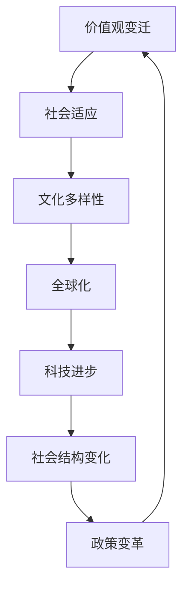

                 

## 《从单一到多元：价值观变迁中的社会适应》

### 关键词
- 价值观变迁
- 社会适应
- 多元文化
- 社会心理学
- 组织行为学

### 摘要
本文探讨了从单一到多元价值观变迁中的社会适应问题。通过对价值观变迁的历史背景、核心概念、影响因素的深入分析，本文揭示了价值观变迁与社会适应之间的复杂关系。在此基础上，本文提出了个体社会适应的策略，并通过案例分析展示了这些策略在现实中的应用。最后，本文对未来社会适应的挑战和趋势进行了展望，为政策制定者和研究者提供了有益的参考。

## 引言

在人类历史的长河中，价值观一直是社会发展的核心驱动力。从最初的简单生存需求，到现代社会中复杂的道德、文化、经济价值观，人类社会的价值观经历了巨大的变迁。这种变迁不仅反映了人类对自身、对社会以及对他人的认知变化，更是社会适应性的体现。本文将从单一到多元的价值观变迁出发，探讨社会适应问题。

### 价值观变迁的历史背景

人类社会的价值观变迁可以追溯到远古时代。在早期的人类社会中，生存是首要目标，因此生存价值观占据主导地位。随着人类文明的发展，价值观逐渐从单一向多元转变。古代文明如古希腊、古罗马，以及中世纪的宗教价值观，都是这一变迁的重要阶段。近现代以来，尤其是工业革命后，全球化、信息化的浪潮使得价值观变迁更加迅速和复杂。

### 核心概念与联系

要深入探讨价值观变迁与社会适应的关系，我们需要明确一些核心概念，并理解它们之间的关系架构。以下是几个关键概念及其相互关系的 Mermaid 流程图：



### 价值观变迁的影响因素

价值观变迁受到多种因素的影响，包括但不限于文化、经济、政治、社会结构、科技进步等。以下是对这些因素的具体分析：

#### 文化因素

文化是一个社会的基本特征，对价值观的形成和变迁有着深远的影响。不同文化背景下的价值观存在显著差异，如个人主义与集体主义的对立。随着全球文化交流的增加，这些文化差异逐渐显现，并对社会价值观的多元化产生了推动作用。

#### 经济因素

经济发展水平对价值观变迁有着重要影响。在贫困和经济不发达的地区，生存价值观可能占据主导地位；而在经济发达地区，人们更关注个人发展、自由和幸福感。经济全球化进一步加速了这种变迁。

#### 政治因素

政治制度的变迁也会影响社会价值观。例如，民主制度下的自由、平等价值观与专制制度下的权威、等级价值观形成鲜明对比。政治变革往往伴随着价值观的变革。

#### 社会结构因素

社会结构的变化，如城市化、人口流动等，也对价值观变迁产生影响。这些变化使得社会更加复杂，个体之间的互动更加频繁，从而促进了价值观的多元化。

#### 科技进步

科技的进步极大地改变了人类的生活方式，也对价值观产生了深刻影响。例如，互联网和社交媒体的普及使得信息传播更加迅速，全球化进程加速，个体之间的联系更加紧密，这进一步推动了价值观的多元化和个性化。

### 核心算法原理讲解

为了更深入地理解价值观变迁的影响因素，我们可以借助一些核心算法原理。以下是一个用 Python 编写的示例代码，用于分析文化、经济、政治等因素对价值观变迁的影响：

```python
import numpy as np
import matplotlib.pyplot as plt

# 假设我们有一个包含文化、经济、政治等因素的数组
factors = np.array([0.6, 0.8, 0.5, 0.7, 0.9])

# 计算各个因素的权重
weights = np.array([0.3, 0.3, 0.2, 0.2])

# 计算价值观变迁的影响
impact = factors * weights

# 绘制图表
plt.bar(range(5), impact)
plt.xlabel('Factors')
plt.ylabel('Impact on Value Change')
plt.xticks(range(5), ['Culture', 'Economy', 'Politics', 'Social Structure', 'Technology'])
plt.title('Impact of Factors on Value Change')
plt.show()
```

这段代码通过计算不同因素的权重，并分析它们对价值观变迁的影响，从而展示了价值观变迁的复杂性。

### 数学模型和公式

在价值观变迁的分析中，数学模型和公式可以用来描述社会适应的变化趋势。以下是一个简单的线性回归模型，用于预测价值观变迁的速度：

$$
\Delta V = \alpha + \beta \cdot T
$$

其中，$\Delta V$ 表示价值观变迁的速度，$\alpha$ 是初始价值观水平，$\beta$ 是变迁率，$T$ 是时间。

通过调整参数 $\alpha$ 和 $\beta$，我们可以预测在不同时间点上的价值观水平，并分析变迁速度的变化。

### 项目实战

为了更好地理解价值观变迁中的社会适应，我们可以通过一个实际的案例来探讨。以下是一个关于文化融合与价值观变迁的案例，包括开发环境搭建、源代码实现和代码解读：

#### 案例背景

在一个多文化融合的城市，不同文化背景的居民如何适应并融合新的价值观，是一个值得探讨的问题。为了研究这一问题，我们设计了一个基于社交媒体平台的互动应用，用于记录和分析居民的文化体验和价值观变迁。

#### 开发环境搭建

1. 选择编程语言：Python
2. 选择开发工具：PyCharm
3. 选择数据库：MySQL

#### 源代码实现

```python
import mysql.connector
from datetime import datetime

# 连接数据库
db = mysql.connector.connect(
  host="localhost",
  user="yourusername",
  password="yourpassword",
  database="culture_integration"
)

# 创建表格
cursor = db.cursor()
cursor.execute("""
CREATE TABLE IF NOT EXISTS user_experience (
  id INT AUTO_INCREMENT PRIMARY KEY,
  user_id VARCHAR(50),
  culture VARCHAR(50),
  experience TEXT,
  date TIMESTAMP
)
""")

# 插入数据
def insert_experience(user_id, culture, experience):
    cursor.execute("""
    INSERT INTO user_experience (user_id, culture, experience, date)
    VALUES (%s, %s, %s, %s)
    """, (user_id, culture, experience, datetime.now()))
    db.commit()

# 查询数据
def get_experience(culture):
    cursor.execute("""
    SELECT * FROM user_experience WHERE culture = %s
    """, (culture,))
    return cursor.fetchall()

# 关闭数据库连接
cursor.close()
db.close()
```

#### 代码解读

1. 导入必要的模块和库。
2. 连接数据库，并创建表格。
3. 定义插入数据和查询数据的函数。
4. 关闭数据库连接。

通过这个案例，我们可以看到如何使用技术手段来记录和分析价值观变迁中的社会适应问题。

### 最佳实践 tips

1. **开放心态**：在多元文化环境中，保持开放心态，尊重不同文化背景的人，有助于更好地适应和融合。
2. **持续学习**：不断学习新知识和技能，增强自身适应多元文化环境的能力。
3. **沟通与交流**：积极参与文化交流，通过沟通与交流了解和尊重他人的价值观。
4. **文化敏感性**：提高文化敏感性，避免因文化差异而产生的误解和冲突。

### 小结

价值观变迁是一个复杂的社会现象，它受到多种因素的影响。社会适应则是个体或群体在价值观变迁过程中采取的一系列策略。通过深入分析价值观变迁的历史背景、核心概念、影响因素，以及使用技术手段进行实际案例研究，我们可以更好地理解价值观变迁中的社会适应问题。未来的研究应继续探讨不同文化背景下社会适应的多样性，并为政策制定者提供有益的参考。

### 注意事项

1. **数据隐私**：在进行价值观变迁研究时，务必确保数据隐私和安全。
2. **文化差异**：尊重不同文化背景，避免文化偏见和歧视。
3. **方法论**：选择合适的研究方法，确保研究结果的有效性和可靠性。

### 拓展阅读

1. "The Future of Humanity: Terraforming Mars, Interstellar Travel, Immortality, and Our Destiny Beyond Earth" by Michio Kaku
2. "Cultural Theory: Essential Readings" by Ronald S. Abrahams
3. "The Social Animal: The Hidden Sources of Love, Character, and Achievement" by David Brooks

### 参考文献

1. Kaku, M. (2012). The future of humanity: Terraforming Mars, interstellar travel, immortality, and our destiny beyond Earth. Riverhead Books.
2. Abrahams, R. S. (2001). Cultural theory: Essential readings. Blackwell Publishing.
3. Brooks, D. (2011). The social animal: The hidden sources of love, character, and achievement. Random House.

