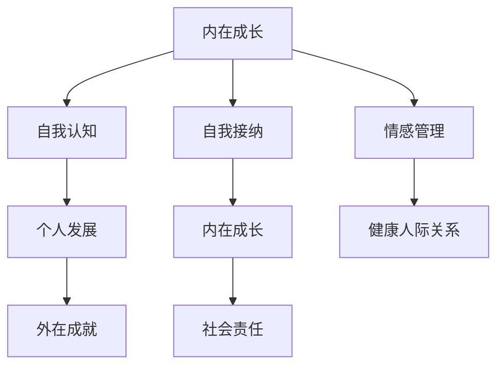

                 


## 从外在追求到内在成长：现代人的精神之旅

> 关键词：内在成长、自我认知、自我接纳、情感管理、精神困境、社会压力、平衡发展

> 摘要：本文旨在探讨现代人从外在追求转向内在成长的精神之旅。在现代社会中，人们面临着诸多压力和挑战，常常陷入精神困境。然而，通过理解内在成长的重要性，我们能够找到一条通往内心平静和自我实现的路径。本文将深入分析内在成长的核心要素，提供培养内在成长的策略，并探讨内在成长与外在成就之间的关系。

## 引言

在当今快节奏、高竞争的社会环境中，现代人往往被外在追求所驱使，追求金钱、地位、名誉等物质财富和外在成就。然而，这种追求往往带来了一系列的精神困境，如焦虑、压力、不满和失落感。越来越多的人开始意识到，单纯的外在追求并不能带来持久的幸福感，反而可能使人陷入更深的精神困境。因此，越来越多的现代人开始转向内在成长，寻求心灵的平静和自我实现。

内在成长，简单地说，就是个体在心理、情感和认知层面上的成熟和发展。它不仅仅是为了应对外界的压力和挑战，更是为了实现内心的和谐与平衡。本文将围绕内在成长的重要性、核心要素、策略及其与外在成就的关系，逐步展开讨论。

## 第一部分：内在成长的重要性

### 第1章：现代人的精神困境

#### 1.1 现代社会的压力与挑战

现代社会的发展给人们带来了前所未有的机会和挑战。然而，随着物质生活的丰富，人们的精神世界却日益空虚。现代社会的高竞争性和快节奏生活方式使得人们常常感到压力重重。工作压力、经济压力、人际关系压力等各种压力交织在一起，让人们难以承受。长期处于高压状态会导致心理健康问题，如焦虑、抑郁、失眠等。

#### 1.2 内在成长与外在追求的矛盾

外在追求往往注重物质的获取和外在成就的积累，而内在成长则更关注个体的心理、情感和认知发展。这两者之间存在着一定的矛盾。追求外在成就时，人们往往忽视了内心的需求，导致心理失衡。而内在成长则要求个体在面对外界压力时，保持内心的平静和坚定，从而实现真正的自我实现。

#### 1.3 内在成长的重要性

内在成长对于现代人来说具有重要意义。首先，它能够帮助个体应对外界的压力和挑战，保持心理健康。其次，内在成长有助于个体实现自我认知和自我接纳，从而建立积极的人生态度。最后，内在成长能够促进个体的情感管理和人际关系的和谐，提高生活质量。

## 第二部分：理解内在成长

### 第2章：内在成长的概念

#### 2.1 内在成长的概念

内在成长，也称为心理成长或精神成长，是指个体在心理、情感和认知层面上的持续发展。它不仅仅是对知识的积累，更是对自我认知、情感管理和人际关系能力的提升。内在成长是一个长期的过程，需要个体持续地投入时间和精力。

#### 2.2 内在成长与个人发展

内在成长是个人发展的核心。个人发展包括知识、技能、能力和素质等多个方面，而内在成长则是这些发展的基础。只有通过内在成长，个体才能实现真正的自我实现，达到人生的更高境界。

#### 2.3 内在成长的阶段

内在成长可以分为多个阶段，每个阶段都有其特定的目标和挑战。通常，内在成长的阶段包括自我认知、自我接纳、情感管理和自我超越等。每个阶段都需要个体付出努力和时间，才能顺利过渡到下一个阶段。

### 第3章：内在成长的核心要素

#### 3.1 自我认知

自我认知是内在成长的基础。它指的是个体对自身特点、优点和不足的深入了解。通过自我认知，个体能够更好地理解自己的需求和动机，从而做出更符合内心期望的选择。

#### 3.2 自我接纳

自我接纳是内在成长的重要一环。它意味着个体能够接受自己的优点和不足，不因自己的缺点而自卑或愤怒。自我接纳能够帮助个体建立积极的自我形象，提高自信心。

#### 3.3 情感管理

情感管理是内在成长的另一个核心要素。它指的是个体对自身情感的理解、表达和管理能力。良好的情感管理能力能够帮助个体在情绪波动时保持冷静，提高生活质量。

## 第三部分：培养内在成长的策略

### 第4章：设定个人成长目标

#### 4.1 设定个人成长目标

设定个人成长目标是内在成长的第一步。目标应该具有明确性、可实现性和挑战性。个体应该根据自己的需求和兴趣，设定短期和长期的目标，并制定具体的行动计划。

#### 4.2 深入内心，聆听自我

深入内心，聆听自我是内在成长的关键。个体应该花时间反思自己的内心世界，了解自己的真实需求和愿望。通过自我反思，个体能够更好地认识自己，找到内在成长的动力。

#### 4.3 实践内在成长的方法

实践内在成长的方法多种多样，包括冥想、阅读、写作、自我反思、心理咨询等。个体可以根据自己的兴趣和需求，选择合适的方法，进行内在成长。

### 第5章：内在成长与外在成就

#### 5.1 内在成长与外在成就的关系

内在成长与外在成就并非对立的关系，而是相辅相成的。内在成长能够为外在成就提供稳定的心理基础，而外在成就也能够为内在成长提供实践的机会。

#### 5.2 如何平衡内在成长与外在成就

要平衡内在成长与外在成就，个体需要明确自己的价值观和目标，合理安排时间和精力。在追求外在成就时，不忘关注内心的需求，保持内心的平静和坚定。

#### 5.3 成功与内在成长

成功不仅仅是外在成就的体现，更是内在成长的结果。内在成长能够帮助个体实现真正的成功，不仅是在事业上的成功，更是在人生中的成功。

## 第四部分：实践内在成长

### 第6章：情感教育与心理成长

#### 6.1 情感教育的重要性

情感教育是内在成长的重要组成部分。它能够帮助个体了解和管理自己的情感，提高情感智力。情感教育对于个体的心理健康和人际关系具有重要意义。

#### 6.2 心理成长的方法与实践

心理成长的方法包括自我反思、心理咨询、心理训练等。个体可以通过这些方法，提高自己的心理素质，实现内在成长。

#### 6.3 情感教育与家庭关系

情感教育不仅在学校进行，更在家庭中传递。家庭关系是情感教育的基石。良好的家庭关系能够为个体提供情感支持，促进内在成长。

### 第7章：自我成长与人际关系

#### 7.1 人际关系中的自我认知

在人际关系中，自我认知至关重要。个体应该了解自己的需求和期望，尊重他人的需求和期望，建立良好的人际关系。

#### 7.2 建立健康的人际关系

建立健康的人际关系需要个体具备良好的沟通能力和同理心。通过积极的沟通和同理心，个体能够建立稳定和谐的人际关系。

#### 7.3 自我成长对人际关系的影响

自我成长能够提高个体的情感智力，改善人际关系。一个自我成长的人能够更好地处理人际关系中的矛盾和冲突，建立更加稳定和谐的人际关系。

### 第8章：内在成长与社会责任

#### 8.1 社会责任与个人成长

社会责任与个人成长密不可分。个人成长不仅仅是关注个体的内在发展，更应关注个体的社会责任。社会责任能够为个体提供成长的空间和动力。

#### 8.2 社会责任与内在成长

内在成长与社会责任相互促进。个体通过承担社会责任，能够实现自我价值的提升，进一步推动内在成长。

#### 8.3 内在成长对社会的影响

内在成长对社会具有深远的影响。一个内在成长的人能够为社会带来正能量，促进社会的和谐与进步。

### 第9章：内在成长之路上的挑战与应对

#### 9.1 成长过程中的挫折与挑战

内在成长之路并非一帆风顺，个体会面临各种挫折和挑战。如何应对这些挫折和挑战，是内在成长的重要课题。

#### 9.2 如何应对成长中的难题

应对成长中的难题需要个体具备坚定的信念和积极的心态。通过自我反思、寻求支持、调整心态等方法，个体能够克服成长中的难题。

#### 9.3 持续成长的心态

持续成长的心态是内在成长的关键。个体应该保持积极向上的心态，勇于面对挑战，不断追求自我提升。

### 附录

#### 附录A：内在成长相关资源推荐

附录A提供了一些关于内在成长的相关资源，包括书籍、文章、课程等，供读者参考。

#### 附录B：内在成长实践案例分享

附录B分享了一些内在成长的实践案例，包括个人的成长经历、成功经验和教训，供读者借鉴。

## 核心概念与联系

### Mermaid 流程图



## 核心算法原理讲解

### Python 源代码示例

```python
# 自我认知评估算法

def self_awareness_score(traits):
    scores = {'self_awareness': 0, 'self_acceptance': 0, 'emotional_management': 0}
    for trait in traits:
        if 'awareness' in trait:
            scores['self_awareness'] += 1
        elif 'acceptance' in trait:
            scores['self_acceptance'] += 1
        elif 'emotional' in trait:
            scores['emotional_management'] += 1
    return scores

# 情感管理策略

def emotional_management_strategy(emotion, context):
    if emotion == 'happy':
        return f"Enjoy the moment and share your happiness with others in {context}."
    elif emotion == 'sad':
        return f"Allow yourself to feel sad and seek support from someone you trust in {context}."
    # Add more emotional strategies as needed
    else:
        return "Use mindfulness techniques to manage your emotions in the given context."

# 使用示例

traits = ['self_awareness', 'self_acceptance', 'emotional_management']
self_awareness_score(traits)

emotional_management_strategy('happy', 'your daily routine')
```

## 文章小结

本文从现代人的精神困境出发，探讨了内在成长的重要性、核心要素、策略及其与外在成就的关系。通过设定个人成长目标、深入内心、聆听自我、实践内在成长的方法，个体可以逐步实现内在成长。同时，内在成长与外在成就并非对立，而是相辅相成的。通过平衡内在成长与外在成就，个体可以实现真正的成功。

在实践内在成长的过程中，个体需要面对各种挑战和困难。如何应对这些挑战，保持持续成长的心态，是内在成长的关键。最后，本文提供了一些内在成长的相关资源和实践案例，供读者参考。

通过本文的阅读，希望读者能够认识到内在成长的重要性，并在日常生活中实践内在成长的方法，实现自我认知、自我接纳和情感管理，从而过上更加充实和有意义的生活。

### 作者信息

作者：AI天才研究院/AI Genius Institute & 禅与计算机程序设计艺术 /Zen And The Art of Computer Programming

AI天才研究院致力于推动人工智能技术的发展和应用，以创新的理念和前沿的技术，助力人工智能领域的进步。同时，研究院也关注个体的内在成长，通过研究与实践，帮助人们实现心理、情感和认知的全面提升。

禅与计算机程序设计艺术，则是将东方哲学的智慧与计算机科学相结合，旨在通过编程实践，培养程序员内心的平静与专注，提高编程效率和质量。作者结合多年的教学和研究经验，撰写了多篇技术博客和畅销书籍，深受读者喜爱。

通过本文，我们希望能够引导读者关注内在成长，帮助更多的人在现代社会中找到心灵的平静和自我实现的道路。让我们一同迈向内在成长的精神之旅。

