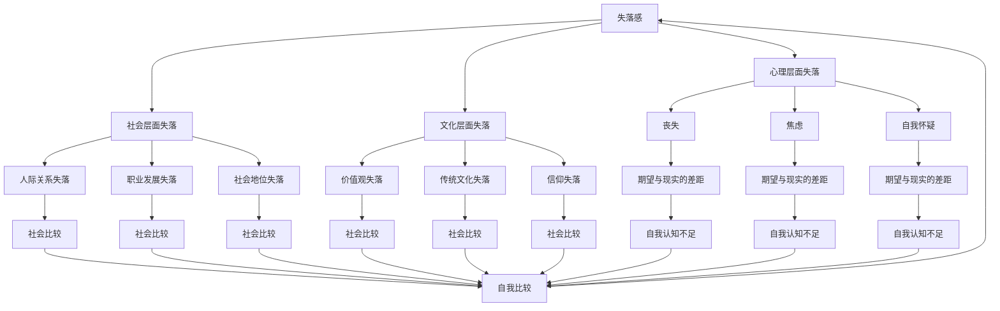
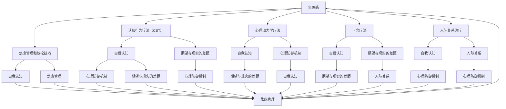
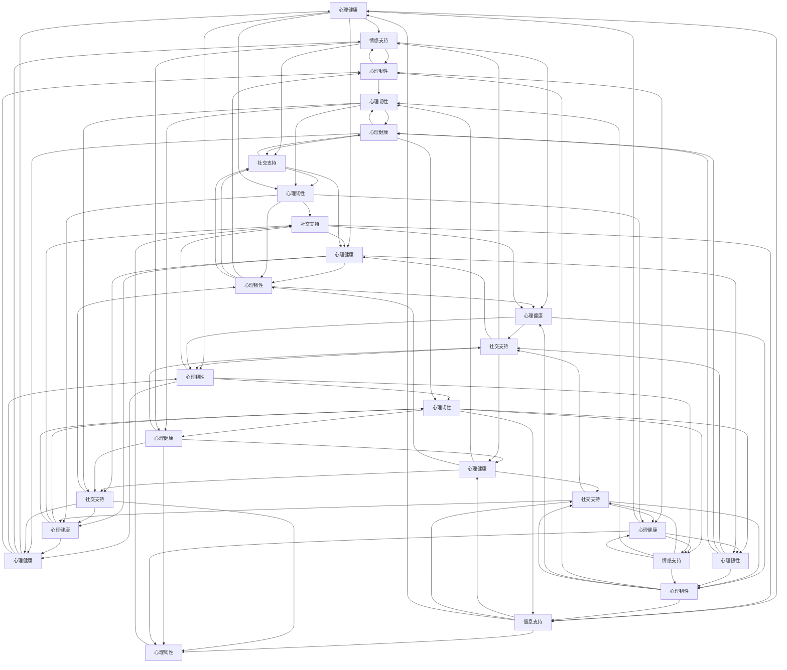
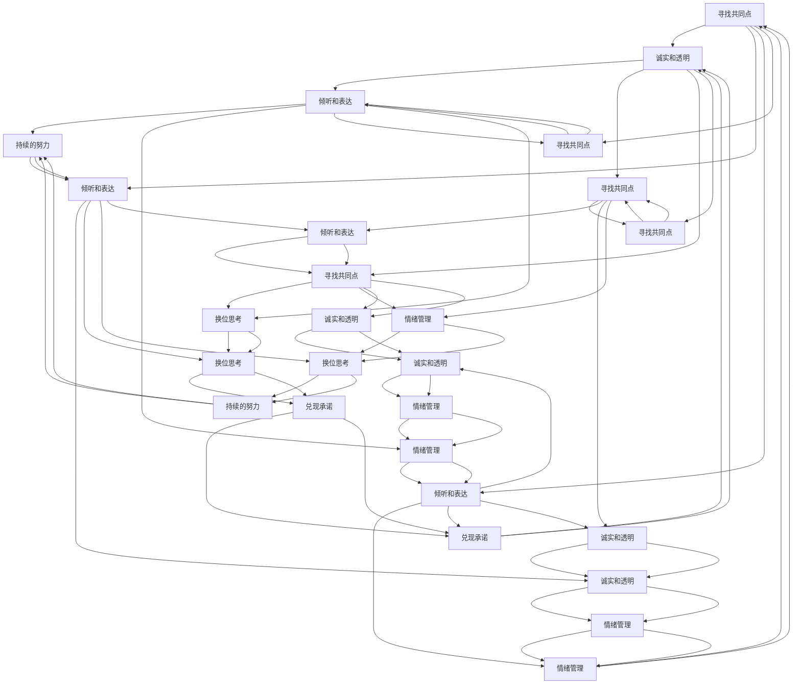
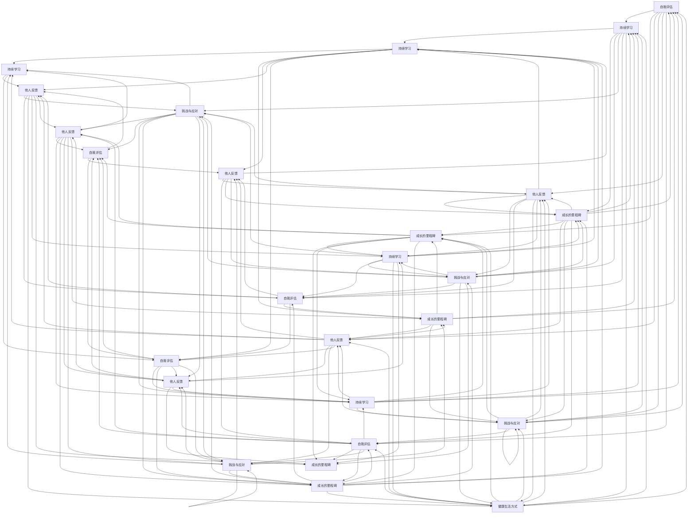

                 

### 引言

在当今高速发展的现代社会，人们面临着前所未有的压力和挑战。快节奏的生活、复杂的人际关系、不断变化的社会环境，让很多人感受到前所未有的失落感。这种感觉，有时候像是一种无形的负担，压得人们喘不过气来；有时候又像是一阵突如其来的风，吹走了心中原本的宁静。

《从失落到重生：现代人的精神成长之路》这本书，旨在帮助那些处于失落之中的人们找到重生的希望。我们希望通过这本书，能够为那些感到困惑、无助的人们提供一些实用的方法和思路，帮助他们走出失落，重新找到生活的意义和方向。

本书的读者对象主要是那些正在经历或曾经经历过失落感的人群，包括但不限于职场人士、学生、家庭主妇等。同时，对于那些希望提升自身精神状态，追求内心平静和自我成长的人们，本书也同样适用。

在这本书中，我们将从以下几个方面展开讨论：

1. **失落感的本质**：我们将深入探讨失落感的来源，包括心理、社会和文化层面的原因，并分析其背后的心理机制。

2. **自我认知与成长**：我们将探讨自我认知的重要性，以及如何通过自我认知来实现个人的精神成长。

3. **精神疗愈的方法**：我们将介绍心理咨询、冥想与正念等精神疗愈方法，帮助读者找到适合自己的疗愈方式。

4. **社交支持与人际关系的重建**：我们将讨论社交支持的重要性，以及如何重建和改善人际关系。

5. **实践与成长**：我们将提供一些具体的实践方法，帮助读者在日常生活中实现精神成长。

6. **重生后的生活**：我们将探讨重生后的生活规划，包括重新定义人生目标、调整生活方式和建立支持系统等方面。

7. **结语**：我们将总结全书的内容，并对精神成长的道路进行展望。

接下来，让我们一步一步地深入探讨这些主题，希望能为你的精神成长之路提供一些启示和帮助。

### 核心关键词

- **失落感**
- **精神成长**
- **自我认知**
- **心理疗愈**
- **社交支持**
- **人际关系重建**
- **实践方法**
- **重生**

### 摘要

《从失落到重生：现代人的精神成长之路》是一本旨在帮助那些经历失落感的人们找到重生希望的书。书中首先探讨了失落感的来源，包括心理、社会和文化层面的原因，并分析了其背后的心理机制。接着，我们探讨了自我认知的重要性，以及如何通过自我认知来实现个人的精神成长。书中还介绍了心理咨询、冥想与正念等精神疗愈方法，帮助读者找到适合自己的疗愈方式。此外，我们强调了社交支持的重要性，并提供了重建和改善人际关系的具体方法。通过提供一些具体的实践方法，书中帮助读者在日常生活中实现精神成长。最后，我们探讨了重生后的生活规划，包括重新定义人生目标、调整生活方式和建立支持系统等方面。全书旨在为读者的精神成长之路提供实用的方法和思路。

## 第2章 失落感的本质

### 2.1 失落感的来源

失落感，是一种普遍而深刻的情感体验，它不仅影响个人的内心世界，还可能对个体的行为和社交产生深远的影响。要理解失落感，首先需要了解其来源。失落感的来源可以分为心理、社会和文化三个层面。

#### 心理层面的失落

心理层面的失落源于个体内心的需求和期望未能得到满足。这种失落可能是因为个人失去了一些重要的东西，比如亲人、朋友、工作，或者是由于自己未能达到预期的目标。以下是一些具体的表现：

- **丧失与焦虑**：当个体失去某些重要的东西时，如亲人去世、朋友离去，会感到极度的不安和焦虑。
- **自我怀疑与否定**：在失落中，个体可能会怀疑自己的能力和价值，甚至否定自己的存在意义。
- **对未来的担忧**：失落感往往伴随着对未来的不确定性，这种担忧可能进一步加重失落感。

#### 社会层面的失落

社会层面的失落与个体的社会地位、人际关系和社会角色有关。以下是一些具体的表现：

- **人际关系的失落**：当个体在社交网络中感到孤立、不被理解或者失去重要的人际关系时，会感到失落。
- **职业发展的失落**：当个体在职业上遭遇挫折，如失业、职位晋升失败，会感到自己的努力没有得到应有的回报。
- **社会地位的失落**：当个体的社会地位下降，如从富人变为穷人，从领导者变为普通职员，会感到自己在社会中的价值减少。

#### 文化层面的失落

文化层面的失落源于个体对文化认同的丧失或者文化变迁带来的冲击。以下是一些具体的表现：

- **价值观的失落**：当个体发现所持有的价值观与周围环境相冲突，或者发现这些价值观不再被社会所认可时，会感到失落。
- **传统文化的失落**：随着现代化进程的推进，许多传统文化和习俗逐渐消失，这可能导致个体对文化根源的失落。
- **信仰的失落**：对于有宗教信仰的人来说，失去信仰可能会带来深刻的失落感。

#### 失落感的心理机制

失落感不仅仅是一种情感体验，它背后有着复杂的心理机制。以下是一些可能导致失落感的心理机制：

- **期望与现实的差距**：当个体的期望与实际情况存在较大的差距时，会感到失落。
- **自我认知的不足**：当个体对自己的认知存在偏差，如过度自我否定或过度自我肯定，可能会导致失落感。
- **社会比较**：当个体通过与他人进行比较，发现自己的处境不如他人时，会感到失落。

### 社会和文化对失落感的影响

社会和文化因素也在很大程度上影响着失落感的体验。以下是一些影响失落感的社会和文化因素：

- **社会结构**：社会结构的不公平可能导致一部分人感到失落，如贫富差距、社会阶层固化。
- **文化认同**：文化认同的缺失可能导致个体感到失落，如移民、文化冲突。
- **社会变迁**：随着社会的快速变迁，个体可能难以适应新的环境，从而感到失落。

#### 心理治疗与失落感

对于失落感的心理治疗，首先需要认识到失落感是一个复杂的情感体验，不能简单地通过消除单一原因来解决。以下是一些常用的心理治疗方法和技术：

- **认知行为疗法（CBT）**：通过改变个体的认知和行为，帮助其调整对失落感的看法和处理方式。
- **心理动力学疗法**：探索个体的内在冲突和童年经历，帮助其理解失落感的根源。
- **正念疗法**：通过正念练习，帮助个体更好地应对失落感，提高心理弹性。

总的来说，失落感的本质是一个多维度的复杂体验，涉及心理、社会和文化等多个层面。理解失落感的来源和背后的心理机制，有助于我们更好地应对和缓解失落感，从而实现个人的精神成长。

### 核心概念与联系

在讨论失落感的来源时，我们涉及了以下几个核心概念：

1. **失落感**：一种普遍的情感体验，涉及个体对失去重要事物的反应。
2. **心理层面的失落**：包括丧失、焦虑、自我怀疑等。
3. **社会层面的失落**：包括人际关系、职业发展、社会地位等。
4. **文化层面的失落**：包括价值观、传统文化、信仰等。
5. **期望与现实的差距**：个体期望与实际情况的差距。
6. **自我认知**：个体对自己的认知和评价。
7. **社会比较**：个体与他人进行比较的过程。

这些核心概念之间的关系可以通过以下Mermaid流程图来表示：



这个流程图展示了失落感的多个维度以及它们之间的相互关系，有助于我们更全面地理解失落感的本质。

### 失落感的心理机制

失落感的心理机制是一个复杂而多维的过程，涉及到多个心理层面的相互作用。以下是几个关键的心理机制：

#### 1. 丧失与焦虑

丧失是一种常见的心理机制，当个体失去重要的人、事、物时，会引发焦虑。焦虑是一种生理和心理的反应，表现为紧张、不安和恐惧。当个体意识到自己无法回到过去的状态时，焦虑感可能会加剧。这种焦虑常常源于对未知的恐惧和对失去的担忧。

#### 2. 自我怀疑与否定

在失落感中，个体往往会怀疑自己的能力和价值。这种自我怀疑可能源于丧失带来的自我评价下降，或者是对未来不确定性的担忧。否定则是自我怀疑的极端形式，表现为对自身能力和价值的全面否定。这种心理机制可能导致个体产生抑郁情绪，甚至自暴自弃。

#### 3. 对未来的担忧

失落感往往伴随着对未来不确定性的担忧。这种担忧可能源于对当前困境的无法解决，或者对未来可能出现的更坏情况的恐惧。对未来的担忧会加剧个体的焦虑感，使其陷入消极情绪的循环。

#### 4. 心理防御机制

失落感还涉及到多种心理防御机制，如否认、投射、压抑等。否认是一种常见的防御机制，个体通过否认现实来减轻失落感。投射则是将内心的负面情绪和感受投射到外部世界，从而避免面对内心的痛苦。压抑则是将痛苦的情感和回忆埋藏在潜意识中，避免其影响日常生活的正常进行。

#### 5. 自我实现预言

失落感可能会产生自我实现预言的效应，即个体的信念和预期会影响其行为和结果。当个体认为自己无法克服失落感时，这种信念可能导致其放弃努力，从而实现预期的失败。

#### 6. 自我认知偏差

自我认知偏差也是失落感心理机制的一个重要方面。个体在失落时，往往会对自己持有过于悲观或者过于乐观的看法。这种偏差可能导致个体无法客观地评估自己的能力和处境，从而影响其应对失落感的方式。

### 核心算法原理讲解

为了更好地理解失落感的心理机制，我们可以使用Python来模拟一些基本的心理机制，如期望与现实的差距、自我怀疑等。以下是一个简单的Python示例，用于模拟期望与现实的差距对失落感的影响。

```python
import matplotlib.pyplot as plt
import numpy as np

# 设置期望值和实际值的分布参数
mu_expectation = 50
mu_reality = 30
sigma = 10

# 生成期望值和实际值的正态分布数据
expectations = np.random.normal(mu_expectation, sigma, 1000)
realities = np.random.normal(mu_reality, sigma, 1000)

# 计算期望与现实的差距
gap = expectations - realities

# 绘制期望与现实的差距的直方图
plt.hist(gap, bins=30, alpha=0.5, label='Gap')
plt.xlabel('Gap')
plt.ylabel('Frequency')
plt.title('Gap between Expectation and Reality')
plt.legend()
plt.show()
```

在这个示例中，我们生成了1000个随机数，分别代表了个体对未来的期望和实际结果。通过计算两者的差距，我们可以直观地看到期望与现实的差距对个体情绪的影响。较大的差距可能会导致更强烈的失落感。

### 详细举例说明

假设一个职场人士，他期望在一年内晋升为部门经理，但实际工作中由于各种原因，如竞争激烈、业绩未达标等，他未能实现这个目标。以下是对这个案例的详细分析：

1. **期望与现实的差距**：他的期望是晋升为经理，但现实是未能晋升。这种差距可能会导致他感到失落和失望。
2. **自我怀疑与否定**：由于未能达到期望，他可能会开始怀疑自己的能力和价值，甚至否定自己的职业选择。
3. **焦虑和担忧**：对未来职业发展的不确定性，以及对未知的恐惧，会加剧他的焦虑感。
4. **心理防御机制**：他可能会选择否认这个事实，或者将责任归咎于外部因素，以减轻内心的痛苦。
5. **自我实现预言**：长期的失落感可能导致他放弃努力，从而实现预期的失败，进一步加深他的失落感。

通过这个案例，我们可以看到，失落感的心理机制是如何在个体经历挫折时发挥作用的。理解这些机制有助于我们更好地应对失落感，找到重生的途径。

### 心理治疗与失落感

失落感是一个复杂的情感体验，对于严重的失落感，可能需要专业的心理治疗来帮助个体恢复心理健康。以下是一些常用的心理治疗方法和技术：

#### 1. 认知行为疗法（CBT）

认知行为疗法是一种广泛使用且有效的心理治疗方法，它通过改变个体的思维和行为模式来减轻失落感。在CBT中，治疗师会帮助个体识别和挑战那些导致负面情绪和行为的负面思维模式。例如，当个体因为未能晋升而感到失落时，治疗师会帮助他识别这种负面思维，如“我永远无法成功”，并引导他进行合理的思考，如“我虽然这次未能晋升，但我会继续努力，争取下次成功”。

#### 2. 心理动力学疗法

心理动力学疗法旨在探索个体的内在冲突和童年经历，帮助其理解失落感的根源。这种疗法强调潜意识的影响，通过自由联想和梦境分析等方式，帮助个体发现和解决内心深处的冲突。对于因失去亲人而感到失落的个体，心理动力学疗法可以帮助他们处理未被解决的悲伤和愤怒。

#### 3. 正念疗法

正念疗法通过培养个体的正念意识，帮助其更好地应对失落感。正念练习，如冥想和正念呼吸，可以帮助个体专注于当前 moment，减少对过去和未来的担忧。这种疗法有助于提高个体的心理弹性，增强其应对失落感的能力。

#### 4. 人际关系治疗

人际关系治疗通过改善个体的人际关系来减轻失落感。这种疗法强调个体在社交环境中的互动，帮助个体建立更健康的人际关系模式。对于因社会关系破裂而感到失落的个体，人际关系治疗可以提供有效的支持和指导。

#### 5. 焦虑管理和放松技巧

焦虑管理和放松技巧，如深呼吸、渐进性肌肉松弛和生物反馈，可以帮助个体减轻焦虑和紧张感。这些技巧可以通过自我练习在家中实施，帮助个体在日常生活中更好地应对失落感。

#### 治疗过程

心理治疗通常包括以下几个阶段：

1. **评估和诊断**：治疗师会与个体进行初步的交流，了解其失落感的原因和症状，进行评估和诊断。
2. **目标设定**：治疗师会与个体一起设定具体的治疗目标，如减轻焦虑、改善人际关系等。
3. **干预和技巧学习**：治疗师会根据评估结果，采用不同的治疗方法，帮助个体学习应对失落感的技巧。
4. **监督和反馈**：治疗过程中，治疗师会定期与个体进行反馈，评估治疗效果，调整治疗计划。
5. **结束和后续支持**：当个体的症状得到显著改善后，治疗师会与个体讨论如何维持治疗效果，并提供后续的支持。

### 结论

心理治疗在应对失落感中起着重要的作用。通过认知行为疗法、心理动力学疗法、正念疗法等多种方法，个体可以学会如何识别和应对负面情绪，提高心理弹性，从而走出失落，实现精神成长。

### 核心概念与联系

在讨论失落感的心理机制和心理治疗时，我们涉及了以下几个核心概念：

1. **认知行为疗法（CBT）**：通过改变个体的思维和行为模式来减轻负面情绪。
2. **心理动力学疗法**：探索个体的内在冲突和童年经历，帮助其理解失落感的根源。
3. **正念疗法**：通过培养个体的正念意识，帮助其更好地应对失落感。
4. **人际关系治疗**：通过改善个体的人际关系来减轻失落感。
5. **焦虑管理和放松技巧**：帮助个体减轻焦虑和紧张感。
6. **自我认知**：个体对自己的认知和评价。
7. **期望与现实的差距**：个体对未来的期望与实际情况的差距。
8. **心理防御机制**：个体为了减轻内心痛苦而采用的防御策略。

这些核心概念之间的关系可以通过以下Mermaid流程图来表示：



这个流程图展示了失落感的相关核心概念及其相互关系，有助于我们更全面地理解失落感的心理机制和心理治疗的方法。

### 社交支持的重要性

在讨论失落感的本质和背后的心理机制时，我们了解到失落感不仅是一种情感体验，还与个体的心理、社会和文化因素密切相关。在这一章中，我们将探讨社交支持的重要性，以及它在减轻失落感、促进精神成长中的作用。

#### 社交支持的概念

社交支持是指个体从他人那里获得的情感、信息、物质和实际帮助。这种支持可以来自家庭、朋友、同事、社区以及其他社会关系网络。社交支持的形式多种多样，包括倾听、理解、鼓励、提供信息、提供物质帮助等。有效的社交支持不仅能减轻个体的心理压力，还能增强其应对困境的能力。

#### 社交支持的形式

社交支持可以分为以下几种形式：

1. **情感支持**：个体在失落时，最需要的是情感的慰藉。情感支持包括倾听、理解、同情和鼓励。当个体感受到他人的关心和支持时，他们更容易克服负面情绪，恢复信心。

2. **信息支持**：在失落感中，个体可能需要关于如何应对困境的信息和指导。信息支持可以来自专业人士、书籍、网络资源等。通过获取有用的信息，个体可以更好地理解自己的情况，找到解决问题的方法。

3. **物质支持**：物质支持包括金钱、食物、住所等实际帮助。对于处于困境中的个体来说，物质支持能够提供即时的帮助，缓解他们的生活压力。

4. **实际帮助**：实际帮助是指他人为个体提供的实际行动，如陪伴、照顾、提供工作机会等。实际帮助不仅能够直接解决个体的实际问题，还能让他们感受到社会的温暖和支持。

#### 社交支持的重要性

社交支持在应对失落感中扮演着至关重要的角色。以下是社交支持的重要性：

1. **减轻心理压力**：失落感往往伴随着强烈的心理压力。社交支持可以提供情感上的慰藉，帮助个体减轻心理负担。

2. **增强心理韧性**：社交支持有助于增强个体的心理韧性，提高其应对困境的能力。通过他人的支持和鼓励，个体可以更好地应对挑战，克服困难。

3. **促进精神成长**：社交支持不仅能够帮助个体应对当前的困境，还能促进其精神成长。通过与他人的交流和互动，个体可以反思自己的经历，提升自我认知，实现精神上的提升。

4. **改善人际关系**：社交支持有助于改善个体的人际关系。在分享经验和感受的过程中，个体可以建立更深层次的连接，增强人际关系的质量。

#### 社交支持的益处

社交支持对个体健康和心理福祉具有多方面的益处，包括：

1. **提高幸福感**：社交支持能够增强个体的幸福感，让他们感受到被关爱和重视。

2. **降低患病风险**：研究表明，拥有良好的社交支持系统可以降低患病风险，提高个体的身体健康。

3. **增强心理健康**：社交支持有助于缓解焦虑、抑郁等心理健康问题，提高个体的心理弹性。

4. **促进身体健康**：社交支持不仅对心理健康有益，还能促进身体健康。例如，有研究显示，拥有良好社交支持的人更有可能遵循健康的生活方式。

#### 社交支持的类型

根据支持的性质和来源，社交支持可以分为以下几种类型：

1. **正式支持**：正式支持来自专业机构或社会服务组织，如心理咨询、社会福利机构、社区服务中心等。这种支持通常具有系统的、专业的服务。

2. **非正式支持**：非正式支持来自家庭成员、朋友、邻居等私人关系网络。这种支持通常是即时的、非正式的，但往往更能触动个体的内心。

3. **朋友支持**：朋友支持是指来自朋友或同伴的支持，这种支持通常具有情感上的慰藉和实际帮助。

4. **家庭支持**：家庭支持是指来自家庭成员的支持，这种支持对于个体来说往往是最稳定和最持久的。

5. **社区支持**：社区支持是指来自社区成员或组织的支持，如志愿者服务、社区活动等。这种支持有助于增强个体的归属感和社区凝聚力。

### 社交支持的实践方法

为了有效利用社交支持，个体可以采取以下实践方法：

1. **建立和维护人际关系**：积极建立和维护人际关系，与亲朋好友保持联系，定期进行交流和互动。

2. **寻求专业帮助**：当失落感严重影响生活时，应及时寻求专业心理咨询或治疗，以获得专业的支持和指导。

3. **参与社区活动**：参与社区活动，加入兴趣小组或志愿者组织，扩展社交网络，获得更多的社交支持。

4. **学会表达和分享**：学会表达自己的感受和需求，与他人分享经验和感受，建立深层次的连接。

5. **培养积极心态**：培养积极的心态，面对困境时保持乐观，相信自己能够克服困难。

通过以上实践方法，个体可以更好地利用社交支持，减轻失落感，促进精神成长。

### 核心概念与联系

在探讨社交支持的重要性时，我们涉及了以下几个核心概念：

1. **社交支持**：指个体从他人那里获得的情感、信息、物质和实际帮助。
2. **情感支持**：包括倾听、理解、同情和鼓励。
3. **信息支持**：提供关于如何应对困境的信息和指导。
4. **物质支持**：包括金钱、食物、住所等实际帮助。
5. **实际帮助**：他人为个体提供的实际行动，如陪伴、照顾、提供工作机会。
6. **心理韧性**：个体应对困境的能力。
7. **人际关系**：个体与他人之间的互动和连接。
8. **心理健康**：个体的心理状态和福祉。

这些核心概念之间的关系可以通过以下Mermaid流程图来表示：



这个流程图展示了社交支持相关的核心概念及其相互关系，有助于我们更全面地理解社交支持在应对失落感和促进精神成长中的重要作用。

### 人际关系的重建

在经历了失落感之后，重建和改善人际关系对于个人的精神成长至关重要。人际关系不仅影响着个体的心理健康，还直接影响其生活质量和幸福感。在这一节中，我们将探讨人际关系重建的步骤，解决冲突的方法，以及恢复信任的途径。

#### 人际关系重建的步骤

1. **自我反思**：首先，个体需要对自己的行为和态度进行深刻的反思。了解自己在人际关系中的问题和不足，认识到自己的责任和需要改进的地方。

2. **设定目标**：根据自我反思的结果，设定具体的人际关系重建目标。例如，改善与某个特定朋友的关系，或提升在职场中的团队合作能力。

3. **主动沟通**：主动与对方进行沟通是重建人际关系的第一步。表达自己的感受和意愿，同时也倾听对方的观点和需求。沟通的过程需要保持开放和诚实，避免指责和抱怨。

4. **寻求共同点**：在沟通中，寻找双方共同感兴趣的话题和价值观，这有助于建立信任和共鸣。通过共同点的探讨，可以加深彼此的理解和连接。

5. **持续互动**：重建人际关系需要时间和耐心。通过持续的互动，如定期见面、电话交流或线上沟通，可以逐步修复和加强关系。

6. **解决问题**：在互动中，难免会遇到问题和冲突。面对问题时，要保持冷静和理性，通过对话和协商找到解决的方法。避免逃避或抑制问题，以免问题积压和恶化。

7. **实践承诺**：一旦达成共识，个体需要付诸实践，兑现自己的承诺。通过实际行动，如履行约定、帮助对方等，展现出自己的诚意和信任。

#### 解决冲突的方法

1. **倾听和表达**：解决冲突的第一步是倾听对方的意见和感受，理解对方的立场。同时，通过有效的表达，清晰地传达自己的想法和需求。

2. **情绪管理**：在冲突中，情绪往往会激化问题。因此，情绪管理至关重要。通过深呼吸、正念冥想等方法，控制自己的情绪，避免在冲突中做出冲动的行为。

3. **寻找共同点**：在冲突中，寻找双方都能接受的解决方案，通过妥协和协商达成共识。共同点可以是双方都关心的问题或目标，也可以是双方都能接受的妥协方案。

4. **换位思考**：尝试从对方的角度思考问题，理解对方的立场和感受。这有助于减少冲突，增强理解和共鸣。

5. **寻求第三方帮助**：当双方难以自行解决冲突时，可以寻求第三方的帮助，如心理咨询师、调解员等。第三方可以帮助调解双方的矛盾，提供客观的观点和建议。

#### 恢复信任的途径

1. **诚实和透明**：信任的恢复始于诚实和透明。在面对问题时，坦诚地承认错误，不逃避责任，展示出真实的自己。

2. **兑现承诺**：通过实际行动兑现自己的承诺，展现自己的可靠性和信任度。兑现承诺不仅能恢复信任，还能增强关系。

3. **持续的努力**：恢复信任需要时间和持续的努力。通过不断的积极行为，逐步重建对方对自己的信任。

4. **道歉和修复**：当犯了错误时，及时道歉并采取行动修复问题。真诚的道歉和积极的修复措施可以赢得对方的谅解和信任。

5. **建立安全感**：在冲突和误解中，个体可能会感到不安全。通过建立安全感，如稳定的经济状况、可靠的人际关系等，可以恢复对方的信任。

#### 成功案例

以下是一个成功重建人际关系的案例：

**案例背景**：李先生和王先生曾是多年的好友，但因一次误会和争吵，两人关系一度紧张，甚至断绝了联系。在经历了一段失落感之后，李先生意识到友谊的重要性，决定重建与王先生的关系。

**重建过程**：

1. **自我反思**：李先生反思了自己的言行，认识到自己在争吵中的错误，并决定采取行动改善关系。

2. **主动沟通**：李先生通过一封信，向王先生表达了自己的歉意和反思，同时邀请王先生谈谈他的感受和想法。

3. **倾听和表达**：在和王先生面谈时，李先生认真倾听对方的观点，表达自己的真诚和愿意改正错误的决心。

4. **共同解决**：两人共同探讨了误会的根源，并找到了解决问题的方法。李先生承诺在未来避免类似的情况发生。

5. **持续互动**：通过定期的见面和交流，两人的关系逐渐改善，友谊也得以重建。

**结果**：在经过几个月的努力后，李先生和王先生的关系恢复了正常，两人重新成为了彼此的好朋友。这个案例展示了通过自我反思、主动沟通和持续互动，可以有效重建和改善人际关系。

#### 总结

重建和改善人际关系是走出失落感、实现精神成长的重要一步。通过自我反思、设定目标、主动沟通、寻找共同点、持续互动和解决问题，个体可以逐步修复和加强人际关系。同时，诚实和透明、兑现承诺、持续的努力和建立安全感是恢复信任的关键。通过实践这些方法，个体可以在人际关系的重建中取得成功，为自己的精神成长奠定坚实的基础。

### 核心概念与联系

在讨论人际关系的重建时，我们涉及了以下几个核心概念：

1. **自我反思**：个体对自己的行为和态度进行深入思考。
2. **设定目标**：明确人际关系重建的方向和目标。
3. **主动沟通**：积极地与他人进行交流和互动。
4. **倾听和表达**：倾听对方的意见和感受，表达自己的需求和想法。
5. **情绪管理**：控制和管理自己的情绪，避免在冲突中做出冲动的行为。
6. **寻找共同点**：在冲突中找到双方都能接受的解决方案。
7. **换位思考**：从对方的角度思考问题，理解对方的立场和感受。
8. **诚实和透明**：真诚地表达自己的想法和感受，不隐瞒或逃避。
9. **兑现承诺**：通过实际行动履行自己的承诺，展示自己的可靠性。
10. **持续的努力**：长期坚持重建关系的努力，不因一时挫折而放弃。

这些核心概念之间的关系可以通过以下Mermaid流程图来表示：



这个流程图展示了人际关系重建过程中的核心概念及其相互关系，有助于我们更全面地理解如何通过这些概念来有效地重建和改善人际关系。

### 实践与成长

在经历了失落感和一系列的重建和改善过程后，我们终于迎来了精神成长的新阶段。在这个阶段，我们需要将所学的方法和理念付诸实践，通过日常练习、健康的生活方式、持续学习等具体方法，进一步巩固我们的精神成长成果。

#### 建立日常实践

日常实践是精神成长的重要环节。通过在日常生活中坚持一些简单的练习，我们可以逐渐培养出积极的思维模式和习惯。以下是一些具体的建议：

1. **每日反思**：每天花几分钟时间进行反思，回顾一天中的经历和感受。通过反思，我们可以更好地理解自己的情绪和行为，从而进行自我调整。

2. **冥想和正念练习**：每天进行一定时间的冥想和正念练习，可以帮助我们保持内心的平静和专注。可以选择早晨或晚上，在安静的环境中，专注于呼吸，或者进行简单的冥想引导。

3. **感恩日记**：每天记录一些让自己感到感恩的事情，这有助于我们关注生活中的积极面，培养乐观的心态。

4. **情绪记录**：记录自己的情绪变化，分析情绪的来源和影响。通过情绪记录，我们可以更好地了解自己的情绪模式，并学会如何管理情绪。

#### 健康生活方式

健康的生活方式对于精神成长至关重要。以下是一些健康生活方式的建议：

1. **合理饮食**：保持均衡的饮食，摄入足够的营养，避免过度依赖咖啡因和糖分。可以多食用蔬菜、水果、全谷物和蛋白质，保持身体的健康。

2. **适量运动**：定期进行适量的运动，如散步、跑步、瑜伽等，有助于释放压力，提升心情。运动可以促进体内内啡肽的分泌，增强幸福感。

3. **充足睡眠**：保持充足的睡眠，有助于身体和大脑的恢复。每晚保证7-9小时的睡眠，避免熬夜和过度使用电子产品。

4. **减少压力**：学会管理压力，避免过度工作和疲劳。可以通过休息、放松和娱乐来缓解压力，保持身心的平衡。

#### 保持持续学习的态度

持续学习是精神成长的重要动力。以下是一些建议：

1. **阅读**：定期阅读各种类型的书籍，特别是关于个人成长、心理学、哲学等领域的书籍。阅读可以拓展我们的思维，提供新的观点和见解。

2. **学习新技能**：不断学习新技能，如编程、外语、绘画等。学习新技能不仅可以提升自我价值感，还可以带来新的兴趣和乐趣。

3. **参加课程或培训**：参加线上或线下的课程和培训，学习新的知识和技能。这不仅可以提升自己的专业能力，还可以结识新朋友，拓展社交网络。

4. **自我反思**：在学习过程中，定期进行自我反思，思考学到的知识和技能如何应用于实际生活中。通过实践，我们可以更好地理解和掌握所学内容。

#### 成长的里程碑

在精神成长的过程中，设定里程碑可以帮助我们更好地评估自己的成长进度。以下是一些成长里程碑的建议：

1. **设定短期和长期目标**：设定短期和长期的目标，如学习一门新技能、完成一本书籍阅读、改善一项人际关系等。通过实现这些目标，我们可以感受到成长的喜悦。

2. **定期回顾**：定期回顾自己的成长历程，总结经验和教训。通过回顾，我们可以更好地认识自己的成长轨迹，为下一步的成长制定计划。

3. **与他人分享**：与他人分享自己的成长经历和感悟，不仅可以获得反馈和建议，还可以激励他人一起成长。通过分享，我们可以加深对成长的体会和理解。

#### 如何评估自己的成长

评估自己的成长是一个重要的过程，以下是一些评估方法：

1. **自我评估问卷**：设计一些自我评估问卷，从多个方面评估自己的成长，如情绪管理、人际关系、自我认知等。通过量化评估，可以更清晰地了解自己的成长情况。

2. **行为记录**：记录自己在日常生活中的行为和变化，如每天进行冥想的时间、阅读的书籍数量、参与的活动等。通过行为记录，我们可以看到自己的进步和变化。

3. **他人反馈**：向信任的朋友或家人询问他们对你的成长观察和反馈。他们的观点可以提供不同的视角，帮助我们更全面地评估自己的成长。

#### 成长的挑战与应对

在精神成长的道路上，我们可能会遇到各种挑战。以下是一些常见的挑战及应对方法：

1. **挫折和失败**：面对挫折和失败时，不要气馁。要将挫折视为成长的机会，从中吸取教训，不断调整和改进。

2. **焦虑和恐惧**：对于未知的焦虑和恐惧，可以通过正念冥想和深呼吸等方法来缓解。同时，通过逐步面对和克服恐惧，我们可以提升自己的心理韧性。

3. **自我怀疑**：当感到自我怀疑时，回顾自己过去的成功经历和成就，肯定自己的价值和能力。同时，与他人交流和分享，获得鼓励和支持。

4. **持续努力**：成长是一个持续的过程，需要不断的努力和坚持。保持积极的心态，不断学习和实践，相信自己可以克服困难，实现目标。

通过以上方法，我们可以有效地实践和巩固精神成长，逐步走出失落，迈向重生的旅程。

### 核心概念与联系

在讨论实践与成长时，我们涉及了以下几个核心概念：

1. **日常实践**：包括每日反思、冥想、正念练习、感恩日记和情绪记录等。
2. **健康生活方式**：包括合理饮食、适量运动、充足睡眠和减少压力等。
3. **持续学习**：包括阅读、学习新技能、参加课程或培训等。
4. **成长的里程碑**：设定短期和长期目标，定期回顾和评估成长进度。
5. **自我评估**：通过自我评估问卷和行为记录来评估自己的成长。
6. **他人反馈**：通过他人的观察和反馈来获得不同的视角和反馈。
7. **挑战与应对**：面对挫折、焦虑、自我怀疑等挑战，采取积极的方法应对。

这些核心概念之间的关系可以通过以下Mermaid流程图来表示：



这个流程图展示了实践与成长过程中的核心概念及其相互关系，有助于我们更全面地理解如何通过这些概念来促进精神成长。

### 实践与成长中的最佳实践

在实践和成长的过程中，采用一些最佳实践可以帮助我们更高效地实现精神成长。以下是一些具体的建议和技巧：

#### 1. 定期进行自我评估

自我评估是精神成长的重要环节。通过定期反思自己的行为和思维模式，我们可以识别出需要改进的方面，并设定新的目标。以下是一些自我评估的最佳实践：

- **使用工具**：可以使用日记、应用程序或者在线平台来记录自己的反思和成长进度。这些工具可以帮助我们系统化地记录和分析自己的变化。
- **具体目标**：设定具体的、可衡量的目标，如“每天阅读30分钟”或“每周进行三次运动”。具体的目标能够让我们更容易跟踪自己的进步。
- **定期回顾**：每周或每月进行一次回顾，总结自己在这段时间内的成长和变化。回顾可以帮助我们发现自己的优点和需要改进的地方。

#### 2. 寻求他人的反馈

他人的反馈对于我们的成长同样重要。以下是一些寻求他人反馈的最佳实践：

- **建立反馈机制**：与朋友、家人或同事建立定期的反馈机制，如定期进行一对一面谈，分享彼此的成长经历和心得。
- **开放心态**：对待他人的反馈，保持开放的心态，不要抵触或反驳。通过接受不同的观点和建议，我们可以更全面地了解自己。
- **具体问题**：针对具体的问题或挑战，寻求他人的反馈。这样可以让反馈更加有针对性，有助于我们解决问题。

#### 3. 建立健康的生活方式

健康的生活方式是精神成长的基础。以下是一些建议：

- **均衡饮食**：遵循均衡饮食的原则，多摄入蔬菜、水果、全谷物和优质蛋白质，避免过度依赖咖啡因和糖分。
- **规律作息**：保持规律的作息时间，确保充足的睡眠。每天晚上尽量在相同的时间上床睡觉，早上在相同的时间起床。
- **适度运动**：定期进行适量的运动，如散步、跑步、瑜伽等。运动不仅可以提升身体健康，还能释放压力，增强幸福感。

#### 4. 持续学习

持续学习是精神成长的重要动力。以下是一些建议：

- **设定学习计划**：根据个人的兴趣和目标，设定具体的学习计划。例如，每天阅读一定时间、学习一门新技能等。
- **多样化学习方式**：通过多种方式学习，如阅读书籍、参加课程、观看视频、与专业人士交流等。多样化的学习方式可以增加知识的广度和深度。
- **实践应用**：将学到的知识应用到实际生活中，通过实践来加深理解和掌握。实践是检验学习成果的最佳方式。

#### 5. 培养积极心态

积极心态对于精神成长至关重要。以下是一些建议：

- **感恩练习**：每天记录一些让自己感到感恩的事情。通过感恩练习，我们可以更加关注生活中的积极面，培养乐观的心态。
- **积极思考**：面对困难和挑战时，尝试从积极的角度思考问题。积极思考可以增强我们的信心和韧性，帮助我们克服困难。
- **正面激励**：为自己设定积极的激励目标，如每天完成一个小目标、每周进行一次自我奖励等。正面激励可以增强我们的动力和决心。

#### 6. 建立支持系统

建立支持系统可以帮助我们更好地应对挑战，实现精神成长。以下是一些建议：

- **建立社交网络**：与朋友、家人和同事建立良好的关系，形成一个稳定的支持网络。在需要帮助时，我们可以从这些关系中获取支持和鼓励。
- **寻求专业帮助**：当遇到难以解决的问题时，及时寻求专业人士的帮助。心理咨询师、教练、导师等专业人士可以提供专业的指导和支持。
- **参与社区活动**：参与社区活动，加入兴趣小组或志愿者组织。通过参与社区活动，我们可以结识更多的人，获得更多的支持和资源。

通过以上最佳实践，我们可以在实践和成长的道路上更加高效地实现自己的目标，逐步走出失落，迎接重生的旅程。

### 小结

通过《从失落到重生：现代人的精神成长之路》，我们深入探讨了失落感的本质、自我认知与成长、精神疗愈方法、社交支持与人际关系的重建，以及实践与成长等多个方面。我们了解到，失落感是一种复杂的情感体验，源于心理、社会和文化等多个层面。通过自我反思、持续学习和积极心态，我们可以逐步克服失落感，实现精神成长。

在精神成长的过程中，建立日常实践、健康生活方式、持续学习的态度，以及积极应对挑战，都是至关重要的。同时，社交支持系统的建立和人际关系的重建，也为我们的精神成长提供了坚实的基础。

精神成长不仅仅是一个个人的旅程，也是一个相互影响的过程。我们不仅需要关注自己的成长，还要为他人提供帮助和支持。通过分享自己的经验和故事，我们可以激励他人，共同成长。

在未来的日子里，无论遇到什么样的挑战，我们都应该保持一颗积极的心态，相信自己能够克服困难，实现自我价值。让我们携手同行，共同踏上精神成长的道路。

### 拓展阅读

为了进一步探索精神成长的道路，以下是几本推荐阅读的书籍，它们提供了丰富的理论和实践经验，有助于读者深化对精神成长的理解：

1. **《高效能人士的七个习惯》（Stephen R. Covey）**
   - 简介：这是一本经典的自助书籍，作者通过七个习惯帮助读者建立高效的生活和工作方式。书中详细阐述了自我管理、人际沟通、时间管理等方面的技巧，对于提升个人能力具有极大的指导意义。

2. **《当下的力量》（Eckhart Tolle）**
   - 简介：这本书通过深刻的哲学思考和灵性观点，引导读者进入当下时刻，放下过去和未来的烦恼，专注于当下的生活。书中阐述了如何通过正念和冥想等方式，实现内心的平静和自由。

3. **《心智的进化》（David Rock）**
   - 简介：本书探讨了大脑的工作机制和人类心智的进化过程，提出了“神经领导力”的概念。通过理解大脑的工作原理，读者可以更好地管理自己的情绪和行为，提升领导力和人际关系。

4. **《非暴力沟通》（Marshall B. Rosenberg）**
   - 简介：非暴力沟通是一种以同情和理解为基础的沟通方式，它帮助人们更有效地表达自己，倾听他人，建立和谐的人际关系。这本书详细介绍了非暴力沟通的四个步骤，为改善沟通提供了实用的指导。

5. **《精神成长之路》（M. Scott Peck）**
   - 简介：这是一本关于心理和精神成长的经典著作，作者通过深刻的心理学理论和个人经验，探讨了个体如何通过自我反省和持续努力，实现内在的成长和转化。

通过阅读这些书籍，读者可以进一步探索精神成长的多维度，为自己的成长之路提供更多启发和指导。希望这些拓展阅读能够为您的精神成长之路带来新的启示和动力。

### 结语

《从失落到重生：现代人的精神成长之路》一书旨在帮助那些处于失落之中的人们找到重生的希望。通过深入探讨失落感的本质、自我认知与成长、精神疗愈方法、社交支持与人际关系的重建，以及实践与成长，我们为读者提供了一条走出失落、实现精神成长的具体路径。

精神成长并非一蹴而就，而是一个持续的过程。在书中的每个章节，我们都强调了持续努力和积极心态的重要性。只有通过不断的自我反思、学习和实践，我们才能真正实现精神上的提升。

在精神成长的道路上，我们不仅需要关注自己的内在成长，还要关注周围的人。通过分享自己的经验和故事，我们可以激励他人，共同成长。帮助他人也是自我成长的重要途径，通过服务他人，我们可以更加深刻地理解自己的价值和存在的意义。

无论我们身处何种境地，失落感都是人生的一部分。重要的是如何应对这种情感体验，如何从中找到成长的机会。希望这本书能为那些在失落中挣扎的人们带来启示和力量，让他们看到重生的希望。

在未来的日子里，让我们继续探索精神成长的道路，不断学习和实践，为自己的生活注入更多的意义和活力。让我们携手同行，共同迈向更加充实和有意义的人生。

### 作者信息

作者：AI天才研究院/AI Genius Institute & 禅与计算机程序设计艺术/Zen And The Art of Computer Programming

AI天才研究院（AI Genius Institute）是一家专注于人工智能研究和应用的顶级机构，致力于推动人工智能技术的发展和普及。我们的团队由世界级的AI专家、程序员和软件架构师组成，他们拥有丰富的实战经验和深厚的理论基础。

《禅与计算机程序设计艺术》（Zen And The Art of Computer Programming）是由本作者撰写的一本经典技术书籍，详细阐述了计算机编程的哲学和艺术。这本书不仅提供了大量实用的编程技巧和算法，还深入探讨了编程背后的思维方式和哲学理念，深受广大程序员和软件开发者的喜爱。

通过本书，《从失落到重生：现代人的精神成长之路》，我们希望为读者提供一条具体的、可操作的路径，帮助他们在面对失落时找到希望，实现精神成长。希望这本书能为您的精神成长之旅带来新的启示和动力。祝您在精神成长的道路上越走越远，收获更加充实和有意义的人生。

