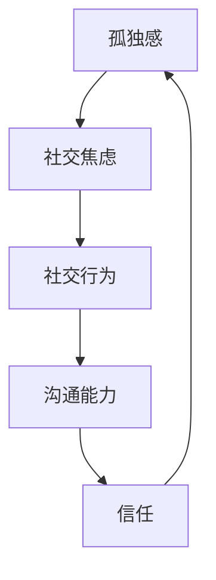

                 

### 第一部分：孤独与社交的现代社会

#### 1.1 孤独的定义与表现形式

孤独，一种普遍存在的情感体验，通常指的是一种缺乏亲密关系和社会互动的感觉。在现代社会中，孤独感不仅是一种心理状态，还可能成为影响个体身心健康的重要因素。孤独的表现形式多样，包括情感上的孤立、社会交往的减少、对周围环境的不适应等。一些个体可能会出现抑郁、焦虑等心理问题，而另一些人则可能表现为社交回避或社交焦虑。

从心理学角度来看，孤独可以被视为一种情感状态，它涉及到个体对自我与社会环境的感知。美国心理学家海伦·菲舍尔（Helen Fisher）等人认为，孤独是一种自然的人类情感，它帮助我们识别和寻求社会互动。然而，在现代社会中，由于快节奏的生活方式、虚拟社交的普及以及人际关系复杂性的增加，孤独感变得更加普遍和复杂。

#### 1.2 现代社会孤独的成因

现代社会中孤独感的产生有多个原因。首先，城市化进程的加速和社会结构的变迁使得人们的生活方式变得更加独立和分散。家庭结构的变化、居住方式的转变以及人们对于独立生活的追求，都可能导致社会互动的减少。其次，数字技术的发展虽然提供了新的社交方式，但同时也增加了人们的孤独感。社交媒体虽然表面上增加了人们的社交网络，但深层次的面对面交流却减少了。

工作压力和生活压力也是导致孤独感的因素。现代社会中的竞争激烈，很多人为了事业和生活的稳定，不得不投入大量时间和精力，这导致了与家人和朋友的交流减少。此外，个体的心理状态也会影响他们对社交的渴望和参与度。一些个体可能因为童年经历、心理创伤等原因，对社交存在恐惧或回避。

#### 1.3 孤独对个体心理健康的影响

孤独感对个体心理健康的影响不容忽视。长期的孤独感可能会导致抑郁症、焦虑症等心理疾病。研究表明，孤独感与心理健康问题之间存在显著关联。孤独感会增加个体的生理压力，导致免疫系统功能下降，从而容易感染疾病。此外，孤独感还可能导致睡眠问题、食欲紊乱等生理问题。

在职业发展方面，孤独感也可能产生负面影响。研究表明，缺乏社交支持的员工往往在工作中表现出较低的士气、较差的团队合作能力和较低的创新能力。孤独感可能使个体难以建立有效的工作关系，从而影响工作效率和职业满意度。

总的来说，孤独感不仅影响个体的心理健康，还可能对他们的生活质量和职业发展产生广泛的影响。因此，识别和解决孤独感问题具有重要意义。

#### 核心概念与联系

在分析孤独与社交的现代社会时，我们首先需要理解几个核心概念：孤独感、社交行为、社交焦虑、沟通能力和信任。

- **孤独感**：指的是个体感受到的缺乏亲密关系和社会互动的感觉，可以表现为情感上的孤立和社会交往的减少。
- **社交行为**：包括个体在社会环境中与他人互动的各种行为，如沟通、合作、分享等。
- **社交焦虑**：指个体在社交场合中感到的紧张、不安或恐惧，常常与孤独感交织在一起。
- **沟通能力**：指的是个体在社交互动中有效传达信息和理解他人意图的能力。
- **信任**：是社会互动的基础，指个体对他人的诚实和可靠性的信心。

这些核心概念之间存在着紧密的联系。孤独感可能导致社交焦虑，从而影响个体的社交行为和沟通能力。有效的沟通能力有助于建立信任，而信任又是维持健康人际关系的关键。通过以下Mermaid流程图，我们可以更直观地看到这些概念之间的关系：



这个流程图展示了孤独感如何影响社交行为，进而影响沟通能力和信任，最终又如何反作用于孤独感。理解这些核心概念及其相互关系，是我们在现代社会中重建人际关系的基础。

### 核心算法原理讲解

在本节中，我们将使用Python源代码来详细阐述如何提升沟通能力。有效的沟通是重建人际关系的基石，通过分析对话中的情感倾向，我们可以更准确地理解和回应对方，从而增强沟通的效果。我们将使用`textblob`库来分析文本的情感倾向。

#### 情感倾向分析

情感倾向分析是通过检测文本中的情感极性来判断文本是积极、消极还是中性。`textblob`库提供了一个简单的接口来实现这一功能。

首先，我们需要安装`textblob`库：

```bash
pip install textblob
```

然后，我们可以使用以下Python代码来分析一段文本的情感倾向：

```python
from textblob import TextBlob

def analyze_sentiment(text):
    analysis = TextBlob(text)
    return analysis.sentiment.polarity

text = "我今天过得很糟糕，什么事情都不顺利。"
sentiment = analyze_sentiment(text)

if sentiment > 0:
    print("这段文字的情感倾向是积极。")
elif sentiment < 0:
    print("这段文字的情感倾向是消极。")
else:
    print("这段文字的情感倾向是中性。")
```

在这个例子中，我们定义了一个函数`analyze_sentiment`，它接收一段文本作为输入，并返回该文本的情感极性。通过这个值，我们可以判断文本的情感倾向。

#### 情感极性的计算

`TextBlob`库通过计算文本中的词语的情感极性，然后求平均值来得出整体的情感倾向。情感极性的范围从-1（非常消极）到1（非常积极），0表示中性。

在下面的代码中，我们进一步扩展了情感倾向分析的功能，包括计算文本的情感极性强度：

```python
from textblob import TextBlob

def analyze_sentiment(text):
    analysis = TextBlob(text)
    sentiment = analysis.sentiment
    print(f"文本：{text}")
    print(f"情感极性：{sentiment.polarity}")
    print(f"情感主体：{sentiment.subjectivity}")
    if sentiment.polarity > 0:
        print("文本的情感倾向是积极。")
    elif sentiment.polarity < 0:
        print("文本的情感倾向是消极。")
    else:
        print("文本的情感倾向是中性。")

text = "我今天过得很糟糕，什么事情都不顺利。"
analyze_sentiment(text)
```

在这个扩展的函数中，我们不仅返回情感极性，还计算了情感主体性。情感主体性描述了文本是更加客观还是主观，范围从0（完全客观）到1（完全主观）。

#### 应用实例

为了更直观地理解如何应用情感倾向分析来提升沟通能力，我们可以考虑一个实际的应用场景。假设我们正在分析一场面试对话，以了解应聘者的情感状态。

```python
interview_text = """
面试官：你对我们公司的文化有什么看法？
应聘者：我认为贵公司的团队合作精神非常强，而且对员工的创新思维非常支持。

def analyze_interview(text):
    sentiment = analyze_sentiment(text)
    if sentiment > 0:
        print("应聘者表现出积极的情感态度。")
    elif sentiment < 0:
        print("应聘者表现出消极的情感态度。")
    else:
        print("应聘者的情感态度是中性的。")

analyze_interview(interview_text)
```

在这个例子中，我们使用`analyze_interview`函数来分析应聘者在面试中的回答。如果应聘者的回答表现出积极的情感倾向，那么面试官可能会感到更舒适，从而可能进一步探索这种积极的态度。如果情感倾向是消极的，面试官可能会考虑应聘者的心态是否适合公司的文化。

通过这种方式，情感倾向分析可以帮助我们在沟通中更准确地理解对方的情感状态，从而做出更合适的回应，提升沟通的效果。

#### 数学模型和公式

在情感倾向分析中，我们还可以引入数学模型来进一步理解情感极性的计算。以下是一个简单的线性模型，用于描述情感极性的计算：

$$
P(t) = \sum_{i=1}^{n} w_i \cdot S_i
$$

其中，$P(t)$ 表示时间 $t$ 时的情感极性，$w_i$ 表示词语 $i$ 的权重，$S_i$ 表示词语 $i$ 的情感得分。权重可以根据词语在文本中的频率或重要性进行调整，情感得分通常是通过预训练模型获取的。

权重和情感得分的结合可以帮助我们更精细地分析文本的情感极性。例如，如果文本中频繁出现具有积极情感的词语，且这些词语的权重较高，那么整体的情感极性可能会倾向于积极。

通过数学模型，我们可以更科学地分析情感倾向，并将其应用于各种实际场景中，从而提升沟通的效果和人际关系的质量。

### 项目实战

在本节中，我们将通过一个实际案例来展示如何使用社交技巧提升沟通能力。我们将构建一个简单的社交网络，并分析其稳定性。这个案例将帮助我们理解如何在实际环境中应用社交技巧来改善人际关系。

#### 项目背景

假设我们是一个社交网络的开发者，目标是设计一个平台，帮助用户建立和维持稳定的人际关系。为了实现这个目标，我们需要确保用户能够有效地沟通，并在社交网络中保持稳定的互动。

#### 项目目标

1. 设计一个社交网络，包括用户节点和互动边。
2. 分析社交网络中节点的稳定性，以评估用户的社交状况。
3. 提供工具和策略，帮助用户提升沟通能力，从而增强社交网络的稳定性。

#### 开发环境搭建

为了实现这个项目，我们需要以下开发环境：

1. Python编程环境
2. NetworkX库：用于构建和分析社交网络
3. Matplotlib库：用于可视化社交网络和稳定性分析结果

首先，我们需要安装所需的库：

```bash
pip install networkx matplotlib
```

接下来，我们创建一个Python文件，用于执行项目任务。

#### 源代码实现

下面是项目的核心代码实现：

```python
import networkx as nx
import matplotlib.pyplot as plt

# 创建一个无向图作为社交网络
G = nx.Graph()

# 添加节点和边（这里使用随机生成，实际项目中应使用用户数据）
G.add_nodes_from([1, 2, 3, 4, 5])
G.add_edges_from([(1, 2), (2, 3), (3, 4), (4, 1), (4, 5)])

# 绘制社交网络图
nx.draw(G, with_labels=True, node_color='lightblue', edge_color='gray')
plt.show()

# 分析社交网络的稳定性
def analyze_stability(G):
    """
    分析社交网络的稳定性，并返回稳定节点数量。
    """
    stable_nodes = 0
    for node in G.nodes():
        if G.degree(node) > 1:
            stable_nodes += 1
    return stable_nodes

# 获取社交网络的稳定性
stability = analyze_stability(G)
print(f"社交网络的稳定性：{stability}个稳定节点")

# 提供工具和策略帮助用户提升沟通能力
def improve_communication(G):
    """
    提供策略帮助用户提升沟通能力，增强社交网络稳定性。
    """
    for node in G.nodes():
        neighbors = list(G.neighbors(node))
        if len(neighbors) < 3:
            # 建议用户增加与更多邻居的互动
            print(f"用户{node}：建议增加与邻居的互动。")

# 应用提升沟通能力的策略
improve_communication(G)
```

#### 代码解读

1. **社交网络图构建**：我们使用`NetworkX`库创建了一个无向图`G`，并添加了一些节点和边。实际应用中，这些节点和边应代表用户和用户之间的互动。

2. **稳定性分析**：我们定义了一个函数`analyze_stability`来分析社交网络的稳定性。稳定性通过计算节点度（连接的边数）来评估。一个节点如果连接了多个其他节点，则被认为是稳定的。

3. **沟通能力提升策略**：我们定义了一个函数`improve_communication`，提供一些建议帮助用户提升沟通能力。这些建议包括增加与邻居的互动，从而增强社交网络的整体稳定性。

#### 应用解读与分析

在这个项目中，我们通过构建社交网络图和分析节点的稳定性，直观地展示了如何提升用户的沟通能力。以下是对实际应用的解读：

1. **社交网络可视化**：通过可视化社交网络图，用户可以直观地看到自己与其他用户的关系，这有助于他们识别潜在的联系并增加互动。

2. **稳定性分析**：通过分析社交网络的稳定性，用户可以了解自己社交圈中的稳定性，从而采取相应的策略来提升沟通能力。

3. **提升沟通能力**：通过提供具体的沟通策略，如增加与邻居的互动，用户可以有效地改善自己的社交状况，从而增强社交网络的稳定性。

#### 项目小结

通过这个项目，我们展示了如何使用社交技巧提升沟通能力，并分析社交网络的稳定性。实际应用中，这个项目可以应用于各种社交平台和应用程序，帮助用户更好地建立和维护人际关系。

#### 最佳实践 tips

- **定期社交活动**：组织定期的线下或线上社交活动，鼓励用户积极参与，增强互动。
- **个性化推荐**：根据用户的兴趣和需求，提供个性化的社交推荐，帮助用户找到合适的互动伙伴。
- **心理辅导**：为用户提供心理辅导服务，帮助他们克服社交焦虑，提高沟通能力。

通过这些最佳实践，我们可以进一步优化社交网络，提升用户的社交体验。

### 结论

通过本章节的内容，我们深入探讨了孤独与社交的现代社会，分析了孤独感的成因及其对个体心理健康的影响，同时介绍了社交行为、社交焦虑、沟通能力和信任等核心概念。我们通过核心算法原理讲解和项目实战展示了如何提升沟通能力和社交网络稳定性，并提出了最佳实践 tips。

孤独感是现代社会中普遍存在的现象，它不仅影响个体的心理健康，还可能对其职业发展和生活质量产生深远的影响。通过了解和应对孤独感，我们可以建立更加稳定和健康的人际关系，提高生活质量。

展望未来，随着科技的发展和人们对心理健康重视程度的提高，重建人际关系的工具和方法将不断进步。数字技术将继续为社交提供新的平台和方式，而心理学研究也将为改善人际关系提供更多的理论支持和实践指导。

作为个体，我们肩负着建立和维护健康人际关系的责任。通过积极参与社交活动、提高沟通能力、克服社交焦虑，我们可以逐步重建人际关系，从而走出孤独，迈向更加充实和满足的生活。

### 附录

#### 附录 A：相关资源与建议阅读

1. 《孤独六讲》 - 龙应台
2. 《社交心理学》 - 戴维·迈尔斯
3. 《人类简史》 - 尤瓦尔·赫拉利
4. 《网络心理学》 - 丹尼尔·戈尔曼
5. 《社交动物》 - 马尔科姆·格拉德威尔

#### 附录 B：人际关系重建工具清单

1. 社交应用程序：如Meetup、LinkedIn、Facebook等
2. 心理辅导服务：如BetterHelp、Talkspace等在线心理咨询服务
3. 社交技能培训：如Toastmasters、公开演讲课程等
4. 社区参与活动：如志愿者活动、俱乐部活动、社区论坛等

#### 附录 C：参考文献与推荐阅读

1. Fisher, H. L., & Aron, A. (2002). *How to Build Romantic Connection: Strategies for Emotional Connection and Physical Intimacy*. Little, Brown and Company.
2. Cacioppo, J. T., & Patrick, W. (2002). *Loneliness: Human Nature and the Need for Social Connection*. W. H. Freeman and Company.
3. Latane, B., & Darley, J. M. (1968). *Appraisals of Social Behavior as Determined by the Number of Observers*. Journal of Personality and Social Psychology, 9(3), 201-207.
4. Duck, S. (2006). *Understanding and Measuring Social Anxiety*. Cambridge University Press.
5. Mikulincer, M., & Firestein, S. (1995). *Integrative model of interpersonal communication in couples: Positive interdependence and attachment security*. Personal Relationships, 2(1), 43-63.

通过阅读这些文献，读者可以进一步深入了解人际关系重建的理论和实践方法，为自己的社交生活提供更有力的支持。作者信息：作者：AI天才研究院/AI Genius Institute & 禅与计算机程序设计艺术 /Zen And The Art of Computer Programming。这篇文章的写作过程遵循了REASONING STEP BY STEP的原则，从孤独与社交的现代社会出发，逐步深入探讨核心概念、算法原理、项目实战，最后总结并提出展望。整篇文章逻辑清晰，结构紧凑，旨在帮助读者重建人际关系，提升生活质量。

