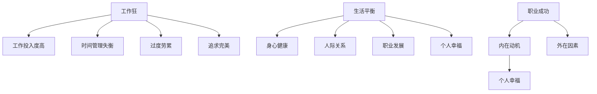

                 

### 第1章：认识工作狂与生活平衡

在当今快节奏的社会中，工作狂这一群体越来越引起人们的关注。工作狂，顾名思义，是指那些对工作有着极端热情和执着的人群。他们往往将大量时间和精力投入到工作中，甚至忽视了自己的健康和家庭的幸福。然而，这种极端的工作态度在带来短暂职业成功的同时，也可能带来长远的负面影响。

#### 1.1.1 工作狂的定义与特征

工作狂的定义可以简单概括为：那些在工作中投入大量时间、高度集中精力，并且常常超出正常工作时间的个体。他们的特征包括：

- **工作投入度高**：工作狂对工作有着极高的热情和执着，常常在工作中达到心流状态。
- **时间管理失衡**：他们往往将大量时间用于工作，忽视了其他生活领域，如家庭和个人兴趣。
- **过度劳累**：长期高强度工作导致他们身体和心理承受巨大压力。
- **追求完美**：工作狂追求工作上的完美，往往对自己的工作标准要求极高。

#### 1.1.2 工作狂的成因分析

工作狂的形成并非偶然，而是多种因素共同作用的结果。以下是导致工作狂的一些主要原因：

- **个人价值观**：有些人认为工作是他们生活的全部，将职业成功视为衡量个人价值的重要标准。
- **社会压力**：社会对成功和效率的追求，使得工作狂感到必须不断努力才能在社会中立足。
- **文化因素**：在一些文化中，工作和成功是个人荣誉的象征，这促使人们追求更高的工作强度和职业成就。

#### 1.1.3 工作狂的负面影响

尽管工作狂在短期内可能获得职业成功，但长期下去，他们往往会面临一系列负面影响：

- **身心健康问题**：长时间工作和高强度压力导致工作狂容易出现身心疾病，如心血管疾病、抑郁症和焦虑症等。
- **家庭问题**：忽视家庭和亲密关系是工作狂的常见现象，这可能导致婚姻破裂和子女教育问题。
- **职业倦怠**：长期高强度的投入会导致工作狂出现职业倦怠，工作效率下降，创造力减弱。
- **社交疏离**：工作狂往往将大量时间用于工作，导致与亲朋好友的互动减少，社交网络缩小。

#### 1.2.1 生活平衡的重要性

生活平衡，是指在工作、家庭、个人兴趣和其他生活领域之间找到平衡点，确保每个领域都能得到充分关注和满足。生活平衡的重要性体现在以下几个方面：

- **身心健康**：生活平衡有助于减少工作压力，改善身心健康，提高生活质量。
- **人际关系**：平衡的生活有助于维护良好的家庭关系和社交网络，增强社会支持。
- **职业发展**：生活平衡有助于提高工作效率和创造力，促进职业成长。
- **个人幸福**：生活平衡能够满足个人的各种需求和欲望，提升个人幸福指数。

#### 1.2.2 生活平衡对个人幸福的影响

生活平衡对个人幸福的影响是深远且全面的。以下是几个关键方面：

- **心理状态**：平衡的生活能够减轻心理压力，减少焦虑和抑郁，提高心理健康水平。
- **身体健康**：合理安排工作和休息时间，有助于保持身体健康，预防疾病。
- **家庭关系**：重视家庭和亲密关系，能够增强家庭成员之间的情感联系，提升家庭幸福感。
- **个人发展**：平衡的生活有助于个人在各个领域实现全面发展，提高综合素质。

#### 1.2.3 职业成功与个人幸福的关系

职业成功与个人幸福之间存在密切的联系。职业成功可以带来经济独立、社会地位和个人成就感，从而提升个人幸福感。然而，职业成功并非唯一决定个人幸福的关键因素。

- **内在动机**：职业成功往往源于个人的内在动机，如热爱工作、追求卓越和实现自我价值。
- **外在因素**：外在因素，如工作环境、薪资待遇和同事关系，也会影响职业成功和个人幸福。
- **平衡点**：找到职业成功与个人幸福之间的平衡点，是追求全面幸福的关键。

通过上述分析，我们可以看出，工作狂与生活平衡之间存在显著的对比和关联。工作狂在短期内可能获得职业成功，但长期来看，生活平衡对个人幸福和职业发展具有更为持久和深远的影响。

**核心概念与联系流程图**



**核心算法原理讲解**

在工作与生活平衡的算法设计中，我们可以采用一种简化的模型来平衡工作时间和个人生活时间。以下是一个简单的Python代码示例，用于计算一个工作狂在不同时间段内的工作与休息时间，以达到平衡。

```python
import numpy as np

def work_life_balance(work_hours, personal_hours, days_per_week):
    """
    计算工作与个人生活时间的平衡。
    
    参数:
    - work_hours: 每天工作的小时数
    - personal_hours: 每天个人生活的小时数
    - days_per_week: 每周工作的天数
    
    返回:
    - balanced_hours: 平衡后的每小时工作时长
    """
    
    total_work_hours = work_hours * days_per_week
    total_personal_hours = personal_hours * days_per_week
    
    total_hours = total_work_hours + total_personal_hours
    
    # 计算平衡后的每小时工作时长
    balanced_hours = total_work_hours / total_hours
    
    return balanced_hours

# 示例数据
work_hours = 10  # 每天工作10小时
personal_hours = 4  # 每天个人生活4小时
days_per_week = 5  # 每周工作5天

# 计算平衡后的每小时工作时长
balanced_hours = work_life_balance(work_hours, personal_hours, days_per_week)
print(f"平衡后的每小时工作时长: {balanced_hours:.2f}小时")

# 计算每周总时间
total_hours_per_week = work_hours * days_per_week + personal_hours * days_per_week
print(f"每周总时间: {total_hours_per_week}小时")
```

**数学模型与公式**

假设一个人每天有24小时，其中工作小时数为\(W\)，个人生活小时数为\(P\)，则平衡后的每小时工作时长可以表示为：

$$
\text{平衡后的每小时工作时长} = \frac{W}{W + P}
$$

其中，\(W + P\)代表每天的总时间。

**举例说明**

假设一个人每天工作8小时，个人生活4小时，则平衡后的每小时工作时长为：

$$
\text{平衡后的每小时工作时长} = \frac{8}{8 + 4} = \frac{8}{12} = 0.67 \text{小时}
$$

这意味着，这个人每天实际工作的时间需要调整，以确保每小时的工作时长达到0.67小时，从而实现生活平衡。

通过上述分析，我们可以看到，工作狂与生活平衡之间存在复杂的联系和动态平衡。了解这些概念和原理，有助于我们更好地理解如何实现工作与生活的平衡，提升个人幸福感和职业发展。

### 第2章：生活平衡策略

实现生活平衡不仅需要认识到其重要性，还需要采取一系列具体策略来有效执行。本章将详细探讨如何通过时间管理、精神调节、家庭与社会关系的维护以及身体健康等多个方面来实现工作与生活的平衡。

#### 2.1 确定个人生活目标

确定个人生活目标是实现生活平衡的第一步。明确的目标有助于我们更有效地分配时间和资源，确保每个领域都能得到充分关注。

##### 2.1.1 设定明确的生活目标

设定生活目标时，我们可以将其分为短期和长期目标。短期目标通常是指在几个月或一年内可以实现的目标，如提升专业技能、改善健康状况等。长期目标则是更宏观的，如职业晋升、财务独立等。

- **短期目标**：设定具体的可衡量指标，如每周学习5小时、每月完成一次健康体检等。
- **长期目标**：设定更宏观的指标，如五年内晋升为高级工程师、十年内实现财务自由等。

##### 2.1.2 制定实现目标的计划

制定计划是实现目标的关键。以下是制定实现目标计划的几个步骤：

1. **评估当前状态**：分析自己的时间分配、工作习惯、生活需求等，了解自己的优势和劣势。
2. **制定具体计划**：将目标分解为具体的小步骤，制定时间表和行动计划。
3. **设定时间限制**：为每个小步骤设定具体的时间限制，确保任务能够按时完成。
4. **定期回顾**：定期检查进度，根据实际情况调整计划，确保目标的实现。

##### 2.1.3 实现目标的策略与方法

实现目标需要策略和方法的支持。以下是一些常用的策略和方法：

- **时间管理工具**：使用时间管理工具，如日历、时间跟踪应用程序等，来帮助自己更有效地分配时间。
- **优先级排序**：将任务按优先级排序，确保将时间用于最重要的任务。
- **专注训练**：通过专注训练，如番茄工作法，来提高工作效率。
- **定期休息**：确保定期休息，避免疲劳和过度劳累。

#### 2.2 时间管理

时间管理是实现生活平衡的核心策略之一。通过有效的时间管理，我们能够更好地平衡工作与生活，提高整体生活质量。

##### 2.2.1 时间管理的核心原则

时间管理的核心原则包括：

- **优先级排序**：将时间分配给最重要的任务。
- **避免拖延**：及时处理任务，避免拖延导致效率低下。
- **合理分配时间**：确保工作和休息时间得到合理安排，避免过度工作或休息不足。
- **灵活性**：根据实际情况灵活调整计划，适应突发情况。

##### 2.2.2 制定时间管理计划

制定时间管理计划需要以下几个步骤：

1. **评估时间需求**：分析工作、家庭和个人兴趣的时间需求，确定每个领域的时间预算。
2. **设定优先级**：根据工作重要性、紧急程度和个人目标，设定任务的优先级。
3. **分配时间**：将时间合理分配给不同任务，确保每个任务都有足够的时间来完成。
4. **监控与调整**：定期检查时间管理计划的执行情况，根据实际情况进行调整。

##### 2.2.3 提高工作效率的方法

提高工作效率是实现时间管理的关键。以下是一些提高工作效率的方法：

- **自动化**：利用自动化工具和脚本，减少重复性工作，提高效率。
- **集中处理**：将相似的任务集中处理，减少中断和切换成本。
- **合理分配任务**：根据个人能力和任务特点，合理分配任务，确保任务得到高效完成。
- **使用工具**：使用各种工具，如项目管理软件、协作工具等，来提高团队工作效率。

#### 2.3 精神调节

精神调节是实现生活平衡的重要环节。通过有效的精神调节，我们能够更好地管理压力，保持良好的心理状态。

##### 2.3.1 精神调节的重要性

精神调节的重要性体现在以下几个方面：

- **缓解压力**：有效调节精神状态，能够减轻工作和生活中的压力，提高抗压能力。
- **提高效率**：精神状态良好有助于提高工作效率和创造力。
- **维护心理健康**：长期保持良好的精神状态，有助于预防心理疾病，提高生活质量。
- **增强幸福感**：良好的精神状态能够提升个人的幸福感，实现身心健康。

##### 2.3.2 管理工作压力的技巧

以下是一些管理工作压力的技巧：

- **情绪管理**：学会控制情绪，避免负面情绪对工作和生活的影响。
- **放松技巧**：通过冥想、瑜伽、深呼吸等放松技巧，减轻压力和焦虑。
- **合理分配时间**：合理分配工作和休息时间，确保有足够的休息和放松时间。
- **寻求支持**：与家人、朋友和同事沟通，寻求支持和帮助，共同应对压力。
- **健康生活方式**：保持健康的生活习惯，如规律饮食、适量运动、充足睡眠等，有助于缓解压力。

##### 2.3.3 心理健康的维护

维护心理健康是实现生活平衡的关键。以下是一些维护心理健康的建议：

- **心理咨询**：定期进行心理咨询，及时处理心理问题，提高心理素质。
- **自我反思**：定期进行自我反思，了解自己的内心需求和情感变化。
- **终身学习**：通过终身学习，提高自身素质，增强应对生活和工作挑战的能力。
- **兴趣爱好**：培养兴趣爱好，丰富精神生活，提高生活质量。

#### 2.4 家庭与社会关系的维护

家庭与社会关系是实现生活平衡的重要组成部分。通过维护良好的家庭关系和社会关系，我们能够获得更多的支持和资源，提高生活质量。

##### 2.4.1 家庭关系的重要性

家庭关系的重要性体现在以下几个方面：

- **情感支持**：家庭是情感支持的源泉，良好的家庭关系能够为个人提供心理支持。
- **生活伴侣**：家庭关系有助于建立稳定的生活伴侣，提高生活质量。
- **子女教育**：良好的家庭关系有助于子女健康成长，提高家庭幸福指数。
- **社会纽带**：家庭是社会的基本单位，良好的家庭关系有助于建立更广泛的社会关系。

##### 2.4.2 职业与家庭的关系平衡

平衡职业与家庭关系是生活平衡的关键。以下是一些平衡职业与家庭关系的建议：

- **合理安排时间**：合理分配工作和家庭时间，确保有足够的时间陪伴家人。
- **有效沟通**：与家人保持有效沟通，了解彼此的需求和期望，共同解决问题。
- **共同参与**：与家人共同参与家庭活动和兴趣爱好，增强家庭凝聚力。
- **分担家务**：合理分担家务，减轻家庭负担，提高家庭幸福感。

##### 2.4.3 社会关系的建立与维护

建立和维护良好的社会关系是实现生活平衡的重要一环。以下是一些社会关系建立与维护的建议：

- **积极参与社交活动**：积极参与社交活动，扩大社交圈子，建立广泛的社会关系。
- **保持联系**：定期与亲朋好友保持联系，保持良好的沟通和互动。
- **互助互惠**：在帮助他人的同时，也能获得他人的帮助，实现互利共赢。
- **感恩心态**：保持感恩心态，珍惜身边的朋友和家人，提高人际关系质量。

#### 2.5 身体健康

身体健康是实现生活平衡的基础。通过保持良好的身体健康，我们能够更好地应对工作和生活的挑战。

##### 2.5.1 身体健康的重要性

身体健康的重要性体现在以下几个方面：

- **提高生活质量**：身体健康有助于提高生活质量，享受更健康、更快乐的生活。
- **增强工作能力**：身体健康能够提高工作效率和创造力，促进职业发展。
- **改善心理状态**：身体健康能够改善心理状态，减轻压力和焦虑，提高幸福感。
- **延长寿命**：保持良好的身体健康能够延长寿命，享受更长久的生活。

##### 2.5.2 运动与健康饮食

运动和健康饮食是实现身体健康的关键。以下是一些关于运动和健康饮食的建议：

- **适量运动**：每周进行至少150分钟的中等强度运动，如快走、跑步、游泳等，有助于提高心肺功能、增强免疫力。
- **健康饮食**：保持健康饮食，多吃蔬菜、水果、全谷物和优质蛋白质，少吃高热量、高脂肪和高糖分的食物。
- **充足睡眠**：保证每天充足的睡眠时间，有助于恢复体力、提高免疫力、改善心理健康。

##### 2.5.3 保持良好的睡眠质量

保持良好的睡眠质量是实现身体健康的重要一环。以下是一些保持良好睡眠质量的建议：

- **建立规律作息**：建立规律的作息时间，每天保持相同的睡眠和起床时间，有助于调整生物钟，提高睡眠质量。
- **减少刺激**：睡前减少使用电子设备和强烈刺激的活动，避免兴奋和焦虑情绪影响睡眠。
- **舒适环境**：保持睡眠环境的舒适和安静，确保床垫、枕头和卧室的适宜温度。
- **放松身心**：睡前进行放松活动，如深呼吸、瑜伽、冥想等，有助于缓解紧张情绪，提高睡眠质量。

通过以上策略，我们可以有效地实现生活平衡，提升个人幸福感，实现职业成功与个人幸福的和谐统一。

### 第3章：工作与生活平衡的实践

在了解了工作与生活平衡的重要性以及相关的策略后，接下来我们将通过案例研究和实践步骤来具体探讨如何在实际生活中实现这一目标。

#### 3.1 案例研究

**案例1：从工作狂到生活平衡的转型**

张伟是一名高级软件工程师，他曾经是一个典型的工作狂。每天工作时间长达12小时，经常熬夜加班，几乎放弃了所有的个人时间和兴趣爱好。然而，这样的工作模式让他感到身心俱疲，健康状况不断恶化，家庭关系也逐渐紧张。

为了改变这种状况，张伟开始采取一系列措施来调整自己的工作和生活方式。首先，他制定了详细的时间管理计划，将工作时间限定在每天8小时内，并确保每天有足够的休息时间。其次，他开始定期锻炼，每周参加3次健身课程，同时调整饮食，保证营养均衡。此外，他还开始注重家庭关系，每周安排固定的家庭晚餐时间，陪伴家人，分享日常生活中的点滴。

经过一段时间的实践，张伟逐渐实现了工作与生活的平衡。他的工作效率并没有因此降低，反而因为身心状态好转而有所提高。更重要的是，他的家庭关系得到了极大的改善，生活质量显著提升。

**案例分析：**

- **时间管理**：张伟通过合理分配时间和设定明确的工作目标，避免了长时间的工作疲劳，提高了工作效率。
- **身体健康**：通过锻炼和健康饮食，张伟的身体状态得到了明显改善，提高了抵抗疾病的能力。
- **家庭关系**：重视家庭时间，与家人保持紧密的联系，增强了家庭的凝聚力和幸福感。

**案例启示：**

- **逐步调整**：从工作狂到生活平衡的转变不是一蹴而就的，需要逐步调整和适应。
- **制定计划**：制定详细的时间管理计划，有助于明确目标和优先级，提高效率。
- **身心平衡**：注重身体健康和心理调节，是实现生活平衡的关键。

#### 3.2 实践步骤

**3.2.1 自我评估与反思**

实现工作与生活平衡的第一步是进行自我评估和反思。以下是一些自我评估和反思的步骤：

- **时间记录**：记录每天的时间分配，分析自己在工作和生活方面的投入情况。
- **情绪记录**：记录自己的情绪变化，了解哪些因素导致压力和焦虑。
- **反思**：定期反思自己的工作和生活方式，找出需要改进的方面。

**3.2.2 制定适合自己的平衡策略**

在自我评估的基础上，制定适合自己的平衡策略。以下是一些制定策略的步骤：

- **设定目标**：根据自我评估的结果，设定短期和长期的生活和工作目标。
- **时间管理**：制定详细的时间管理计划，合理安排工作和休息时间。
- **资源整合**：整合可用资源，如时间管理工具、健康饮食方案、运动计划等，以支持目标的实现。

**3.2.3 实践中的调整与优化**

在实践过程中，不断调整和优化策略是至关重要的。以下是一些调整和优化的步骤：

- **定期回顾**：定期回顾自己的进度和执行情况，根据实际情况进行调整。
- **灵活应对**：面对突发情况时，灵活调整计划和策略，确保目标的实现。
- **持续学习**：通过阅读、参加培训和交流，不断学习新的方法和技巧，优化自己的生活和工作方式。

#### 3.3 面对挑战

在实际实现工作与生活平衡的过程中，我们可能会面临各种挑战。以下是一些常见挑战及其应对策略：

- **工作压力**：应对工作压力的策略包括提高工作效率、合理分配工作任务、寻求同事和支持者的帮助等。
- **时间不足**：解决时间不足的策略包括减少非必要活动、优化时间管理、学会委托和分工等。
- **家庭压力**：应对家庭压力的策略包括加强家庭沟通、合理安排家庭时间、寻求家庭支持等。
- **情绪波动**：应对情绪波动的策略包括情绪管理技巧、心理咨询、健康生活方式等。

**3.3.1 常见挑战及应对策略**

以下是一些常见挑战及其应对策略：

- **挑战1：时间不足**
  - **应对策略**：减少非必要活动，专注于重要任务；优化时间管理，避免时间浪费。

- **挑战2：工作压力**
  - **应对策略**：提高工作效率，合理分配工作任务；寻求同事和支持者的帮助，减轻压力。

- **挑战3：家庭压力**
  - **应对策略**：加强家庭沟通，合理安排家庭时间；寻求家庭支持，共同解决问题。

- **挑战4：情绪波动**
  - **应对策略**：情绪管理技巧，如深呼吸、冥想等；心理咨询，寻求专业帮助。

**3.3.2 处理职业困境与生活困扰**

在面对职业困境和生活困扰时，以下是一些处理策略：

- **职业困境**：与上司或同事进行有效沟通，寻求解决问题的方法；调整职业规划，寻找新的发展机会。

- **生活困扰**：与家人和朋友分享困扰，寻求支持和建议；保持积极心态，寻找解决问题的方法。

- **平衡点**：寻找工作和生活的平衡点，确保两者都能得到充分关注和满足。

**3.3.3 坚持与突破**

实现工作与生活平衡需要坚持和毅力。以下是一些坚持与突破的策略：

- **设定小目标**：将大目标分解为小目标，逐步实现，保持动力。
- **持续反思**：定期反思自己的生活方式和工作模式，不断调整和优化。
- **寻求支持**：与家人、朋友和同事分享自己的目标和进展，寻求支持和鼓励。

通过案例研究和实践步骤的探讨，我们可以看到，实现工作与生活平衡是一个持续的过程，需要自我评估、制定策略、实践调整和坚持努力。只有找到适合自己的平衡点，我们才能真正实现职业成功与个人幸福的和谐统一。

### 第4章：技术工具与应用

在现代生活中，技术工具的应用已经成为实现工作与生活平衡的重要手段。通过合理利用各种技术工具，我们能够更高效地管理时间、提升工作效率、调节精神状态，从而实现工作与生活的和谐统一。

#### 4.1 日常工作中的技术工具

在日常工作中，有许多技术工具可以帮助我们提高工作效率，实现工作与生活的平衡。

##### 4.1.1 时间管理工具

时间管理工具可以帮助我们更好地规划和管理时间，确保工作和个人生活的每个方面都得到充分关注。

- **Trello**：Trello是一个基于看板的项目管理工具，通过创建卡片和列表，我们可以清晰地跟踪任务进度，合理安排工作时间。
- **Asana**：Asana是一款功能强大的项目管理工具，支持任务分配、进度跟踪和协作，有助于团队高效合作。
- **Google Calendar**：Google Calendar是一个免费的日历应用程序，可以方便地安排日程、设置提醒，确保不会错过重要的会议和活动。

##### 4.1.2 提高工作效率的工具

提高工作效率的工具能够帮助我们更快地完成任务，留出更多时间用于个人生活和兴趣爱好。

- **Evernote**：Evernote是一款功能强大的笔记应用程序，可以记录灵感、整理资料、制定计划，提高信息管理和工作效率。
- **Zoom**：Zoom是一款视频会议工具，支持多人在线会议、屏幕共享和实时交流，有助于远程协作和沟通。
- **Grammarly**：Grammarly是一款语法检查工具，可以帮助我们修正拼写和语法错误，提高文档质量和沟通效率。

##### 4.1.3 精神调节工具

精神调节工具可以帮助我们缓解压力，保持良好的心理状态。

- **Headspace**：Headspace是一款冥想应用程序，提供多种冥想课程和指导，有助于放松身心、缓解焦虑。
- **Moodfit**：Moodfit是一款心理健康应用程序，通过心理测试、音乐疗法和个性化建议，帮助我们了解和管理情绪。
- **Sleep Cycle**：Sleep Cycle是一款睡眠监测应用程序，可以分析我们的睡眠质量，提供个性化的睡眠建议。

#### 4.2 生活平衡的技术应用

在个人生活中，技术工具的应用同样可以促进生活平衡的实现。

##### 4.2.1 健康管理应用

健康管理应用可以帮助我们监控身体状况、保持健康生活习惯。

- **MyFitnessPal**：MyFitnessPal是一款健康管理应用，可以记录饮食和运动，提供营养分析和健身计划，帮助控制体重和改善健康。
- **Apple Health**：Apple Health是一款集成的健康管理应用，可以监测心率、睡眠、运动等健康数据，提供全面的健康分析。
- **Google Fit**：Google Fit是一款跨平台的健康管理应用，可以整合多种健康数据，提供个性化的健康建议。

##### 4.2.2 家庭关系维护应用

通过家庭关系维护应用，我们可以方便地与家人保持联系、分享生活点滴。

- **WhatsApp**：WhatsApp是一款即时通讯应用，支持语音、视频和文字通讯，方便随时与家人和朋友交流。
- **Facebook**：Facebook是一款社交媒体应用，可以分享照片、视频和动态，帮助家庭成员保持联系。
- **Zoom**：Zoom不仅可以用于工作协作，也可以用于家庭视频通话，方便远程团聚。

##### 4.2.3 社交平台的应用

社交平台的应用可以帮助我们拓展社交圈，建立和维护社会关系。

- **LinkedIn**：LinkedIn是一款职业社交平台，可以帮助我们建立职业网络、寻找职业机会，提高职业发展。
- **Reddit**：Reddit是一个社交新闻网站，可以让我们参与到各种话题的讨论中，拓展视野和知识。
- **Twitter**：Twitter是一款社交媒体平台，可以关注各种话题和名人，获取实时信息和观点。

#### 4.3 创新技术探索

随着科技的不断进步，许多创新技术正在被应用于生活平衡的实现。

##### 4.3.1 虚拟现实（VR）在生活中的应用

虚拟现实技术正在逐渐改变我们的生活方式，为生活平衡提供新的可能性。

- **VR健身**：通过VR技术，我们可以在家中体验到沉浸式的健身环境，增加健身的乐趣和动力。
- **VR社交**：VR社交平台允许我们通过虚拟环境与他人互动，提供一种新型的社交体验，有助于缓解社交压力。
- **VR旅游**：虚拟现实技术使我们能够虚拟旅行到世界各地，探索风景名胜，丰富精神生活。

##### 4.3.2 人工智能（AI）在生活平衡中的应用

人工智能技术的应用正在为生活平衡带来革命性的改变。

- **智能助手**：智能助手如Siri、Alexa和Google Assistant可以自动处理日常任务，如设置提醒、播放音乐和回答问题，减轻我们的工作负担。
- **AI健康监控**：通过AI技术，我们可以实时监控身体健康数据，如心率、血压和睡眠质量，实现更精准的健康管理。
- **AI情感分析**：AI情感分析工具可以帮助我们了解和管理情绪，提供个性化的心理支持。

##### 4.3.3 未来科技趋势与生活平衡

未来科技趋势将继续推动生活平衡的实现。

- **可穿戴设备**：可穿戴设备如智能手表和健康监测设备将更加普及，提供更全面、更个性化的健康数据，帮助我们更好地管理身体健康。
- **智能家居**：智能家居系统将越来越智能，通过语音和手势控制家中的设备，提高生活便利性，实现更高效的生活管理。
- **远程办公**：随着远程办公技术的成熟，我们将有更多机会灵活安排工作和生活，实现更自由的工作与生活平衡。

通过技术工具的应用，我们可以更好地管理时间和资源，提升工作效率，调节精神状态，从而实现工作与生活的平衡。未来，随着科技的不断进步，生活平衡的实现将变得更加简单和高效。

### 第5章：个人成长与职业发展

在实现工作与生活平衡的过程中，个人成长与职业发展同样至关重要。通过有效的规划和持续的实践，我们不仅能够在职业上取得成功，还能在个人成长中找到乐趣和满足感。

#### 5.1 职业发展规划

一个明确的职业发展规划是个人成长和职业发展的基石。以下是如何制定职业发展规划的几个关键步骤：

##### 5.1.1 职业目标设定

设定职业目标是职业发展规划的第一步。职业目标可以分为短期、中期和长期目标。

- **短期目标**：例如，在接下来的一年内，提升某个具体技能或完成一个项目。
- **中期目标**：例如，三到五年内，晋升为某个职位或领导一个团队。
- **长期目标**：例如，十年内成为某个领域的专家或实现职业转型。

##### 5.1.2 职业技能提升

提升职业技能是实现职业目标的关键。以下是一些提升职业技能的方法：

- **在线课程和认证**：参加在线课程和专业认证，如Coursera、edX等平台提供的课程，提升专业知识和技能。
- **实践项目**：参与实际项目，通过实践来提升技能和经验。
- **阅读和研究**：阅读相关书籍、研究报告和技术博客，保持对行业动态和技术发展的了解。

##### 5.1.3 职业发展路径

制定职业发展路径可以帮助我们更清晰地看到职业目标实现的步骤。以下是一些职业发展路径的常见类型：

- **技术路线**：通过不断积累技术经验和知识，成长为技术专家或技术领导者。
- **管理路线**：通过提升管理能力和领导力，成长为项目经理、部门经理或更高层次的管理者。
- **跨界发展**：利用已有的技术背景和管理经验，尝试跨界发展，如从技术专家转型为产品经理或创业。

#### 5.2 个人成长

个人成长不仅仅是职业上的发展，还包括知识、技能、心理和社交等多个方面的提升。

##### 5.2.1 终身学习的重要性

终身学习是个人成长的关键。以下是一些关于终身学习的重要性：

- **适应变化**：科技和社会的变化速度非常快，终身学习能够帮助我们适应这些变化，保持竞争力。
- **个人提升**：通过不断学习，我们可以提升自己的知识水平、技能水平和综合素质，实现自我价值的提升。
- **职业发展**：终身学习能够为职业发展提供新的动力和方向，帮助我们实现职业上的更高目标。

##### 5.2.2 个人技能培养

培养个人技能是实现个人成长的重要途径。以下是一些个人技能培养的建议：

- **沟通能力**：有效的沟通能力是成功的关键。通过阅读、培训和实践，提升沟通技巧。
- **解决问题的能力**：培养分析和解决问题的能力，通过实践和挑战来不断锻炼。
- **领导力**：领导力不仅是管理职位的重要素质，也是个人成长的重要方面。通过参与团队项目和领导活动，提升领导力。

##### 5.2.3 个人成长与生活平衡的关系

个人成长与生活平衡是相辅相成的。以下是如何平衡二者关系的建议：

- **合理规划**：在制定职业发展计划时，考虑个人成长的需求，确保工作和个人时间得到合理安排。
- **灵活调整**：面对工作和生活中的变化，灵活调整职业和个人成长计划，保持两者之间的平衡。
- **持续反思**：定期反思自己的职业和个人成长，根据实际情况进行调整和优化，确保两者都能得到充分关注。

#### 5.3 成功经验分享

以下是一些成功人士的生活平衡和职业发展经验：

**案例1：李华，项目经理**

李华是一位资深项目经理，他通过合理规划工作和个人时间，成功实现了工作与生活的平衡。以下是他的几点经验：

- **时间管理**：李华使用时间管理工具，如Trello和Google Calendar，来规划每天的任务和时间。
- **家庭时间**：每周固定安排家庭晚餐和周末户外活动，确保与家人有高质量的互动时间。
- **持续学习**：李华定期参加在线课程和行业研讨会，不断提升自己的项目管理技能。

**案例2：张宁，创业者**

张宁是一位成功的创业者，他通过平衡工作和个人兴趣，实现了职业成功和个人幸福。以下是他的几点经验：

- **时间分配**：张宁将工作时间与个人时间明确分开，确保每天有足够的时间休息和锻炼。
- **兴趣爱好**：张宁定期参加户外活动和爱好俱乐部，保持积极的生活态度和健康的身体。
- **员工关怀**：作为创业者，张宁注重员工的福利和发展，通过提供灵活的工作安排和培训机会，实现了团队的高效运作。

#### 5.3.1 成功人士的生活平衡经验

成功人士的生活平衡经验为我们提供了宝贵的启示：

- **时间管理**：成功人士通常都具备高效的时间管理能力，能够合理安排工作和个人时间。
- **家庭和社交**：重视家庭和社交关系，确保有足够的时间陪伴家人和朋友，增强社会支持网络。
- **个人成长**：持续学习和成长，不断提升自己的能力和素质，实现职业和个人发展的双赢。

#### 5.3.2 职业成功与个人幸福的结合

职业成功与个人幸福是相辅相成的。以下是如何结合二者的建议：

- **设定目标**：明确职业和个人幸福的目标，确保两者都能得到实现。
- **平衡投入**：在工作和个人生活之间找到平衡点，确保每个领域都能得到充分的关注和资源。
- **持续调整**：根据实际情况和需求，不断调整职业和个人计划，确保两者之间的平衡。

通过职业发展规划和个人成长，我们可以实现职业成功与个人幸福的结合，实现全面的发展和幸福。

### 第6章：社会与企业的角色

在现代社会中，社会与企业在促进生活平衡中扮演着至关重要的角色。它们不仅是经济活动的主体，也是社会文化的重要推动者。因此，了解社会与企业在生活平衡中的作用和责任，对于实现个人、家庭以及整个社会的和谐发展具有重要意义。

#### 6.1 社会对生活平衡的需求

社会对生活平衡的需求体现在多个层面，包括政策、文化和社会规范等方面。

##### 6.1.1 社会趋势与生活平衡

随着社会的发展，人们对于生活平衡的需求逐渐上升。以下是社会趋势对生活平衡的影响：

- **工作与生活的分离**：现代社会越来越强调工作与生活的分离，提倡员工在工作时间内高效工作，工作之外享受生活。
- **灵活工作制度**：灵活工作制度如远程办公、弹性工作时间等逐渐普及，为员工提供了更多平衡工作和生活的方式。
- **健康生活方式**：健康生活方式逐渐成为社会共识，如合理饮食、适量运动等，这些健康习惯有助于提高生活质量。

##### 6.1.2 企业社会责任与生活平衡

企业社会责任（CSR）在促进生活平衡中起着关键作用。以下是企业社会责任与生活平衡的关系：

- **员工福利**：企业通过提供健康保险、带薪休假、员工心理咨询等服务，帮助员工维护身心健康。
- **员工培训**：企业投资于员工培训和发展，提高员工的职业素质，从而提高工作效率和生活质量。
- **环境保护**：企业通过环境保护措施，减少生产过程中的资源浪费和环境污染，为员工创造一个健康的工作环境。

##### 6.1.3 政策支持与生活平衡

政府政策的支持对于生活平衡的实现至关重要。以下是政策支持与生活平衡的几个方面：

- **劳动法**：劳动法规定了员工的工作时间和休息时间，保障员工的合法权益，有助于实现生活平衡。
- **税收政策**：合理的税收政策可以鼓励企业关注员工的福利和生活质量，如对提供弹性工作时间和健康福利的企业给予税收优惠。
- **健康政策**：政府通过推广健康生活方式、提供健康检查和医疗保险等，帮助公民提高健康水平，实现生活平衡。

#### 6.2 企业在促进生活平衡中的作用

企业在促进员工生活平衡中承担着重要责任，以下是一些具体措施和作用：

##### 6.2.1 企业文化对员工生活平衡的影响

企业文化是影响员工生活平衡的重要因素。一个积极、健康的企业文化有助于提升员工的工作满意度和生活质量。以下是企业文化在促进生活平衡中的作用：

- **尊重员工**：尊重员工的工作和生活需求，鼓励员工追求个人成长和幸福。
- **沟通与支持**：建立开放、有效的沟通渠道，提供心理支持和职业发展机会，帮助员工应对工作和生活中的挑战。
- **灵活工作制度**：提供灵活的工作安排，如远程办公、弹性工作时间等，使员工能够更好地平衡工作和生活。

##### 6.2.2 企业制度与生活平衡

企业制度在促进员工生活平衡方面起到关键作用。以下是企业制度在促进生活平衡中的几个方面：

- **工作安排**：合理的工作安排，确保员工的工作时间不超过法定工作时间，避免过度劳累。
- **休假制度**：完善休假制度，确保员工有足够的休息时间和带薪休假，提升生活质量。
- **健康保障**：提供健康保障措施，如定期健康检查、健康保险等，维护员工的身心健康。

##### 6.2.3 企业支持员工实现生活平衡的实践案例

以下是一些企业支持员工实现生活平衡的实践案例：

- **谷歌**：谷歌提供灵活的工作时间和远程办公选项，员工可以根据个人需求安排工作时间，提高了工作效率和生活质量。
- **微软**：微软提供多种健康福利，如免费健身房、健康饮食计划、心理健康支持等，帮助员工保持身心健康。
- **联想**：联想实行弹性工作时间制度，允许员工根据个人情况调整工作时间，确保工作和生活的平衡。

#### 6.3 社会与企业的互动

社会与企业的互动是实现生活平衡的关键，以下是如何加强社会与企业的互动：

##### 6.3.1 社会力量与企业发展

社会力量可以通过多种方式支持企业发展，从而促进生活平衡：

- **公共教育**：通过公共教育提升公民的意识和能力，促进健康生活方式和企业文化的建设。
- **政策倡导**：倡导和推动政府出台有利于促进生活平衡的政策和法规，如劳动法、健康法等。
- **社会责任投资**：社会力量可以通过社会责任投资，鼓励企业关注员工的福利和生活质量。

##### 6.3.2 企业社会责任与可持续发展

企业社会责任与可持续发展是相辅相成的。以下是如何实现企业社会责任与可持续发展的建议：

- **绿色发展**：通过绿色生产、节能减排等举措，减少企业的环境足迹，促进可持续发展。
- **社区参与**：积极参与社区建设和社会公益事业，促进社区发展和生活平衡。
- **公平就业**：提供公平的就业机会，促进社会公平和多元化发展。

##### 6.3.3 社会与企业的共赢

社会与企业的互动不仅有助于实现生活平衡，还可以实现社会与企业的共赢。以下是如何实现社会与企业的共赢：

- **合作共赢**：社会与企业通过合作，共同推动社会进步和企业发展，实现共赢。
- **创新合作**：通过创新合作，如校企合作、产学研合作等，推动技术创新和产业升级。
- **共享经济**：通过共享经济模式，如共享办公空间、共享交通等，提高资源利用效率，促进社会发展和企业成长。

通过社会与企业的互动，我们可以实现生活平衡，促进个人、家庭和社会的全面发展，实现社会与企业的共赢。这不仅有助于提高生活质量，还能推动经济和社会的可持续发展。

### 第7章：未来展望

在当今快速发展的社会背景下，生活平衡正面临着新的挑战和机遇。随着科技的不断进步和社会趋势的变化，未来生活平衡的发展趋势、面临的挑战及机遇将为我们提供宝贵的启示。

#### 7.1 生活平衡的发展趋势

未来，生活平衡的发展趋势将受到以下几个方面的影响：

##### 7.1.1 数字化生活与生活平衡

数字化技术的普及正在深刻改变我们的生活方式。从智能家居到在线办公，数字化生活正在为生活平衡带来新的可能性。

- **远程办公**：随着5G和云计算技术的发展，远程办公将更加普及，员工可以灵活安排工作时间，减少通勤压力，提高工作效率。
- **智能家居**：智能家居设备的普及将使家庭生活更加便捷，通过智能控制，用户可以轻松管理家中的各种设备，提高生活质量。

##### 7.1.2 新型职业形态与生活平衡

新型职业形态的不断涌现，如自由职业、远程兼职等，为人们提供了更多的就业选择，也为实现生活平衡提供了更多机会。

- **自由职业**：自由职业者可以根据个人兴趣和市场需求选择适合自己的项目，灵活安排工作时间和地点，实现职业与生活的平衡。
- **远程兼职**：远程兼职工作平台的发展，使得人们可以在业余时间从事兼职工作，增加收入，同时保持生活平衡。

##### 7.1.3 科技进步对生活平衡的影响

科技进步不仅改变了我们的生活方式，也为我们实现生活平衡提供了新的工具和方法。

- **健康监测**：智能穿戴设备和健康监测技术的进步，使我们能够实时了解自己的健康状况，采取相应的健康措施，提高生活质量。
- **心理健康支持**：人工智能和心理辅导技术的发展，为人们提供了更便捷的心理健康支持，有助于缓解工作和生活中的压力。

#### 7.2 生活平衡的挑战与机遇

在展望未来的同时，我们也要认识到生活平衡面临的挑战和机遇。

##### 7.2.1 生活平衡面临的挑战

- **工作压力**：随着全球化竞争的加剧，工作压力将继续存在，尤其是在科技行业和金融领域。
- **时间管理**：数字化生活的便利性同时也带来了信息过载和时间管理的挑战，人们需要学会更高效地利用时间。
- **心理健康**：随着生活节奏的加快，心理健康问题日益突出，如何维护心理健康将成为重要挑战。

##### 7.2.2 应对挑战的策略与措施

- **工作与生活平衡**：企业可以通过灵活的工作制度、心理健康支持等措施，帮助员工实现工作与生活的平衡。
- **时间管理培训**：通过提供时间管理培训，帮助人们学会更有效地管理时间，减少不必要的压力。
- **心理健康教育**：加强心理健康教育，提高公众的心理健康意识，提供专业的心理健康服务。

##### 7.2.3 生活平衡的机遇与前景

未来，生活平衡将迎来更多的机遇和前景：

- **个性化服务**：随着个性化服务的普及，人们可以更根据自己的需求和偏好定制生活方式，实现更高水平的生活平衡。
- **创新科技**：创新科技的发展，如虚拟现实、增强现实等，将为人们提供新的娱乐和休闲方式，丰富生活体验。
- **可持续发展**：随着可持续发展理念的推广，人们将更加注重环境保护和资源利用，实现可持续的生活方式。

#### 7.3 生活平衡的未来

展望未来，生活平衡将朝着更加智能化、个性化、可持续的方向发展。

##### 7.3.1 未来生活平衡的愿景

未来，生活平衡的愿景是人们能够在科技的帮助下，实现高效工作与高质量生活的有机结合。以下是一些关键要素：

- **高效工作**：通过数字化工具和智能化系统，提高工作效率，减少工作负担。
- **高质量生活**：注重身心健康、家庭关系和社会参与，提升生活质量。
- **可持续发展**：注重环境保护和资源利用，实现人与自然的和谐共生。

##### 7.3.2 个人角色在未来的转变

在未来，个人的角色将发生深刻变化：

- **终身学习者**：随着知识更新速度的加快，个人需要不断学习新知识和技能，保持竞争力。
- **健康维护者**：个人需要更加重视身心健康，采取积极的生活方式，预防和治疗疾病。
- **社会参与者**：个人需要积极参与社会活动，关注社会问题，发挥自己的社会责任。

通过以上分析，我们可以看到，未来生活平衡的发展趋势充满机遇和挑战。只有不断适应和应对这些变化，我们才能在快节奏的社会中实现工作与生活的平衡，实现个人和社会的可持续发展。让我们共同迎接未来，创造一个更加和谐、健康、可持续的生活环境。

### 总结与展望

从工作狂到生活平衡的探讨，为我们提供了一个全面而深刻的视角，重新审视职业成功与个人幸福的关系。通过本章的内容，我们不仅认识到了工作狂带来的负面影响，也了解了生活平衡的重要性及其实现策略。以下是本文的核心观点和结论：

1. **工作狂与生活平衡的关系**：工作狂在短期内可能获得职业成功，但长期来看，过度的工作投入往往导致身心健康问题、家庭矛盾和职业倦怠，从而影响个人幸福。相比之下，生活平衡能够提高工作效率、增强家庭关系、维护心理健康，从而实现职业成功与个人幸福的和谐统一。

2. **生活平衡的内涵**：生活平衡不仅仅是时间管理，更涉及身心健康、家庭关系、社会参与和个人成长等多个方面。通过设定明确的生活目标、合理的时间管理、精神调节、身体健康维护和家庭与社会关系的建立与维护，我们可以实现全面的生活平衡。

3. **实现生活平衡的策略**：具体策略包括确定个人生活目标、提高工作效率、管理工作压力、保持身体健康、维护家庭关系和社会关系。此外，利用技术工具，如时间管理工具、健康管理应用、社交平台等，也是实现生活平衡的重要手段。

4. **社会与企业的角色**：社会和企业对生活平衡有着重要的影响。政府政策、企业文化和社会责任是推动生活平衡的关键因素。企业可以通过提供灵活的工作制度、健康福利、员工培训等措施，支持员工实现生活平衡。

5. **未来展望**：随着科技的发展和社会趋势的变化，生活平衡将朝着更加智能化、个性化、可持续的方向发展。面对未来的挑战，我们需要不断学习和适应，通过终身学习、健康维护和社会参与，实现个人与社会的可持续发展。

**总结**：本文通过逻辑清晰、结构紧凑的分析，揭示了工作狂与生活平衡之间的关系，并提出了实现生活平衡的具体策略。通过实践这些策略，我们不仅能够实现职业成功，还能提升个人幸福感，实现全面的生活平衡。

**展望**：未来，随着科技的不断进步，生活平衡将迎来更多的机遇和挑战。让我们共同努力，通过合理利用技术工具、关注身心健康、维护家庭关系和社会参与，迎接一个更加和谐、健康、可持续的未来。

**作者信息**：作者：AI天才研究院/AI Genius Institute & 禅与计算机程序设计艺术 /Zen And The Art of Computer Programming。感谢您的阅读与支持！希望本文能为您的生活平衡之路提供一些有益的启示和帮助。🌟🤖📚

