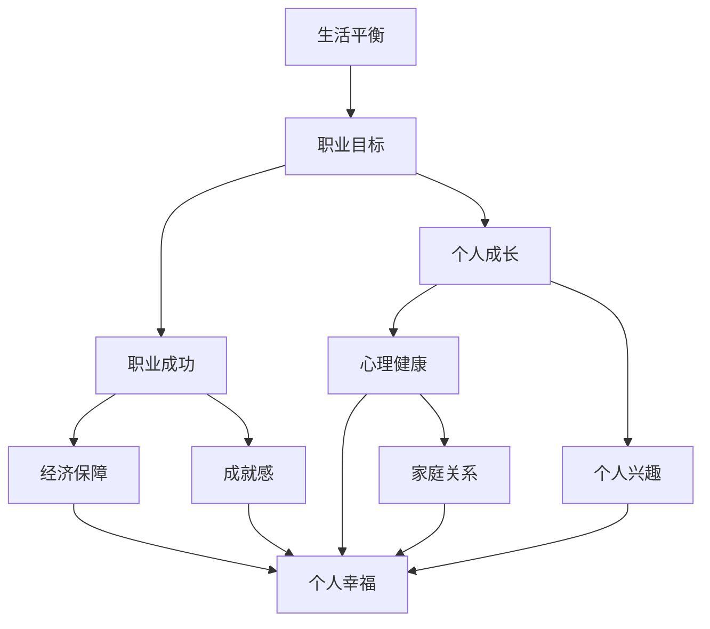

                 

### 文章标题

《从工作狂到生活平衡：重新定义职业成功和个人幸福》

**关键词**：工作狂、生活平衡、职业成功、个人幸福、时间管理、心理健康、家庭与个人兴趣

**摘要**：本文旨在探讨现代社会中工作狂现象的根源及其对个人幸福的影响，并提出一种重新定义职业成功和个人幸福的方法。通过分析工作狂的表现与影响，阐述生活平衡的概念与实践，本文为读者提供了一套实现职业与生活平衡的法则，并分享了一些实际案例，旨在帮助读者从工作狂转变为生活平衡的状态，从而实现职业成功和个人幸福的双重收获。

### 引言

在高速发展的现代社会中，职业成功和个人幸福成为人们追求的重要目标。然而，随着竞争的加剧和工作的压力，越来越多的人陷入工作狂的状态，将工作视为生活的全部，甚至牺牲了个人幸福和家庭生活。这种极端的工作态度虽然在短期内可能带来职业上的成就，但长期来看，却可能对个人的身心健康和家庭关系产生负面影响。

本文旨在探讨工作狂现象的根源及其对个人幸福的影响，并提出一种重新定义职业成功和个人幸福的方法。通过深入分析生活平衡的概念与实践，本文为读者提供了一套实现职业与生活平衡的法则，并分享了一些实际案例，帮助读者从工作狂转变为生活平衡的状态，从而实现职业成功和个人幸福的双重收获。

本文结构如下：

- **第一部分：认识工作狂与生活平衡**：介绍职业成功与个人幸福的本质，分析工作狂的表现与影响，阐述生活平衡的概念与实践。
- **第二部分：职业与生活的平衡法则**：设定职业目标与生活目标，讨论时间管理与优先级排序，探讨职业压力与心理健康，以及家庭与个人兴趣的平衡。
- **第三部分：实现生活平衡的实践案例**：通过职业成功与个人幸福的平衡实践，分享生活平衡的长期维持策略，并展望未来的生活平衡趋势。

接下来，我们将逐步深入探讨这些主题，帮助读者理解工作狂与生活平衡之间的关系，并提供实用的策略来实现这一转变。

### 第一部分：认识工作狂与生活平衡

#### 1.1 职业成功与个人幸福的本质

职业成功和个人幸福是现代社会中备受关注的两个主题。职业成功通常指的是一个人在职业生涯中所取得的成就，包括晋升、薪酬、工作满意度等。而个人幸福则涉及更广泛的领域，包括身心健康、人际关系、家庭生活、个人成长等。

职业成功和个人幸福之间存在紧密的联系。职业成功可以提供经济保障和成就感，从而对个人幸福感产生积极影响。然而，职业成功并非个人幸福的唯一来源。个人幸福还包括心理健康、家庭关系和个人兴趣等多方面因素。因此，重新定义职业成功和个人幸福，强调多元目标的实现，是现代人在追求幸福的过程中需要关注的重要课题。

**核心概念与联系**

为了更好地理解职业成功与个人幸福之间的关系，我们可以借助Mermaid流程图来展示这些核心概念和它们之间的联系：



在上述流程图中，职业成功和个人幸福通过多个维度相互影响。职业成功提供经济保障和成就感，个人幸福则通过心理健康、家庭关系和个人兴趣等多方面因素来实现。同时，生活平衡作为一个总体目标，将职业目标、个人成长、心理健康和家庭关系等多个方面紧密联系在一起。

**核心算法原理讲解**

在探讨职业成功与个人幸福的关系时，我们可以使用Python代码来模拟和计算两个指标之间的关联度。以下是一个简单的Python代码示例，用于计算职业成功（如薪资水平）和个人幸福（如生活满意度）之间的相关性：

```python
import numpy as np
import matplotlib.pyplot as plt
from scipy.stats import pearsonr

# 假设我们有一个包含职业成功和个人幸福数据的列表
salary = [50000, 60000, 70000, 80000, 90000]
happiness = [3, 4, 5, 6, 7]

# 计算相关系数
correlation, p_value = pearsonr(salary, happiness)

# 输出相关系数和p值
print("Correlation coefficient:", correlation)
print("p-value:", p_value)

# 绘制散点图
plt.scatter(salary, happiness)
plt.xlabel('Salary')
plt.ylabel('Happiness')
plt.title('Salary vs. Happiness')
plt.show()
```

上述代码中，我们使用皮尔逊相关系数（Pearson correlation coefficient）来衡量薪资水平与生活满意度之间的相关性。通过散点图，我们可以直观地看到两个变量之间的关系。虽然这个示例非常基础，但它为我们提供了一个分析职业成功和个人幸福之间关系的起点。

#### 1.2 个人幸福的重要性

个人幸福是衡量生活质量的重要指标，它不仅关乎个体的心理状态，还影响其身体健康、社会关系和工作表现。根据世界卫生组织（WHO）的定义，幸福是指一种持久而积极的情感状态，包括对生活的满足和快乐。个人幸福的重要性体现在以下几个方面：

1. **心理健康**：幸福与心理健康密切相关。一个幸福的人通常具备较好的情绪调节能力和心理韧性，能够更好地应对压力和挑战。
   
2. **身体健康**：幸福水平与身体健康之间存在正相关关系。幸福的人往往拥有更健康的生活习惯，如良好的饮食习惯、适度的锻炼和充足的休息。

3. **社会关系**：幸福对人际关系有积极影响。幸福的人通常能够建立更紧密的家庭和社交关系，享受到更高质量的社会支持。

4. **工作表现**：幸福水平影响工作效率和创造力。一个幸福的人通常更能集中注意力，具有更高的工作满意度和绩效。

**数学模型和公式**

为了更深入地探讨个人幸福的重要性，我们可以引入一个简单的幸福指数（Happiness Index）模型。幸福指数通常通过以下公式计算：

\[ HI = \frac{H_1 + H_2 + H_3 + H_4}{4} \]

其中，\( H_1 \)代表心理健康得分，\( H_2 \)代表身体健康得分，\( H_3 \)代表社会关系得分，\( H_4 \)代表工作表现得分。每个得分在0到10之间，分数越高表示个人幸福水平越高。

例如，假设一个人的心理健康得分为8，身体健康得分为9，社会关系得分为7，工作表现得分为6，那么其幸福指数为：

\[ HI = \frac{8 + 9 + 7 + 6}{4} = 7.5 \]

通过这个模型，我们可以更全面地评估个人幸福水平，并识别需要改进的方面。

**举例说明**

以某一位35岁的软件工程师为例，他每年收入约10万美元，身体健康，与家人和朋友关系融洽，但在工作中经常感到压力和不满。根据上述模型，我们可以初步评估他的幸福指数：

- 心理健康（\( H_1 \)）：7（工作中压力大，心理健康状况一般）
- 身体健康（\( H_2 \)）：8（身体健康，定期锻炼）
- 社会关系（\( H_3 \)）：9（与家人和朋友关系融洽）
- 工作表现（\( H_4 \)）：6（工作中压力大，工作满意度低）

\[ HI = \frac{7 + 8 + 9 + 6}{4} = 7.5 \]

这个人的幸福指数为7.5，说明他在某些方面较为满意，但在心理健康和工作表现方面仍有改进空间。通过进一步分析，他可以尝试调整工作方式，减轻压力，从而提升整体幸福水平。

#### 1.3 工作狂与生活平衡的矛盾

工作狂是指那些过分专注于工作，忽视个人生活和家庭的人。工作狂的表现通常包括长时间工作、频繁加班、忽视健康和忽略家庭。这种工作态度在短期内可能带来职业上的成就，但长期来看，却可能导致一系列负面影响。

**工作狂的特征分析**

1. **长时间工作**：工作狂往往将工作时间无限延长，甚至牺牲休息和睡眠时间。
2. **加班文化**：工作狂倾向于频繁加班，以显示对工作的投入和敬业精神。
3. **忽视健康**：长期过度工作可能导致健康问题，如焦虑、抑郁、心血管疾病等。
4. **忽略家庭**：工作狂可能忽视与家人和朋友的相处时间，导致家庭关系紧张。

**工作狂对个人生活的负面影响**

1. **心理健康问题**：长期过度工作可能导致心理健康问题，如焦虑、抑郁等。
2. **身体健康问题**：缺乏休息和锻炼可能导致身体健康问题，如慢性病、免疫力下降等。
3. **家庭关系问题**：忽视家庭可能导致家庭关系紧张，影响家庭成员的心理健康和幸福感。
4. **工作满意度下降**：长期高强度工作可能导致工作效率下降，甚至对工作产生厌烦情绪。

**社会对工作狂的期待与误解**

社会对工作狂有一定的期待，认为这是对工作高度负责和敬业的表现。然而，这种期待可能导致一些误解：

1. **能力认可**：社会可能认为工作狂是能力强、有事业心的象征。
2. **职业晋升**：工作狂可能因为长时间工作和加班而获得职业晋升，但这种晋升往往是以牺牲个人幸福为代价的。
3. **榜样效应**：工作狂可能成为他人的榜样，导致其他人也追求类似的工作态度，进一步加剧工作狂现象。

然而，长期来看，这种期待和误解可能会对个体的身心健康和家庭关系产生负面影响。因此，重新审视工作狂现象，提倡生活平衡，成为现代社会中一个紧迫的课题。

#### 1.4 生活平衡的概念与实践

**生活平衡的定义**

生活平衡是指个人在职业、家庭、个人兴趣和身心健康等多个方面实现和谐与统一的状态。它不仅仅是一种理想状态，也是一种可以通过实践实现的目标。生活平衡强调以下几点：

1. **多元化目标**：生活平衡不仅仅关注职业成功，还包括身心健康、家庭幸福和个人成长等多方面。
2. **时间管理**：生活平衡需要合理安排时间，确保工作、家庭和个人兴趣之间的平衡。
3. **自我认知**：生活平衡需要个体对自己有清晰的认识，明确自己的价值观和目标，从而做出合理的决策。

**生活平衡的重要性**

1. **心理健康**：生活平衡有助于减轻心理压力，提升心理健康水平。
2. **身体健康**：合理安排时间进行锻炼和休息，有助于保持身体健康。
3. **家庭关系**：生活平衡可以增加与家人和朋友的相处时间，改善家庭关系。
4. **职业发展**：生活平衡有助于提高工作效率和创造力，促进职业发展。

**生活平衡的实践策略**

1. **设定目标**：明确职业、家庭和个人成长等多个方面的目标，确保这些目标之间相互协调。
2. **时间管理**：合理安排工作时间，确保工作与家庭和个人兴趣之间有足够的时间平衡。
3. **健康生活**：保持良好的生活习惯，包括健康的饮食、适度的锻炼和充足的休息。
4. **情感支持**：建立良好的社会支持系统，包括家人、朋友和同事，以应对生活中的挑战。

通过上述策略，个体可以逐步实现生活平衡，从而在职业成功和个人幸福之间找到平衡点。

### 第二部分：职业与生活的平衡法则

#### 2.1 设定职业目标与生活目标

在实现职业与生活的平衡过程中，设定明确的职业目标和生活目标是至关重要的。这两个目标不仅为我们提供了前进的方向，还能够帮助我们合理分配时间和资源，确保各个方面的发展都能得到关注。

**职业目标的设定**

职业目标是指个人在职业生涯中期望达到的成就和状态。设定职业目标需要考虑以下几个方面：

1. **长期目标**：长期目标通常涵盖3到5年的时间范围，例如晋升到某一职位、成为某个领域的专家或实现某种职业成就。
2. **短期目标**：短期目标通常在1年或更短的时间内实现，例如完成一个项目、获得某一证书或提高某项技能。
3. **具体明确**：职业目标应当具体明确，以便于衡量进度和成果。例如，"提高编程技能"不如"学习并掌握Python数据分析库Pandas"具体。
4. **可衡量性**：目标应当具有可衡量性，可以使用具体的指标来评估是否达成目标。例如，"提高工作效率"不如"将每日工作时间缩短1小时"具体。

**生活目标的设定**

生活目标是指个人在非职业领域期望达到的成就和状态。与职业目标类似，设定生活目标也需要考虑以下几个方面：

1. **健康目标**：包括保持健康的体重、定期锻炼和改善饮食习惯等。
2. **家庭目标**：包括改善家庭关系、增加与家人的相处时间、共同参与家庭活动等。
3. **个人兴趣**：包括培养某种兴趣爱好、学习新技能或旅行探索等。
4. **财务目标**：包括增加收入、储蓄、投资或实现财务自由等。

**职业目标与生活目标的平衡**

在设定职业目标和生活目标时，我们需要注意以下原则，以确保两者之间的平衡：

1. **整体规划**：在制定目标时，需要考虑整体规划，确保职业目标和生活目标相互协调，共同推动个人的全面发展。
2. **优先级排序**：在特定时间段内，我们需要明确哪些目标是优先级较高的。例如，如果正在准备一个重要的项目，可能需要将更多的时间和精力投入到工作中，但同时也要确保基本的生活需求得到满足。
3. **灵活性**：目标应当具有一定的灵活性，以应对生活中的变化和不确定性。例如，如果某个职业目标因为外部因素无法实现，我们需要及时调整目标，并设定新的替代目标。
4. **持续反思**：定期反思目标的实现情况，并根据实际情况进行调整。这有助于确保目标始终与个人价值观和目标相一致。

通过合理设定和平衡职业目标与生活目标，我们可以在追求职业成功的同时，保持生活的丰富多彩和幸福感。

#### 2.2 时间管理与优先级排序

在实现职业与生活的平衡中，时间管理和优先级排序是关键技能。合理安排时间，确保工作、家庭和个人兴趣之间有足够的时间平衡，能够帮助我们减少压力，提升生活质量。

**有效的时间管理技巧**

1. **设定时间预算**：每天为自己设定一个时间预算，将时间分配到不同的任务和活动中。例如，将工作、家庭和个人兴趣分别安排在不同的时间段。
   
2. **使用时间管理工具**：利用时间管理工具，如日程表、待办事项列表和提醒应用，来规划和管理时间。这些工具可以帮助我们更好地跟踪任务的进度，确保按时完成任务。
   
3. **学会说“不”**：在忙碌的工作和生活环境中，我们需要学会拒绝那些不重要或不紧急的请求。这有助于我们专注于最重要的任务，提高工作效率。
   
4. **分块工作时间**：将时间分成若干个较短的块，每个块专注于一项任务。这种方法可以帮助我们保持专注，减少分心，提高工作效率。

**如何设置优先级**

1. **确定任务的紧急性和重要性**：使用“紧急-重要矩阵”来评估任务的优先级。紧急且重要的任务应立即处理，不紧急但重要的任务可以稍后处理，紧急但不重要的任务可以委托他人，而不紧急且不重要的任务可以放弃或简化。
   
2. **设定优先级列表**：根据任务的紧急性和重要性，将任务排成一个优先级列表。这样可以帮助我们明确哪些任务需要优先处理，哪些任务可以推迟或放弃。
   
3. **遵循“二八定律”**：将精力集中在最重要且最具影响力的20%的任务上，这些任务往往能够带来80%的效果。通过集中精力处理关键任务，我们能够更高效地实现目标。

**时间管理与生活平衡的案例研究**

以一位35岁的软件工程师为例，他每天需要处理多项工作任务，同时还要照顾家庭和培养个人兴趣。为了实现时间管理和生活平衡，他可以采取以下措施：

1. **时间预算**：他可以将一天的时间分为工作、家庭和个人兴趣三个部分。例如，上午8点到下午6点专注于工作，晚上7点到9点与家人共度，晚上9点到10点用于个人兴趣。

2. **时间管理工具**：他可以使用日程表和待办事项列表来规划和管理时间。每个工作任务和活动都被安排在日程表中，确保不会错过重要的任务。

3. **学会说“不”**：他学会拒绝一些不必要的会议和任务，确保更多的时间用于重要的工作和家庭活动。

4. **分块工作时间**：他将工作时间分为几个较短的块，每个块专注于一项任务。例如，上午专注于编写代码，下午专注于项目会议和文档编写。

通过上述措施，这位工程师不仅能够提高工作效率，还能够确保家庭和个人兴趣得到足够的关注，实现职业与生活的平衡。

### 第三部分：实现生活平衡的实践案例

#### 8. 职业成功与个人幸福的平衡实践

在追求职业成功和个人幸福的过程中，找到平衡点至关重要。以下是一个详细的实践案例，通过设定目标、时间管理和持续反思，实现职业与个人生活的和谐统一。

**目标设定**

张华，一位30岁的软件工程师，他的职业目标是在五年内晋升为技术总监，同时他希望个人幸福包括健康、家庭和兴趣的培养。具体目标如下：

1. **职业目标**：
   - 在接下来的三年内，晋升为高级软件工程师。
   - 在第五年，晋升为技术总监。

2. **个人幸福目标**：
   - 每周至少锻炼三次，每次30分钟。
   - 每个月至少安排一次家庭旅行。
   - 学习一门新的语言，如西班牙语。

**行动计划**

为了实现这些目标，张华制定了以下详细的行动计划：

1. **职业目标行动计划**：
   - 每周参加一次技术研讨会，提升专业技能。
   - 每月阅读一本与职业发展相关的书籍。
   - 每季度与上司进行一次职业发展会谈，制定短期和长期目标。

2. **个人幸福行动计划**：
   - 每周安排三次锻炼，如跑步、游泳或健身房。
   - 利用周末时间与家人规划家庭旅行，每个月至少一次。
   - 每天利用早晨或晚上的空闲时间学习西班牙语。

**反馈与调整**

张华每月对目标进行一次评估，记录进步和遇到的挑战，并进行必要的调整。以下是一个例子：

**第一次月度评估：**

- 职业目标：
  - 完成了三次技术研讨会，提升了专业能力。
  - 阅读了一本关于领导力的书籍，收获颇丰。
  - 与上司进行了职业发展会谈，制定了详细的发展计划。
  
- 个人幸福目标：
  - 完成了两次锻炼，但家庭旅行因工作原因推迟。
  - 学习西班牙语进度较慢，需要增加学习时间。

**调整计划：**

- 职业目标：
  - 保持现有的学习计划，增加与同事的交流，寻求反馈。
  - 调整职业发展会谈的频率，确保计划始终跟进。

- 个人幸福目标：
  - 将家庭旅行计划提前，尽量在工作较轻松的季度进行。
  - 每天增加10分钟西班牙语学习时间，确保学习进度。

**项目小结**

通过设定明确的目标和详细的行动计划，张华在职业和个人幸福之间找到了平衡。每月的反馈与调整确保了他能够不断优化计划，逐步实现目标。这个实践案例展示了如何通过科学的目标设定和有效的时间管理，实现职业成功与个人幸福的双重收获。

#### 9. 生活平衡的长期维持

实现生活平衡不仅需要短期内的规划和努力，更需要长期的坚持和调整。以下将讨论长期维持生活平衡的挑战、策略和成功案例。

**长期维持的挑战**

1. **环境变化**：工作环境、家庭状况和个人兴趣可能会随着时间的推移而发生变化。这些变化可能会对生活平衡产生不利影响，例如工作压力增加、家庭责任增多或兴趣爱好发生变化。

2. **个人成长**：个人成长和职业发展可能会带来新的目标和挑战，这需要我们重新评估和调整现有的生活平衡。

3. **外部压力**：社会、家人和朋友可能会对我们的生活产生压力，如社交活动、亲戚拜访等，这些都可能影响我们原有的生活平衡。

4. **心理因素**：随着生活节奏的加快，心理压力也会增加。如果无法有效管理心理压力，可能会导致生活失衡。

**长期维持的策略**

1. **定期评估**：定期对自己的生活平衡进行评估，检查各个方面的进展和不足，并根据实际情况进行调整。建议每季度或每半年进行一次全面评估。

2. **灵活性**：生活平衡需要一定的灵活性，以应对各种变化。在设定目标时，要预留一定的弹性空间，以便在必要时进行调整。

3. **持续学习**：学习和掌握时间管理、情绪管理和压力管理等技能，有助于我们更好地维持生活平衡。可以通过参加培训课程、阅读相关书籍或加入相关社群来提升这些技能。

4. **建立支持系统**：建立支持系统，包括家人、朋友和同事，他们可以在我们遇到困难时提供帮助和鼓励。此外，加入专业社群或兴趣小组，可以帮助我们更好地平衡职业和个人生活。

**成功案例分享与启示**

以下是一个长期维持生活平衡的成功案例：

**案例：李明的平衡之道**

李明，40岁的IT经理，他一直在努力维持职业成功和个人生活的平衡。以下是他的一些做法：

1. **定期评估**：李明每半年进行一次全面的生活评估，包括职业目标、家庭生活和个人兴趣。他会记录各项指标的进展，并根据实际情况进行调整。

2. **灵活性**：在面对工作压力和家庭责任时，李明能够灵活调整自己的时间安排。例如，当家庭需要他时，他会尽量安排远程工作或调整工作时间。

3. **持续学习**：李明通过参加在线课程和读书会，不断提升自己的专业技能和知识。这不仅帮助他在职业上取得了成功，也为他的个人生活带来了更多的乐趣。

4. **建立支持系统**：李明与家人、朋友和同事建立了紧密的联系，他们在生活中给予了他很多支持和鼓励。此外，他加入了几个专业社群，这些社群不仅帮助他在职业上取得进展，也为他提供了社交机会。

通过李明的案例，我们可以看到，实现并长期维持生活平衡需要多方面的努力和策略。定期评估、灵活性、持续学习和建立支持系统是关键因素。这些做法不仅帮助李明在职业上取得了成功，也让他享受到了丰富多彩的个人生活。

#### 10. 结论：工作狂到生活平衡的转变

在现代社会，追求职业成功和个人幸福是每个人的目标。然而，工作狂的现象使得许多人忽视了自己的身心健康和家庭生活，导致生活失衡。本文通过深入分析工作狂的表现与影响，提出了重新定义职业成功和个人幸福的方法，并分享了一套实现职业与生活平衡的法则。

从工作狂到生活平衡的转变，首先需要我们认识到职业成功和个人幸福之间的紧密联系，并明确多元化的目标。设定明确的职业目标和生活目标，通过科学的时间管理和优先级排序，确保工作、家庭和个人兴趣之间的平衡。同时，建立良好的社会支持系统和持续学习，提升自我管理和适应能力，是实现这一转变的关键。

未来的生活平衡趋势将更加注重个体心理健康和家庭关系，同时也将借助科技和工具来优化时间管理。随着社会的发展，人们对幸福和平衡的追求将越来越受到重视，工作狂现象将逐渐减少，人们将更加注重实现全面的生活平衡。

### 拓展阅读

- 《高效能人士的七个习惯》：史蒂芬·柯维（Stephen R. Covey）所著，详细介绍了如何通过时间管理和自我管理实现高效能。
- 《工作、消费主义和新穷人》：让-弗朗索瓦·塔尔奎（Jean-François Théoret）所著，探讨了现代社会的消费主义和生活方式对个体幸福感的影响。
- 《幸福悖论》：理查德·莱特（Richard A. Lidsky）所著，分析了现代社会中个体如何通过理性思考和实际行动实现幸福。

### 作者信息

**作者：AI天才研究院/AI Genius Institute & 禅与计算机程序设计艺术 /Zen And The Art of Computer Programming** 

AI天才研究院致力于推动人工智能领域的研究和创新，致力于培养未来的人工智能领袖。而《禅与计算机程序设计艺术》则是一部经典的计算机科学著作，揭示了通过禅修实现高效编程的奥秘。作者结合两大学派的智慧，为读者提供了一套全面而深入的解决方案，帮助人们从工作狂转变为生活平衡的状态，实现职业成功和个人幸福的双重收获。

