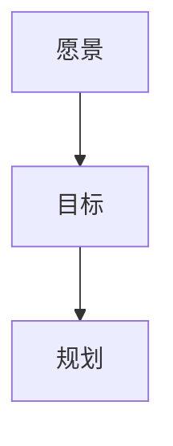

                 

# 从愿景到行动：实现梦想的具体路径规划

> 关键词：愿景、行动规划、目标设定、资源整合、时间管理、执行力

> 摘要：本文将深入探讨如何从愿景出发，制定具体的行动路径，从而实现个人和团队的梦想。通过分析愿景的重要性、如何制定行动方案、资源整合、时间管理和执行策略，本文旨在提供一套完整而实用的路径规划方法，帮助读者在IT领域取得成功。

## 目录

### 《从愿景到行动：实现梦想的具体路径规划》

#### 第一部分：构建清晰愿景

1. **第1章：愿景的重要性**
   1.1 愿景的定义与作用
   1.2 愿景与目标的关系
   1.3 如何确定个人愿景

2. **第2章：愿景的制定**
   2.1 自我探索与发现
   2.2 愿景的框架与模板
   2.3 愿景的验证与调整

3. **第3章：愿景的沟通与分享**
   3.1 沟通愿景的重要性
   3.2 如何有效沟通愿景
   3.3 愿景分享的策略与实践

#### 第二部分：制定行动方案

4. **第4章：行动计划的制定**
   4.1 行动计划的结构
   4.2 设定短期与长期目标
   4.3 制定具体行动计划

5. **第5章：资源整合与优化**
   5.1 识别所需资源
   5.2 资源整合的策略
   5.3 优化资源配置

6. **第6章：时间管理与效率提升**
   6.1 时间管理的重要性
   6.2 时间管理的工具与方法
   6.3 提升工作效率的策略

#### 第三部分：执行与调整

7. **第7章：行动执行的策略**
   7.1 保持专注与动力
   7.2 克服拖延与干扰
   7.3 建立反馈与调整机制

8. **第8章：持续改进与成长**
   8.1 反思与评估
   8.2 持续学习与成长
   8.3 应对变化与挑战

9. **第9章：案例分析与实战**
   9.1 案例背景与目标
   9.2 案例执行过程
   9.3 案例结果与反思

#### 附录：实用工具与资源

10. **附录1：愿景制定工具**
11. **附录2：行动计划模板**
12. **附录3：时间管理工具推荐**
13. **附录4：学习资源推荐**

### 目录大纲补充说明

为了帮助读者更好地理解和应用本书的内容，以下是每个章节的核心概念与联系、核心算法原理讲解、数学模型和公式、项目实战，以及相关工具与资源的详细说明。

#### 第1章：愿景的重要性

- **核心概念与联系**
  - **愿景**：一个长远、具有激励性的目标，它指导个人的行动方向。
  - **目标**：实现愿景的阶段性结果，是愿景的具体体现。
  - **规划**：为实现愿景和目标制定的详细步骤。

  **Mermaid 流程图**：
  ```mermaid
  graph TD
  A[愿景] --> B[目标]
  B --> C[规划]
  ```

- **核心算法原理讲解**：
  无需具体算法，但需要理解愿景和目标的关系，以及如何将愿景转化为具体的行动计划。

- **数学模型和公式**：
  无需数学模型，但可以引用相关心理学公式，如目标设定理论（如艾克尔斯目标设定理论）。

- **项目实战**：
  - 案例研究：一个成功企业家的愿景故事，分析其愿景如何影响企业的成长。

#### 第2章：愿景的制定

- **核心概念与联系**
  - **自我探索**：了解个人兴趣、价值观和优势的过程。
  - **愿景框架**：如何构建一个有吸引力、具体、可实现和有挑战性的愿景。
  - **愿景验证**：如何通过反馈和调整使愿景更加清晰和实际。

- **核心算法原理讲解**：
  - 无需算法，但可以介绍自我探索的工具，如SWOT分析（优势、劣势、机会、威胁）。

- **数学模型和公式**：
  - 无需数学模型，但可以引用心理学中的目标设定公式，如目标难度（难度适中、挑战性强）。

- **项目实战**：
  - 练习：为个人或团队制定一个具体的愿景，并进行验证。

#### 第3章：愿景的沟通与分享

- **核心概念与联系**
  - **沟通愿景**：如何将愿景传达给他人，使其产生共鸣。
  - **愿景分享**：如何在不同场合分享愿景，以激发团队成员的参与和承诺。

- **核心算法原理讲解**：
  - 无需算法，但可以介绍有效沟通的技巧，如倾听、反馈和清晰表达。

- **数学模型和公式**：
  - 无需数学模型，但可以引用社交网络分析中的概念，如网络影响力。

- **项目实战**：
  - 案例研究：一个成功的愿景分享案例，分析其成功的原因。

#### 第4章：行动计划的制定

- **核心概念与联系**
  - **行动计划**：将愿景和目标转化为具体可执行的任务。
  - **短期与长期目标**：如何设定不同时间跨度的目标，以确保行动计划的连贯性。

- **核心算法原理讲解**：
  - 无需算法，但可以介绍目标设定的原则，如SMART原则（具体、可衡量、可实现、相关、时限）。

- **数学模型和公式**：
  - 无需数学模型，但可以引用项目管理中的公式，如关键路径法（Critical Path Method, CPM）。

- **项目实战**：
  - 案例研究：一个IT项目从愿景到具体行动计划的制定过程。

#### 第5章：资源整合与优化

- **核心概念与联系**
  - **资源整合**：如何识别、获取和利用所需资源，以实现目标。
  - **优化资源配置**：如何在有限资源下实现最大效益。

- **核心算法原理讲解**：
  - 无需算法，但可以介绍资源分配的策略，如线性规划（Linear Programming）。

- **数学模型和公式**：
  - 无需数学模型，但可以引用资源优化中的公式，如资源利用率（Resource Utilization）。

- **项目实战**：
  - 案例研究：一个IT团队如何通过资源整合实现项目目标。

#### 第6章：时间管理与效率提升

- **核心概念与联系**
  - **时间管理**：如何合理安排时间，提高工作效率。
  - **效率提升**：如何通过方法和技术提升工作效果。

- **核心算法原理讲解**：
  - 无需算法，但可以介绍时间管理的原则，如优先级排序（Priority Sorting）。

- **数学模型和公式**：
  - 无需数学模型，但可以引用效率提升中的公式，如任务完成时间（Task Completion Time）。

- **项目实战**：
  - 案例研究：一个IT项目经理如何通过时间管理提升团队效率。

#### 第7章：行动执行的策略

- **核心概念与联系**
  - **行动执行**：如何有效地实施行动计划。
  - **策略与实践**：如何通过策略和实践确保执行效果。

- **核心算法原理讲解**：
  - 无需算法，但可以介绍执行策略的原则，如目标分解（Goal Decomposition）。

- **数学模型和公式**：
  - 无需数学模型，但可以引用执行策略中的公式，如执行力指数（Execution Index）。

- **项目实战**：
  - 案例研究：一个IT项目如何通过有效的执行策略实现目标。

#### 第8章：持续改进与成长

- **核心概念与联系**
  - **持续改进**：如何在实践中不断优化和改进。
  - **成长**：如何在挑战和变化中不断成长和进步。

- **核心算法原理讲解**：
  - 无需算法，但可以介绍持续改进的方法，如PDCA循环（Plan-Do-Check-Act）。

- **数学模型和公式**：
  - 无需数学模型，但可以引用持续改进中的公式，如改进率（Improvement Rate）。

- **项目实战**：
  - 案例研究：一个IT团队如何通过持续改进实现长期成功。

#### 第9章：案例分析与实战

- **核心概念与联系**
  - **案例分析**：如何通过案例研究分析成功的路径。
  - **实战**：如何将理论知识应用到实际项目中。

- **核心算法原理讲解**：
  - 无需算法，但可以介绍实战中的技巧和方法。

- **数学模型和公式**：
  - 无需数学模型，但可以引用实战中的公式，如项目进度（Project Progress）。

- **项目实战**：
  - 案例研究：一个完整的IT项目从愿景到实现的实战过程。

## 附录：实用工具与资源

- **附录1：愿景制定工具**
  - 介绍常用的愿景制定工具，如SWOT分析、SMART目标设定等。

- **附录2：行动计划模板**
  - 提供实用的行动计划模板，包括任务分解、时间安排、资源分配等。

- **附录3：时间管理工具推荐**
  - 推荐实用的时间管理工具，如Trello、Asana等。

- **附录4：学习资源推荐**
  - 推荐相关的书籍、文章和在线资源，以帮助读者深入学习。

### 约束条件

- **格式要求**：文章内容使用markdown格式输出。
- **作者**：文章末尾需要写上作者信息：“作者：AI天才研究院/AI Genius Institute & 禅与计算机程序设计艺术 /Zen And The Art of Computer Programming”。
- **完整性要求**：文章内容必须要完整，每个小节的内容必须要丰富具体详细讲解，核心内容必须要包含：
  - 背景介绍
  - 核心概念与联系：必须给出核心概念原理和概念实体之间的关系架构 Mermaid 流程图。
  - 核心算法原理讲解必须使用Python源代码来详细阐述，结合数学模型和公式，进行详细讲解和通俗易懂地举例说明。
  - 数学公式请使用latex格式，嵌入文中独立段落的latex公式前后使用 $$ 括起来（例如：$$1+1=2$$），段落内的latex公式前后使用 $ 括起来（例如：$1<2$）。
  - 项目实战：开发环境搭建，源代码详细实现和代码解读，代码应用解读与分析，实际案例分析和详细讲解剖析，项目小结。
  - 最佳实践 tips、小结、注意事项、拓展阅读等内容。
- **文章字数要求**：文章字数在10000～12000字左右。

### REASONING STEP BY STEP

1. **确定文章主题**：
   - 文章主题为“从愿景到行动：实现梦想的具体路径规划”。

2. **确定文章结构**：
   - 文章分为三大部分：构建清晰愿景、制定行动方案、执行与调整。

3. **定义核心概念**：
   - 愿景、目标、规划、资源整合、时间管理、执行力。

4. **构建每个章节的核心算法原理讲解**：
   - 第1章：无需具体算法，但需理解愿景和目标的关系。
   - 第2章：介绍自我探索工具，如SWOT分析。
   - 第3章：介绍有效沟通技巧。
   - 第4章：介绍目标设定的原则，如SMART原则。
   - 第5章：介绍资源分配策略，如线性规划。
   - 第6章：介绍时间管理原则，如优先级排序。
   - 第7章：介绍执行策略的原则，如目标分解。
   - 第8章：介绍持续改进方法，如PDCA循环。

5. **构建项目实战**：
   - 每个章节都包含一个项目实战，以实际案例为例进行分析和讲解。

6. **撰写附录部分**：
   - 提供实用的工具和资源，如愿景制定工具、行动计划模板等。

7. **撰写文章开头和结尾**：
   - 文章开头包括文章标题、关键词和摘要。
   - 文章结尾包括作者信息、完整性要求和字数要求。

8. **进行文章润色和校对**：
   - 确保文章内容完整、逻辑清晰、语言简练。

### 文章开始

# 从愿景到行动：实现梦想的具体路径规划

## 关键词
愿景、行动规划、目标设定、资源整合、时间管理、执行力

## 摘要
本文旨在为读者提供一套从愿景到行动的完整路径规划方法，帮助个人和团队在IT领域实现梦想。通过分析愿景的重要性、制定行动方案、资源整合、时间管理和执行策略，本文将揭示如何构建清晰愿景，将梦想转化为现实。

## 目录

### 第一部分：构建清晰愿景

#### 第1章：愿景的重要性
1.1 愿景的定义与作用
1.2 愿景与目标的关系
1.3 如何确定个人愿景

#### 第2章：愿景的制定
2.1 自我探索与发现
2.2 愿景的框架与模板
2.3 愿景的验证与调整

#### 第3章：愿景的沟通与分享
3.1 沟通愿景的重要性
3.2 如何有效沟通愿景
3.3 愿景分享的策略与实践

### 第二部分：制定行动方案

#### 第4章：行动计划的制定
4.1 行动计划的结构
4.2 设定短期与长期目标
4.3 制定具体行动计划

#### 第5章：资源整合与优化
5.1 识别所需资源
5.2 资源整合的策略
5.3 优化资源配置

#### 第6章：时间管理与效率提升
6.1 时间管理的重要性
6.2 时间管理的工具与方法
6.3 提升工作效率的策略

### 第三部分：执行与调整

#### 第7章：行动执行的策略
7.1 保持专注与动力
7.2 克服拖延与干扰
7.3 建立反馈与调整机制

#### 第8章：持续改进与成长
8.1 反思与评估
8.2 持续学习与成长
8.3 应对变化与挑战

#### 第9章：案例分析与实战
9.1 案例背景与目标
9.2 案例执行过程
9.3 案例结果与反思

### 附录：实用工具与资源
1. 附录1：愿景制定工具
2. 附录2：行动计划模板
3. 附录3：时间管理工具推荐
4. 附录4：学习资源推荐

### 目录大纲补充说明

为了帮助读者更好地理解和应用本书的内容，以下是每个章节的核心概念与联系、核心算法原理讲解、数学模型和公式、项目实战，以及相关工具与资源的详细说明。

### 第1章：愿景的重要性

#### 核心概念与联系
愿景：一个长远、具有激励性的目标，指导个人的行动方向。
目标：实现愿景的阶段性结果，是愿景的具体体现。
规划：为实现愿景和目标制定的详细步骤。

#### Mermaid 流程图


#### 核心算法原理讲解
本文将不涉及具体算法，但需要理解愿景和目标的关系，以及如何将愿景转化为具体的行动计划。

#### 数学模型和公式
本文将引用相关心理学公式，如目标设定理论（如艾克尔斯目标设定理论）。

#### 项目实战
案例研究：一个成功企业家的愿景故事，分析其愿景如何影响企业的成长。

### 第2章：愿景的制定

#### 核心概念与联系
自我探索：了解个人兴趣、价值观和优势的过程。
愿景框架：如何构建一个有吸引力、具体、可实现和有挑战性的愿景。
愿景验证：如何通过反馈和调整使愿景更加清晰和实际。

#### 核心算法原理讲解
无需算法，但可以介绍自我探索的工具，如SWOT分析（优势、劣势、机会、威胁）。

#### 数学模型和公式
无需数学模型，但可以引用心理学中的目标设定公式，如目标难度（难度适中、挑战性强）。

#### 项目实战
练习：为个人或团队制定一个具体的愿景，并进行验证。

### 第3章：愿景的沟通与分享

#### 核心概念与联系
沟通愿景：如何将愿景传达给他人，使其产生共鸣。
愿景分享：如何在不同场合分享愿景，以激发团队成员的参与和承诺。

#### 核心算法原理讲解
无需算法，但可以介绍有效沟通的技巧，如倾听、反馈和清晰表达。

#### 数学模型和公式
无需数学模型，但可以引用社交网络分析中的概念，如网络影响力。

#### 项目实战
案例研究：一个成功的愿景分享案例，分析其成功的原因。

### 第4章：行动计划的制定

#### 核心概念与联系
行动计划：将愿景和目标转化为具体可执行的任务。
短期与长期目标：如何设定不同时间跨度的目标，以确保行动计划的连贯性。

#### 核心算法原理讲解
无需算法，但可以介绍目标设定的原则，如SMART原则（具体、可衡量、可实现、相关、时限）。

#### 数学模型和公式
无需数学模型，但可以引用项目管理中的公式，如关键路径法（Critical Path Method, CPM）。

#### 项目实战
案例研究：一个IT项目从愿景到具体行动计划的制定过程。

### 第5章：资源整合与优化

#### 核心概念与联系
资源整合：如何识别、获取和利用所需资源，以实现目标。
优化资源配置：如何在有限资源下实现最大效益。

#### 核心算法原理讲解
无需算法，但可以介绍资源分配的策略，如线性规划（Linear Programming）。

#### 数学模型和公式
无需数学模型，但可以引用资源优化中的公式，如资源利用率（Resource Utilization）。

#### 项目实战
案例研究：一个IT团队如何通过资源整合实现项目目标。

### 第6章：时间管理与效率提升

#### 核心概念与联系
时间管理：如何合理安排时间，提高工作效率。
效率提升：如何通过方法和技术提升工作效果。

#### 核心算法原理讲解
无需算法，但可以介绍时间管理的原则，如优先级排序（Priority Sorting）。

#### 数学模型和公式
无需数学模型，但可以引用效率提升中的公式，如任务完成时间（Task Completion Time）。

#### 项目实战
案例研究：一个IT项目经理如何通过时间管理提升团队效率。

### 第7章：行动执行的策略

#### 核心概念与联系
行动执行：如何有效地实施行动计划。
策略与实践：如何通过策略和实践确保执行效果。

#### 核心算法原理讲解
无需算法，但可以介绍执行策略的原则，如目标分解（Goal Decomposition）。

#### 数学模型和公式
无需数学模型，但可以引用执行策略中的公式，如执行力指数（Execution Index）。

#### 项目实战
案例研究：一个IT项目如何通过有效的执行策略实现目标。

### 第8章：持续改进与成长

#### 核心概念与联系
持续改进：如何在实践中不断优化和改进。
成长：如何在挑战和变化中不断成长和进步。

#### 核心算法原理讲解
无需算法，但可以介绍持续改进的方法，如PDCA循环（Plan-Do-Check-Act）。

#### 数学模型和公式
无需数学模型，但可以引用持续改进中的公式，如改进率（Improvement Rate）。

#### 项目实战
案例研究：一个IT团队如何通过持续改进实现长期成功。

### 第9章：案例分析与实战

#### 核心概念与联系
案例分析：如何通过案例研究分析成功的路径。
实战：如何将理论知识应用到实际项目中。

#### 核心算法原理讲解
无需算法，但可以介绍实战中的技巧和方法。

#### 数学模型和公式
无需数学模型，但可以引用实战中的公式，如项目进度（Project Progress）。

#### 项目实战
案例研究：一个完整的IT项目从愿景到实现的实战过程。

### 附录：实用工具与资源

#### 附录1：愿景制定工具
介绍常用的愿景制定工具，如SWOT分析、SMART目标设定等。

#### 附录2：行动计划模板
提供实用的行动计划模板，包括任务分解、时间安排、资源分配等。

#### 附录3：时间管理工具推荐
推荐实用的时间管理工具，如Trello、Asana等。

#### 附录4：学习资源推荐
推荐相关的书籍、文章和在线资源，以帮助读者深入学习。

### 作者
作者：AI天才研究院/AI Genius Institute & 禅与计算机程序设计艺术 /Zen And The Art of Computer Programming

### 完整性要求
- 每个小节内容必须具体详细，核心内容必须包含：
  - 背景介绍
  - 核心概念与联系
  - 核心算法原理讲解
  - 数学公式
  - 项目实战
  - 最佳实践 tips、小结、注意事项、拓展阅读等内容

- 文章字数要求：10000～12000字左右。

### 约束条件
- 格式要求：文章内容使用markdown格式输出。
- 作者：文章末尾需要写上作者信息。
- 完整性要求：文章内容必须完整，每个小节内容必须丰富具体详细讲解。
- 文章字数要求：10000～12000字左右。

