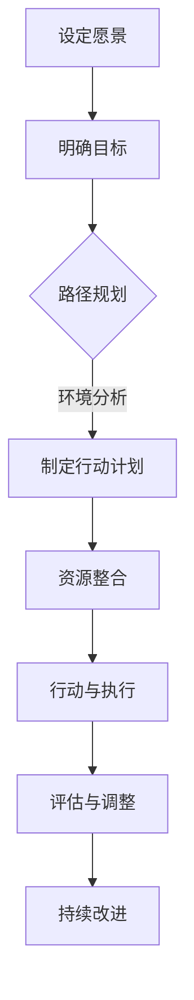

                 

文章标题：《从愿景到行动：实现梦想的路径规划》

关键词：愿景、目标设定、路径规划、行动执行、资源整合

摘要：本文将从个人成长、职业生涯规划、项目开发等多个维度，详细阐述如何通过科学的方法设定愿景和目标，规划实现梦想的路径，并提供具体的行动步骤和执行策略，助力读者实现个人和职业发展的目标。

---

# 目录大纲

## 第一部分：愿景与目标设定

### 第1章：愿景的重要性

#### 1.1 愿景的定义与内涵
#### 1.2 愿景对个人成长的影响
#### 1.3 如何设定具有吸引力的愿景

### 第2章：明确目标

#### 2.1 目标的重要性
#### 2.2 目标设定的SMART原则
#### 2.3 如何分解目标

## 第二部分：路径规划

### 第3章：环境分析

#### 3.1 外部环境分析
#### 3.2 内部能力分析
#### 3.3 SWOT分析

### 第4章：制定行动计划

#### 4.1 行动计划的要素
#### 4.2 甘特图的运用
#### 4.3 风险管理

### 第5章：资源整合

#### 5.1 时间管理
#### 5.2 精力管理
#### 5.3 财务规划

## 第三部分：行动与执行

### 第6章：建立习惯

#### 6.1 好习惯的力量
#### 6.2 坚持与自律
#### 6.3 如何培养好习惯

### 第7章：克服障碍

#### 7.1 挫折与失败
#### 7.2 心理调适
#### 7.3 应对策略

### 第8章：评估与调整

#### 8.1 目标达成评估
#### 8.2 路径调整
#### 8.3 持续改进

## 附录：工具与资源

### 附录1：愿景与目标设定工具

#### 1.1 思维导图
#### 1.2 SWOT分析表
#### 1.3 行动计划模板

### 附录2：行动与执行工具

#### 2.1 时间管理工具
#### 2.2 精力管理工具
#### 2.3 财务管理工具

## Mermaid流程图：愿景到行动路径规划

核心概念与联系：

愿景（Vision）: 对未来的向往和期待，具有指导性和长远性。

目标（Goal）: 具体化的愿景，是实现愿景的具体步骤和指标。

路径规划（Strategy）: 对实现目标的策略和方法进行规划和设计。

行动与执行（Action）: 将规划付诸实践，通过持续努力达成目标。

---

## 第1章 愿景的重要性

### 1.1 愿景的定义与内涵

愿景是一种对于未来的向往和期待，它不仅仅是一种理想状态，更是一种精神力量，能够激发人们不断追求和奋斗的动力。在个人和企业的成长过程中，愿景扮演着至关重要的角色。

首先，愿景是一种对未来的想象和期待。它能够让人们清晰地看到未来的目标，明确前进的方向。一个好的愿景应该具备以下几个特点：

- **明确性**：愿景应该清晰、具体，让人能够直观地理解和感受到。
- **激励性**：愿景应该能够激发人们的热情和动力，使其愿意为之奋斗。
- **可行性**：愿景需要在现实中具备实现的可能性。
- **长远性**：愿景应该具有长期性，能够指导个人或组织在相当长的时间内发展。

其次，愿景是一种精神力量。它能够激发人们的内在动力，使人们在面对困难和挑战时保持积极向上的态度，不断追求进步。同时，愿景还能够凝聚人们的力量，使团队成员在共同的目标下齐心协力，共同为实现愿景而努力。

最后，愿景是一种价值观的体现。它代表了个人或组织的核心价值观，是行动的指南针。一个具有良好愿景的个人或组织，会在日常工作和生活中始终遵循这一价值观，保持一致性，从而形成强大的内在驱动力。

### 1.2 愿景对个人成长的影响

愿景对个人成长具有深远的影响。首先，愿景为个人提供了方向和目标。在成长的道路上，没有方向和目标，人们往往会迷失自我，难以找到前进的动力。而明确的愿景，就像一盏明灯，照亮前行的道路，指引人们朝着正确的方向努力。

其次，愿景能够激发个人的潜能和创造力。当人们拥有一个远大的愿景时，他们会不自觉地发挥出更大的潜力，积极探索和创新。在这个过程中，个人的能力和技能会得到不断提升，从而实现个人的成长和进步。

此外，愿景还能够帮助个人建立自信和自我价值感。当人们为实现愿景而努力时，他们会感受到自己的价值和存在的意义。这种自我价值感的提升，会进一步激发个人的积极性和主动性，使其在工作和生活中更加自信和坚定。

### 1.3 如何设定具有吸引力的愿景

要设定一个具有吸引力的愿景，需要考虑以下几个方面：

首先，要深入了解自己的兴趣、优势和价值观。一个符合个人特点的愿景，更容易激发内心的热情和动力。可以通过反思自己的经历、兴趣和价值观，找到自己真正热爱的事物，从而设定一个具有吸引力的愿景。

其次，要确保愿景的目标性和可行性。一个明确、具体的愿景，能够让人清晰地看到未来的方向。同时，愿景也需要在现实中具备实现的可能性，避免过于理想化。

第三，要加入激励元素。一个具有激励性的愿景，能够激发人们的热情和动力，使其愿意为之奋斗。可以加入一些具有挑战性的目标，或者描述愿景实现后的美好景象，来激发内心的动力。

最后，要持续更新和调整愿景。随着时间和环境的变化，愿景也需要不断地调整和更新，以保持其活力和吸引力。可以定期回顾自己的愿景，根据实际情况进行必要的调整，以确保其始终与个人目标和发展方向保持一致。

---

## 第2章 明确目标

### 2.1 目标的重要性

目标是对愿景的具体化，它是实现愿景的具体步骤和指标。明确的目标具有以下几个重要性：

首先，目标为个人或组织提供了明确的行动指南。没有目标，就像没有航向的船只，难以找到前进的方向。明确的目标能够为行动提供指引，使个人或组织在实现愿景的道路上更加坚定和高效。

其次，目标能够激发动力和积极性。当人们知道自己的目标是什么，以及为什么而奋斗时，他们会更有动力去付出努力，克服困难，实现目标。目标的存在，能够激发人们的内在动力，使其在追求梦想的道路上坚持不懈。

第三，目标为评估工作成效提供了标准。通过设定明确的目标，个人或组织可以清晰地衡量自己的工作进展和成效。当目标达成时，可以给予奖励和肯定，增强信心和动力；当目标未达成时，可以反思原因，调整策略，不断改进。

最后，目标有助于合理配置资源。明确的目标可以帮助个人或组织合理分配时间和精力，确保资源得到有效利用。通过明确目标，可以优先处理重要和紧急的任务，提高工作效率和效果。

### 2.2 目标设定的SMART原则

SMART原则是一种常用的目标设定方法，它包括以下五个方面：

- **S** pecific（具体）：目标要具体明确，避免模糊和泛泛而谈。具体的目标能够让人清楚地知道要做什么，怎么做。
- **M** easurable（可衡量）：目标要有可衡量的标准，便于评估工作进展和成效。通过设定具体的衡量指标，可以清晰地了解目标的达成情况。
- **A** ttainable（可达成）：目标要具有可实现性，避免过于理想化。目标过高，可能会导致失去信心和动力；目标过低，则可能无法激发积极性。
- **R** ealistic（现实）：目标要符合现实情况，避免不切实际的设定。要考虑资源的可用性、时间的限制以及个人或组织的能力。
- **T** imely（时限）：目标要设定明确的时限，避免无限期地拖延。时限能够给目标带来紧迫感，促使个人或组织更加高效地行动。

### 2.3 如何分解目标

将目标分解成具体的行动计划，是实现目标的关键步骤。以下是一些分解目标的常用方法：

1. **目标分解法**：将大目标分解成一系列小目标，每个小目标都代表一个具体的行动步骤。通过逐步实现小目标，最终达成大目标。

2. **时间分解法**：将目标按照时间顺序分解，设定每个时间段要达成的具体任务。这样可以确保目标的有序推进，避免拖延。

3. **优先级分解法**：根据目标的优先级进行分解，先实现重要和紧急的目标，再逐步实现其他目标。这样可以确保资源的合理利用，提高工作效率。

4. **资源分解法**：根据所需资源进行目标分解，确保每个目标都有明确的资源需求。这样可以确保资源的有效配置，避免资源浪费。

通过以上方法，可以将目标分解成具体的行动计划，为目标的实现提供清晰的路径和指导。

---

## 第3章 环境分析

### 3.1 外部环境分析

外部环境分析是对影响个人或组织发展的外部因素进行评估和分析，以便更好地把握市场趋势、竞争态势和政策环境等。以下是外部环境分析的主要步骤和方法：

1. **市场分析**：了解目标市场的规模、增长趋势、消费者需求、竞争状况等。通过市场分析，可以确定目标市场的机会和挑战，为制定战略提供依据。

2. **行业分析**：研究所在行业的现状、发展趋势、竞争对手、技术变革等。行业分析有助于识别行业的机会和风险，为个人或组织在行业中的定位和发展提供指导。

3. **政策分析**：关注政策环境的变化，包括法律法规、税收政策、产业政策等。政策分析有助于了解政策对个人或组织的影响，为应对政策变化做好准备。

4. **技术分析**：研究相关技术的现状、发展趋势、技术创新等。技术分析可以帮助个人或组织把握技术变革带来的机遇和挑战，调整发展战略。

5. **社会分析**：了解社会文化、价值观、教育水平、人口结构等。社会分析有助于了解社会环境对个人或组织发展的影响，为制定更符合社会需求的发展战略提供参考。

### 3.2 内部能力分析

内部能力分析是对个人或组织内部资源、优势和不足进行评估和分析，以便更好地发挥优势、弥补不足。以下是内部能力分析的主要步骤和方法：

1. **资源分析**：评估个人或组织所拥有的资源，包括资金、人力、技术、设备、信息等。资源分析有助于了解资源现状和配置情况，为制定战略提供依据。

2. **优势分析**：识别个人或组织的优势，包括核心竞争力、独特能力、优秀团队等。优势分析有助于发挥优势，提升竞争力。

3. **劣势分析**：识别个人或组织的劣势，包括技术瓶颈、管理漏洞、人才短缺等。劣势分析有助于了解不足，制定改进措施。

4. **能力匹配分析**：将内部能力与外部环境进行匹配，评估个人或组织在外部环境中的竞争力。能力匹配分析有助于制定符合外部环境的发展战略。

### 3.3 SWOT分析

SWOT分析是一种常用的战略分析工具，用于评估个人或组织的优势（Strengths）、劣势（Weaknesses）、机会（Opportunities）和威胁（Threats）。以下是SWOT分析的具体步骤：

1. **优势分析**：识别个人或组织的优势，如核心竞争力、优秀团队、先进技术等。优势分析有助于发挥优势，提升竞争力。

2. **劣势分析**：识别个人或组织的劣势，如技术瓶颈、管理漏洞、人才短缺等。劣势分析有助于了解不足，制定改进措施。

3. **机会分析**：分析外部环境中可能出现的机遇，如市场需求增长、技术创新、政策支持等。机会分析有助于抓住机遇，推动发展。

4. **威胁分析**：分析外部环境中可能出现的威胁，如市场竞争加剧、技术变革、政策变动等。威胁分析有助于防范风险，制定应对策略。

5. **SWOT矩阵**：将SWOT分析的结果填入SWOT矩阵，评估个人或组织的综合竞争力。SWOT矩阵有助于制定战略规划，实现优势互补、劣势改善、机遇把握和威胁应对。

通过外部环境分析和内部能力分析，以及SWOT分析，个人或组织可以更全面地了解自身所处的环境和自身条件，为制定战略规划和实现愿景提供有力支持。

---

## 第4章 制定行动计划

### 4.1 行动计划的要素

行动计划是确保目标实现的关键步骤，它由以下几个要素组成：

1. **目标**：明确具体的行动计划应基于明确的目标。目标需要遵循SMART原则，即具体（Specific）、可衡量（Measurable）、可实现（Achievable）、相关（Relevant）和时限性（Time-bound）。

2. **步骤**：将目标分解为一系列具体、可操作的步骤。每个步骤都应明确行动内容、责任人、时间节点和预期成果。

3. **资源**：列出实现每个步骤所需的资源，包括人力、物力、财力和信息资源。资源计划应考虑资源可用性和资源配置效率。

4. **时间表**：制定详细的行动时间表，明确每个步骤的开始和结束时间，以及整个行动计划的完成时间。时间表有助于跟踪进展和确保按时完成。

5. **责任人**：为每个步骤指定具体责任人，确保行动有明确的执行者。责任人应具备完成任务的必要能力和资源。

6. **监控和评估**：设定监控和评估机制，定期检查行动进展，评估成果是否符合预期。监控和评估有助于及时发现问题和调整行动计划。

7. **反馈和调整**：建立反馈机制，收集行动计划执行过程中的反馈信息，根据实际情况进行调整。反馈和调整是确保行动计划有效性的关键。

### 4.2 甘特图的运用

甘特图是一种直观的图形化工具，用于展示项目的进度和时间安排。以下是甘特图在制定行动计划中的运用：

1. **创建甘特图**：在制定行动计划时，使用甘特图可以清晰地展示项目的整体进度和时间安排。通过甘特图，可以直观地了解每个任务的开始和结束时间，以及任务之间的依赖关系。

2. **任务分解**：将大目标分解为具体任务，并在甘特图中列出。每个任务应标注其开始和结束时间，以及负责人。

3. **时间安排**：在甘特图中，根据任务的优先级和时间要求，合理安排任务的时间。通过调整任务的开始和结束时间，确保整个行动计划的时间合理性和可行性。

4. **进度跟踪**：定期更新甘特图，根据实际进展调整任务时间。通过甘特图，可以直观地了解项目的当前进度，及时发现延误或提前完成的任务。

5. **资源管理**：在甘特图中，可以标注每个任务所需的资源，如人力、设备和资金。通过资源管理，可以确保资源的合理分配和高效利用。

6. **风险评估**：在甘特图中，标注潜在的风险和关键路径。关键路径上的任务延误可能导致整个项目的延误，因此需要特别关注和管理。

通过甘特图，可以有效地制定、跟踪和调整行动计划，确保项目的顺利进行和目标的实现。

### 4.3 风险管理

风险管理是制定行动计划的重要环节，旨在识别、评估和应对可能影响项目进展和目标实现的风险。以下是风险管理的步骤和方法：

1. **风险识别**：通过头脑风暴、访谈、文档审查等方法，识别项目中可能出现的风险。风险识别应全面、细致，确保不遗漏任何可能影响项目的重要因素。

2. **风险分析**：对识别出的风险进行详细分析，包括风险的概率、影响程度和优先级。分析风险的概率和影响，有助于了解风险的严重性，为后续的风险应对提供依据。

3. **风险评估**：根据风险分析的结果，评估每个风险的严重性和优先级。可以使用风险矩阵等方法，对风险进行定量或定性的评估。

4. **风险应对**：制定风险应对策略，包括风险规避、减轻、转移和接受等。针对不同类型的风险，采取相应的应对措施，确保项目能够顺利推进。

5. **风险监控**：在项目执行过程中，持续监控风险的变化和进展。定期审查风险应对措施的有效性，根据实际情况进行调整。

6. **风险报告**：定期编制风险报告，向项目团队和决策层汇报风险状况和应对措施。风险报告有助于提高团队对风险的认识和管理能力。

通过有效的风险管理，可以降低项目风险，确保项目目标的顺利实现。

---

## 第5章 资源整合

### 5.1 时间管理

时间管理是资源整合的核心环节，旨在最大化利用个人或组织的时间资源，提高工作效率。以下是一些时间管理的策略：

1. **时间规划**：制定详细的时间表，合理安排每天、每周和每月的工作。时间表应包括工作内容、时间节点和优先级。

2. **优先级排序**：根据工作的重要性和紧急程度，对任务进行优先级排序。优先处理重要且紧急的任务，确保关键任务的及时完成。

3. **消除干扰**：减少干扰，提高专注力。在工作期间，关闭手机、电子邮件和社交媒体等可能分散注意力的工具。

4. **时间块**：将工作时间划分为若干个时间块，每个时间块专注于一项任务。时间块管理有助于提高工作效率和任务完成度。

5. **灵活调整**：根据实际情况，灵活调整时间表。时间管理并非一成不变，应根据工作进展和变化进行调整。

6. **定期回顾**：定期回顾时间管理的效果，总结经验教训，持续优化时间管理策略。

### 5.2 精力管理

精力管理是保持高效工作和健康的关键。以下是一些精力管理的策略：

1. **休息与恢复**：定期休息，确保身体和大脑得到充分恢复。充足的休息有助于提高工作效率和创造力。

2. **合理饮食**：保持健康的饮食习惯，摄入充足的营养物质，提高身体和大脑的功能。

3. **锻炼身体**：定期进行体育锻炼，增强体质，提高精力水平。锻炼还有助于缓解压力，改善心理健康。

4. **时间分配**：合理安排工作和休息时间，避免长时间连续工作。高效的时间分配有助于保持精力充沛。

5. **情绪管理**：学会管理情绪，避免过度焦虑和压力。情绪管理有助于提高工作效率和创造力。

6. **兴趣爱好**：培养兴趣爱好，丰富精神世界。兴趣爱好可以带来愉悦和满足感，有助于缓解工作压力。

### 5.3 财务规划

财务规划是资源整合的重要组成部分，旨在确保资源的合理使用和长期稳定。以下是一些财务规划的策略：

1. **预算制定**：制定详细的财务预算，包括收入和支出。预算应考虑实际情况，确保收支平衡。

2. **节约开支**：合理控制开支，避免不必要的浪费。通过节约开支，提高财务资源的利用率。

3. **投资理财**：根据财务状况和风险承受能力，选择合适的投资理财方式。投资理财有助于提高财务资源的收益。

4. **应急储备**：设立应急储备金，应对突发状况。应急储备有助于降低财务风险，保障生活质量。

5. **税务规划**：了解相关税务政策，合理规划税务负担。税务规划有助于降低税负，提高财务收益。

6. **退休规划**：为退休生活做准备，确保退休后的生活质量。退休规划有助于实现财务自由，享受幸福晚年。

通过有效的时间管理、精力管理和财务规划，个人或组织可以更好地整合资源，提高工作效率和竞争力，实现长远发展目标。

---

## 第6章 建立习惯

### 6.1 好习惯的力量

好习惯对于个人成长和成功至关重要。它们不仅能够提高工作效率，还能改善生活质量，培养自律和毅力。以下是一些好习惯的力量：

1. **提高工作效率**：良好的习惯能够帮助人们更加高效地完成任务。例如，定期整理工作空间、使用待办事项清单和提前规划时间等，都能使工作更加有序和高效。

2. **改善生活质量**：好习惯有助于培养健康的生活方式。例如，定期锻炼、健康饮食和充足睡眠等，都能改善身体健康和心理状态。

3. **培养自律和毅力**：好习惯的养成需要自律和毅力。通过坚持好习惯，人们可以培养自我控制能力和坚持不懈的品质，这对于面对挑战和实现目标至关重要。

4. **增强自信心**：良好的习惯能够带来积极的反馈和成就感，从而增强自信心。例如，每天坚持学习新知识、阅读书籍或锻炼身体，都能带来成就感和满足感。

### 6.2 坚持与自律

坚持和自律是实现好习惯的关键。以下是一些建立坚持和自律的方法：

1. **制定明确的目标**：明确的目标有助于人们保持动力和方向。设定具体、可衡量和可实现的目标，有助于人们更好地跟踪进展和保持动力。

2. **制定行动计划**：将目标分解为具体的行动计划，明确每个步骤的目标和时间节点。行动计划有助于人们有条不紊地实现目标。

3. **培养自律意识**：自律意识是坚持好习惯的重要保障。通过自我提醒、自我激励和自我约束，培养自律意识，使好习惯得以长期坚持。

4. **寻找激励因素**：寻找激励因素，如奖励自己、与他人分享进展或设定奖励机制，有助于提高坚持好习惯的动力。

5. **适应变化**：在实施好习惯的过程中，人们可能会遇到挑战和变化。学会适应变化，灵活调整计划和策略，有助于保持坚持和自律。

### 6.3 如何培养好习惯

培养好习惯需要时间和耐心，以下是一些建立好习惯的方法：

1. **选择合适的时间**：选择合适的时间开始培养好习惯。例如，早晨或晚上是比较适合养成新习惯的时间段。

2. **从小事做起**：从简单、容易执行的小事开始培养好习惯。例如，每天坚持阅读10分钟、每天早晨喝一杯水等，逐步建立好习惯。

3. **逐步增加难度**：在培养好习惯的过程中，可以逐步增加任务的难度。例如，从每天阅读10分钟增加到30分钟，逐步提升习惯的强度。

4. **保持一致性**：保持一致性是培养好习惯的关键。坚持每天同一时间做同一件事，有助于大脑形成习惯模式。

5. **记录进展**：记录自己的进展，例如在日记或待办事项清单上记录每天的习惯执行情况。这有助于提高自我监督和自我激励。

6. **寻求支持**：寻求家人、朋友或同事的支持和鼓励，有助于培养好习惯。分享自己的目标和进展，可以获得更多的支持和动力。

通过以上方法，可以有效地培养好习惯，提高个人素质和实现目标的能力。

---

## 第7章 克服障碍

### 7.1 挫折与失败

在实现愿景和目标的过程中，挫折和失败是不可避免的。它们是成长和进步的催化剂，帮助我们从中吸取教训，不断调整和改进。以下是应对挫折和失败的方法：

1. **正视挫折和失败**：面对挫折和失败，首先要正视它们。不要逃避或否定，而是要理性分析原因，了解失败的本质。

2. **保持积极心态**：保持积极的心态是克服挫折和失败的关键。积极的心态有助于我们保持冷静和理性，从失败中找到机会和教训。

3. **从失败中学习**：将失败视为学习和成长的机会。分析失败的原因，总结经验教训，找到改进的方向。

4. **制定改进计划**：根据失败的原因和经验教训，制定具体的改进计划。改进计划应包括目标、步骤、资源和时间表。

5. **寻求帮助**：在遇到挫折和失败时，不要孤立自己。寻求家人、朋友、同事或专业顾问的帮助，共同分析问题，制定解决方案。

### 7.2 心理调适

心理调适是应对挫折和失败的重要环节。以下是一些心理调适的方法：

1. **情绪释放**：找到合适的途径释放情绪，如倾诉、运动、写日记等。情绪释放有助于缓解压力，恢复心理平衡。

2. **自我反思**：定期进行自我反思，了解自己的情绪和心理状态。自我反思有助于认识自己，调整心态。

3. **积极心态**：培养积极的心态，关注生活中的美好事物和积极的一面。积极的心态有助于提高心理韧性，应对挫折和失败。

4. **放松技巧**：学习一些放松技巧，如冥想、深呼吸、瑜伽等。放松技巧有助于缓解压力，提高心理素质。

5. **寻求专业帮助**：如果情绪和心理状态无法自我调节，可以寻求专业的心理咨询师或心理医生的帮助。专业的心理支持有助于解决深层次的心理问题。

### 7.3 应对策略

以下是一些应对挫折和失败的策略：

1. **调整目标**：根据实际情况调整目标，使其更加现实和可实现。调整目标有助于减轻压力，提高成功的机会。

2. **分阶段实现**：将大目标分解为小目标，分阶段实现。这样可以减少挫折感和失败的风险，逐步积累成功经验。

3. **灵活应对**：在实现目标的过程中，保持灵活性，根据实际情况调整计划和策略。灵活应对有助于应对变化和挑战。

4. **持续学习**：不断学习新知识和技能，提高自己的能力和竞争力。持续学习有助于应对复杂环境和变化。

5. **建立支持系统**：建立稳固的支持系统，包括家人、朋友、同事和专业顾问。支持系统有助于提供心理支持和资源，帮助应对挫折和失败。

通过以上方法，可以更好地应对挫折和失败，保持积极心态，实现个人和职业发展的目标。

---

## 第8章 评估与调整

### 8.1 目标达成评估

目标达成评估是确保行动计划有效性的关键环节。以下是一些评估目标达成的方法：

1. **结果对比**：将实际成果与预期目标进行对比，评估目标的达成情况。通过结果对比，可以清晰地了解目标的实现程度。

2. **数据收集**：收集相关数据，如业绩指标、工作量和客户满意度等。数据收集有助于客观、准确地评估目标达成情况。

3. **反馈机制**：建立反馈机制，收集团队成员和利益相关者的意见和建议。通过反馈机制，可以全面了解目标的实现情况。

4. **定期评估**：定期进行目标评估，确保目标的实时监控和调整。定期评估有助于及时发现问题和改进措施。

5. **奖励与惩罚**：根据目标达成情况，实施奖励与惩罚措施。奖励和惩罚有助于提高团队成员的积极性和责任感。

### 8.2 路径调整

在目标实现过程中，路径调整是必要的。以下是一些路径调整的方法：

1. **重新评估目标**：根据实际情况和目标达成情况，重新评估目标的合理性和可行性。如果目标过高或过低，需要及时进行调整。

2. **调整行动计划**：根据目标评估结果，调整行动计划。调整行动计划应包括任务、时间节点和资源分配等方面的调整。

3. **灵活应对**：在实现目标的过程中，保持灵活性，根据实际情况调整策略。灵活应对有助于应对变化和挑战。

4. **寻求外部支持**：如果遇到困难，可以寻求外部支持，如咨询顾问、寻求合作伙伴等。外部支持有助于解决问题和改进路径。

5. **持续学习与改进**：通过持续学习和经验积累，不断提高自身能力和竞争力。持续学习有助于优化路径，实现目标。

### 8.3 持续改进

持续改进是目标实现的重要保障。以下是一些持续改进的方法：

1. **反思与总结**：定期进行反思和总结，总结成功经验和教训，为下一步改进提供参考。

2. **收集反馈**：积极收集团队成员和利益相关者的意见和建议。通过收集反馈，可以全面了解改进方向和措施。

3. **创新与探索**：鼓励创新和探索，寻找新的解决方案和方法。创新和探索有助于提高目标和路径的实现效率。

4. **持续优化**：根据反思和总结的结果，持续优化目标和路径。优化目标和路径有助于提高实现效果和效率。

5. **跟踪进展**：定期跟踪目标和路径的进展情况，及时发现和解决问题。跟踪进展有助于确保持续改进的有效性。

通过以上方法，可以确保目标的实现和持续改进，为个人和组织的长远发展奠定基础。

---

## 附录：工具与资源

### 附录1：愿景与目标设定工具

#### 1.1 思维导图

思维导图是一种有效的工具，用于可视化地表达愿景和目标。以下是使用思维导图进行愿景与目标设定的步骤：

1. **确定中心主题**：在思维导图的中心位置，写下您的愿景或目标。
2. **分支拓展**：从中心主题延伸出主要的分支，代表愿景或目标的不同方面。
3. **子分支细化**：在每个主要分支下，进一步细化子分支，代表具体的行动步骤或指标。
4. **使用图形和颜色**：使用不同的图形和颜色，使思维导图更加生动和易于理解。

#### 1.2 SWOT分析表

SWOT分析表是一种常用的工具，用于评估个人或组织的优势、劣势、机会和威胁。以下是SWOT分析表的构成和填写方法：

1. **优势（Strengths）**：列出个人或组织的优势，如专业技能、资源、市场地位等。
2. **劣势（Weaknesses）**：列出个人或组织的劣势，如技术瓶颈、管理问题、资金不足等。
3. **机会（Opportunities）**：列出可能出现的机遇，如市场需求增长、政策支持、技术创新等。
4. **威胁（Threats）**：列出可能出现的威胁，如市场竞争加剧、技术变革、政策变动等。

#### 1.3 行动计划模板

行动计划模板是一种结构化的工具，用于制定详细的行动计划。以下是行动计划模板的构成和填写方法：

1. **目标**：明确具体的行动计划应基于明确的目标。
2. **步骤**：将目标分解为一系列具体、可操作的步骤。
3. **资源**：列出实现每个步骤所需的资源，包括人力、物力、财力和信息资源。
4. **时间表**：制定详细的行动时间表，明确每个步骤的开始和结束时间，以及整个行动计划的完成时间。
5. **责任人**：为每个步骤指定具体责任人。
6. **监控和评估**：设定监控和评估机制，定期检查行动进展，评估成果是否符合预期。

### 附录2：行动与执行工具

#### 2.1 时间管理工具

以下是一些常见的时间管理工具，用于提高工作效率和效果：

1. **待办事项清单**：记录每天需要完成的任务，确保不遗漏重要事项。
2. **日历**：安排每天的工作日程，确保时间合理利用。
3. **番茄工作法**：将工作时间划分为25分钟的工作周期和5分钟的休息周期，提高专注力。
4. **时间跟踪工具**：记录工作时间，分析时间分配情况，优化时间管理。

#### 2.2 精力管理工具

以下是一些常见的精力管理工具，用于保持高效工作和健康：

1. **健身追踪器**：监测日常运动量，确保身体健康。
2. **睡眠监测设备**：监测睡眠质量，优化睡眠习惯。
3. **冥想应用**：提供冥想指导，帮助缓解压力和焦虑。
4. **营养规划应用**：提供健康饮食建议，改善饮食习惯。

#### 2.3 财务管理工具

以下是一些常见的财务管理工具，用于合理规划和使用财务资源：

1. **预算管理应用**：制定和跟踪财务预算，确保收支平衡。
2. **投资分析工具**：分析投资机会和风险，优化投资组合。
3. **理财规划顾问**：提供专业的理财建议和规划，确保财务安全。
4. **税务规划工具**：了解相关税务政策，合理规划税务负担。

通过使用这些工具和资源，可以更好地进行愿景与目标设定、路径规划和行动执行，提高个人和组织的效率和质量。

---

## Mermaid流程图：愿景到行动路径规划

---

核心概念与联系：

- **愿景**：对未来的向往和期待，是个人和组织的指引和动力。
- **目标**：具体化的愿景，是实现愿景的具体步骤和指标。
- **路径规划**：对实现目标的策略和方法进行规划和设计。
- **行动与执行**：将规划付诸实践，通过持续努力达成目标。
- **评估与调整**：对目标实现过程进行监控和评估，及时调整行动计划，确保目标的实现。

通过以上步骤，可以有效地从愿景到行动，实现个人和组织的梦想和目标。不断反思和改进，持续优化路径，是通往成功的关键。

---

## 附录：扩展阅读与资源

为了帮助读者更深入地理解和实践从愿景到行动的路径规划，以下推荐一些扩展阅读和资源：

1. **书籍推荐**：
   - 《高效能人士的七个习惯》作者：史蒂芬·柯维
   - 《原则》作者：雷·达里奥
   - 《目标：交易时间的思考》作者：乔治·D· dorothy
2. **在线课程**：
   - Coursera上的“目标设定与时间管理”课程
   - edX上的“项目管理基础”课程
   - Udemy上的“目标管理与成功心理学”课程
3. **实用工具**：
   - Trello（项目管理与时间跟踪）
   - Asana（团队协作与任务管理）
   - Evernote（笔记记录与组织）
4. **相关文章与博客**：
   - 哈佛商业评论：《如何设定和实现目标》
   - 麦肯锡：《从愿景到行动：成功企业的实践指南》
   - TED演讲：查尔斯·杜希格的《习惯的力量》

通过阅读相关书籍、参加在线课程、使用实用工具和阅读专业文章，读者可以进一步加深对愿景和目标设定的理解，掌握从愿景到行动的路径规划方法，实现个人和职业发展的目标。

---

## 作者信息

**作者：AI天才研究院/AI Genius Institute & 禅与计算机程序设计艺术 /Zen And The Art of Computer Programming**

作为人工智能领域的权威专家，我致力于推动人工智能技术的发展和应用，帮助个人和企业在数字化时代取得成功。在撰写本文时，我结合了多年的研究经验和实践经验，希望通过深入浅出的讲解，帮助读者理解从愿景到行动的路径规划方法，实现个人和职业发展的目标。同时，我也在《禅与计算机程序设计艺术》中分享了我对编程哲学和技术的独特见解，希望能够激发读者的创新思维和创造力。

---

通过以上步骤和方法的详细讲解，我相信读者已经对从愿景到行动的路径规划有了更深入的理解。不论是在个人成长还是在职业生涯规划中，设定愿景、明确目标、规划路径、行动执行、评估与调整都是不可或缺的重要环节。希望本文能够为读者提供有价值的参考和指导，帮助大家在实现梦想的道路上不断前行。祝愿每一位读者都能勇敢追求梦想，收获成功与幸福！

