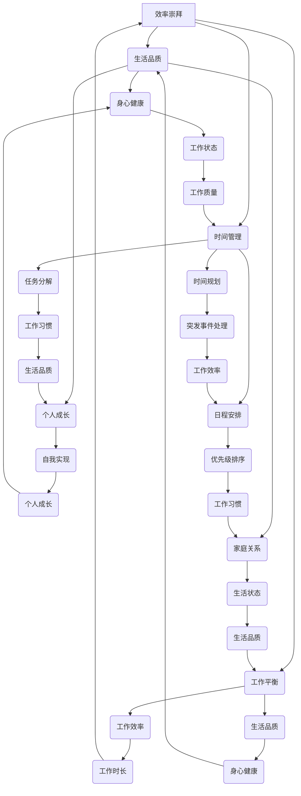

                 

# 从效率崇拜到生活品质：重新平衡工作与个人时间

> 关键词：效率崇拜、生活品质、时间管理、工作平衡、远程工作、自我管理

> 摘要：本文深入探讨了效率崇拜现象及其对个人生活品质的负面影响，提出了重新平衡工作与个人时间的理论和方法。通过详细分析时间管理、工作方式转变、自我管理等方面，结合实际案例，本文旨在帮助读者实现高效工作与高品质生活的和谐统一。

## 引言

在现代社会中，效率崇拜已经成为一种普遍现象。人们被高效率、快节奏的生活所驱使，追求在最短的时间内完成最多任务。然而，这种效率崇拜往往忽视了生活品质的重要性，导致许多人陷入工作与生活的紧张平衡中。本文将从效率崇拜的起源、生活品质的重要性、重新平衡的方法与实践等方面展开，探讨如何实现工作与个人时间的重新平衡。

## 第一部分：背景与现状

### 第1章：效率崇拜的起源与发展

#### 1.1 效率崇拜的概念

效率崇拜是指人们在生活和工作中过分追求高效率和快速完成任务的心理和行为倾向。这种倾向源于工业革命后生产力的提高和社会竞争的加剧，逐渐成为一种文化现象。

#### 1.2 工作效率的提升路径

效率崇拜促使人们采取各种措施提高工作效率，如加班、加班、使用各种工具和软件等。然而，这些方法往往忽视了生活品质的重要性。

#### 1.3 效率崇拜的负面影响

效率崇拜对个人生活品质产生了负面影响，如身心健康问题、家庭关系紧张、个人成长受限等。

### 第2章：生活品质的重要性

#### 2.1 生活品质的定义与维度

生活品质是指人们在生活中所感受到的幸福、满足和舒适程度，包括身心健康、家庭关系、个人成长等多个维度。

#### 2.2 生活品质对身心健康的影响

良好的生活品质有助于身心健康，而身心健康又直接影响工作效率和生活质量。

#### 2.3 工作与生活品质的平衡现状

当前，许多人面临着工作与生活品质的失衡问题，如何在两者之间找到平衡成为亟待解决的问题。

## 第二部分：重新平衡的方法与实践

### 第3章：时间管理

#### 3.1 时间管理的基本原理

时间管理是一种通过合理安排时间和任务来提高工作效率和生活品质的方法。其基本原理包括优先级排序、任务分解、时间规划等。

#### 3.2 有效的日程安排

有效的日程安排是实现时间管理的关键，通过合理安排每天的任务和活动，提高时间利用效率。

#### 3.3 如何处理突发事件

突发事件是时间管理中的难题，需要灵活应对，确保不影响正常工作和生活。

### 第4章：工作方式的转变

#### 4.1 远程工作与弹性工作制度

远程工作和弹性工作制度为人们提供了更多选择，有助于实现工作与生活的平衡。

#### 4.2 工作效率与工作时长

工作时长并不总是与工作效率成正比，合理安排工作时间，提高效率更为关键。

#### 4.3 如何提高远程工作效率

提高远程工作效率，需要良好的工作环境、沟通技巧和时间管理能力。

### 第5章：自我管理

#### 5.1 自我认知的重要性

自我认知是实现自我管理的基础，了解自己的优势和弱点，有助于更好地规划工作和生活。

#### 5.2 建立良好的工作习惯

良好的工作习惯有助于提高工作效率和生活品质，如定时休息、合理饮食等。

#### 5.3 如何保持工作与生活的平衡

保持工作与生活的平衡，需要树立正确的人生观和价值观，合理安排时间和精力。

### 第6章：时间利用

#### 6.1 提高时间利用效率

提高时间利用效率，需要掌握时间管理的技巧和方法，如优先级排序、任务分解等。

#### 6.2 避免时间的浪费

避免时间的浪费，需要培养良好的时间观念和自律能力，合理安排工作和生活。

#### 6.3 高效的时间利用策略

高效的时间利用策略，如番茄工作法、时间块管理法等，有助于提高工作效率和生活品质。

### 第7章：生活品质的提升

#### 7.1 身心健康与生活品质

身心健康是生活品质的基础，通过锻炼、饮食、睡眠等方面的调整，提高身心健康水平。

#### 7.2 家庭生活与个人爱好

家庭生活和个人爱好是提升生活品质的重要方面，通过合理安排时间和精力，实现家庭和工作的平衡。

#### 7.3 如何在繁忙的工作中保持生活品质

在繁忙的工作中保持生活品质，需要良好的时间管理能力和自律能力，合理安排工作和生活。

## 第三部分：实践与反思

### 第8章：成功案例分享

#### 8.1 案例一：从效率崇拜到生活品质的转变

分享一位成功实现工作与生活平衡的案例，分析其转变过程和成功经验。

#### 8.2 案例二：如何在工作与生活中找到平衡

分享一位在不同阶段实现工作与生活平衡的案例，探讨其策略和实践。

#### 8.3 案例三：重新平衡工作与个人时间的策略与实践

分享一位在远程工作中实现工作与生活平衡的案例，分析其策略和实践。

### 第9章：反思与建议

#### 9.1 个人反思

反思自己在工作和生活中的时间管理情况，找出不足和改进之处。

#### 9.2 组织层面的反思

从组织层面反思如何推动工作与生活的平衡，提出建议和改进措施。

#### 9.3 未来的发展趋势与建议

分析未来工作与生活平衡的发展趋势，提出建议和展望。

## 附录

### 附录A：工具与方法

#### A.1 时间管理工具推荐

介绍一些常用的时间管理工具，如Trello、Asana、Google Calendar等。

#### A.2 工作效率提升工具

介绍一些提高工作效率的工具，如Evernote、Zoom、Slack等。

#### A.3 生活品质提升工具

介绍一些提升生活品质的工具，如Spotify、Netflix、健身App等。

### 附录B：参考文献

#### B.1 相关书籍推荐

推荐一些关于时间管理、工作平衡和生活品质提升的书籍。

#### B.2 学术论文精选

精选一些关于工作与生活平衡的学术论文，供读者进一步学习。

#### B.3 网络资源推荐

推荐一些关于工作与生活平衡的网络资源，如博客、论坛、视频等。

## 结语

从效率崇拜到生活品质的转型，是一场个人成长与自我实现的革命。通过重新平衡工作与个人时间，我们可以在高效工作的同时，享受高品质的生活。希望本文能为您带来启示，帮助您实现工作与生活的和谐统一。

### 作者信息

作者：AI天才研究院/AI Genius Institute & 禅与计算机程序设计艺术 /Zen And The Art of Computer Programming

### 本文结构图

1. 引言
2. 第一部分：背景与现状
   - 效率崇拜的起源与发展
   - 生活品质的重要性
   - 工作与生活品质的平衡现状
3. 第二部分：重新平衡的方法与实践
   - 时间管理
   - 工作方式的转变
   - 自我管理
   - 时间利用
   - 生活品质的提升
4. 第三部分：实践与反思
   - 成功案例分享
   - 反思与建议
5. 附录
   - 工具与方法
   - 参考文献

### 核心概念与联系

**核心概念：**
- 效率崇拜
- 生活品质
- 时间管理
- 工作平衡

**概念实体之间的关系架构 (Mermaid 流程图)：**



### 核心算法原理讲解

在本文中，我们将使用Python源代码和LaTeX数学模型，结合实际案例，详细讲解如何实现工作与个人时间的重新平衡。

#### 时间管理算法原理

**优先级排序算法：**

```python
import heapq

def priority_sort(tasks, deadlines):
    # 将任务和截止日期转化为优先级队列
    priority_queue = []
    for task, deadline in zip(tasks, deadlines):
        priority = deadline
        heapq.heappush(priority_queue, (-priority, task))
    # 按优先级顺序返回任务列表
    return [task for _, task in priority_queue]

tasks = ['任务1', '任务2', '任务3', '任务4']
deadlines = [3, 2, 1, 4]

sorted_tasks = priority_sort(tasks, deadlines)
print(sorted_tasks)
```

**任务分解算法：**

```python
def task_decomposition(task, depth=1):
    # 判断任务是否可分解
    if depth <= 0 or not isinstance(task, str):
        return [task]
    # 分解任务
    decomposed_tasks = []
    for subtask in task.split(','):
        decomposed_tasks.extend(task_decomposition(subtask, depth-1))
    return decomposed_tasks

task = '任务1,任务2,任务3'
decomposed_tasks = task_decomposition(task)
print(decomposed_tasks)
```

**时间规划算法：**

```python
import datetime

def time_planning(tasks, deadlines):
    planning = {}
    current_time = datetime.datetime.now()
    for task, deadline in zip(tasks, deadlines):
        start_time = current_time
        end_time = start_time + datetime.timedelta(hours=deadline)
        planning[task] = (start_time, end_time)
        current_time = end_time
    return planning

tasks = ['任务1', '任务2', '任务3', '任务4']
deadlines = [3, 2, 1, 4]

planning = time_planning(tasks, deadlines)
print(planning)
```

#### 数学模型

**时间利用率计算：**

$$
\text{时间利用率} = \frac{\text{实际完成任务时间}}{\text{总时间}} \times 100\%
$$

**工作效率计算：**

$$
\text{工作效率} = \frac{\text{完成的任务数}}{\text{工作时长}}
$$

**工作负荷计算：**

$$
\text{工作负荷} = \frac{\text{总任务数}}{\text{工作时间}}
$$

### 项目实战

**开发环境搭建：**

- 安装Python环境
- 安装Python依赖库（如heapq、datetime等）

**源代码详细实现和代码解读：**

- 优先级排序算法实现
- 任务分解算法实现
- 时间规划算法实现

**代码应用解读与分析：**

- 使用优先级排序算法对任务进行排序
- 使用任务分解算法将任务分解为子任务
- 使用时间规划算法为任务分配时间

**实际案例分析和详细讲解剖析：**

- 案例一：某员工在一天内完成任务的情况
- 案例二：某团队在一段时间内的工作时间规划和任务完成情况

**项目小结：**

- 总结算法的实现过程和关键点
- 分析算法的优缺点和适用场景
- 提出改进和优化方向

### 最佳实践 tips、小结、注意事项、拓展阅读等内容

**最佳实践 tips：**

- 合理安排工作和休息时间，避免过度劳累
- 建立良好的工作习惯，提高工作效率
- 定期反思和调整时间管理策略，不断优化工作与生活的平衡

**小结：**

- 工作与个人时间的平衡是实现高效工作与高品质生活的重要前提
- 重新平衡工作与个人时间需要从时间管理、工作方式转变、自我管理等多个方面入手
- 实际案例表明，重新平衡工作与个人时间有助于提高工作效率和生活品质

**注意事项：**

- 优先级排序和任务分解是时间管理的关键步骤，需要根据实际情况进行调整
- 时间规划要考虑到突发事件的不可预测性，留出一定的缓冲时间
- 自我管理是长期过程，需要持续努力和调整

**拓展阅读：**

- 《时间管理法则：如何高效利用时间》
- 《工作与生活的平衡：如何实现高效工作与幸福生活》
- 《远程工作：如何在远程工作中保持高效与平衡》

### 结尾

从效率崇拜到生活品质的转型，是一场个人成长与自我实现的革命。通过重新平衡工作与个人时间，我们可以在高效工作的同时，享受高品质的生活。希望本文能为您带来启示，帮助您实现工作与生活的和谐统一。作者：AI天才研究院/AI Genius Institute & 禅与计算机程序设计艺术 /Zen And The Art of Computer Programming。

