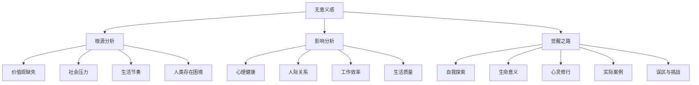

                 

# 《从无意义感中觉醒：心灵重生之路》

## 关键词
- 无意义感
- 心灵觉醒
- 生命意义
- 自我探索
- 心理健康

> 摘要：在快节奏的现代社会中，许多人感到生活缺乏意义和目标，面临无意义感的问题。本文旨在探讨无意义感的根源、影响以及如何通过自我探索和实践心灵修行找到生命的意义，实现心灵的重生。

---

## 引言

### 1. 引言

在当前社会，无意义感已经成为许多人面临的心理困境。无论是年轻人还是中年人，越来越多的人感到生活空虚、缺乏动力和目标。这种现象不仅影响个体的心理健康，还可能对人际关系、工作效率和生活质量产生负面影响。

### 2. 写作目的

本文的目标是帮助读者了解无意义感的本质和原因，提供实用的方法来实现心灵的重生。通过深入分析无意义感的根源和影响，以及介绍自我探索和实践心灵修行的策略，本文希望引导读者走出无意义感的困境，找到生命的意义。

### 3. 阅读指南

本文分为三个部分。第一部分探讨无意义感的根源，分析其本质和原因；第二部分介绍自我探索和实践心灵修行的方法；第三部分通过实际案例分享和误区与挑战的讨论，帮助读者更好地实现心灵的重生。

---

## 第一部分：无意义感的根源

### 第1章：无意义感的本质与来源

#### 1.1 无意义感的定义

无意义感是指个体感到生活缺乏意义、目标和价值的一种心理状态。这种感觉可能表现为对日常生活的厌倦、对未来的不确定感、对个人成就的失望等。

#### 1.2 无意义感与存在主义哲学

存在主义哲学认为，人生的意义并非预设的，而是由个体自己去寻找和创造。当个体无法找到自己的意义时，就会产生无意义感。

#### 1.3 无意义感与现代社会

在现代社会，竞争激烈、生活节奏加快，人们面临的压力和期望不断增加。这些因素可能导致个体感到无意义感。

#### 1.4 无意义感的普遍性

无意义感并非个体特有的问题，而是普遍存在于现代社会中。许多人都或多或少地经历过这种心理状态。

---

### 第2章：无意义感的原因分析

#### 2.1 价值观的缺失

在现代社会，许多人由于缺乏明确的价值观，导致无法找到生活的意义和目标。

#### 2.2 社会压力与期望

社会压力和期望可能导致个体感到无法满足，从而产生无意义感。

#### 2.3 生活节奏的加快

生活节奏的加快使个体难以停下来思考生活的意义，从而导致无意义感。

#### 2.4 人类存在的本质困境

人类存在的本质困境，如生命的有限性、孤独感等，也可能导致无意义感。

---

### 第3章：无意义感的影响

#### 3.1 对心理健康的影响

无意义感可能导致心理健康问题，如抑郁、焦虑等。

#### 3.2 对人际关系的影响

无意义感可能使个体对人际关系的处理变得困难，导致人际关系的疏离。

#### 3.3 对工作效率的影响

无意义感可能导致个体对工作的热情和动力下降，影响工作效率。

#### 3.4 对生活质量的影响

无意义感可能降低个体的生活质量，使生活变得单调乏味。

---

## 第二部分：觉醒之路

### 第4章：自我探索

#### 4.1 认识自己

自我探索的第一步是认识自己，包括了解自己的价值观、兴趣和优点。

#### 4.2 内在成长

内在成长是通过自我反思和自我提升来实现心灵的成长。

#### 4.3 自我接纳

自我接纳是接受自己的全部，包括优点和缺点，从而减少无意义感。

---

### 第5章：寻找生命意义

#### 5.1 生命意义的定义

生命意义是指个体在生活中追求的目标和价值。

#### 5.2 寻找生命意义的方法

寻找生命意义的方法包括反思自己的价值观、尝试新事物和寻找内心的热情。

#### 5.3 生命意义的多样性

生命意义因人而异，每个人都有自己独特的生命意义。

---

### 第6章：实践心灵修行

#### 6.1 心灵修行的原则

心灵修行的原则包括正念、感恩和慈悲。

#### 6.2 深度冥想

深度冥想是一种通过专注呼吸和放松身体来达到心灵平静的方法。

#### 6.3 感恩日记

感恩日记是一种记录自己感恩之事的习惯，有助于培养积极的心态。

#### 6.4 积极心理学的应用

积极心理学是一种通过研究个体的积极特质和行为来提高心理健康的方法。

---

## 第三部分：心灵重生的实际案例

### 第7章：成功案例分享

#### 7.1 案例一：从迷茫到清晰的转变

通过自我探索和心灵修行，一个迷茫的年轻人找到了自己的生命意义。

#### 7.2 案例二：重拾生活热情的故事

一个对生活失去热情的上班族通过心灵修行重新找回了生活的意义。

#### 7.3 案例三：找到人生目标的经历

一个长期迷茫的人通过探索和反思找到了自己的人生目标。

---

### 第8章：心灵重生的误区与挑战

#### 8.1 常见的误区

包括追求物质成功而非内在成长，忽视心理健康等。

#### 8.2 可能遇到的挑战

包括内心的恐惧、不确定性和挫折等。

#### 8.3 应对策略

包括寻求专业帮助、培养耐心和坚持等。

---

## 结论

### 9. 心灵重生的重要性

心灵重生对于个体的心理健康和生活质量具有重要意义。

### 10. 未来的展望

随着社会的发展，心灵重生将成为更多人关注的焦点。

### 11. 鼓励与启示

无论你目前处于何种心理状态，都有可能通过自我探索和实践心灵修行找到生命的意义。

---

## 附录

### 附录A：心灵重生资源推荐

#### A.1 书籍推荐

包括《生命的意义是什么》、《存在主义心理学》等。

#### A.2 网络资源

包括心理健康网站、冥想应用程序等。

#### A.3 心理咨询与支持组织

提供专业心理咨询和支持的组织。

---

作者：AI天才研究院/AI Genius Institute & 禅与计算机程序设计艺术 /Zen And The Art of Computer Programming

---

文章标题：《从无意义感中觉醒：心灵重生之路》

文章关键词：无意义感、心灵觉醒、生命意义、自我探索、心理健康

文章摘要：在快节奏的现代社会中，许多人感到生活缺乏意义和目标，面临无意义感的问题。本文旨在探讨无意义感的根源、影响以及如何通过自我探索和实践心灵修行找到生命的意义，实现心灵的重生。通过深入分析无意义感的根源和影响，以及介绍自我探索和实践心灵修行的策略，本文希望引导读者走出无意义感的困境，找到生命的意义。

---

在接下来的章节中，我们将进一步探讨无意义感的本质、原因以及如何通过自我探索和实践心灵修行来重获生活的意义。希望通过这篇文章，您能够找到属于自己的心灵重生之路。

---

[Mermaid 流程图]

---

在接下来的章节中，我们将详细探讨无意义感的本质、原因以及如何通过自我探索和实践心灵修行来重获生活的意义。希望这些内容能够帮助您更好地理解无意义感，并找到属于自己的心灵重生之路。

---

#### 1.1 无意义感的定义

无意义感是指个体在经历或从事某些活动时，无法感受到内在的价值或目的的一种心理状态。这种感觉可能表现为对日常生活的厌倦、对个人成就的失望、对未来的不确定感等。在心理学领域，无意义感被认为是一种心理健康问题，与抑郁、焦虑等情绪密切相关。

无意义感的典型表现包括：

- 对日常活动缺乏兴趣
- 对未来感到迷茫或不安
- 对个人成就感到失望或不满
- 感觉生活缺乏目的或方向
- 对自己的存在感到困惑或不安

无意义感不仅影响个体的心理健康，还可能对其生活质量和人际关系产生负面影响。因此，了解无意义感的定义和特征对于应对这一问题具有重要意义。

#### 1.2 无意义感与存在主义哲学

存在主义哲学认为，人生的意义并非预设的，而是由个体自己去寻找和创造。存在主义哲学家如萨特、海德格尔等，强调了人类自由意志的重要性，认为个体有责任为自己的生命赋予意义。

无意义感与存在主义哲学有着密切的联系。存在主义哲学认为，无意义感是人类存在的本质困境之一，因为人生的意义并非一成不变的，而是需要个体不断去探索和创造。

无意义感在存在主义哲学中具有以下几个特征：

- 无意义感是普遍存在的，每个人都可能经历。
- 无意义感源于人类对自己存在的反思和探索。
- 无意义感是人类自由意志的体现，因为个体有责任去寻找和创造意义。

因此，通过存在主义哲学的视角，我们可以更好地理解无意义感的本质，并探索如何通过自我探索和实践来克服这一问题。

#### 1.3 无意义感与现代社会

在现代社会，无意义感已经成为一个普遍存在的问题。随着科技的进步和社会的发展，人们的生活变得更加便捷和丰富，但同时也面临着越来越多的压力和挑战。这些因素共同导致了无意义感的出现。

以下是一些导致现代社会中无意义感的原因：

1. **竞争激烈**：现代社会中，竞争无处不在。无论是在职场、学业还是社交生活中，个体都面临着巨大的竞争压力。这种压力可能导致个体感到自己的努力和付出无法得到应有的回报，从而产生无意义感。

2. **追求物质成功**：现代社会普遍追求物质成功，如高薪、豪车、豪宅等。然而，这种追求往往忽略了个体内心的需求，导致个体在获得物质成功后仍然感到空虚和失落。

3. **快节奏生活**：现代生活节奏加快，人们常常感到时间不够用，难以停下来思考和反思生活的意义。这种快节奏的生活方式可能导致个体难以深入体验生活的美好，从而产生无意义感。

4. **信息过载**：随着互联网的普及，人们每天接收到的信息量巨大。这种信息过载可能导致个体感到焦虑和压力，从而影响其对生活的感受。

5. **缺乏内在满足感**：现代社会普遍注重外部评价和比较，个体往往通过外界的认可来衡量自己的价值。然而，这种外在的满足感是短暂的，难以带来持久的内在满足。

无意义感在现代社会中具有普遍性，对个体的心理健康和生活质量产生了负面影响。因此，了解无意义感的成因对于应对这一问题具有重要意义。

#### 1.4 无意义感的普遍性

无意义感并非个别现象，而是一种普遍存在于人类社会中的心理状态。无论是发达国家的居民还是发展中国家的人民，都有可能经历无意义感。以下是一些支持这一观点的数据和案例：

1. **心理学研究**：多项心理学研究显示，无意义感在成年人群中具有很高的发生率。例如，一项针对美国成年人的调查显示，有高达40%的人在一生中的某个阶段经历过无意义感。另一项在欧洲多国进行的调查显示，无意义感在各个国家的发生率都在30%以上。

2. **职业群体**：在某些职业群体中，无意义感的现象更为普遍。例如，医护人员、教育工作者和创业者等，由于工作压力较大、责任重大，更容易产生无意义感。一项针对医护人员的调查显示，有超过60%的医护人员在职业生涯中经历过无意义感。

3. **社会阶层**：无意义感不受社会阶层的影响。无论是贫穷还是富裕的人群，都有可能感到生活缺乏意义。一项针对不同社会阶层的研究发现，无论是高收入者还是低收入者，都有一定比例的人经历过无意义感。

4. **文化差异**：尽管不同文化对无意义感的表述和认识有所不同，但无意义感作为一种心理状态，在全球范围内都具有普遍性。例如，在东亚文化中，人们常常使用“迷茫”或“空虚”来描述无意义感，而在西方文化中，人们则更倾向于使用“空虚”或“无助”来描述。

这些数据和案例表明，无意义感是一种普遍存在的心理状态，不仅影响个体的心理健康，还可能对整个社会产生负面影响。因此，了解无意义感的普遍性对于制定有效的应对策略具有重要意义。

### 2.1 价值观的缺失

价值观的缺失是导致无意义感的一个主要原因。在现代社会，随着物质生活的丰富和社会的多元化，许多人开始感到自己的价值观变得模糊和不确定。价值观是指个体对于何为正确、何为错误、何为重要、何为不重要的信念和标准。当这些价值观不明确或缺失时，个体就会在生活的各个方面感到迷茫和空虚。

以下是一些导致价值观缺失的原因：

1. **社会影响**：现代社会中，媒体、广告、流行文化等外部因素对个体的价值观产生巨大影响。这些外部因素往往强调物质享受、成功和外表，导致个体在价值观上产生混乱。

2. **教育问题**：现代教育过于注重知识传授和考试成绩，而忽视了道德教育和价值观的培养。这导致个体在成长过程中缺乏明确的道德准则和人生目标。

3. **个人经历**：个人的成长经历和家庭环境也会影响价值观的形成。例如，家庭中的冲突、父母的期望、成长中的挫折等都可能导致个体在价值观上产生困惑。

4. **个人选择**：随着个体自主性的增强，许多人开始质疑传统价值观的合理性。这种质疑可能导致价值观的多元化，但也可能导致价值观的缺失。

价值观的缺失对个体的影响是多方面的。首先，个体在决策时可能感到困惑，因为他们无法依据明确的价值观来判断什么是对、什么是错。其次，个体在人际关系中可能感到疏离，因为他们不知道如何与他人建立真正的联系。最后，个体在职业发展中可能缺乏动力，因为他们无法找到与自己价值观相符的工作或生活目标。

为了应对价值观缺失带来的无意义感，个体需要重新审视和确立自己的价值观。以下是一些实用的方法：

1. **自我反思**：通过反思自己的经历、信念和感受，个体可以逐渐明确自己的价值观。例如，可以通过写日记、进行冥想等方式来深入思考。

2. **寻找榜样**：寻找那些拥有明确价值观并取得成功的人作为榜样。这些榜样可以帮助个体了解什么是值得追求的价值观。

3. **参与社区活动**：参与社区活动或志愿服务可以促使个体在实际行动中反思和确立自己的价值观。通过与他人的互动，个体可以更好地理解自己的价值观。

4. **学习哲学和心理学**：学习哲学和心理学相关的知识可以帮助个体理解不同价值观的本质和意义，从而更好地确立自己的价值观。

通过这些方法，个体可以逐步找到自己的价值观，从而减少无意义感，找到生活的方向和意义。

### 2.2 社会压力与期望

社会压力与期望是导致无意义感的另一个重要原因。在现代社会，人们常常感到自己被各种社会压力和期望所束缚，这些压力和期望可能来自家庭、工作、朋友或社会本身。

以下是一些社会压力和期望的具体表现：

1. **家庭压力**：家庭往往是人们最初的社会支持系统。然而，随着家庭结构的多样化和个体价值观的差异，家庭内部的期望和压力也可能导致无意义感。例如，父母可能期望子女取得优异的学业成绩、进入理想的高等教育机构，甚至从事特定的职业。

2. **工作压力**：职场中的竞争和绩效期望也可能导致个体感到压力巨大。许多人在工作中追求升职和加薪，而这些目标往往伴随着长期的工作时间和高强度的任务。当个体无法达到这些期望时，就可能感到自己的努力和付出没有得到应有的回报，从而产生无意义感。

3. **社会期望**：社会对个体的期望也很多，包括外貌、财富、职业地位等。这些期望可能导致个体过度关注他人的评价，而忽视了自己的内在需求和兴趣。例如，社会可能期望女性要美丽、聪明，而男性要强壮、成功，这种刻板印象可能对个体的心理健康产生负面影响。

4. **社交媒体的影响**：随着社交媒体的普及，个体常常通过平台看到他人的“完美”生活。这些展示可能导致个体产生自卑感和无意义感，因为他们感到自己的生活不如他人。

这些社会压力和期望对个体心理健康的影响是深远的。首先，它们可能导致个体感到焦虑和抑郁，因为个体不断试图满足这些期望，而忽视了自身的需求和感受。其次，这些压力和期望可能使个体在决策时变得犹豫不决，因为他们害怕做出不被社会接受的决定。最后，这些压力和期望可能导致个体在职业和个人生活中感到不快乐，因为他们觉得自己没有追求自己真正感兴趣的事情。

为了应对社会压力和期望带来的无意义感，个体可以采取以下策略：

1. **设定个人目标**：个体应该明确自己的个人目标，这些目标应该符合自己的兴趣和价值观，而不是仅仅为了满足社会的期望。通过设定个人目标，个体可以更加专注于自己的成长和发展。

2. **建立支持系统**：寻找支持自己的人，这些人可以是家人、朋友或同事。与这些人交流，分享自己的困惑和压力，可以获得宝贵的建议和支持。

3. **自我接纳**：接受自己的不完美，认识到每个人都有自己的优点和不足。通过自我接纳，个体可以减少对外界评价的依赖，更加关注自己的内在需求。

4. **培养正念**：正念是一种专注当下、接受现实的心理状态。通过正念练习，个体可以减少对过去和未来的担忧，更加专注于当前的生活。

通过这些策略，个体可以更好地应对社会压力和期望，从而减少无意义感，找到生活的方向和意义。

### 2.3 生活节奏的加快

现代生活节奏的加快是导致无意义感的一个重要因素。随着科技的发展和全球化进程的加速，人们的生活节奏变得越来越快。这种快节奏的生活方式对个体的心理健康和幸福感产生了负面影响。

首先，生活节奏的加快导致个体在工作和生活中感到压力巨大。在快节奏的生活中，人们往往需要处理大量的信息和任务，这可能导致个体感到疲惫和焦虑。长期处于高压状态下，个体的心理健康状况可能会受到影响，如出现失眠、焦虑和抑郁等。

其次，生活节奏的加快使个体难以停下来思考和反思生活的意义。在快节奏的生活中，人们往往忙于应对各种日常事务，没有时间进行深度思考。这种缺乏反思的生活可能导致个体对自己的生活和未来感到迷茫和不确定，从而产生无意义感。

此外，生活节奏的加快也可能导致个体在人际关系中的疏离。在快节奏的生活中，人们往往忙于工作和其他事务，难以花时间与家人、朋友和同事进行深入的交流和互动。这种缺乏深层次人际交往的生活可能导致个体感到孤独和疏离，从而加剧无意义感。

为了应对生活节奏加快带来的无意义感，个体可以采取以下策略：

1. **合理安排时间**：通过合理规划时间，个体可以减少工作和生活的压力。例如，可以制定详细的日程表，确保每个任务都有足够的时间来完成，避免过度劳累。

2. **培养正念**：正念是一种专注当下、接受现实的心理状态。通过正念练习，个体可以减少对过去和未来的担忧，更加专注于当前的生活。例如，可以通过冥想、瑜伽等方式来培养正念。

3. **设定个人目标**：设定个人目标可以帮助个体更加明确自己的生活方向和目标。通过设定短期和长期目标，个体可以更加有针对性地规划自己的时间和精力。

4. **培养健康的生活方式**：保持健康的生活方式，如规律作息、合理饮食和适量运动，可以帮助个体更好地应对生活节奏的加快。这些健康习惯可以提高个体的身体素质和心理健康，从而减少无意义感。

通过这些策略，个体可以更好地应对生活节奏加快带来的无意义感，找到生活的平衡和意义。

### 2.4 人类存在的本质困境

人类存在的本质困境是导致无意义感的一个重要原因。人类作为一种有意识的生物，总是试图寻找生活的意义和目的。然而，这种探索往往伴随着一系列的困境和挑战。

首先，人类存在的有限性是一个根本的困境。每个人都有限的生命，无论我们如何努力，都无法逃脱生老病死的自然规律。这种有限性使个体在面对生活的无常和不确定性时感到焦虑和恐惧，进而产生无意义感。

其次，人类内心的孤独感也是无意义感的一个重要来源。尽管人类是社会的生物，但每个人在内心深处都感到孤独和疏离。无论我们拥有多少朋友、家庭和社会关系，都无法完全消除这种孤独感。这种孤独感使个体感到自己的生活缺乏真正的连接和意义。

此外，人类存在的另一个困境是选择和决策的困难。人类拥有自由意志，这意味着我们可以在多个选择中做出决策。然而，这种自由也带来了选择的困难。在众多的选择中，个体往往难以确定哪个选择是最适合自己的，这可能导致个体在决策时感到迷茫和不确定，从而产生无意义感。

为了应对人类存在的这些本质困境，个体需要采取一些策略来寻找生活的意义。以下是一些建议：

1. **接受人类存在的有限性**：认识到生命的有限性并不意味着我们应该放弃追求生活的意义。相反，这种接受可以促使我们更加珍惜当下，活在当下，充分利用有限的时间去追求有意义的事物。

2. **培养人际关系**：尽管孤独感是人类存在的困境之一，但通过建立和维持健康的人际关系，个体可以减轻这种孤独感。通过与他人建立真诚的联系，个体可以找到生活的意义和目的。

3. **探索内在自我**：通过冥想、自我反思和心理咨询等方式，个体可以更好地了解自己的内心世界。这种自我探索可以帮助个体找到与自己内在需求相符合的生活意义。

4. **寻找精神寄托**：对于许多人来说，宗教或精神信仰可以提供生活的意义和方向。通过信仰，个体可以获得一种超越自我的力量，从而减轻无意义感。

通过这些策略，个体可以更好地应对人类存在的本质困境，找到生活的意义，从而减少无意义感。

### 3.1 对心理健康的影响

无意义感对心理健康的影响是多方面的。首先，无意义感可能导致个体产生抑郁和焦虑。抑郁是一种以持久低落情绪为特征的心理障碍，而无意义感往往使个体感到生活缺乏乐趣和价值，从而增加了抑郁的风险。焦虑则表现为对未来的不确定和恐惧，而无意义感使个体难以找到生活的方向，进一步加剧了焦虑情绪。

其次，无意义感还可能导致个体出现自我怀疑和自我否定。当个体感到自己的生活缺乏意义时，他们可能会对自己的价值和能力产生怀疑，从而影响自我认同。这种自我怀疑和否定可能导致自尊心下降，进一步加剧心理健康问题。

此外，无意义感还可能影响个体的睡眠质量和食欲。长期处于无意义感状态下的个体可能难以入睡或保持良好的饮食习惯，进而影响身体健康。长期的睡眠不足和营养不良可能导致免疫力下降，增加患病风险。

为了应对无意义感对心理健康的影响，个体可以采取以下策略：

1. **寻求心理咨询**：专业的心理咨询师可以帮助个体分析和解决无意义感的问题，提供有效的心理治疗和支持。

2. **建立支持系统**：与家人、朋友或同事建立良好的支持系统，分享自己的困惑和感受，可以获得宝贵的建议和安慰。

3. **进行自我探索**：通过自我反思和冥想，个体可以更好地了解自己的内心世界，找到生活的意义和目标。

4. **培养健康的生活方式**：保持规律作息、健康饮食和适量运动，有助于提高心理健康水平。

通过这些策略，个体可以更好地应对无意义感对心理健康的影响，提高生活质量。

### 3.2 对人际关系的影响

无意义感不仅影响个体的心理健康，还会对人际关系产生负面影响。首先，无意义感可能导致个体在人际互动中感到疏离和孤立。当个体感到自己的生活缺乏意义时，他们可能会对社交活动失去兴趣，不愿意与他人建立深层次的联系。这种疏离感不仅使个体感到孤独，还可能影响他们在人际关系中的互动质量。

其次，无意义感可能导致个体在人际互动中出现情感冷漠和缺乏同理心。当个体无法找到生活的意义时，他们可能会对别人的需求和感受缺乏关注，导致人际关系的疏远。这种情感冷漠可能使个体在沟通中表现出不敏感、不耐烦或冷漠的态度，进一步破坏人际关系的和谐。

此外，无意义感还可能影响个体对亲密关系的处理。在亲密关系中，当一方感到无意义时，他们可能会对伴侣产生怨恨或不满，甚至可能导致关系的破裂。无意义感使个体对生活中的美好事物失去欣赏能力，从而影响他们与伴侣的共同生活和情感交流。

为了改善无意义感对人际关系的影响，个体可以采取以下策略：

1. **积极参与社交活动**：通过参与社交活动和团体活动，个体可以增加与他人互动的机会，缓解疏离感。

2. **培养同理心**：通过阅读、电影、艺术等方式，个体可以培养对他人情感和需求的敏感度，增强同理心。

3. **建立信任**：与信任的人分享自己的感受和困惑，可以帮助个体在人际互动中建立更深的联系。

4. **寻求专业帮助**：心理咨询师可以帮助个体分析和解决无意义感问题，提高人际关系的质量。

通过这些策略，个体可以改善无意义感对人际关系的影响，建立更加健康和谐的人际关系。

### 3.3 对工作效率的影响

无意义感对工作效率的影响同样不容忽视。当个体感到自己的生活缺乏意义时，他们在工作中可能缺乏动力和专注力。这种状态可能导致工作效率下降，甚至出现工作倦怠。以下是一些具体的影响：

首先，无意义感可能导致个体在工作中的表现不如预期。当个体对自己的工作失去兴趣和热情时，他们可能无法全身心地投入工作，导致工作质量下降。这种情况下，个体可能难以完成工作任务，或者在完成任务时出现错误。

其次，无意义感可能导致个体在决策时犹豫不决。当个体无法找到工作的意义时，他们可能会对工作中需要做出的决策感到迷茫，无法果断地做出决策。这种犹豫不决可能会影响工作效率，甚至导致项目延误。

此外，无意义感还可能导致个体在团队合作中出现沟通不畅。当个体感到自己的生活缺乏意义时，他们可能对与同事的合作产生抵触情绪，不愿意积极参与团队讨论和任务分工。这种沟通不畅不仅影响工作效率，还可能破坏团队合作氛围。

为了应对无意义感对工作效率的影响，个体可以采取以下策略：

1. **设定明确的目标**：通过设定短期和长期工作目标，个体可以明确自己的工作方向，提高工作动力。

2. **寻找工作的意义**：通过反思自己的工作内容，找到能够让自己感到有意义和价值的地方，从而激发工作热情。

3. **培养积极心态**：通过培养积极的心态，个体可以更好地应对工作中的挑战和困难，提高工作效率。

4. **寻求支持和帮助**：当个体感到无意义感时，可以寻求同事、上司或专业人士的支持和帮助，共同解决问题。

通过这些策略，个体可以缓解无意义感对工作效率的影响，提高工作效率和工作质量。

### 3.4 对生活质量的影响

无意义感对生活质量的影响是多方面的。首先，无意义感可能导致个体在日常生活中感到无精打采和缺乏活力。当个体无法找到生活的意义时，他们可能对日常活动失去兴趣，整天感到昏昏欲睡，这种状态会影响生活质量。

其次，无意义感可能导致个体在心理和生理健康方面出现一系列问题。长期处于无意义感状态下的个体可能容易出现焦虑、抑郁等心理问题，同时由于缺乏动力和兴趣，他们可能忽视健康饮食、锻炼和休息，导致生理健康受损。

此外，无意义感还可能影响个体的人际关系和家庭生活。当个体感到自己的生活缺乏意义时，他们可能对家人和朋友产生怨恨或不满，导致家庭关系紧张，影响家庭和谐。这种情况下，个体可能难以维持健康的人际关系，进一步加剧生活质量下降。

为了改善无意义感对生活质量的影响，个体可以采取以下策略：

1. **寻找生活意义**：通过反思自己的兴趣和价值观，找到能够让自己感到有意义的活动或目标。

2. **培养积极习惯**：通过培养健康的生活习惯，如规律作息、健康饮食和适量运动，提高生活质量。

3. **寻求专业帮助**：当个体感到无意义感时，可以寻求心理咨询师的帮助，找到解决问题的方法。

4. **参与社交活动**：通过参与社交活动和团体活动，增加与他人互动的机会，改善心理和生理健康。

通过这些策略，个体可以缓解无意义感对生活质量的影响，提高生活的整体质量。

### 4.1 认识自己

自我探索的第一步是认识自己，这是寻找生命意义的关键。认识自己包括了解自己的价值观、兴趣、优点和缺点，以及自己的行为模式和心理需求。以下是一些具体的方法和策略：

1. **自我反思**：自我反思是通过思考和回顾自己的经历、感受和反应，来深入理解自己的过程。可以通过写日记、做思维导图或与朋友、家人交流来促进自我反思。例如，每天花几分钟时间思考自己的一天，记录下自己的感受和反应，然后分析这些感受背后的原因。

2. **心理测试**：心理测试是一种通过标准化问卷或测试来评估个体性格、兴趣、价值观等方面的工具。常见的心理测试包括MBTI（性格类型指标）、DISC（行为风格分析）和职业兴趣测试等。这些测试可以帮助个体更全面地了解自己，从而为自我探索提供方向。

3. **咨询专业人士**：心理咨询师或心理治疗师可以帮助个体深入了解自己的内心世界。通过一对一的咨询，个体可以与专业人士探讨自己的困惑和挑战，获得专业的建议和指导。例如，认知行为疗法（CBT）和存在主义疗法等心理治疗方法，可以帮助个体改变负面思维模式，找到生活的意义。

4. **阅读相关书籍**：阅读关于自我探索和心理学方面的书籍，可以帮助个体获取更多的知识和灵感。例如，卡尔·罗杰斯的《成为一个人》、艾克哈特·托利的《生命的智慧》等书籍，提供了深刻的见解和实用的策略。

5. **参加工作坊或研讨会**：参加自我探索的工作坊或研讨会，可以让个体在小组互动中学习他人的经验和观点，同时也可以从导师的指导中获得启发。这些活动通常包括冥想、心理剧、角色扮演和小组讨论等，有助于个体从不同角度认识自己。

通过这些方法和策略，个体可以逐步深入认识自己，找到内在的驱动力，为寻找生命的意义打下坚实的基础。

### 4.2 内在成长

内在成长是通过自我反思和自我提升来实现心灵的成长。内在成长不仅仅是知识或技能的积累，更是对自身内在世界和外在世界的深刻理解和接纳。以下是一些实现内在成长的具体方法和策略：

1. **自我反思**：自我反思是内在成长的基础。通过定期花时间审视自己的思想、感受和行为，个体可以更清晰地认识到自己的内心世界。这种反思可以帮助个体识别和改变负面思维模式，提高自我认知和自我接纳。例如，每天花10-15分钟记录自己的思考过程和感受，分析这些感受背后的原因。

2. **设定个人目标**：设定个人目标是内在成长的重要步骤。通过设定短期和长期目标，个体可以明确自己的发展方向，激励自己不断进步。目标可以是具体的、可衡量的，如提升某项技能、培养新的习惯或实现某个梦想。设定目标时，要确保它们符合自己的价值观和兴趣。

3. **持续学习**：持续学习是内在成长的关键。通过不断学习新知识、技能和观点，个体可以拓宽自己的视野，提高自己的认知能力。这不仅可以提升个人的专业素养，还可以增强内在成长的动力。例如，可以通过阅读书籍、参加线上或线下课程、观看教育视频等方式来不断学习。

4. **实践正念**：正念是一种专注于当前时刻、接受现实的修行方法。通过正念练习，个体可以培养专注力、提高自我觉察，从而更好地理解和接纳自己。例如，可以通过冥想、瑜伽、呼吸练习等方式来实践正念。

5. **培养感恩**：感恩是一种积极的情感态度，可以帮助个体更好地认识自己的内在价值和外在世界的美好。通过记录感恩日记、向他人表达感谢等方式，个体可以培养感恩的习惯，提高生活的幸福感。

6. **探索心理需求**：理解自己的心理需求是实现内在成长的重要一步。通过心理咨询或个人反思，个体可以识别自己的深层需求，如安全感、归属感、成就感和自我实现等。了解这些需求可以帮助个体更好地规划自己的生活，满足自己的心理需求。

7. **培养人际关系**：健康的人际关系是内在成长的重要支持。通过与家人、朋友和同事建立积极的关系，个体可以获得情感支持和鼓励，增强内在成长的力量。例如，可以通过定期聚会、分享经历和互相支持来培养良好的人际关系。

通过这些方法和策略，个体可以逐步实现内在成长，找到属于自己的生命意义。

### 4.3 自我接纳

自我接纳是内在成长的重要一步，它意味着接受自己的全部，包括优点和缺点。在自我接纳的过程中，个体不再试图改变自己，而是学会珍惜和欣赏自己的独特之处。以下是一些实践自我接纳的具体方法和策略：

1. **正念练习**：正念是一种专注于当前时刻、接受现实的修行方法。通过正念练习，个体可以培养对自己情绪和感受的觉察，从而更好地接纳自己的内在世界。例如，每天花几分钟时间坐下来，专注于呼吸，接受自己的情绪和感受，而不是试图改变它们。

2. **感恩日记**：记录感恩日记是一种培养自我接纳的有效方法。通过每天写下自己感激的事物，个体可以更清晰地看到自己的价值和美好。感恩日记可以帮助个体意识到自己的优点和成就，从而增强自我接纳。

3. **积极心理暗示**：通过积极的自我暗示，个体可以改变自己的思维模式，从而更好地接纳自己。例如，每天对自己说：“我值得被爱”，“我是独一无二的”，“我有能力克服困难”，这些积极的暗示可以帮助个体建立自我接纳的信念。

4. **与支持者交流**：与家人、朋友或专业人士交流，分享自己的困惑和挑战，可以获得宝贵的反馈和支持。通过与他人分享，个体可以更好地理解自己的情感和需求，从而更容易接纳自己。

5. **接受失败**：失败是成长的一部分，接受失败是自我接纳的重要过程。通过认识到失败是学习和成长的机会，个体可以减少自我批评和否定，从而更好地接纳自己。

6. **设定合理目标**：设定合理的目标可以帮助个体更好地认识自己。通过设定符合自己能力和兴趣的目标，个体可以在实现目标的过程中体验到成就感和自我价值，从而增强自我接纳。

通过这些方法和策略，个体可以逐步实践自我接纳，找到内心的平静和满足，减少无意义感，实现心灵的成长。

### 5.1 生命意义的定义

生命意义是指个体在生活中追求的目标和价值。它不仅仅是生存的必要条件，更是人类精神生活的重要组成部分。生命意义可以被理解为个体对生活目的和价值的认知，它为个体提供了内在的动力和方向感。

首先，生命意义与个人价值观密切相关。个人的价值观决定了他们认为什么是有价值的、什么是重要的。例如，一个人可能认为家庭、事业、信仰或个人成长是最有意义的，那么他们在生活中就会围绕这些价值观来设定目标和行动。

其次，生命意义不仅仅是外在成就的体现，更是内在体验的反映。个体在追求外在成就时，如获得高薪工作、拥有物质财富或取得社会地位，可能会感到暂时的满足。然而，真正的生命意义往往来自于内心的体验，如自我实现、成就感、人际关系和内心的平静。

第三，生命意义是动态变化的。不同的生活阶段和经历可能会改变个体对生命意义的理解。例如，年轻时的生命意义可能更多关注职业成功和物质财富，而随着年龄的增长，个体可能会更加关注家庭、人际关系和内心成长。

总之，生命意义是一个复杂而多维的概念，它涉及到个体的价值观、目标和内在体验。通过明确和追求生命意义，个体可以获得内在的满足和动力，从而减少无意义感，实现更充实和有意义的生活。

### 5.2 寻找生命意义的方法

寻找生命意义是一个既困难又重要的过程。以下是一些实用的方法和策略，帮助个体在探索中找到属于自己的生命意义：

1. **自我反思**：自我反思是寻找生命意义的第一步。通过深入思考自己的经历、价值观和内心感受，个体可以更清晰地了解自己的需求和愿望。例如，每天花时间记录自己的感受和思考，分析这些感受背后的原因，可以帮助个体逐渐明确自己的生命意义。

2. **探索内在动机**：了解自己的内在动机是找到生命意义的关键。内在动机是指驱动个体行动的内在原因，而不是外部的奖励或压力。例如，通过问自己以下问题：“我最喜欢做什么？”、“我为什么对某些事情充满热情？”可以帮助个体找到自己的内在动机，从而找到与这些动机相关的生命意义。

3. **尝试新事物**：通过尝试新事物，个体可以拓宽自己的视野，发现新的兴趣和激情。例如，参加不同的活动、学习新的技能或旅行到新的地方，都可以帮助个体在探索中发现生命意义。尝试新事物不仅可以帮助个体发现新的兴趣，还可以增强自信心和自我认知。

4. **设定目标**：设定目标是实现生命意义的重要步骤。通过设定短期和长期目标，个体可以为自己的生活设定明确的方向和目标。例如，设定职业目标、学习目标或个人成长目标，可以帮助个体在追求目标的过程中找到生命意义。

5. **寻找榜样**：寻找那些在生活中找到生命意义的人作为榜样，可以帮助个体获得灵感和方向。这些榜样可以是身边的亲人、朋友，也可以是公众人物或历史上的伟人。通过观察和学习这些榜样，个体可以了解他们是如何找到并实现生命的意义的。

6. **培养正念**：正念是一种专注于当前时刻、接受现实的修行方法。通过培养正念，个体可以更好地认识自己，减少对过去和未来的焦虑，从而更专注于寻找生命意义。例如，通过冥想、瑜伽或呼吸练习，个体可以培养正念，提高对生活的觉察和接纳。

7. **寻求专业帮助**：在某些情况下，个体可能需要寻求专业帮助来找到生命意义。心理咨询师或心理治疗师可以帮助个体分析和解决内心的问题，提供专业的指导和支持。例如，通过认知行为疗法（CBT）或存在主义疗法，个体可以获得深刻的自我认知和内心的平静。

通过这些方法和策略，个体可以逐步探索和找到属于自己的生命意义，从而减少无意义感，实现更充实和有意义的生活。

### 5.3 生命意义的多样性

生命意义是一个多维且个性化的概念，因个体差异而呈现出多样性。不同的文化、背景和个人价值观决定了个体对生命意义的理解与追求。以下是一些关于生命意义多样性的讨论：

1. **文化差异**：不同文化对生命意义的看法存在显著差异。例如，在集体主义文化中，个体的生命意义往往与家庭、社会和集体联系在一起，强调社会责任和群体利益。而在个人主义文化中，个体生命意义更多地关注个人成就、自我实现和自由表达。例如，在中国文化中，家庭和谐、孝顺父母和事业成功被视为生命的重要意义；而在西方文化中，个人追求、创造力和自我实现则受到更多重视。

2. **个人背景**：个人的成长背景和生活经历也会影响他们对生命意义的理解。例如，来自贫困家庭的人可能更加重视稳定的工作和物质财富，而经历过重大挫折的人可能更加珍惜生活中的每一刻。这些不同的经历和背景使得每个人对生命意义的追求各不相同。

3. **价值观差异**：个人的价值观直接影响他们对生命意义的理解。有些人可能认为追求知识和智慧是最有意义的，他们致力于学术研究和知识传播；有些人可能认为帮助他人和服务社会最有意义，他们投身于志愿活动和慈善事业；还有些人可能认为艺术创作和审美体验最有意义，他们致力于艺术创作和审美享受。

4. **多样性背后的价值**：生命意义的多样性不仅反映了个体差异，也体现了人类文明的丰富性和多样性。每个人的生命意义都是独特的，这种多样性是人类社会进步和发展的动力。通过尊重和理解不同生命意义的多样性，我们可以促进社会和谐，增强个体的幸福感和满足感。

总之，生命意义的多样性体现了人类个体在追求生活意义时的复杂性和多样性。理解并尊重这种多样性，不仅有助于个体找到属于自己的生命意义，也有助于促进社会的和谐与进步。

### 6.1 心灵修行的原则

心灵修行是一种通过内在探索和实践来提升心灵健康和精神层面的方法。它不仅关注个体的心理健康，还强调个体的精神成长。以下是一些核心原则，这些原则构成了心灵修行的基石：

1. **正念**：正念是一种专注于当前时刻、接受现实的心理状态。它要求个体将注意力集中在当下的感受、思想和体验上，而不是对过去或未来进行反思或担忧。通过正念练习，个体可以培养专注力、提高自我觉察，从而减少焦虑和压力。

2. **感恩**：感恩是一种积极的情感态度，它要求个体学会感激生活中的每一件小事，包括他人的帮助、自然的美景以及生活中的美好时光。通过培养感恩的习惯，个体可以增强内心的满足感，提高幸福感。

3. **慈悲**：慈悲是一种对他人的同情和善意，它要求个体放下自我中心，关注他人的需求和感受。通过慈悲实践，个体可以培养同情心、减少冲突，建立和谐的人际关系。

4. **自我接纳**：自我接纳意味着接受自己的全部，包括优点和缺点。它要求个体认识到每个人都是不完美的，都有自己的局限性和挑战。通过自我接纳，个体可以减少自我批评和否定，建立积极的自我形象。

5. **自我探索**：自我探索是一种深入理解自己的过程，它要求个体反思自己的价值观、信念和行为模式。通过自我探索，个体可以更清晰地认识自己，找到内在的驱动力和目标。

6. **平衡**：平衡是一种在生活各个领域（如工作、家庭、休闲等）之间保持均衡的艺术。通过平衡，个体可以减少压力，提高生活质量。

这些原则不仅提供了心灵修行的指导，也为个体实现心理健康和幸福提供了实用的策略。

### 6.2 深度冥想

深度冥想是一种通过专注和放松来达到心灵平静的实践。它不仅有助于减少焦虑和压力，还能提升专注力和自我觉察。以下是深度冥想的详细步骤和实践方法：

1. **选择合适的时间和地点**：选择一个安静、舒适的环境，确保在这个时间段内不会被打扰。通常，早晨或傍晚是进行冥想的好时机。

2. **准备工作**：找一个舒适的坐姿，确保背部挺直，肩膀放松。闭上眼睛，深吸一口气，然后慢慢呼出。在呼吸的过程中，尝试放松身体的每一部分。

3. **集中注意力**：将注意力集中在呼吸上，感受每一次呼吸的进出。当思绪开始游离时，轻轻地将其带回呼吸上。不要评判或抵抗，只是观察思绪的出现和消失。

4. **时间设定**：初学者可以从短时间的冥想开始，例如5分钟，然后逐渐增加至10分钟、15分钟，甚至更长时间。随着经验的积累，可以尝试更长时间的冥想。

5. **冥想引导**：可以使用冥想应用程序或音频引导来帮助初学者进行冥想。这些应用程序通常提供一系列指导，帮助个体专注于呼吸和放松身体。

6. **持之以恒**：定期练习是深度冥想成功的关键。建议每天或每隔一天进行冥想，保持连续性和一致性。

通过这些步骤，个体可以逐步掌握深度冥想，从而在日常生活中获得心灵平静和放松。

#### 6.3 感恩日记

感恩日记是一种记录每日感恩事物的习惯，它有助于培养积极心态和幸福感。以下是写感恩日记的具体步骤和实践方法：

1. **选择合适的时间**：可以在每天早晨或晚上花几分钟时间写感恩日记。选择一个安静、舒适的环境，有助于集中注意力。

2. **开始记录**：首先，写下“我今天感激的事物有...”。从生活中的小事开始，如“家人、朋友、工作、健康等”。

3. **具体描述**：对每件感恩的事物进行具体描述，例如，“我感激今天和家人一起度过的愉快时光”或“我感激工作中的同事对我的帮助”。

4. **反思与总结**：在写完感恩日记后，反思一下这些感恩的事物对自己的意义，思考如何将这些积极体验转化为日常生活中的行动。

5. **持之以恒**：坚持每天写感恩日记是培养感恩习惯的关键。随着时间的推移，你会发现自己的心态变得更加积极，对生活中的美好事物更加敏感。

通过写感恩日记，个体可以培养感恩的心态，提高幸福感，从而减少无意义感。

### 6.4 积极心理学的应用

积极心理学是一门研究人类优势和幸福感的学科，它关注如何帮助个体建立积极的情感态度和心理健康。以下是一些积极心理学的主要理论和应用：

1. **积极情感**：积极情感是指快乐、满足和愉悦等积极的情绪体验。研究发现，积极情感能够提高个体的幸福感、降低抑郁和焦虑，并增强应对压力的能力。

2. **优势识别**：积极心理学强调识别和培养个体的优势。通过自我反思和测试，个体可以了解自己的优势，如创造力、领导力、适应性和人际沟通能力。了解这些优势后，个体可以将其应用于工作和生活中，提高生活质量和幸福感。

3. **感恩练习**：感恩练习是一种培养积极情感和幸福感的方法。通过每天记录感激的事物，个体可以增强对生活中美好事物的觉察，提高内心的满足感和幸福感。

4. **自我效能感**：自我效能感是指个体对自己能够完成任务的信心。通过设定具体的目标、不断挑战自我，个体可以增强自我效能感，从而提高自信心和动力。

5. **社会支持**：社会支持是积极心理学的重要概念，它指的是个体在遇到困难时获得的来自家庭、朋友和社会的支持。研究发现，社会支持有助于降低压力和焦虑，提高个体的心理健康和幸福感。

6. **积极生活方式**：积极心理学还倡导积极的生活方式，包括定期锻炼、保持健康饮食、培养良好的人际关系和追求有意义的活动。这些生活方式有助于提高个体的身心健康和幸福感。

通过应用积极心理学的理论和实践，个体可以提升心理健康和幸福感，从而减少无意义感，实现更充实和有意义的生活。

### 7.1 案例一：从迷茫到清晰的转变

小明，一位年轻的程序员，曾经在职业生涯初期感到迷茫和无力。他每天面对重复的代码和项目的压力，感到自己的工作缺乏意义和价值。然而，通过自我探索和心灵修行的实践，小明逐步找到了属于自己的生命意义。

第一步，小明开始记录自己的感受和想法，通过写日记来反思自己的工作和生活。他发现，自己感到迷茫的原因在于无法找到与个人价值观相符的工作。于是，他决定花时间深入了解自己的兴趣和价值观。

第二步，小明通过参加职业发展研讨会和阅读相关书籍，逐渐明确了自己对技术创新和开源社区的热爱。他开始关注这些领域，并积极参加相关的线上讨论和活动。

第三步，小明在职业生涯中找到了一个与他的兴趣和价值观相符的项目，担任开源软件的开发者。这个转变不仅让小明的工作变得有意义，还让他找到了新的动力和激情。

最终，小明通过自我探索和心灵修行，从迷茫中找到了清晰的自我认知和人生目标。他的经历表明，通过自我反思和积极行动，个体可以找到属于自己的生命意义，摆脱无意义感的困扰。

### 7.2 案例二：重拾生活热情的故事

小李，一位中年女性，在经历了多年的职场压力和家庭责任后，感到生活变得单调和乏味。她常常感到无意义感，甚至对未来的生活感到绝望。然而，通过一系列的自我探索和心灵修行，小李逐步重拾了对生活的热情。

第一步，小李开始尝试冥想和写感恩日记。每天早晨，她都会花10分钟进行冥想，专注于呼吸，放空思绪。晚上，她会记录下一天中感激的事物，即使是非常小的美好瞬间。这些练习帮助她提高了自我觉察，减少了焦虑和压力。

第二步，小李开始重新审视自己的兴趣和爱好。她回忆起年轻时对绘画和音乐的热爱，决定重新拾起这些爱好。她报名参加了社区艺术课程，每周固定时间进行绘画和音乐创作。

第三步，小李还加入了一个志愿者组织，开始参与社区服务和公益活动。通过帮助他人，她感受到了内心的满足和成就感。这种积极的体验让她对生活充满了热情和动力。

最终，小李通过自我探索和实践心灵修行，不仅重拾了对生活的热情，还找到了新的生活目标和意义。她的故事告诉我们，无论年龄多大，都可以通过自我成长和积极行动，重拾对生活的热爱。

### 7.3 案例三：找到人生目标的经历

小张，一位年轻的创业者，在经历了创业初期的成功和失败后，开始感到自己的生活缺乏方向和意义。他曾经追求财富和地位，但在取得这些外在成就后，仍然感到内心空虚。经过深刻的反思和探索，小张最终找到了自己的人生目标。

第一步，小张开始反思自己的价值观和人生目标。他问自己：“我真正想要的是什么？我追求的到底是什么？”通过日记和冥想，他逐渐理清了自己的思路，认识到自己对教育和公益事业的热情。

第二步，小张决定将事业重心转移到教育和公益事业上。他创立了一家专注于教育和青少年发展的社会企业，通过提供教育资源和公益活动，帮助那些需要帮助的群体。

第三步，小张还积极参与社区和公益组织的活动，扩大自己的影响力。他的努力得到了社会的认可，他的企业也逐渐成长起来。

最终，小张通过自我探索和实际行动，找到了自己的人生目标，实现了从迷茫到清晰的转变。他的故事告诉我们，通过深入反思和积极行动，个体可以找到属于自己的生命意义，实现内心的满足和成长。

### 8.1 常见的误区

在追求心灵重生和生命意义的过程中，个体可能会陷入一些常见的误区，这些误区不仅难以帮助个体实现目标，还可能加重无意义感。以下是一些常见的误区：

1. **追求物质成功代替内在成长**：许多人错误地认为，物质成功（如高薪、豪宅、豪车等）就是生命的意义。然而，这种追求往往只是短暂的满足，难以带来长久的幸福感。真正的心灵重生需要关注内在的成长和自我实现。

2. **忽视心理健康**：在追求外在成功和物质享受的过程中，个体可能忽视自己的心理健康。心理健康问题如抑郁、焦虑等，如果不及时处理，会严重干扰个体的生活质量和内心平衡。

3. **盲目跟随他人**：有些人为了摆脱无意义感，盲目地追随他人的价值观和生活方式。这种做法忽视了个体自身的需求和兴趣，可能导致内心的空虚和矛盾。

4. **过于理想化**：有些人对生命意义有着过于理想化的理解，认为一旦找到意义，生活就会变得完美无缺。然而，现实生活中的挑战和困境是不可避免的，理想化的理解往往会导致失望和挫败。

5. **忽视日常生活的美好**：在追求大目标和高远理想的过程中，个体可能会忽视日常生活中的美好瞬间。实际上，许多生命的意义往往隐藏在平凡的生活细节中。

了解这些误区，有助于个体更加理智地追求心灵重生，避免在探索生命意义的过程中走入歧途。

### 8.2 可能遇到的挑战

在追求心灵重生和生命意义的过程中，个体可能会遇到一系列挑战。以下是一些常见的挑战及其应对策略：

1. **内心恐惧和不确定**：在探索自我和生命意义的过程中，个体可能会遇到内心恐惧和不确定感。这种恐惧可能源于对未知的恐惧、对失败的担忧，或对改变的恐惧。应对策略包括：逐步面对恐惧，通过小步骤克服内心的障碍；寻求心理咨询师的帮助，通过专业指导来处理内心的恐惧。

2. **时间和资源的限制**：追求心灵重生和生命意义可能需要投入大量时间和资源，这对于忙碌的现代人来说可能是一个挑战。应对策略包括：合理规划时间，确保有足够的时间用于自我探索和实践；寻求支持和帮助，如家人、朋友或专业人士，共同分担压力。

3. **外部压力和社会期望**：外部压力和社会期望也可能成为个体追求心灵重生和生命意义的障碍。应对策略包括：明确自己的价值观和目标，坚定信念，不受外部评价的干扰；建立支持系统，与理解和支持自己的朋友和家人保持良好的关系。

4. **内心冲突和矛盾**：在自我探索的过程中，个体可能会发现自己的内心存在冲突和矛盾。这些冲突可能源于不同的价值观、内心的需求与期望之间的矛盾等。应对策略包括：通过自我反思和心理咨询来深入理解自己的内心冲突；学会接受和整合内心的矛盾，寻找平衡。

5. **挫败感和失望**：在追求生命意义的过程中，个体可能会遇到挫折和失败。这些挫败感可能使个体感到沮丧和失望。应对策略包括：设定合理的目标，避免过于理想化的期望；学会从失败中汲取教训，不断调整和改进自己的方法和策略。

通过认识这些挑战和采取相应的应对策略，个体可以更好地应对在追求心灵重生和生命意义过程中遇到的困难，实现内心的成长和蜕变。

### 8.3 应对策略

为了更好地应对心灵重生过程中可能遇到的误区和挑战，个体可以采取以下策略：

1. **设定明确的目标**：明确的目标可以帮助个体在追求心灵重生的过程中保持方向和动力。通过设定短期和长期目标，个体可以逐步实现自己的内心成长和人生目标。

2. **寻求专业帮助**：在自我探索和心灵修行的过程中，个体可能会遇到各种心理困扰和困惑。寻求心理咨询师或心理治疗师的帮助，可以获得专业的指导和支持，帮助个体更好地理解自己，克服内心的障碍。

3. **建立支持系统**：与家人、朋友或同事建立良好的支持系统，可以帮助个体在追求心灵重生的过程中获得情感支持和鼓励。分享自己的感受和困惑，可以获得宝贵的建议和安慰。

4. **培养耐心和坚持**：心灵重生是一个长期的过程，需要耐心和坚持。通过培养耐心，个体可以更好地应对追求过程中的困难和挫折，坚持自己的目标和信念。

5. **持续学习和反思**：通过不断学习和反思，个体可以不断提高自己的自我认知和心理素质。这包括阅读相关书籍、参加研讨会和培训课程，以及定期进行自我反思和总结。

通过这些策略，个体可以更加有效地应对心灵重生过程中可能遇到的误区和挑战，实现内心的成长和蜕变。

### 9. 心灵重生的重要性

心灵重生对于个体的心理健康和生活质量具有重要意义。首先，心灵重生可以帮助个体摆脱无意义感的困扰，找到生活的方向和目标。通过自我探索和实践心灵修行，个体可以深入了解自己的内心世界，找到与个人价值观相符的使命和意义，从而减少内心的焦虑和不安。

其次，心灵重生有助于提升个体的心理健康水平。通过正念、感恩和积极心理学的应用，个体可以培养积极的心态，提高抗压能力，减少抑郁和焦虑等心理问题的发生。这有助于个体更好地应对生活中的压力和挑战，提高心理健康和幸福感。

此外，心灵重生还对个体的生活质量和人际关系产生积极影响。通过建立健康的人际关系和培养积极的生活习惯，个体可以提升生活质量，增强生活的乐趣和满足感。同时，心灵重生还可以帮助个体更好地处理人际关系中的冲突和困难，建立和谐的人际关系。

总之，心灵重生不仅对个体的心理健康和生活质量具有重要意义，还有助于个体实现内心的成长和自我实现，从而过上更加充实和有意义的生活。

### 10. 未来的展望

随着社会的发展和人们对心理健康日益重视，心灵重生将成为更多人关注的焦点。未来的研究可能会深入探索心灵重生的具体方法和策略，以帮助更多人摆脱无意义感的困扰。例如，通过结合现代科技和心理学的最新成果，开发出更高效、更易于普及的心灵重生工具和平台。

此外，心灵重生的实践也可能会逐渐融入教育、职场和社会各个领域。在学校，心灵重生教育将帮助学生更好地认识自我，培养积极的人生态度；在职场，心灵重生实践将帮助员工提高心理健康和幸福感，从而提高工作效率和团队合作能力。

随着心灵重生理念的普及和推广，社会整体的心理健康水平有望得到显著提升。人们将更加关注内心的成长和自我实现，从而实现个体与社会的和谐发展。这不仅有助于提高个体的生活质量，也有助于构建一个更加健康和幸福的社会。

### 11. 鼓励与启示

无论你目前处于何种心理状态，都有可能通过自我探索和实践心灵修行找到生命的意义。首先，接受自己的现状，认识到每个人的成长过程都是不同的。不必因为遇到挫折或困惑而自责或沮丧，相反，这些经历是自我成长的重要机会。

其次，勇敢面对内心的恐惧和不安。通过逐步面对和克服这些恐惧，你可以逐步了解自己，找到真正感兴趣的事物。记住，每一次的努力都是向前的步伐，无论结果如何，都是成长的一部分。

最后，保持耐心和坚持。心灵重生不是一蹴而就的过程，需要时间和努力。但只要你愿意投入时间和精力，持之以恒，你一定能够找到属于自己的生命意义。在这个过程中，不要害怕失败，因为失败是成功的一部分。重要的是，你一直在前进，不断探索和成长。

鼓励你从现在开始，勇敢地迈出第一步，走向属于你的心灵重生之路。无论遇到什么困难和挑战，相信自己，相信过程，你一定会找到属于自己的生命意义。让我们一起努力，实现心灵的重生。

---

## 附录A：心灵重生资源推荐

为了帮助读者在心灵重生之旅中获取更多的信息和资源，以下是一些推荐的书籍、网络资源以及心理咨询与支持组织：

### 附录A.1 书籍推荐

1. **《生命的意义是什么》（《Man's Search for Meaning》）- 维克多·弗兰克尔**
   - 这本书是心理学家维克多·弗兰克尔的作品，通过他在纳粹集中营中的亲身经历，探讨了人类在极端困境中如何找到生命的意义。

2. **《存在主义心理学》（《Existential Psychology》）- 罗伯特·欧文**
   - 本书系统地介绍了存在主义心理学的理论和方法，对于理解无意义感和寻找生命的意义提供了深刻的见解。

3. **《心流：最优体验心理学》（《Flow: The Psychology of Optimal Experience》）- 米哈里·契克森米哈伊**
   - 本书详细介绍了心流状态的概念和如何通过心流体验来提升生活质量和工作效率。

4. **《感恩的力量》（《The Power of Thank You》）- 汤姆·希拉**
   - 这本书探讨了感恩的心理学原理，并提供了一系列实用的感恩练习，帮助读者培养感恩的心态，提升幸福感。

### 附录A.2 网络资源

1. **心理健康网站** - 如心理健康网（Mental Health America）和世界卫生组织心理健康网站，提供丰富的心理健康知识和资源。

2. **冥想应用程序** - 如“冥想花园”（Headspace）和“平静冥想”（Calm），提供各种冥想指导和放松练习。

3. **在线课程和研讨会** - 在Coursera、edX等在线学习平台上，可以找到关于心理学、正念和心灵修行的免费和付费课程。

### 附录A.3 心理咨询与支持组织

1. **心理咨询师协会** - 如美国心理咨询师协会（ACA）和当地的心理咨询师协会，提供专业的心理咨询和培训。

2. **心理健康支持组织** - 如“全国抑郁焦虑症联盟”（National Alliance on Mental Illness，NAMI）和“焦虑症与抑郁症协会”（Anxiety and Depression Association of America，ADAA），提供支持、教育和资源。

3. **热线和求助服务** - 如心理健康热线（National Suicide Prevention Lifeline）和“危机解决网络”（National Crisis Text Line），提供紧急心理支持和帮助。

通过利用这些资源和组织，读者可以更好地支持自己的心灵重生之旅，找到适合自己的方法和策略。希望这些推荐能对您的旅程提供帮助和启示。

