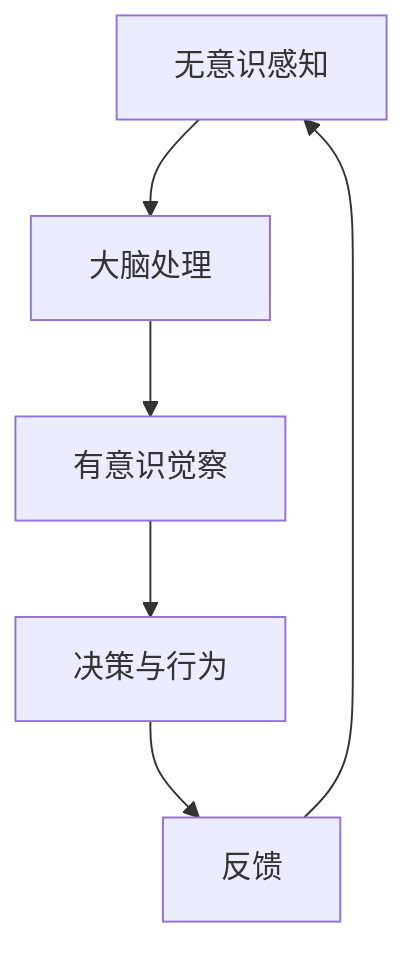

                 

## 《从无意识到有意识：提升自我觉察能力》

### 关键词

- 无意识
- 有意识
- 自我觉察能力
- 提升策略
- 实际应用

### 摘要

本文深入探讨无意识与有意识之间的复杂互动，并聚焦于提升自我觉察能力的重要性。通过解析无意识与有意识的核心概念及其相互关系，本文提出一系列有效的提升策略，包括觉醒练习、意识拓展技巧、情绪管理与认知重构等。同时，通过实际案例展示了自我觉察能力提升在个人成长、职场发展和心理健康等领域的广泛应用。文章旨在为读者提供系统性、实用性的自我觉察能力提升指南。

## 引言与核心概念

### 第1章：引言

在日常生活中，我们常常感受到无意识与有意识的存在。例如，当我们在做一件重复性任务时，可能会陷入“自动驾驶”状态，这时任务完成得非常流畅，但我们对过程本身几乎没有觉察。而当我们面对一个复杂问题时，往往需要投入大量有意识的思考，这个过程则显得更加费力。这种无意识与有意识之间的互动，不仅影响着我们的日常生活，也深刻地影响着我们的自我觉察能力。

### 第2章：核心概念与联系

#### 2.1 无意识与有意识的定义

无意识（Unconscious）：无意识是指那些未被我们直接觉察到的心理活动。这些活动包括但不限于记忆、情感、习惯和潜意识。它们在我们的大脑中默默运行，影响着我们的行为和决策。

有意识（Conscious）：有意识是指我们可以直接感知和思考的心理状态。这种状态下的思考是有目的的、自觉的，并且可以对外部世界进行有意识的反应。

#### 2.2 无意识的作用机制

无意识在大脑中的作用机制非常复杂。一个关键的机制是记忆。我们的记忆不仅包括过去的事件，还包括我们对这些事件的情感反应。这些记忆在大脑的神经网络中形成复杂的连接，影响我们的行为和决策。例如，当我们遇到一个熟悉的面孔时，我们可能会立即识别出这个人，而这一过程往往是无意识的。

#### 2.3 有意识的觉察过程

有意识的觉察过程包括感知、认知处理、决策与行为等多个阶段。首先，我们从外部世界接收信息，这些信息通过感官传递到大脑。大脑对这些信息进行处理，形成感知。然后，我们利用这些感知进行认知处理，做出决策，并采取相应的行为。

#### 2.4 无意识与有意识的相互作用

无意识与有意识之间的相互作用是一个复杂的过程。无意识影响着我们的行为和决策，而我们的有意识思考则可以对这些无意识的影响进行调节。例如，当我们遇到一个挑战时，我们的无意识可能会让我们感到恐惧，而我们的有意识思考可以帮助我们克服这种恐惧，做出合理的决策。

### Mermaid流程图：无意识与有意识的相互作用

通过这个流程图，我们可以看到无意识与有意识之间的相互作用是一个循环的过程。无意识感知到信息，通过大脑处理，传递到有意识，有意识对其进行处理，做出决策，并采取行动，最终形成反馈，再次影响无意识。

## 提升自我觉察能力的方法

### 第3章：自我觉察能力的基础

#### 3.1 自我觉察能力的构成

自我觉察能力由多个部分构成，包括感知能力、认知能力、情感调节能力和行为控制能力。这些能力相互关联，共同决定了我们的自我觉察能力。

#### 3.2 自我觉察能力的评估

评估自我觉察能力可以通过多种方法进行，包括自我报告、行为观察和神经心理学测试等。这些方法可以帮助我们了解自己的自我觉察能力水平，并找到提升的方法。

#### 3.3 自我觉察能力的发展阶段

自我觉察能力的发展阶段可以分为三个阶段：初级阶段、中级阶段和高级阶段。在初级阶段，我们的自我觉察能力较为有限，主要依赖于外部的反馈；在中级阶段，我们开始能够更自主地观察和调节自己的行为；在高级阶段，我们能够深刻地理解自己的内在世界，并能够灵活地应对各种情境。

### 第4章：自我觉察能力的提升策略

#### 4.1 觉醒练习

觉醒练习是一种有效的自我觉察能力提升方法。通过冥想、瑜伽等练习，我们可以提高对内心世界的觉察能力，从而更好地理解自己的情感和行为。

#### 4.2 意识拓展技巧

意识拓展技巧包括深度放松、梦境探索和超越自我等。这些技巧可以帮助我们拓宽意识的边界，提高自我觉察能力。

#### 4.3 呼吸与冥想

呼吸与冥想是提升自我觉察能力的重要方法。通过控制呼吸，我们可以调节自己的情绪，提高专注力，从而更好地觉察自己的内心世界。

#### 4.4 身体觉知

身体觉知是自我觉察能力的重要组成部分。通过关注自己的身体感受，我们可以更好地理解自己的情绪和行为，从而提升自我觉察能力。

### 第5章：情绪管理与自我觉察

#### 5.1 情绪与自我觉察的关系

情绪与自我觉察密切相关。通过提高自我觉察能力，我们可以更好地理解自己的情绪，从而更好地管理情绪。

#### 5.2 情绪的自我觉察能力提升

提升情绪的自我觉察能力可以通过多种方法实现，包括情绪日记、情绪探索和情绪调节技巧等。

#### 5.3 情绪调节技巧

情绪调节技巧包括深呼吸、放松技巧和认知重构等。这些技巧可以帮助我们更好地调节情绪，提高自我觉察能力。

### 第6章：认知重构与自我觉察

#### 6.1 认知重构的概念

认知重构是指通过改变我们对事物的认知，来改变我们的情绪和行为。这是一种有效的自我觉察能力提升方法。

#### 6.2 认知重构的方法

认知重构的方法包括反思、认知解离和认知重塑等。这些方法可以帮助我们更好地理解自己的认知模式，从而提升自我觉察能力。

#### 6.3 认知重构与自我觉察的提升

认知重构与自我觉察能力的提升密切相关。通过认知重构，我们可以更好地理解自己的认知模式，从而提高自我觉察能力。

## 实战与应用

### 第7章：自我觉察能力提升的实际案例

#### 7.1 案例一：通过冥想提升自我觉察能力

案例一介绍了如何通过冥想来提升自我觉察能力。通过系统的冥想练习，参与者显著提高了自我觉察能力，增强了情绪调节能力。

#### 7.2 案例二：情绪管理与自我觉察能力的提升

案例二展示了情绪管理与自我觉察能力提升的结合。通过使用情绪调节技巧，参与者学会了更好地管理自己的情绪，提高了自我觉察能力。

#### 7.3 案例三：认知重构在自我觉察中的应用

案例三探讨了认知重构在自我觉察中的应用。通过认知重构，参与者学会了更灵活地看待问题，提高了自我觉察能力。

### 第8章：自我觉察能力的应用领域

#### 8.1 个人成长

自我觉察能力在个人成长中发挥着重要作用。通过提升自我觉察能力，我们可以更好地理解自己，实现个人成长。

#### 8.2 职场发展

在职场中，自我觉察能力对于职业发展至关重要。通过提升自我觉察能力，我们可以更好地理解自己的工作需求，提高工作效率。

#### 8.3 心理健康

心理健康与自我觉察能力密切相关。提升自我觉察能力，可以帮助我们更好地管理情绪，提高心理健康水平。

#### 8.4 社交互动

在社交互动中，自我觉察能力对于建立良好的人际关系至关重要。通过提升自我觉察能力，我们可以更好地理解他人，提高社交互动的质量。

## 附录

### 附录A：常用自我觉察技巧汇总

- 冥想
- 深呼吸
- 身体觉知
- 情绪日记
- 反思

### 附录B：推荐阅读与资源

- 《自控力》
- 《心理学与生活》
- 《情绪智力》

### 附录C：自我觉察能力提升的常见问题与解答

1. **如何开始自我觉察能力提升？**
   - 从简单的练习开始，如深呼吸和冥想。
2. **提升自我觉察能力需要多长时间？**
   - 需要持续的努力和练习，时间因人而异。

## 总结

本文深入探讨了无意识与有意识的互动，并介绍了提升自我觉察能力的方法和策略。通过觉醒练习、意识拓展技巧、情绪管理与认知重构，我们可以显著提升自我觉察能力。实际案例和应用领域的讨论展示了自我觉察能力提升的广泛影响力。希望本文能为读者提供实用的自我觉察能力提升指南。

### 作者信息

作者：AI天才研究院/AI Genius Institute & 禅与计算机程序设计艺术 /Zen And The Art of Computer Programming

