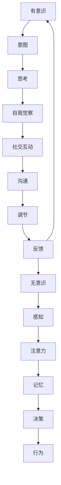
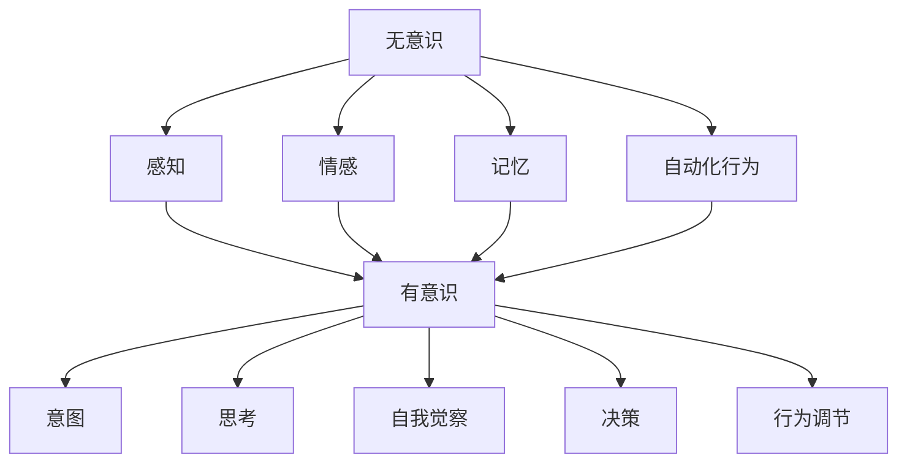
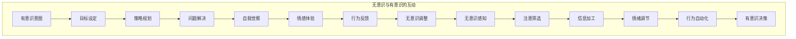

                 

# 《从无意识到有意识：提升自我觉察能力》

## 关键词
- 无意识
- 有意识
- 自我觉察
- 认知心理学
- 认知科学
- 人工智能

## 摘要
本文深入探讨了无意识与有意识之间的关系，并探讨了提升自我觉察能力的方法。通过心理学、认知科学和人工智能领域的理论，结合Python代码和数学公式，本文提供了对无意识与有意识的定义、联系以及提升自我觉察能力的策略的详细分析。文章旨在为读者提供一套实用的方法，以增强他们在日常生活中的自我觉察能力，从而提高个人的认知水平和决策能力。

## 目录大纲

### 第一部分：无意识与有意识概述

#### 第1章：无意识与有意识的定义与联系

1.1 无意识的定义与作用

1.2 有意识的定义与功能

1.3 无意识与有意识的联系

2.1 无意识与有意识的Mermaid流程图

2.2 无意识与有意识的核心概念实体关系

### 第二部分：提升自我觉察能力的方法

#### 第3章：自我觉察能力的核心概念

3.1 自我觉察能力的定义

3.2 自我觉察能力的重要性

3.3 自我觉察能力的发展阶段

#### 第4章：认识无意识

4.1 无意识的来源与表现

4.2 深入理解无意识

#### 第5章：发展有意识

5.1 有意识的培养策略

5.2 有意识与无意识的平衡

5.3 实践有意识的技巧

#### 第6章：自我觉察能力的提升实践

6.1 自我觉察能力的日常练习

6.2 自我觉察能力在工作中的应用

6.3 自我觉察能力的评估与反馈

#### 第7章：结论与未来展望

7.1 结论

7.2 未来展望

### 附录

附录A：相关研究文献与资源

附录B：自我觉察能力提升工具推荐

## 第一部分：无意识与有意识概述

### 第1章：无意识与有意识的定义与联系

#### 1.1 无意识的定义与作用

无意识是心理学中的一个重要概念，它指的是那些没有直接意识到的信息、感觉和思维活动。这些活动是在无意识层面进行的，但它们对我们的行为和决策有着深远的影响。例如，情绪调节、习惯形成和创造性思维等过程大多发生在无意识层面。

无意识的作用主要体现在以下几个方面：

1. **基础认知功能**：无意识参与了我们的感知、记忆和注意力等基础认知功能。例如，当我们听到一个声音时，我们可能会立即知道这是什么声音，而无需有意识地思考。

2. **决策制定**：无意识在决策制定中起着重要作用。研究表明，我们的大多数决策都是无意识做出的，这些决策往往受到我们的价值观、经验和文化背景的影响。

3. **行为控制**：无意识还控制着我们的许多行为，例如走路、开车等日常活动。这些行为经过长期的练习后变得自动化，我们无需有意识地控制。

#### 1.2 有意识的定义与功能

有意识是指我们能够直接感知和思考的心理状态。它包括我们的意愿、意图、感知和反思等。有意识的功能主要包括：

1. **高级认知功能**：有意识参与了更高级的认知功能，如思考、推理、规划和解决问题。这些功能需要我们有意识地集中注意力，进行深入的思考和决策。

2. **自我觉察**：有意识使我们能够进行自我觉察，即意识到自己的思想、情感和行为。这种自我觉察有助于我们更好地理解自己，并做出更合理的决策。

3. **社交互动**：有意识使我们能够与他人进行有效的社交互动。通过有意识的沟通和表达，我们能够更好地理解他人的意图和需求，从而建立良好的人际关系。

#### 1.3 无意识与有意识的联系

无意识和有意识并不是完全分离的，它们之间存在着紧密的联系。以下是一些无意识与有意识之间的互动方式：

1. **无意识到有意识**：有时，无意识的信息会转化为有意识的经验。例如，当我们遇到一个熟悉的情境时，我们可能会突然有意识地意识到某种感觉或记忆。

2. **有意识到无意识**：有意识的决策和行动会逐渐转化为无意识的习惯。例如，我们可能会在多次重复某种行为后，不再有意识地思考如何做，而是自动化地进行。

3. **相互调节**：无意识和有意识之间存在着相互调节的关系。例如，当我们处于压力或焦虑状态下时，我们的有意识思维可能会受到无意识情绪的影响。

#### Mermaid流程图：无意识与有意识的互动

#### 无意识与有意识的核心概念实体关系

在心理学和认知科学中，无意识和有意识被视为两个核心的概念实体。它们之间的关系可以视为动态的、相互影响的。无意识提供了基础的信息处理和认知功能，而有意识则负责高级的认知任务和自我调节。以下是一个简化的Mermaid流程图，展示了无意识和有意识之间的关系：

在接下来的章节中，我们将进一步探讨如何通过提升自我觉察能力来更好地理解无意识和有意识之间的关系，并提高个人的认知水平和生活质量。

### 第2章：无意识与有意识的关系框架

#### 2.1 无意识与有意识的Mermaid流程图

为了更直观地理解无意识与有意识之间的关系，我们可以使用Mermaid流程图来描述它们之间的动态互动。以下是一个简化的Mermaid流程图，展示了无意识和有意识之间的相互作用：

在这个流程图中，无意识和有意识之间通过感知、信息加工、情绪调节、行为自动化、决策等多个环节进行互动。无意识感知到外部信息后，通过注意筛选和信息加工，将信息传递到有意识的意图和决策过程中。有意识的意图和决策又会影响行为反馈和情绪体验，最终影响无意识的调整。

#### 2.2 无意识与有意识的核心概念实体关系

在心理学和认知科学中，无意识和有意识被视为两个核心的概念实体。它们之间的关系可以视为动态的、相互影响的。以下是它们之间的核心概念实体关系：

1. **感知与注意**：
   - **无意识感知**：无意识首先负责感知外部世界的信息，如声音、光线、气味等。这些信息在无意识层面上进行处理，并不需要个体有意识的干预。
   - **有意识注意**：有意识注意是个体在特定情境下选择关注某些信息而忽略其他信息的能力。这种选择性的关注使得个体能够有目的地处理信息，并做出相应的决策。

2. **信息加工**：
   - **无意识信息加工**：无意识信息加工是指个体在无意识状态下对信息进行的处理。这种加工过程是自动化的，不需要个体有意识的思考。
   - **有意识信息加工**：有意识信息加工是指个体在意识到信息的情况下进行的加工过程。这种加工过程需要个体的有意注意力，涉及到更高级的认知功能，如推理、判断和计划。

3. **情绪调节**：
   - **无意识情绪调节**：无意识情绪调节是指个体在无意识层面上对情绪进行调节。这种调节过程是自动化的，能够快速响应外界刺激。
   - **有意识情绪调节**：有意识情绪调节是指个体在意识到情绪的情况下，通过有意识的思考和行为来调节情绪。这种调节过程更加复杂，需要个体主动地控制和改变情绪状态。

4. **行为自动化**：
   - **无意识行为自动化**：无意识行为自动化是指个体在无意识状态下执行的一系列行为，如走路、开车等。这些行为经过长期的练习后变得自动化，不需要个体有意识的干预。
   - **有意识行为决策**：有意识行为决策是指个体在有意识状态下对行为进行选择和决策的过程。这种决策过程涉及到个体对目标和结果的思考，需要个体有意识地考虑各种可能性。

5. **自我觉察与反思**：
   - **无意识自我觉察**：无意识自我觉察是指个体在无意识层面上对自己的感知和行为有所意识。这种自我觉察是自动化的，不需要个体有意识的努力。
   - **有意识自我觉察**：有意识自我觉察是指个体在意识到自己的感知和行为时，能够进行自我反思和评估。这种自我觉察需要个体有意识地关注自己的内在体验和行为表现。

通过上述核心概念实体之间的关系，我们可以看到无意识和有意识之间并不是完全分离的，而是通过多种渠道相互影响和互动。这种互动关系不仅影响个体的认知和行为，还对其心理健康和生活质量产生深远的影响。

在下一章中，我们将进一步探讨如何通过提升自我觉察能力，更好地理解和调节无意识与有意识之间的关系，从而提高个体的认知水平和生活质量。

### 第二部分：提升自我觉察能力的方法

#### 第3章：自我觉察能力的核心概念

#### 3.1 自我觉察能力的定义

自我觉察能力是指个体对自己内在心理状态和外在行为的感知、理解和反思的能力。这种能力包括对自身情感、思想、动机和行为模式的觉察，以及对自己与环境之间互动的觉察。自我觉察能力是认知科学和心理发展中一个重要的组成部分，对个体的心理健康、人际关系和社会功能具有重要影响。

自我觉察能力可以被分为三个层次：

1. **初级自我觉察能力**：这是最基础的自我觉察能力，涉及对当前情感状态和身体感受的简单觉察。例如，当个体感受到愤怒或焦虑时，能够识别并意识到这些情绪的存在。

2. **中级自我觉察能力**：这一层次的自我觉察能力涉及到对自身心理过程的更深入理解。个体能够分析情绪产生的原因，理解自身行为背后的动机，并意识到心理防御机制的存在。

3. **高级自我觉察能力**：这是最高层次的自我觉察能力，涉及到自我反思和元认知。个体能够对自己的思维过程进行反思，评估自身的认知偏差，并调整行为策略以适应新的情境。

#### 3.2 自我觉察能力的重要性

自我觉察能力的重要性体现在以下几个方面：

1. **心理健康**：自我觉察能力有助于个体识别和处理内心的冲突和压力，从而促进心理健康。通过自我觉察，个体能够更好地理解自己的情绪和行为，避免情绪障碍和心理问题。

2. **人际关系**：自我觉察能力有助于个体在人际交往中更好地理解和沟通他人，建立积极的人际关系。通过觉察自己的行为对他人的影响，个体能够调整自己的行为以适应社交情境。

3. **自我成长**：自我觉察能力是个人成长和发展的关键。通过不断觉察和反思，个体能够发现自己的优点和不足，从而制定合适的发展计划，实现自我提升。

4. **决策能力**：自我觉察能力有助于个体在决策过程中更全面地考虑各种因素，减少冲动决策和认知偏差，从而提高决策的质量。

#### 3.3 自我觉察能力的发展阶段

自我觉察能力的发展是一个逐步深化的过程，可以分为以下几个阶段：

1. **初始阶段**：在这一阶段，个体开始意识到自己内心和外部的某些方面。他们可能能够识别基本的情绪，如快乐、悲伤和愤怒。

2. **成长阶段**：随着个体成长，他们开始能够更细致地觉察自己的情绪和心理状态，并尝试理解和分析这些情绪的来源。

3. **成熟阶段**：在这一阶段，个体的自我觉察能力达到一个较高的水平。他们能够深刻地理解自己的情绪和心理状态，并能够灵活地调整自己的行为。

4. **高级阶段**：在这个最高阶段，个体的自我觉察能力不仅限于对自己内部世界的理解，还能够进行元认知，即对自己认知过程的认知。他们能够反思自己的思维模式，识别并修正认知偏差。

在接下来的章节中，我们将探讨如何更深入地认识无意识，并通过具体的策略和实践来提升自我觉察能力。这将有助于我们更好地理解自己和周围的世界，从而提高生活质量和工作效率。

### 第4章：认识无意识

#### 4.1 无意识的来源与表现

无意识的来源多样且复杂，它们来自个体内部的生理过程、习惯性的行为模式以及潜藏的心理冲突。以下是几种常见的无意识来源及其表现：

1. **生理过程**：
   - **本能反应**：无意识的本能反应是指个体在面对某些刺激时，自动产生的生理反应。例如，打喷嚏、眨眼或身体的缩 reflex。
   - **生理需求**：个体的生理需求，如饥饿、口渴和疲劳，也是无意识的来源。当身体处于生理需求状态时，个体可能会表现出注意力不集中、情绪波动等行为。

2. **习惯性行为模式**：
   - **自动化动作**：通过长期的练习，一些行为会变得自动化。例如，开车、打字、刷牙等，个体在执行这些行为时，往往不需要有意识的思考。
   - **习惯性思维**：习惯性思维是指个体在特定情境下，自然而然地产生的一些想法。例如，一些人可能会在早上起床时，无意识地思考当天的工作安排。

3. **潜藏的心理冲突**：
   - **情感压抑**：无意识中包含个体压抑的情感和冲突。例如，一个人可能会在无意识中对自己某方面的表现感到不满，但却无法意识到这种情感。
   - **潜意识动机**：一些行为和决策可能是受潜意识动机驱使的，这些动机往往与个体的价值观、信念和经历相关。

#### 无意识的表现

无意识的表现形式多种多样，以下是一些常见的例子：

1. **无意识的直觉**：
   - **直觉决策**：个体在面临决策时，可能会依靠直觉做出选择，而不是经过有意识的思考。例如，在某些紧急情况下，司机可能会依赖直觉来做出反应。
   - **预知能力**：有些人声称具有预知能力，即能够预见未来的某些事件。尽管这些现象的科学依据尚未得到广泛认可，但它们展示了无意识感知的可能性。

2. **无意识的习惯**：
   - **重复行为**：个体可能会在无意识状态下重复某些行为，例如频繁地检查手机或反复思考某个问题。
   - **无意识决策**：个体在日常生活中的许多决策都是无意识的。例如，选择某条路线回家或购买某种产品。

3. **无意识的情绪反应**：
   - **情绪感染**：个体可能会在无意识中受到他人情绪的影响，例如，当看到他人悲伤时，自己也会感到悲伤。
   - **情绪记忆**：无意识中的情绪记忆可能影响个体的行为和决策。例如，一个人在某个情境中经历过的负面情绪，可能会在未来的相似情境中引起焦虑或逃避行为。

#### 深入理解无意识

要深入理解无意识，我们需要采用多种方法和技术，包括心理学实验、认知神经科学的研究以及自我觉察练习。以下是一些常用的方法：

1. **心理学实验**：
   - **无意识认知任务**：通过设计特定的认知任务，研究者可以探索个体在无意识状态下如何处理信息。例如，一些实验要求参与者在完成一个任务的同时，进行另一个无意识的任务，从而观察其对认知过程的影响。
   - **心理生理测量**：使用心理生理测量技术，如脑电图（EEG）和功能性磁共振成像（fMRI），研究者可以观察大脑在无意识状态下的活动模式。

2. **认知神经科学研究**：
   - **脑成像技术**：通过脑成像技术，研究者可以观察大脑在处理无意识信息时的活动区域。这些研究揭示了无意识信息处理与特定大脑区域之间的关联。
   - **脑损伤研究**：通过研究脑损伤患者的认知和行为变化，研究者可以更好地理解无意识功能在大脑中的作用。

3. **自我觉察练习**：
   - **冥想**：冥想是一种常用的自我觉察练习，它通过引导个体关注内在体验，提高对无意识过程的觉察。一些研究表明，长期冥想能够增强个体的自我觉察能力。
   - **日记记录**：通过记录日常生活中的情感和行为，个体可以更好地了解自己的心理状态和决策过程，从而提升自我觉察能力。

通过这些方法，我们可以更深入地了解无意识的来源和表现形式，并探索如何通过自我觉察来提升自我觉察能力。在下一章中，我们将探讨如何发展有意识，以更好地平衡和调节无意识与有意识之间的关系。

#### 4.2 深入理解无意识

为了深入理解无意识，我们需要从心理学、认知科学和神经科学的角度进行探讨，并结合具体实例和实验来揭示无意识的作用和机制。

##### 心理学视角

在心理学中，无意识通常被描述为一个深藏的、未被直接意识到的心理过程。心理学家弗洛伊德（Sigmund Freud）提出的无意识概念强调，许多情绪和行为的动机都源于无意识。他认为，无意识中包含了被压抑的欲望、冲突和记忆。这些内容虽然不被个体直接意识到，但它们对个体的行为和情绪有着深远的影响。

1. **压抑与防御机制**：无意识的一个显著特征是压抑。当个体无法接受某些情绪或记忆时，它们会被压抑到无意识中。为了防止这些压抑的内容重新进入意识，个体会使用防御机制，如否认、投射和合理化等。

2. **梦境分析**：弗洛伊德认为，梦境是通向无意识世界的大门。通过分析梦境，个体可以揭示自己无意识中的欲望和冲突。例如，一个常见的梦境是关于掉入悬崖或迷失方向，这可能反映了个体在现实生活中对失去控制或迷失方向的恐惧。

##### 认知科学视角

认知科学家则更关注无意识在信息处理和决策中的作用。他们认为，许多认知过程都是在无意识层面进行的，并且这些过程对个体的行为有着重要影响。

1. **无意识知觉**：研究表明，个体在无意识中能够快速识别和分类视觉和听觉信息。例如，当我们在听到一个熟悉的旋律时，我们可能会立即意识到这是某个歌曲，而无需有意识的思考。这种无意识知觉是我们在日常生活中进行高效决策的基础。

2. **启发式决策**：许多日常决策是在无意识状态下做出的，这些决策依赖于启发式策略，如经验、直觉和快速判断。这些启发式策略虽然有时可能导致错误决策，但它们在大多数情况下是有效的，因为它们节省了认知资源。

##### 神经科学视角

神经科学通过脑成像技术揭示了无意识信息处理的大脑机制。研究表明，大脑中的某些区域在无意识信息处理中起着关键作用，如顶叶和颞叶。

1. **默认网络**：默认网络是大脑中一组相互连接的神经网络，它们在无意识状态下活动，涉及自我反思、社会认知和内省。当个体处于休息状态或进行简单任务时，默认网络会被激活。

2. **边缘系统**：边缘系统包括杏仁核和海马体，它们在情绪调节和记忆形成中起着重要作用。研究表明，这些区域在处理无意识情绪信息时被激活。

##### 实例与实验

为了更好地理解无意识，我们可以通过一些具体的实验和实例来探讨无意识的作用。

1. **无意识广告效应**：在营销学中，无意识广告效应是一个重要的研究课题。研究者发现，即使个体没有意识到广告内容，广告中的视觉和听觉元素仍然能够影响他们的购买决策。例如，一个实验显示，当播放一段包含特定产品的广告后，参与者在后续的购物中更可能购买该产品，尽管他们声称自己没有注意到广告。

2. **盲视现象**：盲视是一种特殊的现象，指个体在视觉上无法察觉某些信息，但仍然能够对这些信息做出反应。一个著名的案例是，一名女性在一次车祸中失去了右侧视野，但她并没有意识到这一点，直到研究者向她展示了一些实验结果。尽管她无法看到右侧的图像，但她能够准确地指出图像中物体的位置。

##### 结论

通过心理学、认知科学和神经科学的研究，我们可以更深入地理解无意识的作用和机制。无意识不仅影响着我们的情绪和行为，还在信息处理和决策中发挥着关键作用。通过自我觉察练习和科学方法，我们可以更好地认识无意识，并提升自我觉察能力，从而提高生活质量和工作效率。

在下一章中，我们将探讨如何通过培养有意识，平衡和调节无意识与有意识之间的关系，从而进一步提升自我觉察能力。

#### 5.1 有意识的培养策略

发展有意识是一个持续的过程，需要通过系统的策略和实践来逐步提升。以下是一些有效的培养有意识的策略：

##### 1. 冥想

冥想是一种古老而有效的培养有意识的方法。通过冥想，个体可以学会专注于当下的体验，减少对过去和未来的过度思考。以下是一种简单的冥想练习：

1. **准备工作**：找一个安静的地方，保持坐姿或躺下，确保身体舒适。
2. **专注呼吸**：闭上眼睛，专注于呼吸，感受每次吸气时的胸腔扩张和每次呼气时的胸腔收缩。
3. **标记分散**：当你发现自己思维分散时，轻轻将注意力拉回到呼吸上，标记这一分散的过程，然后继续专注于呼吸。
4. **结束冥想**：在呼吸几次后，慢慢打开眼睛，感受周围的环境，体会内心的平静。

##### 2. 目标设定

明确的目标有助于培养有意识。设定具体、可行的目标，并制定实现目标的步骤。以下是一个目标设定的步骤：

1. **确定目标**：设定一个清晰、具体的目标，例如“每天早上锻炼30分钟”或“阅读两本书”。
2. **分解目标**：将大目标分解为小步骤，例如将“每天锻炼30分钟”分解为“每天早上起床后立即锻炼10分钟”。
3. **定期检查**：定期检查自己的进度，并根据实际情况调整计划。
4. **奖励自己**：实现每个小步骤后，给予自己适当的奖励，以增强动力。

##### 3. 反思日志

反思日志是一种记录个人经验和思考的方法，有助于培养有意识。以下是一个简单的反思日志练习：

1. **每日反思**：每天晚上花一些时间写下当天的重要经历、感受和思考。
2. **具体描述**：尽量用具体的事例和感受来描述，避免抽象的陈述。
3. **自我觉察**：反思自己的行为和决策，分析它们背后的动机和影响。
4. **持续改进**：根据反思结果，制定改进计划，并在后续实践中加以应用。

##### 4. 主动学习

主动学习是一种比被动学习更有利于培养有意识的方法。以下是一些主动学习的策略：

1. **提问与探索**：在学习过程中，主动提问并寻找答案，而不是仅仅接受信息。
2. **讨论与交流**：与他人讨论学习内容，分享自己的见解和疑问。
3. **应用与实践**：将所学知识应用到实际情境中，通过实践加深理解。
4. **总结与反思**：在学习结束后，总结所学内容，并反思学习过程中的得失。

##### 5. 有意识练习

通过日常生活中的小练习，可以逐步培养有意识。以下是一些具体的练习方法：

1. **专注练习**：每天花一些时间进行专注练习，例如专注于某一声音、视觉或触觉刺激。
2. **情绪觉察**：时刻留意自己的情绪变化，并尝试理解和分析这些情绪的来源。
3. **行为反思**：在日常行为中，反思自己的行为动机和影响，并尝试调整不合理的行为。
4. **环境觉知**：在日常生活中，有意识地观察周围的环境，感受自然的美和生活的细节。

通过上述策略和实践，我们可以逐步提升有意识，从而更好地理解自己和周围的世界，提高生活质量和工作效率。

#### 5.2 有意识与无意识的平衡

在日常生活中，平衡有意识与无意识是提高生活质量和工作效率的关键。以下是一些方法，帮助我们在两种状态之间找到合适的平衡：

##### 1. 确定优先事项

为了有效地利用时间和精力，我们需要明确自己的优先事项。以下是一个简单的步骤：

1. **目标设定**：首先，明确你的长期和短期目标。
2. **任务分类**：将任务按照优先级和重要性进行分类，例如“必须完成”、“需要完成”和“可延迟”。
3. **时间规划**：为每个任务分配具体的时间，并设定明确的截止日期。
4. **优先级调整**：定期检查任务进度，根据实际情况调整优先级。

##### 2. 学会放松

在忙碌的日常生活中，放松是非常重要的。以下是一些放松技巧：

1. **呼吸练习**：深呼吸可以帮助你放松身体和心灵。可以尝试进行5-10分钟的深呼吸练习，专注于呼吸的节奏。
2. **冥想**：冥想是一种有效的放松方式，通过冥想，你可以减轻压力，提高注意力。可以尝试每天花5-10分钟进行冥想。
3. **音乐放松**：听一些轻松的音乐可以帮助你放松。可以选择一些舒缓的乐曲，让音乐伴随你进入放松状态。

##### 3. 管理情绪

情绪管理是保持有意识与无意识平衡的重要环节。以下是一些情绪管理技巧：

1. **情绪觉察**：时刻留意自己的情绪变化，并尝试理解和分析情绪的来源。
2. **情绪表达**：学会适当地表达自己的情绪，避免情绪压抑。可以选择与朋友或家人分享你的感受，或者通过写作和绘画等方式表达情绪。
3. **情绪调节**：通过呼吸练习、冥想和运动等方式，帮助自己调节情绪，减轻压力。

##### 4. 学会专注

专注是提高工作效率的关键。以下是一些专注技巧：

1. **单一任务**：一次专注于一个任务，避免多任务处理。研究表明，多任务处理会降低工作效率和专注度。
2. **设定目标**：为每个任务设定具体的目标，使你能够明确任务的方向和进度。
3. **减少干扰**：在一个安静的环境中工作，避免手机、电子邮件和其他干扰。如果你需要使用电脑，可以使用一些专注软件，如Forest或Pomodoro Timer。
4. **定期休息**：长时间工作后，适当休息可以帮助你恢复精力。每工作45-60分钟后，休息5-10分钟，进行一些简单的拉伸运动或散步。

通过上述方法，我们可以在有意识和无意识之间找到合适的平衡，提高生活和工作质量。在下一章中，我们将探讨如何通过具体的实践方法来提升自我觉察能力。

### 5.3 实践有意识的技巧

为了提升自我觉察能力，我们需要将有意识的培养策略融入日常生活。以下是一些具体的实践技巧：

#### 1. 有意识的呼吸练习

呼吸是连接有意识和无意识的重要桥梁。通过有意识的呼吸练习，我们可以更好地觉察自己的内在状态。以下是一个简单的呼吸练习步骤：

1. **准备工作**：找一个安静舒适的地方，保持坐姿或躺下，确保身体放松。
2. **深呼吸**：吸气时，让腹部逐渐膨胀，感受肺部扩张；呼气时，让腹部逐渐收缩，感受肺部收缩。
3. **专注呼吸**：专注于每一次的呼吸，感受空气流入和流出的温度、湿度和流速。
4. **标记分散**：当你发现注意力分散时，轻轻将注意力拉回到呼吸上，并标记这一分散过程。
5. **重复练习**：每天练习5-10分钟，逐步增加时间。

#### 2. 有意识的饮食体验

饮食不仅仅是填饱肚子，更是一种体验和觉察。通过有意识的饮食，我们可以更好地理解自己的身体需求和情绪状态。以下是一个简单的饮食体验步骤：

1. **用餐准备**：在用餐前，花几分钟时间放松心情，专注于即将到来的食物。
2. **细嚼慢咽**：在进食时，慢慢咀嚼食物，感受食物在口中的味道和口感。
3. **觉察感受**：在吃饭过程中，留意自己的食欲、满足感、饥饿感和情绪状态。
4. **感谢食物**：在用餐结束后，感谢食物带来的营养和愉悦。
5. **记录体验**：每天记录一次用餐体验，包括食物的种类、口感、情绪反应等。

#### 3. 有意识的日常活动

在日常活动中，我们可以通过有意识的行为来提升自我觉察能力。以下是一些具体的日常活动：

1. **晨间冥想**：每天早晨花5-10分钟进行冥想，专注于当下的感觉和情绪。
2. **专注工作**：在工作时，将手机静音，专注于当前的任务，避免多任务处理。
3. **观察自然**：每周花一些时间观察自然，感受大自然的美和宁静。
4. **社交互动**：在与他人交流时，专注于对方的发言，避免心不在焉。
5. **记录思考**：随时记录自己的想法和感受，这有助于加深自我觉察。

#### 4. 有意识的反思

反思是提升自我觉察能力的关键步骤。通过反思，我们可以更好地理解自己的行为和情绪。以下是一个简单的反思步骤：

1. **回顾一天**：在每天结束前，回顾当天的重要事件和情绪反应。
2. **分析行为**：分析自己的行为，思考这些行为背后的动机和影响。
3. **识别情绪**：识别自己在不同情境下的情绪反应，并尝试理解情绪的来源。
4. **制定计划**：根据反思结果，制定改进计划，并在后续实践中加以应用。
5. **记录反思**：每天记录一次反思过程，包括反思的内容和感受。

通过这些实践技巧，我们可以在日常生活中逐步提升自我觉察能力，从而更好地理解自己和周围的世界。在下一章中，我们将探讨自我觉察能力在工作中的应用。

### 6.1 自我觉察能力的日常练习

在日常生活中，通过一系列简单的练习，我们可以逐步提升自我觉察能力。以下是一些实用的日常练习方法：

#### 1. 觉察情绪

情绪是我们内心体验的一个重要方面，通过觉察情绪，我们可以更好地理解自己的内心世界。以下是一个简单的情绪觉察练习：

- **步骤**：每天花几分钟时间，静坐或静立，专注于自己的情绪。尝试识别当前的情绪状态，如平静、焦虑、愤怒或悲伤。不必做出任何评价，只是静静地观察和体验。
- **效果**：通过定期练习，你将能够更敏锐地觉察自己的情绪变化，从而更好地管理情绪，避免情绪波动对生活的负面影响。

#### 2. 觉察身体感受

身体感受也是自我觉察能力的重要部分。通过觉察身体感受，我们可以更好地了解自己的身体状况和心理需求。以下是一个简单的身体感受练习：

- **步骤**：每天花几分钟时间，专注于身体的各个部位，从脚开始，逐渐向上移动到头部。尝试感受每个部位的紧张、放松或不适感。
- **效果**：通过定期练习，你将能够更好地了解自己的身体感受，从而采取适当的措施，如进行适当的锻炼、调整坐姿或休息，以保持身体健康。

#### 3. 觉察呼吸

呼吸是我们与外界联系的重要途径，通过觉察呼吸，我们可以更好地调节身心状态。以下是一个简单的呼吸觉察练习：

- **步骤**：每天花几分钟时间，专注于呼吸。尝试深呼吸，感受空气流入和流出的过程，专注于呼吸的节奏和感受。
- **效果**：通过定期练习，你将能够更好地掌握自己的呼吸节奏，从而在紧张或焦虑时，通过呼吸调节情绪和身心状态。

#### 4. 觉察日常行为

我们的日常行为也反映了我们的内在状态。通过觉察日常行为，我们可以更好地了解自己的行为模式和动机。以下是一个简单的日常行为觉察练习：

- **步骤**：在日常生活中，时刻留意自己的行为和决策。例如，在购物时，观察自己为什么会选择某种商品；在工作时，观察自己在不同任务中的行为模式。
- **效果**：通过定期练习，你将能够更好地理解自己的行为动机和模式，从而做出更合理和明智的决策。

#### 5. 觉察人际关系

人际关系是我们生活中不可或缺的一部分，通过觉察人际关系，我们可以更好地理解自己与他人之间的关系。以下是一个简单的人际关系觉察练习：

- **步骤**：在与他人交往时，时刻留意自己的情绪反应和言行。尝试理解对方的意图和需求，并反思自己在交往中的表现。
- **效果**：通过定期练习，你将能够更好地处理人际关系，建立更加和谐和积极的人际关系。

通过这些日常练习，我们可以逐步提升自我觉察能力，从而更好地理解自己和周围的世界。在下一章中，我们将探讨自我觉察能力在工作中的应用。

### 6.2 自我觉察能力在工作中的应用

在工作环境中，提升自我觉察能力能够显著提高工作效率和职业发展。以下是一些具体的方法和实例，说明如何将自我觉察能力应用于工作中：

#### 1. 自我觉察能力提升工作效率

通过自我觉察，我们可以更好地管理时间、任务和资源，从而提升工作效率。以下是一个具体案例：

- **案例**：小王是一名项目经理，他发现自己经常因为任务繁杂而感到焦虑。为了提升工作效率，他开始记录每日的工作任务和时间消耗。通过自我觉察能力，他意识到自己在处理电子邮件上花费了过多时间，而忽视了更重要的项目任务。
- **解决方案**：小王制定了以下策略：
  - **时间管理**：每天早上规划当天的工作任务，并设定优先级。
  - **电子邮件管理**：设定特定时间段处理电子邮件，避免频繁打扰。
  - **任务分解**：将大任务分解为小步骤，逐步完成，减少任务压力。
  - **定期反思**：每天工作结束后，反思当日的工作表现，识别改进点。

#### 2. 自我觉察能力改善团队合作

团队合作中，自我觉察能力有助于我们更好地理解同事的需求和情感，从而提升团队效率和合作效果。以下是一个具体案例：

- **案例**：小张是一名软件工程师，他发现自己与团队成员之间的沟通效率不高，导致项目进度延误。
- **解决方案**：小张采取了以下措施：
  - **有效沟通**：定期与团队成员进行一对一沟通，了解每个人的工作进展和困难。
  - **情感觉察**：在会议和讨论中，关注团队成员的情绪反应，避免争执和误解。
  - **团队合作**：鼓励团队成员提出建议和意见，共同解决问题。
  - **定期反馈**：项目结束后，与团队成员一起回顾项目过程，总结经验教训，提出改进建议。

#### 3. 自我觉察能力促进职业发展

通过自我觉察能力，我们可以更好地了解自己的优势和不足，从而制定有针对性的职业发展计划。以下是一个具体案例：

- **案例**：小李是一名市场营销经理，他意识到自己在数据分析方面存在不足，这限制了他的职业发展。
- **解决方案**：小李制定了以下职业发展计划：
  - **学习提升**：参加数据分析相关的培训和课程，提升技能。
  - **自我评估**：定期进行自我评估，识别自己的优势和不足。
  - **目标设定**：设定明确的职业目标，制定实现目标的步骤。
  - **持续反馈**：向领导和同事请教意见，获取反馈，不断改进。

通过这些方法和实例，我们可以看到，提升自我觉察能力不仅在个人层面有助于提升生活质量和职业发展，在工作环境中也能显著提高工作效率和团队合作效果。在下一章中，我们将探讨如何评估和反馈自我觉察能力。

### 6.3 自我觉察能力的评估与反馈

为了有效地提升自我觉察能力，我们需要对其进行全面评估和持续反馈。以下是一些具体的步骤和方法：

#### 1. 自我评估问卷

自我评估问卷是一种简单有效的评估工具，可以帮助我们了解自己的自我觉察能力。以下是一个简单的自我评估问卷模板：

- **评估内容**：
  - **情绪觉察能力**：如情绪识别、情绪管理和情绪调节。
  - **行为觉察能力**：如行为自控、行为分析和行为调整。
  - **认知觉察能力**：如思考过程、决策能力和问题解决能力。
  - **社交觉察能力**：如人际关系处理、社交技能和沟通能力。

- **评估方法**：
  - **填写问卷**：根据每个问题的描述，选择最符合自己情况的选项。
  - **定量分析**：对问卷结果进行定量分析，了解自己的优势和不足。
  - **定性反馈**：根据问卷结果，进行定性反馈，讨论具体改进点。

#### 2. 记录日志

记录日志是自我觉察能力评估的重要手段。通过记录日常生活中的事件、感受和思考，我们可以更清晰地了解自己的心理和行为模式。以下是一个简单的日志记录模板：

- **日志内容**：
  - **日期和时间**：记录日志的日期和时间。
  - **事件描述**：描述当天的重要事件，包括工作、学习、社交等方面。
  - **情绪体验**：记录当时的情绪体验，如焦虑、开心、愤怒等。
  - **思考与反思**：反思事件背后的原因和影响，识别自己的行为模式。

- **记录方法**：
  - **定期回顾**：每周或每月回顾日志，总结自己的情绪变化、行为调整和思考过程。
  - **分析与总结**：根据日志记录，分析自己的自我觉察能力，找出改进点。
  - **制定计划**：根据分析结果，制定改进计划，并在后续实践中加以应用。

#### 3. 他评反馈

除了自我评估，他人的反馈也是提升自我觉察能力的重要手段。以下是一些获取他人反馈的方法：

- **同事反馈**：定期与同事交流，听取他们对你的工作表现和人际关系的看法。
- **导师反馈**：向导师或领导请教意见，了解他们在你职业发展中的观察和建议。
- **360度评估**：参与360度评估，获取来自不同角度的反馈，包括同事、下属和客户的意见。

#### 4. 持续反馈与改进

自我觉察能力的提升是一个持续的过程，需要不断地评估和反馈。以下是一些建议：

- **定期评估**：每隔一段时间，进行自我评估和记录日志，检查自我觉察能力的发展情况。
- **反馈应用**：根据反馈结果，制定具体的改进计划，并在实践中应用。
- **反思与总结**：在每次反馈和应用后，进行反思和总结，了解改进的效果和不足。
- **持续学习**：参加相关的培训课程、阅读书籍和文章，不断提升自我觉察能力和知识水平。

通过上述评估与反馈方法，我们可以更全面地了解自己的自我觉察能力，从而有针对性地进行改进，提升自我觉察能力，实现个人和职业发展的目标。

### 7.1 结论

通过本文的探讨，我们深入理解了无意识与有意识之间的关系，并学习了如何通过提升自我觉察能力来更好地理解和管理这两种心理状态。自我觉察能力不仅有助于我们提高生活质量和职业发展，还能增强我们的心理健康和人际交往能力。

无意识是我们日常行为和决策的重要基础，它影响着我们的情绪、习惯和创造性思维。有意识则帮助我们进行高级的认知活动，如思考、推理和自我觉察。通过理解这两种状态之间的动态互动，我们可以更好地平衡它们，提高自我觉察能力。

在提升自我觉察能力的过程中，我们介绍了多种实践方法，包括有意识的呼吸练习、日常行为觉察、情绪觉察能力和工作中的应用。这些方法不仅简单易行，而且能够有效地帮助我们提高自我觉察能力，从而更好地理解自己，提升生活质量。

通过自我评估、日志记录和他人反馈，我们可以持续评估和改进自我觉察能力。这种持续性的努力不仅能够帮助我们实现个人和职业发展目标，还能提升我们的整体认知水平和决策能力。

总之，提升自我觉察能力是一个持续的过程，需要我们在日常生活中不断实践和反思。通过本文的指导，我们相信读者能够更好地理解无意识与有意识的关系，并掌握提升自我觉察能力的方法，从而在个人和职业生活中取得更大的成功。

### 7.2 未来展望

在未来，提升自我觉察能力将继续成为心理学、认知科学和人工智能领域的研究热点。随着科技的进步和认知神经科学的不断发展，我们将能够更深入地理解无意识与有意识之间的复杂关系，开发出更有效的提升自我觉察能力的方法和工具。

一方面，人工智能技术的发展将为自我觉察能力提升带来新的机遇。通过机器学习和数据分析，我们可以从海量数据中提取出有价值的信息，帮助个体更好地理解自己的情绪和行为模式。例如，智能穿戴设备和智能手机应用程序可以实时监测个体的生理和心理状态，提供个性化的反馈和指导。

另一方面，认知神经科学的研究将帮助我们更深入地理解无意识与有意识之间的关系，开发出更精准的干预策略。通过脑成像技术和神经反馈技术，我们可以直接观察和调节大脑活动，从而提高自我觉察能力。此外，神经可塑性理论的研究也将为我们提供新的思路，帮助个体通过训练和练习，优化大脑结构和功能。

在个人和职业发展方面，提升自我觉察能力将变得更加重要。随着工作环境的复杂性和变化速度的增加，个体需要具备更高的适应能力和创新能力。通过提升自我觉察能力，个体能够更好地应对挑战，做出更明智的决策，提高工作效率和职业发展。

同时，自我觉察能力提升也将有助于构建更健康、和谐的社会。通过更好地理解自己和他人，个体能够建立更积极的人际关系，减少冲突和误解。这种社会氛围将促进创新和合作，推动社会进步。

总之，提升自我觉察能力是一个持续的过程，随着科技和认知科学的发展，我们将有更多工具和方法来实现这一目标。在未来的发展中，自我觉察能力提升不仅对个人成长具有重要意义，还将对整个社会产生深远的影响。

### 附录A：相关研究文献与资源

为了深入了解无意识与有意识的关系以及提升自我觉察能力，以下是一些推荐的研究文献和资源：

1. **Freud, S. (1900). The Interpretation of Dreams.** 这本书是弗洛伊德对梦境和无意识思维的经典研究，对理解无意识具有重要意义。

2. **Damasio, A. R. (1994). Descartes' Error: Emotion, Reason, and the Human Brain.** 这本书探讨了情感和认知之间的关系，以及无意识和有意识之间的相互作用。

3. **Wilson, T. D. (2002). Strangers to Ourselves: Discovering the Adaptive Unconscious.** 这本书详细介绍了无意识认知过程和自适应无意识的观点。

4. **Bower, G. H. (1991). The Evolution of Cognitive Systems.** 这本书探讨了认知系统的进化，以及无意识和有意识如何在进化过程中形成。

5. **Schacter, D. L., & Addis, D. R. (2017). The Science of Forgetting: Relearning the Art of Remembering.** 这本书从心理学和神经科学的角度探讨了记忆和遗忘，对理解无意识记忆过程有帮助。

在线资源：

- [Coursera](https://www.coursera.org/): 提供多门关于心理学和认知科学的在线课程，包括《心理学导论》、《认知科学》等。
- [MIT OpenCourseWare](https://ocw.mit.edu/): 提供MIT的相关课程资源，包括《认知科学导论》等。
- [National Center for Biotechnology Information (NCBI)](https://www.ncbi.nlm.nih.gov/): 提供大量的生物学和医学文献，包括无意识和有意识相关的研究论文。

通过阅读这些文献和资源，读者可以更深入地了解无意识与有意识的关系，以及如何通过提升自我觉察能力来改善自己的生活质量和工作效率。

### 附录B：自我觉察能力提升工具推荐

为了更好地提升自我觉察能力，以下是一些实用的工具和应用程序，这些工具可以帮助个体进行日常的自我觉察和情绪管理：

1. **Headspace**：
   - **特点**：这是一款流行的冥想应用程序，提供各种冥想课程，帮助用户放松身心，提高专注力。
   - **使用建议**：每天进行10-20分钟的冥想练习，逐渐增加时长。

2. **Moodfit**：
   - **特点**：这是一个基于AI的情绪追踪应用程序，可以记录用户的情绪状态，并提供相应的建议和活动。
   - **使用建议**：每天记录一次情绪状态，并根据应用程序的建议进行相应的活动。

3. **Day One**：
   - **特点**：这是一个日记应用程序，用户可以记录日常生活中的重要事件、情绪和思考。
   - **使用建议**：每天晚上记录当天的经历和感受，进行自我反思。

4. **Forest**：
   - **特点**：这是一个专注力提升应用程序，通过种植虚拟的树木来鼓励用户专注于当前任务。
   - **使用建议**：在需要集中注意力的时候开启Forest，避免分心。

5. **Calm**：
   - **特点**：提供各种放松和冥想课程，帮助用户缓解压力，改善睡眠质量。
   - **使用建议**：在感到压力时，使用Calm进行放松练习。

6. **Stop, Breathe & Think**：
   - **特点**：这是一个情绪监测和冥想应用程序，用户可以根据当前情绪选择相应的冥想课程。
   - **使用建议**：每天进行一次情绪扫描，并选择合适的冥想课程来放松和调整情绪。

通过使用这些工具和应用程序，个体可以更加方便地培养自我觉察能力，提高日常生活和工作的质量和效率。在自我觉察能力提升的过程中，这些工具将成为有效的辅助工具，帮助用户更好地理解和管理自己的情绪和行为。

