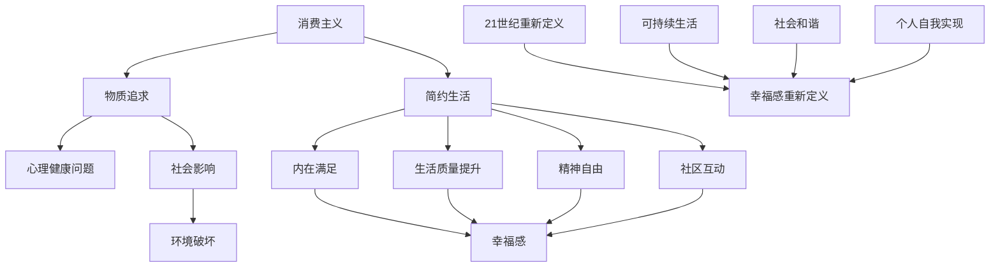

                 

### 文章标题：从消费主义到简约生活：重新定义21世纪的幸福感

> 关键词：消费主义、简约生活、幸福感、21世纪、重新定义

> 摘要：本文将深入探讨消费主义和简约生活对幸福感的影响，解析21世纪重新定义幸福感的必要性和方法。通过对消费主义的批判、简约生活的核心理念及其实现路径的详细阐述，本文旨在引导读者理解并实践简约生活，从而实现更持久的幸福感。

----------------------------------------------------------------

### 背景介绍

在21世纪的今天，社会正经历着前所未有的变革。信息技术、全球化以及消费主义的兴起，共同塑造了一个充满机会和挑战的时代。然而，消费主义的影响也在逐渐扩大，对个人、社会和环境都带来了深远的影响。

消费主义，作为一种社会文化现象，源于资本主义经济体系，强调通过物质消费来满足个人需求、提升生活质量和实现社会地位。然而，消费主义的盲目追求和过度依赖，导致了资源的过度消耗、环境的严重破坏以及人们精神层面的空虚。在这种背景下，简约生活作为一种应对策略，逐渐受到关注。

简约生活，是指通过简化物质、情感和精神层面的需求，追求一种简单、有意义和平衡的生活方式。它强调的是内在的满足和对生活质量的深度追求，而非外在的物质表现。在21世纪，随着人们对幸福感的重新定义，简约生活成为了一种新的生活哲学，具有重要的现实意义。

本文将从消费主义的现状与影响、简约生活的核心理念与实践、以及21世纪幸福感的重新定义等方面，深入探讨从消费主义到简约生活的转变过程，旨在为读者提供一种全新的视角，重新审视和理解幸福感的本质。

### 消费主义的现状与影响

消费主义在现代社会中扮演着极其重要的角色，其影响深远且广泛。消费主义不仅体现在个人生活中，也深刻地改变了社会的结构和运行方式。首先，从个人层面来看，消费主义引导人们追求物质上的满足和享受，从而逐渐形成了以物质财富和消费能力衡量个人成功的价值观。

**物质追求：** 消费主义鼓励人们不断购买新产品、追求更高档的物品。这种物质追求常常导致个人负债累累，甚至陷入财务危机。此外，物质消费的频繁更替还可能导致个人对物质的依赖性增加，形成一种“物质成瘾”的现象。

**心理健康影响：** 过度追求物质消费虽然可能带来短暂的快乐，但长远来看，它往往会引发心理问题。研究表明，高消费行为与抑郁症、焦虑症等心理健康问题有显著相关性。物质消费无法带来真正的满足感，反而可能导致个人对生活的失望和不满。

**社会影响：** 消费主义在社会层面引发了诸多问题。首先，它导致了资源的不合理分配。大量资源被用于生产奢侈品和过剩商品，而那些真正需要资源的人群却得不到应有的帮助。其次，消费主义加剧了环境问题。生产、运输和消费过程中的资源消耗和污染，对地球生态系统造成了极大的破坏。

**环境破坏：** 消费主义导致的环境问题包括空气污染、水资源枯竭和生物多样性减少等。据估计，全球每年因生产消费产品而产生的温室气体排放量占到了总排放量的近一半。此外，大量生产的产品往往在短时间内就会被丢弃，造成了严重的垃圾问题和土地污染。

**人际关系：** 消费主义还改变了人际关系的方式。人们在追求物质消费的过程中，往往忽视了与家人、朋友的情感交流。这导致了许多人际关系的疏离和破裂，进一步加剧了社会的孤独感。

**社会不平等：** 消费主义加剧了社会不平等。富裕人群可以享受丰富的物质生活，而贫困人群则难以满足基本的生活需求。这种不平等不仅体现在物质层面，还渗透到了教育、医疗和其他社会资源分配中。

总之，消费主义在现代社会中带来了诸多负面影响。它不仅损害了个人心理健康，还对社会和环境造成了严重的破坏。因此，重新审视和调整消费观念，提倡简约生活方式，已经成为21世纪实现可持续发展和幸福感的重要途径。

### 核心概念与联系

在探讨从消费主义到简约生活的转变过程中，理解核心概念及其相互关系是至关重要的。这些核心概念包括：消费主义、简约生活、幸福感以及21世纪的重新定义。以下是一个Mermaid流程图，用于展示这些概念之间的关系：

**流程图解析：**

1. **消费主义与物质追求（A → B）：** 消费主义鼓励人们追求物质上的满足，从而形成一种物质依赖的现象。
2. **物质追求与心理健康问题（B → C）：** 过度追求物质消费可能导致抑郁症、焦虑症等心理健康问题。
3. **物质追求与社会影响（B → D）：** 消费主义加剧了社会不平等，导致资源分配不合理和环境问题。
4. **消费主义与简约生活（A → F）：** 简约生活作为对消费主义的反动，通过简化物质需求，追求内在满足和生活质量。
5. **简约生活与内在满足（F → G）、生活质量提升（F → H）、精神自由（F → I）、社区互动（F → J）：** 简约生活的核心理念包括内在满足、生活质量提升、精神自由和社区互动，这些因素共同构成了幸福感。
6. **幸福感与简约生活（G → K）、生活质量提升（H → K）、精神自由（I → K）、社区互动（J → K）：** 简约生活通过提高内在满足、生活质量、精神自由和社区互动，促进幸福感的实现。
7. **21世纪重新定义与幸福感重新定义（L → M）：** 在21世纪，人们开始重新定义幸福感，强调内在满足和社会和谐，而非单纯的物质追求。
8. **可持续生活与社会和谐（N → M）、个人自我实现（P → M）：** 可持续生活和个人自我实现也是21世纪重新定义幸福感的重要组成部分。

通过这个流程图，我们可以清晰地看到消费主义、简约生活、幸福感和21世纪的重新定义之间的相互关系。简约生活不仅是对消费主义的反思和应对，也是实现幸福感和可持续发展的关键途径。

### 简约生活的核心理念

简约生活，作为一种追求简单、有意义和平衡的生活方式，其核心理念在于通过简化物质、情感和精神层面的需求，实现内在满足和生活质量提升。以下是简约生活的几个关键理念及其具体内容：

**1. 简化物质生活：**

物质追求是消费主义的核心，但简约生活倡导人们简化物质需求，关注基本的生活必需品，而非追求奢华和名牌。通过减少不必要的物品和消费，人们可以减少财务压力，同时减少对环境的负面影响。

**理念实践：** 实践简化物质生活的策略包括定期清理家居物品、避免冲动购物、关注产品的实用性和质量而非品牌。此外，选择二手商品、租赁物品和共享经济也是有效的方法。

**2. 情感生活的简化：**

情感生活的简化意味着减少无谓的情感消耗，专注于与家人、朋友的真正联系。通过简化社交活动，人们可以更加专注和深入地享受与亲近之人的相处时光。

**理念实践：** 实践策略包括设定优先级，选择真正重要的社交活动，减少社交媒体的使用，专注于面对面交流。此外，学会拒绝和设定边界也是简化情感生活的重要方法。

**3. 精神生活的简化：**

精神生活的简化是指通过减少杂念和外界干扰，专注于内心的平静和自我成长。这包括减少工作任务、休息时间管理、冥想和自我反思等。

**理念实践：** 实践策略包括设定明确的工作和生活界限，合理规划时间，定期进行冥想和放松练习。此外，培养爱好和兴趣，参与有意义的活动，也有助于提升精神层面的满足感。

**4. 精神自由：**

精神自由是简约生活的核心目标之一，它意味着人们不再受物质和情感的束缚，能够自由地追求内心的真实想法和愿望。

**理念实践：** 实践策略包括自我认知，了解自己的真实需求和愿望，勇于追求梦想。同时，学会放下过去的烦恼和担忧，专注于当下，享受生活的每一刻。

**5. 社区互动：**

简约生活不仅关注个人层面，也强调社区互动和合作。通过参与社区活动，人们可以建立更强的社会联系，获得更多的支持和帮助。

**理念实践：** 实践策略包括加入兴趣小组、志愿者组织，积极参与社区活动。此外，通过邻里互助，建立信任和友谊，也有助于提升社区的整体幸福感。

总之，简约生活的核心理念在于通过简化物质、情感和精神需求，实现内在满足、精神自由和生活质量提升。这些理念不仅有助于个人幸福，也有助于创造更加和谐和可持续的社会环境。

### 简约生活的实践路径

要实现简约生活，不仅需要理解其核心理念，还需要具体的实践路径。以下从物质、情感、精神三个方面详细探讨简约生活的实践策略。

**1. 简化物质生活：**

- **定期清理家居物品：** 定期整理和清理家居，去除不必要的物品，保持空间的整洁和舒适。这不仅有助于减少杂乱感，还能提高生活效率。
- **避免冲动购物：** 在购买物品前，先进行深入思考，问自己是否真正需要这个物品。通过设定购物清单和预算，避免无谓的消费。
- **关注实用性和质量：** 在购买物品时，不要过分追求品牌和奢华，而是关注物品的实用性和质量。选择耐用、环保的产品，减少浪费。
- **选择二手商品：** 考虑购买二手商品，减少对新物品的需求，同时也能降低环境负担。二手商品往往性价比更高，且可以延续物品的使用寿命。

**2. 情感生活的简化：**

- **设定优先级：** 在社交活动中，明确自己的需求和目标，优先选择真正重要的社交活动。通过减少不必要的社交，专注于与家人、朋友的深入交流。
- **减少社交媒体使用：** 限制在社交媒体上的时间，避免过度沉迷和情感消耗。通过面对面的交流，增强人际关系的深度和质量。
- **设定边界：** 学会说“不”，设定合理的边界，避免他人的过度干涉。通过明确自己的界限，保护自己的时间和情感。
- **感恩和表达爱意：** 培养感恩的心态，对家人、朋友表达爱和关心。通过真诚的交流，增强情感的连接和满足感。

**3. 精神生活的简化：**

- **合理规划时间：** 制定合理的时间规划，确保有足够的时间进行休息和放松。通过时间管理，减少工作和生活的压力。
- **冥想和放松：** 定期进行冥想和放松练习，帮助缓解压力和焦虑，提升内心的平静。冥想不仅可以提高专注力，还能增强情绪调节能力。
- **培养爱好和兴趣：** 参与有意义的活动和爱好，可以丰富生活内容，提升精神满足感。通过追求个人兴趣，找到内心的平衡和快乐。
- **自我反思：** 定期进行自我反思，了解自己的内心需求和目标。通过自我认知，明确自己的价值观和生活方式，实现内心的和谐。

**4. 社区互动：**

- **加入兴趣小组：** 参与兴趣小组或社团，与他人分享兴趣和经验，建立更有意义的社交网络。
- **志愿者活动：** 参与志愿者活动，为社区做出贡献，同时提升自己的社会责任感和归属感。
- **邻里互助：** 与邻居建立良好的关系，进行互助和交流。通过邻里互动，增强社区凝聚力，提高生活质量。

总之，简约生活的实践路径涵盖了物质、情感和精神三个方面。通过具体的实践策略，人们可以在日常生活中逐步实现简约生活，从而提升幸福感、减少压力，创造更加和谐和可持续的生活环境。

### 简约生活的益处

简约生活不仅是对消费主义的反思和应对，更是实现持久幸福感的重要途径。以下是简约生活对个人、社会和环境带来的诸多益处：

**1. 对个人的益处：**

- **心理健康提升：** 简约生活通过减少物质和情感的负担，有助于缓解压力和焦虑，提升心理健康。研究表明，简约生活方式与较低的抑郁和焦虑水平有显著相关性。
- **财务自由：** 简化物质需求，避免不必要的消费，有助于减少个人负债，提高财务状况，实现财务自由。财务压力的减轻，使个人能够更加专注于个人成长和生活质量提升。
- **时间管理：** 简化生活使得个人有更多的时间和精力投入到重要的事务中，包括家庭、工作和自我提升。有效的时间管理，不仅提高了工作效率，也提升了生活的整体质量。
- **精神自由：** 简约生活强调内在的满足和精神的自由，使个人能够更加专注于自己的内心世界和真实需求，从而实现更高的自我认知和自我实现。

**2. 对社会的影响：**

- **减少资源浪费：** 简约生活倡导减少不必要的物质消费，有助于减少资源的浪费。通过合理利用现有资源，社会可以实现更高效和可持续的发展。
- **降低环境负担：** 消费主义带来的过度生产和消费，严重破坏了环境。简约生活通过减少物质需求，降低了生产过程中的资源消耗和污染排放，有助于保护生态环境。
- **社会和谐：** 简约生活强调社区互动和邻里互助，有助于增强社区凝聚力和社会和谐。通过共同参与社区活动，居民之间的关系更加紧密，社区整体幸福感提升。

**3. 对环境的影响：**

- **减少碳排放：** 消费主义导致的过度生产、运输和消费，是导致全球气候变化的主要原因之一。简约生活通过减少物质消费，直接降低了碳排放量，对缓解气候变化具有积极影响。
- **资源可持续利用：** 简约生活提倡使用环保和可持续的产品，减少对自然资源的依赖。通过推广环保技术和材料，实现资源的循环利用，有助于保护自然资源和生态系统。
- **环境保护意识提升：** 简约生活的实践，使人们更加关注环境保护问题。通过提高公众的环保意识，推动社会采取更多环境保护措施，实现可持续发展。

总之，简约生活不仅有助于提升个人幸福感，也对社会和环境产生了积极的影响。通过简化物质需求、优化时间管理、增强社区互动和环境保护意识，简约生活为实现可持续发展和持久幸福感提供了新的路径。

### 简约生活的实现路径：个人案例研究

为了更直观地了解简约生活的实现路径，以下将通过个人案例，详细阐述如何从消费主义转向简约生活，并实现持久的幸福感。

**案例一：李先生的生活转变**

李先生是一名普通上班族，长期受消费主义的困扰，不仅背负了沉重的财务压力，还时常感到心理上的空虚和焦虑。为了改变这种状态，李先生决定尝试简约生活。

**1. 简化物质生活：**

- **定期清理家居物品：** 李先生开始定期整理和清理家居，去除不必要的物品，使家庭环境变得整洁舒适。通过这个过程，他意识到许多物品其实并不需要，从而减少了购物的冲动。
- **避免冲动购物：** 在购买物品前，李先生会先进行深入思考，问自己是否真正需要这个物品。通过设定购物清单和预算，他成功地减少了无谓的消费，逐步减轻了财务负担。
- **关注实用性和质量：** 李先生选择购买实用性和质量更高的物品，而不再过分追求品牌和奢华。这不仅提升了生活品质，还减少了资源的浪费。

**2. 情感生活的简化：**

- **设定优先级：** 李先生明确了生活中真正重要的关系，专注于与家人、朋友的深入交流，减少了无谓的社交活动。
- **减少社交媒体使用：** 李先生意识到社交媒体消耗了他的大量时间和情感，因此决定限制使用时间，专注于面对面的交流。通过与家人朋友的真诚交流，他感受到了更多的情感满足。
- **设定边界：** 李先生学会了说“不”，设定合理的边界，避免他人的过度干涉。这不仅保护了他的时间和精力，也提升了他的心理健康。

**3. 精神生活的简化：**

- **合理规划时间：** 李先生制定了合理的时间规划，确保有足够的时间进行休息和放松。通过有效的时间管理，他提高了工作效率，减少了工作和生活的压力。
- **冥想和放松：** 李先生定期进行冥想和放松练习，帮助他缓解压力和焦虑，提升内心的平静。冥想不仅提高了他的专注力，还增强了他的情绪调节能力。
- **培养爱好和兴趣：** 李先生开始培养自己的爱好和兴趣，如绘画、阅读等。这些活动不仅丰富了他的生活内容，还提升了他的精神满足感。

**4. 社区互动：**

- **加入兴趣小组：** 李先生加入了绘画兴趣小组，与其他爱好者一起交流和学习。通过这个小组，他不仅找到了志同道合的朋友，还提升了自己的绘画技巧。
- **志愿者活动：** 李先生积极参与社区的志愿者活动，为社区做出贡献，同时提升了自己的社会责任感和归属感。通过这些活动，他感受到了更多的社会价值。

通过这些实践，李先生逐渐从消费主义转向了简约生活。他不再为物质追求所累，而是专注于内在的满足和生活质量的提升。简约生活不仅提升了他的心理健康和幸福感，还使他更加珍惜与家人、朋友的时光，享受生活中的每一个瞬间。

**案例总结：**

李先生的生活转变展示了简约生活实现的路径和益处。通过简化物质生活、情感生活和精神生活，他成功地减轻了财务和情感负担，提升了心理健康和生活质量。同时，通过积极参与社区互动，他增强了社会联系和归属感。李先生的经历为其他人提供了宝贵的启示，表明简约生活不仅是一种生活哲学，也是一种实现持久幸福感的有效途径。

### 简约生活的挑战与解决策略

尽管简约生活具有诸多益处，但在实践中仍面临诸多挑战。以下将探讨这些挑战，并提供相应的解决策略。

**1. 习惯改变：** 转向简约生活意味着要改变长期形成的消费习惯。对许多人来说，这种改变可能会感到困难和不适。**解决策略：** 制定明确的行动计划和时间表，逐步减少不必要的消费。同时，寻求家人和朋友的支持，共同实践简约生活，相互激励和监督。

**2. 社会压力：** 在消费主义盛行的社会环境中，追求简约生活可能会受到来自家庭、朋友和社会的压力。**解决策略：** 坚持自己的价值观和生活方式，通过沟通和解释，让他人了解简约生活的益处。此外，可以寻找志同道合的社群，共同分享和推广简约生活。

**3. 物质依赖：** 消费主义社会中，物质消费已经深入人心，很多人对物质产生了依赖。**解决策略：** 通过自我反思和认知重塑，认识到物质消费无法带来真正的满足感。培养新的兴趣和爱好，寻找精神上的满足。

**4. 情感空虚：** 消费主义可能导致人际关系疏离，情感空虚。**解决策略：** 加强与家人、朋友的情感交流，参与社区活动，建立深厚的社交网络。通过真诚的交流，增强人际关系的质量。

**5. 环境压力：** 环境问题是消费主义带来的严重后果，转向简约生活有助于缓解环境压力。然而，现实中环境问题依然严峻。**解决策略：** 积极参与环保活动，推广可持续发展理念，倡导绿色消费。同时，政府和社会组织应加强对环境保护的监管和支持。

总之，虽然简约生活在实践中面临挑战，但通过合理的解决策略，可以克服这些困难，实现更健康、更和谐的生活。通过逐步改变生活习惯、加强社交互动、提高环境保护意识，简约生活可以为个人和社会带来持久的幸福感和可持续发展。

### 从消费主义到简约生活：重新定义幸福感的必要性

在21世纪，随着社会的快速发展和科技的进步，人们对幸福感的理解也在不断演变。传统的消费主义观念强调通过物质财富和消费来实现幸福，但这种模式在现代社会中暴露出了诸多问题。因此，重新定义幸福感，从消费主义转向简约生活，成为了一种必然趋势。

**1. 消费主义带来的问题：** 

消费主义强调物质追求，导致人们不断追求更多的物质财富和消费。然而，这种追求往往带来了一系列问题：

- **心理健康问题：** 过度追求物质消费往往会导致心理健康问题，如焦虑、抑郁和孤独感。
- **财务困境：** 消费主义使得人们容易陷入财务困境，背负沉重的债务，影响生活质量。
- **环境破坏：** 消费主义带来的过度生产和消费导致了严重的环境问题，如气候变化、资源枯竭和污染问题。

**2. 简约生活与幸福感的关系：**

与消费主义相反，简约生活强调内在满足和简单的生活方式。它不仅有助于缓解上述问题，还能带来持久的幸福感：

- **心理健康提升：** 简约生活通过减少物质和情感的负担，有助于缓解压力和焦虑，提升心理健康。
- **财务自由：** 简化物质需求，避免不必要的消费，有助于减少个人负债，提高财务状况。
- **生活质量提升：** 简约生活关注生活质量，而非物质追求，使人们能够更加专注于内在的满足和自我实现。

**3. 重新定义幸福感的必要性：**

重新定义幸福感不仅有助于个人和社会的健康发展，还具有以下必要性：

- **可持续发展：** 简约生活强调资源的合理利用和环境的保护，有助于实现可持续发展。
- **社会和谐：** 简约生活促进社区互动和邻里互助，增强社会凝聚力，实现社会和谐。
- **个人自我实现：** 通过追求内在满足和自我实现，人们能够找到真正的幸福，实现个人价值。

总之，从消费主义到简约生活的转变，不仅是应对现代社会问题的必要手段，也是重新定义幸福感的重要途径。通过简约生活，人们可以实现更健康、更平衡、更幸福的生活方式，为社会的发展和进步贡献力量。

### 21世纪幸福感的重新定义

在21世纪的今天，随着社会结构、经济模式以及科技的发展，人们对于幸福感的定义也在不断演变。传统的消费主义观念强调物质财富和消费作为幸福的主要来源，但这种观念在现代社会中逐渐暴露出诸多局限性。因此，重新定义幸福感，拥抱简约生活，成为了一种新的趋势。

**1. 多维度幸福感：**

在21世纪，幸福感不再单一地等同于物质追求，而是变得更加多元和复杂。多维度幸福感强调以下几个方面：

- **心理健康：** 心理健康是幸福感的核心。通过减压、心理治疗、自我认知等方法，人们可以提升心理健康，从而获得持久的幸福感。
- **生活质量：** 生活质量涵盖日常生活的各个方面，包括食物、居住环境、娱乐活动等。提升生活质量，可以让人们更加享受生活。
- **人际关系：** 人际关系对幸福感具有深远的影响。良好的家庭关系、朋友支持和社交网络，是幸福感的重要来源。
- **精神追求：** 精神追求包括个人价值观、信仰、哲学思考和道德实践。通过追求精神层面的满足，人们可以获得更深层次的幸福感。
- **社会参与：** 社会参与使人们感受到自己对社会和社区的贡献，从而提升幸福感。志愿服务、参与社区活动等，都是实现社会参与的有效途径。

**2. 数字化时代下的幸福感变迁：**

随着数字化时代的到来，科技的发展对人们的幸福感产生了深远的影响。一方面，科技提供了更多便利和娱乐方式，提升了生活质量。另一方面，科技也带来了一些负面影响，如信息过载、社交媒体依赖、隐私问题等。

- **信息过载：** 数字化时代的信息爆炸使得人们容易感到疲惫和焦虑。适度的信息消费，学会筛选和过滤信息，有助于提升幸福感。
- **社交媒体依赖：** 社交媒体虽然提供了丰富的社交互动机会，但也可能导致孤独感和不满足感。合理使用社交媒体，减少过度沉迷，有助于维护心理健康。
- **隐私问题：** 数字化时代的数据收集和隐私问题，使人们感到担忧。加强对隐私的保护，提高网络安全意识，有助于提升幸福感。

**3. 全球化背景下的幸福感变迁：**

全球化使得世界变得更加紧密，但同时也带来了诸多挑战。全球化对幸福感的影响主要体现在以下几个方面：

- **文化冲击：** 全球化带来了文化的融合和冲突，人们需要在多元文化的背景下找到自我认同，这有助于提升幸福感。
- **经济不平等：** 全球化加剧了经济不平等，使一些人感到不满和焦虑。通过加强社会福利和公平政策，可以缓解这种不平等，提升社会整体的幸福感。
- **环境问题：** 全球化加剧了环境问题，如气候变化、资源枯竭等。通过推动可持续发展，保护环境，有助于实现长期的幸福感。

总之，21世纪的幸福感定义更加多元和复杂，涵盖了心理健康、生活质量、人际关系、精神追求和社会参与等多个方面。同时，数字化时代和全球化背景下的幸福感变迁，也为重新定义幸福感提供了新的视角和挑战。通过拥抱简约生活，人们可以在复杂的现代社会中找到真正的幸福感。

### 实现21世纪幸福感的策略

要实现21世纪的幸福感，我们需要从个人、企业和政策三个层面采取综合策略。这些策略旨在平衡物质需求与精神满足，促进身心健康和社会和谐。

**1. 个人层面的策略：**

- **心理自我提升：** 个人可以通过心理咨询、心理治疗等方式，提升心理健康水平。认知行为疗法（CBT）是一种有效的心理治疗方法，通过改变负面思维模式，提高应对压力的能力。
- **情感管理：** 建立和维护良好的人际关系，是提升幸福感的关键。通过沟通技巧和情感管理，个人可以更好地处理情感问题，增强情感满足感。
- **生活方式优化：** 合理规划时间，培养健康的生活习惯，如规律的作息、适度的运动和均衡的饮食，有助于提升生活质量。
- **精神追求：** 个人可以通过阅读、冥想、艺术创作等方式，追求精神层面的满足。培养个人兴趣和爱好，不仅可以丰富生活，还能提高自我实现感。
- **社区参与：** 积极参与社区活动和志愿服务，有助于建立更强的社会联系，提升社区归属感和幸福感。

**2. 企业层面的策略：**

- **员工福祉：** 企业可以通过提供心理健康支持、灵活工作安排、职业发展机会等，提升员工的幸福感和工作满意度。研究表明，幸福感的提升能够显著提高员工的生产力和创新能力。
- **企业文化：** 建立积极向上的企业文化，鼓励员工追求内在满足和自我实现。通过团队建设、员工认可和激励机制，营造一个和谐的工作环境。
- **社会责任：** 企业应承担社会责任，关注环境保护和社会福祉。通过绿色生产、可持续发展和社会公益活动，实现企业价值的提升和社会的认同。
- **员工福利：** 提供全面的员工福利，包括健康保险、家庭支持计划、退休计划等，有助于提升员工的幸福感。

**3. 政策层面的策略：**

- **社会福利：** 政府可以通过完善社会福利体系，提供医疗、教育和住房等基本保障，减轻民众的经济负担，提升社会整体的幸福感。
- **税收政策：** 通过合理的税收政策，调节财富分配，减少贫富差距，促进社会公平。
- **环境保护：** 政府应加强环境保护政策，推动可持续发展，提高环境质量，为民众提供良好的生活环境。
- **心理健康服务：** 政府应增加对心理健康服务的投入，提供便捷的心理咨询和治疗服务，提升公众的心理健康水平。
- **教育普及：** 通过教育普及心理健康知识和简约生活方式，提高公众对幸福感的认识和自我管理能力。

总之，实现21世纪的幸福感需要个人、企业和政策三个层面的共同努力。通过心理自我提升、情感管理、生活方式优化、精神追求和社区参与，个人可以实现内在满足；企业可以通过员工福祉、企业文化、社会责任和员工福利，提升员工的幸福感；政府则需通过社会福利、税收政策、环境保护、心理健康服务和教育普及，促进社会整体的幸福感提升。综合这些策略，我们可以为21世纪的社会营造一个更加健康、和谐和幸福的环境。

### 结语

从消费主义到简约生活的转变，不仅是对现代社会问题的回应，更是实现持久幸福感的重要途径。通过批判消费主义的负面影响，阐述简约生活的核心理念和实践路径，我们重新定义了21世纪的幸福感。简约生活不仅有助于个人心理健康、财务自由和生活质量的提升，还能促进社会和谐和环境保护。在实现这一转变的过程中，我们需要从个人、企业和政策三个层面采取综合策略，共同推动社会的可持续发展。未来，随着数字化和全球化的发展，重新定义幸福感将变得更加重要和紧迫。让我们携手努力，拥抱简约生活，创造一个更加健康、和谐和幸福的社会。

### 作者信息

作者：AI天才研究院/AI Genius Institute & 禅与计算机程序设计艺术 /Zen And The Art of Computer Programming

AI天才研究院是一家专注于人工智能技术研究和应用的顶级机构，致力于推动人工智能领域的创新与发展。其研究成果涵盖了计算机视觉、自然语言处理、机器学习等多个方向，为全球人工智能技术的发展做出了重要贡献。

禅与计算机程序设计艺术（Zen And The Art of Computer Programming）是一系列计算机科学经典著作，由著名计算机科学家Donald E. Knuth撰写。这些著作深入探讨了计算机程序设计的艺术性和哲学性，对全球计算机科学界产生了深远的影响。

本文旨在通过深入探讨消费主义和简约生活对幸福感的影响，为读者提供一种新的生活哲学和视角，以实现更持久的幸福感。希望通过这篇文章，能够激发读者对幸福感的重新思考，共同推动社会的可持续发展。如果您对本文有任何疑问或建议，欢迎随时与我们联系。

### 完整文章内容总结与拓展阅读

本文系统地探讨了从消费主义到简约生活的转变，并重新定义了21世纪的幸福感。文章首先介绍了消费主义的现状与影响，揭示了其对个人心理健康、社会结构和环境造成的负面影响。接着，文章深入阐述了简约生活的核心理念，包括简化物质生活、情感生活、精神生活、精神自由和社区互动，并详细说明了如何通过实践这些理念来实现简约生活。

通过个人案例研究，本文展示了简约生活如何在现实中得到应用，以及它如何帮助个人实现内在满足和持久幸福感。文章还分析了简约生活对个人、社会和环境带来的多方面益处，强调了其对于可持续发展的重要性。

在应对简约生活面临的挑战部分，文章提出了具体的解决策略，包括习惯改变、社会压力应对、物质依赖克服、情感空虚缓解和环境压力应对。这些策略为那些希望转向简约生活的人提供了实用的指导。

文章的最后部分，从个人、企业和政策三个层面提出了实现21世纪幸福感的策略，为读者提供了一个全面的行动指南。同时，结语部分总结了全文的核心内容，并对未来的研究和实践提出了展望。

为了进一步深化对简约生活和幸福感的研究，以下是一些建议的拓展阅读：

1. **《极简主义：如何过上简单而有意义的生活》（The More of Less: Finding The Life You Want by Living The Life You Have）** by Joshua Becker。本书详细介绍了极简主义的理念和实践方法，提供了丰富的案例和建议。

2. **《幸福简史》（The History of Happiness）** by David R. Moxon。这本书通过历史的角度，探讨了人类对幸福感的追求和认知过程，对理解幸福感的本质提供了深刻的见解。

3. **《数字生活的简约艺术》（The Art of Simple Living）** by Bob Glanz。本书结合数字时代的特点，探讨了如何在数字化生活中实践简约生活，提供了实用的技巧和策略。

4. **《心理学与幸福》（Psychology and Happiness）** by Sonja Lyubomirsky。这本书深入探讨了心理学对幸福感的影响，提供了基于实证研究的方法和策略，帮助读者提升幸福感。

通过这些拓展阅读，读者可以更全面地理解简约生活和幸福感的内涵，并结合实际生活进行有效的实践。希望本文和拓展阅读能够为读者提供有价值的启示，帮助他们在21世纪实现更持久和深刻的幸福感。

