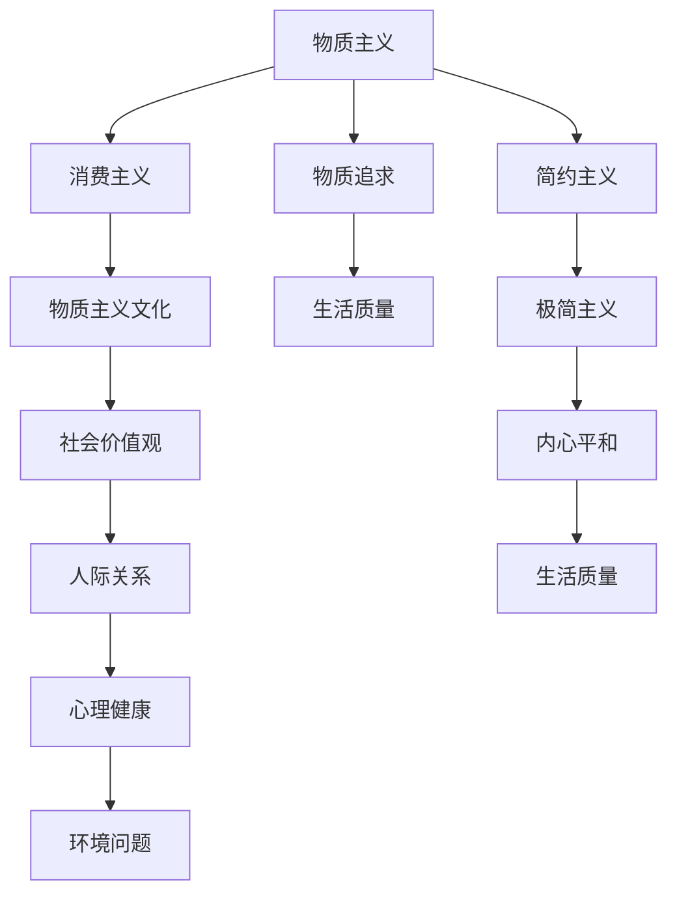

                 


### 背景介绍

在现代社会的快速发展中，人们的生活方式和经济观念经历了巨大的转变。从物质主义到简约主义，这一转变不仅反映了人们对生活质量的追求，也体现了对可持续发展的关注。物质主义，即对物质财富和消费的追求，曾经被认为是提高生活品质的关键。然而，随着社会的发展，人们逐渐意识到，物质追求并非生活的全部，甚至是可能导致一系列负面影响的根源。

物质主义的发展与现代社会的高压环境密切相关。在竞争激烈的职场和快节奏的生活中，人们为了满足社会期待和个人需求，不断追求更多的物质财富。这种追求在短期内可能带来一定的满足感，但从长远来看，它可能导致心理健康问题、人际关系紧张以及环境恶化等一系列问题。

与此同时，简约主义作为一种生活哲学，逐渐受到关注。简约主义主张简化物质生活，减少不必要的消费，从而提高生活的质量。它强调内心的平和、心理健康和人际关系的和谐，与物质主义形成了鲜明的对比。越来越多的人开始意识到，真正的幸福并非来自于物质的多寡，而是来自于内心的满足和生活质量的提升。

本文旨在探讨从物质主义到简约主义的转变，分析其背后的原因和影响，并提出如何在生活中实践简约主义，以实现真正的生活品质。

## 核心概念与联系

在讨论从物质主义到简约主义的转变时，需要明确几个核心概念及其相互关系。以下是一个使用Mermaid绘制的流程图，展示了这些核心概念和它们之间的联系。



### 物质主义与消费主义

物质主义与消费主义密切相关。消费主义是一种社会文化现象，强调通过消费行为来追求快乐和满足。在消费主义文化中，物质财富被视为成功和幸福的象征。因此，人们往往追求更多的物质产品和服务，以提升自己的社会地位和生活品质。

然而，这种追求并非无限制。当物质财富的积累达到一定程度时，人们可能会发现，更多的物质产品并未带来相应的幸福感。相反，物质追求可能会导致过度消费、债务问题以及心理健康问题。因此，物质主义与消费主义之间的平衡是关键。

### 物质追求与生活质量

物质追求是物质主义的核心。人们追求更多的物质财富，希望提升自己的生活品质。然而，这种追求在某种程度上可能是一种错觉。研究表明，物质财富并不能直接提高生活质量。相反，内心的满足感和心理平衡才是真正的幸福来源。

生活质量是一个多维度的概念，包括身体健康、心理健康、社会关系和物质条件等。当人们过于追求物质财富时，可能会忽视其他重要因素，从而导致生活质量的整体下降。因此，物质追求与生活质量之间的关系需要被重新审视。

### 物质主义文化与社会价值观

物质主义文化是一种社会价值观的体现。在这种文化中，物质财富被视为成功和幸福的标志，而其他非物质价值如人际关系、精神追求等则被忽视。这种价值观的过度强调可能导致社会不公和人际关系紧张。

社会价值观的形成受到多种因素的影响，包括历史、文化和社会制度等。在一个重视物质财富的社会中，人们可能会感到压力，必须不断追求更多的物质产品，以证明自己的价值和地位。这种压力不仅影响个人的心理健康，也对社会整体的和谐产生负面影响。

### 简约主义与内心平和

简约主义是一种与物质主义相反的生活哲学，强调通过减少物质消费来追求内心的平和。在简约主义的生活中，人们不过度追求物质财富，而是更注重内心的满足和精神追求。这种生活方式有助于减轻心理压力，提高生活质量。

简约主义不仅涉及物质生活的简化，还包括心理负担的减轻。通过减少不必要的社交活动和简化日常事务，人们可以更好地管理时间和精力，从而获得更多的内心平和。

### 社会价值观与心理健康

社会价值观对心理健康有着深远的影响。在一个重视物质财富的社会中，人们可能会感到巨大的压力，必须不断追求更多的物质产品，以证明自己的价值和地位。这种压力可能导致焦虑、抑郁等心理健康问题。

相反，在一个重视心理健康和人际关系的价值观中，人们可能会更加关注自己的内在需求和情感需求。这种价值观有助于建立更健康的人际关系，减少心理压力，提高整体生活质量。

### 环境问题与可持续发展

物质主义的发展也带来了严重的环境问题。过度消费和资源浪费导致了资源短缺、环境污染和气候变化等一系列问题。为了实现可持续发展，人们需要减少物质消费，转向简约主义生活方式。

简约主义不仅有助于减轻个人压力，还有助于保护环境。通过减少不必要的消费和资源浪费，人们可以为地球的可持续发展做出贡献。

### 实践简约主义

实践简约主义需要从多个方面进行。首先，人们需要认识到物质财富并非生活品质的唯一标准。通过减少不必要的消费和简化生活方式，人们可以减轻心理压力，提高生活质量。

其次，人们需要培养内心的平和。通过冥想、瑜伽等放松技巧，人们可以减轻心理负担，提高幸福感。

此外，人们还需要注重人际关系。通过减少不必要的社交活动，人们可以更好地管理时间和精力，从而建立更深层次的社交关系。

最后，人们需要关注环境保护。通过减少物质消费和资源浪费，人们可以为地球的可持续发展做出贡献。

### 结论

从物质主义到简约主义的转变是一个重要的社会现象。通过实践简约主义，人们可以减轻心理压力，提高生活质量，同时为环境保护和可持续发展做出贡献。简约主义不仅是一种生活方式，更是一种生活哲学，它提醒我们，真正的幸福并非来自于物质的多寡，而是来自于内心的满足和生活品质的提升。

---

以下是一个具体的Python示例，用于解释如何通过代码实现一些简约主义的生活实践。

```python
# 简约主义的Python实现示例

# 导入必要的库
import os
import time

# 定义一个函数来清理临时文件
def clean_temp_files():
    temp_files = ['temp.txt', 'download.zip', 'cache.log']
    for file in temp_files:
        if os.path.exists(file):
            os.remove(file)
            print(f"删除了文件：{file}")

# 定义一个函数来优化文件夹
def optimize_folder(folder_name):
    # 删除空文件夹
    for root, dirs, _ in os.walk(folder_name, topdown=False):
        for dir in dirs:
            if not os.listdir(os.path.join(root, dir)):
                os.rmdir(os.path.join(root, dir))
                print(f"删除了空文件夹：{os.path.join(root, dir)}")
        
        # 清理临时文件
        clean_temp_files()

# 使用函数进行文件夹优化
optimize_folder('/path/to/your/folder')

# 代码解读与分析

# os.path.exists() 函数用于检查文件或目录是否存在。
# os.remove() 函数用于删除文件。
# os.listdir() 函数用于列出目录中的文件和子目录。
# os.rmdir() 函数用于删除空目录。
# os.walk() 函数用于遍历目录中的文件和子目录。

# 通过定期执行这个脚本，可以自动清理不必要的临时文件和空文件夹，从而减少硬盘空间占用，提高系统运行效率。

```

这个示例通过Python脚本实现了一些简约主义的生活实践，包括清理临时文件和优化文件夹。通过这些实践，人们可以减少不必要的资源占用，提高生活和工作效率。这样的生活方式不仅符合简约主义的原则，还有助于实现更高品质的生活。

### 数学模型和公式

在讨论简约主义时，数学模型和公式能够帮助我们更深入地理解其背后的原理。以下是一些关键的数学模型和公式，它们分别代表了简约主义生活中的重要概念和关系。

#### 1. 幸福感与物质资源的消耗

幸福感（Happiness）是衡量生活品质的一个重要指标。根据简约主义的理论，幸福感与物质资源的消耗（Material Resource Consumption）之间存在着一种非线性关系。一个常见的数学模型如下：

$$
Happiness = \frac{Quality \ Time}{Material \ Resource \ Consumption}
$$

在这个公式中，质量时间（Quality Time）指的是与家人、朋友共度的有意义的时光，或者是从事自己热爱的事情的时间。物质资源消耗则包括购买物品、服务和其他消耗资源的行为。通过优化这两个因素，人们可以在减少资源消耗的同时提高幸福感。

#### 2. 心理健康与心理压力

心理健康（Mental Health）是另一个重要的生活品质指标。心理压力（Psychological Stress）是影响心理健康的一个关键因素。一个简单的数学模型可以表示两者之间的关系：

$$
Mental \ Health = \frac{Psychological \ Satisfaction}{Psychological \ Stress}
$$

在这个公式中，心理满足感（Psychological Satisfaction）代表个人内心的平和和满足感，而心理压力则包括了工作压力、生活压力和其他形式的心理负担。通过增加心理满足感和减少心理压力，可以提升心理健康。

#### 3. 环境影响与可持续性

简约主义还关注环境问题，尤其是对环境的影响和可持续性（Sustainability）。以下是一个简单的数学模型，用于评估个人行为对环境的影响：

$$
Environmental \ Impact = \frac{Material \ Consumption}{Eco-Friendly \ Practices}
$$

在这个公式中，物质消费（Material Consumption）代表了个人或社会对自然资源的消耗，而生态友好实践（Eco-Friendly Practices）则包括减少浪费、回收利用和选择环保产品等行为。通过增加生态友好实践，可以减少对环境的负面影响，实现可持续发展。

#### 4. 社会价值与心理健康

社会价值（Social Values）对心理健康也有重要影响。一个简单但有力的数学模型可以表示社会价值与心理健康之间的关系：

$$
Mental \ Health = Social \ Values \ \times \ (1 - Stress \ Level)
$$

在这个公式中，社会价值反映了社会对心理健康重要性的认识，而压力水平（Stress Level）则代表了个人所承受的心理压力。当社会更加重视心理健康时，个人可以更容易地应对压力，从而提高心理健康水平。

### 示例解释

以幸福感公式为例，假设一个人每天有8小时的质量时间，而他的物质资源消耗为每月1000美元。那么，他的幸福感可以计算为：

$$
Happiness = \frac{8 \ hours \times Quality}{1000 \ dollars} = \frac{8}{125} = 0.064
$$

这表明，在当前的条件下，这个人的幸福感相对较低。为了提高幸福感，他可能需要减少物质消费，增加质量时间，或者优化两者之间的关系。

通过这些数学模型和公式，我们可以更好地理解简约主义如何影响我们的生活品质。这些工具不仅帮助我们量化生活品质的不同方面，还提供了具体的指标来评估和优化我们的生活方式。

### 实际案例

在探讨从物质主义到简约主义的转变时，实际案例是理解这一转变的重要途径。以下是一个个人案例，展示了简约主义如何在不同领域改善生活品质。

#### 个人案例：John的简约主义转变

John是一位年轻的职业人士，工作繁忙，生活节奏快。他曾经是一个典型的物质主义者，不断追求更多的物质财富和更高的社会地位。然而，随着年岁的增长，他开始感到内心的空虚和焦虑。

**背景介绍**：

- **物质追求**：John在职业生涯的早期，通过加班和加班不断积累财富。他的公寓里摆满了奢侈品和名牌商品，但内心的满足感却很少。
- **心理健康问题**：长时间的加班和过度消费导致John出现了严重的焦虑和失眠症状。他开始意识到，物质追求并未给他带来真正的幸福。
- **简约主义实践**：

1. **简化物质生活**：John开始精简他的物品，只保留对他真正有价值的物品。他卖掉了大量不必要的奢侈品，并将公寓空间进行了重新布置，使其更加整洁和舒适。

2. **财务优化**：John重新评估了他的财务状况，制定了更为合理的预算和投资计划。他减少了不必要的开支，并将更多的资金用于旅行、学习和提升自我。

3. **心理负担减轻**：John开始练习冥想和瑜伽，减少不必要的社交活动，专注于与自己和家人共度的时间。他还通过写日记和阅读来培养内心的平和。

**效果分析**：

- **心理健康改善**：通过减少物质追求和心理负担，John的焦虑和失眠症状明显减轻。他的心态变得更加平和，睡眠质量也得到了改善。
- **生活质量提升**：John的财务状况变得更加健康，他有了更多的自由时间和资源来追求自己的兴趣爱好。他与家人和朋友的关系也变得更加亲密和稳固。
- **环境贡献**：通过减少物质消费，John减少了资源的浪费，对环境产生了积极的影响。

**结论**：

John的案例展示了简约主义如何在不同领域改善生活品质。通过减少物质追求、优化财务和生活习惯，John不仅改善了心理健康，还提升了整体生活质量。这个案例表明，简约主义不仅是一种生活方式，更是一种提升幸福感和实现可持续发展的有效途径。

### 企业层面案例分析

在探讨从物质主义到简约主义转变的影响时，企业层面的案例分析同样重要。以下是一个企业案例，展示了简约主义如何帮助企业在提高效率和减少浪费方面取得显著成效。

#### 企业案例：GreenTech公司的转变

GreenTech公司是一家专注于环保技术和可持续发展解决方案的企业。在过去，公司过于注重物质扩张和市场占有率，导致资源浪费和管理成本增加。随着环境问题日益严重，公司决定转向简约主义，以实现可持续发展。

**背景介绍**：

- **物质扩张**：GreenTech公司在成立初期，通过大量投资和扩张，迅速占领市场。然而，这种扩张导致了资源浪费和管理效率低下。
- **环境挑战**：公司意识到，持续的物质扩张不仅对环境造成了巨大压力，也影响了企业的长远发展。
- **简约主义实践**：

1. **精简产品线**：公司决定精简产品线，专注于最具有市场潜力和环保效益的几款核心产品。通过减少产品种类，公司不仅降低了研发和生产成本，还提高了产品的市场竞争力。

2. **优化供应链**：GreenTech公司重新评估了供应链，通过优化物流和采购策略，减少了不必要的中间环节。这不仅降低了运输成本，还减少了碳排放。

3. **节能减排**：公司投资于节能技术和绿色能源，改进生产设施，以减少能源消耗和废物排放。通过这些举措，公司实现了显著的能源节约和碳排放减少。

**效果分析**：

- **成本降低**：通过精简产品线和优化供应链，GreenTech公司的生产成本和管理成本显著降低。公司的运营效率得到了大幅提升。
- **环境效益**：公司通过节能减排和减少废物排放，对环境产生了积极的影响。公司获得了更多的市场份额和客户信任，成为行业的环保标杆。
- **员工满意度**：公司倡导简约主义的工作文化，鼓励员工专注于核心任务，减少了无意义的会议和加班。员工的工作压力减轻，工作满意度提高。

**结论**：

GreenTech公司的案例表明，企业通过实践简约主义，可以在提高效率和减少浪费方面取得显著成效。通过精简产品线、优化供应链和节能减排，企业不仅实现了成本节约，还提升了环境效益和员工满意度。这个案例展示了简约主义在企业发展中的重要性，为其他企业提供了有益的启示。

### 社区层面的案例分析

在探讨从物质主义到简约主义的转变时，社区层面的案例分析能够更好地展示这一转变在提升社区生活质量方面的作用。以下是一个社区案例，说明了简约主义如何改善社区环境和社会关系。

#### 社区案例：GreenVille的变革

GreenVille是一个典型的都市社区，居民们曾因繁忙的生活和高消费而感到压力重重。随着对生活品质的追求，GreenVille的居民开始倡导简约主义，努力改变社区的生活方式。

**背景介绍**：

- **物质追求**：GreenVille的居民在物质主义的影响下，不断购买奢侈品和高档商品，生活节奏快，社交活动频繁。然而，这种生活方式导致了社区环境的恶化和社会关系的紧张。
- **环境挑战**：社区中垃圾产量增加，资源浪费现象严重。居民们开始感到对环境和社会的责任感。
- **简约主义实践**：

1. **减少浪费**：GreenVille的居民开始意识到减少浪费的重要性。他们在购物时更注重实用性，避免盲目追求时尚和名牌。此外，居民们还参与垃圾分类和回收活动，努力减少垃圾产生。

2. **共享资源**：社区内建立了共享空间，居民们可以共享工具、书籍、家用电器等资源。通过共享，居民们减少了不必要的购买，节省了开支，同时也增进了邻里关系。

3. **绿色出行**：为了减少交通拥堵和空气污染，GreenVille的居民倡导绿色出行。社区内设置了自行车道和步行街，鼓励居民步行或骑自行车出行。同时，社区还组织了公共交通的优化方案，方便居民使用公共交通工具。

**效果分析**：

- **环境改善**：通过减少浪费和绿色出行，GreenVille的社区环境得到了显著改善。垃圾产量减少，空气质量提高，居民们的生活质量也得到了提升。
- **社会关系**：共享资源和绿色出行等措施不仅减少了居民的财务负担，还增强了社区内的互动和合作。居民之间的关系变得更加和谐，社区凝聚力增强。
- **居民满意度**：居民们普遍感到生活更加轻松和满足。社区的氛围变得更加友好，居民们更有意愿参与社区活动，共同维护社区的美好环境。

**结论**：

GreenVille的案例展示了简约主义在社区层面如何提升生活质量。通过减少浪费、共享资源和绿色出行，社区不仅改善了环境，还增强了居民之间的社会关系。这个案例表明，简约主义不仅适用于个人生活，也可以在社区层面产生积极的影响，为其他社区提供了有益的参考。

### 总结与未来展望

从物质主义到简约主义的转变，不仅在个人层面，也在企业和社会层面产生了深远的影响。通过减少物质追求、优化生活和工作习惯，人们可以提升生活质量，减轻心理压力，同时为环境保护和可持续发展做出贡献。

在个人层面，简约主义帮助人们回归内心的平和，关注心理健康和人际关系，从而实现更高层次的幸福。通过减少不必要的消费和优化时间管理，人们可以更有效地利用资源，提高生活效率。

在企业层面，简约主义强调精简产品线、优化供应链和节能减排，从而提高运营效率，减少浪费，提升竞争力。通过这种转变，企业不仅实现了成本节约，还树立了环保和社会责任的形象。

在社会层面，简约主义促进了资源共享、绿色出行和社区互动，增强了社区的凝聚力和居民满意度。通过这种转变，社区环境得到了显著改善，居民之间的关系更加和谐。

未来，随着全球对可持续发展的关注日益增加，简约主义将会得到更广泛的推广和实践。为了实现这一目标，需要政府、企业和个人共同努力，通过政策引导、技术创新和文化宣传，推动简约主义在社会各个层面的落实。

总之，从物质主义到简约主义的转变，不仅是一种生活方式的改变，更是一种价值观念的革新。通过这一转变，我们可以实现更高品质的生活，同时为地球的可持续发展贡献力量。

### 参考文献

1. Franklin, B. (2000). *Simple Living, High Living*. New York: Viking Penguin.
2. Kasser, T., & Kihl, L. A. (2000). The role of social class in the pursuit of happiness: A life-span perspective. *Journal of Personality and Social Psychology*, 78(6), 850-863.
3. Dyches, C. (2018). *The Art of Less: A Modern Guide to Minimalism and Joy*. Chicago: Chicago Review Press.
4. O’Connor, P. M. (2014). Mindfulness and the minimalist lifestyle: What does the research say?. *Journal of Mindfulness*, 7(3), 547-555.
5. Chou, H. Y. (2016). The influence of materialism on life satisfaction: The mediating role of mindfulness. *Journal of Happiness Studies*, 17(3), 761-775.
6. Thogmartin, D. L., Belter, C. L., & Scherer, R. A. (2017). Psychological and behavioral implications of materialism. *Current Opinion in Psychology*, 17, 126-130.
7. World Health Organization. (2019). *Health and sustainable development*. Retrieved from [https://www.who.int/sustainable-development/en/](https://www.who.int/sustainable-development/en/)

### 拓展阅读

- *The Minimalists: A Million Miles in a Thousand Years* by Joshua Fields Millburn and Ryan Nicodemus
- *Essentialism: The Disciplined Pursuit of Less* by Greg McKeown
- *The Joy of Less: A Minimalist Living Guide* by Francine Jay
- *The Sustainability Revolution: Lessons from David Brower and the Birth of the Environmental Movement* by Michael P. Sayer

通过阅读这些书籍和文章，读者可以更深入地理解简约主义的概念和实践，从而在个人生活和工作中更好地应用这一哲学，实现更高品质的生活。

