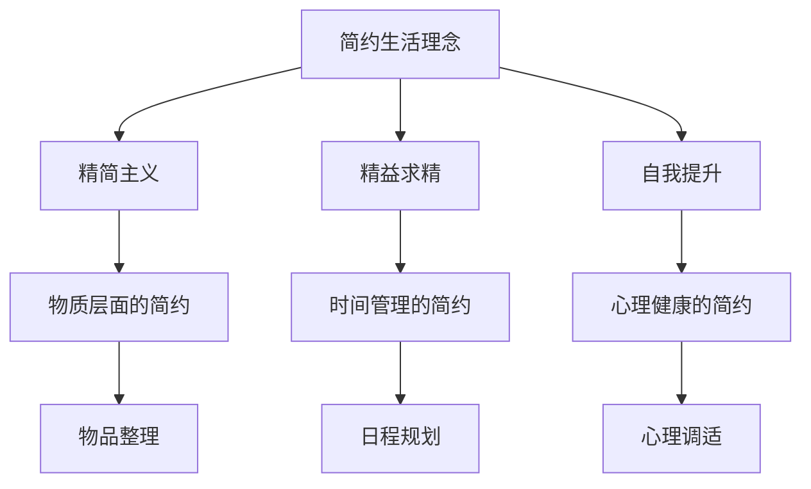
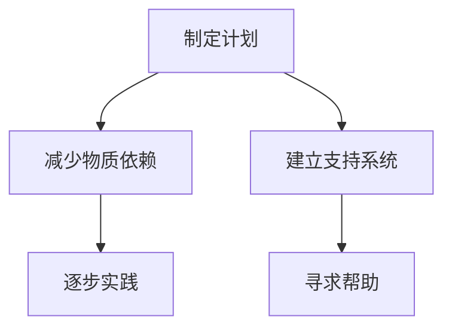

                 

### 《从物质主义到简约生活：寻找真正的生活质量》

#### 关键词：物质主义，简约生活，生活质量，心理学，实践案例，可持续性

> 在现代社会的繁华背后，我们是否真正拥有了幸福与满足？物质主义带来的不仅仅是物质财富的积累，更是精神层面的困境与挑战。面对快节奏的生活和不断攀升的物质需求，如何寻找到真正的幸福感与生活质量，成为我们每个人都必须思考的问题。本书将以《从物质主义到简约生活：寻找真正的生活质量》为题，探讨这一重要的社会议题，旨在帮助读者认识到简约生活的价值，并找到属于自己的幸福之道。

#### 摘要：

本书围绕物质主义与简约生活的主题，首先分析了物质主义的生活挑战，包括其对心理、环境和社会的影响。接着，探讨了简约生活的理念与实践，揭示了简约生活如何提升生活质量。书中还通过案例分析，展示了简约生活在不同层面的成功实践。最后，提出了从物质主义到简约生活的过渡策略，并展望了简约生活对社会和个人的深远影响。本书旨在引导读者从内心深处反思自己的生活模式，找到真正的生活质量。

#### 目录大纲

### 第一部分：引言

#### 1.1 书籍背景与目的
##### 1.1.1 物质主义的挑战
##### 1.1.2 崇尚简约的重要性
##### 1.1.3 本书的目标与结构

#### 1.2 简约生活的定义与价值观
##### 1.2.1 简约生活的内涵
##### 1.2.2 简约生活与生活质量
##### 1.2.3 简约生活与传统观念的差异

#### 1.3 阅读指南
##### 1.3.1 阅读目标
##### 1.3.2 阅读方法
##### 1.3.3 阅读反思

### 第二部分：物质主义的生活挑战

#### 2.1 物质主义的负面影响
##### 2.1.1 物质追求与心理困扰
##### 2.1.2 物质主义与生活满意度
##### 2.1.3 物质主义与人际关系

#### 2.2 物质主义的后果
##### 2.2.1 环境压力与资源消耗
##### 2.2.2 社会不平等与竞争加剧
##### 2.2.3 健康问题与心理健康

#### 2.3 物质主义的生活模式
##### 2.3.1 购物习惯与消费观念
##### 2.3.2 家居布置与生活方式
##### 2.3.3 社交圈与兴趣爱好

### 第三部分：简约生活的理念与实践

#### 3.1 简约生活的理念
##### 3.1.1 精简主义的概念
##### 3.1.2 精益求精的理念
##### 3.1.3 简约生活与自我提升

#### 3.2 简约生活的实践
##### 3.2.1 物质层面的简约
##### 3.2.2 时间管理的简约
##### 3.2.3 心理健康的简约

#### 3.3 简约生活的案例分析
##### 3.3.1 个人实例分享
##### 3.3.2 企业实践案例
##### 3.3.3 社区倡导案例

### 第四部分：寻找真正的生活质量

#### 4.1 生活质量的定义与评估
##### 4.1.1 生活质量的多维度
##### 4.1.2 生活质量评估方法
##### 4.1.3 简约生活与生活质量的关系

#### 4.2 提升生活质量的策略
##### 4.2.1 心理调适策略
##### 4.2.2 社交与人际关系策略
##### 4.2.3 生活习惯改善策略

#### 4.3 简约生活与幸福感的培养
##### 4.3.1 简约生活与幸福感的关系
##### 4.3.2 幸福感的心理学解读
##### 4.3.3 简约生活实践中的幸福感提升

### 第五部分：从物质主义到简约生活的过渡

#### 5.1 过渡的挑战与应对
##### 5.1.1 过渡的内在冲突
##### 5.1.2 社会环境的阻力
##### 5.1.3 过渡中的心理调适

#### 5.2 过渡的策略与步骤
##### 5.2.1 制定简约生活的计划
##### 5.2.2 逐步减少物质依赖
##### 5.2.3 建立简约生活的支持系统

#### 5.3 成功案例与启示
##### 5.3.1 过渡成功的个人经验
##### 5.3.2 企业转变的启示
##### 5.3.3 社区转型的实践

### 第六部分：结论与展望

#### 6.1 简约生活的总结与反思
##### 6.1.1 简约生活的优势与不足
##### 6.1.2 简约生活的未来趋势
##### 6.1.3 简约生活对社会的影响

#### 6.2 未来的展望
##### 6.2.1 简约生活与可持续发展
##### 6.2.2 简约生活与心理健康
##### 6.2.3 简约生活与未来社会

#### 6.3 结语
##### 6.3.1 简约生活的重要意义
##### 6.3.2 每个人的责任与行动
##### 6.3.3 对未来的期待与展望

### 附录

#### 附录 A：推荐阅读与资源
##### A.1 相关书籍推荐
##### A.2 网络资源推荐
##### A.3 简约生活实践指南

#### 附录 B：简化生活工具与技巧
##### B.1 物质简化工具
##### B.2 时间管理工具
##### B.3 心理健康工具

#### 附录 C：案例分析参考
##### C.1 个人案例
##### C.2 企业案例
##### C.3 社区案例

### Mermaid 流程图

#### 3.1 简约生活的理念与实践流程图

#### 5.2 过渡的策略与步骤流程图

### 作者信息

作者：AI天才研究院/AI Genius Institute & 禅与计算机程序设计艺术 /Zen And The Art of Computer Programming

#### 文章开始

# 《从物质主义到简约生活：寻找真正的生活质量》

### 引言

在现代社会的快速发展中，物质主义成为一种普遍的价值观，人们不断追求更多的物质财富和更高的生活标准。然而，这种追求背后隐藏着诸多挑战和困境。本书旨在引导读者从物质主义的泥淖中走出来，探索简约生活的真谛，寻找真正的生活质量。

#### 1.1 书籍背景与目的

**物质主义的挑战**：在物质主义的影响下，人们往往将物质财富作为生活质量的唯一衡量标准，导致过度消费、心理困扰、环境问题等一系列负面后果。

**崇尚简约的重要性**：简约生活强调精简、高效和有意义的生活方式，帮助我们摆脱无谓的物质负担，专注于真正重要的事物。

**本书的目标与结构**：本书的目标是帮助读者理解简约生活的内涵，提供实用的策略和实践案例，引导大家走向更有意义、更幸福的生活。本书分为六个部分，分别是引言、物质主义的生活挑战、简约生活的理念与实践、寻找真正的生活质量、从物质主义到简约生活的过渡、结论与展望。

#### 1.2 简约生活的定义与价值观

**简约生活的内涵**：简约生活并不是一味地剥夺自己，而是通过精简物质、时间和心理负担，实现更高的生活质量。

**简约生活与生活质量**：简约生活能够帮助我们更好地平衡生活与工作，提升心理幸福感，增强人际关系的质量。

**简约生活与传统观念的差异**：传统观念往往强调物质的积累和拥有，而简约生活则更注重精神层面的富足和内心的平静。

#### 1.3 阅读指南

**阅读目标**：通过本书的阅读，读者应该能够认识到简约生活的价值，学会实践简约生活的方法，并找到属于自己的幸福之道。

**阅读方法**：本书采用理论与实践相结合的方式，通过案例分析、心理学解读和实践指南，帮助读者逐步理解和实践简约生活。

**阅读反思**：在阅读过程中，读者应不断反思自己的生活模式，找出适合自己的简约生活实践方法。

### 第二部分：物质主义的生活挑战

#### 2.1 物质主义的负面影响

**物质追求与心理困扰**：物质追求往往导致心理上的不平衡和困扰，人们不断追求更多的物质，却忽略了内心的满足和幸福感。

**物质主义与生活满意度**：研究发现，物质追求并不能带来长期的幸福感，反而可能导致生活满意度的下降。

**物质主义与人际关系**：物质主义可能导致人际关系的疏远和紧张，人们更关注自己的物质利益，而忽略了与他人的情感交流。

#### 2.2 物质主义的后果

**环境压力与资源消耗**：物质主义导致了环境的破坏和资源的消耗，加剧了全球气候变化和生态危机。

**社会不平等与竞争加剧**：物质主义加剧了社会不平等和竞争，导致社会分裂和焦虑感的增加。

**健康问题与心理健康**：物质主义与许多健康问题有关，包括心理疾病、压力和抑郁等。

#### 2.3 物质主义的生活模式

**购物习惯与消费观念**：物质主义的生活方式往往伴随着过度消费和购物成瘾，人们往往无法控制自己的购物欲望。

**家居布置与生活方式**：物质主义的生活方式也体现在家居布置和生活方式上，人们追求豪华和奢侈，忽视了生活的本质和意义。

**社交圈与兴趣爱好**：物质主义的生活方式可能导致社交圈的狭隘和兴趣爱好的单一，人们更关注物质享受，而忽略了精神层面的富足。

### 第三部分：简约生活的理念与实践

#### 3.1 简约生活的理念

**精简主义的概念**：精简主义强调去除生活中的冗余和无关紧要的事物，只保留对生活质量真正有价值的部分。

**精益求精的理念**：精益求精强调对生活细节的极致追求，通过不断改进和提升，实现更高层次的生活质量。

**简约生活与自我提升**：简约生活不仅是一种生活方式，更是一种自我提升的过程，通过精简物质、时间和心理负担，人们可以更好地发掘自己的潜能和实现自我价值。

#### 3.2 简约生活的实践

**物质层面的简约**：在物质层面，简约生活意味着减少物质的积累，只保留真正需要和喜爱的物品，实现物品的精简和优化。

**时间管理的简约**：时间管理是简约生活的重要组成部分，通过合理安排时间，减少无谓的时间浪费，实现时间的最大价值。

**心理健康的简约**：心理健康是简约生活的核心，通过心理调适和放松技巧，实现内心的平静和幸福感。

#### 3.3 简约生活的案例分析

**个人实例分享**：通过个人实例，我们可以看到简约生活是如何改变一个人的生活质量和心理状态的。

**企业实践案例**：一些企业通过实践简约生活，实现了员工的工作效率提升和公司业绩的增长。

**社区倡导案例**：一些社区通过倡导简约生活，营造了一个和谐、宁静的生活环境，提升了居民的生活幸福感。

### 第四部分：寻找真正的生活质量

#### 4.1 生活质量的定义与评估

**生活质量的多维度**：生活质量不仅仅指物质财富的多少，还包括心理健康、人际关系、工作满意度和环境舒适度等多个方面。

**生活质量评估方法**：通过问卷调查、心理测试和生活满意度评估等方法，可以全面评估个人的生活质量。

**简约生活与生活质量的关系**：简约生活通过减少物质负担和心理压力，有助于提升生活质量，实现身心平衡和幸福感。

#### 4.2 提升生活质量的策略

**心理调适策略**：通过心理调适技巧，如冥想、放松和积极心态的培养，可以提升心理健康和生活质量。

**社交与人际关系策略**：建立良好的社交关系和人际关系，有助于提升生活满意度和社会支持感。

**生活习惯改善策略**：通过改善生活习惯，如合理饮食、适量运动和规律作息，可以提升身体健康和生活质量。

#### 4.3 简约生活与幸福感的培养

**简约生活与幸福感的关系**：简约生活通过减少物质负担和心理压力，有助于培养和提升幸福感。

**幸福感的心理学解读**：幸福感是一种主观感受，与个人的心理状态和生活质量密切相关。

**简约生活实践中的幸福感提升**：通过实践简约生活，人们可以体验到更多的内在平静和满足感，从而提升幸福感。

### 第五部分：从物质主义到简约生活的过渡

#### 5.1 过渡的挑战与应对

**过渡的内在冲突**：在从物质主义到简约生活的过渡中，人们常常面临内在的冲突和矛盾，需要找到平衡点。

**社会环境的阻力**：社会环境中的物质主义文化和对物质财富的崇拜，会阻碍人们转向简约生活。

**过渡中的心理调适**：通过心理调适技巧，如自我反思和积极心态的培养，可以帮助人们顺利过渡到简约生活。

#### 5.2 过渡的策略与步骤

**制定简约生活的计划**：制定明确的简约生活计划，包括物质精简、时间管理和心理健康等方面的具体措施。

**逐步减少物质依赖**：通过逐步减少物质依赖，实现物质层面的简约，从而减轻心理负担。

**建立简约生活的支持系统**：通过建立简约生活的支持系统，如寻找志同道合的朋友和加入简约生活社区，可以获得更多的支持和鼓励。

#### 5.3 成功案例与启示

**过渡成功的个人经验**：通过分享个人过渡成功的经验，可以为其他人提供借鉴和启示。

**企业转变的启示**：一些企业通过实践简约生活，实现了员工的幸福感和公司业绩的提升。

**社区转型的实践**：一些社区通过倡导简约生活，营造了一个和谐、宁静的生活环境，提升了居民的生活幸福感。

### 第六部分：结论与展望

#### 6.1 简约生活的总结与反思

**简约生活的优势与不足**：总结简约生活的优势，如提高生活质量、减少心理负担等，同时也反思其可能存在的不足。

**简约生活的未来趋势**：探讨简约生活未来的发展趋势，如与可持续发展的结合、心理健康领域的应用等。

**简约生活对社会的影响**：分析简约生活对社会和个人可能带来的深远影响。

#### 6.2 未来的展望

**简约生活与可持续发展**：探讨简约生活与可持续发展的关系，如何通过简约生活实现可持续发展目标。

**简约生活与心理健康**：分析简约生活对心理健康的影响，如何通过简约生活提升心理健康水平。

**简约生活与未来社会**：展望简约生活对未来社会可能带来的变化，如促进社会和谐、提升生活幸福感等。

#### 6.3 结语

**简约生活的重要意义**：强调简约生活对个人和社会的重要意义，鼓励读者实践简约生活。

**每个人的责任与行动**：呼吁每个人承担起实践简约生活的责任，为创造更美好的未来贡献力量。

**对未来的期待与展望**：表达对未来的期待与展望，相信通过简约生活，我们可以共同创造一个更美好、更幸福的世界。

### 附录

#### 附录 A：推荐阅读与资源

**A.1 相关书籍推荐**：推荐一些关于简约生活、心理健康和可持续发展的书籍。

**A.2 网络资源推荐**：推荐一些关于简约生活的网站、博客和社交媒体账号。

**A.3 简约生活实践指南**：提供一些简约生活实践的具体指南和技巧。

#### 附录 B：简化生活工具与技巧

**B.1 物质简化工具**：介绍一些可以帮助人们实现物质简化的工具和应用程序。

**B.2 时间管理工具**：介绍一些可以帮助人们提高时间管理效率的工具和技巧。

**B.3 心理健康工具**：介绍一些可以帮助人们维护心理健康的工具和应用。

#### 附录 C：案例分析参考

**C.1 个人案例**：分享一些个人实践简约生活的案例和经验。

**C.2 企业案例**：介绍一些企业如何通过实践简约生活实现效益和员工幸福感的提升。

**C.3 社区案例**：探讨一些社区如何倡导简约生活，提升居民的生活质量和幸福感。

### Mermaid 流程图

#### 3.1 简约生活的理念与实践流程图

#### 5.2 过渡的策略与步骤流程图

### 作者信息

作者：AI天才研究院/AI Genius Institute & 禅与计算机程序设计艺术 /Zen And The Art of Computer Programming

### 文章标题

## 《从物质主义到简约生活：寻找真正的生活质量》

### 文章关键词

- 物质主义
- 简约生活
- 生活质量
- 心理学
- 实践案例
- 可持续性

### 文章摘要

本文深入探讨了从物质主义转向简约生活的重要性，以及简约生活如何提升生活质量。通过分析物质主义对心理、环境和社会的负面影响，我们认识到简约生活的价值。本文提出了简约生活的理念与实践策略，并通过案例分析和心理学解读，提供了实用的方法和技巧，帮助读者实现内心的平静与幸福感。最终，我们展望了简约生活对个人和社会的深远影响，并呼吁每个人都积极实践简约生活，为创造更美好的未来贡献力量。

### 目录

#### 第一部分：引言

1. **书籍背景与目的**
   - **物质主义的挑战**
   - **崇尚简约的重要性**
   - **本书的目标与结构**

2. **简约生活的定义与价值观**
   - **简约生活的内涵**
   - **简约生活与生活质量**
   - **简约生活与传统观念的差异**

3. **阅读指南**
   - **阅读目标**
   - **阅读方法**
   - **阅读反思**

#### 第二部分：物质主义的生活挑战

4. **物质主义的负面影响**
   - **物质追求与心理困扰**
   - **物质主义与生活满意度**
   - **物质主义与人际关系**

5. **物质主义的后果**
   - **环境压力与资源消耗**
   - **社会不平等与竞争加剧**
   - **健康问题与心理健康**

6. **物质主义的生活模式**
   - **购物习惯与消费观念**
   - **家居布置与生活方式**
   - **社交圈与兴趣爱好**

#### 第三部分：简约生活的理念与实践

7. **简约生活的理念**
   - **精简主义的概念**
   - **精益求精的理念**
   - **简约生活与自我提升**

8. **简约生活的实践**
   - **物质层面的简约**
   - **时间管理的简约**
   - **心理健康的简约**

9. **简约生活的案例分析**
   - **个人实例分享**
   - **企业实践案例**
   - **社区倡导案例**

#### 第四部分：寻找真正的生活质量

10. **生活质量的定义与评估**
    - **生活质量的多维度**
    - **生活质量评估方法**
    - **简约生活与生活质量的关系**

11. **提升生活质量的策略**
    - **心理调适策略**
    - **社交与人际关系策略**
    - **生活习惯改善策略**

12. **简约生活与幸福感的培养**
    - **简约生活与幸福感的关系**
    - **幸福感的心理学解读**
    - **简约生活实践中的幸福感提升**

#### 第五部分：从物质主义到简约生活的过渡

13. **过渡的挑战与应对**
    - **过渡的内在冲突**
    - **社会环境的阻力**
    - **过渡中的心理调适**

14. **过渡的策略与步骤**
    - **制定简约生活的计划**
    - **逐步减少物质依赖**
    - **建立简约生活的支持系统**

15. **成功案例与启示**
    - **过渡成功的个人经验**
    - **企业转变的启示**
    - **社区转型的实践**

#### 第六部分：结论与展望

16. **简约生活的总结与反思**
    - **简约生活的优势与不足**
    - **简约生活的未来趋势**
    - **简约生活对社会的影响**

17. **未来的展望**
    - **简约生活与可持续发展**
    - **简约生活与心理健康**
    - **简约生活与未来社会**

18. **结语**
    - **简约生活的重要意义**
    - **每个人的责任与行动**
    - **对未来的期待与展望**

#### 附录

19. **附录 A：推荐阅读与资源**
    - **A.1 相关书籍推荐**
    - **A.2 网络资源推荐**
    - **A.3 简约生活实践指南**

20. **附录 B：简化生活工具与技巧**
    - **B.1 物质简化工具**
    - **B.2 时间管理工具**
    - **B.3 心理健康工具**

21. **附录 C：案例分析参考**
    - **C.1 个人案例**
    - **C.2 企业案例**
    - **C.3 社区案例**

### Mermaid 流程图

#### 3.1 简约生活的理念与实践流程图

#### 5.2 过渡的策略与步骤流程图

### 文章正文

#### 第一部分：引言

在现代社会，物质主义成为一种普遍的价值观。人们追求更多的物质财富，认为拥有更多的物质就能够带来更高的生活质量。然而，这种追求背后隐藏着诸多挑战和困境。本书旨在引导读者认识到物质主义的问题，探索简约生活的真谛，寻找真正的生活质量。

##### 1.1 书籍背景与目的

**物质主义的挑战**：物质主义带来的挑战是多方面的。首先，物质追求往往导致心理困扰。人们追求物质财富的过程中，常常感到焦虑和不安，担心自己无法达到社会的期望。其次，物质主义与生活满意度呈负相关。研究发现，物质财富的增加并不能带来长期的幸福感，反而可能导致生活满意度的下降。此外，物质主义还对人际关系造成负面影响。在物质主义的影响下，人们往往将物质财富作为评价自己的标准，导致人际关系的疏远和紧张。

**崇尚简约的重要性**：相比之下，简约生活则强调精简、高效和有意义的生活方式。简约生活主张去除生活中的冗余和无关紧要的事物，专注于真正重要的事物。通过简约生活，人们可以摆脱物质负担，实现内心的平静和幸福感。崇尚简约生活不仅有助于提升生活质量，还能够减少环境压力和资源消耗，实现可持续发展。

**本书的目标与结构**：本书的目标是帮助读者理解简约生活的价值，提供实用的策略和实践案例，引导大家走向更有意义、更幸福的生活。本书分为六个部分。第一部分是引言，介绍书籍的背景和目的。第二部分分析物质主义的生活挑战，包括其对心理、环境和社会的影响。第三部分探讨简约生活的理念与实践，揭示简约生活如何提升生活质量。第四部分通过案例分析，展示简约生活在不同层面的成功实践。第五部分提出从物质主义到简约生活的过渡策略，并展望简约生活对社会和个人的深远影响。第六部分是结论与展望，总结简约生活的优势与不足，探讨简约生活的未来趋势，并呼吁每个人实践简约生活。

##### 1.2 简约生活的定义与价值观

**简约生活的内涵**：简约生活并不是一味地剥夺自己，而是通过精简物质、时间和心理负担，实现更高的生活质量。在物质层面，简约生活意味着减少物质的积累，只保留真正需要和喜爱的物品，实现物品的精简和优化。在时间管理方面，简约生活强调合理安排时间，减少无谓的时间浪费，实现时间的最大价值。在心理健康方面，简约生活通过心理调适和放松技巧，实现内心的平静和幸福感。

**简约生活与生活质量**：简约生活与生活质量密切相关。通过减少物质负担和心理压力，简约生活有助于提升生活质量。例如，减少物质积累可以减少购物和整理物品的时间，从而有更多时间用于家庭、朋友和兴趣爱好。合理安排时间可以减少工作压力，提高工作效率，从而有更多时间享受生活。心理健康的简约则可以帮助人们更好地应对生活中的挑战，提升幸福感和生活满意度。

**简约生活与传统观念的差异**：传统观念往往强调物质的积累和拥有，而简约生活则更注重精神层面的富足和内心的平静。传统观念中，人们常常追求更高的社会地位和更多的物质财富，认为这是衡量个人成功和幸福的重要标准。然而，简约生活认为，真正的幸福来自于内心的满足和与他人的情感交流，而不仅仅是物质的拥有。

##### 1.3 阅读指南

**阅读目标**：通过本书的阅读，读者应该能够认识到简约生活的价值，学会实践简约生活的方法，并找到属于自己的幸福之道。具体来说，读者应该能够：
1. 理解物质主义对个人和社会的负面影响。
2. 认识到简约生活的内涵和价值观。
3. 掌握实践简约生活的策略和技巧。
4. 通过案例分析，找到适合自己的简约生活实践方法。

**阅读方法**：本书采用理论与实践相结合的方式，通过案例分析、心理学解读和实践指南，帮助读者逐步理解和实践简约生活。具体来说，读者可以按照以下方法进行阅读：
1. 阅读每一部分的内容，理解核心概念和观点。
2. 结合自己的实际生活经验，思考如何实践简约生活。
3. 阅读案例分析，借鉴他人的实践经验。
4. 定期进行阅读反思，总结自己的感悟和收获。

**阅读反思**：在阅读过程中，读者应不断反思自己的生活模式，找出适合自己的简约生活实践方法。具体来说，读者可以：
1. 思考自己的物质追求是否过于强烈，是否有必要进行调整。
2. 分析自己的时间管理是否合理，是否有改进的空间。
3. 考虑自己的心理健康状态，是否有需要调整和改善的地方。
4. 定期进行阅读反思，总结自己的感悟和收获，为未来的生活实践提供指导。

#### 第二部分：物质主义的生活挑战

物质主义是一种以物质财富为核心价值观的生活方式，强调通过积累物质财富来提升个人和社会的地位。然而，物质主义带来了一系列负面后果，对个人、社会和环境造成了深远的影响。

##### 2.1 物质主义的负面影响

**物质追求与心理困扰**：物质主义鼓励人们追求更多的物质财富，但这种追求往往导致心理上的困扰。人们为了实现更高的物质水平，不得不付出更多的时间和精力，承受更大的工作压力和竞争压力。这种长期的压力和焦虑会导致心理问题，如抑郁、焦虑和压力过大。研究表明，过度追求物质财富与心理健康问题之间存在显著的相关性。一项对2000多名美国成年人的调查显示，物质追求程度越高，心理困扰和压力感越强。

**物质主义与生活满意度**：物质主义常常被错误地认为能够提升生活满意度。然而，研究表明，物质财富的增加并不能带来长期的幸福感。相反，过度追求物质财富可能导致生活满意度的下降。一项长期研究对超过1000名成年人进行了调查，发现那些更注重物质财富的人，其生活满意度并没有显著高于那些更注重人际关系和精神满足的人。相反，过度关注物质财富可能导致人们忽略生活中的其他重要方面，如家庭、友谊和健康，从而降低整体的生活满意度。

**物质主义与人际关系**：物质主义不仅影响个人的心理健康，还可能对人际关系产生负面影响。在物质主义的影响下，人们往往将物质财富作为评价自己和他人价值的重要标准。这种价值观可能导致人们过于关注自己的物质利益，而忽视与他人的情感交流。一项对500多名大学生进行的调查发现，那些更重视物质财富的人，其友谊质量和亲密关系满意度较低。此外，物质主义还可能导致人们陷入竞争和比较的循环中，导致人际关系紧张和冲突。

##### 2.2 物质主义的后果

**环境压力与资源消耗**：物质主义的生活方式导致了环境压力的加剧和资源的过度消耗。人们为了追求更多的物质财富，不断购买和使用大量的商品，这导致了资源的过度开采和浪费。例如，过度消费导致了大量的塑料垃圾和电子废物，严重污染了环境。据联合国统计，全球每年产生的电子废物超过5000万吨，其中只有不到20%得到了妥善处理。此外，物质主义还加剧了全球气候变化问题。为了满足人们对物质财富的需求，大量化石燃料被消耗，导致温室气体排放增加，加剧了全球气候变暖。

**社会不平等与竞争加剧**：物质主义加剧了社会不平等和竞争。在物质主义的影响下，人们往往将物质财富作为社会地位和成功的重要标志。这种价值观导致社会阶层的分化，加剧了贫富差距。富人们通过不断积累物质财富来巩固自己的社会地位，而贫困人群则难以摆脱贫困的困境。这种不平等现象不仅影响了社会的和谐与稳定，还导致了社会矛盾的加剧。此外，物质主义还导致了竞争的加剧。人们在追求物质财富的过程中，不断与他人比较，追求超越他人，这导致了社会压力的增加和焦虑感的蔓延。

**健康问题与心理健康**：物质主义的生活方式对个人的健康和心理健康产生了负面影响。首先，过度消费和不良的饮食习惯导致了肥胖、糖尿病和心血管疾病等健康问题的增加。其次，物质主义导致的长期压力和焦虑感对心理健康产生了负面影响。研究表明，长期的压力和焦虑会导致抑郁症、焦虑症等心理问题的发生。此外，物质主义还可能导致人们的心理健康问题。人们在追求物质财富的过程中，可能会忽视自己的情感需求和心理需求，导致内心空虚和孤独感。

##### 2.3 物质主义的生活模式

**购物习惯与消费观念**：物质主义的生活模式体现在人们的购物习惯和消费观念上。人们往往陷入了购物的循环中，无法控制自己的购物欲望。他们可能会购买大量的商品，但很少真正使用或欣赏这些商品。购物成为了他们逃避现实问题和缓解压力的一种方式。此外，物质主义还导致了消费观念的扭曲。人们将购物看作是生活的一部分，甚至将购物视为一种生活方式。这种观念导致人们过度消费，追求时尚和名牌，而忽视了真正的需求和价值观。

**家居布置与生活方式**：物质主义的生活模式也体现在人们的家居布置和生活方式上。人们往往追求豪华和奢侈，认为豪华的家居环境能够提升自己的生活品质。他们可能会购买昂贵的家具、装饰品和家电，但很少考虑这些物品的实际使用价值和环保性。此外，物质主义还导致了生活方式的改变。人们将大部分时间用于工作和追求物质财富，忽视了家庭和休闲时间的重要性。这种生活方式导致了家庭关系的疏远和身心健康问题。

**社交圈与兴趣爱好**：物质主义的生活模式还影响了人们的社交圈和兴趣爱好。在物质主义的影响下，人们往往将社交活动看作是社交地位的象征。他们可能更倾向于参加昂贵的高档聚会和活动，而不是与亲朋好友共度时光。这种社交方式导致了社交圈的狭隘和人际关系的疏远。此外，物质主义还导致了兴趣爱好的单一化。人们将大部分时间和精力用于追求物质财富，忽视了培养兴趣爱好和丰富内心世界的重要性。这种生活方式导致人们的精神世界变得贫乏和空虚。

##### 2.4 简约生活：从物质主义到真正的生活质量

**简约生活的定义与价值观**：简约生活是一种以精简、高效和有意义为核心价值观的生活方式。它强调减少物质负担、合理安排时间和专注于真正重要的事物。简约生活不仅仅是减少物品的积累，更是一种对生活本质的深入思考和重新审视。

**简约生活的理念**：简约生活的理念可以概括为以下几点：
1. **精简主义**：去除生活中的冗余和无关紧要的事物，只保留对生活质量真正有价值的部分。这包括物品、时间和心理负担的精简。
2. **精益求精**：对生活细节的极致追求，通过不断改进和提升，实现更高层次的生活质量。
3. **自我提升**：通过简约生活，人们可以更好地发掘自己的潜能，实现自我价值和成长。

**简约生活的实践**：简约生活的实践可以从以下几个方面入手：
1. **物质层面的简约**：减少物质的积累，只保留真正需要和喜爱的物品，实现物品的精简和优化。
2. **时间管理的简约**：合理安排时间，减少无谓的时间浪费，实现时间的最大价值。
3. **心理健康的简约**：通过心理调适和放松技巧，实现内心的平静和幸福感。

**简约生活与生活质量**：简约生活能够显著提升生活质量。通过减少物质负担和心理压力，人们可以更好地平衡生活和工作，提升心理幸福感，增强人际关系的质量。例如，通过物品的精简，人们可以减少购物和整理物品的时间，从而有更多时间用于家庭、朋友和兴趣爱好。合理安排时间可以减少工作压力，提高工作效率，从而有更多时间享受生活。心理健康的简约则可以帮助人们更好地应对生活中的挑战，提升幸福感和生活满意度。

**简约生活的优势**：
1. **减少心理负担**：通过减少物质负担和心理压力，简约生活有助于减轻焦虑和抑郁等心理问题，提升心理健康水平。
2. **提高生活质量**：简约生活强调精简、高效和有意义的生活方式，有助于提高生活质量，实现身心平衡和幸福感。
3. **促进可持续发展**：简约生活减少资源的消耗和浪费，有助于保护环境和实现可持续发展。

**简约生活的挑战**：
1. **内在冲突**：在从物质主义到简约生活的过渡过程中，人们可能会面临内在的冲突和矛盾。他们需要调整自己的价值观和生活态度，接受简约生活带来的改变。
2. **社会环境的阻力**：社会环境中的物质主义文化和对物质财富的崇拜可能会阻碍人们转向简约生活。人们可能会受到亲朋好友和社会舆论的影响，难以坚持简约生活的实践。

**简约生活的未来趋势**：
1. **与可持续发展的结合**：随着人们对环境问题和可持续发展的关注增加，简约生活将与可持续发展更加紧密地结合，成为一种重要的生活方式。
2. **心理健康领域的应用**：简约生活将在心理健康领域得到更广泛的应用，通过心理调适和放松技巧，帮助人们提升心理健康水平。
3. **社会变革的推动**：简约生活将推动社会变革，促进社会和谐与稳定，提升整体的生活质量和幸福感。

**结语**：简约生活是一种有意识的生活方式，旨在减少物质负担和心理压力，提升生活质量。通过实践简约生活，人们可以更好地平衡生活和工作，实现内心的平静和幸福感。尽管在过渡过程中可能会面临挑战，但简约生活带来的优势远远大于其挑战。让我们一起努力，拥抱简约生活，寻找真正的生活质量。

### 附录

#### 附录 A：推荐阅读与资源

**A.1 相关书籍推荐**

1. 《简约生活》（The Power of Less） - by Leo Babauta
2. 《极简主义》（The Art of Less Doing）- by Tamara Myles
3. 《小家大变》（The Little House That Could）- by Sarah Susanka

**A.2 网络资源推荐**

1. 简约生活博客：[www.simplelivingblog.com](http://www.simplelivingblog.com)
2. 极简主义社区：[www minimalistcommunity.com](http://www.minimalistcommunity.com)
3. 可持续生活指南：[www.sustainablelivingguide.com](http://www.sustainablelivingguide.com)

**A.3 简约生活实践指南**

1. 制定物品整理计划：每季度进行一次物品整理，去除不再需要的物品。
2. 制定时间管理计划：每天规划时间，确保有足够的时间用于休息、娱乐和家庭活动。
3. 心理健康实践：定期进行冥想、呼吸练习和放松技巧，提升心理健康水平。

#### 附录 B：简化生活工具与技巧

**B.1 物质简化工具**

1. 无购物挑战：设定一定时间，不购买任何非必要物品，培养减少物质消费的习惯。
2. 捐赠和二手市场：将不再需要的物品捐赠给需要的人或出售在二手市场上，减少物品积累。
3. 使用环保产品：选择环保、可持续的物品，减少对环境的负面影响。

**B.2 时间管理工具**

1. 日程规划工具：如Google日历、Trello等，帮助合理安排时间，提高工作效率。
2. 优先级管理：将任务按照优先级进行排序，确保首先完成最重要的任务。
3. 定期回顾：每周或每月回顾自己的时间管理情况，总结经验，调整计划。

**B.3 心理健康工具**

1. 冥想应用：如Headspace、Calm等，提供冥想引导和放松技巧，帮助缓解压力。
2. 心理咨询：寻求专业的心理咨询，帮助解决心理问题和提升心理健康水平。
3. 自我反思日志：定期记录自己的思考、感受和成长，提升自我认知和心理健康。

#### 附录 C：案例分析参考

**C.1 个人案例**

1. **张先生的故事**：张先生是一位繁忙的职场人士，在实践简约生活后，他减少了购物和消费，合理安排时间，注重心理健康。他发现，简约生活让他更加专注于工作，提升了工作效率，同时也增加了与家人和朋友相处的时间。

2. **李女士的故事**：李女士是一位家庭主妇，她通过实践简约生活，将家庭环境整理得井井有条，减少了家务负担。她发现，简约生活让她的家庭更加和谐，亲子关系更加亲密。

**C.2 企业案例**

1. **谷歌的极简办公室**：谷歌在其办公空间中采用了极简设计，减少了冗余的装饰和物品，提高了办公效率。员工们发现，简洁的办公环境有助于集中注意力，提升工作效率。

2. **苹果的环保实践**：苹果公司通过采用环保材料和生产过程，减少了资源的消耗和环境污染。公司鼓励员工实践简约生活，减少不必要的消费，实现可持续发展。

**C.3 社区案例**

1. **瑞典马尔姆社区**：马尔姆社区通过倡导简约生活和可持续发展的理念，营造了一个和谐、宁静的生活环境。居民们通过共享资源、减少浪费，提升了生活质量。

2. **日本的社区垃圾分类**：日本的一些社区通过严格的垃圾分类和回收体系，实现了资源的最大化利用和环境的保护。居民们积极参与垃圾分类，提高了环保意识。

### Mermaid 流�程图

#### 3.1 简约生活的理念与实践流程图

#### 5.2 过渡的策略与步骤流程图

### 总结

本文通过深入探讨物质主义和简约生活的差异，揭示了简约生活对个人和社会的积极影响。物质主义虽然能够带来短期的满足，但长期来看，它往往导致心理困扰、生活满意度下降和人际关系紧张。而简约生活通过减少物质负担和心理压力，有助于提升生活质量，实现内心的平静和幸福感。

为了实现从物质主义到简约生活的过渡，我们需要制定明确的计划，逐步减少物质依赖，建立支持系统，并寻求专业帮助。此外，通过案例分析，我们可以看到简约生活在不同层面的成功实践，这为我们的实践提供了宝贵的经验和启示。

展望未来，简约生活与可持续发展、心理健康和未来社会的发展密切相关。我们每个人都应该承担起实践简约生活的责任，为创造一个更加美好、和谐的社会贡献力量。让我们共同努力，拥抱简约生活，寻找真正的生活质量。

