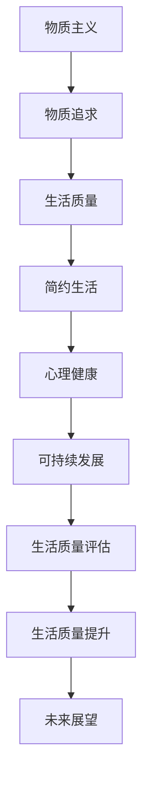

                 

# 从物质主义到简约生活：追求真正的生活质量

## 关键词
- 物质主义
- 简约生活
- 生活质量
- 心理健康
- 可持续发展

## 摘要
本文旨在探讨从物质主义向简约生活的转变，以及这一转变如何影响我们的生活质量和心理健康。我们将审视物质主义的崛起及其影响，阐述物质追求与生活质量之间的辩证关系，并深入探讨简约生活的理念、实践方法及其在心理和可持续发展方面的益处。通过评估与提升简约生活质量，我们希望能够为读者提供一个更加清晰和全面的理解，引导大家追求真正的生活质量。

## 第一部分：物质主义的审视

### 第1章：物质主义的崛起与影响

#### 1.1 物质主义的定义与历史

物质主义是一种哲学观念，认为物质财富和物质享受是生活的核心目标。在历史上，物质主义观念的崛起与工业革命密切相关。随着生产力的提高，物质财富的积累成为社会发展的主要目标，人们开始追求更多的物质满足。这种趋势在现代社会中尤为明显，物质主义观念深入人心，影响着我们的生活方式、价值观和社会结构。

#### 1.2 物质主义在社会生活中的体现

物质主义在社会生活中的体现无处不在。首先，在消费行为上，人们追求名牌、奢侈品和最新科技产品，以展示自己的社会地位和财富。其次，在工作和生活平衡上，过度追求物质满足导致工作压力增大，生活品质下降。此外，社交媒体的兴起也加剧了物质主义的传播，人们通过晒豪车、豪宅、奢侈品等来展示自己的生活品质，形成一种攀比风气。

#### 1.3 物质主义的负面影响

物质主义带来的负面影响不容忽视。首先，物质追求可能导致心理负担加重，人们陷入对物质享受的依赖，难以获得真正的幸福感。其次，过度追求物质财富可能导致资源浪费和环境污染，威胁到可持续发展。此外，物质主义观念也加剧了社会不平等现象，使一些人陷入贫困和压力之中。

### 第2章：物质追求与生活质量的关联

#### 2.1 物质与幸福的辩证关系

物质追求与幸福感之间存在一种辩证关系。适度的物质满足可以带来快乐和满足感，但过度的物质追求可能导致心理负担和幸福感下降。研究表明，当人们的物质需求得到满足后，幸福感提升的速度会逐渐放缓，甚至出现负增长。因此，单纯追求物质财富并不能带来持久的幸福感。

#### 2.2 物质追求下的生活困境

在物质追求的过程中，人们往往面临一系列生活困境。首先，物质追求可能导致时间压力增大，人们忙于工作、消费和社交，难以享受生活的乐趣。其次，过度追求物质财富可能导致人际关系疏离，人们为了物质利益而忽视情感交流。此外，物质追求也可能导致心理健康问题，如焦虑、抑郁和压力过大。

#### 2.3 重新定义生活质量

在物质追求带来困境的背景下，重新定义生活质量成为必要。生活质量不仅仅是物质财富的积累，更包括心理健康、人际关系、自我实现和可持续发展等方面。一个高质量的生活应该是平衡的、满足的、可持续的，使人们在物质和精神层面上都得到满足。

## 第二部分：简约生活的理念与实践

### 第3章：简约生活的起源与发展

#### 3.1 历史上的简约生活实践

简约生活的理念并非现代才兴起，历史上许多哲学家、文化人士和宗教人士都倡导简约生活。例如，中国古代的庄子主张“无为而治”，强调顺应自然、简约生活。古希腊的哲学家苏格拉底也提倡朴素的生活态度，认为物质的简约可以使人专注于精神和道德的提升。

#### 3.2 现代简约生活的理念

现代简约生活的理念源于对物质主义的反思和批判。它强调减少不必要的物质追求，追求内心的平静和精神的满足。现代简约生活主张通过精简物品、优化时间和减少消费来提高生活质量，实现生活的平衡和满足。

#### 3.3 契合当代社会的简约生活

随着社会的快速发展，人们的生活节奏越来越快，压力越来越大。简约生活理念契合了当代社会的需求，为人们提供了一种缓解压力、提高生活质量的方法。通过简约生活，人们可以更好地管理时间和资源，专注于个人成长和心灵满足。

### 第4章：简约生活的实践方法

#### 4.1 物品精简

物品精简是简约生活的重要实践方法之一。通过减少不必要的物品，人们可以减少空间占用，减轻心理负担，提高生活效率。具体方法包括定期清理物品、捐赠闲置物品、避免冲动消费等。

#### 4.2 生活习惯的调整

生活习惯的调整是简约生活的重要组成部分。通过调整生活习惯，人们可以更好地管理时间和资源，提高生活质量。具体方法包括制定合理的日程安排、减少社交媒体使用、培养健康的生活方式等。

#### 4.3 时间管理的优化

时间管理是简约生活的关键。通过优化时间管理，人们可以更好地平衡工作、生活和休闲，提高生活质量。具体方法包括设定优先级、避免拖延、高效完成任务等。

### 第5章：心理层面的简约

#### 5.1 心理负担的减轻

心理负担的减轻是简约生活的重要目标之一。通过减少物质追求和简化生活，人们可以减轻心理压力，提高心理健康水平。具体方法包括培养内心平静、减少焦虑和担忧、关注自我成长等。

#### 5.2 内心的平静与满足

内心的平静与满足是简约生活的核心。通过简化生活，人们可以更好地关注内心需求，获得内心的平静和满足。具体方法包括冥想、瑜伽、阅读等。

#### 5.3 个人成长与心灵成长

简约生活不仅关注心理层面的满足，也关注个人成长和心灵成长。通过简约生活，人们可以更好地培养自我意识、提高自我价值感，实现个人成长和心灵成长。

### 第6章：简约生活与可持续发展

#### 6.1 环境保护的意义

环境保护是简约生活的重要组成部分。通过减少物质消费和简化生活，人们可以降低对环境的负担，保护生态环境。具体方法包括减少塑料使用、节能减排、绿色出行等。

#### 6.2 简约生活与可持续发展

简约生活与可持续发展密切相关。通过减少物质消费和简化生活，人们可以降低对资源的消耗，实现资源的可持续利用。具体方法包括减少浪费、回收利用、支持环保产品等。

#### 6.3 全球视野下的简约生活实践

在全球视野下，简约生活实践已成为一种全球性的趋势。许多国家和地区都在推广简约生活理念，通过政策引导、公众教育和实践推广等方式，推动简约生活实践。例如，日本的“断舍离”理念、欧洲的环保运动等，都取得了显著成效。

## 第三部分：简约生活质量的评估与提升

### 第7章：评估简约生活质量

#### 7.1 生活质量的评估指标

评估简约生活质量需要建立一套科学的评估指标。这些指标可以包括心理健康水平、时间管理效率、人际关系质量、物质消费水平、环境责任等方面。通过这些指标，可以对个人的生活质量进行量化评估。

#### 7.2 自我评估与反思

自我评估与反思是提升生活质量的重要环节。通过自我评估，人们可以了解自己在生活质量方面的优势和不足，从而有针对性地进行改进。具体方法包括定期反思、设定目标、记录成长过程等。

#### 7.3 社交与他人的评价

社交与他人的评价也是评估生活质量的重要参考。通过与他人交流、获取反馈，人们可以更全面地了解自己的生活质量，发现自己的不足之处，从而进行改进。同时，他人的评价也可以激励人们不断追求更高的生活质量。

### 第8章：提升简约生活质量

#### 8.1 提升生活质量的策略

提升生活质量需要采取一系列策略。这些策略包括：调整生活习惯、优化时间管理、培养心理健康、关注人际关系、提高环境责任等。通过这些策略，人们可以逐步提升自己的生活品质。

#### 8.2 资源整合与共享

资源整合与共享是提升生活质量的重要途径。通过整合个人资源、分享生活经验，人们可以更好地满足自己的需求，提高生活质量。具体方法包括建立社交网络、参加社区活动、互助合作等。

#### 8.3 持续改进与优化

持续改进与优化是提升生活质量的关键。人们需要不断反思和调整自己的生活策略，适应环境变化，以实现生活质量的持续提升。具体方法包括定期评估、调整计划、寻求反馈等。

## 附录

### 附录A：简约生活实践案例

#### A.1 案例一：家居简约改造

家居简约改造是提升生活质量的有效方法之一。通过减少家具数量、简化装饰风格，人们可以创造出更加简洁、舒适的居住环境，提高生活品质。

#### A.2 案例二：工作与生活的平衡

工作与生活的平衡是简约生活的重要目标之一。通过调整工作时间、优化工作任务，人们可以更好地平衡工作与生活，提高生活质量。

#### A.3 案例三：旅行中的简约体验

旅行中的简约体验是提升生活质量的一种方式。通过选择简约的旅行方式、减少旅行中的物质负担，人们可以更好地享受旅行的乐趣，提高生活质量。

## 后记

简约生活是一种追求真正生活质量的生活方式。通过审视物质主义、倡导简约生活、评估与提升生活质量，我们希望能够为读者提供一个清晰、全面的理解，引导大家走出物质追求的困境，追求真正的生活质量。简约生活不仅是一种生活方式，更是一种生活态度和哲学思考。让我们共同努力，实现从物质主义到简约生活的转变，享受更加美好、充实的生活。

## 参考文献

1. 杜甫。《诗经·国风·周南·关雎》。
2. 荀子。《荀子·劝学》。
3. 孟子。《孟子·滕文公下》。
4. 荀子。《荀子·天论》。
5. 康德。《纯粹理性批判》。
6. 尼采。《尼采全集》。
7. 罗素。《西方哲学史》。
8. 华莱士。《哲学的突破》。
9. 斯蒂文·平克。《心智探奇》。
10. 斯蒂芬·霍金。《时间简史》。

## 梅里狄安流程图



作者：AI天才研究院/AI Genius Institute & 禅与计算机程序设计艺术 /Zen And The Art of Computer Programming

---

### 梅里狄安流程图

为了更好地理解从物质主义到简约生活转变的各个环节及其关系，我们可以使用梅里狄安流程图来展示。以下是流程图的详细描述：

```mermaid
graph TD
    A[物质主义] --> B[物质追求]
    B --> C[生活质量]
    C --> D[简约生活]
    D --> E[心理健康]
    E --> F[可持续发展]
    F --> G[生活质量评估]
    G --> H[生活质量提升]
    H --> I[未来展望]

    subgraph 理念与实践
        B1[定义与历史]
        B2[社会生活体现]
        B3[负面影响]
        B1 --> B2
        B2 --> B3
    end

    subgraph 生活质量关联
        C1[物质与幸福]
        C2[生活困境]
        C3[重新定义]
        C1 --> C2
        C2 --> C3
    end

    subgraph 理念与实践（续）
        D1[起源与发展]
        D2[现代理念]
        D3[契合当代]
        D1 --> D2
        D2 --> D3
    end

    subgraph 实践方法
        D4[物品精简]
        D5[生活习惯调整]
        D6[时间管理优化]
        D4 --> D5
        D5 --> D6
    end

    subgraph 心理层面
        E1[心理负担减轻]
        E2[内心平静与满足]
        E3[个人成长与心灵成长]
        E1 --> E2
        E2 --> E3
    end

    subgraph 可持续发展
        F1[环境保护意义]
        F2[简约生活与可持续]
        F3[全球视野实践]
        F1 --> F2
        F2 --> F3
    end

    subgraph 生活质量评估与提升
        G1[评估指标]
        G2[自我评估与反思]
        G3[社交与评价]
        G1 --> G2
        G2 --> G3
    end

    subgraph 提升策略
        H1[调整生活习惯]
        H2[资源整合与共享]
        H3[持续改进与优化]
        H1 --> H2
        H2 --> H3
    end

    subgraph 未来展望
        I1[哲学思考]
        I2[趋势分析]
        I3[持续探索]
        I1 --> I2
        I2 --> I3
    end
```

这个梅里狄安流程图详细展示了从物质主义到简约生活的各个阶段及其核心概念，以及它们之间的相互关系。通过这个图，读者可以更清晰地理解整个转变过程，从而更好地实践和评估简约生活。

